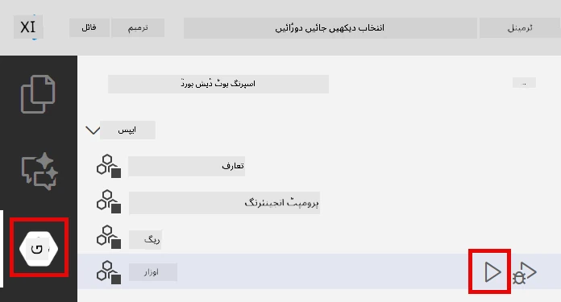
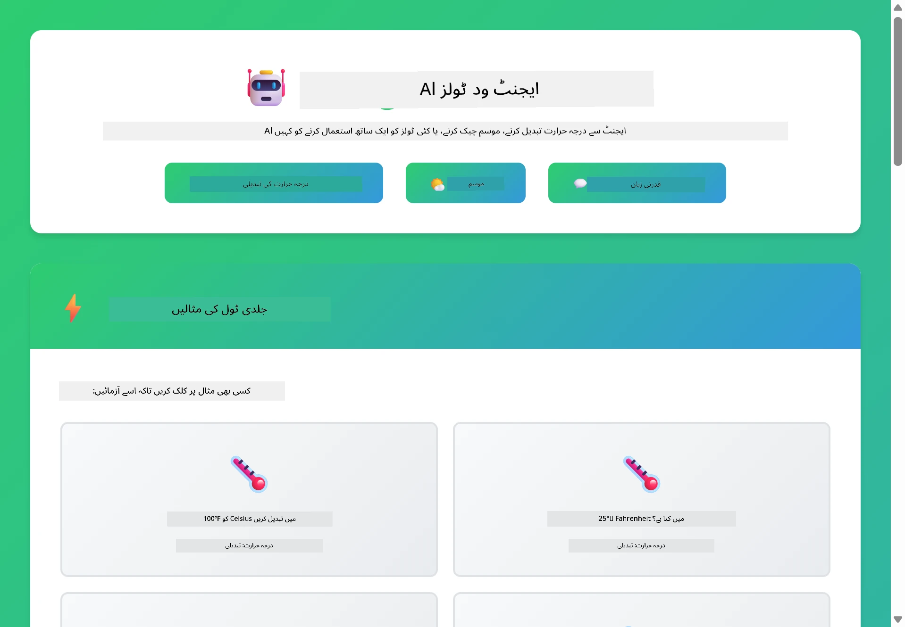
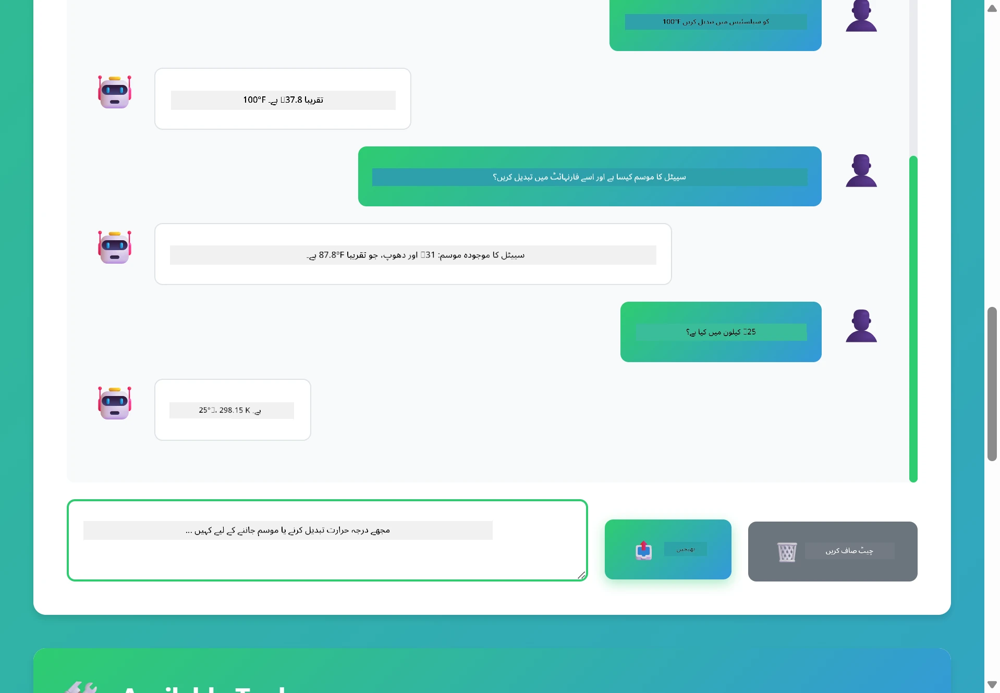

# ماڈیول 04: ٹولز کے ساتھ AI ایجنٹس

## فہرست مضامین

- [ویڈیو واک تھرو](#ویڈیو-واک-تھرو)
- [آپ کیا سیکھیں گے](#آپ-کیا-سیکھیں-گے)
- [شرائط](#شرائط)
- [ٹولز کے ساتھ AI ایجنٹس کو سمجھنا](#ٹولز-کے-ساتھ-ai-ایجنٹس-کو-سمجھنا)
- [ٹول کالنگ کیسے کام کرتی ہے](#ٹول-کالنگ-کیسے-کام-کرتی-ہے)
  - [ٹول کی وضاحتیں](#ٹول-کی-وضاحتیں)
  - [فیصلہ سازی](#فیصلہ-سازی)
  - [عملدرآمد](#عملدرآمد)
  - [جواب کی تیاری](#جواب-کی-تیاری)
  - [آرکیٹیکچر: Spring Boot آٹو وائرنگ](#آرکیٹیکچر-spring-boot-آٹو-وائرنگ)
- [ٹول چیننگ](#ٹول-چیننگ)
- [ایپلیکیشن چلائیں](#ایپلیکیشن-چلائیں)
- [ایپلیکیشن کا استعمال](#ایپلیکیشن-کا-استعمال)
  - [سادہ ٹول استعمال کرنے کی کوشش کریں](#آسان-آلات-کے-استعمال-کی-کوشش-کریں)
  - [ٹول چیننگ کا معائنہ کریں](#آلے-کے-سلسلے-کی-جانچ-کریں)
  - [گفتگو کے بہاؤ کو دیکھیں](#گفتگو-کے-بہاؤ-کو-دیکھیں)
  - [مختلف درخواستوں کے ساتھ تجربہ کریں](#مختلف-درخواستوں-کے-ساتھ-تجربہ-کریں)
- [کلیدی تصورات](#اہم-تصورات)
  - [ReAct پیٹرن (وجہ اور عمل)](#react-پیٹرن-استدلال-اور-عمل)
  - [ٹول کی وضاحتیں اہم ہیں](#آلے-کی-وضاحتیں-اہم-ہیں)
  - [سیشن مینجمنٹ](#سیشن-مینجمنٹ)
  - [خرابیوں سے نمٹنا](#ایرر-ہینڈلنگ)
- [دستیاب ٹولز](#دستیاب-آلات)
- [ٹول بیسڈ ایجنٹس کب استعمال کریں](#آلہ-پر-مبنی-ایجنٹس-کا-استعمال-کب-کریں)
- [ٹولز بمقابلہ RAG](#آلات-بمقابلہ-rag)
- [اگلے اقدامات](#اگلے-اقدامات)

## ویڈیو واک تھرو

اس لائیو سیشن کو دیکھیں جو اس ماڈیول کے ساتھ شروع کرنے کا طریقہ بتاتا ہے:

<a href="https://www.youtube.com/watch?v=O_J30kZc0rw"></a>

## آپ کیا سیکھیں گے

اب تک، آپ نے AI کے ساتھ بات چیت کرنا، مؤثر پرامٹس کی ساخت بنانا، اور جوابات کو اپنے دستاویزات میں زمین پر قائم کرنا سیکھا ہے۔ لیکن ایک بنیادی حد ابھی باقی ہے: زبان کے ماڈلز صرف متن تیار کر سکتے ہیں۔ وہ موسم کا حال معلوم نہیں کر سکتے، حساب کتاب نہیں کر سکتے، ڈیٹا بیس کو کوئری نہیں کر سکتے، یا بیرونی نظاموں کے ساتھ تعامل نہیں کر سکتے۔

ٹولز اس کو بدل دیتے ہیں۔ فنکشنز تک ماڈل کی رسائی دے کر جو وہ کال کر سکتا ہے، آپ اسے صرف متن بنانے سے ایک ایجنٹ میں تبدیل کر دیتے ہیں جو کاروائیاں کر سکتا ہے۔ ماڈل فیصلہ کرتا ہے کہ اسے کب اور کون سا ٹول چاہیے، اور کیا پیرامیٹرز بھیجنے ہیں۔ آپ کے کوڈ فنکشن کو چلاتے ہیں اور نتیجہ واپس کرتے ہیں۔ ماڈل اس نتیجے کو اپنی جواب میں شامل کرتا ہے۔

## شرائط

- مکمل شدہ [ماڈیول 01 - تعارف](../01-introduction/README.md) (Azure OpenAI وسائل تعینات کیے ہوئے)
- پچھلے ماڈیولز کی سفارش کی گئی ہے (یہ ماڈیول ٹولز بمقابلہ RAG موازنہ میں [ماڈیول 03 سے RAG تصورات](../03-rag/README.md) کی حوالہ دیتا ہے)
- `.env` فائل روٹ ڈائریکٹری میں Azure اسناد کے ساتھ (ماڈیول 01 میں `azd up` سے بنائی گئی)

> **نوٹ:** اگر آپ نے ماڈیول 01 مکمل نہیں کیا تو پہلے وہاں دی گئی تعیناتی ہدایات پر عمل کریں۔

## ٹولز کے ساتھ AI ایجنٹس کو سمجھنا

> **📝 نوٹ:** اس ماڈیول میں "ایجنٹس" سے مراد AI اسسٹنٹس ہیں جو ٹول کالنگ صلاحیتوں سے لیس ہیں۔ یہ اس سے مختلف ہے جو ہم [ماڈیول 05: MCP](../05-mcp/README.md) میں کور کریں گے، یعنی **Agentic AI** پیٹرنز (خود مختار ایجنٹس جن میں منصوبہ بندی، میموری، اور کثیر قدمی استدلال ہوتا ہے)۔

بغیر ٹولز کے، زبان کا ماڈل صرف اپنے تربیتی ڈیٹا سے متن پیدا کر سکتا ہے۔ اس سے موجودہ موسم پوچھیں، تو اسے اندازہ لگانا پڑتا ہے۔ اگر اسے ٹولز دیے جائیں تو یہ موسم کا API کال کر سکتا ہے، حساب کر سکتا ہے، یا ڈیٹا بیس کو کوئری کر سکتا ہے — پھر ان حقیقی نتائج کو اپنے جواب میں شامل کر سکتا ہے۔


*ٹولز کے بغیر ماڈل صرف اندازہ لگا سکتا ہے — ٹولز کے ساتھ یہ API کال کر سکتا ہے، حساب چلا سکتا ہے، اور حقیقی وقت کا ڈیٹا واپس کر سکتا ہے۔*

ٹولز والا AI ایجنٹ **Reasoning and Acting (ReAct)** پیٹرن کی پیروی کرتا ہے۔ ماڈل صرف جواب نہیں دیتا — یہ سوچتا ہے کہ اسے کیا چاہیے، ایک ٹول کال کر کے عمل کرتا ہے، نتیجہ دیکھتا ہے، اور پھر فیصلہ کرتا ہے کہ دوبارہ عمل کرنا ہے یا حتمی جواب دینا ہے:

1. **وجہ بنائیں** — ایجنٹ صارف کے سوال کا تجزیہ کرتا ہے اور طے کرتا ہے کہ اسے کس معلومات کی ضرورت ہے
2. **عمل کریں** — ایجنٹ مناسب ٹول کا انتخاب کرتا ہے، درست پیرامیٹرز تیار کرتا ہے، اور اسے کال کرتا ہے
3. **مشاہدہ کریں** — ایجنٹ ٹول کا آؤٹ پٹ وصول کرتا ہے اور نتیجہ کا جائزہ لیتا ہے
4. **دہرائیں یا جواب دیں** — اگر مزید ڈیٹا چاہیے، تو ایجنٹ واپس لوپ میں آتا ہے؛ ورنہ، قدرتی زبان میں جواب بناتا ہے


*ReAct سائیکل — ایجنٹ سوچتا ہے کہ کیا کرنا ہے، ٹول کال کر کے عمل کرتا ہے، نتیجہ دیکھتا ہے، اور جب تک حتمی جواب دے سکتا ہے لوپ میں رہتا ہے۔*

یہ خود بخود ہوتا ہے۔ آپ ٹولز اور ان کی وضاحتیں define کرتے ہیں۔ ماڈل فیصلہ سازی سنبھالتا ہے کہ کب اور کیسے انہیں استعمال کرنا ہے۔

## ٹول کالنگ کیسے کام کرتی ہے

### ٹول کی وضاحتیں

[WeatherTool.java](../../../04-tools/src/main/java/com/example/langchain4j/agents/tools/WeatherTool.java) | [TemperatureTool.java](../../../04-tools/src/main/java/com/example/langchain4j/agents/tools/TemperatureTool.java)

آپ فنکشنز کو واضح وضاحتوں اور پیرامیٹر کی تفصیلات کے ساتھ define کرتے ہیں۔ ماڈل ان وضاحتوں کو اپنے سسٹم پرامپٹ میں دیکھتا ہے اور سمجھتا ہے کہ ہر ٹول کیا کرتا ہے۔

```java
@Component
public class WeatherTool {
    
    @Tool("Get the current weather for a location")
    public String getCurrentWeather(@P("Location name") String location) {
        // آپ کا موسم دریافت کرنے کا منطق
        return "Weather in " + location + ": 22°C, cloudy";
    }
}

@AiService
public interface Assistant {
    String chat(@MemoryId String sessionId, @UserMessage String message);
}

// اسسٹنٹ خود بخود Spring Boot کے ذریعہ منسلک ہے:
// - ChatModel bean
// - @Component کلاسز کے تمام @Tool طریقے
// - سیشن مینجمنٹ کے لیے ChatMemoryProvider
```

نیچے دیا گیا خاکہ ہر تشریح کو توڑ کر دکھاتا ہے اور کہتا ہے کہ ہر حصہ AI کو کیسے مدد دیتا ہے یہ سمجھنے میں کہ ٹول کب کال کرنا ہے اور کون سے آرگیومینٹس پاس کرنے ہیں:


*ٹول کی تعریف کا ڈھانچہ — @Tool AI کو بتاتا ہے کہ اسے کب استعمال کرنا ہے، @P ہر پیرامیٹر کو بیان کرتا ہے، اور @AiService سب کچھ اسٹارٹ اپ پر وائر کرتا ہے۔*

> **🤖 [GitHub Copilot](https://github.com/features/copilot) چیٹ کے ساتھ آزمانا:** [`WeatherTool.java`](../../../04-tools/src/main/java/com/example/langchain4j/agents/tools/WeatherTool.java) کھولیں اور پوچھیں:
> - "اصلی موسم کا API جیسے OpenWeatherMap کو نقلی ڈیٹا کی جگہ کیسے انٹیگریٹ کروں؟"
> - "ایک اچھی ٹول وضاحت کیا ہوتی ہے جو AI کو اسے صحیح استعمال کرنے میں مدد دے؟"
> - "API غلطیوں اور ریٹ لمٹس کو ٹول امپلیمینٹیشنز میں کیسے سنبھالیں؟"

### فیصلہ سازی

جب صارف پوچھتا ہے "سیئٹل میں موسم کیسا ہے؟"، ماڈل بے ترتیب ٹول منتخب نہیں کرتا۔ یہ صارف کی نیت کو ہر ٹول کی وضاحت سے موازنہ کرتا ہے، ہر ایک کی مطابقت کے حساب سے اسکور کرتا ہے، اور بہترین میچ منتخب کرتا ہے۔ پھر ایک ساختہ فنکشن کال جنریٹ کرتا ہے جس میں درست پیرامیٹرز ہوتے ہیں — اس معاملے میں `location` کو `"Seattle"` سیٹ کرنا۔

اگر صارف کی درخواست سے کوئی ٹول میل نہیں کھاتا، تو ماڈل اپنی معلومات سے جواب دیتا ہے۔ اگر متعدد ٹولز میل کھاتے ہیں، تو وہ سب سے مخصوص کو منتخب کرتا ہے۔


*ماڈل ہر دستیاب ٹول کو صارف کے ارادے کے خلاف پرکھتا ہے اور بہترین میچ منتخب کرتا ہے — اسی لیے واضح اور مخصوص ٹول وضاحتیں لکھنا اہم ہے۔*

### عملدرآمد

[AgentService.java](../../../04-tools/src/main/java/com/example/langchain4j/agents/service/AgentService.java)

Spring Boot `@AiService` انٹرفیس کو تمام رجسٹرڈ ٹولز کے ساتھ آٹو وائر کرتا ہے، اور LangChain4j ٹول کالز کو خود بخود انجام دیتا ہے۔ پردے کے پیچھے، مکمل ٹول کال چھ مراحل سے گزرتا ہے — صارف کے قدرتی زبان کے سوال سے لے کر قدرتی زبان کے جواب تک:


*آخر سے آخر تک بہاؤ — صارف سوال کرتا ہے، ماڈل ایک ٹول منتخب کرتا ہے، LangChain4j اسے چلاتا ہے، اور ماڈل نتیجہ کو قدرتی جواب میں شامل کرتا ہے۔*

پردے کے پیچھے، `AiServices` کسی بھی ٹول کے لیے وہی ٹول کالنگ لوپ چلتا ہے — یہاں ایک سادہ `Calculator` کے ساتھ دکھایا گیا ہے۔ نیچے دیا گیا سیQUENCE ڈایاگرام دکھاتا ہے کہ اندر کیا ہوتا ہے:


*ٹول کالنگ لوپ — `AiServices` آپ کا پیغام اور ٹول اسکیمہ LLM کو بھیجتا ہے، LLM فنکشن کال جیسے `add(42, 58)` کے ساتھ جواب دیتا ہے، LangChain4j لوکل `Calculator` طریقہ چلاتا ہے، اور نتیجہ واپس حتمی جواب کے لیے دیتا ہے۔*

> **🤖 [GitHub Copilot](https://github.com/features/copilot) چیٹ کے ساتھ آزمانا:** [`AgentService.java`](../../../04-tools/src/main/java/com/example/langchain4j/agents/service/AgentService.java) کھولیں اور پوچھیں:
> - "ReAct پیٹرن کیسے کام کرتا ہے اور AI ایجنٹس کے لیے یہ موثر کیوں ہے؟"
> - "ایجنٹ کیسے فیصلہ کرتا ہے کہ کون سا ٹول استعمال کرنا ہے اور کس ترتیب میں؟"
> - "اگر ٹول کا عملدرآمد ناکام ہو جاتا ہے تو کیا ہوتا ہے — میں ایررز کو مستحکم طور پر کیسے ہینڈل کروں؟"

### جواب کی تیاری

ماڈل موسم کا ڈیٹا وصول کرتا ہے اور اسے صارف کے لیے قدرتی زبان میں جواب کی شکل دیتا ہے۔

### آرکیٹیکچر: Spring Boot آٹو وائرنگ

یہ ماڈیول LangChain4j کی Spring Boot انٹیگریشن استعمال کرتا ہے جس میں اعلان کردہ `@AiService` انٹرفیس ہوتے ہیں۔ اسٹارٹ اپ پر Spring Boot ہر `@Component` کو دریافت کرتا ہے جس میں `@Tool` طریقے ہوتے ہیں، آپ کے `ChatModel` بین، اور `ChatMemoryProvider` — پھر انہیں ایک واحد `Assistant` انٹرفیس میں بغیر کسی اضافی کوڈ کے جوڑ دیتا ہے۔


*@AiService انٹرفیس ChatModel، ٹول کمپونینٹس، اور میموری پرووائیڈر کو آپس میں جوڑتا ہے — Spring Boot یہ تمام وائرنگ خودکار طریقے سے کرتا ہے۔*

یہاں پورے درخواست کے لائف سائیکل کا سی퀞نس ڈایاگرام ہے — HTTP درخواست سے لے کر کنٹرولر، سروس، اور آٹو وائرڈ پراکسی کے ذریعے، اور واپس ٹول کے عملدرآمد تک:


*مکمل Spring Boot درخواست کا لائف سائیکل — HTTP درخواست کنٹرولر اور سروس سے آٹو وائرڈ Assistant پراکسی تک جاتی ہے، جو خودکار طریقے سے LLM اور ٹول کالز کو آراستہ کرتا ہے۔*

اس طریقے کے کلیدی فوائد:

- **Spring Boot آٹو وائرنگ** — ChatModel اور ٹولز خودکار طریقے سے داخل کیے جاتے ہیں
- **@MemoryId پیٹرن** — سیشن پر مبنی میموری مینجمنٹ خودکار
- **واحد انسٹانس** — Assistant ایک بار بنایا جاتا ہے اور کارکردگی کے لیے دوبارہ استعمال ہوتا ہے
- **ٹائپ-سیف عملدرآمد** — جاوا طریقے براہ راست ٹائپ کنورژن کے ساتھ کال ہوتے ہیں
- **کثیر مرحلہ آرکیسٹریشن** — ٹول چیننگ کو خودکار طور پر سنبھالتا ہے
- **زیرو بوائلرپلیٹ** — کوئی دستی `AiServices.builder()` کالز یا میموری ہیش میپ نہیں

متبادل طریقے (دستی `AiServices.builder()`) زیادہ کوڈ کی ضرورت رکھتے ہیں اور Spring Boot انٹیگریشن کے فوائد نہیں دیتے۔

## ٹول چیننگ

**ٹول چیننگ** — ٹول بیسڈ ایجنٹس کی اصل طاقت اس وقت دکھائی دیتی ہے جب ایک سوال کے لیے متعدد ٹولز کی ضرورت ہو۔ پوچھیں "سیئٹل میں فارن ہائیٹ میں موسم کیسا ہے؟" اور ایجنٹ خودکار طور پر دو ٹولز کو چین کرتا ہے: پہلے `getCurrentWeather` کو کال کرتا ہے تاکہ سیلسیئس میں درجہ حرارت ملے، پھر اسے `celsiusToFahrenheit` کو پاس کرتا ہے تاکہ کنورژن ہو — یہ سب ایک ہی گفتگو کے دور میں۔


*ٹول چیننگ عمل میں — ایجنٹ پہلے getCurrentWeather کال کرتا ہے، پھر سیلسیئس کے نتیجے کو celsiusToFahrenheit میں بھیجتا ہے، اور مشترکہ جواب دیتا ہے۔*

**نرمی سے ناکامی** — ایسے شہر کا موسم پوچھیں جو نقلی ڈیٹا میں نہیں ہے۔ ٹول ایرر میسج لوٹاتا ہے، اور AI اس بات کی وضاحت کرتا ہے کہ یہ مدد نہیں کر سکتا بجائے اس کے کہ ایپلیکیشن کریش ہو جائے۔ ٹولز محفوظ طریقے سے ناکام ہوتے ہیں۔ نیچے دیا گیا خاکہ دونوں طریقوں کا موازنہ کرتا ہے — مناسب خرابی سنبھالنے کے ساتھ ایجنٹ استثناء کو پکڑتا ہے اور مددگار جواب دیتا ہے، جبکہ بغیر خرابی ہینڈلنگ کے پورا ایپلیکیشن کریش ہو جاتا ہے:


*جب ٹول ناکام ہوتا ہے، تو ایجنٹ خرابی پکڑتا ہے اور کریش ہونے کی بجائے مددگار وضاحت کے ساتھ جواب دیتا ہے۔*

یہ سب ایک ہی گفتگو کے دور میں ہوتا ہے۔ ایجنٹ خود کار طریقے سے متعدد ٹول کالز کو سنبھالتا ہے۔

## ایپلیکیشن چلائیں

**تصدیق کریں کہ تعیناتی ہوگئی ہے:**

یقینی بنائیں کہ `.env` فائل روٹ ڈائریکٹری میں Azure اسناد کے ساتھ موجود ہے (جو ماڈیول 01 کے دوران بنائی گئی تھی)۔ ماڈیول ڈائریکٹری (`04-tools/`) سے یہ کمانڈ چلائیں:

**بش:**
```bash
cat ../.env  # ظاہر کرنا چاہئے AZURE_OPENAI_ENDPOINT، API_KEY، DEPLOYMENT
```

**پاور شیل:**
```powershell
Get-Content ..\.env  # دکھانا چاہیے AZURE_OPENAI_ENDPOINT، API_KEY، DEPLOYMENT
```

**ایپلیکیشن شروع کریں:**

> **نوٹ:** اگر آپ نے پہلے سے سارے ایپلیکیشنز کو روٹ ڈائریکٹری سے `./start-all.sh` کے ذریعے شروع کیا ہے (جیسا کہ ماڈیول 01 میں بیان کیا گیا ہے)، تو یہ ماڈیول پہلے ہی پورٹ 8084 پر چل رہا ہے۔ آپ نیچے دیے گئے اسٹریٹ کمانڈز کو چھوڑ کر براہ راست http://localhost:8084 پر جا سکتے ہیں۔

**اختیار 1: Spring Boot ڈیش بورڈ کا استعمال (VS Code صارفین کے لیے سفارش کی گئی)**

ڈیولپمنٹ کنٹینر میں Spring Boot ڈیش بورڈ ایکسٹینشن شامل ہے، جو تمام Spring Boot ایپلیکیشنز کو منظم کرنے کے لیے بصری انٹرفیس فراہم کرتا ہے۔ آپ اسے VS Code کی بائیں جانب Activity Bar میں Spring Boot آئیکن کے طور پر دیکھ سکتے ہیں۔

Spring Boot ڈیش بورڈ سے، آپ کر سکتے ہیں:
- ورک اسپیس میں تمام دستیاب Spring Boot ایپلیکیشنز دیکھیں
- ایک کلک سے ایپلیکیشنز کو شروع/بند کریں
- ایپلیکیشن لاگز کو حقیقی وقت میں دیکھیں
- ایپلیکیشن کی حالت کی نگرانی کریں

بس "tools" کے ساتھ پلے بٹن پر کلک کریں تاکہ یہ ماڈیول شروع ہو، یا تمام ماڈیولز کو ایک ساتھ چلائیں۔

یہ رہا Spring Boot ڈیش بورڈ VS Code میں کیسا دکھتا ہے:


*VS کوڈ میں Spring Boot ڈیش بورڈ — تمام ماڈیولز کو ایک جگہ سے شروع، روکیں، اور مانیٹر کریں*

**آپشن 2: شیل اسکرپٹس کا استعمال**

تمام ویب ایپلیکیشنز (ماڈیولز 01-04) شروع کریں:

**بش:**
```bash
cd ..  # روٹ ڈائریکٹری سے
./start-all.sh
```

**پاور شیل:**
```powershell
cd ..  # جڑ ڈائریکٹری سے
.\start-all.ps1
```

یا صرف اس ماڈیول کو شروع کریں:

**بش:**
```bash
cd 04-tools
./start.sh
```

**پاور شیل:**
```powershell
cd 04-tools
.\start.ps1
```

دونوں اسکرپٹس خودکار طریقے سے روٹ `.env` فائل سے ماحول کے متغیرات لوڈ کرتے ہیں اور اگر JARs موجود نہ ہوں تو انہیں تعمیر کریں گے۔

> **نوٹ:** اگر آپ شروع کرنے سے پہلے تمام ماڈیولز کو دستی طور پر تعمیر کرنا چاہتے ہیں:
>
> **بش:**
> ```bash
> cd ..  # Go to root directory
> mvn clean package -DskipTests
> ```
>
> **پاور شیل:**
> ```powershell
> cd ..  # Go to root directory
> mvn clean package -DskipTests
> ```

اپنے براؤزر میں http://localhost:8084 کھولیں۔

**روکنے کے لیے:**

**بش:**
```bash
./stop.sh  # یہ ماڈیول فقط
# یا
cd .. && ./stop-all.sh  # تمام ماڈیولز
```

**پاور شیل:**
```powershell
.\stop.ps1  # صرف یہ ماڈیول
# یا
cd ..; .\stop-all.ps1  # تمام ماڈیولز
```

## ایپلیکیشن کا استعمال

یہ ایپلیکیشن ایک ویب انٹرفیس فراہم کرتی ہے جہاں آپ ایک AI ایجنٹ کے ساتھ تعامل کر سکتے ہیں جس کے پاس موسم اور درجہ حرارت کے کنورژن کے آلات تک رسائی ہے۔ انٹرفیس کچھ یوں نظر آتا ہے — جس میں فوری شروع کرنے کی مثالیں اور درخواست بھیجنے کے لیے چیٹ پینل شامل ہے:

<a href="images/tools-homepage.png"></a>

*AI ایجنٹ آلات کا انٹرفیس - فوری مثالیں اور آلات کے ساتھ تعامل کے لیے چیٹ انٹرفیس*

### آسان آلات کے استعمال کی کوشش کریں

ایک سیدھی سادی درخواست سے شروع کریں: "100 ڈگری فارن ہائیٹ کو سیلسیس میں تبدیل کریں"۔ ایجنٹ کو معلوم ہوتا ہے کہ اسے درجہ حرارت کے کنورژن کے آلے کی ضرورت ہے، وہ اسے درست پیرامیٹرز کے ساتھ کال کرتا ہے اور نتیجہ واپس لاتا ہے۔ دھیان دیں کہ یہ کتنا قدرتی محسوس ہوتا ہے — آپ نے یہ متعین نہیں کیا کہ کون سا آلہ استعمال کرنا ہے یا اسے کیسے کال کرنا ہے۔

### آلے کے سلسلے کی جانچ کریں

اب کچھ زیادہ پیچیدہ آزمانا: "سیئیٹل میں موسم کیسا ہے اور اسے فارن ہائیٹ میں تبدیل کریں؟" دیکھیں کہ ایجنٹ اسے قدم بہ قدم کیسے حل کرتا ہے۔ پہلے موسم معلوم کرتا ہے (جو سیلسیس واپس دیتا ہے)، پھر پہچانتا ہے کہ اسے فارن ہائیٹ میں تبدیل کرنا ہے، کنورژن آلے کو کال کرتا ہے، اور دونوں نتائج کو ایک جواب میں جوڑ دیتا ہے۔

### گفتگو کے بہاؤ کو دیکھیں

چیٹ انٹرفیس گفتگو کی تاریخ کو برقرار رکھتا ہے، جس کی مدد سے آپ کثیر مراحل کی بات چیت کر سکتے ہیں۔ آپ پچھلے تمام سوالات اور جوابات دیکھ سکتے ہیں، جس سے بات چیت کا پتہ لگانا اور سمجھنا آسان ہوتا ہے کہ ایجنٹ متعدد تبادلوں کے دوران کیسے سیاق و سباق بناتا ہے۔

<a href="images/tools-conversation-demo.png"></a>

*کئی مرحلوں کی گفتگو میں سادہ تبدیلیاں، موسم کی تلاش، اور آلے کا سلسلہ دکھایا گیا ہے*

### مختلف درخواستوں کے ساتھ تجربہ کریں

مختلف امتزاجات آزمانے کی کوشش کریں:
- موسم کی تلاش: "ٹوکیو میں موسم کیسا ہے؟"
- درجہ حرارت کے کنورژن: "25°C کیلون میں کیا ہے؟"
- مشترکہ سوالات: "پیرس کا موسم چیک کریں اور بتائیں کہ کیا یہ 20°C سے اوپر ہے"

دھیان دیں کہ ایجنٹ قدرتی زبان کیسی تشریح کرتا ہے اور اسے مناسب آلہ کالز سے کیسے میپ کرتا ہے۔

## اہم تصورات

### ReAct پیٹرن (استدلال اور عمل)

ایجنٹ استدلال (یہ فیصلہ کرنا کہ کیا کرنا ہے) اور عمل (آلات کا استعمال) کے درمیان باری باری کام کرتا ہے۔ یہ نمونہ خود مختار مسئلہ حل کرنے کا اہل بناتا ہے بجائے صرف ہدایات کے جواب دینے کے۔

### آلے کی وضاحتیں اہم ہیں

آپ کے آلے کی وضاحتوں کا معیار براہ راست اثر ڈالتا ہے کہ ایجنٹ انہیں کتنی اچھی طرح استعمال کرتا ہے۔ واضح اور مخصوص وضاحتیں ماڈل کو سمجھنے میں مدد دیتی ہیں کہ کب اور کیسے ہر آلے کو کال کرنا ہے۔

### سیشن مینجمنٹ

`@MemoryId` تشریح خود کار سیشن پر مبنی میموری مینجمنٹ کو فعال کرتی ہے۔ ہر سیشن آئی ڈی کو اپنی `ChatMemory` انسٹینس ملتی ہے جسے `ChatMemoryProvider` بین سنبھالتا ہے، تاکہ متعدد صارفین بیک وقت ایجنٹ کے ساتھ بات چیت کر سکیں بغیر ان کی گفتگو آپس میں ملے۔ ذیل میں دکھایا گیا خاکہ کہ کیسے کئی صارفین کو ان کے سیشن آئی ڈی کی بنیاد پر الگ الگ میموری اسٹورز میں بھیجا جاتا ہے:


*ہر سیشن آئی ڈی ایک الگ گفتگو کی تاریخ سے منسلک ہوتا ہے — صارفین کبھی ایک دوسرے کے پیغامات نہیں دیکھتے۔*

### ایرر ہینڈلنگ

آلات ناکام ہو سکتے ہیں — APIs کا وقت ختم ہو سکتا ہے، پیرامیٹرز غلط ہو سکتے ہیں، بیرونی خدمات بند ہو سکتی ہیں۔ پروڈکشن ایجنٹس کو ایرر ہینڈلنگ کی ضرورت ہوتی ہے تاکہ ماڈل مسائل کی وضاحت کر سکے یا متبادل کوشش کر سکے بجائے اس کے کہ پوری ایپلیکیشن کریش ہو جائے۔ جب کوئی آلہ استثناء پھینکتا ہے، LangChain4j اسے پکڑ لیتا ہے اور ماڈل کو ایرر میسج واپس بھیجتا ہے، جو پھر قدرتی زبان میں مسئلہ بیان کر سکتا ہے۔

## دستیاب آلات

ذیل میں دیا گیا خاکہ ان وسیع آلات کا منظر نامہ دکھاتا ہے جو آپ بنا سکتے ہیں۔ یہ ماڈیول موسم اور درجہ حرارت کے آلات کی مثال دیتا ہے، لیکن وہی `@Tool` پیٹرن کسی بھی جاوا میتھڈ کے لیے کام کرتا ہے — چاہے وہ ڈیٹابیس کی تلاش ہو یا ادائیگی کا عمل۔


*کوئی بھی جاوا میتھڈ جو @Tool سے تشریح شدہ ہو AI کے لیے دستیاب ہو جاتی ہے — یہ پیٹرن ڈیٹابیسز، APIs، ای میل، فائل آپریشنز، اور مزید تک پھیلا ہوا ہے۔*

## آلہ پر مبنی ایجنٹس کا استعمال کب کریں

ہر درخواست کو آلات کی ضرورت نہیں ہوتی۔ فیصلہ یہ ہوتا ہے کہ آیا AI کو بیرونی نظاموں کے ساتھ بات چیت کرنے کی ضرورت ہے یا وہ اپنی معلومات سے جواب دے سکتا ہے۔ ذیل میں گائیڈ خلاصہ کرتی ہے کہ آلات کب فائدہ مند ہوتے ہیں اور کب غیر ضروری:


*ایک فوری فیصلہ گائیڈ — آلات حقیقی وقت کا ڈیٹا، حسابات، اور کارروائیوں کے لیے ہوتے ہیں؛ عمومی علم اور تخلیقی کاموں کے لیے نہیں۔*

## آلات بمقابلہ RAG

ماڈیولز 03 اور 04 دونوں AI کی صلاحیتوں کو بڑھاتے ہیں، مگر بنیادی طور پر مختلف طریقوں سے۔ RAG ماڈل کو **علم** تک رسائی دیتا ہے دستاویزات حاصل کر کے۔ آلات ماڈل کو **عمل** کرنے کی صلاحیت دیتے ہیں فنکشنز کال کر کے۔ ذیل میں دیا گیا خاکہ ان دو طریقوں کا موازنہ کرتا ہے — ہر ورک فلو کیسے چلتا ہے اور ان کے درمیان فوائد و نقصانات:


*RAG ساکن دستاویزات سے معلومات حاصل کرتا ہے — آلات عمل انجام دیتے ہیں اور متحرک، حقیقی وقت کا ڈیٹا لاتے ہیں۔ بہت سے پروڈکشن سسٹمز دونوں کو ملاتے ہیں۔*

عملی طور پر، بہت سے پروڈکشن سسٹمز دونوں طریقے استعمال کرتے ہیں: RAG آپ کی ڈاکیومنٹیشن میں جوابات کو بنیاد فراہم کرنے کے لیے، اور آلات لائیو ڈیٹا حاصل کرنے یا آپریشنز کرنے کے لیے۔

## اگلے اقدامات

**اگلا ماڈیول:** [05-mcp - ماڈل کانٹیکسٹ پروٹوکول (MCP)](../05-mcp/README.md)

---

**نیوگیشن:** [← پچھلا: ماڈیول 03 - RAG](../03-rag/README.md) | [واپس مرکزی صفحہ](../README.md) | [اگلا: ماڈیول 05 - MCP →](../05-mcp/README.md)

---

<!-- CO-OP TRANSLATOR DISCLAIMER START -->
**ڈس کلیمر**:
یہ دستاویز AI ترجمہ سروس [Co-op Translator](https://github.com/Azure/co-op-translator) کے ذریعے ترجمہ کی گئی ہے۔ جبکہ ہم درستگی کے لیے کوشاں ہیں، براہ کرم اس بات سے آگاہ رہیں کہ خودکار ترجمے میں غلطیاں یا عدم درستیاں ہو سکتی ہیں۔ اصل دستاویز اپنے مادری زبان میں مستند ماخذ سمجھی جائے گی۔ حساس معلومات کے لیے پیشہ ور انسانی ترجمہ کی سفارش کی جاتی ہے۔ اس ترجمے کے استعمال سے پیدا ہونے والی کسی بھی غلط فہمی یا غلط تشریح کی ذمہ داری ہم قبول نہیں کرتے۔
<!-- CO-OP TRANSLATOR DISCLAIMER END -->