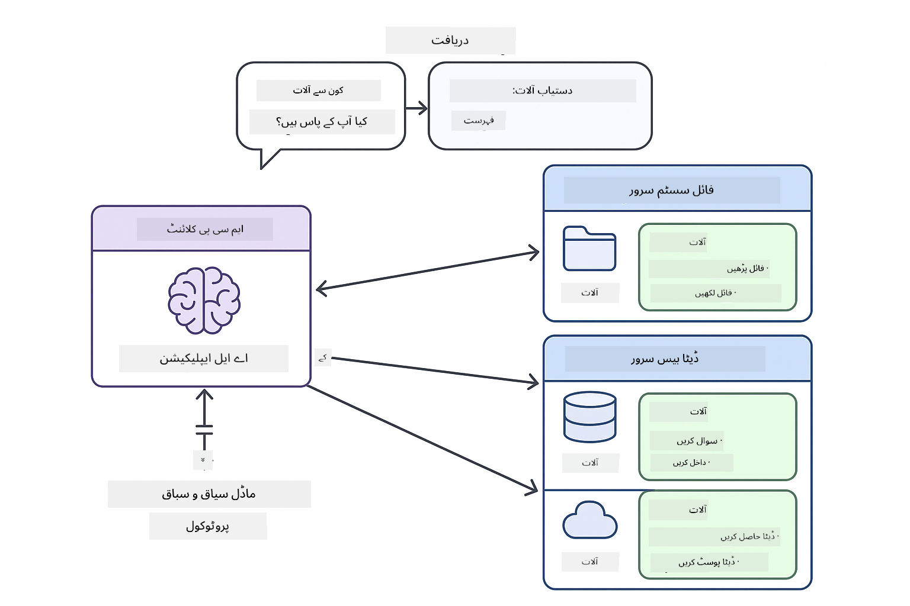
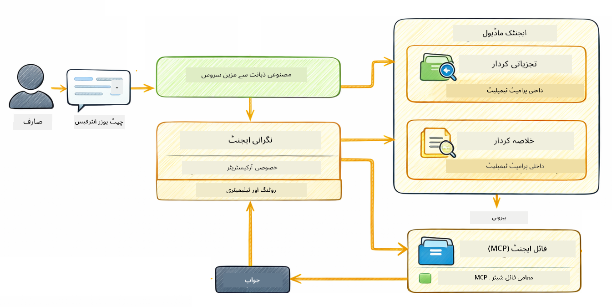

<!--
CO_OP_TRANSLATOR_METADATA:
{
  "original_hash": "f89f4c106d110e4943c055dd1a2f1dff",
  "translation_date": "2025-12-30T20:47:11+00:00",
  "source_file": "05-mcp/README.md",
  "language_code": "ur"
}
-->
# ماڈیول 05: ماڈل کانٹیکسٹ پروٹوکول (MCP)

## مواد کی فہرست

- [آپ کیا سیکھیں گے](../../../05-mcp)
- [MCP کیا ہے؟](../../../05-mcp)
- [MCP کیسے کام کرتا ہے](../../../05-mcp)
- [ایجنٹک ماڈیول](../../../05-mcp)
- [مثالیں چلانا](../../../05-mcp)
  - [شرائطِ لازم](../../../05-mcp)
- [فوری آغاز](../../../05-mcp)
  - [فائل آپریشنز (Stdio)](../../../05-mcp)
  - [سپروائزر ایجنٹ](../../../05-mcp)
    - [آؤٹ پٹ کو سمجھنا](../../../05-mcp)
    - [ایجنٹک ماڈیول فیچرز کی وضاحت](../../../05-mcp)
- [اہم تصورات](../../../05-mcp)
- [مبارک ہو!](../../../05-mcp)
  - [اب کیا؟](../../../05-mcp)

## آپ کیا سیکھیں گے

آپ نے مباحثاتی AI بنایا، پرامپٹس میں مہارت حاصل کی، جوابات کو دستاویزات کے ساتھ گراؤنڈ کیا، اور ٹولز کے ساتھ ایجنٹس تخلیق کیے۔ مگر یہ تمام ٹولز آپ کی مخصوص ایپلیکیشن کے لیے حسبِ ضرورت بنائے گئے تھے۔ اگر آپ اپنی AI کو ایک معیاری ٹول ماحولیاتی نظام تک رسائی دے سکیں جو کوئی بھی بنا اور شیئر کر سکے تو؟ اس ماڈیول میں، آپ سیکھیں گے کہ Model Context Protocol (MCP) اور LangChain4j کے ایجنٹک ماڈیول کے ساتھ یہ کیسے کیا جاتا ہے۔ ہم پہلے ایک سادہ MCP فائل ریڈر دکھائیں گے اور پھر بتائیں گے کہ یہ کیسے آسانی سے Supervisor Agent پیٹرن استعمال کرتے ہوئے جدید ایجنٹک ورک فلو میں ضم ہوتا ہے۔

## MCP کیا ہے؟

Model Context Protocol (MCP) بالکل یہی فراہم کرتا ہے — AI ایپلیکیشنز کے لیے خارجی ٹولز کو دریافت کرنے اور استعمال کرنے کا ایک معیاری طریقہ۔ ہر ڈیٹا سورس یا سروس کے لیے حسبِ ضرورت انٹیگریشن لکھنے کے بجائے، آپ MCP سرورز سے منسلک ہوتے ہیں جو اپنی صلاحیتوں کو ایک مستقل فارمیٹ میں ظاہر کرتے ہیں۔ آپ کا AI ایجنٹ پھر خودکار طور پر ان ٹولز کو دریافت اور استعمال کر سکتا ہے۔


*MCP سے پہلے: پیچیدہ پوائنٹ ٹو پوائنٹ انٹیگریشنز۔ MCP کے بعد: ایک پروٹوکول، لا متناہی امکانات۔*

MCP AI ڈویلپمنٹ کا ایک بنیادی مسئلہ حل کرتا ہے: ہر انٹیگریشن حسبِ ضرورت ہوتی ہے۔ GitHub تک رسائی چاہیے؟ حسبِ ضرورت کوڈ۔ فائلیں پڑھنی ہیں؟ حسبِ ضرورت کوڈ۔ ڈیٹابیس میں استفسار کرنا ہے؟ حسبِ ضرورت کوڈ۔ اور ان میں سے کوئی بھی انٹیگریشن دوسری AI ایپلیکیشنز کے ساتھ کام نہیں کرتی۔

MCP اسے معیاری بناتا ہے۔ ایک MCP سرور واضح وضاحتیں اور اسکیمہ کے ساتھ ٹولز کو ظاہر کرتا ہے۔ کوئی بھی MCP کلائنٹ کنیکٹ، دستیاب ٹولز دریافت، اور انہیں استعمال کر سکتا ہے۔ ایک بار بنائیں، ہر جگہ استعمال کریں۔



*Model Context Protocol فنِ تعمیر - معیاری ٹول دریافت اور اجرا*

## MCP کیسے کام کرتا ہے

**سرور-کلائنٹ فنِ تعمیر**

MCP ایک کلائنٹ-سرور ماڈل استعمال کرتا ہے۔ سرور ٹولز فراہم کرتے ہیں — فائلیں پڑھنا، ڈیٹابیسز میں استفسار، APIs کال کرنا۔ کلائنٹس (آپ کی AI ایپلیکیشن) سرورز سے کنیکٹ ہوتے ہیں اور ان کے ٹولز استعمال کرتے ہیں۔

To use MCP with LangChain4j, add this Maven dependency:

```xml
<dependency>
    <groupId>dev.langchain4j</groupId>
    <artifactId>langchain4j-mcp</artifactId>
    <version>${langchain4j.version}</version>
</dependency>
```

**ٹول دریافت**

جب آپ کا کلائنٹ کسی MCP سرور سے منسلک ہوتا ہے تو وہ پوچھتا ہے "آپ کے پاس کون سے ٹولز ہیں؟" سرور دستیاب ٹولز کی ایک فہرست کے ساتھ جواب دیتا ہے، ہر ایک کے ساتھ وضاحتیں اور پیرامیٹر اسکیمہ۔ آپ کا AI ایجنٹ پھر صارف کی درخواستوں کی بنیاد پر فیصلہ کر سکتا ہے کہ کون سے ٹولز استعمال کرنے ہیں۔

**ٹرانسپورٹ میکنزم**

MCP مختلف ٹرانسپورٹ میکنزمز کی حمایت کرتا ہے۔ یہ ماڈیول لوکل پروسسز کے لیے Stdio ٹرانسپورٹ کا مظاہرہ کرتا ہے:


*MCP ٹرانسپورٹ میکنزمز: ریموٹ سرورز کے لیے HTTP، لوکل پروسسز کے لیے Stdio*

**Stdio** - [StdioTransportDemo.java](../../../05-mcp/src/main/java/com/example/langchain4j/mcp/StdioTransportDemo.java)

لوکل پروسسز کے لیے۔ آپ کی ایپلیکیشن ایک سرور کو بطور سب پراسیس اسپان کرتی ہے اور اسٹینڈرڈ ان پٹ/آؤٹ پٹ کے ذریعے بات چیت کرتی ہے۔ فائل سسٹم تک رسائی یا کمانڈ لائن ٹولز کے لیے مفید۔

```java
McpTransport stdioTransport = new StdioMcpTransport.Builder()
    .command(List.of(
        npmCmd, "exec",
        "@modelcontextprotocol/server-filesystem@2025.12.18",
        resourcesDir
    ))
    .logEvents(false)
    .build();
```

> **🤖 GitHub Copilot Chat کے ساتھ آزما کر دیکھیں:** Open [`StdioTransportDemo.java`](../../../05-mcp/src/main/java/com/example/langchain4j/mcp/StdioTransportDemo.java) اور پوچھیں:
> - "Stdio ٹرانسپورٹ کیسے کام کرتا ہے اور مجھے اسے HTTP کے بجائے کب استعمال کرنا چاہیے؟"
> - "LangChain4j جن spawned MCP سرور پراسیسز کے لائف سائیکل کو کیسے منظم کرتا ہے؟"
> - "AI کو فائل سسٹم تک رسائی دینے کے سیکیورٹی مضمرات کیا ہیں؟"

## ایجنٹک ماڈیول

جبکہ MCP معیاری ٹولز فراہم کرتا ہے، LangChain4j کا **agentic module** ان ٹولز کو آرکسٹریٹ کرنے والے ایجنٹس بنانے کا ایک بیانیہ طریقہ فراہم کرتا ہے۔ `@Agent` اینوٹیشن اور `AgenticServices` آپ کو انٹرفیسز کے ذریعے ایجنٹ کے رویے کی تعریف کرنے دیتے ہیں بجائے کہ امپیریٹو کوڈ کے۔

اس ماڈیول میں، آپ **سپروائزر ایجنٹ** پیٹرن کا جائزہ لیں گے — ایجنٹک AI کا ایک جدید طریقہ جہاں ایک "سپروائزر" ایجنٹ صارف کی درخواستوں کی بنیاد پر حرکی طور پر فیصلہ کرتا ہے کہ کن سب-ایجنٹس کو بلایا جائے۔ ہم دونوں تصورات کو ملا کر ایک سب-ایجنٹ کو MCP-پاورڈ فائل رسائی کی صلاحیتیں دیں گے۔

To use the agentic module, add this Maven dependency:

```xml
<dependency>
    <groupId>dev.langchain4j</groupId>
    <artifactId>langchain4j-agentic</artifactId>
    <version>${langchain4j.mcp.version}</version>
</dependency>
```

> **⚠️ تجرباتی:** `langchain4j-agentic` ماڈیول **تجرباتی** ہے اور تبدیل ہوسکتا ہے۔ AI اسسٹنٹس بنانے کا مستحکم طریقہ `langchain4j-core` کے ساتھ حسبِ ضرورت ٹولز استعمال کرنا ہے (ماڈیول 04)۔

## مثالیں چلانا

### شرائطِ لازم

- Java 21+, Maven 3.9+
- Node.js 16+ اور npm (MCP سرورز کے لیے)
- ماحول کے متغیرات `.env` فائل میں کنفیگر کیے گئے ہوں (روٹس ڈائریکٹری سے):
  - **StdioTransportDemo کے لیے:** `GITHUB_TOKEN` (GitHub Personal Access Token)
  - **SupervisorAgentDemo کے لیے:** `AZURE_OPENAI_ENDPOINT`, `AZURE_OPENAI_API_KEY`, `AZURE_OPENAI_DEPLOYMENT` (Modules 01-04 کے مطابق)

> **نوٹ:** اگر آپ نے ابھی تک اپنے ماحول کے متغیرات سیٹ اپ نہیں کیے تو ہدایات کے لیے دیکھیں [Module 00 - Quick Start](../00-quick-start/README.md)، یا روٹ ڈائریکٹری میں `.env.example` کو `.env` میں کاپی کریں اور اپنی قدریں درج کریں۔

## فوری آغاز

**VS Code استعمال کرتے ہوئے:** Explorer میں کسی بھی ڈیمو فائل پر رائٹ-کلک کریں اور **"Run Java"** منتخب کریں، یا Run and Debug پینل سے لانچ کنفیگریشن استعمال کریں (یقینی بنائیں کہ آپ نے پہلے `.env` فائل میں اپنا ٹوکن شامل کیا ہے)۔

**Maven استعمال کرتے ہوئے:** متبادل طور پر، آپ نیچے دی گئی مثالوں کے ساتھ کمانڈ لائن سے چلا سکتے ہیں۔

### فائل آپریشنز (Stdio)

یہ لوکل سب پراسیس پر مبنی ٹولز کا مظاہرہ کرتا ہے۔

**✅ کسی پری ریکوزِٹ نہیں چاہیے** - MCP سرور خودکار طور پر اسپان ہو جاتا ہے۔

**VS Code استعمال کرتے ہوئے:** `StdioTransportDemo.java` پر رائٹ-کلک کریں اور **"Run Java"** منتخب کریں۔

**Maven استعمال کرتے ہوئے:**

**Bash:**
```bash
export GITHUB_TOKEN=your_token_here
cd 05-mcp
mvn compile exec:java -Dexec.mainClass=com.example.langchain4j.mcp.StdioTransportDemo
```

**PowerShell:**
```powershell
$env:GITHUB_TOKEN=your_token_here
cd 05-mcp
mvn --% compile exec:java -Dexec.mainClass=com.example.langchain4j.mcp.StdioTransportDemo
```

ایپلیکیشن خودکار طور پر ایک فائل سسٹم MCP سرور اسپان کرتی ہے اور ایک مقامی فائل پڑھتی ہے۔ نوٹس کریں کہ سب پراسیس مینجمنٹ آپ کے لیے کیسے سنبھالا جاتا ہے۔

**متوقع آؤٹ پٹ:**
```
Assistant response: The file provides an overview of LangChain4j, an open-source Java library
for integrating Large Language Models (LLMs) into Java applications...
```

### سپروائزر ایجنٹ




**سپروائزر ایجنٹ پیٹرن** ایجنٹک AI کی ایک **لچکدار** شکل ہے۔ روایتی متعین ورک فلو (تسلسل، لوپ، پیرالل) سے مختلف، ایک سپروائزر صارف کی درخواست کی بنیاد پر خودمختاری سے فیصلہ کرنے کے لیے ایک LLM استعمال کرتا ہے کہ کون سے ایجنٹس کو کال کرنا ہے۔

**سپروائزر کو MCP کے ساتھ ملانا:** اس مثال میں، ہم `FileAgent` کو `toolProvider(mcpToolProvider)` کے ذریعے MCP فائل سسٹم ٹولز تک رسائی دیتے ہیں۔ جب صارف "ایک فائل پڑھ کر تجزیہ کریں" کہتا ہے تو سپروائزر درخواست کا تجزیہ کرتا ہے اور ایک اجرائی منصوبہ بناتا ہے۔ پھر وہ درخواست `FileAgent` کو بھیجتا ہے، جو MCP کے `read_file` ٹول کا استعمال کرکے مواد حاصل کرتا ہے۔ سپروائزر اس مواد کو بعد میں تفسیر کے لیے `AnalysisAgent` کو منتقل کرتا ہے، اور اختیاری طور پر نتائج کو مختصر کرنے کے لیے `SummaryAgent` کو بلاتا ہے۔

یہ دکھاتا ہے کہ MCP ٹولز ایجنٹک ورک فلو میں بغیر رکاوٹ کس طرح ضم ہوتے ہیں — سپروائزر کو معلوم ہونے کی ضرورت نہیں کہ فائلیں کیسے پڑھی جاتی ہیں، بس یہ جاننا کافی ہے کہ `FileAgent` وہ کام کر سکتا ہے۔ سپروائزر مختلف قسم کی درخواستوں کے لیے حرکی طور پر مطابقت پذیری کرتا ہے اور یا تو آخر والے ایجنٹ کا جواب یا تمام آپریشنز کا خلاصہ واپس کرتا ہے۔

**Start Scripts استعمال کرنا (تجویز شدہ):**

اسٹارٹ اسکرپٹس خودکار طور پر روٹ `.env` فائل سے ماحول کے متغیرات لوڈ کرتے ہیں:

**Bash:**
```bash
cd 05-mcp
chmod +x start.sh
./start.sh
```

**PowerShell:**
```powershell
cd 05-mcp
.\start.ps1
```

**VS Code استعمال کرتے ہوئے:** `SupervisorAgentDemo.java` پر رائٹ-کلک کریں اور **"Run Java"** منتخب کریں (یقینی بنائیں کہ آپ کی `.env` فائل کنفیگر ہے)۔

**سپروائزر کیسے کام کرتا ہے:**

```java
// مخصوص صلاحیتوں کے ساتھ متعدد ایجنٹس متعین کریں
FileAgent fileAgent = AgenticServices.agentBuilder(FileAgent.class)
        .chatModel(model)
        .toolProvider(mcpToolProvider)  // فائل آپریشنز کے لیے MCP ٹولز موجود ہیں
        .build();

AnalysisAgent analysisAgent = AgenticServices.agentBuilder(AnalysisAgent.class)
        .chatModel(model)
        .build();

SummaryAgent summaryAgent = AgenticServices.agentBuilder(SummaryAgent.class)
        .chatModel(model)
        .build();

// ایک سپروائزر بنائیں جو ان ایجنٹس کو منظم کرے
SupervisorAgent supervisor = AgenticServices.supervisorBuilder()
        .chatModel(model)  // ماڈل "planner"
        .subAgents(fileAgent, analysisAgent, summaryAgent)
        .responseStrategy(SupervisorResponseStrategy.SUMMARY)
        .build();

// سپروائزر خودکار طور پر فیصلہ کرتا ہے کہ کون سے ایجنٹس کو بلانا ہے
// بس ایک قدرتی زبان میں درخواست دیں — LLM عمل درآمد کی منصوبہ بندی کرتا ہے
String response = supervisor.invoke("Read the file at /path/file.txt and analyze it");
```

مکمل امپلیمنٹیشن کے لیے دیکھیں [SupervisorAgentDemo.java](../../../05-mcp/src/main/java/com/example/langchain4j/mcp/SupervisorAgentDemo.java)۔

> **🤖 GitHub Copilot Chat کے ساتھ آزما کر دیکھیں:** Open [`SupervisorAgentDemo.java`](../../../05-mcp/src/main/java/com/example/langchain4j/mcp/SupervisorAgentDemo.java) اور پوچھیں:
> - "سپروائزر کیسے فیصلہ کرتا ہے کہ کون سے ایجنٹس کو بلایا جائے؟"
> - "سپروائزر اور Sequential ورک فلو پیٹرنز میں کیا فرق ہے؟"
> - "میں سپروائزر کی پلاننگ بیہیویئر کو کس طرح کسٹمائز کر سکتا/سکتی ہوں؟"

#### آؤٹ پٹ کو سمجھنا

جب آپ ڈیمو چلائیں گے، تو آپ سپروائزر کے ذریعے متعدد ایجنٹس کی آرکسٹریشن کا منظم واک تھرو دیکھیں گے۔ ہر سیکشن کا مطلب یہ ہے:

```
======================================================================
  SUPERVISOR AGENT DEMO
======================================================================

This demo shows how a Supervisor Agent orchestrates multiple specialized agents.
The Supervisor uses an LLM to decide which agent to call based on the task.
```

**سرخی** ڈیمو کا تعارف کرواتی ہے اور بنیادی تصور کی وضاحت کرتی ہے: سپروائزر فیصلہ کرنے کے لیے LLM استعمال کرتا ہے (ہارڈ کوڈڈ قوانین نہیں) کہ کون سے ایجنٹس کو کال کرنا ہے۔

```
--- AVAILABLE AGENTS -------------------------------------------------
  [FILE]     FileAgent     - Reads files using MCP filesystem tools
  [ANALYZE]  AnalysisAgent - Analyzes content for structure, tone, and themes
  [SUMMARY]  SummaryAgent  - Creates concise summaries of content
```

**دستیاب ایجنٹس** وہ تین مخصوص ایجنٹس دکھاتا ہے جن کا سپروائزر انتخاب کر سکتا ہے۔ ہر ایجنٹ کی ایک مخصوص صلاحیت ہوتی ہے:
- **FileAgent** MCP ٹولز استعمال کرکے فائلیں پڑھ سکتا ہے (بیرونی صلاحیت)
- **AnalysisAgent** مواد کا تجزیہ کرتا ہے (خالص LLM صلاحیت)
- **SummaryAgent** خلاصے بناتا ہے (خالص LLM صلاحیت)

```
--- USER REQUEST -----------------------------------------------------
  "Read the file at .../file.txt and analyze what it's about"
```

**صارف کی درخواست** وہ دکھاتا ہے جو پوچھا گیا تھا۔ سپروائزر کو اسے پارس کرنا ہوگا اور فیصلہ کرنا ہوگا کہ کون سے ایجنٹس کو بلایا جائے۔

```
--- SUPERVISOR ORCHESTRATION -----------------------------------------
  The Supervisor will now decide which agents to invoke and in what order...

  +-- STEP 1: Supervisor chose -> FileAgent (reading file via MCP)
  |
  |   Input: .../file.txt
  |
  |   Result: LangChain4j is an open-source Java library designed to simplify...
  +-- [OK] FileAgent (reading file via MCP) completed

  +-- STEP 2: Supervisor chose -> AnalysisAgent (analyzing content)
  |
  |   Input: LangChain4j is an open-source Java library...
  |
  |   Result: Structure: The content is organized into clear paragraphs that int...
  +-- [OK] AnalysisAgent (analyzing content) completed
```

**سپروائزر آرکسٹریشن** وہ جگہ ہے جہاں جادو ہوتا ہے۔ دیکھیں کہ:
1. سپروائزر نے **پہلے FileAgent کو منتخب کیا** کیونکہ درخواست نے "فائل پڑھیں" کا ذکر کیا تھا
2. FileAgent نے MCP کا `read_file` ٹول استعمال کرکے فائل کا مواد حاصل کیا
3. سپروائزر نے پھر **AnalysisAgent کو منتخب کیا** اور فائل کا مواد اسے دیا
4. AnalysisAgent نے ساخت، لہجہ، اور موضوعات کا تجزیہ کیا

نوٹس کریں کہ سپروائزر نے یہ فیصلے صارف کی درخواست کی بنیاد پر **خودمختارانہ** طور پر کیے — کوئی ہارڈ کوڈڈ ورک فلو نہیں!

**حتمی جواب** سپروائزر کا خلاصہ شدہ جواب ہوتا ہے، جو تمام ایجنٹس کے آؤٹ پٹس کو ملا کر تیار کیا جاتا ہے۔ مثال ایجنٹک سکوپ کو ڈمپ کرتی ہے جو ہر ایجنٹ کے ذریعے محفوظ شدہ خلاصہ اور تجزیہ کے نتائج دکھاتی ہے۔

```
--- FINAL RESPONSE ---------------------------------------------------
I read the contents of the file and analyzed its structure, tone, and key themes.
The file introduces LangChain4j as an open-source Java library for integrating
large language models...

--- AGENTIC SCOPE (Shared Memory) ------------------------------------
  Agents store their results in a shared scope for other agents to use:
  * summary: LangChain4j is an open-source Java library...
  * analysis: Structure: The content is organized into clear paragraphs that in...
```

### ایجنٹک ماڈیول فیچرز کی وضاحت

یہ مثال ایجنٹک ماڈیول کی کئی جدید خصوصیات کا مظاہرہ کرتی ہے۔ آئیے Agentic Scope اور Agent Listeners پر قریب سے نظر ڈالیں۔

**Agentic Scope** وہ مشترکہ میموری دکھاتا ہے جہاں ایجنٹس نے `@Agent(outputKey="...")` استعمال کرتے ہوئے اپنے نتائج محفوظ کیے۔ اس سے یہ ممکن ہوتا ہے:
- بعد کے ایجنٹس پہلے ایجنٹس کے آؤٹ پٹس تک رسائی حاصل کر سکیں
- سپروائزر ایک حتمی جواب ترکیب کر سکے
- آپ ہر ایجنٹ کے پیدا کردہ نتائج کا معائنہ کر سکیں

```java
ResultWithAgenticScope<String> result = supervisor.invokeWithAgenticScope(request);
AgenticScope scope = result.agenticScope();
String story = scope.readState("story");
List<AgentInvocation> history = scope.agentInvocations("analysisAgent");
```

**Agent Listeners** ایجنٹ کے اجرا کی نگرانی اور ڈیبگنگ کو فعال کرتے ہیں۔ ڈیمو میں جو قدم بہ قدم آؤٹ پٹ آپ دیکھتے ہیں وہ ایک AgentListener سے آتا ہے جو ہر ایجنٹ کی کال میں ہک ہوتا ہے:
- **beforeAgentInvocation** - جب سپروائزر ایک ایجنٹ منتخب کرتا ہے تو کال ہوتا ہے، آپ دیکھ سکتے ہیں کہ کون سا ایجنٹ کیوں منتخب ہوا
- **afterAgentInvocation** - جب کوئی ایجنٹ مکمل ہوتا ہے تو کال ہوتا ہے، اور اس کا نتیجہ دکھاتا ہے
- **inheritedBySubagents** - جب true ہو تو، لسٹنر ہائیرارکی میں موجود تمام ایجنٹس کی نگرانی کرتا ہے

```java
AgentListener monitor = new AgentListener() {
    private int step = 0;
    
    @Override
    public void beforeAgentInvocation(AgentRequest request) {
        step++;
        System.out.println("  +-- STEP " + step + ": " + request.agentName());
    }
    
    @Override
    public void afterAgentInvocation(AgentResponse response) {
        System.out.println("  +-- [OK] " + response.agentName() + " completed");
    }
    
    @Override
    public boolean inheritedBySubagents() {
        return true; // تمام ذیلی ایجنٹس تک پھیلائیں
    }
};
```

اس کے علاوہ سپروائزر پیٹرن کے، `langchain4j-agentic` ماڈیول متعدد طاقتور ورک فلو پیٹرنز اور فیچرز فراہم کرتا ہے:

| Pattern | Description | Use Case |
|---------|-------------|----------|
| **Sequential** | ایجنٹس کو ترتیب سے چلائیں، آؤٹ پٹ اگلے کو منتقل ہو | پائپ لائنز: تحقیق → تجزیہ → رپورٹ |
| **Parallel** | ایجنٹس کو بیک وقت چلائیں | آزاد کام: موسم + خبریں + اسٹاکس |
| **Loop** | شرط پوری ہونے تک تکرار کریں | معیار اسکورنگ: بہتر کریں جب تک اسکور ≥ 0.8 |
| **Conditional** | شرائط کی بنیاد پر راہ متعین کریں | درجہ بندی → ماہر ایجنٹ کو بھیجنا |
| **Human-in-the-Loop** | انسانی چیک پوائنٹس شامل کریں | منظوری کے ورک فلو، مواد کا جائزہ |

## اہم تصورات

**MCP** مثالی ہے جب آپ موجودہ ٹول ماحولیاتی نظام سے فائدہ اٹھانا چاہتے ہیں، ایسے ٹولز بنانا چاہتے ہیں جنہیں متعدد ایپلیکیشنز شیئر کر سکیں، تھرڈ پارٹی سروسز کو معیاری پروٹوکول کے ساتھ ضم کرنا چاہتے ہیں، یا ٹول کے امپلیمنٹس کو کوڈ تبدیل کیے بغیر تبدیل کرنا چاہتے ہیں۔

**ایجنٹک ماڈیول** تب بہترین کام کرتا ہے جب آپ `@Agent` اینوٹیشنز کے ساتھ بیانیہ ایجنٹ تعریفیں چاہتے ہیں، ورک فلو آرکسٹریشن (تسلسل، لوپ، پیرالل) درکار ہو، انٹرفیس-بیسڈ ایجنٹ ڈیزائن کو امپیریٹو کوڈ پر ترجیح دیں، یا متعدد ایجنٹس کو ملا کر وہ آؤٹ پٹس شیئر کر رہے ہوں جنہیں `outputKey` کے ذریعے ایک ساتھ استعمال کیا جاتا ہے۔

**سپروائزر ایجنٹ پیٹرن** اس وقت چمکتا ہے جب ورک فلو پیشگی متوقع نہ ہو اور آپ چاہیں کہ LLM فیصلہ کرے، جب آپ کے پاس متعدد مخصوص ایجنٹس ہوں جنہیں حرکی آرکسٹریشن درکار ہو، جب آپ مباحثاتی سسٹمز بنا رہے ہوں جو مختلف صلاحیتوں کی طرف روٹ کرتے ہیں، یا جب آپ سب سے زیادہ لچکدار، موافق ایجنٹ رویہ چاہتے ہوں۔

## مبارک ہو!

آپ نے LangChain4j for Beginners کورس مکمل کر لیا ہے۔ آپ نے سیکھا:

- کس طرح میموری کے ساتھ مباحثاتی AI بنانی ہے (Module 01)
- مختلف کاموں کے لیے پرامپٹ انجینئرنگ کے پیٹرنز (Module 02)
- RAG کے ذریعے آپ کی دستاویزات میں جوابات کو گراؤنڈ کرنا (Module 03)
- کسٹم ٹولز کے ساتھ بنیادی AI ایجنٹس (اسسٹنٹس) بنانا (Module 04)
- LangChain4j MCP اور Agentic ماڈیولز کے ساتھ معیاری ٹولز کو مربوط کرنا (ماڈیول 05)

### اگلا کیا ہے؟

ماڈیولز مکمل کرنے کے بعد، LangChain4j کے ٹیسٹنگ تصورات کو عملی طور پر دیکھنے کے لیے [جانچ گائیڈ](../docs/TESTING.md) دیکھیں۔

**سرکاری وسائل:**
- [LangChain4j Documentation](https://docs.langchain4j.dev/) - مکمل رہنما اور API حوالہ
- [LangChain4j GitHub](https://github.com/langchain4j/langchain4j) - ماخذ کوڈ اور مثالیں
- [LangChain4j Tutorials](https://docs.langchain4j.dev/tutorials/) - مختلف استعمال کے لیے مرحلہ وار ٹیوٹوریلز

اس کورس کو مکمل کرنے کے لیے آپ کا شکریہ!

---

**نیویگیشن:** [← پچھلا: ماڈیول 04 - ٹولز](../04-tools/README.md) | [واپس مرکزی صفحہ](../README.md)

---

<!-- CO-OP TRANSLATOR DISCLAIMER START -->
نوٹس برائے عدم ذمہ داری:
یہ دستاویز اے آئی ترجمہ سروس Co-op Translator (https://github.com/Azure/co-op-translator) کے ذریعے ترجمہ کی گئی ہے۔ ہم درستگی کی کوشش کرتے ہیں، تاہم براہِ کرم نوٹ کریں کہ خودکار تراجم میں غلطیاں یا عدم درستیاں ہو سکتی ہیں۔ اصل دستاویز اپنی مادری زبان میں معتبر ماخذ سمجھی جانی چاہیے۔ اہم معلومات کے لیے پیشہ ور انسانی ترجمہ تجویز کیا جاتا ہے۔ اس ترجمے کے استعمال سے پیدا ہونے والی کسی بھی غلط فہمی یا غلط تعبیر کی ذمہ داری ہم قبول نہیں کرتے۔
<!-- CO-OP TRANSLATOR DISCLAIMER END -->