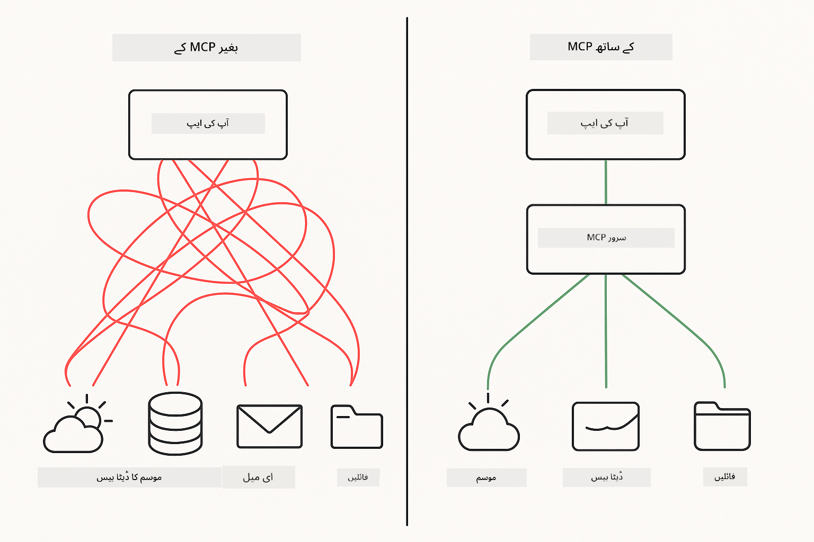

<!--
CO_OP_TRANSLATOR_METADATA:
{
  "original_hash": "c25ec1f10ef156c53e190cdf8b0711ab",
  "translation_date": "2025-12-13T17:39:05+00:00",
  "source_file": "05-mcp/README.md",
  "language_code": "ur"
}
-->
# ماڈیول 05: ماڈل کانٹیکسٹ پروٹوکول (MCP)

## فہرست مضامین

- [آپ کیا سیکھیں گے](../../../05-mcp)
- [MCP کو سمجھنا](../../../05-mcp)
- [MCP کیسے کام کرتا ہے](../../../05-mcp)
  - [سرور-کلائنٹ آرکیٹیکچر](../../../05-mcp)
  - [ٹول کی دریافت](../../../05-mcp)
  - [ٹرانسپورٹ میکانزم](../../../05-mcp)
- [ضروریات](../../../05-mcp)
- [یہ ماڈیول کیا کور کرتا ہے](../../../05-mcp)
- [فوری آغاز](../../../05-mcp)
  - [مثال 1: ریموٹ کیلکولیٹر (Streamable HTTP)](../../../05-mcp)
  - [مثال 2: فائل آپریشنز (Stdio)](../../../05-mcp)
  - [مثال 3: گٹ تجزیہ (Docker)](../../../05-mcp)
- [اہم تصورات](../../../05-mcp)
  - [ٹرانسپورٹ کا انتخاب](../../../05-mcp)
  - [ٹول کی دریافت](../../../05-mcp)
  - [سیشن مینجمنٹ](../../../05-mcp)
  - [کراس-پلیٹ فارم غور و فکر](../../../05-mcp)
- [MCP کب استعمال کریں](../../../05-mcp)
- [MCP ماحولیاتی نظام](../../../05-mcp)
- [مبارک ہو!](../../../05-mcp)
  - [اگلا کیا ہے؟](../../../05-mcp)
- [مسائل کا حل](../../../05-mcp)

## آپ کیا سیکھیں گے

آپ نے بات چیت کرنے والی AI بنائی ہے، پرامپٹس میں مہارت حاصل کی ہے، جوابات کو دستاویزات میں گراؤنڈ کیا ہے، اور ٹولز کے ساتھ ایجنٹس بنائے ہیں۔ لیکن یہ تمام ٹولز آپ کی مخصوص ایپلیکیشن کے لیے کسٹم بنائے گئے تھے۔ اگر آپ اپنی AI کو ایک معیاری ٹولز کے ماحولیاتی نظام تک رسائی دے سکیں جو کوئی بھی بنا اور شیئر کر سکتا ہے تو کیا ہوگا؟

ماڈل کانٹیکسٹ پروٹوکول (MCP) بالکل یہی فراہم کرتا ہے - AI ایپلیکیشنز کے لیے بیرونی ٹولز کو دریافت کرنے اور استعمال کرنے کا ایک معیاری طریقہ۔ ہر ڈیٹا سورس یا سروس کے لیے کسٹم انٹیگریشن لکھنے کے بجائے، آپ MCP سرورز سے جڑتے ہیں جو اپنی صلاحیتوں کو ایک مستقل فارمیٹ میں ظاہر کرتے ہیں۔ آپ کا AI ایجنٹ پھر خود بخود ان ٹولز کو دریافت اور استعمال کر سکتا ہے۔



*MCP سے پہلے: پیچیدہ پوائنٹ ٹو پوائنٹ انٹیگریشنز۔ MCP کے بعد: ایک پروٹوکول، لا محدود امکانات۔*

## MCP کو سمجھنا

MCP AI ڈیولپمنٹ میں ایک بنیادی مسئلہ حل کرتا ہے: ہر انٹیگریشن کسٹم ہوتی ہے۔ GitHub تک رسائی چاہیے؟ کسٹم کوڈ۔ فائلیں پڑھنی ہیں؟ کسٹم کوڈ۔ ڈیٹا بیس سے سوال کرنا ہے؟ کسٹم کوڈ۔ اور یہ انٹیگریشنز دوسرے AI ایپلیکیشنز کے ساتھ کام نہیں کرتے۔

MCP اسے معیاری بناتا ہے۔ ایک MCP سرور ٹولز کو واضح وضاحتوں اور اسکیموں کے ساتھ ظاہر کرتا ہے۔ کوئی بھی MCP کلائنٹ جڑ سکتا ہے، دستیاب ٹولز دریافت کر سکتا ہے، اور انہیں استعمال کر سکتا ہے۔ ایک بار بنائیں، ہر جگہ استعمال کریں۔


*ماڈل کانٹیکسٹ پروٹوکول آرکیٹیکچر - معیاری ٹول دریافت اور عملدرآمد*

## MCP کیسے کام کرتا ہے

**سرور-کلائنٹ آرکیٹیکچر**

MCP کلائنٹ-سرور ماڈل استعمال کرتا ہے۔ سرورز ٹولز فراہم کرتے ہیں - فائلیں پڑھنا، ڈیٹا بیس سے سوال کرنا، APIs کال کرنا۔ کلائنٹس (آپ کی AI ایپلیکیشن) سرورز سے جڑتے ہیں اور ان کے ٹولز استعمال کرتے ہیں۔

**ٹول کی دریافت**

جب آپ کا کلائنٹ MCP سرور سے جڑتا ہے، تو وہ پوچھتا ہے "آپ کے پاس کون سے ٹولز ہیں؟" سرور دستیاب ٹولز کی فہرست کے ساتھ جواب دیتا ہے، ہر ایک کے ساتھ وضاحتیں اور پیرامیٹر اسکیمے۔ آپ کا AI ایجنٹ پھر صارف کی درخواست کی بنیاد پر فیصلہ کرتا ہے کہ کون سے ٹولز استعمال کرنے ہیں۔

**ٹرانسپورٹ میکانزم**

MCP دو ٹرانسپورٹ میکانزمز کی وضاحت کرتا ہے: ریموٹ سرورز کے لیے HTTP، اور مقامی عمل کے لیے Stdio (جس میں Docker کنٹینرز شامل ہیں):


*MCP ٹرانسپورٹ میکانزمز: ریموٹ سرورز کے لیے HTTP، مقامی عمل کے لیے Stdio (جس میں Docker کنٹینرز شامل ہیں)*

**Streamable HTTP** - [StreamableHttpDemo.java](../../../05-mcp/src/main/java/com/example/langchain4j/mcp/StreamableHttpDemo.java)

ریموٹ سرورز کے لیے۔ آپ کی ایپلیکیشن نیٹ ورک پر کہیں چلنے والے سرور کو HTTP درخواستیں بھیجتی ہے۔ حقیقی وقت مواصلات کے لیے Server-Sent Events استعمال کرتا ہے۔

```java
McpTransport httpTransport = new StreamableHttpMcpTransport.Builder()
    .url("http://localhost:3001/mcp")
    .timeout(Duration.ofSeconds(60))
    .logRequests(true)
    .logResponses(true)
    .build();
```

> **🤖 [GitHub Copilot](https://github.com/features/copilot) چیٹ کے ساتھ آزمائیں:** [`StreamableHttpDemo.java`](../../../05-mcp/src/main/java/com/example/langchain4j/mcp/StreamableHttpDemo.java) کھولیں اور پوچھیں:
> - "MCP براہ راست ٹول انٹیگریشن سے کیسے مختلف ہے جیسا کہ ماڈیول 04 میں ہے؟"
> - "ایپلیکیشنز کے درمیان ٹول شیئرنگ کے لیے MCP کے استعمال کے کیا فوائد ہیں؟"
> - "MCP سرورز سے کنکشن کی ناکامی یا ٹائم آؤٹ کو کیسے ہینڈل کیا جائے؟"

**Stdio** - [StdioTransportDemo.java](../../../05-mcp/src/main/java/com/example/langchain4j/mcp/StdioTransportDemo.java)

مقامی عمل کے لیے۔ آپ کی ایپلیکیشن ایک سرور کو سب پروسیس کے طور پر شروع کرتی ہے اور معیاری ان پٹ/آؤٹ پٹ کے ذریعے بات چیت کرتی ہے۔ فائل سسٹم تک رسائی یا کمانڈ لائن ٹولز کے لیے مفید۔

```java
McpTransport stdioTransport = new StdioMcpTransport.Builder()
    .command(List.of(
        npmCmd, "exec",
        "@modelcontextprotocol/server-filesystem@0.6.2",
        resourcesDir
    ))
    .logEvents(false)
    .build();
```

> **🤖 [GitHub Copilot](https://github.com/features/copilot) چیٹ کے ساتھ آزمائیں:** [`StdioTransportDemo.java`](../../../05-mcp/src/main/java/com/example/langchain4j/mcp/StdioTransportDemo.java) کھولیں اور پوچھیں:
> - "Stdio ٹرانسپورٹ کیسے کام کرتا ہے اور مجھے کب HTTP کے مقابلے میں اسے استعمال کرنا چاہیے؟"
> - "LangChain4j MCP سرور کے عمل کی زندگی کے چکر کو کیسے منظم کرتا ہے؟"
> - "AI کو فائل سسٹم تک رسائی دینے کے کیا سیکیورٹی مضمرات ہیں؟"

**Docker (Stdio استعمال کرتا ہے)** - [GitRepositoryAnalyzer.java](../../../05-mcp/src/main/java/com/example/langchain4j/mcp/GitRepositoryAnalyzer.java)

کنٹینرائزڈ سروسز کے لیے۔ `docker run` کے ذریعے Docker کنٹینر سے بات چیت کے لیے stdio ٹرانسپورٹ استعمال کرتا ہے۔ پیچیدہ انحصارات یا الگ تھلگ ماحول کے لیے اچھا۔

```java
McpTransport dockerTransport = new StdioMcpTransport.Builder()
    .command(List.of(
        "docker", "run",
        "-e", "GITHUB_PERSONAL_ACCESS_TOKEN=" + System.getenv("GITHUB_TOKEN"),
        "-v", volumeMapping,
        "-i", "mcp/git"
    ))
    .logEvents(true)
    .build();
```

> **🤖 [GitHub Copilot](https://github.com/features/copilot) چیٹ کے ساتھ آزمائیں:** [`GitRepositoryAnalyzer.java`](../../../05-mcp/src/main/java/com/example/langchain4j/mcp/GitRepositoryAnalyzer.java) کھولیں اور پوچھیں:
> - "Docker ٹرانسپورٹ MCP سرورز کو کیسے الگ کرتا ہے اور اس کے کیا فوائد ہیں؟"
> - "میزبان اور MCP کنٹینرز کے درمیان ڈیٹا شیئر کرنے کے لیے والیوم ماؤنٹس کو کیسے ترتیب دوں؟"
> - "پیداوار میں Docker پر مبنی MCP سرور کے زندگی کے چکر کو منظم کرنے کے بہترین طریقے کیا ہیں؟"

## مثالیں چلانا

### ضروریات

- جاوا 21+، میون 3.9+
- Node.js 16+ اور npm (MCP سرورز کے لیے)
- **Docker Desktop** - مثال 3 کے لیے **چل رہا ہونا ضروری ہے** (صرف انسٹال نہیں)
- GitHub پرسنل ایکسس ٹوکن `.env` فائل میں ترتیب دیا ہوا (ماڈیول 00 سے)

> **نوٹ:** اگر آپ نے ابھی تک اپنا GitHub ٹوکن سیٹ اپ نہیں کیا، تو ہدایات کے لیے [ماڈیول 00 - فوری آغاز](../00-quick-start/README.md) دیکھیں۔

> **⚠️ Docker صارفین:** مثال 3 چلانے سے پہلے، `docker ps` کے ساتھ Docker Desktop چل رہا ہے یہ تصدیق کریں۔ اگر کنکشن کی غلطیاں آئیں، تو Docker Desktop شروع کریں اور تقریباً 30 سیکنڈ انتظار کریں۔

## فوری آغاز

**VS Code استعمال کرتے ہوئے:** ایکسپلورر میں کسی بھی ڈیمو فائل پر رائٹ کلک کریں اور **"Run Java"** منتخب کریں، یا رن اینڈ ڈیبگ پینل سے لانچ کنفیگریشنز استعمال کریں (یقینی بنائیں کہ آپ نے پہلے `.env` فائل میں اپنا ٹوکن شامل کیا ہے)۔

**میون استعمال کرتے ہوئے:** متبادل طور پر، آپ نیچے دی گئی مثالوں کے ساتھ کمانڈ لائن سے چلا سکتے ہیں۔

**⚠️ اہم:** کچھ مثالوں کے لیے ضروریات ہوتی ہیں (جیسے MCP سرور شروع کرنا یا Docker امیجز بنانا)۔ چلانے سے پہلے ہر مثال کی ضروریات چیک کریں۔

### مثال 1: ریموٹ کیلکولیٹر (Streamable HTTP)

یہ نیٹ ورک پر مبنی ٹول انٹیگریشن دکھاتا ہے۔

**⚠️ شرط:** آپ کو پہلے MCP سرور شروع کرنا ہوگا (نیچے ٹرمینل 1 دیکھیں)۔

**ٹرمینل 1 - MCP سرور شروع کریں:**

**Bash:**
```bash
git clone https://github.com/modelcontextprotocol/servers.git
cd servers/src/everything
npm install
node dist/streamableHttp.js
```

**PowerShell:**
```powershell
git clone https://github.com/modelcontextprotocol/servers.git
cd servers/src/everything
npm install
node dist/streamableHttp.js
```

**ٹرمینل 2 - مثال چلائیں:**

**VS Code استعمال کرتے ہوئے:** `StreamableHttpDemo.java` پر رائٹ کلک کریں اور **"Run Java"** منتخب کریں۔

**میون استعمال کرتے ہوئے:**

**Bash:**
```bash
export GITHUB_TOKEN=your_token_here
cd 05-mcp
mvn compile exec:java -Dexec.mainClass=com.example.langchain4j.mcp.StreamableHttpDemo
```

**PowerShell:**
```powershell
$env:GITHUB_TOKEN=your_token_here
cd 05-mcp
mvn --% compile exec:java -Dexec.mainClass=com.example.langchain4j.mcp.StreamableHttpDemo
```

ایجنٹ کو دستیاب ٹولز دریافت کرتے دیکھیں، پھر کیلکولیٹر کا استعمال کرتے ہوئے جمع کریں۔

### مثال 2: فائل آپریشنز (Stdio)

یہ مقامی سب پروسیس پر مبنی ٹولز دکھاتا ہے۔

**✅ کوئی شرط نہیں** - MCP سرور خود بخود شروع ہو جاتا ہے۔

**VS Code استعمال کرتے ہوئے:** `StdioTransportDemo.java` پر رائٹ کلک کریں اور **"Run Java"** منتخب کریں۔

**میون استعمال کرتے ہوئے:**

**Bash:**
```bash
export GITHUB_TOKEN=your_token_here
cd 05-mcp
mvn compile exec:java -Dexec.mainClass=com.example.langchain4j.mcp.StdioTransportDemo
```

**PowerShell:**
```powershell
$env:GITHUB_TOKEN=your_token_here
cd 05-mcp
mvn --% compile exec:java -Dexec.mainClass=com.example.langchain4j.mcp.StdioTransportDemo
```

ایپلیکیشن خود بخود فائل سسٹم MCP سرور شروع کرتی ہے اور ایک مقامی فائل پڑھتی ہے۔ دیکھیں کہ سب پروسیس مینجمنٹ آپ کے لیے کیسے ہینڈل کی جاتی ہے۔

**متوقع آؤٹ پٹ:**
```
Assistant response: The content of the file is "Kaboom!".
```

### مثال 3: گٹ تجزیہ (Docker)

یہ کنٹینرائزڈ ٹول سرورز دکھاتا ہے۔

**⚠️ ضروریات:** 
1. **Docker Desktop چل رہا ہونا چاہیے** (صرف انسٹال نہیں)
2. **ونڈوز صارفین:** WSL 2 موڈ کی سفارش کی جاتی ہے (Docker Desktop Settings → General → "Use the WSL 2 based engine")۔ Hyper-V موڈ کے لیے دستی فائل شیئرنگ کنفیگریشن ضروری ہے۔
3. آپ کو پہلے Docker امیج بنانا ہوگا (نیچے ٹرمینل 1 دیکھیں)

**Docker چل رہا ہے یہ تصدیق کریں:**

**Bash:**
```bash
docker ps  # کنٹینر کی فہرست دکھانی چاہیے، غلطی نہیں
```

**PowerShell:**
```powershell
docker ps  # کنٹینر کی فہرست دکھانی چاہیے، غلطی نہیں
```

اگر آپ کو "Cannot connect to Docker daemon" یا "The system cannot find the file specified" جیسی غلطی نظر آئے، تو Docker Desktop شروع کریں اور تقریباً 30 سیکنڈ انتظار کریں۔

**مسائل کا حل:**
- اگر AI خالی ریپوزیٹری یا کوئی فائل نہیں بتاتا، تو والیوم ماؤنٹ (`-v`) کام نہیں کر رہا۔
- **ونڈوز Hyper-V صارفین:** پروجیکٹ ڈائریکٹری کو Docker Desktop Settings → Resources → File sharing میں شامل کریں، پھر Docker Desktop دوبارہ شروع کریں۔
- **تجویز کردہ حل:** خودکار فائل شیئرنگ کے لیے WSL 2 موڈ پر سوئچ کریں (Settings → General → "Use the WSL 2 based engine" فعال کریں)۔

**ٹرمینل 1 - Docker امیج بنائیں:**

**Bash:**
```bash
cd servers/src/git
docker build -t mcp/git .
```

**PowerShell:**
```powershell
cd servers/src/git
docker build -t mcp/git .
```

**ٹرمینل 2 - تجزیہ کار چلائیں:**

**VS Code استعمال کرتے ہوئے:** `GitRepositoryAnalyzer.java` پر رائٹ کلک کریں اور **"Run Java"** منتخب کریں۔

**میون استعمال کرتے ہوئے:**

**Bash:**
```bash
export GITHUB_TOKEN=your_token_here
cd 05-mcp
mvn compile exec:java -Dexec.mainClass=com.example.langchain4j.mcp.GitRepositoryAnalyzer
```

**PowerShell:**
```powershell
$env:GITHUB_TOKEN=your_token_here
cd 05-mcp
mvn --% compile exec:java -Dexec.mainClass=com.example.langchain4j.mcp.GitRepositoryAnalyzer
```

ایپلیکیشن Docker کنٹینر لانچ کرتی ہے، آپ کا ریپوزیٹری ماؤنٹ کرتی ہے، اور AI ایجنٹ کے ذریعے ریپوزیٹری کی ساخت اور مواد کا تجزیہ کرتی ہے۔

## اہم تصورات

**ٹرانسپورٹ کا انتخاب**

اپنے ٹولز کی جگہ کے مطابق انتخاب کریں:
- ریموٹ سروسز → Streamable HTTP
- مقامی فائل سسٹم → Stdio
- پیچیدہ انحصارات → Docker

**ٹول کی دریافت**

MCP کلائنٹس جڑتے وقت خود بخود دستیاب ٹولز دریافت کرتے ہیں۔ آپ کا AI ایجنٹ ٹول کی وضاحتیں دیکھتا ہے اور صارف کی درخواست کی بنیاد پر فیصلہ کرتا ہے کہ کون سے ٹولز استعمال کرنے ہیں۔

**سیشن مینجمنٹ**

Streamable HTTP ٹرانسپورٹ سیشنز کو برقرار رکھتا ہے، جس سے ریموٹ سرورز کے ساتھ ریاستی تعاملات ممکن ہوتے ہیں۔ Stdio اور Docker ٹرانسپورٹس عام طور پر بے ریاست ہوتے ہیں۔

**کراس-پلیٹ فارم غور و فکر**

مثالیں پلیٹ فارم کے فرق کو خود بخود ہینڈل کرتی ہیں (ونڈوز بمقابلہ یونکس کمانڈ کے فرق، Docker کے لیے راستے کی تبدیلیاں)۔ یہ مختلف ماحول میں پیداوار کی تعیناتی کے لیے اہم ہے۔

## MCP کب استعمال کریں

**MCP استعمال کریں جب:**
- آپ موجودہ ٹول ماحولیاتی نظام سے فائدہ اٹھانا چاہتے ہیں
- ایسے ٹولز بنا رہے ہیں جو متعدد ایپلیکیشنز استعمال کریں گی
- تیسری پارٹی کی خدمات کو معیاری پروٹوکولز کے ساتھ انٹیگریٹ کر رہے ہیں
- آپ کو بغیر کوڈ تبدیلی کے ٹول امپلیمنٹیشنز تبدیل کرنے کی ضرورت ہو

**کسٹم ٹولز (ماڈیول 04) استعمال کریں جب:**
- ایپلیکیشن مخصوص فعالیت بنا رہے ہوں
- کارکردگی اہم ہو (MCP اضافی اوور ہیڈ دیتا ہے)
- آپ کے ٹولز سادہ ہوں اور دوبارہ استعمال نہ ہوں
- آپ کو عملدرآمد پر مکمل کنٹرول چاہیے ہو

## MCP ماحولیاتی نظام

ماڈل کانٹیکسٹ پروٹوکول ایک کھلا معیار ہے جس کا ماحولیاتی نظام بڑھ رہا ہے:

- عام کاموں کے لیے سرکاری MCP سرورز (فائل سسٹم، Git، ڈیٹا بیس)
- مختلف خدمات کے لیے کمیونٹی کی جانب سے سرورز
- معیاری ٹول وضاحتیں اور اسکیمے
- کراس-فریم ورک مطابقت (کسی بھی MCP کلائنٹ کے ساتھ کام کرتا ہے)

یہ معیاری بنانا مطلب ہے کہ ایک AI ایپلیکیشن کے لیے بنائے گئے ٹولز دوسرے کے ساتھ کام کرتے ہیں، صلاحیتوں کا ایک مشترکہ ماحولیاتی نظام بناتے ہیں۔

## مبارک ہو!

آپ نے LangChain4j برائے مبتدی کورس مکمل کر لیا ہے۔ آپ نے سیکھا:

- میموری کے ساتھ بات چیت کرنے والی AI کیسے بنائیں (ماڈیول 01)
- مختلف کاموں کے لیے پرامپٹ انجینئرنگ پیٹرنز (ماڈیول 02)
- RAG کے ساتھ اپنے دستاویزات میں جوابات کو گراؤنڈ کرنا (ماڈیول 03)
- کسٹم ٹولز کے ساتھ AI ایجنٹس بنانا (ماڈیول 04)
- MCP کے ذریعے معیاری ٹولز کو انٹیگریٹ کرنا (ماڈیول 05)

اب آپ کے پاس پیداوار AI ایپلیکیشنز بنانے کی بنیاد ہے۔ آپ نے جو تصورات سیکھے ہیں وہ مخصوص فریم ورکس یا ماڈلز سے قطع نظر بنیادی AI انجینئرنگ کے پیٹرنز ہیں۔

### اگلا کیا ہے؟

ماڈیولز مکمل کرنے کے بعد، LangChain4j کے ٹیسٹنگ تصورات کو عملی طور پر دیکھنے کے لیے [Testing Guide](../docs/TESTING.md) دریافت کریں۔

**سرکاری وسائل:**
- [LangChain4j دستاویزات](https://docs.langchain4j.dev/) - جامع گائیڈز اور API حوالہ
- [LangChain4j GitHub](https://github.com/langchain4j/langchain4j) - سورس کوڈ اور مثالیں
- [LangChain4j ٹیوٹوریلز](https://docs.langchain4j.dev/tutorials/) - مختلف استعمال کے کیسز کے لیے مرحلہ وار ٹیوٹوریلز

اس کورس کو مکمل کرنے کا شکریہ!

---

**نیویگیشن:** [← پچھلا: ماڈیول 04 - ٹولز](../04-tools/README.md) | [مین پر واپس](../README.md)

---

## مسائل کا حل

### PowerShell میون کمانڈ کی ترکیب
**مسئلہ**: Maven کمانڈز میں خرابی آتی ہے `Unknown lifecycle phase ".mainClass=..."`

**وجہ**: PowerShell `=` کو ویری ایبل اسائنمنٹ آپریٹر سمجھتا ہے، جس سے Maven پراپرٹی کی ترکیب خراب ہو جاتی ہے

**حل**: Maven کمانڈ سے پہلے stop-parsing آپریٹر `--%` استعمال کریں:

**PowerShell:**
```powershell
mvn --% compile exec:java -Dexec.mainClass=com.example.langchain4j.mcp.StreamableHttpDemo
```

**Bash:**
```bash
mvn compile exec:java -Dexec.mainClass=com.example.langchain4j.mcp.StreamableHttpDemo
```

`--%` آپریٹر PowerShell کو بتاتا ہے کہ باقی تمام دلائل کو بغیر کسی تشریح کے بالکل ویسے ہی Maven کو بھیج دے۔

### Docker کنکشن کے مسائل

**مسئلہ**: Docker کمانڈز میں "Cannot connect to Docker daemon" یا "The system cannot find the file specified" کی خرابی آتی ہے

**وجہ**: Docker Desktop چل نہیں رہا یا مکمل طور پر شروع نہیں ہوا

**حل**: 
1. Docker Desktop شروع کریں
2. مکمل آغاز کے لیے تقریباً 30 سیکنڈ انتظار کریں
3. `docker ps` سے تصدیق کریں (یہ کنٹینر کی فہرست دکھائے، نہ کہ خرابی)
4. پھر اپنا مثال چلائیں

### Windows Docker والیوم ماؤنٹنگ

**مسئلہ**: Git repository analyzer خالی ریپوزیٹری یا فائلیں نہ ہونے کی رپورٹ دیتا ہے

**وجہ**: والیوم ماؤنٹ (`-v`) فائل شیئرنگ کی ترتیب کی وجہ سے کام نہیں کر رہا

**حل**:
- **تجویز کردہ:** WSL 2 موڈ پر سوئچ کریں (Docker Desktop Settings → General → "Use the WSL 2 based engine")
- **متبادل (Hyper-V):** پروجیکٹ ڈائریکٹری کو Docker Desktop Settings → Resources → File sharing میں شامل کریں، پھر Docker Desktop کو دوبارہ شروع کریں

---

<!-- CO-OP TRANSLATOR DISCLAIMER START -->
**دستخطی نوٹ**:  
یہ دستاویز AI ترجمہ سروس [Co-op Translator](https://github.com/Azure/co-op-translator) کے ذریعے ترجمہ کی گئی ہے۔ اگرچہ ہم درستگی کے لیے کوشاں ہیں، براہ کرم اس بات سے آگاہ رہیں کہ خودکار ترجمے میں غلطیاں یا عدم درستیاں ہو سکتی ہیں۔ اصل دستاویز اپنی مادری زبان میں ہی معتبر ماخذ سمجھی جانی چاہیے۔ اہم معلومات کے لیے پیشہ ور انسانی ترجمہ کی سفارش کی جاتی ہے۔ اس ترجمے کے استعمال سے پیدا ہونے والی کسی بھی غلط فہمی یا غلط تشریح کی ذمہ داری ہم پر عائد نہیں ہوتی۔
<!-- CO-OP TRANSLATOR DISCLAIMER END -->