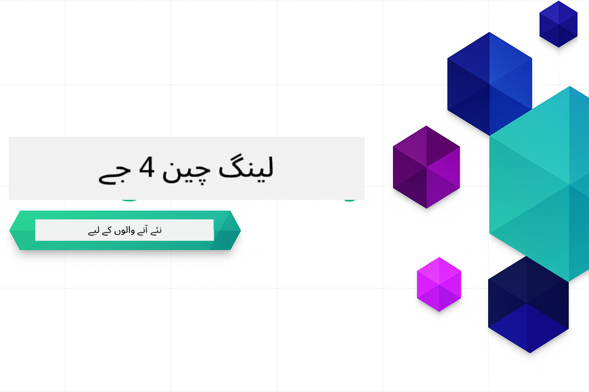
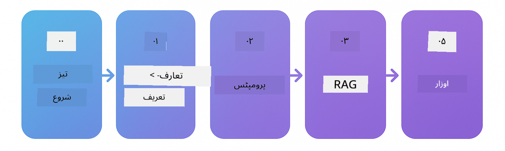

<!--
CO_OP_TRANSLATOR_METADATA:
{
  "original_hash": "5faf6e12d99d1ba33780f9f32b062d96",
  "translation_date": "2025-12-17T11:00:29+00:00",
  "source_file": "README.md",
  "language_code": "ur"
}
-->

### 🌐 کثیراللسانی معاونت

#### GitHub ایکشن کے ذریعے معاونت یافتہ (خودکار اور ہمیشہ تازہ ترین)

<!-- CO-OP TRANSLATOR LANGUAGES TABLE START -->
[Arabic](../ar/README.md) | [Bengali](../bn/README.md) | [Bulgarian](../bg/README.md) | [Burmese (Myanmar)](../my/README.md) | [Chinese (Simplified)](../zh/README.md) | [Chinese (Traditional, Hong Kong)](../hk/README.md) | [Chinese (Traditional, Macau)](../mo/README.md) | [Chinese (Traditional, Taiwan)](../tw/README.md) | [Croatian](../hr/README.md) | [Czech](../cs/README.md) | [Danish](../da/README.md) | [Dutch](../nl/README.md) | [Estonian](../et/README.md) | [Finnish](../fi/README.md) | [French](../fr/README.md) | [German](../de/README.md) | [Greek](../el/README.md) | [Hebrew](../he/README.md) | [Hindi](../hi/README.md) | [Hungarian](../hu/README.md) | [Indonesian](../id/README.md) | [Italian](../it/README.md) | [Japanese](../ja/README.md) | [Kannada](../kn/README.md) | [Korean](../ko/README.md) | [Lithuanian](../lt/README.md) | [Malay](../ms/README.md) | [Malayalam](../ml/README.md) | [Marathi](../mr/README.md) | [Nepali](../ne/README.md) | [Nigerian Pidgin](../pcm/README.md) | [Norwegian](../no/README.md) | [Persian (Farsi)](../fa/README.md) | [Polish](../pl/README.md) | [Portuguese (Brazil)](../br/README.md) | [Portuguese (Portugal)](../pt/README.md) | [Punjabi (Gurmukhi)](../pa/README.md) | [Romanian](../ro/README.md) | [Russian](../ru/README.md) | [Serbian (Cyrillic)](../sr/README.md) | [Slovak](../sk/README.md) | [Slovenian](../sl/README.md) | [Spanish](../es/README.md) | [Swahili](../sw/README.md) | [Swedish](../sv/README.md) | [Tagalog (Filipino)](../tl/README.md) | [Tamil](../ta/README.md) | [Telugu](../te/README.md) | [Thai](../th/README.md) | [Turkish](../tr/README.md) | [Ukrainian](../uk/README.md) | [Urdu](./README.md) | [Vietnamese](../vi/README.md)
<!-- CO-OP TRANSLATOR LANGUAGES TABLE END -->

# LangChain4j برائے مبتدی

LangChain4j اور Azure OpenAI GPT-5 کے ساتھ AI ایپلیکیشنز بنانے کا کورس، بنیادی چیٹ سے لے کر AI ایجنٹس تک۔

**LangChain4j میں نئے ہیں؟** اہم اصطلاحات اور تصورات کی تعریف کے لیے [Glossary](docs/GLOSSARY.md) دیکھیں۔

## فہرست مضامین

1. [فوری آغاز](00-quick-start/README.md) - LangChain4j کے ساتھ شروع کریں
2. [تعارف](01-introduction/README.md) - LangChain4j کے بنیادی اصول سیکھیں
3. [پرومپٹ انجینئرنگ](02-prompt-engineering/README.md) - مؤثر پرومپٹ ڈیزائن میں مہارت حاصل کریں
4. [RAG (ریٹریول-آگمینٹڈ جنریشن)](03-rag/README.md) - ذہین علم پر مبنی نظام بنائیں
5. [ٹولز](04-tools/README.md) - AI ایجنٹس کے ساتھ بیرونی ٹولز اور APIs کو مربوط کریں
6. [MCP (ماڈل کانٹیکسٹ پروٹوکول)](05-mcp/README.md) - ماڈل کانٹیکسٹ پروٹوکول کے ساتھ کام کریں
---

## تعلیمی راستہ

[فوری آغاز](00-quick-start/README.md) ماڈیول سے شروع کریں اور ہر ماڈیول کے ذریعے قدم بہ قدم اپنی مہارتیں بڑھائیں۔ آپ بنیادی مثالیں آزما کر اصول سمجھیں گے، پھر GPT-5 کے ساتھ گہرائی میں جانے کے لیے [تعارف](01-introduction/README.md) ماڈیول پر جائیں گے۔

ماڈیول مکمل کرنے کے بعد، LangChain4j کے ٹیسٹنگ تصورات کو عملی طور پر دیکھنے کے لیے [Testing Guide](docs/TESTING.md) دریافت کریں۔

> **نوٹ:** یہ تربیت GitHub ماڈلز اور Azure OpenAI دونوں استعمال کرتی ہے۔ [فوری آغاز](00-quick-start/README.md) اور [MCP](05-mcp/README.md) ماڈیولز GitHub ماڈلز استعمال کرتے ہیں (Azure سبسکرپشن کی ضرورت نہیں)، جبکہ ماڈیولز 1-4 Azure OpenAI GPT-5 استعمال کرتے ہیں۔

## GitHub Copilot کے ساتھ سیکھنا

جلدی کوڈنگ شروع کرنے کے لیے، اس پروجیکٹ کو GitHub Codespace یا اپنے مقامی IDE میں فراہم کردہ devcontainer کے ساتھ کھولیں۔ اس کورس میں استعمال ہونے والا devcontainer پہلے سے GitHub Copilot کے ساتھ AI جوڑی پروگرامنگ کے لیے ترتیب دیا گیا ہے۔

ہر کوڈ مثال میں وہ سوالات شامل ہیں جو آپ GitHub Copilot سے پوچھ سکتے ہیں تاکہ اپنی سمجھ کو گہرا کریں۔ 💡/🤖 پرومپٹس تلاش کریں:

- **جاوا فائل ہیڈرز** - ہر مثال کے مخصوص سوالات
- **ماڈیول README فائلز** - کوڈ مثالوں کے بعد دریافت کے پرومپٹس

**استعمال کا طریقہ:** کوئی بھی کوڈ فائل کھولیں اور Copilot سے تجویز کردہ سوالات پوچھیں۔ اسے کوڈ بیس کا مکمل سیاق و سباق معلوم ہے اور یہ وضاحت، توسیع، اور متبادل تجویز کر سکتا ہے۔

مزید جاننا چاہتے ہیں؟ [Copilot for AI Paired Programming](https://aka.ms/GitHubCopilotAI) دیکھیں۔

## اضافی وسائل

<!-- CO-OP TRANSLATOR OTHER COURSES START -->
### LangChain

---

### Azure / Edge / MCP / Agents

---
 
### Generative AI Series

[-9333EA?style=for-the-badge&labelColor=E5E7EB&color=9333EA)](https://github.com/microsoft/Generative-AI-for-beginners-dotnet?WT.mc_id=academic-105485-koreyst)
[-C084FC?style=for-the-badge&labelColor=E5E7EB&color=C084FC)](https://github.com/microsoft/generative-ai-for-beginners-java?WT.mc_id=academic-105485-koreyst)
[-E879F9?style=for-the-badge&labelColor=E5E7EB&color=E879F9)](https://github.com/microsoft/generative-ai-with-javascript?WT.mc_id=academic-105485-koreyst)

---
 
### Core Learning

---
 
### Copilot Series

<!-- CO-OP TRANSLATOR OTHER COURSES END -->

## مدد حاصل کریں

اگر آپ پھنس جائیں یا AI ایپس بنانے کے بارے میں کوئی سوالات ہوں، تو شامل ہوں:

اگر آپ کے پاس پروڈکٹ فیڈبیک ہے یا بنانے کے دوران کوئی غلطیاں ہیں تو ملاحظہ کریں:

## لائسنس

MIT لائسنس - تفصیلات کے لیے [LICENSE](../../LICENSE) فائل دیکھیں۔

---

<!-- CO-OP TRANSLATOR DISCLAIMER START -->
**دستخطی نوٹ**:  
یہ دستاویز AI ترجمہ سروس [Co-op Translator](https://github.com/Azure/co-op-translator) کے ذریعے ترجمہ کی گئی ہے۔ اگرچہ ہم درستگی کے لیے کوشاں ہیں، براہ کرم اس بات سے آگاہ رہیں کہ خودکار ترجمے میں غلطیاں یا عدم درستیاں ہو سکتی ہیں۔ اصل دستاویز اپنی مادری زبان میں ہی معتبر ماخذ سمجھی جانی چاہیے۔ اہم معلومات کے لیے پیشہ ور انسانی ترجمہ کی سفارش کی جاتی ہے۔ اس ترجمے کے استعمال سے پیدا ہونے والی کسی بھی غلط فہمی یا غلط تشریح کی ذمہ داری ہم پر عائد نہیں ہوتی۔
<!-- CO-OP TRANSLATOR DISCLAIMER END -->