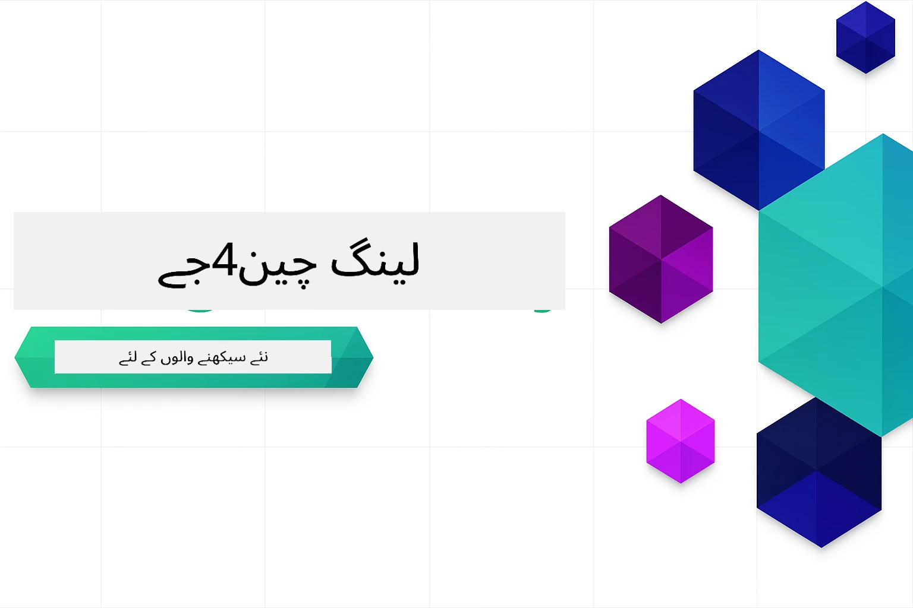

# نئے صارفین کے لیے LangChain4j

LangChain4j اور Azure OpenAI GPT-5.2 کے ساتھ AI ایپلیکیشنز بنانے کا کورس، بنیادی چیٹ سے لے کر AI ایجنٹس تک۔

### 🌐 متعدد زبانوں کی حمایت

#### GitHub Action کے ذریعے حمایت یافتہ (خودکار اور ہمیشہ تازہ ترین)

<!-- CO-OP TRANSLATOR LANGUAGES TABLE START -->
[Arabic](../ar/README.md) | [Bengali](../bn/README.md) | [Bulgarian](../bg/README.md) | [Burmese (Myanmar)](../my/README.md) | [Chinese (Simplified)](../zh-CN/README.md) | [Chinese (Traditional, Hong Kong)](../zh-HK/README.md) | [Chinese (Traditional, Macau)](../zh-MO/README.md) | [Chinese (Traditional, Taiwan)](../zh-TW/README.md) | [Croatian](../hr/README.md) | [Czech](../cs/README.md) | [Danish](../da/README.md) | [Dutch](../nl/README.md) | [Estonian](../et/README.md) | [Finnish](../fi/README.md) | [French](../fr/README.md) | [German](../de/README.md) | [Greek](../el/README.md) | [Hebrew](../he/README.md) | [Hindi](../hi/README.md) | [Hungarian](../hu/README.md) | [Indonesian](../id/README.md) | [Italian](../it/README.md) | [Japanese](../ja/README.md) | [Kannada](../kn/README.md) | [Khmer](../km/README.md) | [Korean](../ko/README.md) | [Lithuanian](../lt/README.md) | [Malay](../ms/README.md) | [Malayalam](../ml/README.md) | [Marathi](../mr/README.md) | [Nepali](../ne/README.md) | [Nigerian Pidgin](../pcm/README.md) | [Norwegian](../no/README.md) | [Persian (Farsi)](../fa/README.md) | [Polish](../pl/README.md) | [Portuguese (Brazil)](../pt-BR/README.md) | [Portuguese (Portugal)](../pt-PT/README.md) | [Punjabi (Gurmukhi)](../pa/README.md) | [Romanian](../ro/README.md) | [Russian](../ru/README.md) | [Serbian (Cyrillic)](../sr/README.md) | [Slovak](../sk/README.md) | [Slovenian](../sl/README.md) | [Spanish](../es/README.md) | [Swahili](../sw/README.md) | [Swedish](../sv/README.md) | [Tagalog (Filipino)](../tl/README.md) | [Tamil](../ta/README.md) | [Telugu](../te/README.md) | [Thai](../th/README.md) | [Turkish](../tr/README.md) | [Ukrainian](../uk/README.md) | [Urdu](./README.md) | [Vietnamese](../vi/README.md)

> **مقامی طور پر کلون کرنا پسند کریں؟**
>
> اس ریپوزٹری میں 50+ زبانوں کے تراجم شامل ہیں جو ڈاؤن لوڈ سائز کو کافی بڑھاتے ہیں۔ تراجم کے بغیر کلون کرنے کے لیے sparse checkout استعمال کریں:
>
> **Bash / macOS / Linux:**
> ```bash
> git clone --filter=blob:none --sparse https://github.com/microsoft/LangChain4j-for-Beginners.git
> cd LangChain4j-for-Beginners
> git sparse-checkout set --no-cone '/*' '!translations' '!translated_images'
> ```
>
> **CMD (Windows):**
> ```cmd
> git clone --filter=blob:none --sparse https://github.com/microsoft/LangChain4j-for-Beginners.git
> cd LangChain4j-for-Beginners
> git sparse-checkout set --no-cone "/*" "!translations" "!translated_images"
> ```
>
> اس طرح آپ کو کورس مکمل کرنے کے لیے درکار سب کچھ بہت تیز رفتاری سے ڈاؤن لوڈ ہوتا ہے۔
<!-- CO-OP TRANSLATOR LANGUAGES TABLE END -->

## فہرست مضامین

1. [تعارف](01-introduction/README.md) - LangChain4j کی بنیادی باتیں سیکھیں
2. [پرومپٹ انجینئرنگ](02-prompt-engineering/README.md) - موثر پرومپٹ ڈیزائن میں مہارت حاصل کریں
3. [RAG (ریٹریول-اگمینٹڈ جنریشن)](03-rag/README.md) - ذہین علم پر مبنی نظام بنائیں
4. [آلات](04-tools/README.md) - بیرونی آلات اور آسان معاونین کو مربوط کریں
5. [MCP (ماڈل کانٹیکسٹ پروٹوکول)](05-mcp/README.md) - ماڈل کانٹیکسٹ پروٹوکول (MCP) اور ایجینٹک ماڈیولز کے ساتھ کام کریں

### ویڈیو واک تھرو

ہر ماڈیول کے ساتھ ایک لائیو سیشن ہوتا ہے جس میں ہم تصورات اور کوڈ کو مرحلہ وار سمجھاتے ہیں۔

| ماڈیول | ویڈیو |
|--------|-------|
| 01 - تعارف | [LangChain4j کے ساتھ شروعات](https://www.youtube.com/live/nl_troDm8rQ) |
| 02 - پرومپٹ انجینئرنگ | [LangChain4j کے ساتھ پرومپٹ انجینئرنگ](https://www.youtube.com/live/PJ6aBaE6bog) |
| 03 - RAG | [LangChain4j کے ساتھ RAG](https://www.youtube.com/watch?v=_olq75ZH_eY) |
| 04 - آلات اور 05 - MCP | [آلات اور MCP کے ساتھ AI ایجنٹس](https://www.youtube.com/watch?v=O_J30kZc0rw) |

---

## سیکھنے کا راستہ

**LangChain4j میں نیا ہیں؟** مرکزی اصطلاحات اور تصورات کی تعریف کے لیے [گلاسری](docs/GLOSSARY.md) دیکھیں۔

> **جلدی شروع کریں**

1. اس ریپوزٹری کو اپنے GitHub اکاؤنٹ پر فورک کریں
2. **Code** → **Codespaces** ٹیب → **...** → **New with options...** پر کلک کریں
3. ڈیفالٹس کا استعمال کریں – یہ اس کورس کے لیے بنایا گیا ڈیولپمنٹ کنٹینر منتخب کرے گا
4. **Create codespace** پر کلک کریں
5. ماحول کے تیار ہونے کے لیے 5-10 منٹ انتظار کریں
6. شروع کرنے کے لیے سیدھا [تعارف](./01-introduction/README.md) پر جائیں!

ماڈیولز مکمل کرنے کے بعد، LangChain4j کے ٹیسٹنگ تصورات کو عملی طور پر دیکھنے کے لیے [ٹیسٹنگ گائیڈ](docs/TESTING.md) کو دریافت کریں۔

> **نوٹ:** یہ تربیت Azure OpenAI استعمال کرتی ہے۔ اگر آپ کے پاس نہیں ہے تو [مفت Azure اکاؤنٹ](https://aka.ms/azure-free-account) کے ساتھ شروع کریں۔


## GitHub Copilot کے ساتھ سیکھنا

کوڈنگ جلد شروع کرنے کے لیے، اس پروجیکٹ کو GitHub Codespace یا اپنے لوکل IDE میں فراہم کردہ devcontainer کے ساتھ کھولیں۔ اس کورس میں استعمال ہونے والا devcontainer GitHub Copilot کے ساتھ پہلے سے ترتیب دیا گیا ہے تاکہ AI جوڑی ہوئی پروگرامنگ کی سہولت ہو۔

ہر کوڈ مثال میں وہ سوالات شامل ہیں جو آپ GitHub Copilot سے پوچھ کر اپنی سمجھ کو گہرا کر سکتے ہیں۔ 💡/🤖 کے نشان تلاش کریں:

- **جاوا فائل کے ہیڈرز** - ہر مثال کے مخصوص سوالات
- **ماڈیول README** - کوڈ مثالوں کے بعد دریافت کے لئے سوالات

**استعمال کا طریقہ:** کوئی بھی کوڈ فائل کھولیں اور Copilot سے مشورہ شدہ سوالات پوچھیں۔ اسے پورے کوڈبیس کا مکمل سیاق و سباق معلوم ہے اور یہ وضاحت، توسیع، اور متبادل مشورے دے سکتا ہے۔

مزید جاننا چاہتے ہیں؟ دیکھیں [AI کے لیے Copilot جوڑی ہوئی پروگرامنگ](https://aka.ms/GitHubCopilotAI)۔

## اضافی وسائل

<!-- CO-OP TRANSLATOR OTHER COURSES START -->
### LangChain
[](https://aka.ms/langchain4j-for-beginners)
[](https://aka.ms/langchainjs-for-beginners?WT.mc_id=m365-94501-dwahlin)
[](https://github.com/microsoft/langchain-for-beginners?WT.mc_id=m365-94501-dwahlin)
---

### Azure / Edge / MCP / Agents
[](https://github.com/microsoft/AZD-for-beginners?WT.mc_id=academic-105485-koreyst)
[](https://github.com/microsoft/edgeai-for-beginners?WT.mc_id=academic-105485-koreyst)
[](https://github.com/microsoft/mcp-for-beginners?WT.mc_id=academic-105485-koreyst)
[](https://github.com/microsoft/ai-agents-for-beginners?WT.mc_id=academic-105485-koreyst)

---
 
### Generative AI Series
[](https://github.com/microsoft/generative-ai-for-beginners?WT.mc_id=academic-105485-koreyst)
[-9333EA?style=for-the-badge&labelColor=E5E7EB&color=9333EA)](https://github.com/microsoft/Generative-AI-for-beginners-dotnet?WT.mc_id=academic-105485-koreyst)
[-C084FC?style=for-the-badge&labelColor=E5E7EB&color=C084FC)](https://github.com/microsoft/generative-ai-for-beginners-java?WT.mc_id=academic-105485-koreyst)
[-E879F9?style=for-the-badge&labelColor=E5E7EB&color=E879F9)](https://github.com/microsoft/generative-ai-with-javascript?WT.mc_id=academic-105485-koreyst)

---
 
### بنیادی تعلیم
[](https://aka.ms/ml-beginners?WT.mc_id=academic-105485-koreyst)
[](https://aka.ms/datascience-beginners?WT.mc_id=academic-105485-koreyst)
[](https://aka.ms/ai-beginners?WT.mc_id=academic-105485-koreyst)
[](https://github.com/microsoft/Security-101?WT.mc_id=academic-96948-sayoung)
[](https://aka.ms/webdev-beginners?WT.mc_id=academic-105485-koreyst)
[](https://aka.ms/iot-beginners?WT.mc_id=academic-105485-koreyst)
[](https://github.com/microsoft/xr-development-for-beginners?WT.mc_id=academic-105485-koreyst)

---
 
### کوپائلٹ سیریز
[](https://aka.ms/GitHubCopilotAI?WT.mc_id=academic-105485-koreyst)
[](https://github.com/microsoft/mastering-github-copilot-for-dotnet-csharp-developers?WT.mc_id=academic-105485-koreyst)
[](https://github.com/microsoft/CopilotAdventures?WT.mc_id=academic-105485-koreyst)
<!-- CO-OP TRANSLATOR OTHER COURSES END -->

## مدد حاصل کرنا

اگر آپ پھنس جائیں یا AI ایپس بنانے کے بارے میں کوئی سوال ہو، شامل ہوں:

[](https://aka.ms/foundry/discord)

اگر آپ کے پاس پراڈکٹ کے بارے میں تاثرات یا ڈیولپمنٹ کے دوران غلطیاں ہوں تو یہاں جائیں:

[](https://aka.ms/foundry/forum)

## لائسنس

MIT لائسنس - تفصیلات کے لیے [LICENSE](../../LICENSE) فائل دیکھیں۔

---

<!-- CO-OP TRANSLATOR DISCLAIMER START -->
**ڈس کلیمر**:
یہ دستاویز AI ترجمہ سروس [Co-op Translator](https://github.com/Azure/co-op-translator) کے ذریعے ترجمہ کی گئی ہے۔ جبکہ ہم درستگی کے لیے کوشاں ہیں، براہ کرم اس بات سے آگاہ رہیں کہ خودکار ترجمے میں غلطیاں یا عدم درستیاں ہو سکتی ہیں۔ اصل دستاویز اپنے مادری زبان میں مستند ماخذ سمجھی جائے گی۔ حساس معلومات کے لیے پیشہ ور انسانی ترجمہ کی سفارش کی جاتی ہے۔ اس ترجمے کے استعمال سے پیدا ہونے والی کسی بھی غلط فہمی یا غلط تشریح کی ذمہ داری ہم قبول نہیں کرتے۔
<!-- CO-OP TRANSLATOR DISCLAIMER END -->