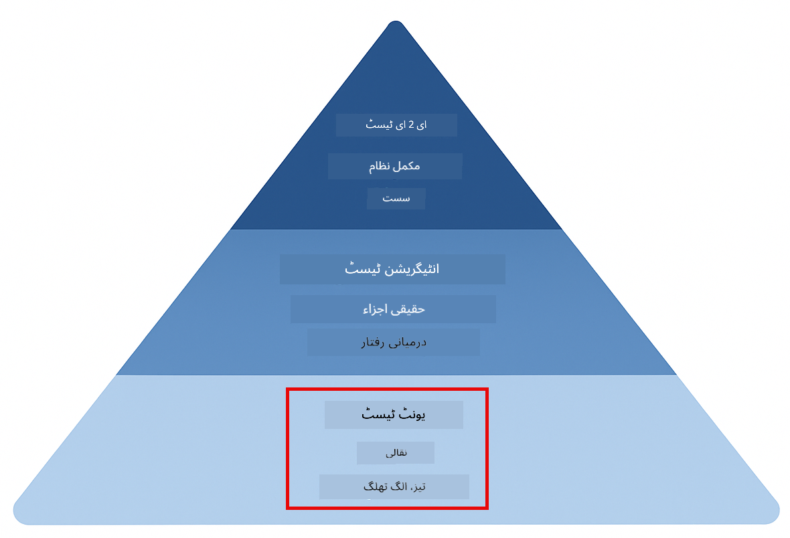
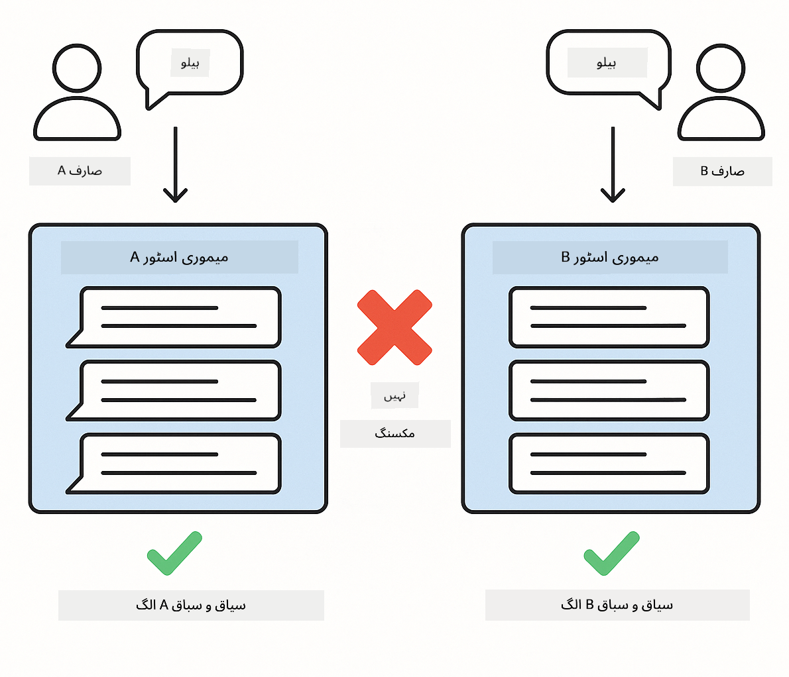

<!--
CO_OP_TRANSLATOR_METADATA:
{
  "original_hash": "b975537560c404d5f254331832811e78",
  "translation_date": "2025-12-13T20:39:39+00:00",
  "source_file": "docs/TESTING.md",
  "language_code": "ur"
}
-->
# لینگ چین4جے ایپلیکیشنز کی جانچ

## فہرست مضامین

- [جلدی شروع کریں](../../../docs)
- [ٹیسٹ کیا کور کرتے ہیں](../../../docs)
- [ٹیسٹ چلانا](../../../docs)
- [وی ایس کوڈ میں ٹیسٹ چلانا](../../../docs)
- [ٹیسٹنگ کے نمونے](../../../docs)
- [ٹیسٹنگ کا فلسفہ](../../../docs)
- [اگلے اقدامات](../../../docs)

یہ رہنما آپ کو ان ٹیسٹوں کے ذریعے لے جاتا ہے جو دکھاتے ہیں کہ AI ایپلیکیشنز کو API کیز یا بیرونی خدمات کے بغیر کیسے ٹیسٹ کیا جائے۔

## جلدی شروع کریں

تمام ٹیسٹ ایک کمانڈ سے چلائیں:

**بش:**
```bash
mvn test
```

**پاور شیل:**
```powershell
mvn --% test
```


*کامیاب ٹیسٹ کی عملدرآمد جو تمام ٹیسٹوں کے صفر ناکامیوں کے ساتھ پاس ہونے کو ظاہر کرتا ہے*

## ٹیسٹ کیا کور کرتے ہیں

یہ کورس **یونٹ ٹیسٹ** پر مرکوز ہے جو مقامی طور پر چلتے ہیں۔ ہر ٹیسٹ ایک مخصوص لینگ چین4جے تصور کو الگ تھلگ دکھاتا ہے۔



*ٹیسٹنگ پیرا میڈ جو یونٹ ٹیسٹ (تیز، الگ تھلگ)، انٹیگریشن ٹیسٹ (حقیقی اجزاء)، اور اینڈ ٹو اینڈ ٹیسٹ (پورا نظام ڈوکر کے ساتھ) کے درمیان توازن دکھاتا ہے۔ یہ تربیت یونٹ ٹیسٹنگ پر مرکوز ہے۔*

| ماڈیول | ٹیسٹ | توجہ | اہم فائلیں |
|--------|-------|-------|-----------|
| **00 - جلدی شروع کریں** | 6 | پرامپٹ ٹیمپلیٹس اور متغیر کی جگہ | `SimpleQuickStartTest.java` |
| **01 - تعارف** | 8 | گفتگو کی یادداشت اور ریاستی چیٹ | `SimpleConversationTest.java` |
| **02 - پرامپٹ انجینئرنگ** | 12 | GPT-5 پیٹرنز، جوش کی سطحیں، منظم آؤٹ پٹ | `SimpleGpt5PromptTest.java` |
| **03 - RAG** | 10 | دستاویز کی انٹیک، ایمبیڈنگز، مماثلت کی تلاش | `DocumentServiceTest.java` |
| **04 - ٹولز** | 12 | فنکشن کالنگ اور ٹول چیننگ | `SimpleToolsTest.java` |
| **05 - MCP** | 15 | ماڈل کانٹیکسٹ پروٹوکول ڈوکر کے ساتھ | `SimpleMcpTest.java`, `McpDockerTransportTest.java`` |

## ٹیسٹ چلانا

**روٹ سے تمام ٹیسٹ چلائیں:**

**بش:**
```bash
mvn test
```

**پاور شیل:**
```powershell
mvn --% test
```

**کسی مخصوص ماڈیول کے ٹیسٹ چلائیں:**

**بش:**
```bash
cd 01-introduction && mvn test
# یا جڑ سے
mvn test -pl 01-introduction
```

**پاور شیل:**
```powershell
cd 01-introduction; mvn --% test
# یا جڑ سے
mvn --% test -pl 01-introduction
```

**ایک ٹیسٹ کلاس چلائیں:**

**بش:**
```bash
mvn test -Dtest=SimpleConversationTest
```

**پاور شیل:**
```powershell
mvn --% test -Dtest=SimpleConversationTest
```

**کسی مخصوص ٹیسٹ میتھڈ کو چلائیں:**

**بش:**
```bash
mvn test -Dtest=SimpleConversationTest#گفتگو کی تاریخ کو برقرار رکھنا چاہیے
```

**پاور شیل:**
```powershell
mvn --% test -Dtest=SimpleConversationTest#گفتگو کی تاریخ کو برقرار رکھنا چاہیے
```

## وی ایس کوڈ میں ٹیسٹ چلانا

اگر آپ Visual Studio Code استعمال کر رہے ہیں، تو Test Explorer ٹیسٹ چلانے اور ڈیبگ کرنے کے لیے گرافیکل انٹرفیس فراہم کرتا ہے۔


*وی ایس کوڈ ٹیسٹ ایکسپلورر جو تمام جاوا ٹیسٹ کلاسز اور انفرادی ٹیسٹ میتھڈز کے ساتھ ٹیسٹ درخت دکھا رہا ہے*

**وی ایس کوڈ میں ٹیسٹ چلانے کے لیے:**

1. ایکٹیویٹی بار میں بیکر آئیکن پر کلک کر کے Test Explorer کھولیں
2. تمام ماڈیولز اور ٹیسٹ کلاسز دیکھنے کے لیے ٹیسٹ درخت کو پھیلائیں
3. کسی بھی ٹیسٹ کے ساتھ پلے بٹن پر کلک کر کے اسے الگ سے چلائیں
4. پورے سوئٹ کو چلانے کے لیے "Run All Tests" پر کلک کریں
5. کسی بھی ٹیسٹ پر رائٹ کلک کر کے "Debug Test" منتخب کریں تاکہ بریک پوائنٹس لگائیں اور کوڈ میں قدم بہ قدم جائیں

Test Explorer پاس ہونے والے ٹیسٹوں کے لیے سبز چیک مارکس دکھاتا ہے اور ناکام ہونے پر تفصیلی خرابی کے پیغامات فراہم کرتا ہے۔

## ٹیسٹنگ کے نمونے


*لینگ چین4جے ایپلیکیشنز کے لیے چھ ٹیسٹنگ کے نمونے: پرامپٹ ٹیمپلیٹس، ماڈلز کی موکنگ، گفتگو کی علیحدگی، ٹولز کی جانچ، ان میموری RAG، اور ڈوکر انٹیگریشن*

### نمونہ 1: پرامپٹ ٹیمپلیٹس کی جانچ

سب سے آسان نمونہ پرامپٹ ٹیمپلیٹس کو بغیر کسی AI ماڈل کو کال کیے ٹیسٹ کرتا ہے۔ آپ تصدیق کرتے ہیں کہ متغیر کی جگہ صحیح کام کر رہی ہے اور پرامپٹس متوقع فارمیٹ میں ہیں۔


*پرامپٹ ٹیمپلیٹس کی جانچ جو متغیر کی جگہ کے بہاؤ کو دکھاتی ہے: ٹیمپلیٹ میں پلیس ہولڈرز → اقدار لاگو کی گئیں → فارمیٹ شدہ آؤٹ پٹ کی تصدیق*

```java
@Test
@DisplayName("Should format prompt template with variables")
void testPromptTemplateFormatting() {
    PromptTemplate template = PromptTemplate.from(
        "Best time to visit {{destination}} for {{activity}}?"
    );
    
    Prompt prompt = template.apply(Map.of(
        "destination", "Paris",
        "activity", "sightseeing"
    ));
    
    assertThat(prompt.text()).isEqualTo("Best time to visit Paris for sightseeing?");
}
```

یہ ٹیسٹ `00-quick-start/src/test/java/com/example/langchain4j/quickstart/SimpleQuickStartTest.java` میں موجود ہے۔

**چلائیں:**

**بش:**
```bash
cd 00-quick-start && mvn test -Dtest=SimpleQuickStartTest#ٹیسٹ پرامپٹ ٹیمپلیٹ کی فارمیٹنگ
```

**پاور شیل:**
```powershell
cd 00-quick-start; mvn --% test -Dtest=SimpleQuickStartTest#ٹیسٹ پرامپٹ ٹیمپلیٹ فارمیٹنگ
```

### نمونہ 2: زبان کے ماڈلز کی موکنگ

گفتگو کی منطق کی جانچ کرتے وقت، Mockito استعمال کریں تاکہ جعلی ماڈلز بنائیں جو پہلے سے طے شدہ جوابات واپس کریں۔ اس سے ٹیسٹ تیز، مفت، اور متعین ہو جاتے ہیں۔


*موازنہ جو دکھاتا ہے کہ ٹیسٹنگ کے لیے موکس کیوں ترجیح دی جاتی ہیں: یہ تیز، مفت، متعین، اور API کیز کی ضرورت نہیں رکھتے*

```java
@ExtendWith(MockitoExtension.class)
class SimpleConversationTest {
    
    private ConversationService conversationService;
    
    @Mock
    private OpenAiOfficialChatModel mockChatModel;
    
    @BeforeEach
    void setUp() {
        ChatResponse mockResponse = ChatResponse.builder()
            .aiMessage(AiMessage.from("This is a test response"))
            .build();
        when(mockChatModel.chat(anyList())).thenReturn(mockResponse);
        
        conversationService = new ConversationService(mockChatModel);
    }
    
    @Test
    void shouldMaintainConversationHistory() {
        String conversationId = conversationService.startConversation();
        
        ChatResponse mockResponse1 = ChatResponse.builder()
            .aiMessage(AiMessage.from("Response 1"))
            .build();
        ChatResponse mockResponse2 = ChatResponse.builder()
            .aiMessage(AiMessage.from("Response 2"))
            .build();
        ChatResponse mockResponse3 = ChatResponse.builder()
            .aiMessage(AiMessage.from("Response 3"))
            .build();
        
        when(mockChatModel.chat(anyList()))
            .thenReturn(mockResponse1)
            .thenReturn(mockResponse2)
            .thenReturn(mockResponse3);

        conversationService.chat(conversationId, "First message");
        conversationService.chat(conversationId, "Second message");
        conversationService.chat(conversationId, "Third message");

        List<ChatMessage> history = conversationService.getHistory(conversationId);
        assertThat(history).hasSize(6); // 3 صارف + 3 AI پیغامات
    }
}
```

یہ نمونہ `01-introduction/src/test/java/com/example/langchain4j/service/SimpleConversationTest.java` میں پایا جاتا ہے۔ موک مستقل رویہ کو یقینی بناتا ہے تاکہ آپ یادداشت کے انتظام کی درستگی کی تصدیق کر سکیں۔

### نمونہ 3: گفتگو کی علیحدگی کی جانچ

گفتگو کی یادداشت کو متعدد صارفین کو الگ رکھنا چاہیے۔ یہ ٹیسٹ تصدیق کرتا ہے کہ گفتگو کے سیاق و سباق مکس نہیں ہوتے۔



*گفتگو کی علیحدگی کی جانچ جو مختلف صارفین کے لیے الگ یادداشت اسٹورز دکھاتی ہے تاکہ سیاق و سباق کے مکس ہونے سے بچا جا سکے*

```java
@Test
void shouldIsolateConversationsByid() {
    String conv1 = conversationService.startConversation();
    String conv2 = conversationService.startConversation();
    
    ChatResponse mockResponse = ChatResponse.builder()
        .aiMessage(AiMessage.from("Response"))
        .build();
    when(mockChatModel.chat(anyList())).thenReturn(mockResponse);

    conversationService.chat(conv1, "Message for conversation 1");
    conversationService.chat(conv2, "Message for conversation 2");

    List<ChatMessage> history1 = conversationService.getHistory(conv1);
    List<ChatMessage> history2 = conversationService.getHistory(conv2);
    
    assertThat(history1).hasSize(2);
    assertThat(history2).hasSize(2);
}
```

ہر گفتگو اپنی آزاد تاریخ رکھتی ہے۔ پیداواری نظاموں میں، یہ علیحدگی کثیر صارف ایپلیکیشنز کے لیے انتہائی اہم ہے۔

### نمونہ 4: ٹولز کی آزادانہ جانچ

ٹولز وہ فنکشنز ہیں جنہیں AI کال کر سکتا ہے۔ انہیں براہ راست ٹیسٹ کریں تاکہ یہ یقینی بنایا جا سکے کہ وہ AI کے فیصلوں سے قطع نظر صحیح کام کرتے ہیں۔


*ٹولز کی آزادانہ جانچ جو موک ٹول کے نفاذ کو بغیر AI کالز کے دکھاتی ہے تاکہ کاروباری منطق کی تصدیق ہو سکے*

```java
@Test
void shouldConvertCelsiusToFahrenheit() {
    TemperatureTool tempTool = new TemperatureTool();
    String result = tempTool.celsiusToFahrenheit(25.0);
    assertThat(result).containsPattern("77[.,]0°F");
}

@Test
void shouldDemonstrateToolChaining() {
    WeatherTool weatherTool = new WeatherTool();
    TemperatureTool tempTool = new TemperatureTool();

    String weatherResult = weatherTool.getCurrentWeather("Seattle");
    assertThat(weatherResult).containsPattern("\\d+°C");

    String conversionResult = tempTool.celsiusToFahrenheit(22.0);
    assertThat(conversionResult).containsPattern("71[.,]6°F");
}
```

یہ ٹیسٹ `04-tools/src/test/java/com/example/langchain4j/agents/tools/SimpleToolsTest.java` سے ہیں جو AI کی مداخلت کے بغیر ٹول منطق کی توثیق کرتے ہیں۔ چیننگ کی مثال دکھاتی ہے کہ ایک ٹول کا آؤٹ پٹ دوسرے کے ان پٹ میں کیسے جاتا ہے۔

### نمونہ 5: ان میموری RAG کی جانچ

RAG سسٹمز روایتی طور پر ویکٹر ڈیٹا بیسز اور ایمبیڈنگ سروسز کی ضرورت رکھتے ہیں۔ ان میموری نمونہ آپ کو پورے پائپ لائن کو بیرونی انحصار کے بغیر ٹیسٹ کرنے دیتا ہے۔


*ان میموری RAG کی جانچ کا ورک فلو جو دستاویز کی پارسنگ، ایمبیڈنگ اسٹوریج، اور مماثلت کی تلاش کو بغیر ڈیٹا بیس کی ضرورت کے دکھاتا ہے*

```java
@Test
void testProcessTextDocument() {
    String content = "This is a test document.\nIt has multiple lines.";
    InputStream inputStream = new ByteArrayInputStream(content.getBytes(StandardCharsets.UTF_8));
    
    DocumentService.ProcessedDocument result = 
        documentService.processDocument(inputStream, "test.txt");

    assertNotNull(result);
    assertTrue(result.segments().size() > 0);
    assertEquals("test.txt", result.segments().get(0).metadata().getString("filename"));
}
```

یہ ٹیسٹ `03-rag/src/test/java/com/example/langchain4j/rag/service/DocumentServiceTest.java` سے ہے جو میموری میں دستاویز بناتا ہے اور چنکنگ اور میٹا ڈیٹا ہینڈلنگ کی تصدیق کرتا ہے۔

### نمونہ 6: ڈوکر کے ساتھ انٹیگریشن ٹیسٹنگ

کچھ خصوصیات کو حقیقی انفراسٹرکچر کی ضرورت ہوتی ہے۔ MCP ماڈیول Testcontainers استعمال کرتا ہے تاکہ ڈوکر کنٹینرز کو انٹیگریشن ٹیسٹ کے لیے چلایا جا سکے۔ یہ آپ کے کوڈ کی حقیقی خدمات کے ساتھ کام کرنے کی تصدیق کرتے ہیں جبکہ ٹیسٹ کی علیحدگی برقرار رکھتے ہیں۔


*MCP انٹیگریشن ٹیسٹنگ Testcontainers کے ساتھ جو خودکار کنٹینر لائف سائیکل دکھاتی ہے: شروع، ٹیسٹ چلانا، روکنا، اور صفائی*

`05-mcp/src/test/java/com/example/langchain4j/mcp/McpDockerTransportTest.java` میں ٹیسٹوں کے لیے ڈوکر کا چلنا ضروری ہے۔

**چلائیں:**

**بش:**
```bash
cd 05-mcp && mvn test
```

**پاور شیل:**
```powershell
cd 05-mcp; mvn --% test
```

## ٹیسٹنگ کا فلسفہ

اپنا کوڈ ٹیسٹ کریں، AI کو نہیں۔ آپ کے ٹیسٹ اس کوڈ کی توثیق کرنی چاہیے جو آپ لکھتے ہیں، جیسے کہ پرامپٹس کیسے بنائے جاتے ہیں، یادداشت کیسے منظم کی جاتی ہے، اور ٹولز کیسے چلتے ہیں۔ AI کے جوابات مختلف ہو سکتے ہیں اور انہیں ٹیسٹ کے دعووں کا حصہ نہیں ہونا چاہیے۔ اپنے آپ سے پوچھیں کہ کیا آپ کا پرامپٹ ٹیمپلیٹ متغیرات کو صحیح طریقے سے تبدیل کرتا ہے، نہ کہ AI صحیح جواب دیتا ہے یا نہیں۔

زبان کے ماڈلز کے لیے موکس استعمال کریں۔ یہ بیرونی انحصار ہیں جو سست، مہنگے، اور غیر متعین ہوتے ہیں۔ موکنگ ٹیسٹوں کو سیکنڈز کی بجائے ملی سیکنڈز میں تیز، مفت اور ہر بار ایک جیسا نتیجہ دیتی ہے۔

ٹیسٹوں کو آزاد رکھیں۔ ہر ٹیسٹ کو اپنا ڈیٹا خود سیٹ اپ کرنا چاہیے، دوسرے ٹیسٹوں پر انحصار نہیں کرنا چاہیے، اور اپنے بعد صفائی کرنی چاہیے۔ ٹیسٹوں کو چلانے کے ترتیب سے قطع نظر پاس ہونا چاہیے۔

خوشگوار راستے سے ہٹ کر ایج کیسز کی جانچ کریں۔ خالی ان پٹ، بہت بڑے ان پٹ، خاص حروف، غلط پیرامیٹرز، اور حد بندی کی حالتیں آزمائیں۔ یہ اکثر ایسے بگز ظاہر کرتے ہیں جو عام استعمال میں نہیں نکلتے۔

وضاحتی نام استعمال کریں۔ `shouldMaintainConversationHistoryAcrossMultipleMessages()` کا موازنہ `test1()` سے کریں۔ پہلا آپ کو بالکل بتاتا ہے کہ کیا ٹیسٹ کیا جا رہا ہے، جس سے ناکامی کی ڈیبگنگ آسان ہو جاتی ہے۔

## اگلے اقدامات

اب جب کہ آپ ٹیسٹنگ کے نمونوں کو سمجھ چکے ہیں، ہر ماڈیول میں گہرائی سے جائیں:

- **[00 - جلدی شروع کریں](../00-quick-start/README.md)** - پرامپٹ ٹیمپلیٹ کی بنیادی باتوں سے شروع کریں
- **[01 - تعارف](../01-introduction/README.md)** - گفتگو کی یادداشت کے انتظام کو سیکھیں
- **[02 - پرامپٹ انجینئرنگ](../02-prompt-engineering/README.md)** - GPT-5 پرامپٹنگ پیٹرنز میں مہارت حاصل کریں
- **[03 - RAG](../03-rag/README.md)** - بازیافت سے بڑھا ہوا جنریشن سسٹمز بنائیں
- **[04 - ٹولز](../04-tools/README.md)** - فنکشن کالنگ اور ٹول چینز کو نافذ کریں
- **[05 - MCP](../05-mcp/README.md)** - ماڈل کانٹیکسٹ پروٹوکول کو ڈوکر کے ساتھ مربوط کریں

ہر ماڈیول کی README یہاں ٹیسٹ کیے گئے تصورات کی تفصیلی وضاحت فراہم کرتی ہے۔

---

**نیویگیشن:** [← مرکزی صفحہ پر واپس](../README.md)

---

<!-- CO-OP TRANSLATOR DISCLAIMER START -->
**دستخطی نوٹ**:  
یہ دستاویز AI ترجمہ سروس [Co-op Translator](https://github.com/Azure/co-op-translator) کے ذریعے ترجمہ کی گئی ہے۔ اگرچہ ہم درستگی کے لیے کوشاں ہیں، براہ کرم اس بات سے آگاہ رہیں کہ خودکار ترجمے میں غلطیاں یا عدم درستیاں ہو سکتی ہیں۔ اصل دستاویز اپنی مادری زبان میں ہی معتبر ماخذ سمجھی جانی چاہیے۔ اہم معلومات کے لیے پیشہ ور انسانی ترجمہ کی سفارش کی جاتی ہے۔ اس ترجمے کے استعمال سے پیدا ہونے والی کسی بھی غلط فہمی یا غلط تشریح کی ذمہ داری ہم پر عائد نہیں ہوتی۔
<!-- CO-OP TRANSLATOR DISCLAIMER END -->