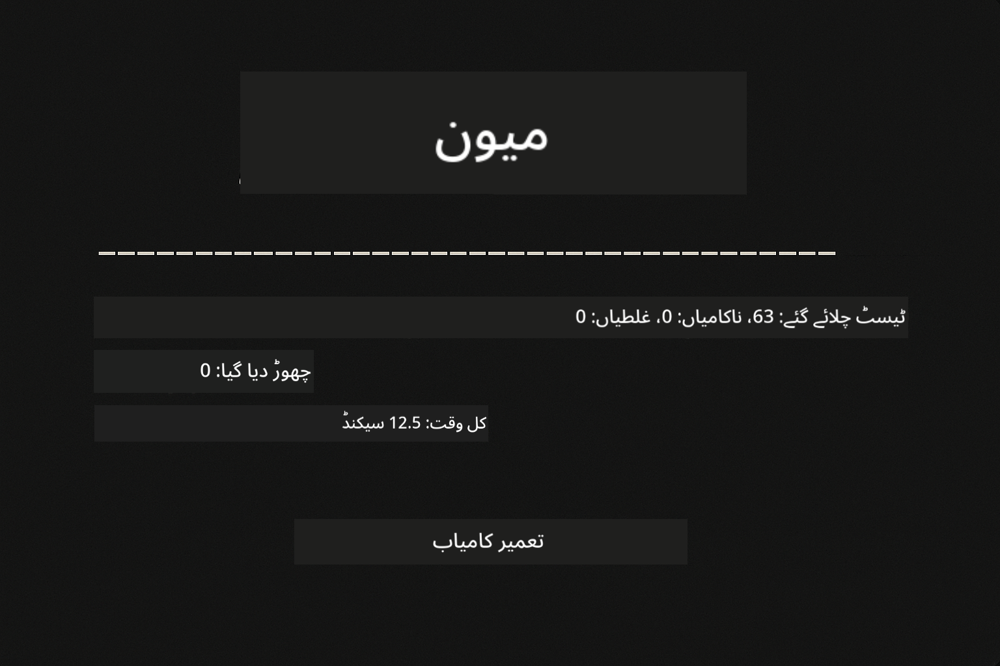
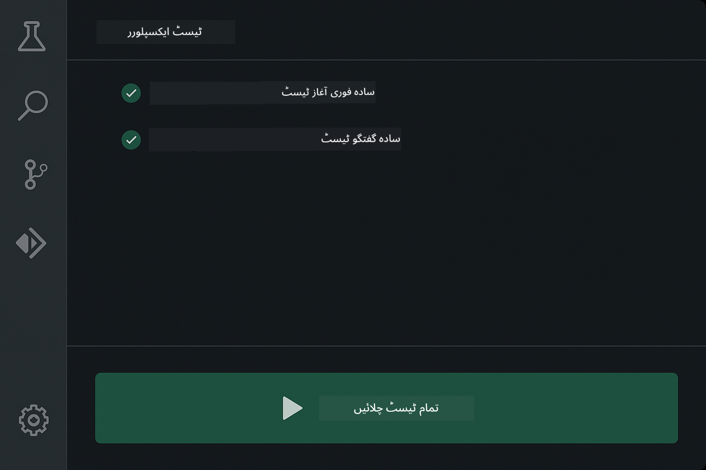
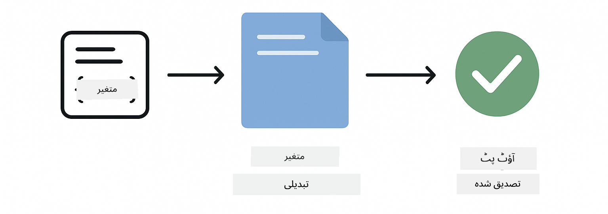
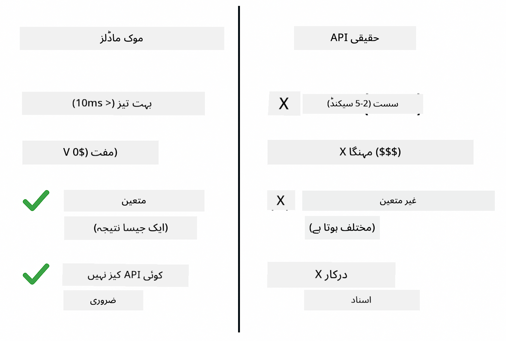
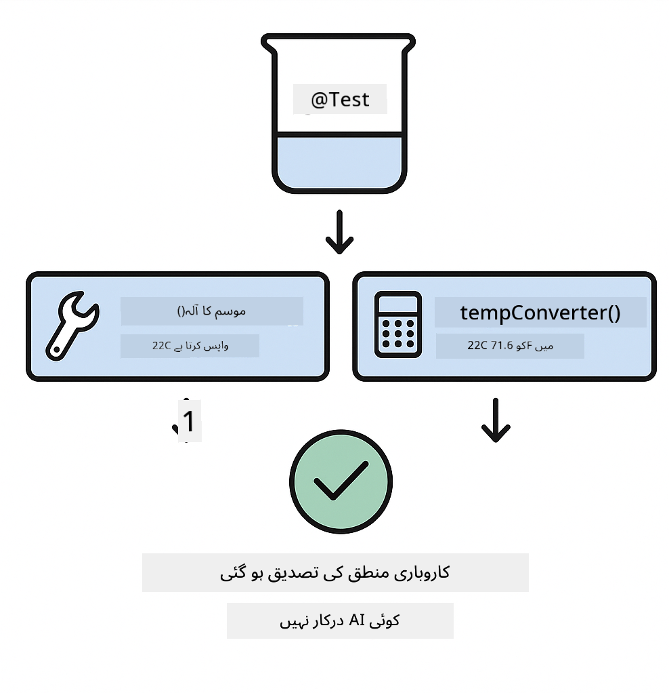
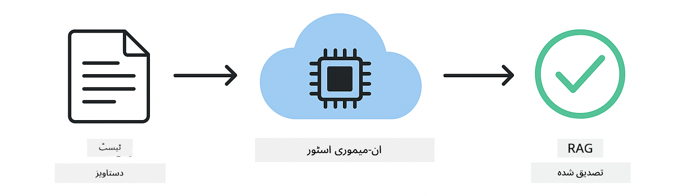

<!--
CO_OP_TRANSLATOR_METADATA:
{
  "original_hash": "ed93b3c14d58734ac10162967da958c1",
  "translation_date": "2025-12-30T20:56:47+00:00",
  "source_file": "docs/TESTING.md",
  "language_code": "ur"
}
-->
# LangChain4j ایپلیکیشنز کی ٹیسٹنگ

## مواد کی فہرست

- [فوری آغاز](../../../docs)
- [ٹیسٹس میں کیا شامل ہے](../../../docs)
- [ٹیسٹس چلانا](../../../docs)
- [VS Code میں ٹیسٹس چلانا](../../../docs)
- [ٹیسٹنگ پیٹرنز](../../../docs)
- [ٹیسٹنگ کا فلسفہ](../../../docs)
- [اگلے اقدامات](../../../docs)

یہ گائیڈ آپ کو ان ٹیسٹس کے ذریعے لے جاتا ہے جو یہ دکھاتے ہیں کہ API کیز یا بیرونی سروسز کی ضرورت کے بغیر AI ایپلیکیشنز کی کیسے ٹیسٹنگ کی جائے۔

## فوری آغاز

تمام ٹیسٹس کو ایک کمانڈ سے چلائیں:

**Bash:**
```bash
mvn test
```

**PowerShell:**
```powershell
mvn --% test
```



*تمام ٹیسٹس کامیابی سے چلنے کے نتائج جن میں صفر فالیرز دکھائے گئے ہیں*

## ٹیسٹس میں کیا شامل ہے

یہ کورس بنیادی طور پر مقامی طور پر چلنے والے **یونٹ ٹیسٹس** پر مرکوز ہے۔ ہر ٹیسٹ یکے بعد دیگرے ایک مخصوص LangChain4j تصور کو الگ تھلگ انداز میں ظاہر کرتا ہے۔


*ٹیسٹنگ ہرم جو یونٹ ٹیسٹس (تیز، الگ)، انٹیگریشن ٹیسٹس (حقیقی اجزاء)، اور اینڈ ٹو اینڈ ٹیسٹس کے درمیان توازن دکھاتی ہے۔ یہ تربیت یونٹ ٹیسٹنگ کا احاطہ کرتی ہے۔*

| ماڈیول | ٹیسٹس | توجہ | اہم فائلیں |
|--------|-------|-------|-----------|
| **00 - Quick Start** | 6 | پرومپٹ ٹیمپلیٹس اور متغیرات کی جگہ بندی | `SimpleQuickStartTest.java` |
| **01 - Introduction** | 8 | مکالماتی میموری اور حالت پر مبنی چیٹ | `SimpleConversationTest.java` |
| **02 - Prompt Engineering** | 12 | GPT-5 پیٹرنز، اظہارِ خواہش کی سطحیں، منظم آؤٹ پٹ | `SimpleGpt5PromptTest.java` |
| **03 - RAG** | 10 | دستاویزات کا اندراج، ایمبیڈنگز، مماثلت تلاش | `DocumentServiceTest.java` |
| **04 - Tools** | 12 | فنکشن کالنگ اور ٹول چیننگ | `SimpleToolsTest.java` |
| **05 - MCP** | 8 | Model Context Protocol بذریعہ stdio ٹرانسپورٹ | `SimpleMcpTest.java` |

## ٹیسٹس چلانا

**روٹ سے تمام ٹیسٹس چلائیں:**

**Bash:**
```bash
mvn test
```

**PowerShell:**
```powershell
mvn --% test
```

**کسی مخصوص ماڈیول کے لیے ٹیسٹس چلائیں:**

**Bash:**
```bash
cd 01-introduction && mvn test
# یا روٹ سے
mvn test -pl 01-introduction
```

**PowerShell:**
```powershell
cd 01-introduction; mvn --% test
# یا روٹ سے
mvn --% test -pl 01-introduction
```

**ایک واحد ٹیسٹ کلاس چلائیں:**

**Bash:**
```bash
mvn test -Dtest=SimpleConversationTest
```

**PowerShell:**
```powershell
mvn --% test -Dtest=SimpleConversationTest
```

**کسی مخصوص ٹیسٹ میتھڈ کو چلائیں:**

**Bash:**
```bash
mvn test -Dtest=SimpleConversationTest#گفتگو کا ریکارڈ برقرار رکھنا چاہیے
```

**PowerShell:**
```powershell
mvn --% test -Dtest=SimpleConversationTest#بات چیت کی تاریخ برقرار رکھنی چاہیے
```

## VS Code میں ٹیسٹس چلانا

اگر آپ Visual Studio Code استعمال کر رہے ہیں تو Test Explorer ٹیسٹس چلانے اور ڈیبگ کرنے کے لیے گرافیکل انٹرفیس فراہم کرتا ہے۔



*VS Code Test Explorer جو تمام Java ٹیسٹ کلاسز اور فرداً فرداً ٹیسٹ میتھڈز کے ساتھ ٹیسٹ درخت دکھا رہا ہے*

**VS Code میں ٹیسٹس چلانے کے لیے:**

1. Activity Bar میں بیچر آئیکن پر کلک کر کے Test Explorer کھولیں
2. ٹیسٹ ٹری کو وسعت دیں تاکہ تمام ماڈیولز اور ٹیسٹ کلاسز دیکھ سکیں
3. کسی بھی ٹیسٹ کے ساتھ موجود پلے بٹن پر کلک کریں تاکہ اسے الگ سے چلایا جا سکے
4. "تمام ٹیسٹس چلائیں" پر کلک کریں تاکہ پوری سوئیٹ چلائی جائے
5. کسی بھی ٹیسٹ پر رائٹ کلک کریں اور "ڈی بگ ٹیسٹ" منتخب کریں تاکہ بریک پوائنٹس سیٹ کر کے کوڈ میں قدم بہ قدم جانچا جا سکے

Test Explorer پاس ہونے والے ٹیسٹس کے لیے سبز چیک مارکس دکھاتا ہے اور جب ٹیسٹس فیل ہوتے ہیں تو تفصیلی فیلیر میسجز فراہم کرتا ہے۔

## ٹیسٹنگ پیٹرنز

### پیٹرن 1: پرومپٹ ٹیمپلیٹس کی ٹیسٹنگ

سب سے سادہ پیٹرن پرومپٹ ٹیمپلیٹس کی ٹیسٹنگ ہے بغیر کسی AI ماڈل کو کال کیے۔ آپ یہ تصدیق کرتے ہیں کہ متغیرات کی جگہ بندی درست ہے اور پرومپٹس توقع کے مطابق فارمیٹ کیے گئے ہیں۔



*پرومپٹ ٹیمپلیٹس کی ٹیسٹنگ جو متغیرات کی جگہ بندی کے بہاؤ کو دکھاتی ہے: ٹیمپلیٹ جس میں پلیس ہولڈرز → اقدار لگائی گئیں → فارمیٹ شدہ آؤٹ پٹ کی تصدیق*

```java
@Test
@DisplayName("Should format prompt template with variables")
void testPromptTemplateFormatting() {
    PromptTemplate template = PromptTemplate.from(
        "Best time to visit {{destination}} for {{activity}}?"
    );
    
    Prompt prompt = template.apply(Map.of(
        "destination", "Paris",
        "activity", "sightseeing"
    ));
    
    assertThat(prompt.text()).isEqualTo("Best time to visit Paris for sightseeing?");
}
```

یہ ٹیسٹ `00-quick-start/src/test/java/com/example/langchain4j/quickstart/SimpleQuickStartTest.java` میں موجود ہے۔

**اسے چلائیں:**

**Bash:**
```bash
cd 00-quick-start && mvn test -Dtest=SimpleQuickStartTest#پرامپٹ ٹیمپلیٹ کی فارمیٹنگ کا ٹیسٹ
```

**PowerShell:**
```powershell
cd 00-quick-start; mvn --% test -Dtest=SimpleQuickStartTest#پرومپٹ ٹیمپلٹ کی فارمیٹنگ کا ٹیسٹ
```

### پیٹرن 2: زبان کے ماڈلز کا موک بنانا

جب مکالماتی منطق کی ٹیسٹنگ کریں تو Mockito استعمال کریں تاکہ جعلی ماڈلز بنائے جائیں جو پہلے سے متعین جوابات واپس کریں۔ اس سے ٹیسٹس تیز، مفت، اور متعین (deterministic) ہو جاتے ہیں۔



*موازنہ جو بتاتا ہے کہ ٹیسٹنگ کے لیے موکس کیوں ترجیح دیے جاتے ہیں: وہ تیز، مفت، متعین ہوتے ہیں اور API کیز کی ضرورت نہیں رکھتے*

```java
@ExtendWith(MockitoExtension.class)
class SimpleConversationTest {
    
    private ConversationService conversationService;
    
    @Mock
    private OpenAiOfficialChatModel mockChatModel;
    
    @BeforeEach
    void setUp() {
        ChatResponse mockResponse = ChatResponse.builder()
            .aiMessage(AiMessage.from("This is a test response"))
            .build();
        when(mockChatModel.chat(anyList())).thenReturn(mockResponse);
        
        conversationService = new ConversationService(mockChatModel);
    }
    
    @Test
    void shouldMaintainConversationHistory() {
        String conversationId = conversationService.startConversation();
        
        ChatResponse mockResponse1 = ChatResponse.builder()
            .aiMessage(AiMessage.from("Response 1"))
            .build();
        ChatResponse mockResponse2 = ChatResponse.builder()
            .aiMessage(AiMessage.from("Response 2"))
            .build();
        ChatResponse mockResponse3 = ChatResponse.builder()
            .aiMessage(AiMessage.from("Response 3"))
            .build();
        
        when(mockChatModel.chat(anyList()))
            .thenReturn(mockResponse1)
            .thenReturn(mockResponse2)
            .thenReturn(mockResponse3);

        conversationService.chat(conversationId, "First message");
        conversationService.chat(conversationId, "Second message");
        conversationService.chat(conversationId, "Third message");

        List<ChatMessage> history = conversationService.getHistory(conversationId);
        assertThat(history).hasSize(6); // ۳ صارفین اور ۳ مصنوعی ذہانت کے پیغامات
    }
}
```

یہ پیٹرن `01-introduction/src/test/java/com/example/langchain4j/service/SimpleConversationTest.java` میں نظر آتا ہے۔ موک مستقل رویہ یقینی بناتا ہے تاکہ آپ میموری مینجمنٹ کی درست طریقے سے جانچ کر سکیں۔

### پیٹرن 3: مکالماتی علیحدگی کی ٹیسٹنگ

مکالماتی میموری کو متعدد صارفین کو الگ رکھنا ضروری ہے۔ یہ ٹیسٹ تصدیق کرتا ہے کہ مکالمات کے سیاق و سباق مکس نہیں ہوتے۔


*مکالماتی علیحدگی کی ٹیسٹنگ جو مختلف صارفین کے لیے الگ میموری اسٹورز دکھاتی ہے تاکہ سیاق و سباق مکس نہ ہوں*

```java
@Test
void shouldIsolateConversationsByid() {
    String conv1 = conversationService.startConversation();
    String conv2 = conversationService.startConversation();
    
    ChatResponse mockResponse = ChatResponse.builder()
        .aiMessage(AiMessage.from("Response"))
        .build();
    when(mockChatModel.chat(anyList())).thenReturn(mockResponse);

    conversationService.chat(conv1, "Message for conversation 1");
    conversationService.chat(conv2, "Message for conversation 2");

    List<ChatMessage> history1 = conversationService.getHistory(conv1);
    List<ChatMessage> history2 = conversationService.getHistory(conv2);
    
    assertThat(history1).hasSize(2);
    assertThat(history2).hasSize(2);
}
```

ہر مکالمہ اپنی آزاد تاریخی ریکارڈ رکھتا ہے۔ پروڈکشن سسٹمز میں یہ علیحدگی کثیر صارف ایپلیکیشنز کے لیے انتہائی اہم ہے۔

### پیٹرن 4: ٹولز کو آزادانہ طور پر ٹیسٹ کرنا

ٹولز وہ فنکشنز ہیں جنہیں AI کال کر سکتا ہے۔ انہیں براہِ راست ٹیسٹ کریں تاکہ یہ یقینی بنایا جا سکے کہ وہ AI کے فیصلوں سے قطع نظر درست کام کرتے ہیں۔



*ٹولز کی آزادانہ ٹیسٹنگ جو AI کالز کے بغیر موک ٹول ایگزیکیوشن دکھاتی ہے تاکہ بزنس لاجک کی تصدیق ہو سکے*

```java
@Test
void shouldConvertCelsiusToFahrenheit() {
    TemperatureTool tempTool = new TemperatureTool();
    String result = tempTool.celsiusToFahrenheit(25.0);
    assertThat(result).containsPattern("77[.,]0°F");
}

@Test
void shouldDemonstrateToolChaining() {
    WeatherTool weatherTool = new WeatherTool();
    TemperatureTool tempTool = new TemperatureTool();

    String weatherResult = weatherTool.getCurrentWeather("Seattle");
    assertThat(weatherResult).containsPattern("\\d+°C");

    String conversionResult = tempTool.celsiusToFahrenheit(22.0);
    assertThat(conversionResult).containsPattern("71[.,]6°F");
}
```

یہ ٹیسٹس `04-tools/src/test/java/com/example/langchain4j/agents/tools/SimpleToolsTest.java` سے ہیں جو AI کے بغیر ٹول لاجک کو ویلیڈیٹ کرتے ہیں۔ چیننگ کی مثال دکھاتی ہے کہ کس طرح ایک ٹول کا آؤٹ پٹ دوسرے کے ان پٹ میں فیڈ ہوتا ہے۔

### پیٹرن 5: ان-میموری RAG ٹیسٹنگ

RAG سسٹمز عام طور پر ویکٹر ڈیٹا بیس اور ایمبیڈنگ سروسز کی ضرورت رکھتے ہیں۔ ان-میموری پیٹرن آپ کو پورے پائپ لائن کی جانچ کرنے دیتا ہے بغیر بیرونی منحصرات کے۔



*ان-میموری RAG ٹیسٹنگ ورک فلو جو دستاویز پارسنگ، ایمبیڈنگ اسٹوریج، اور مماثلت تلاش دکھاتا ہے بغیر کسی ڈیٹا بیس کی ضرورت کے*

```java
@Test
void testProcessTextDocument() {
    String content = "This is a test document.\nIt has multiple lines.";
    InputStream inputStream = new ByteArrayInputStream(content.getBytes(StandardCharsets.UTF_8));
    
    DocumentService.ProcessedDocument result = 
        documentService.processDocument(inputStream, "test.txt");

    assertNotNull(result);
    assertTrue(result.segments().size() > 0);
    assertEquals("test.txt", result.segments().get(0).metadata().getString("filename"));
}
```

یہ ٹیسٹ `03-rag/src/test/java/com/example/langchain4j/rag/service/DocumentServiceTest.java` میں میموری میں ایک دستاویز بناتا ہے اور چنکنگ اور میٹاڈیٹا ہینڈلنگ کی تصدیق کرتا ہے۔

### پیٹرن 6: MCP انٹیگریشن ٹیسٹنگ

MCP ماڈیول Model Context Protocol انٹیگریشن کو stdio ٹرانسپورٹ استعمال کرتے ہوئے ٹیسٹ کرتا ہے۔ یہ ٹیسٹس اس بات کی تصدیق کرتے ہیں کہ آپ کی ایپلیکیشن سب پروسیسز کے طور پر MCP سرورز کو جنریٹ اور ان کے ساتھ کمیونیکیٹ کر سکتی ہے۔

یہ ٹیسٹس `05-mcp/src/test/java/com/example/langchain4j/mcp/SimpleMcpTest.java` میں MCP کلائنٹ کے رویے کی تصدیق کرتی ہیں۔

**انہیں چلائیں:**

**Bash:**
```bash
cd 05-mcp && mvn test
```

**PowerShell:**
```powershell
cd 05-mcp; mvn --% test
```

## ٹیسٹنگ کا فلسفہ

اپنے کوڈ کی ٹیسٹنگ کریں، AI کی نہیں۔ آپ کے ٹیسٹس کو آپ کے لکھے ہوئے کوڈ کی تصدیق کرنی چاہیے — یہ چیک کرتے ہوئے کہ پرومپٹس کیسے بنائے گئے، میموری کیسے مینج کی گئی، اور ٹولز کیسے چلائے گئے۔ AI کے جوابات مختلف ہوتے ہیں اور انہیں ٹیسٹ اسسرشنز کا حصہ نہیں بنانا چاہیے۔ اپنے آپ سے پوچھیں کہ آیا آپ کا پرومپٹ ٹیمپلیٹ متغیرات کو درست طریقے سے جگہ دے رہا ہے، نہ کہ آیا AI درست جواب دیتا ہے یا نہیں۔

زبان کے ماڈلز کے لیے موکس استعمال کریں۔ یہ بیرونی منحصرات سست، مہنگے، اور غیر متعین ہوتے ہیں۔ موکنگ ٹیسٹس کو سیکنڈز کی بجائے ملی سیکنڈز میں تیز، API کے اخراجات کے بغیر مفت، اور ہر بار ایک ہی نتیجہ دینے والا بناتا ہے۔

ٹیسٹس کو آزاد رکھیں۔ ہر ٹیسٹ کو اپنے ڈیٹا کو سیٹ اپ کرنا چاہیے، دوسرے ٹیسٹس پر انحصار نہیں کرنا چاہیے، اور اپنے بعد صفائی کرنی چاہیے۔ ٹیسٹس کو اجرا کے ترتیب سے قطع نظر پاس ہونا چاہیے۔

خوشگوار راستے سے آگے کے ایج کیسز ٹیسٹ کریں۔ خالی ان پٹس، بہت بڑے ان پٹس، مخصوص حروف، غلط پیرا میٹرز، اور بارڈر کنڈیشنز آزمانے کی کوشش کریں۔ یہ اکثر ایسے بگز کھول دیتے ہیں جو معمول کے استعمال میں ظاہر نہیں ہوتے۔

وضاحتی نام استعمال کریں۔ موازنہ کریں `shouldMaintainConversationHistoryAcrossMultipleMessages()` اور `test1()` کے درمیان۔ پہلا نام بتاتا ہے کہ دقیقاً کیا ٹیسٹ کیا جا رہا ہے، جو فیلیرز کو ڈیبگ کرنا بہت آسان بناتا ہے۔

## اگلے اقدامات

اب جب آپ ٹیسٹنگ پیٹرنز سمجھ گئے ہیں، ہر ماڈیول میں مزید تفصیل میں جائیں:

- **[00 - Quick Start](../00-quick-start/README.md)** - پرومپٹ ٹیمپلیٹ کی بنیادیات سے شروع کریں
- **[01 - Introduction](../01-introduction/README.md)** - مکالماتی میموری مینجمنٹ سیکھیں
- **[02 - Prompt Engineering](../02-prompt-engineering/README.md)** - GPT-5 پرومپٹنگ پیٹرنز میں مہارت حاصل کریں
- **[03 - RAG](../03-rag/README.md)** - retrieval-augmented generation سسٹمز بنائیں
- **[04 - Tools](../04-tools/README.md)** - فنکشن کالنگ اور ٹول چینز نافذ کریں
- **[05 - MCP](../05-mcp/README.md)** - Model Context Protocol کو انٹیگریٹ کریں

ہر ماڈیول کا README یہاں ٹیسٹ کیے جانے والے تصورات کی مفصل وضاحتیں فراہم کرتا ہے۔

---

**نیویگیشن:** [← واپس مرکزی صفحہ](../README.md)

---

<!-- CO-OP TRANSLATOR DISCLAIMER START -->
دفعِ ذمہ داری:
یہ دستاویز AI ترجمہ سروس Co-op Translator (https://github.com/Azure/co-op-translator) کا استعمال کرتے ہوئے ترجمہ کی گئی ہے۔ اگرچہ ہم درستگی کے لیے کوشاں ہیں، براہِ کرم نوٹ کریں کہ خودکار تراجم میں غلطیاں یا نادرستیاں ہو سکتی ہیں۔ اصل دستاویز اپنی مادری زبان میں مستند ماخذ تصور کی جانی چاہیے۔ اہم معلومات کے لیے پیشہ ور انسانی ترجمے کی سفارش کی جاتی ہے۔ ہم اس ترجمے کے استعمال سے پیدا ہونے والی کسی بھی غلط فہمی یا غلط تشریح کے لیے ذمہ دار نہیں ہیں۔
<!-- CO-OP TRANSLATOR DISCLAIMER END -->