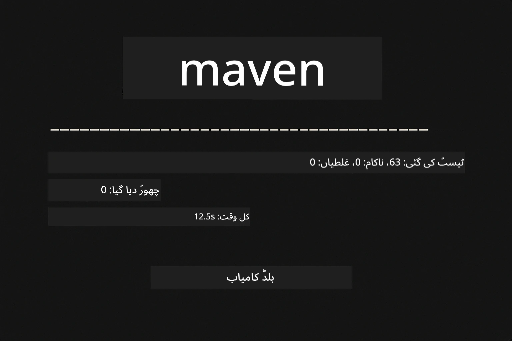
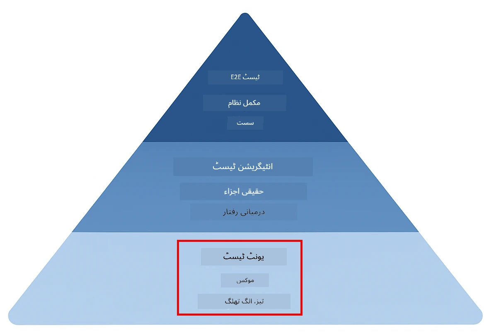
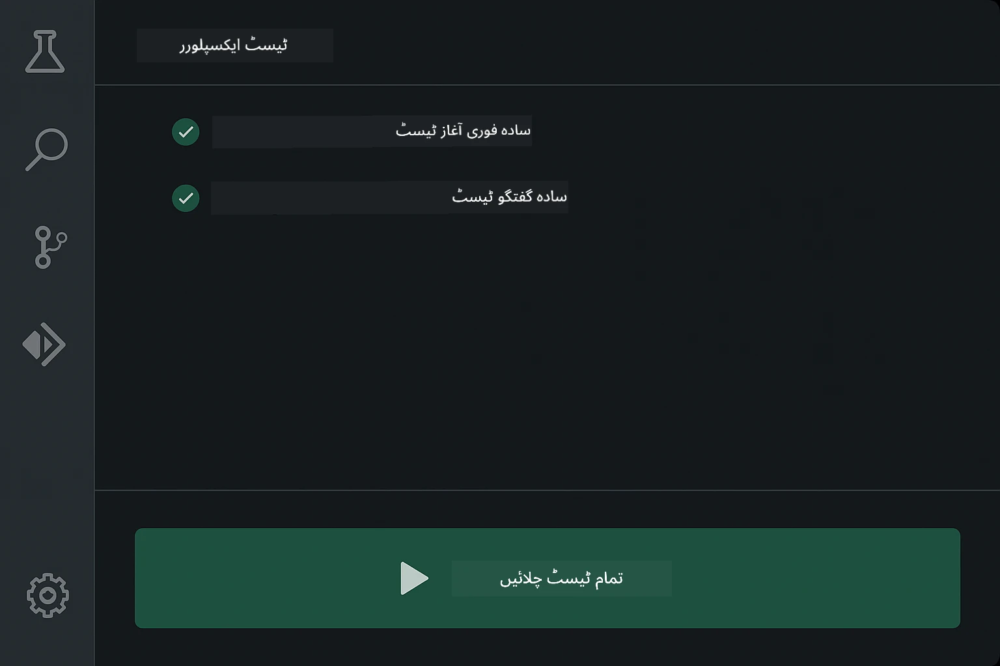
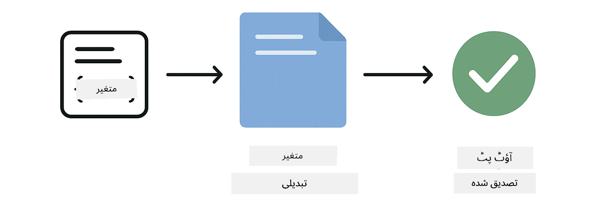
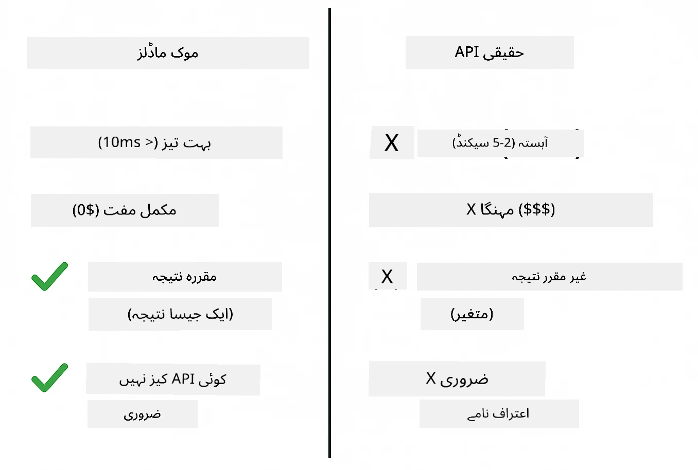
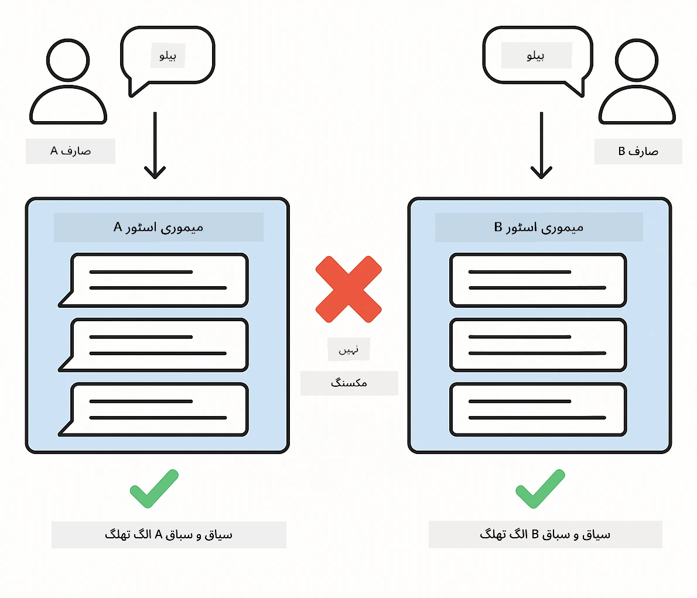
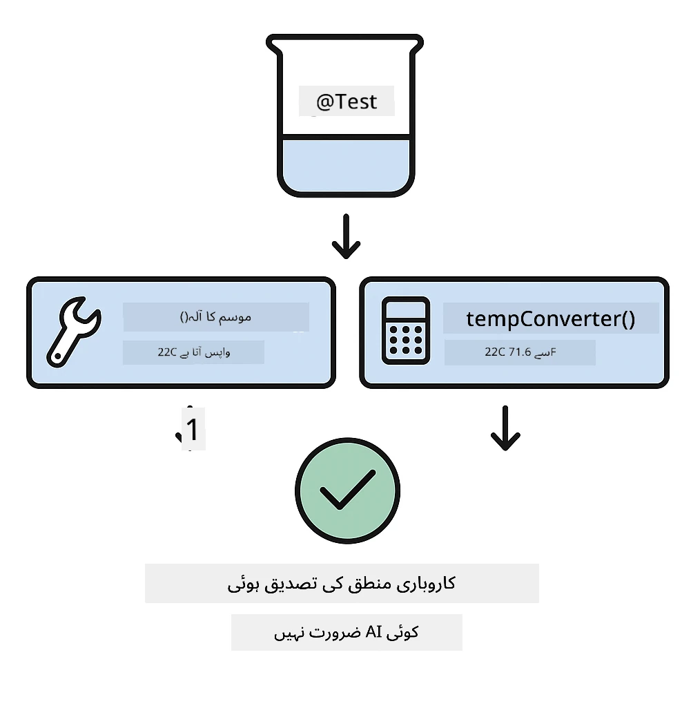
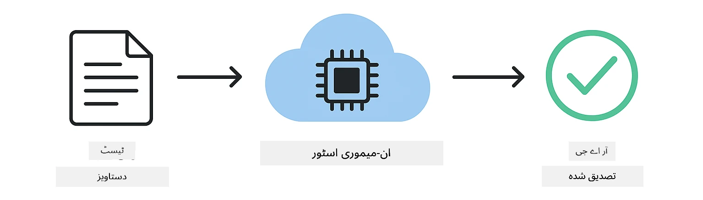

# LangChain4j ایپلی کیشنز کی ٹیسٹنگ

## جدولِ مندرجات

- [جلدی شروع کریں](#جلدی-شروع-کریں)
- [ٹیسٹس میں کیا شامل ہے](#ٹیسٹس-میں-کیا-شامل-ہے)
- [ٹیسٹس چلانا](#ٹیسٹس-چلانا)
- [VS کوڈ میں ٹیسٹس چلانا](#vs-کوڈ-میں-ٹیسٹس-چلانا)
- [ٹیسٹنگ کے نمونے](#ٹیسٹنگ-کے-نمونے)
- [ٹیسٹنگ کا فلسفہ](#ٹیسٹنگ-کا-فلسفہ)
- [اگلے مراحل](#اگلے-مراحل)

یہ گائیڈ آپ کو ان ٹیسٹس کے ذریعے لے جاتا ہے جو یہ دکھاتے ہیں کہ AI ایپلی کیشنز کو API کیز یا بیرونی سروسز کے بغیر کیسے ٹیسٹ کیا جا سکتا ہے۔

## جلدی شروع کریں

تمام ٹیسٹس ایک ہی کمانڈ سے چلائیں:

**Bash:**
```bash
mvn test
```

**PowerShell:**
```powershell
mvn --% test
```

جب تمام ٹیسٹ کامیاب ہو جائیں، تو اسکرین شاٹ کی طرح آؤٹ پٹ نظر آئے گا — ٹیسٹ صفر نقص کے ساتھ چلیں گے۔



*کامیاب ٹیسٹ کا نتیجہ جو تمام ٹیسٹس کے بغیر نقص کے گزرنے کو ظاہر کرتا ہے*

## ٹیسٹس میں کیا شامل ہے

یہ کورس **یونٹ ٹیسٹس** پر مرکوز ہے جو مقامی طور پر چلتے ہیں۔ ہر ٹیسٹ ایک مخصوص LangChain4j تصور کو الگ تھلگ ظاہر کرتا ہے۔ نیچے دیا گیا ٹیسٹنگ پیرامیڈ یہ دکھاتا ہے کہ یونٹ ٹیسٹس کہاں فٹ ہوتے ہیں — یہ تیز، قابل اعتماد بنیاد فراہم کرتے ہیں جس پر آپ کی باقی ٹیسٹنگ حکمت عملی قائم ہوتی ہے۔



*ٹیسٹنگ پیرامیڈ جو یونٹ ٹیسٹس (تیز، الگ تھلگ)، انٹیگریشن ٹیسٹس (حقیقی اجزاء)، اور اینڈ ٹو اینڈ ٹیسٹس کے درمیان توازن دکھاتا ہے۔ یہ تربیت یونٹ ٹیسٹنگ کا احاطہ کرتی ہے۔*

| ماڈیول | ٹیسٹس | توجہ | اہم فائلز |
|--------|-------|-------|-----------|
| **01 - تعارف** | 8 | بات چیت کی میموری اور حیثیت والا چیٹ | `SimpleConversationTest.java` |
| **02 - پرامپٹ انجنیئرنگ** | 12 | GPT-5.2 پیٹرنز، جوش کی سطحیں، منظم آؤٹ پٹ | `SimpleGpt5PromptTest.java` |
| **03 - رَیگ** | 10 | دستاویز اندراج، ایمبیڈنگز، مماثلت کی تلاش | `DocumentServiceTest.java` |
| **04 - ٹولز** | 12 | فنکشن کالنگ اور ٹول چیننگ | `SimpleToolsTest.java` |
| **05 - MCP** | 8 | ماڈل کانٹیکسٹ پروٹوکول استـعمال کرتے ہوئے Stdio ٹرانسپورٹ | `SimpleMcpTest.java` |

## ٹیسٹس چلانا

**سب ٹیسٹس روٹ سے چلائیں:**

**Bash:**
```bash
mvn test
```

**PowerShell:**
```powershell
mvn --% test
```

**مخصوص ماڈیول کے لیے ٹیسٹس چلائیں:**

**Bash:**
```bash
cd 01-introduction && mvn test
# یا روٹ سے
mvn test -pl 01-introduction
```

**PowerShell:**
```powershell
cd 01-introduction; mvn --% test
# یا جڑ سے
mvn --% test -pl 01-introduction
```

**ایک ٹیسٹ کلاس چلائیں:**

**Bash:**
```bash
mvn test -Dtest=SimpleConversationTest
```

**PowerShell:**
```powershell
mvn --% test -Dtest=SimpleConversationTest
```

**مخصوص ٹیسٹ میتھڈ چلائیں:**

**Bash:**
```bash
mvn test -Dtest=SimpleConversationTest#کیا گفتگو کی تاریخ برقرار رکھنی چاہیے
```

**PowerShell:**
```powershell
mvn --% test -Dtest=SimpleConversationTest#گفتگو کی تاریخ کو برقرار رکھنا چاہئے
```

## VS کوڈ میں ٹیسٹس چلانا

اگر آپ Visual Studio Code استعمال کر رہے ہیں، تو Test Explorer ٹیسٹس کو چلانے اور ڈیبگ کرنے کے لیے گرافیکل انٹرفیس فراہم کرتا ہے۔



*VS کوڈ ٹیسٹ ایکسپلورر میں تمام جاوا ٹیسٹ کلاسز اور انفرادی ٹیسٹ میتھڈز کے ساتھ ٹیسٹ ٹری دکھائی دے رہا ہے*

**VS کوڈ میں ٹیسٹس چلانے کے لیے:**

1. فعالیت بار میں بیكر آئیکون پر کلک کر کے Test Explorer کھولیں
2. ٹیسٹ ٹری کو وسعت دیں تاکہ تمام ماڈیولز اور ٹیسٹ کلاسز دیکھ سکیں
3. کسی بھی ٹیسٹ کے ساتھ پلے بٹن پر کلک کریں تاکہ اسے الگ چلایا جا سکے
4. "Run All Tests" پر کلک کریں تاکہ پوری سوئیٹ چلائی جا سکے
5. کسی بھی ٹیسٹ پر رائٹ کلک کر کے "Debug Test" منتخب کریں تاکہ بریک پوائنٹس سیٹ کر کے کوڈ میں قدم بہ قدم جا سکیں

Test Explorer کامیاب ٹیسٹس کے لیے سبز چیک مارکس دکھاتا ہے اور ناکامی کی صورت میں تفصیلی پیغام فراہم کرتا ہے۔

## ٹیسٹنگ کے نمونے

### پیٹرن 1: پرامپٹ ٹیمپلیٹس کی جانچ

سب سے آسان پیٹرن پرامپٹ ٹیمپلیٹس کو بغير AI ماڈل کال کیے ٹیسٹ کرتا ہے۔ آپ تصدیق کرتے ہیں کہ ویری ایبل کی جگہ صحیح طریقے سے تبدیل ہو رہی ہے اور پرامپٹس مطلوبہ فارمیٹ میں ہیں۔



*پرامپٹ ٹیمپلیٹس کی ٹیسٹنگ جو متغیر جگہوں کی تبدیلی کے بہاؤ کو دکھاتی ہے: ٹیمپلیٹ جس میں جگہ دار → اقدار کا اطلاق → فارمیٹ شدہ آؤٹ پٹ کی تصدیق*

```java
@Test
@DisplayName("Should format prompt template with variables")
void testPromptTemplateFormatting() {
    PromptTemplate template = PromptTemplate.from(
        "Best time to visit {{destination}} for {{activity}}?"
    );
    
    Prompt prompt = template.apply(Map.of(
        "destination", "Paris",
        "activity", "sightseeing"
    ));
    
    assertThat(prompt.text()).isEqualTo("Best time to visit Paris for sightseeing?");
}
```

یہ پیٹرن تصدیق کرتا ہے کہ ویری ایبل کی جگہ صحیح کام کرتی ہے اور پرامپٹس متوقع فارمیٹ میں ہیں — کوئی API کی یا ماڈل کال درکار نہیں۔

### پیٹرن 2: زبان کے ماڈلز کا مَک کرنا

بات چیت کے منطق کی جانچ کرتے وقت، Mockito استعمال کریں تاکہ جعلی ماڈلز بنائیں جو پہلے سے طے شدہ جوابات واپس کریں۔ اس سے ٹیسٹس تیز، مفت، اور یقینی بنتے ہیں۔



*موازنہ جو دکھاتا ہے کہ ٹیسٹنگ کے لیے مکس کیوں ترجیح دی جاتی ہے: یہ تیز، مفت، یقینی اور API کیز کے بغیر ہوتی ہے*

```java
@ExtendWith(MockitoExtension.class)
class SimpleConversationTest {
    
    private ConversationService conversationService;
    
    @Mock
    private OpenAiOfficialChatModel mockChatModel;
    
    @BeforeEach
    void setUp() {
        ChatResponse mockResponse = ChatResponse.builder()
            .aiMessage(AiMessage.from("This is a test response"))
            .build();
        when(mockChatModel.chat(anyList())).thenReturn(mockResponse);
        
        conversationService = new ConversationService(mockChatModel);
    }
    
    @Test
    void shouldMaintainConversationHistory() {
        String conversationId = conversationService.startConversation();
        
        ChatResponse mockResponse1 = ChatResponse.builder()
            .aiMessage(AiMessage.from("Response 1"))
            .build();
        ChatResponse mockResponse2 = ChatResponse.builder()
            .aiMessage(AiMessage.from("Response 2"))
            .build();
        ChatResponse mockResponse3 = ChatResponse.builder()
            .aiMessage(AiMessage.from("Response 3"))
            .build();
        
        when(mockChatModel.chat(anyList()))
            .thenReturn(mockResponse1)
            .thenReturn(mockResponse2)
            .thenReturn(mockResponse3);

        conversationService.chat(conversationId, "First message");
        conversationService.chat(conversationId, "Second message");
        conversationService.chat(conversationId, "Third message");

        List<ChatMessage> history = conversationService.getHistory(conversationId);
        assertThat(history).hasSize(6); // ۳ صارف + ۳ اے آئی پیغامات
    }
}
```

یہ پیٹرن `01-introduction/src/test/java/com/example/langchain4j/service/SimpleConversationTest.java` میں موجود ہے۔ مَک مسلسل برتاؤ کو یقینی بناتا ہے تاکہ آپ میموری مینجمنٹ کو صحیح طریقے سے جانچ سکیں۔

### پیٹرن 3: بات چیت کی علیحدگی کی جانچ

بات چیت کی میموری کو متعدد صارفین کو الگ رکھنا چاہیے۔ یہ ٹیسٹ تصدیق کرتا ہے کہ بات چیت کے سیاق و سباق مکس نہیں ہوتے۔



*بات چیت کی علیحدگی کی ٹیسٹنگ جو مختلف صارفین کے لیے علیحدہ میموری اسٹورز دکھاتی ہے تاکہ سیاق و سباق کی مِکسنگ روکی جا سکے*

```java
@Test
void shouldIsolateConversationsByid() {
    String conv1 = conversationService.startConversation();
    String conv2 = conversationService.startConversation();
    
    ChatResponse mockResponse = ChatResponse.builder()
        .aiMessage(AiMessage.from("Response"))
        .build();
    when(mockChatModel.chat(anyList())).thenReturn(mockResponse);

    conversationService.chat(conv1, "Message for conversation 1");
    conversationService.chat(conv2, "Message for conversation 2");

    List<ChatMessage> history1 = conversationService.getHistory(conv1);
    List<ChatMessage> history2 = conversationService.getHistory(conv2);
    
    assertThat(history1).hasSize(2);
    assertThat(history2).hasSize(2);
}
```

ہر بات چیت اپنی آزاد تاریخ رکھتی ہے۔ پروڈکشن سسٹمز میں، یہ علیحدگی ملٹی یوزر ایپلی کیشنز کے لیے انتہائی اہم ہے۔

### پیٹرن 4: ٹولز کی آزادانہ ٹیسٹنگ

ٹولز فنکشنز ہوتے ہیں جنہیں AI کال کر سکتا ہے۔ انہیں براہِ راست ٹیسٹ کریں تاکہ یقین ہو کہ وہ AI فیصلوں سے قطع نظر صحیح کام کر رہے ہیں۔



*ٹولز کی آزادانہ ٹیسٹنگ جو AI کالز کے بغیر مَک ٹول ایگزیکیوشن دکھاتی ہے تاکہ کاروباری منطق کی تصدیق کی جا سکے*

```java
@Test
void shouldConvertCelsiusToFahrenheit() {
    TemperatureTool tempTool = new TemperatureTool();
    String result = tempTool.celsiusToFahrenheit(25.0);
    assertThat(result).containsPattern("77[.,]0°F");
}

@Test
void shouldDemonstrateToolChaining() {
    WeatherTool weatherTool = new WeatherTool();
    TemperatureTool tempTool = new TemperatureTool();

    String weatherResult = weatherTool.getCurrentWeather("Seattle");
    assertThat(weatherResult).containsPattern("\\d+°C");

    String conversionResult = tempTool.celsiusToFahrenheit(22.0);
    assertThat(conversionResult).containsPattern("71[.,]6°F");
}
```

یہ ٹیسٹس `04-tools/src/test/java/com/example/langchain4j/agents/tools/SimpleToolsTest.java` سے ہیں جو AI مداخلت کے بغیر ٹول منطق کی توثیق کرتے ہیں۔ چیننگ کی مثال دکھاتی ہے کہ کس طرح ایک ٹول کا آؤٹ پٹ دوسرے کے ان پٹ میں جاتا ہے۔

### پیٹرن 5: ان میموری RAG ٹیسٹنگ

رَیگ سسٹمز روایتی طور پر ویکٹر ڈیٹابیسز اور ایمبیڈنگ سروسز کا تقاضا کرتے ہیں۔ ان میموری پیٹرن آپ کو پورے پائپ لائن کو بیرونی انحصار کے بغیر ٹیسٹ کرنے دیتا ہے۔



*ان میموری رَیگ ٹیسٹنگ ورک فلو جو دستاویز کی پارسنگ، ایمبیڈنگ اسٹوریج، اور مماثلت کی تلاش بغیر ڈیٹابیس کی ضرورت کے دکھاتا ہے*

```java
@Test
void testProcessTextDocument() {
    String content = "This is a test document.\nIt has multiple lines.";
    InputStream inputStream = new ByteArrayInputStream(content.getBytes(StandardCharsets.UTF_8));
    
    DocumentService.ProcessedDocument result = 
        documentService.processDocument(inputStream, "test.txt");

    assertNotNull(result);
    assertTrue(result.segments().size() > 0);
    assertEquals("test.txt", result.segments().get(0).metadata().getString("filename"));
}
```

یہ ٹیسٹ `03-rag/src/test/java/com/example/langchain4j/rag/service/DocumentServiceTest.java` میں ہے جو دستاویز کو میموری میں بناتا ہے اور چنکنگ اور میٹا ڈیٹا ہینڈلنگ کی تصدیق کرتا ہے۔

### پیٹرن 6: MCP انٹیگریشن ٹیسٹنگ

MCP ماڈیول ماڈل کانٹیکسٹ پروٹوکول انٹیگریشن کو stdio ٹرانسپورٹ استعمال کرتے ہوئے ٹیسٹ کرتا ہے۔ یہ ٹیسٹس یہ دیکھتے ہیں کہ آپ کی ایپلیکیشن MCP سرورز کو subprocess کی طرح اسپان کر کے ان سے بات چیت کر سکتی ہے یا نہیں۔

`05-mcp/src/test/java/com/example/langchain4j/mcp/SimpleMcpTest.java` میں یہ ٹیسٹس MCP کلائنٹ کے رویے کی توثیق کرتے ہیں۔

**انہیں چلائیں:**

**Bash:**
```bash
cd 05-mcp && mvn test
```

**PowerShell:**
```powershell
cd 05-mcp; mvn --% test
```

## ٹیسٹنگ کا فلسفہ

اپنا کوڈ ٹیسٹ کریں، AI کو نہیں۔ آپ کے ٹیسٹس آپ کے لکھے ہوئے کوڈ کی تصدیق کریں کہ کس طرح پرامپٹس بنائے جاتے ہیں، میموری کو کیسے منظم کیا جاتا ہے، اور ٹولز کیسے چلتے ہیں۔ AI کے جوابات متغیر ہوتے ہیں اور انہیں ٹیسٹ اسیرشنز کا حصہ نہیں ہونا چاہیے۔ اپنے آپ سے پوچھیں کہ کیا آپ کا پرامپٹ ٹیمپلیٹ صحیح طریقے سے ویری ایبلز کو بدلا ہے، نہ کہ AI صحیح جواب دے رہا ہے۔

زبان کے ماڈلز کے لیے مَک استعمال کریں۔ یہ بیرونی انحصار ہوتے ہیں جو سست، مہنگے، اور غیر یقینی ہوتے ہیں۔ مَکنگ سے ٹیسٹس سیکنڈز کی جگہ ملی سیکنڈز میں تیز، بغیر API اخراجات کے مفت، اور ہر بار ایک جیسا نتیجہ دینے والے یقینی بنتے ہیں۔

ٹیسٹس کو آزاد رکھیں۔ ہر ٹیسٹ اپنی ڈیٹا خود سیٹ کرے، دوسرے ٹیسٹس پر انحصار نہ کرے، اور اپنے بعد صفائی کرے۔ ٹیسٹس چاہے کسی بھی ترتیب میں چلیں، کامیاب ہونا چاہیے۔

خوشگوار راستے سے آگے کناروں کے معاملات کی جانچ کریں۔ خالی ان پٹ، بہت بڑے ان پٹ، خاص کریکٹرز، غلط پیرامیٹرز، اور حد بندی کی حالتیں آزمائیں۔ یہ اکثر ایسے بگز کو ظاہر کرتے ہیں جو معمول کے استعمال میں سامنے نہیں آتے۔

وضاحتی ناموں کا استعمال کریں۔ مثلا `shouldMaintainConversationHistoryAcrossMultipleMessages()` کو `test1()` کے بجائے دیکھیں۔ پہلا نام آپ کو بالکل بتاتا ہے کہ کیا ٹیسٹ ہو رہا ہے، جس سے خرابیاں تلاش کرنا آسان ہو جاتا ہے۔

## اگلے مراحل

اب جب آپ ٹیسٹنگ کے نمونوں کو سمجھ گئے ہیں، ہر ماڈیول میں گہرائی سے جائیں:

- **[01 - تعارف](../01-introduction/README.md)** - بات چیت کی میموری مینجمنٹ سیکھیں
- **[02 - پرامپٹ انجنیئرنگ](../02-prompt-engineering/README.md)** - GPT-5.2 پرامپٹنگ پیٹرنز میں مہارت حاصل کریں
- **[03 - رَیگ](../03-rag/README.md)** - رٹریول آگمینٹڈ جنریشن سسٹمز بنائیں
- **[04 - ٹولز](../04-tools/README.md)** - فنکشن کالنگ اور ٹول چینز لاگو کریں
- **[05 - MCP](../05-mcp/README.md)** - ماڈل کانٹیکسٹ پروٹوکول انٹیگریٹ کریں

ہر ماڈیول کی README یہاں ٹیسٹ کیے گئے تصورات کی تفصیلی وضاحت فراہم کرتی ہے۔

---

**نیویگیشن:** [← مرکزی صفحے پر واپس جائیں](../README.md)

---

<!-- CO-OP TRANSLATOR DISCLAIMER START -->
**ڈس کلیمر**:
یہ دستاویز AI ترجمہ سروس [Co-op Translator](https://github.com/Azure/co-op-translator) کے ذریعے ترجمہ کی گئی ہے۔ جبکہ ہم درستگی کے لیے کوشاں ہیں، براہ کرم اس بات سے آگاہ رہیں کہ خودکار ترجمے میں غلطیاں یا عدم درستیاں ہو سکتی ہیں۔ اصل دستاویز اپنے مادری زبان میں مستند ماخذ سمجھی جائے گی۔ حساس معلومات کے لیے پیشہ ور انسانی ترجمہ کی سفارش کی جاتی ہے۔ اس ترجمے کے استعمال سے پیدا ہونے والی کسی بھی غلط فہمی یا غلط تشریح کی ذمہ داری ہم قبول نہیں کرتے۔
<!-- CO-OP TRANSLATOR DISCLAIMER END -->