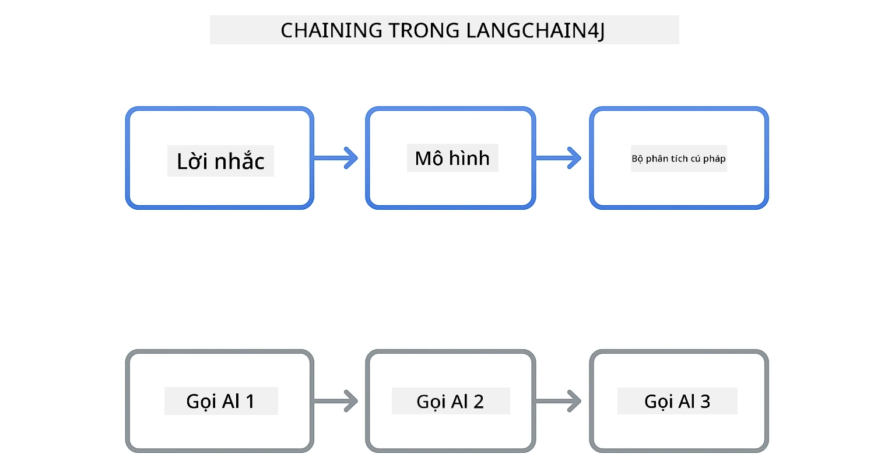
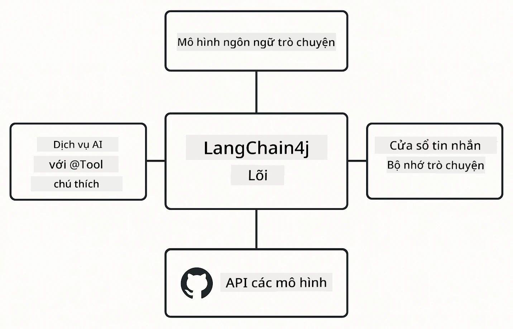

# Module 00: Bắt đầu nhanh

## Mục lục

- [Giới thiệu](../../../00-quick-start)
- [LangChain4j là gì?](../../../00-quick-start)
- [Phụ thuộc của LangChain4j](../../../00-quick-start)
- [Yêu cầu cần thiết](../../../00-quick-start)
- [Thiết lập](../../../00-quick-start)
  - [1. Lấy token GitHub của bạn](../../../00-quick-start)
  - [2. Thiết lập token của bạn](../../../00-quick-start)
- [Chạy các ví dụ](../../../00-quick-start)
  - [1. Trò chuyện cơ bản](../../../00-quick-start)
  - [2. Mẫu lệnh nhắc](../../../00-quick-start)
  - [3. Gọi hàm](../../../00-quick-start)
  - [4. Hỏi đáp tài liệu (RAG)](../../../00-quick-start)
  - [5. AI có trách nhiệm](../../../00-quick-start)
- [Mỗi ví dụ thể hiện điều gì](../../../00-quick-start)
- [Các bước tiếp theo](../../../00-quick-start)
- [Khắc phục sự cố](../../../00-quick-start)

## Giới thiệu

Hướng dẫn bắt đầu nhanh này nhằm giúp bạn khởi động và chạy LangChain4j một cách nhanh nhất có thể. Nó bao gồm những kiến thức cơ bản nhất về xây dựng ứng dụng AI với LangChain4j và GitHub Models. Trong các module tiếp theo, bạn sẽ sử dụng Azure OpenAI với LangChain4j để xây dựng các ứng dụng nâng cao hơn.

## LangChain4j là gì?

LangChain4j là một thư viện Java giúp đơn giản hóa việc xây dựng các ứng dụng AI. Thay vì phải xử lý các client HTTP và phân tích JSON, bạn làm việc trực tiếp với các API Java gọn gàng.

Từ "chain" trong LangChain đề cập đến việc liên kết các thành phần lại với nhau – bạn có thể nối một lệnh nhắc với một mô hình rồi với một bộ phân tích cú pháp, hoặc nối nhiều lần gọi AI với nhau sao cho đầu ra của lần gọi này trở thành đầu vào cho lần gọi tiếp theo. Hướng dẫn bắt đầu nhanh này tập trung vào những điều cơ bản trước khi khám phá các chuỗi phức tạp hơn.



*Liên kết các thành phần trong LangChain4j - các khối xây dựng kết nối để tạo ra các luồng công việc AI mạnh mẽ*

Chúng ta sẽ sử dụng ba thành phần cốt lõi:

**ChatLanguageModel** - Giao diện cho tương tác với mô hình AI. Gọi `model.chat("prompt")` và nhận về một chuỗi phản hồi. Chúng ta sử dụng `OpenAiOfficialChatModel` hoạt động với các điểm cuối tương thích OpenAI như GitHub Models.

**AiServices** - Tạo giao diện dịch vụ AI an toàn kiểu. Định nghĩa các phương thức, chú thích bằng `@Tool`, và LangChain4j sẽ xử lý việc điều phối. AI tự động gọi các phương thức Java của bạn khi cần thiết.

**MessageWindowChatMemory** - Duy trì lịch sử hội thoại. Nếu không có nó, mỗi yêu cầu là độc lập. Với nó, AI nhớ các tin nhắn trước và duy trì ngữ cảnh qua nhiều lượt hỏi đáp.



*Kiến trúc LangChain4j - các thành phần cốt lõi hoạt động cùng nhau để thúc đẩy ứng dụng AI của bạn*

## Phụ thuộc của LangChain4j

Hướng dẫn này sử dụng hai phụ thuộc Maven trong file [`pom.xml`](../../../00-quick-start/pom.xml):

```xml
<!-- Core LangChain4j library -->
<dependency>
    <groupId>dev.langchain4j</groupId>
    <artifactId>langchain4j</artifactId> <!-- Inherited from BOM in root pom.xml -->
</dependency>

<!-- OpenAI integration (works with GitHub Models) -->
<dependency>
    <groupId>dev.langchain4j</groupId>
    <artifactId>langchain4j-open-ai-official</artifactId> <!-- Inherited from BOM in root pom.xml -->
</dependency>
```

Module `langchain4j-open-ai-official` cung cấp lớp `OpenAiOfficialChatModel` kết nối với API tương thích OpenAI. GitHub Models sử dụng cùng định dạng API, vì vậy không cần adapter đặc biệt - chỉ cần trỏ URL cơ sở đến `https://models.github.ai/inference`.

## Yêu cầu cần thiết

**Sử dụng Dev Container?** Java và Maven đã được cài sẵn. Bạn chỉ cần token cá nhân GitHub.

**Phát triển cục bộ:**
- Java 21+, Maven 3.9+
- Token truy cập cá nhân GitHub (hướng dẫn bên dưới)

> **Lưu ý:** Module này sử dụng `gpt-4.1-nano` từ GitHub Models. Không thay đổi tên mô hình trong mã – nó được cấu hình để hoạt động với các mô hình có sẵn của GitHub.

## Thiết lập

### 1. Lấy token GitHub của bạn

1. Truy cập [GitHub Settings → Personal Access Tokens](https://github.com/settings/personal-access-tokens)
2. Nhấn "Generate new token"
3. Đặt tên mô tả (ví dụ: "LangChain4j Demo")
4. Chọn thời hạn hết hạn (khuyến nghị 7 ngày)
5. Trong "Account permissions", tìm "Models" và chọn "Read-only"
6. Nhấn "Generate token"
7. Sao chép và lưu token – bạn sẽ không thấy lại nó

### 2. Thiết lập token của bạn

**Cách 1: Dùng VS Code (khuyến nghị)**

Nếu bạn dùng VS Code, thêm token vào file `.env` trong thư mục gốc dự án:

Nếu file `.env` chưa có, sao chép từ `.env.example` hoặc tạo file `.env` mới trong thư mục gốc dự án.

**Ví dụ file `.env`:**
```bash
# Trong /workspaces/LangChain4j-for-Beginners/.env
GITHUB_TOKEN=your_token_here
```

Sau đó đơn giản là click chuột phải vào bất kỳ file demo nào (ví dụ, `BasicChatDemo.java`) trong Explorer và chọn **"Run Java"** hoặc dùng cấu hình chạy trong bảng Run and Debug.

**Cách 2: Dùng Terminal**

Thiết lập token dưới dạng biến môi trường:

**Bash:**
```bash
export GITHUB_TOKEN=your_token_here
```

**PowerShell:**
```powershell
$env:GITHUB_TOKEN=your_token_here
```

## Chạy các ví dụ

**Dùng VS Code:** Click phải trên bất kỳ file demo nào trong Explorer và chọn **"Run Java"**, hoặc dùng cấu hình chạy từ bảng Run and Debug (đảm bảo bạn đã thêm token vào file `.env` trước).

**Dùng Maven:** Ngoài ra, bạn có thể chạy từ dòng lệnh:

### 1. Trò chuyện cơ bản

**Bash:**
```bash
mvn compile exec:java -Dexec.mainClass=com.example.langchain4j.quickstart.BasicChatDemo
```

**PowerShell:**
```powershell
mvn --% compile exec:java -Dexec.mainClass=com.example.langchain4j.quickstart.BasicChatDemo
```

### 2. Mẫu lệnh nhắc

**Bash:**
```bash
mvn compile exec:java -Dexec.mainClass=com.example.langchain4j.quickstart.PromptEngineeringDemo
```

**PowerShell:**
```powershell
mvn --% compile exec:java -Dexec.mainClass=com.example.langchain4j.quickstart.PromptEngineeringDemo
```

Hiển thị mẫu zero-shot, few-shot, chain-of-thought và role-based prompting.

### 3. Gọi hàm

**Bash:**
```bash
mvn compile exec:java -Dexec.mainClass=com.example.langchain4j.quickstart.ToolIntegrationDemo
```

**PowerShell:**
```powershell
mvn --% compile exec:java -Dexec.mainClass=com.example.langchain4j.quickstart.ToolIntegrationDemo
```

AI tự động gọi các phương thức Java của bạn khi cần.

### 4. Hỏi đáp tài liệu (RAG)

**Bash:**
```bash
mvn compile exec:java -Dexec.mainClass=com.example.langchain4j.quickstart.SimpleReaderDemo
```

**PowerShell:**
```powershell
mvn --% compile exec:java -Dexec.mainClass=com.example.langchain4j.quickstart.SimpleReaderDemo
```

Hỏi các câu hỏi về nội dung trong `document.txt`.

### 5. AI có trách nhiệm

**Bash:**
```bash
mvn compile exec:java -Dexec.mainClass=com.example.langchain4j.quickstart.ResponsibleAIDemo
```

**PowerShell:**
```powershell
mvn --% compile exec:java -Dexec.mainClass=com.example.langchain4j.quickstart.ResponsibleAIDemo
```

Xem cách các bộ lọc an toàn AI chặn nội dung có hại.

## Mỗi ví dụ thể hiện điều gì

**Trò chuyện cơ bản** - [BasicChatDemo.java](../../../00-quick-start/src/main/java/com/example/langchain4j/quickstart/BasicChatDemo.java)

Bắt đầu từ đây để thấy LangChain4j đơn giản nhất. Bạn sẽ tạo một `OpenAiOfficialChatModel`, gửi một lệnh nhắc với `.chat()`, và nhận về phản hồi. Đây là nền tảng: khởi tạo mô hình với điểm cuối và khóa API tùy chỉnh. Khi bạn hiểu mô hình này, mọi thứ còn lại đều xây dựng dựa trên nó.

```java
ChatLanguageModel model = OpenAiOfficialChatModel.builder()
    .baseUrl("https://models.github.ai/inference")
    .apiKey(System.getenv("GITHUB_TOKEN"))
    .modelName("gpt-4.1-nano")
    .build();

String response = model.chat("What is LangChain4j?");
System.out.println(response);
```

> **🤖 Thử với [GitHub Copilot](https://github.com/features/copilot) Chat:** Mở [`BasicChatDemo.java`](../../../00-quick-start/src/main/java/com/example/langchain4j/quickstart/BasicChatDemo.java) và hỏi:
> - "Làm thế nào để chuyển từ GitHub Models sang Azure OpenAI trong mã này?"
> - "Các tham số khác nào có thể cấu hình trong OpenAiOfficialChatModel.builder()?"
> - "Làm thế nào để thêm streaming responses thay vì chờ phản hồi đầy đủ?"

**Kỹ thuật Lệnh nhắc** - [PromptEngineeringDemo.java](../../../00-quick-start/src/main/java/com/example/langchain4j/quickstart/PromptEngineeringDemo.java)

Bây giờ bạn đã biết cách nói chuyện với mô hình, hãy khám phá những gì bạn nói với nó. Demo này dùng cùng cấu hình mô hình nhưng thể hiện bốn mẫu lệnh nhắc khác nhau. Thử zero-shot prompts chỉ dẫn trực tiếp, few-shot prompts học từ ví dụ, chain-of-thought prompts tiết lộ các bước suy luận, và role-based prompts thiết lập ngữ cảnh. Bạn sẽ thấy cùng một mô hình cho ra kết quả rất khác dựa trên cách bạn diễn đạt yêu cầu.

```java
PromptTemplate template = PromptTemplate.from(
    "What's the best time to visit {{destination}} for {{activity}}?"
);

Prompt prompt = template.apply(Map.of(
    "destination", "Paris",
    "activity", "sightseeing"
));

String response = model.chat(prompt.text());
```

> **🤖 Thử với [GitHub Copilot](https://github.com/features/copilot) Chat:** Mở [`PromptEngineeringDemo.java`](../../../00-quick-start/src/main/java/com/example/langchain4j/quickstart/PromptEngineeringDemo.java) và hỏi:
> - "Sự khác nhau giữa zero-shot và few-shot prompting là gì, và khi nào nên dùng mỗi kiểu?"
> - "Tham số nhiệt độ ảnh hưởng thế nào đến phản hồi của mô hình?"
> - "Các kỹ thuật nào giúp tránh prompt injection attacks trong môi trường sản xuất?"
> - "Làm thế nào để tạo các đối tượng PromptTemplate tái sử dụng cho các mẫu phổ biến?"

**Tích hợp Công cụ** - [ToolIntegrationDemo.java](../../../00-quick-start/src/main/java/com/example/langchain4j/quickstart/ToolIntegrationDemo.java)

Đây là nơi LangChain4j thể hiện sức mạnh. Bạn sẽ dùng `AiServices` để tạo một trợ lý AI có thể gọi các phương thức Java của bạn. Chỉ cần chú thích phương thức với `@Tool("mô tả")` và LangChain4j xử lý phần còn lại - AI tự động quyết định khi nào sử dụng công cụ nào dựa trên yêu cầu của người dùng. Đây là minh họa cho kỹ thuật gọi hàm, một kỹ thuật then chốt để xây dựng AI có thể thực thi hành động, không chỉ trả lời câu hỏi.

```java
@Tool("Performs addition of two numeric values")
public double add(double a, double b) {
    return a + b;
}

MathAssistant assistant = AiServices.create(MathAssistant.class, model);
String response = assistant.chat("What is 25 plus 17?");
```

> **🤖 Thử với [GitHub Copilot](https://github.com/features/copilot) Chat:** Mở [`ToolIntegrationDemo.java`](../../../00-quick-start/src/main/java/com/example/langchain4j/quickstart/ToolIntegrationDemo.java) và hỏi:
> - "Chú thích @Tool hoạt động thế nào và LangChain4j làm gì phía sau?"
> - "AI có thể gọi nhiều công cụ liên tiếp để giải quyết vấn đề phức tạp không?"
> - "Nếu một công cụ phát sinh ngoại lệ - tôi nên xử lý lỗi thế nào?"
> - "Làm thế nào để tích hợp một API thật thay vì ví dụ máy tính này?"

**Hỏi đáp tài liệu (RAG)** - [SimpleReaderDemo.java](../../../00-quick-start/src/main/java/com/example/langchain4j/quickstart/SimpleReaderDemo.java)

Tại đây bạn sẽ thấy nền tảng của RAG (retrieval-augmented generation). Thay vì dựa vào dữ liệu huấn luyện của mô hình, bạn tải nội dung từ [`document.txt`](../../../00-quick-start/document.txt) và đưa vào lệnh nhắc. AI trả lời dựa trên tài liệu của bạn, không dựa trên kiến thức chung. Đây là bước đầu tiên để xây dựng hệ thống làm việc với dữ liệu riêng của bạn.

```java
Document document = FileSystemDocumentLoader.loadDocument("document.txt");
String content = document.text();

String prompt = "Based on this document: " + content + 
                "\nQuestion: What is the main topic?";
String response = model.chat(prompt);
```

> **Lưu ý:** Cách đơn giản này tải toàn bộ tài liệu vào lệnh nhắc. Với tài liệu lớn (>10KB), bạn sẽ vượt giới hạn ngữ cảnh. Module 03 trình bày cách phân đoạn và tìm kiếm vector cho hệ thống RAG sản xuất.

> **🤖 Thử với [GitHub Copilot](https://github.com/features/copilot) Chat:** Mở [`SimpleReaderDemo.java`](../../../00-quick-start/src/main/java/com/example/langchain4j/quickstart/SimpleReaderDemo.java) và hỏi:
> - "RAG giúp ngăn ngừa AI ảo tưởng khác thế nào so với dùng dữ liệu huấn luyện của mô hình?"
> - "Sự khác nhau giữa cách đơn giản này và việc dùng vector embeddings để truy xuất?"
> - "Làm sao để mở rộng xử lý nhiều tài liệu hoặc cơ sở tri thức lớn hơn?"
> - "Thực hành tốt nhất để cấu trúc lệnh nhắc sao cho AI chỉ dùng ngữ cảnh được cung cấp là gì?"

**AI có trách nhiệm** - [ResponsibleAIDemo.java](../../../00-quick-start/src/main/java/com/example/langchain4j/quickstart/ResponsibleAIDemo.java)

Xây dựng an toàn AI với đa lớp bảo vệ. Demo này thể hiện hai lớp bảo vệ cùng hoạt động:

**Phần 1: LangChain4j Input Guardrails** - Chặn các lệnh nhắc nguy hiểm trước khi đến LLM. Tạo các guardrails tùy chỉnh kiểm tra từ khóa hoặc mẫu bị cấm. Chúng chạy trong mã của bạn, nên nhanh và miễn phí.

```java
class DangerousContentGuardrail implements InputGuardrail {
    @Override
    public InputGuardrailResult validate(UserMessage userMessage) {
        String text = userMessage.singleText().toLowerCase();
        if (text.contains("explosives")) {
            return fatal("Blocked: contains prohibited keyword");
        }
        return success();
    }
}
```

**Phần 2: Bộ lọc an toàn của nhà cung cấp** - GitHub Models có bộ lọc tích hợp phát hiện những gì guardrails có thể bỏ sót. Bạn sẽ thấy các chặn cứng (lỗi HTTP 400) cho vi phạm nghiêm trọng và từ chối nhẹ nhàng khi AI lịch sự từ chối.

> **🤖 Thử với [GitHub Copilot](https://github.com/features/copilot) Chat:** Mở [`ResponsibleAIDemo.java`](../../../00-quick-start/src/main/java/com/example/langchain4j/quickstart/ResponsibleAIDemo.java) và hỏi:
> - "InputGuardrail là gì và làm thế nào để tạo guardrail của riêng mình?"
> - "Sự khác biệt giữa chặn cứng và từ chối nhẹ nhàng là gì?"
> - "Tại sao nên dùng cả guardrails và bộ lọc nhà cung cấp cùng lúc?"

## Các bước tiếp theo

**Module tiếp theo:** [01-introduction - Bắt đầu với LangChain4j và gpt-5 trên Azure](../01-introduction/README.md)

---

**Điều hướng:** [← Quay lại Chính](../README.md) | [Tiếp theo: Module 01 - Giới thiệu →](../01-introduction/README.md)

---

## Khắc phục sự cố

### Lần đầu xây dựng Maven

**Vấn đề**: Lệnh `mvn clean compile` hoặc `mvn package` ban đầu tốn nhiều thời gian (10-15 phút)

**Nguyên nhân**: Maven cần tải về tất cả các phụ thuộc dự án (Spring Boot, thư viện LangChain4j, SDK Azure, v.v.) trong lần build đầu tiên.

**Giải pháp**: Đây là hành vi bình thường. Các lần build sau sẽ nhanh hơn nhiều vì các phụ thuộc đã được lưu trong cache cục bộ. Thời gian tải phụ thuộc vào tốc độ mạng của bạn.

### Cú pháp lệnh Maven trên PowerShell

**Vấn đề**: Lệnh Maven bị lỗi `Unknown lifecycle phase ".mainClass=..."`

**Nguyên nhân**: PowerShell hiểu dấu `=` là toán tử gán biến, làm vỡ cú pháp thuộc tính Maven.
**Giải pháp**: Sử dụng toán tử stop-parsing `--%` trước lệnh Maven:

**PowerShell:**
```powershell
mvn --% compile exec:java -Dexec.mainClass=com.example.langchain4j.quickstart.BasicChatDemo
```

**Bash:**
```bash
mvn compile exec:java -Dexec.mainClass=com.example.langchain4j.quickstart.BasicChatDemo
```

Toán tử `--%` cho PowerShell biết truyền tất cả các đối số còn lại nguyên văn cho Maven mà không giải thích.

### Hiển thị Biểu tượng cảm xúc trong Windows PowerShell

**Vấn đề**: Phản hồi AI hiển thị ký tự rác (ví dụ, `????` hoặc `â??`) thay vì biểu tượng cảm xúc trong PowerShell

**Nguyên nhân**: Mã hóa mặc định của PowerShell không hỗ trợ biểu tượng cảm xúc UTF-8

**Giải pháp**: Chạy lệnh này trước khi chạy các ứng dụng Java:
```cmd
chcp 65001
```

Điều này buộc mã hóa UTF-8 trong terminal. Ngoài ra, có thể sử dụng Windows Terminal vì nó hỗ trợ Unicode tốt hơn.

### Gỡ lỗi các cuộc gọi API

**Vấn đề**: Lỗi xác thực, giới hạn tần suất, hoặc phản hồi bất ngờ từ mô hình AI

**Giải pháp**: Các ví dụ bao gồm `.logRequests(true)` và `.logResponses(true)` để hiển thị các cuộc gọi API trong console. Điều này giúp kiểm tra lỗi xác thực, giới hạn tần suất, hoặc phản hồi không mong muốn. Loại bỏ các cờ này trong môi trường sản xuất để giảm độ ồn log.

---

<!-- CO-OP TRANSLATOR DISCLAIMER START -->
**Tuyên bố từ chối trách nhiệm**:  
Tài liệu này đã được dịch bằng dịch vụ dịch thuật AI [Co-op Translator](https://github.com/Azure/co-op-translator). Mặc dù chúng tôi cố gắng đảm bảo độ chính xác, xin lưu ý rằng các bản dịch tự động có thể chứa lỗi hoặc không chính xác. Tài liệu gốc bằng ngôn ngữ bản địa của nó nên được coi là nguồn thông tin chính thức. Đối với những thông tin quan trọng, nên sử dụng dịch vụ dịch thuật chuyên nghiệp do con người thực hiện. Chúng tôi không chịu trách nhiệm đối với bất kỳ sự hiểu lầm hay giải thích sai nào phát sinh từ việc sử dụng bản dịch này.
<!-- CO-OP TRANSLATOR DISCLAIMER END -->