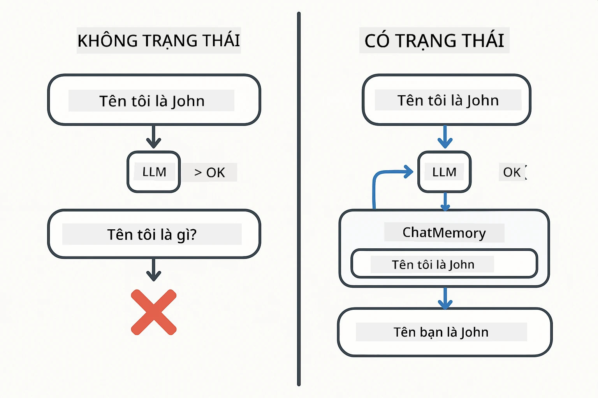
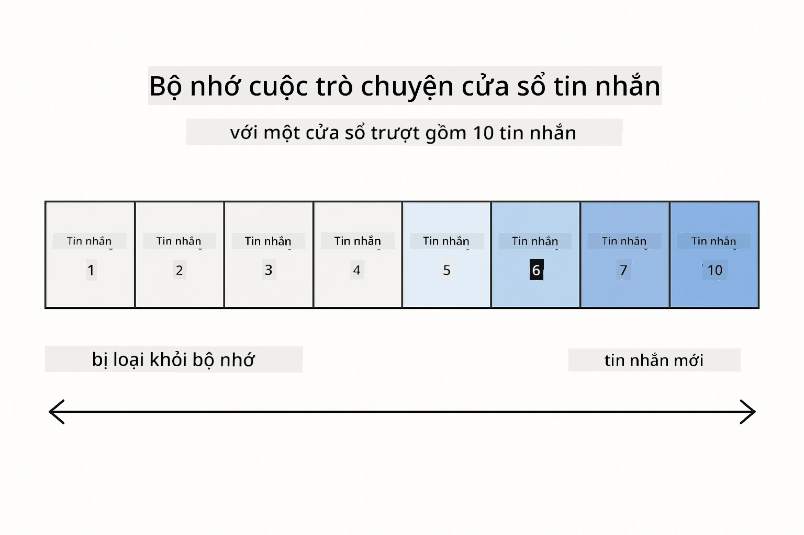
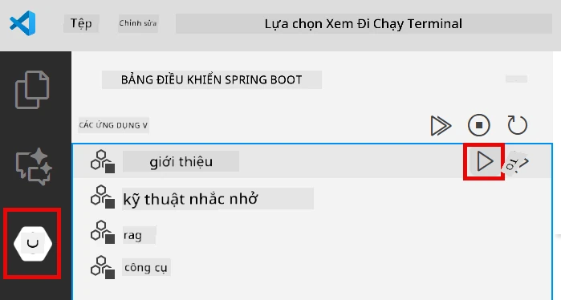
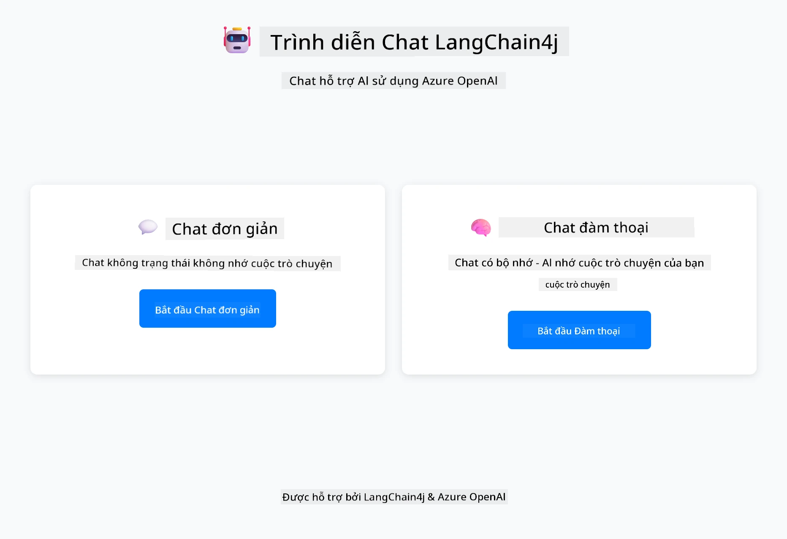
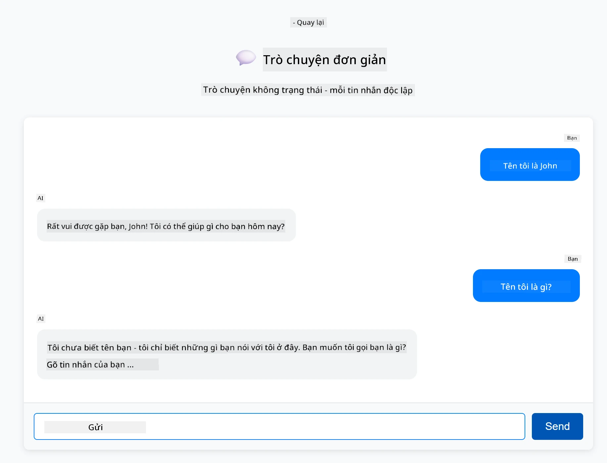
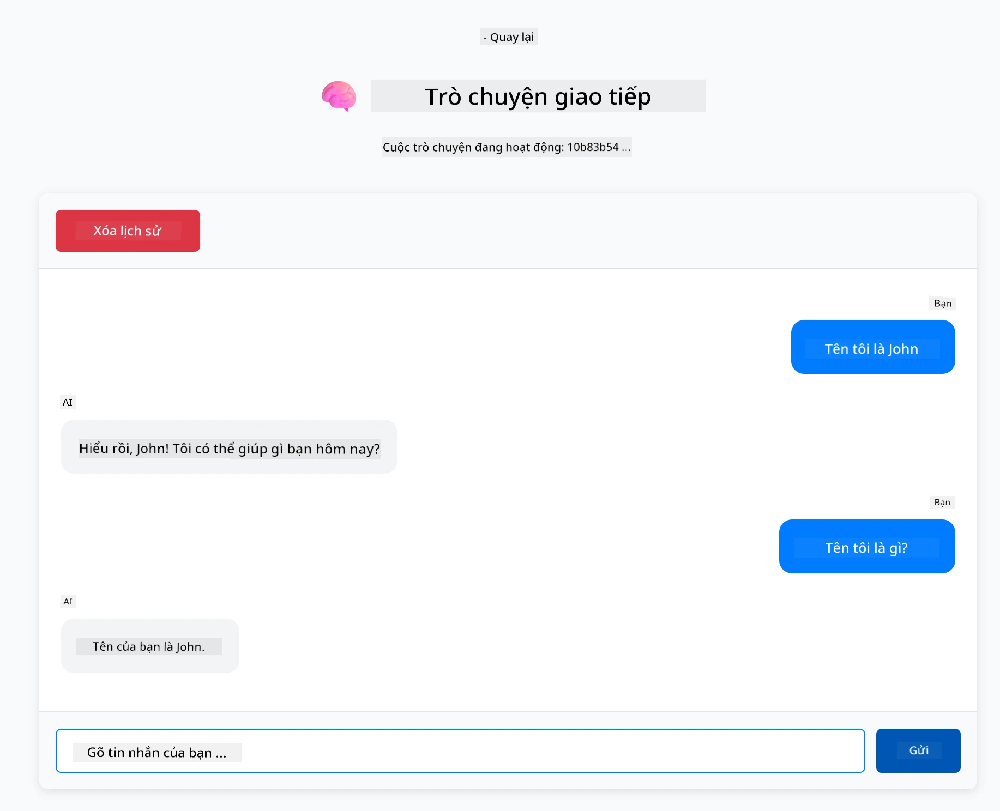

<!--
CO_OP_TRANSLATOR_METADATA:
{
  "original_hash": "c3e07ca58d0b8a3f47d3bf5728541e0a",
  "translation_date": "2025-12-13T13:48:58+00:00",
  "source_file": "01-introduction/README.md",
  "language_code": "vi"
}
-->
# Module 01: Bắt đầu với LangChain4j

## Mục lục

- [Bạn sẽ học được gì](../../../01-introduction)
- [Yêu cầu trước](../../../01-introduction)
- [Hiểu vấn đề cốt lõi](../../../01-introduction)
- [Hiểu về Tokens](../../../01-introduction)
- [Cách bộ nhớ hoạt động](../../../01-introduction)
- [Cách sử dụng LangChain4j](../../../01-introduction)
- [Triển khai hạ tầng Azure OpenAI](../../../01-introduction)
- [Chạy ứng dụng cục bộ](../../../01-introduction)
- [Sử dụng ứng dụng](../../../01-introduction)
  - [Chat không trạng thái (Bảng bên trái)](../../../01-introduction)
  - [Chat có trạng thái (Bảng bên phải)](../../../01-introduction)
- [Bước tiếp theo](../../../01-introduction)

## Bạn sẽ học được gì

Nếu bạn đã hoàn thành phần khởi động nhanh, bạn đã thấy cách gửi prompt và nhận phản hồi. Đó là nền tảng, nhưng các ứng dụng thực tế cần nhiều hơn thế. Module này sẽ dạy bạn cách xây dựng AI hội thoại nhớ ngữ cảnh và duy trì trạng thái - sự khác biệt giữa một bản demo một lần và một ứng dụng sẵn sàng sản xuất.

Chúng ta sẽ sử dụng GPT-5 của Azure OpenAI xuyên suốt hướng dẫn này vì khả năng suy luận nâng cao của nó làm cho hành vi của các mẫu khác nhau trở nên rõ ràng hơn. Khi bạn thêm bộ nhớ, bạn sẽ thấy sự khác biệt rõ ràng. Điều này giúp bạn dễ hiểu những gì mỗi thành phần mang lại cho ứng dụng của bạn.

Bạn sẽ xây dựng một ứng dụng thể hiện cả hai mẫu:

**Chat không trạng thái** - Mỗi yêu cầu là độc lập. Mô hình không nhớ các tin nhắn trước đó. Đây là mẫu bạn đã dùng trong phần khởi động nhanh.

**Hội thoại có trạng thái** - Mỗi yêu cầu bao gồm lịch sử hội thoại. Mô hình duy trì ngữ cảnh qua nhiều lượt. Đây là điều các ứng dụng sản xuất cần.

## Yêu cầu trước

- Tài khoản Azure có quyền truy cập Azure OpenAI
- Java 21, Maven 3.9+
- Azure CLI (https://learn.microsoft.com/en-us/cli/azure/install-azure-cli)
- Azure Developer CLI (azd) (https://learn.microsoft.com/en-us/azure/developer/azure-developer-cli/install-azd)

> **Lưu ý:** Java, Maven, Azure CLI và Azure Developer CLI (azd) đã được cài sẵn trong devcontainer được cung cấp.

> **Lưu ý:** Module này sử dụng GPT-5 trên Azure OpenAI. Việc triển khai được cấu hình tự động qua `azd up` - không chỉnh sửa tên mô hình trong mã nguồn.

## Hiểu vấn đề cốt lõi

Các mô hình ngôn ngữ không có trạng thái. Mỗi lần gọi API là độc lập. Nếu bạn gửi "Tên tôi là John" rồi hỏi "Tên tôi là gì?", mô hình không biết bạn vừa tự giới thiệu. Nó xử lý mỗi yêu cầu như thể đó là cuộc trò chuyện đầu tiên bạn từng có.

Điều này ổn với các câu hỏi đơn giản nhưng vô dụng với ứng dụng thực tế. Bot dịch vụ khách hàng cần nhớ những gì bạn nói. Trợ lý cá nhân cần ngữ cảnh. Bất kỳ cuộc hội thoại nhiều lượt nào cũng cần bộ nhớ.



*Sự khác biệt giữa hội thoại không trạng thái (gọi độc lập) và có trạng thái (nhận biết ngữ cảnh)*

## Hiểu về Tokens

Trước khi đi sâu vào hội thoại, quan trọng là hiểu tokens - đơn vị cơ bản của văn bản mà mô hình ngôn ngữ xử lý:


*Ví dụ về cách văn bản được chia thành tokens - "I love AI!" thành 4 đơn vị xử lý riêng biệt*

Tokens là cách các mô hình AI đo lường và xử lý văn bản. Từ, dấu câu, thậm chí khoảng trắng đều có thể là tokens. Mô hình của bạn có giới hạn số tokens có thể xử lý cùng lúc (400,000 cho GPT-5, với tối đa 272,000 tokens đầu vào và 128,000 tokens đầu ra). Hiểu tokens giúp bạn quản lý độ dài hội thoại và chi phí.

## Cách bộ nhớ hoạt động

Bộ nhớ chat giải quyết vấn đề không trạng thái bằng cách duy trì lịch sử hội thoại. Trước khi gửi yêu cầu đến mô hình, framework sẽ thêm các tin nhắn trước đó có liên quan vào đầu. Khi bạn hỏi "Tên tôi là gì?", hệ thống thực sự gửi toàn bộ lịch sử hội thoại, cho phép mô hình thấy bạn đã nói "Tên tôi là John" trước đó.

LangChain4j cung cấp các triển khai bộ nhớ xử lý việc này tự động. Bạn chọn số lượng tin nhắn giữ lại và framework quản lý cửa sổ ngữ cảnh.



*MessageWindowChatMemory duy trì cửa sổ trượt các tin nhắn gần đây, tự động loại bỏ tin nhắn cũ*

## Cách sử dụng LangChain4j

Module này mở rộng phần khởi động nhanh bằng cách tích hợp Spring Boot và thêm bộ nhớ hội thoại. Đây là cách các phần kết hợp:

**Phụ thuộc** - Thêm hai thư viện LangChain4j:

```xml
<dependency>
    <groupId>dev.langchain4j</groupId>
    <artifactId>langchain4j</artifactId> <!-- Inherited from BOM in root pom.xml -->
</dependency>
<dependency>
    <groupId>dev.langchain4j</groupId>
    <artifactId>langchain4j-open-ai-official</artifactId> <!-- Inherited from BOM in root pom.xml -->
</dependency>
```

**Mô hình Chat** - Cấu hình Azure OpenAI như một bean Spring ([LangChainConfig.java](../../../01-introduction/src/main/java/com/example/langchain4j/config/LangChainConfig.java)):

```java
@Bean
public OpenAiOfficialChatModel openAiOfficialChatModel() {
    return OpenAiOfficialChatModel.builder()
            .baseUrl(azureEndpoint)
            .apiKey(azureApiKey)
            .modelName(deploymentName)
            .timeout(Duration.ofMinutes(5))
            .maxRetries(3)
            .build();
}
```

Builder đọc thông tin xác thực từ biến môi trường do `azd up` thiết lập. Việc đặt `baseUrl` thành endpoint Azure của bạn giúp client OpenAI hoạt động với Azure OpenAI.

**Bộ nhớ hội thoại** - Theo dõi lịch sử chat với MessageWindowChatMemory ([ConversationService.java](../../../01-introduction/src/main/java/com/example/langchain4j/service/ConversationService.java)):

```java
ChatMemory memory = MessageWindowChatMemory.withMaxMessages(10);

memory.add(UserMessage.from("My name is John"));
memory.add(AiMessage.from("Nice to meet you, John!"));

memory.add(UserMessage.from("What's my name?"));
AiMessage aiMessage = chatModel.chat(memory.messages()).aiMessage();
memory.add(aiMessage);
```

Tạo bộ nhớ với `withMaxMessages(10)` để giữ 10 tin nhắn cuối cùng. Thêm tin nhắn người dùng và AI với các wrapper kiểu: `UserMessage.from(text)` và `AiMessage.from(text)`. Lấy lịch sử với `memory.messages()` và gửi đến mô hình. Dịch vụ lưu các thể hiện bộ nhớ riêng theo ID hội thoại, cho phép nhiều người dùng chat đồng thời.

> **🤖 Thử với [GitHub Copilot](https://github.com/features/copilot) Chat:** Mở [`ConversationService.java`](../../../01-introduction/src/main/java/com/example/langchain4j/service/ConversationService.java) và hỏi:
> - "MessageWindowChatMemory quyết định loại bỏ tin nhắn nào khi cửa sổ đầy như thế nào?"
> - "Tôi có thể triển khai lưu trữ bộ nhớ tùy chỉnh bằng cơ sở dữ liệu thay vì trong bộ nhớ không?"
> - "Làm sao để thêm tóm tắt để nén lịch sử hội thoại cũ?"

Điểm cuối chat không trạng thái bỏ qua bộ nhớ hoàn toàn - chỉ `chatModel.chat(prompt)` như phần khởi động nhanh. Điểm cuối có trạng thái thêm tin nhắn vào bộ nhớ, lấy lịch sử và bao gồm ngữ cảnh đó với mỗi yêu cầu. Cấu hình mô hình giống nhau, mẫu khác nhau.

## Triển khai hạ tầng Azure OpenAI

**Bash:**
```bash
cd 01-introduction
azd up  # Chọn đăng ký và vị trí (khuyến nghị eastus2)
```

**PowerShell:**
```powershell
cd 01-introduction
azd up  # Chọn đăng ký và vị trí (khuyến nghị eastus2)
```

> **Lưu ý:** Nếu gặp lỗi timeout (`RequestConflict: Cannot modify resource ... provisioning state is not terminal`), chỉ cần chạy lại `azd up`. Tài nguyên Azure có thể vẫn đang được cấp phát ở nền, và thử lại cho phép triển khai hoàn tất khi tài nguyên đạt trạng thái cuối.

Điều này sẽ:
1. Triển khai tài nguyên Azure OpenAI với các mô hình GPT-5 và text-embedding-3-small
2. Tự động tạo file `.env` trong thư mục gốc dự án với thông tin xác thực
3. Thiết lập tất cả biến môi trường cần thiết

**Gặp sự cố triển khai?** Xem [README hạ tầng](infra/README.md) để biết hướng dẫn xử lý chi tiết bao gồm xung đột tên miền phụ, các bước triển khai thủ công trên Azure Portal và hướng dẫn cấu hình mô hình.

**Xác nhận triển khai thành công:**

**Bash:**
```bash
cat ../.env  # Nên hiển thị AZURE_OPENAI_ENDPOINT, API_KEY, v.v.
```

**PowerShell:**
```powershell
Get-Content ..\.env  # Nên hiển thị AZURE_OPENAI_ENDPOINT, API_KEY, v.v.
```

> **Lưu ý:** Lệnh `azd up` tự động tạo file `.env`. Nếu cần cập nhật sau, bạn có thể chỉnh sửa thủ công hoặc tạo lại bằng cách chạy:
>
> **Bash:**
> ```bash
> cd ..
> bash .azd-env.sh
> ```
>
> **PowerShell:**
> ```powershell
> cd ..
> .\.azd-env.ps1
> ```

## Chạy ứng dụng cục bộ

**Xác nhận triển khai:**

Đảm bảo file `.env` tồn tại trong thư mục gốc với thông tin xác thực Azure:

**Bash:**
```bash
cat ../.env  # Nên hiển thị AZURE_OPENAI_ENDPOINT, API_KEY, DEPLOYMENT
```

**PowerShell:**
```powershell
Get-Content ..\.env  # Nên hiển thị AZURE_OPENAI_ENDPOINT, API_KEY, DEPLOYMENT
```

**Khởi động ứng dụng:**

**Lựa chọn 1: Dùng Spring Boot Dashboard (Khuyến nghị cho người dùng VS Code)**

Dev container bao gồm tiện ích mở rộng Spring Boot Dashboard, cung cấp giao diện trực quan để quản lý tất cả ứng dụng Spring Boot. Bạn có thể tìm thấy nó trên thanh Activity bên trái VS Code (tìm biểu tượng Spring Boot).

Từ Spring Boot Dashboard, bạn có thể:
- Xem tất cả ứng dụng Spring Boot có trong workspace
- Khởi động/dừng ứng dụng chỉ với một cú nhấp
- Xem nhật ký ứng dụng theo thời gian thực
- Giám sát trạng thái ứng dụng

Chỉ cần nhấn nút play bên cạnh "introduction" để bắt đầu module này, hoặc khởi động tất cả các module cùng lúc.



**Lựa chọn 2: Dùng script shell**

Khởi động tất cả ứng dụng web (module 01-04):

**Bash:**
```bash
cd ..  # Từ thư mục gốc
./start-all.sh
```

**PowerShell:**
```powershell
cd ..  # Từ thư mục gốc
.\start-all.ps1
```

Hoặc chỉ khởi động module này:

**Bash:**
```bash
cd 01-introduction
./start.sh
```

**PowerShell:**
```powershell
cd 01-introduction
.\start.ps1
```

Cả hai script tự động tải biến môi trường từ file `.env` gốc và sẽ build JAR nếu chưa tồn tại.

> **Lưu ý:** Nếu bạn muốn build thủ công tất cả module trước khi khởi động:
>
> **Bash:**
> ```bash
> cd ..  # Go to root directory
> mvn clean package -DskipTests
> ```
>
> **PowerShell:**
> ```powershell
> cd ..  # Go to root directory
> mvn clean package -DskipTests
> ```

Mở http://localhost:8080 trên trình duyệt của bạn.

**Để dừng:**

**Bash:**
```bash
./stop.sh  # Chỉ mô-đun này
# Hoặc
cd .. && ./stop-all.sh  # Tất cả các mô-đun
```

**PowerShell:**
```powershell
.\stop.ps1  # Chỉ mô-đun này
# Hoặc
cd ..; .\stop-all.ps1  # Tất cả các mô-đun
```

## Sử dụng ứng dụng

Ứng dụng cung cấp giao diện web với hai triển khai chat đặt cạnh nhau.



*Bảng điều khiển hiển thị cả hai tùy chọn Simple Chat (không trạng thái) và Conversational Chat (có trạng thái)*

### Chat không trạng thái (Bảng bên trái)

Hãy thử trước. Hỏi "Tên tôi là John" rồi ngay lập tức hỏi "Tên tôi là gì?" Mô hình sẽ không nhớ vì mỗi tin nhắn là độc lập. Điều này minh họa vấn đề cốt lõi khi tích hợp mô hình ngôn ngữ cơ bản - không có ngữ cảnh hội thoại.



*AI không nhớ tên bạn từ tin nhắn trước*

### Chat có trạng thái (Bảng bên phải)

Bây giờ thử cùng chuỗi câu hỏi ở đây. Hỏi "Tên tôi là John" rồi "Tên tôi là gì?" Lần này nó nhớ. Sự khác biệt là MessageWindowChatMemory - nó duy trì lịch sử hội thoại và bao gồm nó với mỗi yêu cầu. Đây là cách AI hội thoại sản xuất hoạt động.



*AI nhớ tên bạn từ trước trong cuộc hội thoại*

Cả hai bảng đều dùng cùng mô hình GPT-5. Sự khác biệt duy nhất là bộ nhớ. Điều này làm rõ bộ nhớ mang lại gì cho ứng dụng của bạn và tại sao nó cần thiết cho các trường hợp sử dụng thực tế.

## Bước tiếp theo

**Module tiếp theo:** [02-prompt-engineering - Kỹ thuật tạo prompt với GPT-5](../02-prompt-engineering/README.md)

---

**Điều hướng:** [← Trước: Module 00 - Khởi động nhanh](../00-quick-start/README.md) | [Quay lại chính](../README.md) | [Tiếp: Module 02 - Kỹ thuật tạo prompt →](../02-prompt-engineering/README.md)

---

<!-- CO-OP TRANSLATOR DISCLAIMER START -->
**Tuyên bố từ chối trách nhiệm**:  
Tài liệu này đã được dịch bằng dịch vụ dịch thuật AI [Co-op Translator](https://github.com/Azure/co-op-translator). Mặc dù chúng tôi cố gắng đảm bảo độ chính xác, xin lưu ý rằng bản dịch tự động có thể chứa lỗi hoặc không chính xác. Tài liệu gốc bằng ngôn ngữ gốc của nó nên được coi là nguồn chính xác và đáng tin cậy. Đối với thông tin quan trọng, nên sử dụng dịch vụ dịch thuật chuyên nghiệp do con người thực hiện. Chúng tôi không chịu trách nhiệm về bất kỳ sự hiểu lầm hoặc giải thích sai nào phát sinh từ việc sử dụng bản dịch này.
<!-- CO-OP TRANSLATOR DISCLAIMER END -->