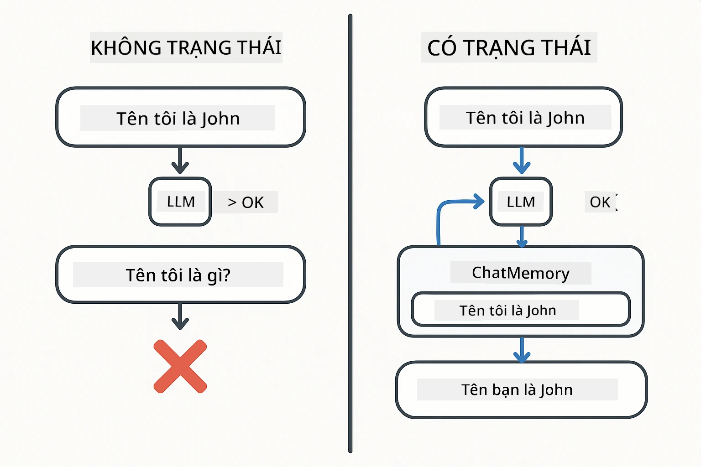
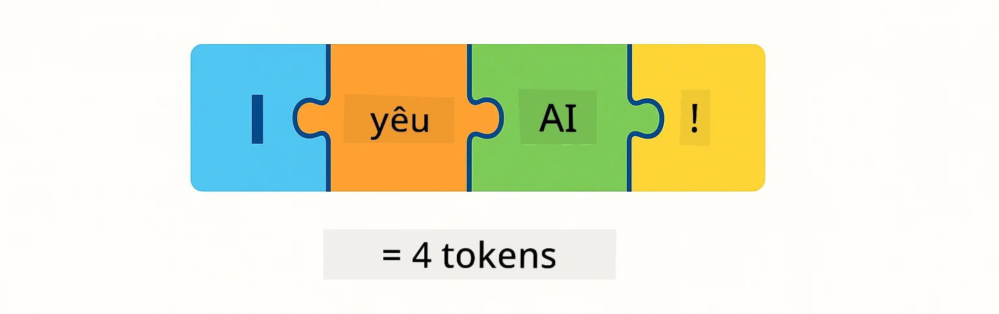
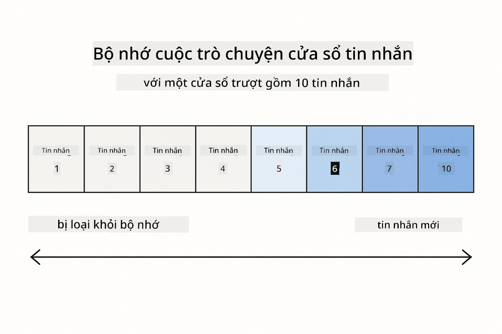
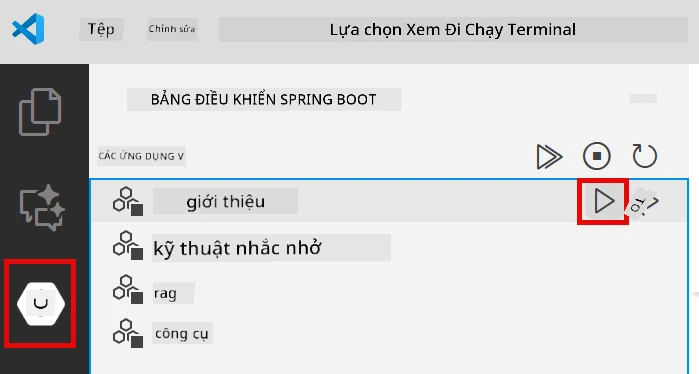
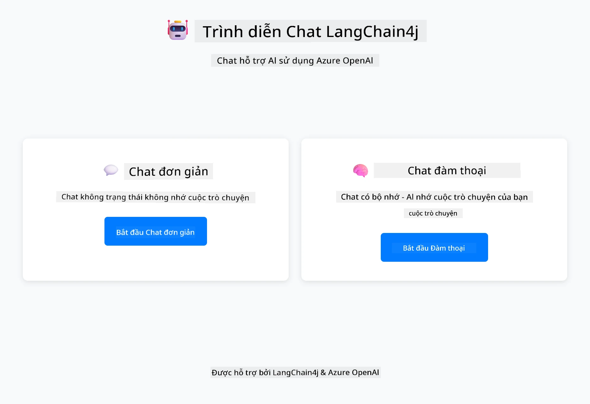
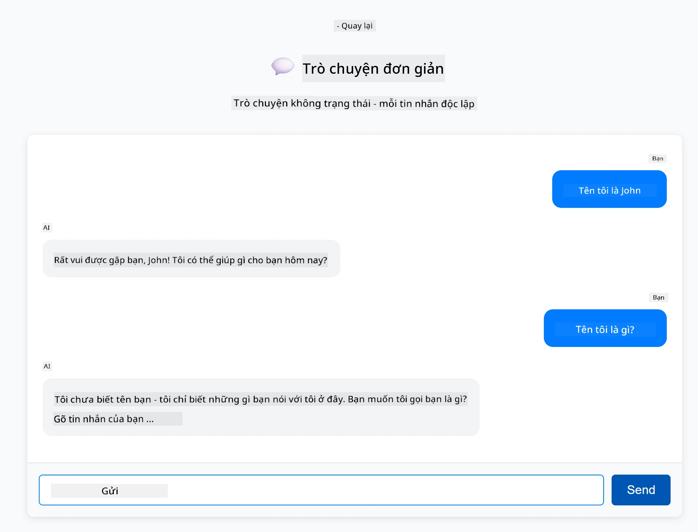
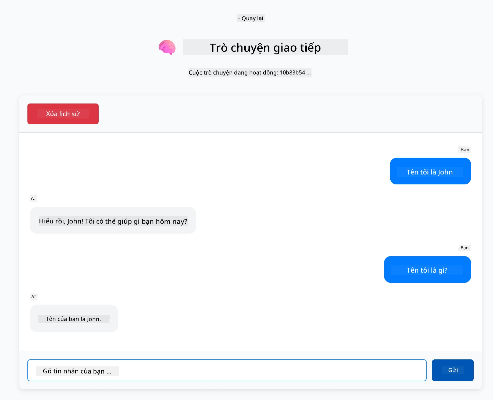

# Module 01: Bắt Đầu với LangChain4j

## Mục Lục

- [Video Hướng Dẫn](#video-hướng-dẫn)
- [Bạn Sẽ Học Được Gì](#bạn-sẽ-học-được-gì)
- [Yêu Cầu Trước](#yêu-cầu-trước)
- [Hiểu Vấn Đề Cốt Lõi](#hiểu-vấn-đề-cốt-lõi)
- [Hiểu Về Token](#hiểu-về-token)
- [Cách Bộ Nhớ Hoạt Động](#cách-bộ-nhớ-hoạt-động)
- [Cách Module Này Sử Dụng LangChain4j](#cách-module-này-sử-dụng-langchain4j)
- [Triển Khai Hạ Tầng Azure OpenAI](#triển-khai-hạ-tầng-azure-openai)
- [Chạy Ứng Dụng Tại Máy](#chạy-ứng-dụng-tại-máy)
- [Sử Dụng Ứng Dụng](#sử-dụng-ứng-dụng)
  - [Trò Chuyện Không Trạng Thái (Bảng trái)](#trò-chuyện-không-trạng-thái-bảng-trái)
  - [Trò Chuyện Có Trạng Thái (Bảng phải)](#trò-chuyện-có-trạng-thái-bảng-phải)
- [Bước Tiếp Theo](#bước-tiếp-theo)

## Video Hướng Dẫn

Xem buổi trực tiếp này giải thích cách bắt đầu với module này:

<a href="https://www.youtube.com/live/nl_troDm8rQ?si=6b85S8xGjWnT2fX9"></a>

## Bạn Sẽ Học Được Gì

Đây là điểm khởi đầu với LangChain4j và Azure OpenAI. Chúng ta bắt đầu với các kiến thức cơ bản và xây dựng các ứng dụng theo kiểu sản xuất. Module này tập trung vào AI hội thoại có khả năng ghi nhớ ngữ cảnh và duy trì trạng thái — những khái niệm nền tảng mà các module tiếp theo đều dựa vào.

Chúng ta sẽ sử dụng GPT-5.2 của Azure OpenAI trong suốt hướng dẫn này vì khả năng lý luận nâng cao của nó làm cho hành vi của các mẫu mô hình dễ nhận biết hơn. Khi bạn thêm bộ nhớ, bạn sẽ thấy sự khác biệt rõ ràng. Điều này giúp bạn dễ hiểu hơn từng thành phần đóng góp gì cho ứng dụng của bạn.

Bạn sẽ xây dựng một ứng dụng thể hiện cả hai mẫu:

**Trò chuyện không trạng thái** - Mỗi yêu cầu độc lập. Mô hình không ghi nhớ các tin nhắn trước đó. Đây là điểm khởi đầu đơn giản nhất.

**Trò chuyện có trạng thái** - Mỗi yêu cầu bao gồm lịch sử hội thoại. Mô hình duy trì ngữ cảnh qua nhiều lượt. Đây là yêu cầu của các ứng dụng sản xuất.

## Yêu Cầu Trước

- Tài khoản Azure có quyền truy cập Azure OpenAI
- Java 21, Maven 3.9+ 
- Azure CLI (https://learn.microsoft.com/en-us/cli/azure/install-azure-cli)
- Azure Developer CLI (azd) (https://learn.microsoft.com/en-us/azure/developer/azure-developer-cli/install-azd)

> **Lưu ý:** Java, Maven, Azure CLI và Azure Developer CLI (azd) đã được cài đặt sẵn trong devcontainer được cung cấp.

> **Lưu ý:** Module này sử dụng GPT-5.2 trên Azure OpenAI. Việc triển khai được cấu hình tự động qua lệnh `azd up` - không chỉnh sửa tên mô hình trong mã.

## Hiểu Vấn Đề Cốt Lõi

Mô hình ngôn ngữ là không trạng thái. Mỗi lần gọi API là độc lập. Nếu bạn gửi "My name is John" rồi sau đó hỏi "What’s my name?", mô hình không biết bạn vừa tự giới thiệu tên mình. Nó đối xử với mỗi yêu cầu như thể đây là lần đầu tiên bạn hội thoại.

Điều này ổn với các câu hỏi đơn giản nhưng vô dụng cho ứng dụng thực tế. Bot dịch vụ khách hàng cần nhớ bạn đã nói gì. Trợ lý cá nhân cần ngữ cảnh. Bất kỳ hội thoại đa lượt nào đều cần bộ nhớ.

Hình dưới minh họa sự khác biệt giữa hai cách tiếp cận — bên trái là cuộc gọi không trạng thái quên tên bạn; bên phải là cuộc gọi có trạng thái với ChatMemory ghi nhớ tên.



*Phân biệt hội thoại không trạng thái (gọi độc lập) và có trạng thái (nhận biết ngữ cảnh)*

## Hiểu Về Token

Trước khi bước vào hội thoại, quan trọng phải hiểu token — đơn vị cơ bản của văn bản mà mô hình xử lý:



*Ví dụ cách văn bản được tách thành các token - "I love AI!" thành 4 đơn vị xử lý riêng biệt*

Token là cách mô hình AI đo và xử lý văn bản. Từ, dấu câu, thậm chí khoảng trắng đều có thể là token. Mô hình của bạn có giới hạn số token có thể xử lý cùng lúc (400,000 cho GPT-5.2, bao gồm tối đa 272,000 token đầu vào và 128,000 token đầu ra). Hiểu được token giúp bạn quản lý độ dài hội thoại và chi phí.

## Cách Bộ Nhớ Hoạt Động

Bộ nhớ chat giải quyết vấn đề không trạng thái bằng cách duy trì lịch sử hội thoại. Trước khi gửi yêu cầu tới mô hình, framework sẽ thêm các tin nhắn trước có liên quan. Khi bạn hỏi "What’s my name?", hệ thống thực sự gửi toàn bộ lịch sử hội thoại, cho phép mô hình thấy rằng bạn đã nói "My name is John" trước đó.

LangChain4j cung cấp các triển khai bộ nhớ xử lý việc này tự động. Bạn chọn số tin nhắn giữ lại và framework quản lý cửa sổ ngữ cảnh. Hình dưới minh họa MessageWindowChatMemory duy trì cửa sổ trượt các tin nhắn gần nhất.



*MessageWindowChatMemory duy trì cửa sổ trượt các tin nhắn gần đây, tự động xóa các tin nhắn cũ*

## Cách Module Này Sử Dụng LangChain4j

Module này tích hợp Spring Boot và thêm bộ nhớ cuộc hội thoại. Cách các phần ghép lại như sau:

**Phụ thuộc** - Thêm hai thư viện LangChain4j:

```xml
<dependency>
    <groupId>dev.langchain4j</groupId>
    <artifactId>langchain4j</artifactId> <!-- Inherited from BOM in root pom.xml -->
</dependency>
<dependency>
    <groupId>dev.langchain4j</groupId>
    <artifactId>langchain4j-open-ai-official</artifactId> <!-- Inherited from BOM in root pom.xml -->
</dependency>
```

**Mô hình Chat** - Cấu hình Azure OpenAI như bean Spring ([LangChainConfig.java](../../../01-introduction/src/main/java/com/example/langchain4j/config/LangChainConfig.java)):

```java
@Bean
public OpenAiOfficialChatModel openAiOfficialChatModel() {
    return OpenAiOfficialChatModel.builder()
            .baseUrl(azureEndpoint)
            .apiKey(azureApiKey)
            .modelName(deploymentName)
            .timeout(Duration.ofMinutes(5))
            .maxRetries(3)
            .build();
}
```

Builder lấy thông tin xác thực từ biến môi trường do `azd up` thiết lập. Việc đặt `baseUrl` thành endpoint Azure của bạn giúp client OpenAI hoạt động với Azure OpenAI.

**Bộ nhớ hội thoại** - Theo dõi lịch sử chat với MessageWindowChatMemory ([ConversationService.java](../../../01-introduction/src/main/java/com/example/langchain4j/service/ConversationService.java)):

```java
ChatMemory memory = MessageWindowChatMemory.withMaxMessages(10);

memory.add(UserMessage.from("My name is John"));
memory.add(AiMessage.from("Nice to meet you, John!"));

memory.add(UserMessage.from("What's my name?"));
AiMessage aiMessage = chatModel.chat(memory.messages()).aiMessage();
memory.add(aiMessage);
```

Tạo bộ nhớ với `withMaxMessages(10)` để giữ 10 tin nhắn gần nhất. Thêm tin nhắn người dùng và AI với wrapper kiểu: `UserMessage.from(text)` và `AiMessage.from(text)`. Lấy lịch sử với `memory.messages()` và gửi cho mô hình. Service lưu các instance bộ nhớ riêng theo ID cuộc hội thoại, cho phép nhiều người dùng chat đồng thời.

> **🤖 Thử với [GitHub Copilot](https://github.com/features/copilot) Chat:** Mở [`ConversationService.java`](../../../01-introduction/src/main/java/com/example/langchain4j/service/ConversationService.java) và hỏi:
> - "MessageWindowChatMemory quyết định xóa tin nhắn nào khi cửa sổ đầy như thế nào?"
> - "Tôi có thể triển khai bộ nhớ tùy chỉnh sử dụng cơ sở dữ liệu thay vì bộ nhớ trong không?"
> - "Làm sao để thêm tính năng tóm tắt để nén lịch sử hội thoại cũ?"

Điểm cuối chat không trạng thái không dùng bộ nhớ - chỉ `chatModel.chat(prompt)` như khởi đầu nhanh. Điểm cuối có trạng thái thêm tin nhắn vào bộ nhớ, lấy lịch sử và bao gồm ngữ cảnh này với mỗi yêu cầu. Cấu hình mô hình giống nhau, chỉ khác mô hình thao tác.

## Triển Khai Hạ Tầng Azure OpenAI

**Bash:**
```bash
cd 01-introduction
azd up  # Chọn gói đăng ký và vị trí (đề xuất eastus2)
```

**PowerShell:**
```powershell
cd 01-introduction
azd up  # Chọn đăng ký và vị trí (khuyên dùng eastus2)
```

> **Lưu ý:** Nếu gặp lỗi timeout (`RequestConflict: Cannot modify resource ... provisioning state is not terminal`), hãy chạy lại `azd up`. Tài nguyên Azure có thể vẫn đang triển khai ngầm và thử lại giúp hoàn thành khi tài nguyên đã ở trạng thái cuối cùng.

Việc này sẽ:
1. Triển khai tài nguyên Azure OpenAI với các mô hình GPT-5.2 và text-embedding-3-small
2. Tự động tạo file `.env` tại thư mục gốc dự án chứa thông tin xác thực
3. Thiết lập tất cả biến môi trường cần thiết

**Gặp vấn đề khi triển khai?** Xem [Infrastructure README](infra/README.md) để có hướng dẫn chi tiết xử lý lỗi bao gồm xung đột tên miền phụ, các bước triển khai thủ công trên Azure Portal và hướng dẫn cấu hình mô hình.

**Xác nhận triển khai thành công:**

**Bash:**
```bash
cat ../.env  # Nên hiển thị AZURE_OPENAI_ENDPOINT, API_KEY, v.v.
```

**PowerShell:**
```powershell
Get-Content ..\.env  # Nên hiển thị AZURE_OPENAI_ENDPOINT, API_KEY, v.v.
```

> **Lưu ý:** Lệnh `azd up` tự động tạo file `.env`. Nếu cần cập nhật sau, bạn có thể chỉnh sửa thủ công hoặc tạo lại bằng lệnh:
>
> **Bash:**
> ```bash
> cd ..
> bash .azd-env.sh
> ```

>
> **PowerShell:**
> ```powershell
> cd ..
> .\.azd-env.ps1
> ```

## Chạy Ứng Dụng Tại Máy

**Xác nhận triển khai:**

Đảm bảo file `.env` tồn tại trong thư mục gốc chứa thông tin xác thực Azure. Chạy lệnh từ thư mục module (`01-introduction/`):

**Bash:**
```bash
cat ../.env  # Nên hiển thị AZURE_OPENAI_ENDPOINT, API_KEY, DEPLOYMENT
```

**PowerShell:**
```powershell
Get-Content ..\.env  # Nên hiển thị AZURE_OPENAI_ENDPOINT, API_KEY, DEPLOYMENT
```

**Khởi động ứng dụng:**

**Lựa chọn 1: Sử dụng Spring Boot Dashboard (Khuyến nghị cho người dùng VS Code)**

Dev container bao gồm extension Spring Boot Dashboard, cung cấp giao diện trực quan quản lý tất cả ứng dụng Spring Boot. Bạn có thể tìm thấy nó trên thanh Activity bên trái của VS Code (icon Spring Boot).

Từ Spring Boot Dashboard, bạn có thể:
- Xem tất cả ứng dụng Spring Boot trong workspace
- Khởi động/dừng ứng dụng chỉ với một cú nhấp
- Xem nhật ký ứng dụng theo thời gian thực
- Giám sát trạng thái ứng dụng

Chỉ cần nhấp nút play bên cạnh "introduction" để chạy module này, hoặc khởi động tất cả các module cùng lúc.



*Spring Boot Dashboard trong VS Code — khởi động, dừng và giám sát tất cả module tại một nơi*

**Lựa chọn 2: Sử dụng script shell**

Khởi động tất cả ứng dụng web (module 01-04):

**Bash:**
```bash
cd ..  # Từ thư mục gốc
./start-all.sh
```

**PowerShell:**
```powershell
cd ..  # Từ thư mục gốc
.\start-all.ps1
```

Hoặc chỉ khởi động module này:

**Bash:**
```bash
cd 01-introduction
./start.sh
```

**PowerShell:**
```powershell
cd 01-introduction
.\start.ps1
```

Cả hai script tự động load biến môi trường từ file `.env` gốc và sẽ build các JAR nếu chưa tồn tại.

> **Lưu ý:** Nếu bạn muốn build thủ công các module trước khi khởi động:
>
> **Bash:**
> ```bash
> cd ..  # Go to root directory
> mvn clean package -DskipTests
> ```

>
> **PowerShell:**
> ```powershell
> cd ..  # Go to root directory
> mvn clean package -DskipTests
> ```

Mở http://localhost:8080 trên trình duyệt.

**Để dừng:**

**Bash:**
```bash
./stop.sh  # Chỉ mô-đun này
# Hoặc
cd .. && ./stop-all.sh  # Tất cả các mô-đun
```

**PowerShell:**
```powershell
.\stop.ps1  # Chỉ module này
# Hoặc
cd ..; .\stop-all.ps1  # Tất cả các module
```

## Sử Dụng Ứng Dụng

Ứng dụng cung cấp giao diện web với hai phiên bản chat hiện bên cạnh nhau.



*Dashboard hiển thị cả hai tùy chọn Chat Đơn Giản (không trạng thái) và Chat Hội Thoại (có trạng thái)*

### Trò Chuyện Không Trạng Thái (Bảng trái)

Thử đầu tiên. Hỏi "My name is John" rồi ngay lập tức hỏi "What’s my name?" Mô hình sẽ không nhớ vì mỗi tin nhắn là độc lập. Điều này minh họa vấn đề cốt lõi khi tích hợp mô hình ngôn ngữ cơ bản - không có ngữ cảnh hội thoại.



*AI không nhớ tên bạn trong tin nhắn trước*

### Trò Chuyện Có Trạng Thái (Bảng phải)

Bây giờ thử trình tự tương tự ở đây. Hỏi "My name is John" rồi hỏi "What’s my name?" Lần này nó nhớ. Khác biệt là MessageWindowChatMemory - nó giữ lịch sử hội thoại và gửi kèm trong mỗi yêu cầu. Đây là cách AI hội thoại thực tế hoạt động.



*AI nhớ tên bạn từ lúc trước trong hội thoại*

Hai bảng đều dùng chung mô hình GPT-5.2. Khác biệt duy nhất là bộ nhớ. Điều này làm rõ giá trị của bộ nhớ đối với ứng dụng của bạn và tại sao nó thiết yếu cho các trường hợp sử dụng thực.

## Bước Tiếp Theo

**Module tiếp theo:** [02-prompt-engineering - Kỹ Thuật Prompt với GPT-5.2](../02-prompt-engineering/README.md)

---

**Điều hướng:** [← Quay về Trang Chính](../README.md) | [Tiếp Theo: Module 02 - Kỹ Thuật Prompt →](../02-prompt-engineering/README.md)

---

<!-- CO-OP TRANSLATOR DISCLAIMER START -->
**Tuyên bố miễn trừ trách nhiệm**:
Tài liệu này đã được dịch bằng dịch vụ dịch thuật AI [Co-op Translator](https://github.com/Azure/co-op-translator). Mặc dù chúng tôi cố gắng đảm bảo độ chính xác, xin lưu ý rằng bản dịch tự động có thể chứa lỗi hoặc sai sót. Tài liệu gốc bằng ngôn ngữ gốc nên được coi là nguồn tin chính thức. Đối với thông tin quan trọng, nên sử dụng dịch vụ dịch thuật chuyên nghiệp bởi con người. Chúng tôi không chịu trách nhiệm về bất kỳ hiểu lầm hoặc giải thích sai nào phát sinh từ việc sử dụng bản dịch này.
<!-- CO-OP TRANSLATOR DISCLAIMER END -->