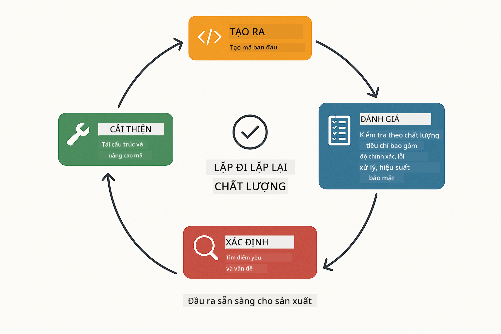
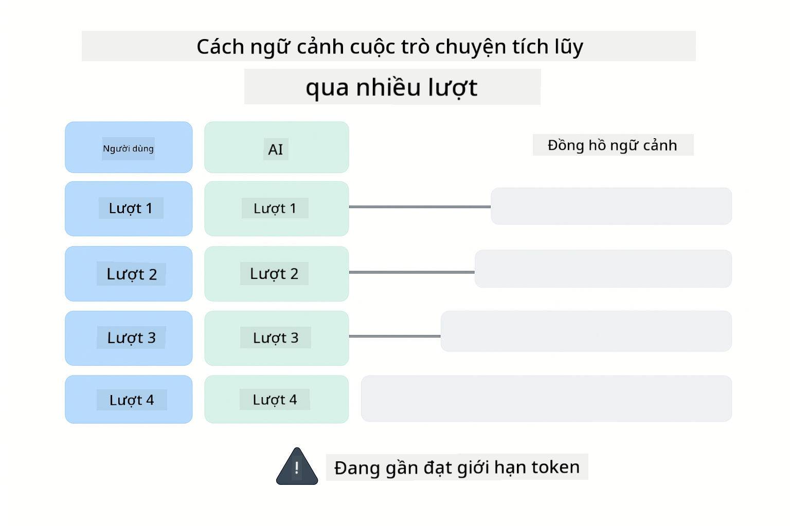
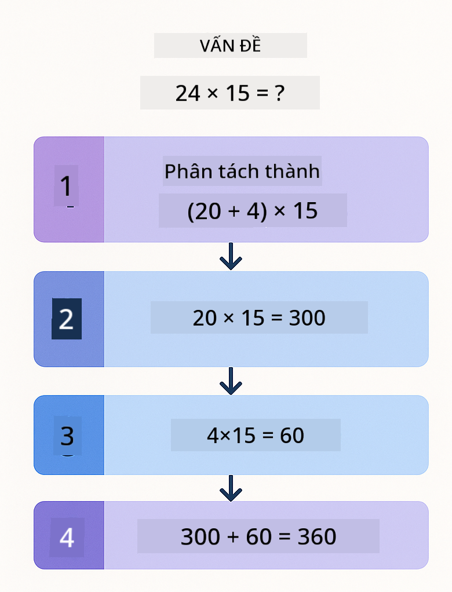
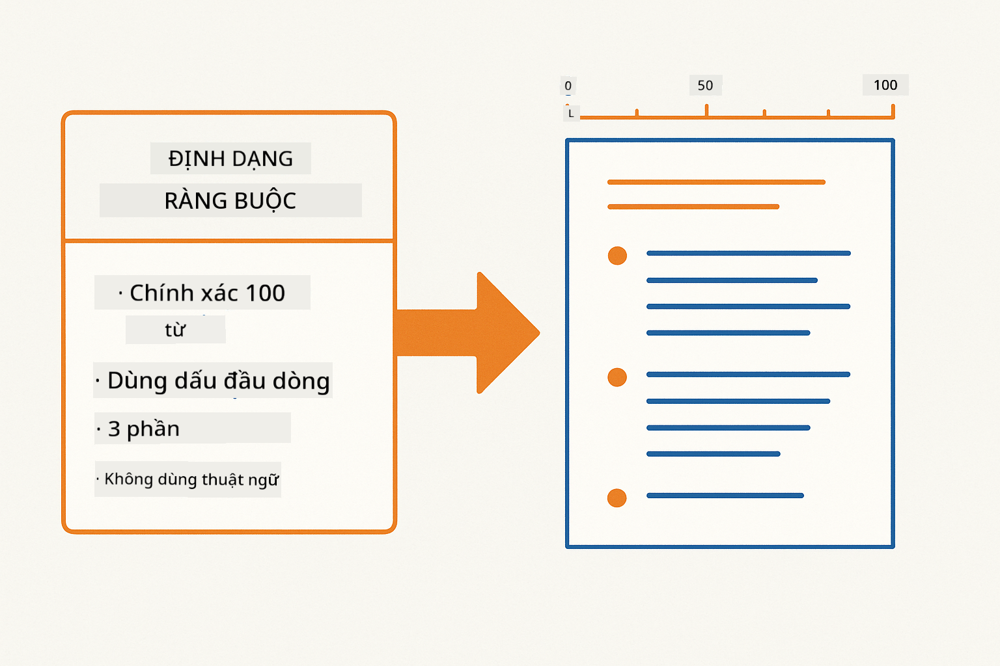
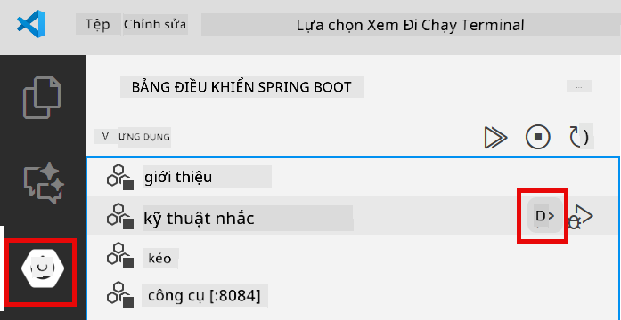
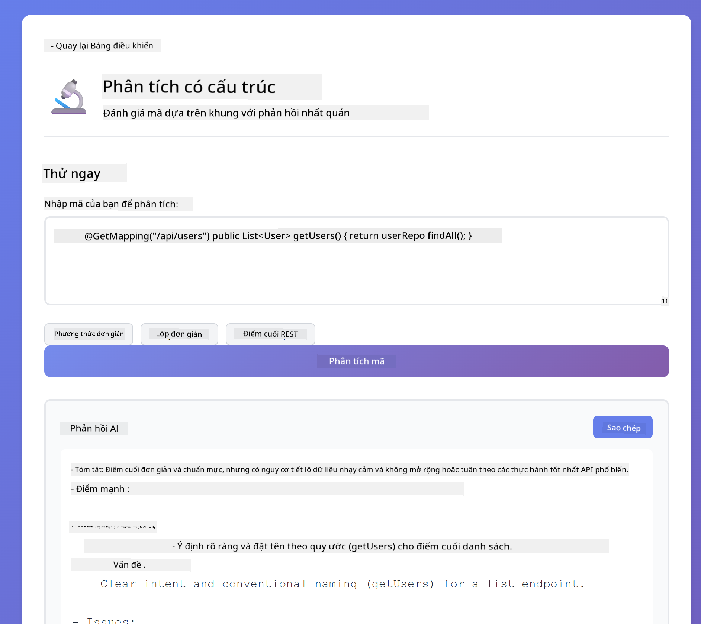
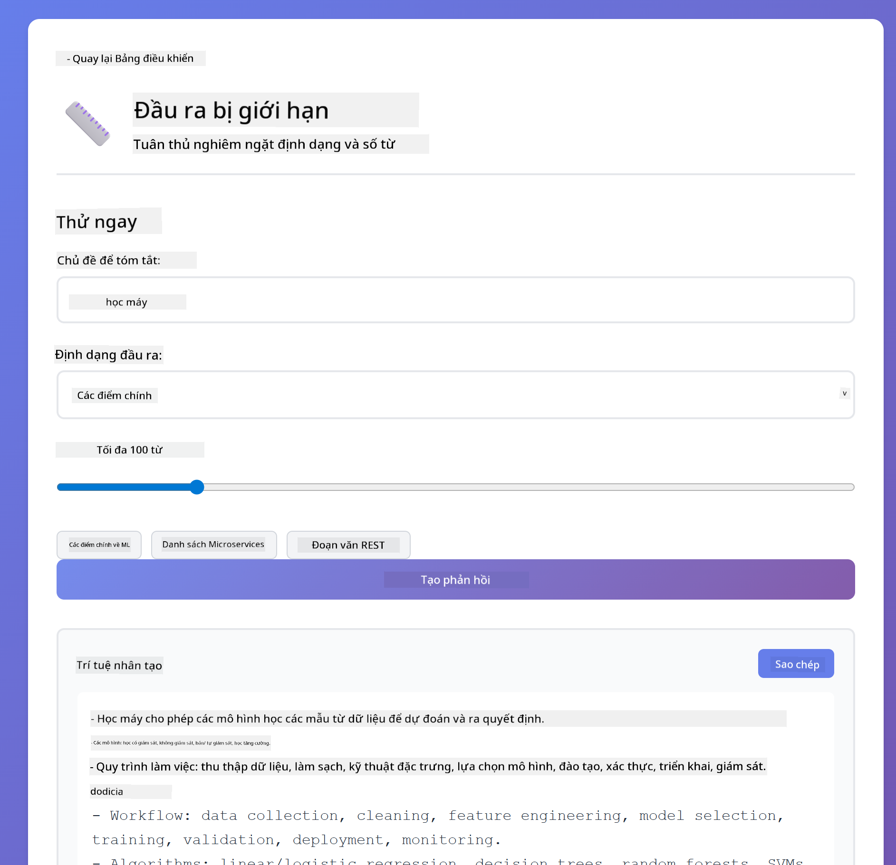
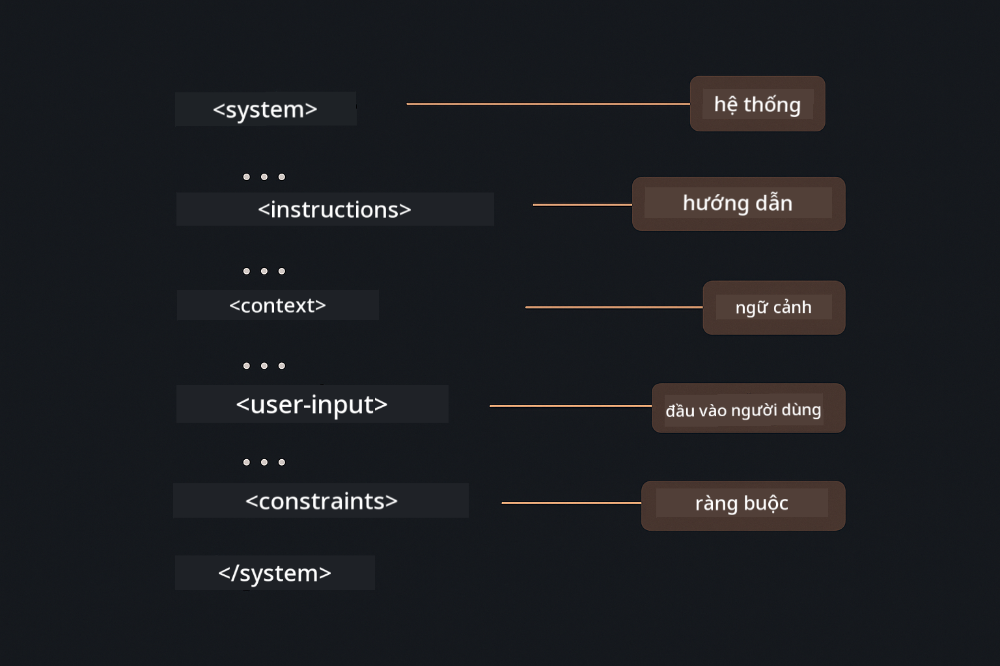

<!--
CO_OP_TRANSLATOR_METADATA:
{
  "original_hash": "8d787826cad7e92bf5cdbd116b1e6116",
  "translation_date": "2025-12-13T16:16:50+00:00",
  "source_file": "02-prompt-engineering/README.md",
  "language_code": "vi"
}
-->
# Module 02: Kỹ Thuật Tạo Prompt với GPT-5

## Mục Lục

- [Bạn Sẽ Học Gì](../../../02-prompt-engineering)
- [Yêu Cầu Tiền Đề](../../../02-prompt-engineering)
- [Hiểu Về Kỹ Thuật Tạo Prompt](../../../02-prompt-engineering)
- [Cách Module Này Sử Dụng LangChain4j](../../../02-prompt-engineering)
- [Các Mẫu Cốt Lõi](../../../02-prompt-engineering)
- [Sử Dụng Tài Nguyên Azure Có Sẵn](../../../02-prompt-engineering)
- [Ảnh Chụp Màn Hình Ứng Dụng](../../../02-prompt-engineering)
- [Khám Phá Các Mẫu](../../../02-prompt-engineering)
  - [Tham Vọng Thấp vs Tham Vọng Cao](../../../02-prompt-engineering)
  - [Thực Thi Nhiệm Vụ (Phần Mở Đầu Công Cụ)](../../../02-prompt-engineering)
  - [Mã Tự Phản Chiếu](../../../02-prompt-engineering)
  - [Phân Tích Có Cấu Trúc](../../../02-prompt-engineering)
  - [Trò Chuyện Nhiều Lượt](../../../02-prompt-engineering)
  - [Lý Luận Từng Bước Một](../../../02-prompt-engineering)
  - [Đầu Ra Có Giới Hạn](../../../02-prompt-engineering)
- [Bạn Thực Sự Đang Học Gì](../../../02-prompt-engineering)
- [Bước Tiếp Theo](../../../02-prompt-engineering)

## Bạn Sẽ Học Gì

Trong module trước, bạn đã thấy cách bộ nhớ giúp AI hội thoại và sử dụng Mô hình GitHub cho các tương tác cơ bản. Bây giờ chúng ta sẽ tập trung vào cách bạn đặt câu hỏi - chính là các prompt - sử dụng GPT-5 của Azure OpenAI. Cách bạn cấu trúc prompt ảnh hưởng rất lớn đến chất lượng câu trả lời bạn nhận được.

Chúng ta sẽ dùng GPT-5 vì nó giới thiệu khả năng kiểm soát lý luận - bạn có thể chỉ định cho mô hình mức độ suy nghĩ trước khi trả lời. Điều này làm cho các chiến lược tạo prompt khác nhau trở nên rõ ràng hơn và giúp bạn hiểu khi nào nên dùng cách nào. Chúng ta cũng sẽ tận dụng giới hạn tốc độ ít hơn của Azure cho GPT-5 so với Mô hình GitHub.

## Yêu Cầu Tiền Đề

- Hoàn thành Module 01 (đã triển khai tài nguyên Azure OpenAI)
- File `.env` trong thư mục gốc chứa thông tin xác thực Azure (được tạo bởi `azd up` trong Module 01)

> **Lưu ý:** Nếu bạn chưa hoàn thành Module 01, hãy làm theo hướng dẫn triển khai ở đó trước.

## Hiểu Về Kỹ Thuật Tạo Prompt

Kỹ thuật tạo prompt là thiết kế văn bản đầu vào sao cho luôn nhận được kết quả bạn cần. Nó không chỉ là đặt câu hỏi - mà là cấu trúc yêu cầu để mô hình hiểu chính xác bạn muốn gì và cách trả lời.

Hãy nghĩ như đang đưa hướng dẫn cho đồng nghiệp. "Sửa lỗi" thì mơ hồ. "Sửa lỗi null pointer exception trong UserService.java dòng 45 bằng cách thêm kiểm tra null" thì cụ thể. Mô hình ngôn ngữ cũng vậy - sự cụ thể và cấu trúc rất quan trọng.

## Cách Module Này Sử Dụng LangChain4j

Module này trình bày các mẫu tạo prompt nâng cao sử dụng nền tảng LangChain4j giống các module trước, tập trung vào cấu trúc prompt và kiểm soát lý luận.


*Cách LangChain4j kết nối prompt của bạn với Azure OpenAI GPT-5*

**Phụ Thuộc** - Module 02 sử dụng các phụ thuộc langchain4j sau được định nghĩa trong `pom.xml`:
```xml
<dependency>
    <groupId>dev.langchain4j</groupId>
    <artifactId>langchain4j</artifactId> <!-- Inherited from BOM in root pom.xml -->
</dependency>
<dependency>
    <groupId>dev.langchain4j</groupId>
    <artifactId>langchain4j-open-ai-official</artifactId> <!-- Inherited from BOM in root pom.xml -->
</dependency>
```

**Cấu Hình OpenAiOfficialChatModel** - [LangChainConfig.java](../../../02-prompt-engineering/src/main/java/com/example/langchain4j/prompts/config/LangChainConfig.java)

Mô hình chat được cấu hình thủ công như một bean Spring sử dụng client chính thức OpenAI, hỗ trợ các endpoint Azure OpenAI. Điểm khác biệt chính so với Module 01 là cách chúng ta cấu trúc prompt gửi đến `chatModel.chat()`, không phải cách thiết lập mô hình.

**Tin Nhắn Hệ Thống và Người Dùng** - [Gpt5PromptService.java](../../../02-prompt-engineering/src/main/java/com/example/langchain4j/prompts/service/Gpt5PromptService.java)

LangChain4j tách biệt các loại tin nhắn để rõ ràng. `SystemMessage` thiết lập hành vi và ngữ cảnh AI (như "Bạn là người đánh giá mã"), trong khi `UserMessage` chứa yêu cầu thực tế. Sự tách biệt này giúp duy trì hành vi AI nhất quán qua các truy vấn người dùng khác nhau.

```java
SystemMessage systemMsg = SystemMessage.from(
    "You are a helpful Java programming expert."
);

UserMessage userMsg = UserMessage.from(
    "Explain what a List is in Java"
);

String response = chatModel.chat(systemMsg, userMsg);
```


*SystemMessage cung cấp ngữ cảnh liên tục trong khi UserMessages chứa các yêu cầu riêng lẻ*

**MessageWindowChatMemory cho Trò Chuyện Nhiều Lượt** - Với mẫu hội thoại nhiều lượt, chúng ta tái sử dụng `MessageWindowChatMemory` từ Module 01. Mỗi phiên có một thể hiện bộ nhớ riêng lưu trong `Map<String, ChatMemory>`, cho phép nhiều cuộc hội thoại đồng thời mà không bị lẫn ngữ cảnh.

**Mẫu Prompt** - Trọng tâm thực sự ở đây là kỹ thuật tạo prompt, không phải API LangChain4j mới. Mỗi mẫu (tham vọng thấp, tham vọng cao, thực thi nhiệm vụ, v.v.) dùng cùng phương thức `chatModel.chat(prompt)` nhưng với chuỗi prompt được cấu trúc cẩn thận. Các thẻ XML, hướng dẫn và định dạng đều là phần của văn bản prompt, không phải tính năng LangChain4j.

**Kiểm Soát Lý Luận** - Nỗ lực lý luận của GPT-5 được kiểm soát qua các hướng dẫn trong prompt như "tối đa 2 bước lý luận" hoặc "khám phá kỹ lưỡng". Đây là kỹ thuật tạo prompt, không phải cấu hình LangChain4j. Thư viện chỉ đơn giản chuyển prompt của bạn đến mô hình.

Điều quan trọng: LangChain4j cung cấp hạ tầng (kết nối mô hình qua [LangChainConfig.java](../../../02-prompt-engineering/src/main/java/com/example/langchain4j/prompts/config/LangChainConfig.java), bộ nhớ, xử lý tin nhắn qua [Gpt5PromptService.java](../../../02-prompt-engineering/src/main/java/com/example/langchain4j/prompts/service/Gpt5PromptService.java)), trong khi module này dạy bạn cách tạo prompt hiệu quả trong hạ tầng đó.

## Các Mẫu Cốt Lõi

Không phải vấn đề nào cũng cần cách tiếp cận giống nhau. Một số câu hỏi cần câu trả lời nhanh, số khác cần suy nghĩ sâu. Có câu cần lý luận rõ ràng, có câu chỉ cần kết quả. Module này bao gồm tám mẫu tạo prompt - mỗi mẫu tối ưu cho các tình huống khác nhau. Bạn sẽ thử nghiệm tất cả để biết khi nào mỗi cách hiệu quả nhất.


*Tổng quan tám mẫu kỹ thuật tạo prompt và các trường hợp sử dụng*


*So sánh cách lý luận tham vọng thấp (nhanh, trực tiếp) và tham vọng cao (kỹ lưỡng, khám phá)*

**Tham Vọng Thấp (Nhanh & Tập Trung)** - Dành cho câu hỏi đơn giản bạn muốn câu trả lời nhanh, trực tiếp. Mô hình thực hiện lý luận tối thiểu - tối đa 2 bước. Dùng cho tính toán, tra cứu hoặc câu hỏi đơn giản.

```java
String prompt = """
    <reasoning_effort>low</reasoning_effort>
    <instruction>maximum 2 reasoning steps</instruction>
    
    What is 15% of 200?
    """;

String response = chatModel.chat(prompt);
```

> 💡 **Khám phá với GitHub Copilot:** Mở [`Gpt5PromptService.java`](../../../02-prompt-engineering/src/main/java/com/example/langchain4j/prompts/service/Gpt5PromptService.java) và hỏi:
> - "Sự khác biệt giữa mẫu tham vọng thấp và tham vọng cao là gì?"
> - "Các thẻ XML trong prompt giúp cấu trúc câu trả lời AI như thế nào?"
> - "Khi nào nên dùng mẫu tự phản chiếu so với hướng dẫn trực tiếp?"

**Tham Vọng Cao (Sâu & Kỹ Lưỡng)** - Dành cho vấn đề phức tạp bạn muốn phân tích toàn diện. Mô hình khám phá kỹ lưỡng và trình bày lý luận chi tiết. Dùng cho thiết kế hệ thống, quyết định kiến trúc hoặc nghiên cứu phức tạp.

```java
String prompt = """
    <reasoning_effort>high</reasoning_effort>
    <instruction>explore thoroughly, show detailed reasoning</instruction>
    
    Design a caching strategy for a high-traffic REST API.
    """;

String response = chatModel.chat(prompt);
```

**Thực Thi Nhiệm Vụ (Tiến Trình Từng Bước)** - Dành cho quy trình nhiều bước. Mô hình cung cấp kế hoạch trước, mô tả từng bước khi thực hiện, rồi tóm tắt. Dùng cho di cư, triển khai hoặc quy trình nhiều bước.

```java
String prompt = """
    <task>Create a REST endpoint for user registration</task>
    <preamble>Provide an upfront plan</preamble>
    <narration>Narrate each step as you work</narration>
    <summary>Summarize what was accomplished</summary>
    """;

String response = chatModel.chat(prompt);
```

Prompt chuỗi suy nghĩ yêu cầu mô hình trình bày quá trình lý luận, cải thiện độ chính xác cho nhiệm vụ phức tạp. Phân tích từng bước giúp cả người và AI hiểu logic.

> **🤖 Thử với [GitHub Copilot](https://github.com/features/copilot) Chat:** Hỏi về mẫu này:
> - "Làm sao để điều chỉnh mẫu thực thi nhiệm vụ cho các thao tác chạy lâu?"
> - "Các thực hành tốt nhất để cấu trúc phần mở đầu công cụ trong ứng dụng sản xuất là gì?"
> - "Làm sao để ghi lại và hiển thị tiến trình trung gian trong giao diện người dùng?"


*Kế hoạch → Thực thi → Tóm tắt quy trình cho nhiệm vụ nhiều bước*

**Mã Tự Phản Chiếu** - Dành cho tạo mã chất lượng sản xuất. Mô hình tạo mã, kiểm tra theo tiêu chí chất lượng, và cải tiến lặp đi lặp lại. Dùng khi xây dựng tính năng hoặc dịch vụ mới.

```java
String prompt = """
    <task>Create an email validation service</task>
    <quality_criteria>
    - Correct logic and error handling
    - Best practices (clean code, proper naming)
    - Performance optimization
    - Security considerations
    </quality_criteria>
    <instruction>Generate code, evaluate against criteria, improve iteratively</instruction>
    """;

String response = chatModel.chat(prompt);
```



*Vòng lặp cải tiến lặp đi lặp lại - tạo, đánh giá, xác định vấn đề, cải tiến, lặp lại*

**Phân Tích Có Cấu Trúc** - Dành cho đánh giá nhất quán. Mô hình xem xét mã theo khung cố định (độ chính xác, thực hành, hiệu năng, bảo mật). Dùng cho đánh giá mã hoặc kiểm tra chất lượng.

```java
String prompt = """
    <code>
    public List getUsers() {
        return database.query("SELECT * FROM users");
    }
    </code>
    
    <framework>
    Evaluate using these categories:
    1. Correctness - Logic and functionality
    2. Best Practices - Code quality
    3. Performance - Efficiency concerns
    4. Security - Vulnerabilities
    </framework>
    """;

String response = chatModel.chat(prompt);
```

> **🤖 Thử với [GitHub Copilot](https://github.com/features/copilot) Chat:** Hỏi về phân tích có cấu trúc:
> - "Làm sao tùy chỉnh khung phân tích cho các loại đánh giá mã khác nhau?"
> - "Cách tốt nhất để phân tích và xử lý đầu ra có cấu trúc theo chương trình là gì?"
> - "Làm sao đảm bảo mức độ nghiêm trọng nhất quán qua các phiên đánh giá khác nhau?"


*Khung bốn loại cho đánh giá mã nhất quán với các mức độ nghiêm trọng*

**Trò Chuyện Nhiều Lượt** - Dành cho hội thoại cần ngữ cảnh. Mô hình nhớ các tin nhắn trước và xây dựng dựa trên đó. Dùng cho phiên trợ giúp tương tác hoặc hỏi đáp phức tạp.

```java
ChatMemory memory = MessageWindowChatMemory.withMaxMessages(10);

memory.add(UserMessage.from("What is Spring Boot?"));
AiMessage aiMessage1 = chatModel.chat(memory.messages()).aiMessage();
memory.add(aiMessage1);

memory.add(UserMessage.from("Show me an example"));
AiMessage aiMessage2 = chatModel.chat(memory.messages()).aiMessage();
memory.add(aiMessage2);
```



*Cách ngữ cảnh hội thoại tích lũy qua nhiều lượt cho đến khi đạt giới hạn token*

**Lý Luận Từng Bước Một** - Dành cho vấn đề cần logic rõ ràng. Mô hình trình bày lý luận rõ ràng từng bước. Dùng cho bài toán toán học, câu đố logic hoặc khi bạn cần hiểu quá trình suy nghĩ.

```java
String prompt = """
    <instruction>Show your reasoning step-by-step</instruction>
    
    If a train travels 120 km in 2 hours, then stops for 30 minutes,
    then travels another 90 km in 1.5 hours, what is the average speed
    for the entire journey including the stop?
    """;

String response = chatModel.chat(prompt);
```



*Phân tích vấn đề thành các bước logic rõ ràng*

**Đầu Ra Có Giới Hạn** - Dành cho câu trả lời cần định dạng cụ thể. Mô hình tuân thủ nghiêm ngặt các quy tắc về định dạng và độ dài. Dùng cho tóm tắt hoặc khi bạn cần cấu trúc đầu ra chính xác.

```java
String prompt = """
    <constraints>
    - Exactly 100 words
    - Bullet point format
    - Technical terms only
    </constraints>
    
    Summarize the key concepts of machine learning.
    """;

String response = chatModel.chat(prompt);
```



*Áp đặt yêu cầu về định dạng, độ dài và cấu trúc cụ thể*

## Sử Dụng Tài Nguyên Azure Có Sẵn

**Xác minh triển khai:**

Đảm bảo file `.env` tồn tại trong thư mục gốc với thông tin xác thực Azure (được tạo trong Module 01):
```bash
cat ../.env  # Nên hiển thị AZURE_OPENAI_ENDPOINT, API_KEY, DEPLOYMENT
```

**Khởi động ứng dụng:**

> **Lưu ý:** Nếu bạn đã khởi động tất cả ứng dụng bằng `./start-all.sh` từ Module 01, module này đã chạy trên cổng 8083. Bạn có thể bỏ qua các lệnh khởi động dưới đây và truy cập trực tiếp http://localhost:8083.

**Tùy chọn 1: Dùng Spring Boot Dashboard (Khuyến nghị cho người dùng VS Code)**

Dev container bao gồm tiện ích mở rộng Spring Boot Dashboard, cung cấp giao diện trực quan để quản lý tất cả ứng dụng Spring Boot. Bạn có thể tìm thấy nó trên Thanh Hoạt Động bên trái VS Code (tìm biểu tượng Spring Boot).

Từ Spring Boot Dashboard, bạn có thể:
- Xem tất cả ứng dụng Spring Boot có trong workspace
- Khởi động/dừng ứng dụng chỉ với một cú nhấp
- Xem nhật ký ứng dụng theo thời gian thực
- Giám sát trạng thái ứng dụng

Chỉ cần nhấn nút chạy bên cạnh "prompt-engineering" để khởi động module này, hoặc khởi động tất cả module cùng lúc.



**Tùy chọn 2: Dùng script shell**

Khởi động tất cả ứng dụng web (module 01-04):

**Bash:**
```bash
cd ..  # Từ thư mục gốc
./start-all.sh
```

**PowerShell:**
```powershell
cd ..  # Từ thư mục gốc
.\start-all.ps1
```

Hoặc chỉ khởi động module này:

**Bash:**
```bash
cd 02-prompt-engineering
./start.sh
```

**PowerShell:**
```powershell
cd 02-prompt-engineering
.\start.ps1
```

Cả hai script tự động tải biến môi trường từ file `.env` gốc và sẽ build JAR nếu chưa có.

> **Lưu ý:** Nếu bạn muốn build thủ công tất cả module trước khi khởi động:
>
> **Bash:**
> ```bash
> cd ..  # Go to root directory
> mvn clean package -DskipTests
> ```
>
> **PowerShell:**
> ```powershell
> cd ..  # Go to root directory
> mvn clean package -DskipTests
> ```

Mở http://localhost:8083 trên trình duyệt của bạn.

**Để dừng:**

**Bash:**
```bash
./stop.sh  # Chỉ mô-đun này
# Hoặc
cd .. && ./stop-all.sh  # Tất cả các mô-đun
```

**PowerShell:**
```powershell
.\stop.ps1  # Chỉ mô-đun này
# Hoặc
cd ..; .\stop-all.ps1  # Tất cả các mô-đun
```

## Ảnh Chụp Màn Hình Ứng Dụng


*Bảng điều khiển chính hiển thị tám mẫu kỹ thuật tạo prompt với đặc điểm và trường hợp sử dụng*

## Khám Phá Các Mẫu

Giao diện web cho phép bạn thử nghiệm các chiến lược tạo prompt khác nhau. Mỗi mẫu giải quyết các vấn đề khác nhau - hãy thử để xem khi nào mỗi cách phát huy hiệu quả.

### Tham Vọng Thấp vs Tham Vọng Cao

Hỏi một câu đơn giản như "15% của 200 là bao nhiêu?" dùng Tham Vọng Thấp. Bạn sẽ nhận được câu trả lời nhanh, trực tiếp. Bây giờ hỏi một câu phức tạp như "Thiết kế chiến lược caching cho API có lưu lượng cao" dùng Tham Vọng Cao. Quan sát cách mô hình chậm lại và cung cấp lý luận chi tiết. Cùng một mô hình, cùng cấu trúc câu hỏi - nhưng prompt chỉ dẫn mức độ suy nghĩ.


*Tính toán nhanh với lý luận tối thiểu*


*Chiến lược lưu trữ toàn diện (2.8MB)*

### Thực thi tác vụ (Giới thiệu công cụ)

Các quy trình làm việc nhiều bước được hưởng lợi từ việc lập kế hoạch trước và tường thuật tiến trình. Mô hình phác thảo những gì nó sẽ làm, tường thuật từng bước, sau đó tóm tắt kết quả.


*Tạo một điểm cuối REST với tường thuật từng bước (3.9MB)*

### Mã tự phản chiếu

Thử "Tạo dịch vụ xác thực email". Thay vì chỉ tạo mã và dừng lại, mô hình tạo, đánh giá theo tiêu chí chất lượng, xác định điểm yếu và cải thiện. Bạn sẽ thấy nó lặp lại cho đến khi mã đạt tiêu chuẩn sản xuất.


*Dịch vụ xác thực email hoàn chỉnh (5.2MB)*

### Phân tích có cấu trúc

Đánh giá mã cần các khung đánh giá nhất quán. Mô hình phân tích mã sử dụng các danh mục cố định (độ chính xác, thực hành, hiệu suất, bảo mật) với các mức độ nghiêm trọng.



*Đánh giá mã dựa trên khung*

### Trò chuyện nhiều lượt

Hỏi "Spring Boot là gì?" rồi ngay lập tức hỏi tiếp "Cho tôi xem một ví dụ". Mô hình nhớ câu hỏi đầu tiên của bạn và cung cấp ví dụ Spring Boot cụ thể. Nếu không có bộ nhớ, câu hỏi thứ hai sẽ quá mơ hồ.


*Bảo toàn ngữ cảnh qua các câu hỏi*

### Lý luận từng bước

Chọn một bài toán và thử với cả Lý luận từng bước và Độ hăng hái thấp. Độ hăng hái thấp chỉ cho bạn câu trả lời - nhanh nhưng không rõ ràng. Lý luận từng bước cho bạn thấy mọi phép tính và quyết định.


*Bài toán với các bước rõ ràng*

### Đầu ra có giới hạn

Khi bạn cần định dạng hoặc số từ cụ thể, mẫu này đảm bảo tuân thủ nghiêm ngặt. Thử tạo một bản tóm tắt với đúng 100 từ theo định dạng gạch đầu dòng.



*Tóm tắt học máy với kiểm soát định dạng*

## Những gì bạn thực sự đang học

**Nỗ lực lý luận thay đổi mọi thứ**

GPT-5 cho phép bạn kiểm soát nỗ lực tính toán qua các lời nhắc. Nỗ lực thấp nghĩa là phản hồi nhanh với khám phá tối thiểu. Nỗ lực cao nghĩa là mô hình dành thời gian suy nghĩ sâu sắc. Bạn đang học cách điều chỉnh nỗ lực theo độ phức tạp của tác vụ - đừng lãng phí thời gian cho câu hỏi đơn giản, nhưng cũng đừng vội vàng với quyết định phức tạp.

**Cấu trúc hướng dẫn hành vi**

Bạn có nhận thấy các thẻ XML trong lời nhắc không? Chúng không chỉ để trang trí. Mô hình tuân theo hướng dẫn có cấu trúc đáng tin cậy hơn so với văn bản tự do. Khi bạn cần quy trình nhiều bước hoặc logic phức tạp, cấu trúc giúp mô hình theo dõi vị trí và bước tiếp theo.



*Cấu trúc của một lời nhắc có tổ chức tốt với các phần rõ ràng và tổ chức kiểu XML*

**Chất lượng qua tự đánh giá**

Các mẫu tự phản chiếu hoạt động bằng cách làm rõ các tiêu chí chất lượng. Thay vì hy vọng mô hình "làm đúng", bạn nói rõ "đúng" nghĩa là gì: logic chính xác, xử lý lỗi, hiệu suất, bảo mật. Mô hình có thể tự đánh giá đầu ra và cải thiện. Điều này biến việc tạo mã từ một trò may rủi thành một quy trình.

**Ngữ cảnh là hữu hạn**

Các cuộc trò chuyện nhiều lượt hoạt động bằng cách bao gồm lịch sử tin nhắn với mỗi yêu cầu. Nhưng có giới hạn - mỗi mô hình có số lượng token tối đa. Khi cuộc trò chuyện tăng lên, bạn cần chiến lược giữ ngữ cảnh liên quan mà không vượt quá giới hạn đó. Mô-đun này cho bạn thấy cách bộ nhớ hoạt động; sau này bạn sẽ học khi nào nên tóm tắt, khi nào nên quên, và khi nào nên truy xuất.

## Bước tiếp theo

**Mô-đun tiếp theo:** [03-rag - RAG (Tạo nội dung tăng cường truy xuất)](../03-rag/README.md)

---

**Điều hướng:** [← Trước: Mô-đun 01 - Giới thiệu](../01-introduction/README.md) | [Quay lại Trang chính](../README.md) | [Tiếp: Mô-đun 03 - RAG →](../03-rag/README.md)

---

<!-- CO-OP TRANSLATOR DISCLAIMER START -->
**Tuyên bố từ chối trách nhiệm**:  
Tài liệu này đã được dịch bằng dịch vụ dịch thuật AI [Co-op Translator](https://github.com/Azure/co-op-translator). Mặc dù chúng tôi cố gắng đảm bảo độ chính xác, xin lưu ý rằng bản dịch tự động có thể chứa lỗi hoặc không chính xác. Tài liệu gốc bằng ngôn ngữ gốc của nó nên được xem là nguồn tham khảo chính thức. Đối với thông tin quan trọng, nên sử dụng dịch vụ dịch thuật chuyên nghiệp do con người thực hiện. Chúng tôi không chịu trách nhiệm về bất kỳ sự hiểu lầm hoặc giải thích sai nào phát sinh từ việc sử dụng bản dịch này.
<!-- CO-OP TRANSLATOR DISCLAIMER END -->