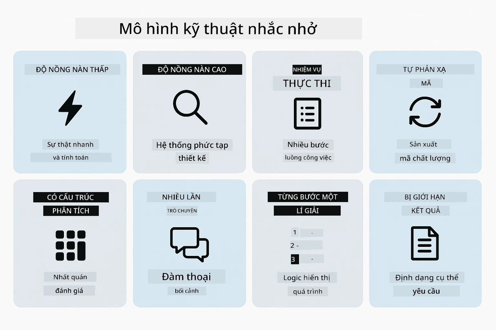
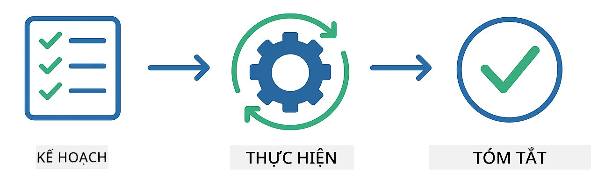
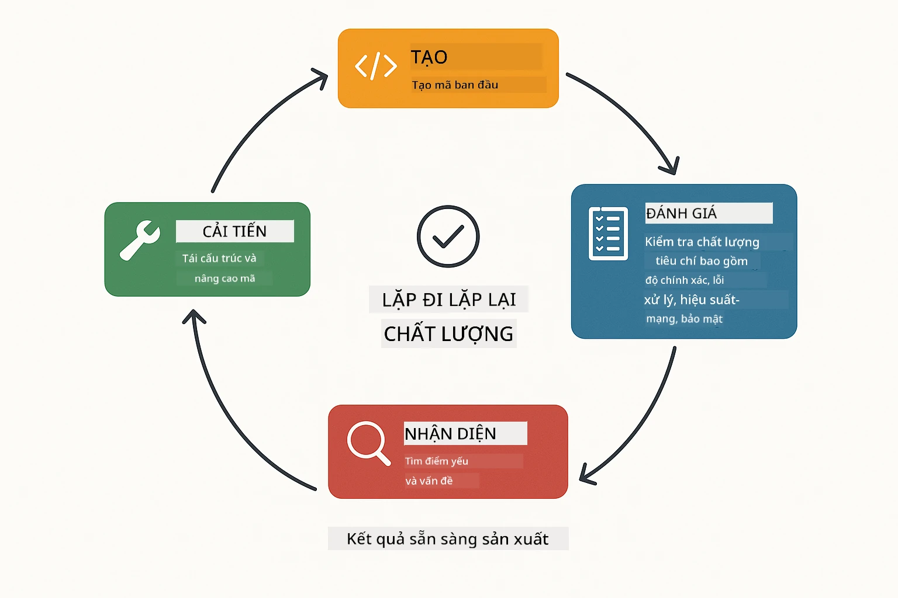
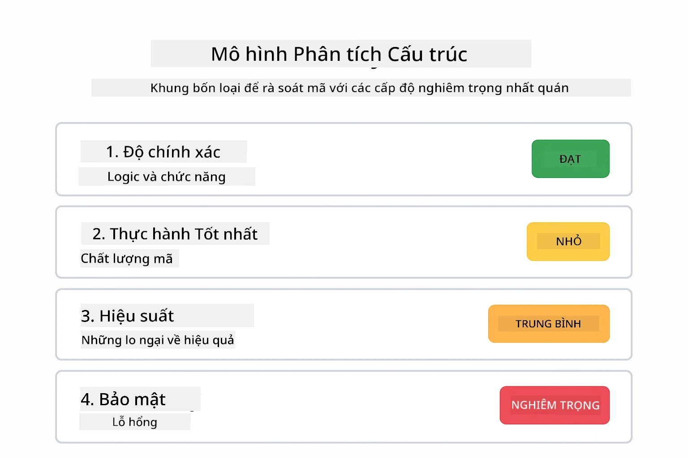
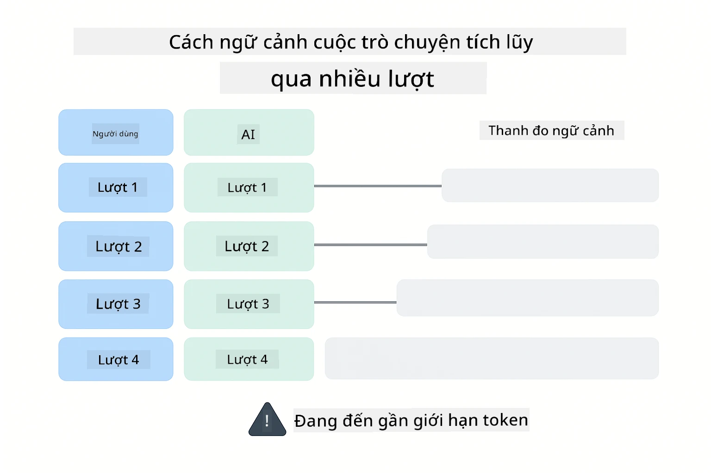
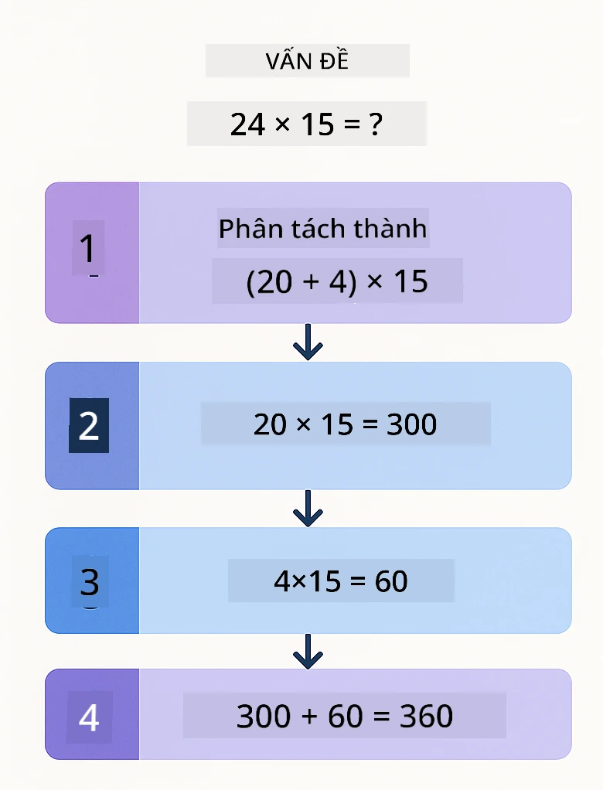
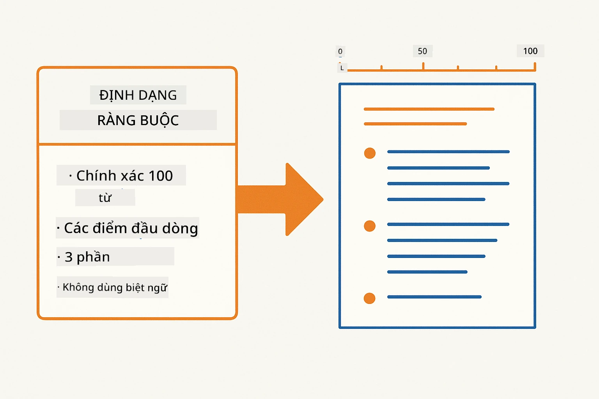
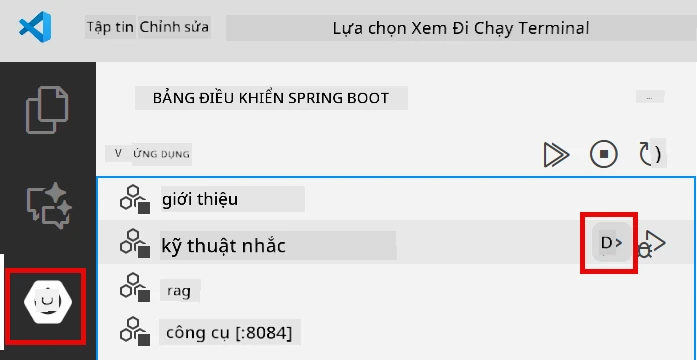
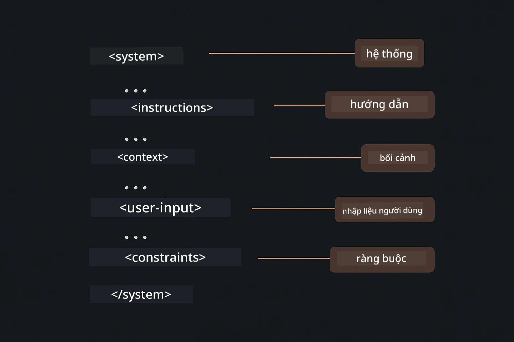

# Module 02: Kỹ Thuật Tạo Prompt với GPT-5.2

## Mục Lục

- [Video Hướng Dẫn](#video-hướng-dẫn)
- [Những Gì Bạn Sẽ Học](#những-gì-bạn-sẽ-học)
- [Yêu Cầu Tiên Quyết](#yêu-cầu-tiên-quyết)
- [Hiểu Về Kỹ Thuật Tạo Prompt](#hiểu-về-kỹ-thuật-tạo-prompt)
- [Các Nguyên Tắc Cơ Bản của Kỹ Thuật Tạo Prompt](#các-nguyên-tắc-cơ-bản-của-kỹ-thuật-tạo-prompt)
  - [Zero-Shot Prompting](#zero-shot-prompting)
  - [Few-Shot Prompting](#few-shot-prompting)
  - [Chain of Thought](#chain-of-thought)
  - [Role-Based Prompting](#role-based-prompting)
  - [Prompt Templates](#prompt-templates)
- [Các Mẫu Nâng Cao](#các-mẫu-nâng-cao)
- [Chạy Ứng Dụng](#chạy-ứng-dụng)
- [Ảnh Chụp Màn Hình Ứng Dụng](#ảnh-chụp-màn-hình-ứng-dụng)
- [Khám Phá Các Mẫu](#khám-phá-các-mẫu)
  - [Sự Nhiệt Tình Thấp và Cao](#tham-vọng-thấp-và-tham-vọng-cao)
  - [Thực Thi Nhiệm Vụ (Giới Thiệu Công Cụ)](#thực-thi-nhiệm-vụ-tool-preambles)
  - [Mã Tự Phản Chiếu](#mã-tự-phản-chiếu)
  - [Phân Tích Có Cấu Trúc](#phân-tích-cấu-trúc)
  - [Trò Chuyện Nhiều Lần](#hội-thoại-nhiều-lần)
  - [Lý Luận Từng Bước](#suy-luận-từng-bước)
  - [Đầu Ra Có Ràng Buộc](#đầu-ra-có-giới-hạn)
- [Những Gì Bạn Thật Sự Đang Học](#những-gì-bạn-thực-sự-học-được)
- [Bước Tiếp Theo](#các-bước-tiếp-theo)

## Video Hướng Dẫn

Xem buổi trực tiếp này để hiểu cách bắt đầu với module này:

<a href="https://www.youtube.com/live/PJ6aBaE6bog?si=LDshyBrTRodP-wke"></a>

## Những Gì Bạn Sẽ Học

Sơ đồ dưới đây cung cấp tổng quan về các chủ đề và kỹ năng chính mà bạn sẽ phát triển trong module này — từ kỹ thuật tinh chỉnh prompt đến quy trình làm việc từng bước bạn sẽ theo dõi.


Trong module trước, bạn đã thấy cách bộ nhớ giúp AI đàm thoại với Azure OpenAI. Bây giờ chúng ta sẽ tập trung vào cách bạn đặt câu hỏi — chính các prompt — sử dụng GPT-5.2 của Azure OpenAI. Cách bạn cấu trúc prompt ảnh hưởng rất lớn đến chất lượng câu trả lời bạn nhận được. Chúng ta bắt đầu với xem lại các kỹ thuật prompt cơ bản, rồi chuyển sang tám mẫu nâng cao tận dụng toàn bộ khả năng của GPT-5.2.

Chúng ta sẽ dùng GPT-5.2 bởi vì nó giới thiệu tính năng kiểm soát suy luận - bạn có thể yêu cầu mô hình suy nghĩ nhiều hay ít trước khi trả lời. Điều này làm cho các chiến lược tạo prompt khác biệt rõ ràng hơn và giúp bạn hiểu khi nào nên dùng từng cách tiếp cận.

## Yêu Cầu Tiên Quyết

- Hoàn thành Module 01 (đã triển khai tài nguyên Azure OpenAI)
- Tập tin `.env` trong thư mục gốc với thông tin xác thực Azure (được tạo bởi `azd up` trong Module 01)

> **Lưu ý:** Nếu bạn chưa hoàn thành Module 01, hãy làm theo hướng dẫn triển khai ở đó trước.

## Hiểu Về Kỹ Thuật Tạo Prompt

Về cơ bản, kỹ thuật tạo prompt là sự khác biệt giữa chỉ dẫn mơ hồ và chỉ dẫn chính xác, như so sánh dưới đây minh họa.


Kỹ thuật tạo prompt là thiết kế đoạn văn bản đầu vào sao cho luôn đạt kết quả bạn cần. Nó không chỉ đơn thuần là đặt câu hỏi - mà là cấu trúc các yêu cầu để mô hình hiểu chính xác bạn muốn gì và cách trả lời.

Hãy tưởng tượng bạn đang đưa chỉ dẫn cho đồng nghiệp. “Sửa lỗi” thì mơ hồ. “Sửa lỗi null pointer exception trong UserService.java dòng 45 bằng cách thêm kiểm tra null” thì cụ thể hơn. Các mô hình ngôn ngữ cũng tương tự — sự cụ thể và cấu trúc rất quan trọng.

Sơ đồ dưới đây cho thấy LangChain4j đóng vai trò thế nào trong bức tranh này — kết nối các mẫu prompt của bạn với mô hình thông qua các thành phần SystemMessage và UserMessage.


LangChain4j cung cấp hạ tầng — kết nối mô hình, bộ nhớ và các loại tin nhắn — trong khi các mẫu prompt chỉ là các đoạn văn bản được cấu trúc cẩn thận bạn gửi qua hạ tầng đó. Các thành phần chính là `SystemMessage` (đặt hành vi và vai trò AI) và `UserMessage` (chứa yêu cầu thực tế của bạn).

## Các Nguyên Tắc Cơ Bản của Kỹ Thuật Tạo Prompt

Năm kỹ thuật cốt lõi dưới đây là nền tảng của kỹ thuật tạo prompt hiệu quả. Mỗi kỹ thuật giải quyết một khía cạnh khác nhau của cách bạn giao tiếp với các mô hình ngôn ngữ.


Trước khi đi sâu vào các mẫu nâng cao trong module này, hãy xem lại năm kỹ thuật tạo prompt nền tảng. Đây là những khối xây dựng mà mọi kỹ sư prompt nên biết.

### Zero-Shot Prompting

Cách đơn giản nhất: đưa cho mô hình một chỉ dẫn trực tiếp không kèm ví dụ. Mô hình hoàn toàn dựa vào đào tạo để hiểu và thực hiện nhiệm vụ. Cách này hiệu quả với các yêu cầu đơn giản mà hành vi mong đợi rõ ràng.


*Chỉ dẫn trực tiếp không kèm ví dụ — mô hình suy luận nhiệm vụ chỉ qua chỉ dẫn*

```java
String prompt = "Classify this sentiment: 'I absolutely loved the movie!'";
String response = model.chat(prompt);
// Phản hồi: "Tích cực"
```

**Khi nào dùng:** Phân loại đơn giản, câu hỏi trực tiếp, dịch thuật, hoặc bất kỳ nhiệm vụ nào mô hình có thể làm mà không cần hướng dẫn thêm.

### Few-Shot Prompting

Cung cấp các ví dụ thể hiện mẫu bạn muốn mô hình theo. Mô hình học định dạng đầu vào - đầu ra mong đợi từ ví dụ của bạn và áp dụng cho dữ liệu mới. Điều này cải thiện đáng kể tính nhất quán cho các nhiệm vụ mà định dạng hoặc hành vi mong muốn không rõ ràng.


*Học từ ví dụ — mô hình nhận diện mẫu và áp dụng cho đầu vào mới*

```java
String prompt = """
    Classify the sentiment as positive, negative, or neutral.
    
    Examples:
    Text: "This product exceeded my expectations!" → Positive
    Text: "It's okay, nothing special." → Neutral
    Text: "Waste of money, very disappointed." → Negative
    
    Now classify this:
    Text: "Best purchase I've made all year!"
    """;
String response = model.chat(prompt);
```

**Khi nào dùng:** Phân loại tùy chỉnh, định dạng đồng nhất, nhiệm vụ đặc thù lĩnh vực, hoặc khi kết quả zero-shot không ổn định.

### Chain of Thought

Yêu cầu mô hình thể hiện suy luận từng bước. Thay vì nhảy ngay đến câu trả lời, mô hình phân tích vấn đề và xử lý từng phần rõ ràng. Điều này cải thiện độ chính xác cho toán học, logic, và các nhiệm vụ suy luận nhiều bước.


*Suy luận từng bước — phân chia vấn đề phức tạp thành các bước logic rõ ràng*

```java
String prompt = """
    Problem: A store has 15 apples. They sell 8 apples and then 
    receive a shipment of 12 more apples. How many apples do they have now?
    
    Let's solve this step-by-step:
    """;
String response = model.chat(prompt);
// Mô hình cho thấy: 15 - 8 = 7, sau đó 7 + 12 = 19 quả táo
```

**Khi nào dùng:** Bài toán toán học, câu đố logic, gỡ lỗi, hoặc bất kỳ nhiệm vụ nào mà việc thể hiện quá trình suy luận giúp tăng độ chính xác và độ tin cậy.

### Role-Based Prompting

Chỉ định một persona hoặc vai trò cho AI trước khi đặt câu hỏi. Điều này cung cấp ngữ cảnh ảnh hưởng đến giọng điệu, độ sâu, và trọng tâm câu trả lời. Một "kiến trúc sư phần mềm" sẽ đưa lời khuyên khác với "lập trình viên mới" hay "kiểm toán viên bảo mật".


*Đặt ngữ cảnh và vai trò — cùng một câu hỏi nhưng câu trả lời thay đổi tùy vai trò được gán*

```java
String prompt = """
    You are an experienced software architect reviewing code.
    Provide a brief code review for this function:
    
    def calculate_total(items):
        total = 0
        for item in items:
            total = total + item['price']
        return total
    """;
String response = model.chat(prompt);
```

**Khi nào dùng:** Đánh giá mã nguồn, dạy kèm, phân tích lĩnh vực đặc thù, hoặc khi bạn cần câu trả lời phù hợp với cấp độ chuyên môn hoặc góc nhìn nhất định.

### Prompt Templates

Tạo các prompt có thể tái sử dụng với các biến placeholder. Thay vì viết prompt mới mỗi lần, xác định một khuôn mẫu một lần rồi thay giá trị khác nhau. Lớp `PromptTemplate` của LangChain4j cho phép điều này dễ dàng với cú pháp `{{variable}}`.


*Prompt tái sử dụng với các biến placeholder — một khuôn mẫu, nhiều lần dùng*

```java
PromptTemplate template = PromptTemplate.from(
    "What's the best time to visit {{destination}} for {{activity}}?"
);

Prompt prompt = template.apply(Map.of(
    "destination", "Paris",
    "activity", "sightseeing"
));

String response = model.chat(prompt.text());
```

**Khi nào dùng:** Các truy vấn lặp lại với đầu vào khác nhau, xử lý hàng loạt, xây dựng quy trình AI tái sử dụng, hoặc bất cứ trường hợp nào cấu trúc prompt giữ nguyên nhưng dữ liệu thay đổi.

---

Năm kỹ thuật cơ bản này cung cấp cho bạn bộ công cụ vững chắc cho hầu hết nhiệm vụ tạo prompt. Phần còn lại của module xây dựng dựa trên đó với **tám mẫu nâng cao** tận dụng khả năng kiểm soát suy luận, tự đánh giá, và đầu ra có cấu trúc của GPT-5.2.

## Các Mẫu Nâng Cao

Sau khi đã có kiến thức cơ bản, ta chuyển sang tám mẫu nâng cao làm module này nổi bật. Không phải vấn đề nào cũng dùng chung một cách tiếp cận. Một số câu hỏi cần câu trả lời nhanh, số khác cần suy nghĩ sâu. Một số cần suy luận rõ ràng, số khác chỉ cần kết quả. Mỗi mẫu dưới đây được tối ưu cho từng tình huống — và khả năng kiểm soát suy luận của GPT-5.2 làm các khác biệt này càng rõ ràng hơn.



*Tổng quan tám mẫu kỹ thuật tạo prompt và các trường hợp sử dụng*

GPT-5.2 thêm chiều kích mới vào các mẫu này: *kiểm soát suy luận*. Thanh trượt dưới đây cho thấy bạn có thể điều chỉnh mức độ suy nghĩ của mô hình — từ trả lời nhanh, trực tiếp đến phân tích sâu, kỹ lưỡng.


*Kiểm soát suy luận của GPT-5.2 cho phép bạn chỉ định mô hình nên suy nghĩ bao nhiêu — từ trả lời nhanh đến tìm hiểu sâu*

**Nhiệt Tình Thấp (Nhanh & Tập Trung)** - Dành cho câu hỏi đơn giản bạn muốn câu trả lời nhanh, trực tiếp. Mô hình suy luận tối thiểu - tối đa 2 bước. Dùng cho phép tính, tra cứu, hoặc câu hỏi đơn giản.

```java
String prompt = """
    <context_gathering>
    - Search depth: very low
    - Bias strongly towards providing a correct answer as quickly as possible
    - Usually, this means an absolute maximum of 2 reasoning steps
    - If you think you need more time, state what you know and what's uncertain
    </context_gathering>
    
    Problem: What is 15% of 200?
    
    Provide your answer:
    """;

String response = chatModel.chat(prompt);
```

> 💡 **Khám phá với GitHub Copilot:** Mở [`Gpt5PromptService.java`](../../../02-prompt-engineering/src/main/java/com/example/langchain4j/prompts/service/Gpt5PromptService.java) và hỏi:
> - "Sự khác biệt giữa mẫu nhiệt tình thấp và cao là gì?"
> - "Các thẻ XML trong prompt giúp cấu trúc câu trả lời AI như thế nào?"
> - "Khi nào nên dùng mẫu tự phản chiếu so với chỉ dẫn trực tiếp?"

**Nhiệt Tình Cao (Sâu & Kỹ Lưỡng)** - Dành cho vấn đề phức tạp cần phân tích toàn diện. Mô hình suy nghĩ kỹ lưỡng và trình bày lý luận chi tiết. Dùng cho thiết kế hệ thống, quyết định kiến trúc, hoặc nghiên cứu phức tạp.

```java
String prompt = """
    Analyze this problem thoroughly and provide a comprehensive solution.
    Consider multiple approaches, trade-offs, and important details.
    Show your analysis and reasoning in your response.
    
    Problem: Design a caching strategy for a high-traffic REST API.
    """;

String response = chatModel.chat(prompt);
```

**Thực Thi Nhiệm Vụ (Tiến Trình Từng Bước)** - Dành cho quy trình nhiều bước. Mô hình cung cấp kế hoạch ban đầu, mô tả từng bước khi thực hiện, rồi tóm tắt lại. Dùng cho di cư, triển khai, hoặc quy trình nhiều bước.

```java
String prompt = """
    <task_execution>
    1. First, briefly restate the user's goal in a friendly way
    
    2. Create a step-by-step plan:
       - List all steps needed
       - Identify potential challenges
       - Outline success criteria
    
    3. Execute each step:
       - Narrate what you're doing
       - Show progress clearly
       - Handle any issues that arise
    
    4. Summarize:
       - What was completed
       - Any important notes
       - Next steps if applicable
    </task_execution>
    
    <tool_preambles>
    - Always begin by rephrasing the user's goal clearly
    - Outline your plan before executing
    - Narrate each step as you go
    - Finish with a distinct summary
    </tool_preambles>
    
    Task: Create a REST endpoint for user registration
    
    Begin execution:
    """;

String response = chatModel.chat(prompt);
```

Chain-of-Thought prompting yêu cầu mô hình trình bày quá trình suy luận, tăng độ chính xác cho các nhiệm vụ phức tạp. Phân tích từng bước giúp cả người và AI hiểu rõ logic.

> **🤖 Thử với Chat [GitHub Copilot](https://github.com/features/copilot):** Hỏi về mẫu này:
> - "Làm sao tôi điều chỉnh mẫu thực thi nhiệm vụ cho các thao tác chạy lâu?"
> - "Các thực hành tốt nhất khi cấu trúc giới thiệu công cụ trong ứng dụng sản xuất là gì?"
> - "Làm sao tôi có thể thu thập và hiển thị tiến trình trung gian trong giao diện người dùng?"

Sơ đồ dưới đây minh họa quy trình Lập Kế Hoạch → Thực Thi → Tóm Tắt.



*Quy trình Lập Kế Hoạch → Thực Thi → Tóm Tắt cho nhiệm vụ đa bước*

**Mã Tự Phản Chiếu** - Dành cho tạo mã chất lượng sản xuất. Mô hình tạo mã theo tiêu chuẩn sản xuất với xử lý lỗi thích hợp. Dùng khi xây dựng tính năng hay dịch vụ mới.

```java
String prompt = """
    Generate Java code with production-quality standards: Create an email validation service
    Keep it simple and include basic error handling.
    """;

String response = chatModel.chat(prompt);
```

Sơ đồ dưới đây thể hiện vòng lặp cải tiến tuần hoàn — tạo, đánh giá, xác định điểm yếu, và tinh chỉnh cho tới khi mã đạt chuẩn.



*Vòng lặp cải tiến tuần hoàn - tạo, đánh giá, nhận diện vấn đề, cải thiện, lặp lại*

**Phân Tích Có Cấu Trúc** - Dành cho đánh giá nhất quán. Mô hình đánh giá mã theo khung cố định (độ chính xác, thực hành, hiệu năng, bảo mật, khả năng bảo trì). Dùng cho đánh giá mã hoặc đánh giá chất lượng.

```java
String prompt = """
    <analysis_framework>
    You are an expert code reviewer. Analyze the code for:
    
    1. Correctness
       - Does it work as intended?
       - Are there logical errors?
    
    2. Best Practices
       - Follows language conventions?
       - Appropriate design patterns?
    
    3. Performance
       - Any inefficiencies?
       - Scalability concerns?
    
    4. Security
       - Potential vulnerabilities?
       - Input validation?
    
    5. Maintainability
       - Code clarity?
       - Documentation?
    
    <output_format>
    Provide your analysis in this structure:
    - Summary: One-sentence overall assessment
    - Strengths: 2-3 positive points
    - Issues: List any problems found with severity (High/Medium/Low)
    - Recommendations: Specific improvements
    </output_format>
    </analysis_framework>
    
    Code to analyze:
    ```
    public List getUsers() {
        return database.query("SELECT * FROM users");
    }
    ```
    Provide your structured analysis:
    """;

String response = chatModel.chat(prompt);
```

> **🤖 Thử với Chat [GitHub Copilot](https://github.com/features/copilot):** Hỏi về phân tích có cấu trúc:
> - "Làm thế nào tùy chỉnh khung phân tích cho các loại đánh giá mã khác nhau?"
> - "Cách tốt nhất để phân tích và xử lý đầu ra có cấu trúc bằng lập trình là gì?"
> - "Làm sao đảm bảo mức độ nghiêm trọng đồng nhất qua các phiên đánh giá khác nhau?"

Sơ đồ dưới đây mô tả cách khung phân tích tổ chức đánh giá mã thành các hạng mục đồng nhất với mức độ nghiêm trọng.



*Khung cho đánh giá mã nhất quán với mức độ nghiêm trọng*

**Trò Chuyện Nhiều Lần** - Dành cho các cuộc hội thoại cần bối cảnh. Mô hình nhớ các tin nhắn trước và xây dựng dựa trên chúng. Dùng cho các buổi trợ giúp tương tác hoặc Q&A phức tạp.

```java
ChatMemory memory = MessageWindowChatMemory.withMaxMessages(10);

memory.add(UserMessage.from("What is Spring Boot?"));
AiMessage aiMessage1 = chatModel.chat(memory.messages()).aiMessage();
memory.add(aiMessage1);

memory.add(UserMessage.from("Show me an example"));
AiMessage aiMessage2 = chatModel.chat(memory.messages()).aiMessage();
memory.add(aiMessage2);
```

Sơ đồ dưới đây minh họa cách bối cảnh hội thoại tích lũy qua nhiều lượt và liên quan đến giới hạn token của mô hình.



*Cách bối cảnh hội thoại tích tụ qua nhiều lượt cho đến khi đạt giới hạn token*

**Lý Luận Từng Bước** - Dành cho các vấn đề cần logic rõ ràng. Mô hình thể hiện suy luận rõ ràng từng bước. Dùng cho bài toán toán học, câu đố logic, hoặc khi bạn cần hiểu quá trình suy nghĩ.

```java
String prompt = """
    <instruction>Show your reasoning step-by-step</instruction>
    
    If a train travels 120 km in 2 hours, then stops for 30 minutes,
    then travels another 90 km in 1.5 hours, what is the average speed
    for the entire journey including the stop?
    """;

String response = chatModel.chat(prompt);
```

Sơ đồ dưới đây minh họa cách mô hình phân chia vấn đề thành các bước logic rõ ràng, đánh số từng bước.


*Phân tích vấn đề thành các bước logic rõ ràng*

**Đầu ra có giới hạn** - Dành cho các phản hồi yêu cầu định dạng cụ thể. Mô hình tuân thủ nghiêm ngặt các quy tắc về định dạng và độ dài. Sử dụng điều này cho các bản tóm tắt hoặc khi bạn cần cấu trúc đầu ra chính xác.

```java
String prompt = """
    <constraints>
    - Exactly 100 words
    - Bullet point format
    - Technical terms only
    </constraints>
    
    Summarize the key concepts of machine learning.
    """;

String response = chatModel.chat(prompt);
```
  
Sơ đồ sau thể hiện cách các ràng buộc hướng dẫn mô hình tạo ra đầu ra tuân thủ nghiêm ngặt các yêu cầu định dạng và độ dài của bạn.



*Thực thi yêu cầu cụ thể về định dạng, độ dài và cấu trúc*

## Chạy Ứng Dụng

**Xác minh triển khai:**  

Đảm bảo file `.env` tồn tại trong thư mục gốc với thông tin đăng nhập Azure (đã tạo trong Module 01). Chạy lệnh này từ thư mục module (`02-prompt-engineering/`):

**Bash:**  
```bash
cat ../.env  # Nên hiển thị AZURE_OPENAI_ENDPOINT, API_KEY, DEPLOYMENT
```
  
**PowerShell:**  
```powershell
Get-Content ..\.env  # Nên hiển thị AZURE_OPENAI_ENDPOINT, API_KEY, DEPLOYMENT
```
  
**Khởi động ứng dụng:**  

> **Lưu ý:** Nếu bạn đã khởi động tất cả ứng dụng bằng `./start-all.sh` từ thư mục gốc (như mô tả trong Module 01), module này đã chạy trên cổng 8083. Bạn có thể bỏ qua các lệnh khởi động dưới đây và truy cập trực tiếp http://localhost:8083.

**Lựa chọn 1: Sử dụng Spring Boot Dashboard (Khuyên dùng cho người dùng VS Code)**

Dev container bao gồm tiện ích mở rộng Spring Boot Dashboard, cung cấp giao diện trực quan để quản lý tất cả ứng dụng Spring Boot. Bạn có thể tìm thấy nó trên Thanh Hoạt Động bên trái VS Code (tìm biểu tượng Spring Boot).

Từ Spring Boot Dashboard, bạn có thể:  
- Xem tất cả ứng dụng Spring Boot có trong workspace  
- Bắt đầu/dừng ứng dụng chỉ với một cú nhấp  
- Xem nhật ký ứng dụng theo thời gian thực  
- Giám sát trạng thái ứng dụng  

Chỉ cần nhấp nút chạy bên cạnh "prompt-engineering" để khởi động module này, hoặc khởi động tất cả các module cùng lúc.



*Spring Boot Dashboard trong VS Code — khởi động, dừng và giám sát tất cả các module tại một nơi*

**Lựa chọn 2: Sử dụng shell script**

Khởi động tất cả ứng dụng web (module 01-04):

**Bash:**  
```bash
cd ..  # Từ thư mục gốc
./start-all.sh
```
  
**PowerShell:**  
```powershell
cd ..  # Từ thư mục gốc
.\start-all.ps1
```
  
Hoặc chỉ khởi động module này:

**Bash:**  
```bash
cd 02-prompt-engineering
./start.sh
```
  
**PowerShell:**  
```powershell
cd 02-prompt-engineering
.\start.ps1
```
  
Cả hai script tự động tải biến môi trường từ file `.env` ở thư mục gốc và sẽ xây dựng các JAR nếu chúng chưa tồn tại.

> **Lưu ý:** Nếu bạn muốn xây dựng tất cả các module thủ công trước khi khởi động:  
>  
> **Bash:**  
> ```bash
> cd ..  # Go to root directory
> mvn clean package -DskipTests
> ```
  
> **PowerShell:**  
> ```powershell
> cd ..  # Go to root directory
> mvn clean package -DskipTests
> ```
  
Mở http://localhost:8083 trong trình duyệt của bạn.

**Để dừng:**  

**Bash:**  
```bash
./stop.sh  # Chỉ mô-đun này
# Hoặc
cd .. && ./stop-all.sh  # Tất cả các mô-đun
```
  
**PowerShell:**  
```powershell
.\stop.ps1  # Chỉ mô-đun này
# Hoặc
cd ..; .\stop-all.ps1  # Tất cả các mô-đun
```
  
## Ảnh chụp màn hình ứng dụng

Đây là giao diện chính của module kỹ thuật prompt, nơi bạn có thể thử nghiệm cùng lúc tất cả tám mẫu.


*Bảng điều khiển chính hiển thị tất cả 8 mẫu kỹ thuật prompt với đặc điểm và trường hợp sử dụng*

## Khám phá các Mẫu

Giao diện web cho phép bạn thử nghiệm các chiến lược prompt khác nhau. Mỗi mẫu giải quyết các vấn đề khác nhau - hãy thử để xem khi nào cách tiếp cận nào phát huy tác dụng.

> **Lưu ý: Streaming và Không Streaming** — Mỗi trang mẫu cung cấp hai nút: **🔴 Stream Response (Live)** và tùy chọn **Không streaming**. Streaming sử dụng Server-Sent Events (SSE) để hiển thị token theo thời gian thực khi mô hình tạo ra chúng, giúp bạn thấy tiến trình ngay lập tức. Tùy chọn không streaming chờ cho đến khi toàn bộ phản hồi được tạo xong mới hiển thị. Với các prompt kích hoạt suy luận sâu (ví dụ: High Eagerness, Self-Reflecting Code), gọi không streaming có thể mất rất lâu — đôi khi vài phút — mà không có phản hồi rõ ràng. **Sử dụng streaming khi thử nghiệm các prompt phức tạp** để bạn có thể thấy mô hình đang hoạt động và tránh cảm giác yêu cầu bị treo.  
>  
> **Lưu ý: Yêu cầu trình duyệt** — Tính năng streaming sử dụng Fetch Streams API (`response.body.getReader()`), yêu cầu trình duyệt đầy đủ (Chrome, Edge, Firefox, Safari). Nó **không** hoạt động trong Simple Browser tích hợp của VS Code, vì webview của nó không hỗ trợ ReadableStream API. Nếu bạn dùng Simple Browser, các nút không streaming vẫn dùng bình thường — chỉ có nút streaming mới bị ảnh hưởng. Mở `http://localhost:8083` trong trình duyệt ngoài để có trải nghiệm đầy đủ.

### Tham Vọng Thấp và Tham Vọng Cao

Hỏi câu đơn giản như "15% của 200 là bao nhiêu?" với Tham Vọng Thấp. Bạn sẽ nhận câu trả lời ngay lập tức, trực tiếp. Bây giờ thử hỏi điều phức tạp hơn như "Thiết kế chiến lược caching cho API lưu lượng lớn" với Tham Vọng Cao. Nhấp **🔴 Stream Response (Live)** và quan sát cách mô hình suy luận chi tiết hiện dần qua từng token. Mô hình vẫn như cũ, câu hỏi như cũ nhưng prompt chỉ đạo mức độ suy nghĩ cho mô hình.

### Thực thi Nhiệm vụ (Tool Preambles)

Các luồng công việc nhiều bước cần kế hoạch trước và mô tả tiến trình. Mô hình sẽ vạch ra những bước sẽ làm, mô tả từng bước, rồi tóm tắt kết quả.

### Mã Tự Phản Chiếu

Thử "Tạo dịch vụ kiểm tra email". Thay vì chỉ sinh code rồi dừng, mô hình sinh, đánh giá theo tiêu chuẩn chất lượng, nhận diện điểm yếu và cải thiện. Bạn sẽ thấy nó lặp đi lặp lại cho tới khi mã đạt chuẩn sản xuất.

### Phân Tích Cấu Trúc

Đánh giá code cần khung đánh giá nhất quán. Mô hình phân tích code theo các mục cố định (độ chính xác, thực hành, hiệu năng, bảo mật) với các mức độ nghiêm trọng.

### Hội Thoại Nhiều Lần

Hỏi "Spring Boot là gì?" rồi ngay lập tức hỏi tiếp "Cho tôi ví dụ". Mô hình nhớ câu hỏi đầu và cho ví dụ Spring Boot cụ thể. Nếu không nhớ, câu hỏi thứ hai sẽ quá chung chung.

### Suy Luận Từng Bước

Chọn một bài toán toán học và thử với cả Suy Luận Từng Bước và Tham Vọng Thấp. Tham Vọng Thấp chỉ cho bạn kết quả nhanh nhưng không rõ ràng, Suy Luận Từng Bước cho bạn thấy từng phép tính và quyết định.

### Đầu Ra Có Giới Hạn

Khi bạn cần định dạng hoặc số từ chính xác, mẫu này giúp bắt buộc mô hình tuân thủ nghiêm ngặt. Thử tạo một bản tóm tắt 100 từ chính xác ở dạng gạch đầu dòng.

## Những Gì Bạn Thực Sự Học Được

**Nỗ lực suy luận thay đổi mọi thứ**

GPT-5.2 cho phép bạn kiểm soát nỗ lực tính toán thông qua prompt. Nỗ lực thấp có nghĩa phản hồi nhanh với ít khám phá. Nỗ lực cao nghĩa mô hình dành thời gian suy nghĩ sâu hơn. Bạn học cách điều chỉnh nỗ lực phù hợp với độ phức tạp nhiệm vụ — đừng lãng phí thời gian cho câu hỏi đơn giản, nhưng cũng đừng vội vàng với quyết định phức tạp.

**Cấu trúc dẫn hướng hành vi**

Có để ý thấy các thẻ XML trong prompt không? Chúng không phải để trang trí. Mô hình tuân theo các hướng dẫn có cấu trúc đáng tin cậy hơn so với văn bản tự do. Khi bạn cần các quá trình nhiều bước hoặc logic phức tạp, cấu trúc giúp mô hình theo dõi vị trí và bước tiếp theo. Sơ đồ dưới đây phân tích một prompt được cấu trúc tốt, cho thấy cách các thẻ như `<system>`, `<instructions>`, `<context>`, `<user-input>`, và `<constraints>` tổ chức chỉ dẫn của bạn thành các phần rõ ràng.



*Cấu trúc của một prompt được tổ chức tốt với các phần rõ ràng và kiểu XML*

**Chất lượng qua tự đánh giá**

Các mẫu tự phản chiếu hoạt động bằng cách làm tiêu chuẩn chất lượng trở nên rõ ràng. Thay vì hy vọng mô hình “làm đúng”, bạn chỉ rõ "đúng" nghĩa là gì: logic chính xác, xử lý lỗi, hiệu năng, bảo mật. Mô hình có thể tự đánh giá đầu ra và cải thiện. Điều này biến việc sinh code từ trò may rủi thành quá trình có kiểm soát.

**Ngữ cảnh là hữu hạn**

Hội thoại nhiều lượt hoạt động bằng cách bao gồm lịch sử tin nhắn trong mỗi yêu cầu. Nhưng có giới hạn - mỗi mô hình có số token tối đa. Khi hội thoại lớn dần, bạn cần chiến lược giữ ngữ cảnh liên quan mà không vượt quá giới hạn. Module này cho bạn thấy cách hoạt động của bộ nhớ; sau này bạn sẽ học khi nào nên tóm tắt, khi nào quên, và khi nào truy xuất.

## Các bước Tiếp theo

**Module tiếp theo:** [03-rag - RAG (Tạo sinh tăng cường truy xuất)](../03-rag/README.md)

---

**Điều hướng:** [← Trước: Module 01 - Giới thiệu](../01-introduction/README.md) | [Quay lại trang chính](../README.md) | [Tiếp: Module 03 - RAG →](../03-rag/README.md)

---

<!-- CO-OP TRANSLATOR DISCLAIMER START -->
**Tuyên bố miễn trừ trách nhiệm**:
Tài liệu này đã được dịch bằng dịch vụ dịch thuật AI [Co-op Translator](https://github.com/Azure/co-op-translator). Mặc dù chúng tôi cố gắng đảm bảo độ chính xác, xin lưu ý rằng bản dịch tự động có thể chứa lỗi hoặc sai sót. Tài liệu gốc bằng ngôn ngữ gốc nên được coi là nguồn tin chính thức. Đối với thông tin quan trọng, nên sử dụng dịch vụ dịch thuật chuyên nghiệp bởi con người. Chúng tôi không chịu trách nhiệm về bất kỳ hiểu lầm hoặc giải thích sai nào phát sinh từ việc sử dụng bản dịch này.
<!-- CO-OP TRANSLATOR DISCLAIMER END -->