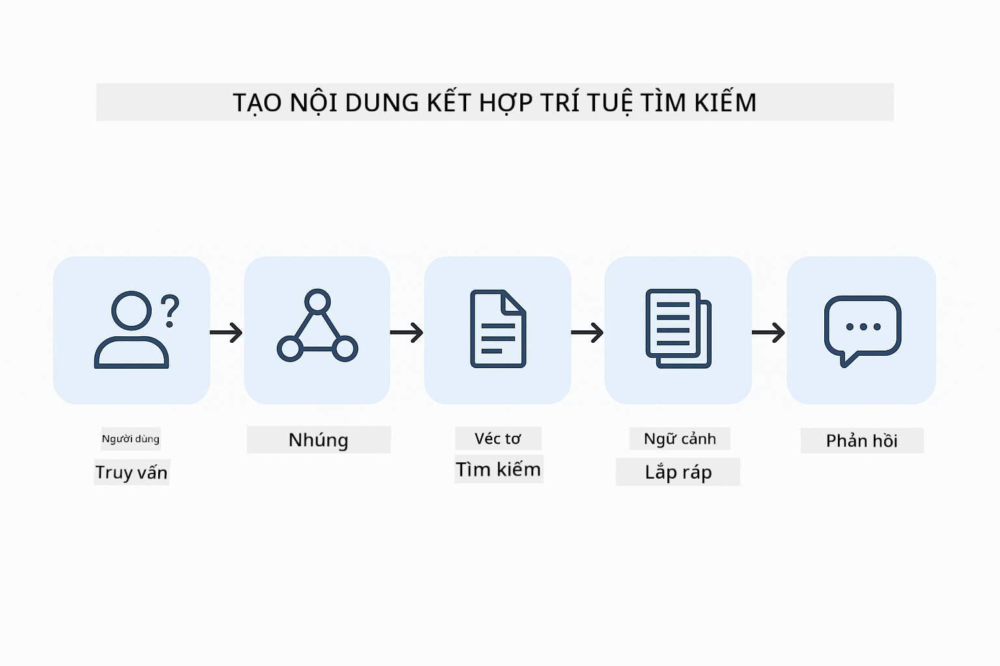
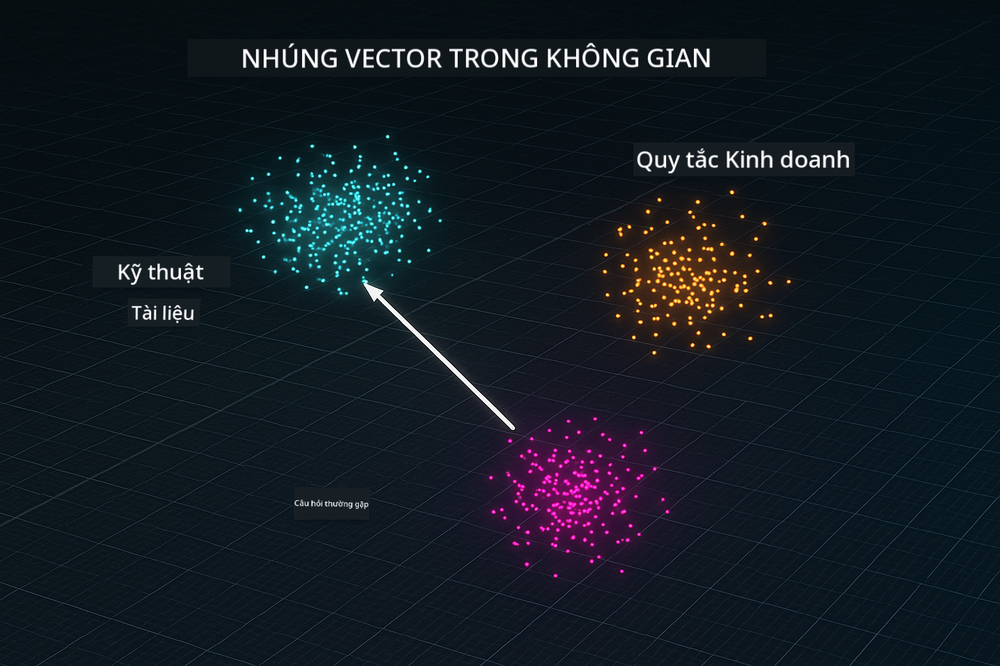

<!--
CO_OP_TRANSLATOR_METADATA:
{
  "original_hash": "f538a51cfd13147d40d84e936a0f485c",
  "translation_date": "2025-12-13T17:09:49+00:00",
  "source_file": "03-rag/README.md",
  "language_code": "vi"
}
-->
# Module 03: RAG (Tạo Nội Dung Tăng Cường Truy Xuất)

## Mục Lục

- [Bạn Sẽ Học Gì](../../../03-rag)
- [Yêu Cầu Trước](../../../03-rag)
- [Hiểu Về RAG](../../../03-rag)
- [Cách Hoạt Động](../../../03-rag)
  - [Xử Lý Tài Liệu](../../../03-rag)
  - [Tạo Embeddings](../../../03-rag)
  - [Tìm Kiếm Ngữ Nghĩa](../../../03-rag)
  - [Tạo Câu Trả Lời](../../../03-rag)
- [Chạy Ứng Dụng](../../../03-rag)
- [Sử Dụng Ứng Dụng](../../../03-rag)
  - [Tải Lên Tài Liệu](../../../03-rag)
  - [Đặt Câu Hỏi](../../../03-rag)
  - [Kiểm Tra Tham Chiếu Nguồn](../../../03-rag)
  - [Thử Nghiệm Với Các Câu Hỏi](../../../03-rag)
- [Khái Niệm Chính](../../../03-rag)
  - [Chiến Lược Chia Đoạn](../../../03-rag)
  - [Điểm Tương Đồng](../../../03-rag)
  - [Lưu Trữ Trong Bộ Nhớ](../../../03-rag)
  - [Quản Lý Cửa Sổ Ngữ Cảnh](../../../03-rag)
- [Khi Nào RAG Quan Trọng](../../../03-rag)
- [Bước Tiếp Theo](../../../03-rag)

## Bạn Sẽ Học Gì

Trong các module trước, bạn đã học cách trò chuyện với AI và cấu trúc prompt hiệu quả. Nhưng có một giới hạn cơ bản: các mô hình ngôn ngữ chỉ biết những gì chúng học được trong quá trình huấn luyện. Chúng không thể trả lời các câu hỏi về chính sách công ty bạn, tài liệu dự án của bạn, hoặc bất kỳ thông tin nào mà chúng không được huấn luyện.

RAG (Tạo Nội Dung Tăng Cường Truy Xuất) giải quyết vấn đề này. Thay vì cố gắng dạy mô hình thông tin của bạn (điều này tốn kém và không thực tế), bạn cho nó khả năng tìm kiếm trong các tài liệu của bạn. Khi ai đó đặt câu hỏi, hệ thống tìm thông tin liên quan và đưa vào prompt. Mô hình sau đó trả lời dựa trên ngữ cảnh được truy xuất đó.

Hãy nghĩ về RAG như việc cung cấp cho mô hình một thư viện tham khảo. Khi bạn đặt câu hỏi, hệ thống:

1. **Truy Vấn Người Dùng** - Bạn đặt câu hỏi
2. **Embedding** - Chuyển câu hỏi thành vector
3. **Tìm Kiếm Vector** - Tìm các đoạn tài liệu tương tự
4. **Tập Hợp Ngữ Cảnh** - Thêm các đoạn liên quan vào prompt
5. **Phản Hồi** - LLM tạo câu trả lời dựa trên ngữ cảnh

Điều này giúp câu trả lời của mô hình dựa trên dữ liệu thực tế của bạn thay vì dựa vào kiến thức huấn luyện hoặc tự tạo câu trả lời.



*Quy trình RAG - từ truy vấn người dùng đến tìm kiếm ngữ nghĩa đến tạo câu trả lời theo ngữ cảnh*

## Yêu Cầu Trước

- Hoàn thành Module 01 (đã triển khai tài nguyên Azure OpenAI)
- File `.env` trong thư mục gốc với thông tin xác thực Azure (được tạo bởi `azd up` trong Module 01)

> **Lưu ý:** Nếu bạn chưa hoàn thành Module 01, hãy làm theo hướng dẫn triển khai ở đó trước.

## Cách Hoạt Động

**Xử Lý Tài Liệu** - [DocumentService.java](../../../03-rag/src/main/java/com/example/langchain4j/rag/service/DocumentService.java)

Khi bạn tải lên một tài liệu, hệ thống sẽ chia nó thành các đoạn nhỏ - những phần nhỏ hơn vừa vặn trong cửa sổ ngữ cảnh của mô hình. Các đoạn này chồng lấn nhẹ để bạn không mất ngữ cảnh ở ranh giới.

```java
Document document = FileSystemDocumentLoader.loadDocument("sample-document.txt");

DocumentSplitter splitter = DocumentSplitters
    .recursive(300, 30, new OpenAiTokenizer());

List<TextSegment> segments = splitter.split(document);
```

> **🤖 Thử với [GitHub Copilot](https://github.com/features/copilot) Chat:** Mở [`DocumentService.java`](../../../03-rag/src/main/java/com/example/langchain4j/rag/service/DocumentService.java) và hỏi:
> - "LangChain4j chia tài liệu thành các đoạn như thế nào và tại sao chồng lấn lại quan trọng?"
> - "Kích thước đoạn tối ưu cho các loại tài liệu khác nhau là bao nhiêu và tại sao?"
> - "Làm thế nào để xử lý tài liệu đa ngôn ngữ hoặc có định dạng đặc biệt?"

**Tạo Embeddings** - [LangChainRagConfig.java](../../../03-rag/src/main/java/com/example/langchain4j/rag/config/LangChainRagConfig.java)

Mỗi đoạn được chuyển thành một biểu diễn số gọi là embedding - về cơ bản là dấu vân tay toán học thể hiện ý nghĩa của văn bản. Văn bản tương tự sẽ tạo ra embeddings tương tự.

```java
@Bean
public EmbeddingModel embeddingModel() {
    return OpenAiOfficialEmbeddingModel.builder()
        .baseUrl(azureOpenAiEndpoint)
        .apiKey(azureOpenAiKey)
        .modelName(azureEmbeddingDeploymentName)
        .build();
}

EmbeddingStore<TextSegment> embeddingStore = 
    new InMemoryEmbeddingStore<>();
```



*Tài liệu được biểu diễn dưới dạng vector trong không gian embedding - nội dung tương tự nhóm lại với nhau*

**Tìm Kiếm Ngữ Nghĩa** - [RagService.java](../../../03-rag/src/main/java/com/example/langchain4j/rag/service/RagService.java)

Khi bạn đặt câu hỏi, câu hỏi cũng được chuyển thành embedding. Hệ thống so sánh embedding câu hỏi của bạn với tất cả các đoạn tài liệu. Nó tìm các đoạn có ý nghĩa tương tự nhất - không chỉ khớp từ khóa mà là sự tương đồng ngữ nghĩa thực sự.

```java
Embedding queryEmbedding = embeddingModel.embed(question).content();

List<EmbeddingMatch<TextSegment>> matches = 
    embeddingStore.findRelevant(queryEmbedding, 5, 0.7);

for (EmbeddingMatch<TextSegment> match : matches) {
    String relevantText = match.embedded().text();
    double score = match.score();
}
```

> **🤖 Thử với [GitHub Copilot](https://github.com/features/copilot) Chat:** Mở [`RagService.java`](../../../03-rag/src/main/java/com/example/langchain4j/rag/service/RagService.java) và hỏi:
> - "Tìm kiếm tương đồng hoạt động với embeddings như thế nào và điểm số được xác định ra sao?"
> - "Ngưỡng tương đồng nên dùng là bao nhiêu và nó ảnh hưởng thế nào đến kết quả?"
> - "Làm thế nào để xử lý trường hợp không tìm thấy tài liệu liên quan?"

**Tạo Câu Trả Lời** - [RagService.java](../../../03-rag/src/main/java/com/example/langchain4j/rag/service/RagService.java)

Các đoạn liên quan nhất được đưa vào prompt cho mô hình. Mô hình đọc các đoạn cụ thể đó và trả lời câu hỏi dựa trên thông tin đó. Điều này ngăn chặn việc tạo ra câu trả lời không chính xác - mô hình chỉ có thể trả lời từ những gì có trước mặt nó.

## Chạy Ứng Dụng

**Xác minh triển khai:**

Đảm bảo file `.env` tồn tại trong thư mục gốc với thông tin xác thực Azure (được tạo trong Module 01):
```bash
cat ../.env  # Nên hiển thị AZURE_OPENAI_ENDPOINT, API_KEY, DEPLOYMENT
```

**Khởi động ứng dụng:**

> **Lưu ý:** Nếu bạn đã khởi động tất cả ứng dụng bằng `./start-all.sh` từ Module 01, module này đã chạy trên cổng 8081. Bạn có thể bỏ qua các lệnh khởi động dưới đây và truy cập trực tiếp http://localhost:8081.

**Lựa chọn 1: Sử dụng Spring Boot Dashboard (Khuyến nghị cho người dùng VS Code)**

Dev container bao gồm tiện ích mở rộng Spring Boot Dashboard, cung cấp giao diện trực quan để quản lý tất cả ứng dụng Spring Boot. Bạn có thể tìm thấy nó trên thanh Activity bên trái của VS Code (tìm biểu tượng Spring Boot).

Từ Spring Boot Dashboard, bạn có thể:
- Xem tất cả ứng dụng Spring Boot có trong workspace
- Khởi động/dừng ứng dụng chỉ với một cú nhấp
- Xem nhật ký ứng dụng theo thời gian thực
- Giám sát trạng thái ứng dụng

Chỉ cần nhấn nút play bên cạnh "rag" để khởi động module này, hoặc khởi động tất cả các module cùng lúc.


**Lựa chọn 2: Sử dụng script shell**

Khởi động tất cả ứng dụng web (module 01-04):

**Bash:**
```bash
cd ..  # Từ thư mục gốc
./start-all.sh
```

**PowerShell:**
```powershell
cd ..  # Từ thư mục gốc
.\start-all.ps1
```

Hoặc chỉ khởi động module này:

**Bash:**
```bash
cd 03-rag
./start.sh
```

**PowerShell:**
```powershell
cd 03-rag
.\start.ps1
```

Cả hai script tự động tải biến môi trường từ file `.env` gốc và sẽ build các JAR nếu chưa tồn tại.

> **Lưu ý:** Nếu bạn muốn build thủ công tất cả các module trước khi khởi động:
>
> **Bash:**
> ```bash
> cd ..  # Go to root directory
> mvn clean package -DskipTests
> ```
>
> **PowerShell:**
> ```powershell
> cd ..  # Go to root directory
> mvn clean package -DskipTests
> ```

Mở http://localhost:8081 trên trình duyệt của bạn.

**Để dừng:**

**Bash:**
```bash
./stop.sh  # Chỉ mô-đun này
# Hoặc
cd .. && ./stop-all.sh  # Tất cả các mô-đun
```

**PowerShell:**
```powershell
.\stop.ps1  # Chỉ mô-đun này
# Hoặc
cd ..; .\stop-all.ps1  # Tất cả các mô-đun
```

## Sử Dụng Ứng Dụng

Ứng dụng cung cấp giao diện web để tải lên tài liệu và đặt câu hỏi.

<a href="images/rag-homepage.png"></a>

*Giao diện ứng dụng RAG - tải lên tài liệu và đặt câu hỏi*

**Tải Lên Tài Liệu**

Bắt đầu bằng cách tải lên một tài liệu - các file TXT là tốt nhất để thử nghiệm. Một file `sample-document.txt` được cung cấp trong thư mục này chứa thông tin về các tính năng LangChain4j, triển khai RAG và các thực hành tốt nhất - rất phù hợp để thử nghiệm hệ thống.

Hệ thống xử lý tài liệu của bạn, chia thành các đoạn, và tạo embeddings cho mỗi đoạn. Việc này diễn ra tự động khi bạn tải lên.

**Đặt Câu Hỏi**

Bây giờ hãy đặt các câu hỏi cụ thể về nội dung tài liệu. Thử những câu hỏi mang tính thực tế được nêu rõ trong tài liệu. Hệ thống tìm kiếm các đoạn liên quan, đưa vào prompt, và tạo câu trả lời.

**Kiểm Tra Tham Chiếu Nguồn**

Lưu ý mỗi câu trả lời bao gồm tham chiếu nguồn với điểm tương đồng. Các điểm này (từ 0 đến 1) cho thấy mức độ liên quan của mỗi đoạn với câu hỏi của bạn. Điểm cao hơn nghĩa là khớp tốt hơn. Điều này giúp bạn xác minh câu trả lời dựa trên tài liệu gốc.

<a href="images/rag-query-results.png"></a>

*Kết quả truy vấn hiển thị câu trả lời với tham chiếu nguồn và điểm liên quan*

**Thử Nghiệm Với Các Câu Hỏi**

Thử các loại câu hỏi khác nhau:
- Thông tin cụ thể: "Chủ đề chính là gì?"
- So sánh: "Sự khác biệt giữa X và Y là gì?"
- Tóm tắt: "Tóm tắt các điểm chính về Z"

Quan sát cách điểm liên quan thay đổi dựa trên mức độ phù hợp của câu hỏi với nội dung tài liệu.

## Khái Niệm Chính

**Chiến Lược Chia Đoạn**

Tài liệu được chia thành các đoạn 300 token với 30 token chồng lấn. Sự cân bằng này đảm bảo mỗi đoạn có đủ ngữ cảnh để có ý nghĩa trong khi vẫn đủ nhỏ để có thể đưa nhiều đoạn vào prompt.

**Điểm Tương Đồng**

Điểm số từ 0 đến 1:
- 0.7-1.0: Rất liên quan, khớp chính xác
- 0.5-0.7: Liên quan, ngữ cảnh tốt
- Dưới 0.5: Bị lọc ra, quá khác biệt

Hệ thống chỉ truy xuất các đoạn trên ngưỡng tối thiểu để đảm bảo chất lượng.

**Lưu Trữ Trong Bộ Nhớ**

Module này sử dụng lưu trữ trong bộ nhớ để đơn giản. Khi bạn khởi động lại ứng dụng, các tài liệu đã tải lên sẽ mất. Hệ thống sản xuất sử dụng cơ sở dữ liệu vector bền vững như Qdrant hoặc Azure AI Search.

**Quản Lý Cửa Sổ Ngữ Cảnh**

Mỗi mô hình có giới hạn cửa sổ ngữ cảnh tối đa. Bạn không thể đưa tất cả các đoạn từ một tài liệu lớn vào. Hệ thống truy xuất N đoạn liên quan nhất (mặc định 5) để giữ trong giới hạn đồng thời cung cấp đủ ngữ cảnh cho câu trả lời chính xác.

## Khi Nào RAG Quan Trọng

**Sử dụng RAG khi:**
- Trả lời câu hỏi về tài liệu độc quyền
- Thông tin thay đổi thường xuyên (chính sách, giá cả, thông số kỹ thuật)
- Cần độ chính xác với tham chiếu nguồn
- Nội dung quá lớn để đưa vào một prompt duy nhất
- Cần câu trả lời có thể kiểm chứng, dựa trên dữ liệu thực tế

**Không sử dụng RAG khi:**
- Câu hỏi yêu cầu kiến thức chung mà mô hình đã có
- Cần dữ liệu thời gian thực (RAG hoạt động trên tài liệu đã tải lên)
- Nội dung đủ nhỏ để đưa trực tiếp vào prompt

## Bước Tiếp Theo

**Module tiếp theo:** [04-tools - AI Agents with Tools](../04-tools/README.md)

---

**Điều hướng:** [← Trước: Module 02 - Kỹ Thuật Prompt](../02-prompt-engineering/README.md) | [Quay lại Chính](../README.md) | [Tiếp: Module 04 - Công Cụ →](../04-tools/README.md)

---

<!-- CO-OP TRANSLATOR DISCLAIMER START -->
**Tuyên bố từ chối trách nhiệm**:  
Tài liệu này đã được dịch bằng dịch vụ dịch thuật AI [Co-op Translator](https://github.com/Azure/co-op-translator). Mặc dù chúng tôi cố gắng đảm bảo độ chính xác, xin lưu ý rằng bản dịch tự động có thể chứa lỗi hoặc không chính xác. Tài liệu gốc bằng ngôn ngữ gốc của nó nên được coi là nguồn chính xác và đáng tin cậy. Đối với các thông tin quan trọng, nên sử dụng dịch vụ dịch thuật chuyên nghiệp do con người thực hiện. Chúng tôi không chịu trách nhiệm về bất kỳ sự hiểu lầm hoặc giải thích sai nào phát sinh từ việc sử dụng bản dịch này.
<!-- CO-OP TRANSLATOR DISCLAIMER END -->