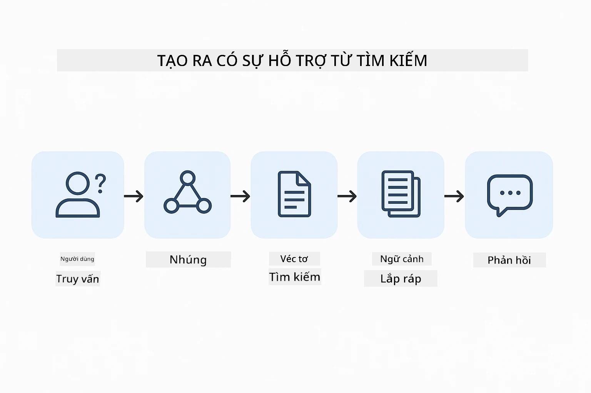
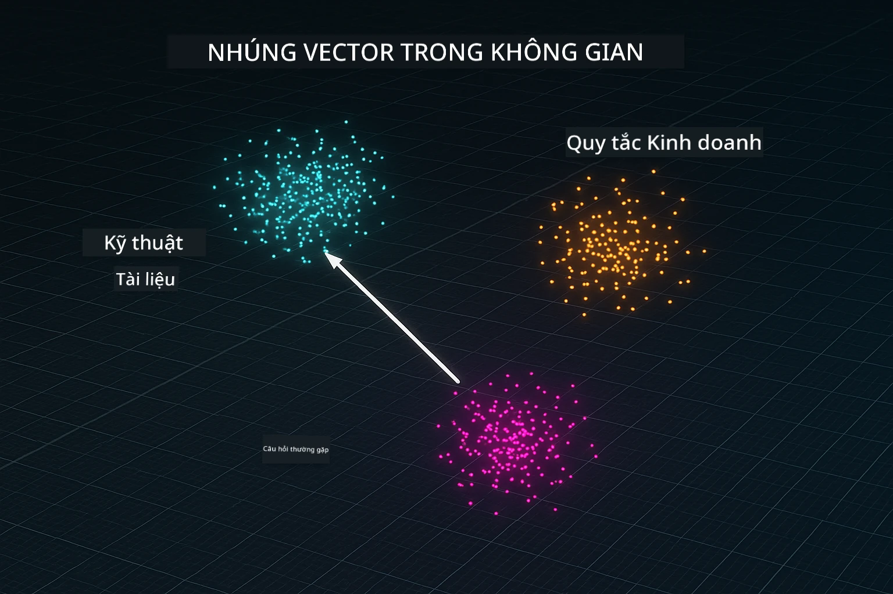
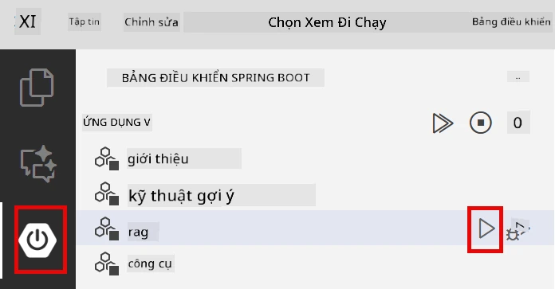
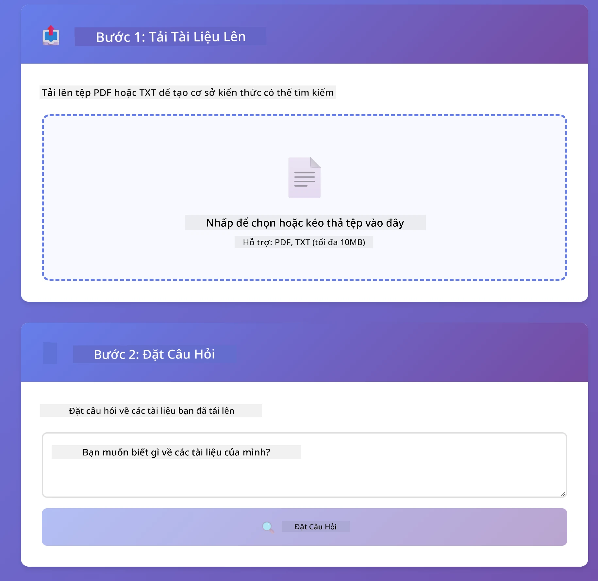
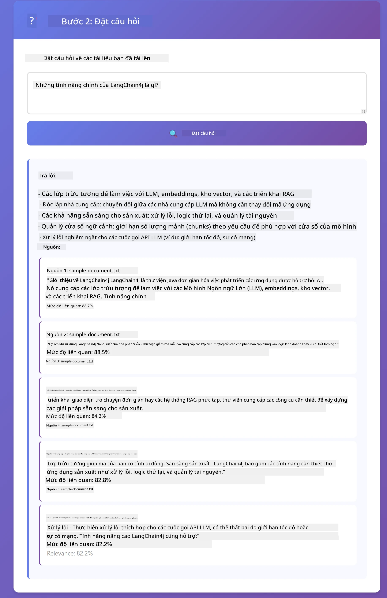

# Module 03: RAG (Tăng cường truy xuất - Retrieval-Augmented Generation)

## Mục lục

- [Video Hướng dẫn](#video-hướng-dẫn)
- [Những gì bạn sẽ học](#những-gì-bạn-sẽ-học)
- [Yêu cầu trước](#yêu-cầu-trước)
- [Hiểu về RAG](#hiểu-về-rag)
  - [Phương pháp RAG nào mà hướng dẫn này sử dụng?](#phương-pháp-rag-nào-mà-hướng-dẫn-này-sử-dụng)
- [Cách hoạt động](#cách-hoạt-động)
  - [Xử lý tài liệu](#xử-lý-tài-liệu)
  - [Tạo embedding](#tạo-embedding)
  - [Tìm kiếm ngữ nghĩa](#tìm-kiếm-ngữ-nghĩa)
  - [Tạo câu trả lời](#tạo-câu-trả-lời)
- [Chạy ứng dụng](#chạy-ứng-dụng)
- [Sử dụng ứng dụng](#sử-dụng-ứng-dụng)
  - [Tải tài liệu lên](#tải-tài-liệu-lên)
  - [Đặt câu hỏi](#đặt-câu-hỏi)
  - [Kiểm tra nguồn tham khảo](#kiểm-tra-tham-chiếu-nguồn)
  - [Thử nghiệm với các câu hỏi](#thử-nghiệm-với-các-câu-hỏi)
- [Các khái niệm chính](#các-khái-niệm-chính)
  - [Chiến lược chia đoạn](#chiến-lược-chia-chunk)
  - [Điểm tương đồng](#điểm-tương-đồng)
  - [Lưu trữ trong bộ nhớ](#lưu-trữ-trong-bộ-nhớ)
  - [Quản lý cửa sổ ngữ cảnh](#quản-lý-cửa-sổ-ngữ-cảnh)
- [Khi nào RAG quan trọng](#khi-nào-rag-quan-trọng)
- [Bước tiếp theo](#các-bước-tiếp-theo)

## Video Hướng dẫn

Xem buổi trực tiếp này giải thích cách bắt đầu với module này:

<a href="https://www.youtube.com/watch?v=_olq75ZH_eY"></a>

## Những gì bạn sẽ học

Trong các module trước, bạn đã học cách trò chuyện với AI và cấu trúc các prompt hiệu quả. Nhưng có một giới hạn cơ bản: các mô hình ngôn ngữ chỉ biết những gì chúng học trong quá trình huấn luyện. Chúng không thể trả lời các câu hỏi về chính sách công ty bạn, tài liệu dự án của bạn, hoặc bất kỳ thông tin nào mà chúng không được huấn luyện.

RAG (Tăng cường truy xuất) giải quyết vấn đề này. Thay vì cố gắng dạy mô hình thông tin của bạn (điều này tốn kém và không thực tế), bạn cho nó khả năng tìm kiếm trong các tài liệu của bạn. Khi ai đó đặt câu hỏi, hệ thống tìm thông tin liên quan và bao gồm nó vào prompt. Mô hình sau đó trả lời dựa trên ngữ cảnh đã truy xuất.

Hãy nghĩ về RAG như việc cung cấp cho mô hình một thư viện tham khảo. Khi bạn đặt câu hỏi, hệ thống:

1. **Truy vấn người dùng** - Bạn đặt câu hỏi
2. **Embedding** - Chuyển câu hỏi của bạn thành vector
3. **Tìm kiếm Vector** - Tìm các đoạn tài liệu tương tự
4. **Tập hợp ngữ cảnh** - Thêm các đoạn liên quan vào prompt
5. **Phản hồi** - LLM tạo câu trả lời dựa trên ngữ cảnh

Điều này giúp câu trả lời của mô hình dựa trên dữ liệu thật sự của bạn thay vì dựa vào kiến thức huấn luyện hoặc tự sáng tạo.

## Yêu cầu trước

- Hoàn thành [Module 01 - Giới thiệu](../01-introduction/README.md) (đã triển khai tài nguyên Azure OpenAI, bao gồm mô hình embedding `text-embedding-3-small`)
- Tệp `.env` trong thư mục gốc có thông tin xác thực Azure (được tạo bởi lệnh `azd up` trong Module 01)

> **Lưu ý:** Nếu bạn chưa hoàn thành Module 01, hãy làm theo hướng dẫn triển khai ở đó trước. Lệnh `azd up` sẽ triển khai cả mô hình chat GPT và mô hình embedding được sử dụng trong module này.

## Hiểu về RAG

Sơ đồ dưới đây minh họa khái niệm chính: thay vì chỉ dựa vào dữ liệu huấn luyện của mô hình, RAG cung cấp cho nó một thư viện tham khảo các tài liệu của bạn để tham khảo trước khi tạo câu trả lời.


*Sơ đồ này cho thấy sự khác biệt giữa một LLM tiêu chuẩn (phán đoán dựa trên dữ liệu huấn luyện) và một LLM được tăng cường RAG (tham khảo tài liệu của bạn trước).*

Dưới đây là cách các phần kết nối từ đầu đến cuối. Câu hỏi của người dùng trải qua bốn giai đoạn — embedding, tìm kiếm vector, tập hợp ngữ cảnh và tạo câu trả lời — mỗi giai đoạn xây dựng trên cái trước:



*Sơ đồ này minh họa đường dây RAG từ đầu đến cuối — truy vấn người dùng đi qua embedding, tìm kiếm vector, tập hợp ngữ cảnh và tạo câu trả lời.*

Phần còn lại của module sẽ đi qua từng giai đoạn chi tiết, với mã bạn có thể chạy và sửa đổi.

### Phương pháp RAG nào mà hướng dẫn này sử dụng?

LangChain4j cung cấp ba cách để triển khai RAG, mỗi cách với mức độ trừu tượng khác nhau. Sơ đồ dưới đây so sánh các cách đó:


*Sơ đồ này so sánh ba cách tiếp cận RAG của LangChain4j — Easy, Native, và Advanced — với các thành phần chính và thời điểm sử dụng mỗi cách.*

| Phương pháp | Chức năng | Đánh đổi |
|---|---|---|
| **Easy RAG** | Tự động kết nối mọi thứ qua `AiServices` và `ContentRetriever`. Bạn chỉ cần chú thích một interface, gắn một retriever, LangChain4j sẽ xử lý embedding, tìm kiếm và tập hợp prompt phía sau. | Ít mã, nhưng bạn không nhìn thấy từng bước diễn ra như thế nào. |
| **Native RAG** | Bạn tự gọi mô hình embedding, tìm kiếm trong kho lưu trữ, xây dựng prompt và tạo câu trả lời — từng bước rõ ràng. | Mã nhiều hơn nhưng bạn thấy và có thể sửa đổi từng giai đoạn. |
| **Advanced RAG** | Sử dụng framework `RetrievalAugmentor` với các bộ biến đổi truy vấn, bộ định tuyến, bộ xếp lại, và bộ chèn nội dung có thể cắm cho pipeline chuẩn sản xuất. | Linh hoạt tối đa, nhưng phức tạp nhiều hơn. |

**Hướng dẫn này sử dụng phương pháp Native.** Mỗi bước trong pipeline RAG — embedding truy vấn, tìm kiếm trong kho vector, tập hợp ngữ cảnh và tạo câu trả lời — được viết rõ ràng trong [`RagService.java`](../../../03-rag/src/main/java/com/example/langchain4j/rag/service/RagService.java). Việc này là có chủ đích: như một tài nguyên học tập, quan trọng hơn là bạn thấy và hiểu từng giai đoạn thay vì code được tối giản. Khi bạn quen thuộc cách các phần khớp nhau, bạn có thể chuyển sang Easy RAG để tạo mẫu nhanh hoặc Advanced RAG cho hệ thống sản xuất.

> **💡 Tò mò về Easy RAG?** LangChain4j cũng cung cấp cách *Easy RAG* nơi `AiServices` và một `ContentRetriever` tự động xử lý embedding, tìm kiếm, và tập hợp prompt. Module này chọn con đường rõ ràng hơn — mở từng bước trong pipeline để bạn có thể xem và kiểm soát từng giai đoạn.

Sơ đồ dưới đây cho thấy pipeline Easy RAG. Bạn thấy `AiServices` và `EmbeddingStoreContentRetriever` ẩn toàn bộ sự phức tạp — bạn tải tài liệu, gắn một retriever và nhận câu trả lời. Phương pháp Native trong module này mở từng bước ẩn đó:


*Sơ đồ này minh họa pipeline Easy RAG. So sánh với phương pháp Native được dùng trong module: Easy RAG ẩn embedding, truy xuất và tập hợp prompt bên trong `AiServices` và `ContentRetriever` — bạn tải tài liệu, gắn retriever và nhận câu trả lời. Native mở pipeline đó để bạn tự gọi từng bước (embedding, tìm kiếm, tập hợp ngữ cảnh, tạo) cho phép bạn quan sát và kiểm soát đầy đủ.*

## Cách hoạt động

Pipeline RAG trong module này chia thành bốn giai đoạn chạy tuần tự mỗi khi người dùng đặt câu hỏi. Đầu tiên, tài liệu được tải lên sẽ **được phân tích và chia đoạn nhỏ** thành những phần dễ quản lý. Những đoạn này sau đó được chuyển thành **vector embedding** và lưu trữ để có thể so sánh toán học. Khi có truy vấn, hệ thống thực hiện **tìm kiếm ngữ nghĩa** để tìm các đoạn phù hợp nhất, rồi cuối cùng truyền chúng làm ngữ cảnh cho LLM để **tạo câu trả lời**. Các phần dưới đây sẽ đi qua từng giai đoạn với mã thực và sơ đồ. Hãy xem bước đầu tiên.

### Xử lý tài liệu

[DocumentService.java](../../../03-rag/src/main/java/com/example/langchain4j/rag/service/DocumentService.java)

Khi bạn tải lên một tài liệu, hệ thống sẽ phân tích nó (PDF hoặc văn bản thuần), gán các siêu dữ liệu như tên tệp, rồi chia nó thành các đoạn nhỏ — những phần nhỏ vừa vặn trong cửa sổ ngữ cảnh của mô hình. Các đoạn này chồng lấn nhẹ để không mất bối cảnh ở ranh giới.

```java
// Phân tích tệp đã tải lên và bao bọc nó trong một Tài liệu LangChain4j
Document document = Document.from(content, metadata);

// Chia thành các đoạn 300 token với chồng lặp 30 token
DocumentSplitter splitter = DocumentSplitters
    .recursive(300, 30);

List<TextSegment> segments = splitter.split(document);
```

Sơ đồ dưới đây minh họa trực quan cách hoạt động này. Bạn thấy mỗi đoạn chia sẻ một số token với đoạn liền kề — sự chồng lấn 30-token đảm bảo không mất thông tin quan trọng tại ranh giới:


*Sơ đồ này cho thấy một tài liệu được chia thành các đoạn 300-token với 30-token chồng lấn, giữ nguyên ngữ cảnh ở biên giới đoạn.*

> **🤖 Thử với [GitHub Copilot](https://github.com/features/copilot) Chat:** Mở [`DocumentService.java`](../../../03-rag/src/main/java/com/example/langchain4j/rag/service/DocumentService.java) và hỏi:
> - "LangChain4j chia tài liệu thành các đoạn thế nào và tại sao chồng token lại quan trọng?"
> - "Kích thước đoạn tối ưu cho các loại tài liệu khác nhau là bao nhiêu và vì sao?"
> - "Làm sao xử lý tài liệu đa ngôn ngữ hoặc có định dạng đặc biệt?"

### Tạo embedding

[LangChainRagConfig.java](../../../03-rag/src/main/java/com/example/langchain4j/rag/config/LangChainRagConfig.java)

Mỗi đoạn được chuyển đổi thành một đại diện số gọi là embedding — về cơ bản là một bộ chuyển đổi ý nghĩa sang số. Mô hình embedding không "thông minh" như mô hình chat; nó không thể theo chỉ dẫn, suy luận, hoặc trả lời câu hỏi. Điều nó làm được là ánh xạ văn bản vào không gian toán học nơi các ý nghĩa tương tự đặt gần nhau — "car" gần "automobile," "refund policy" gần "return my money." Nghĩ mô hình chat như một người để bạn trò chuyện; mô hình embedding là hệ thống phân loại siêu hiệu quả.

Sơ đồ dưới đây minh họa khái niệm này — văn bản đi vào, véc-tơ số đi ra, và các ý nghĩa tương tự tạo ra các véc-tơ gần nhau:


*Sơ đồ này cho thấy cách mô hình embedding chuyển văn bản thành véc-tơ số, đặt các ý nghĩa tương tự — như "car" và "automobile" — gần nhau trong không gian véc-tơ.*

```java
@Bean
public EmbeddingModel embeddingModel() {
    return OpenAiOfficialEmbeddingModel.builder()
        .baseUrl(azureOpenAiEndpoint)
        .apiKey(azureOpenAiKey)
        .modelName(azureEmbeddingDeploymentName)
        .build();
}

EmbeddingStore<TextSegment> embeddingStore = 
    new InMemoryEmbeddingStore<>();
```

Sơ đồ lớp dưới đây hiển thị hai luồng riêng biệt trong pipeline RAG và các lớp LangChain4j triển khai chúng. Luồng **nhập liệu** (chạy một lần khi tải lên) chia tài liệu, tạo embedding cho đoạn và lưu trữ qua `.addAll()`. Luồng **truy vấn** (chạy mỗi lần người dùng hỏi) tạo embedding cho câu hỏi, tìm kiếm trong kho qua `.search()`, và truyền ngữ cảnh phù hợp đến mô hình chat. Hai luồng được kết nối tại giao diện chung `EmbeddingStore<TextSegment>`:


*Sơ đồ này cho thấy hai luồng trong pipeline RAG — nhập liệu và truy vấn — và cách chúng kết nối qua một EmbeddingStore chung.*

Khi embedding được lưu, các nội dung tương tự tự nhiên sẽ tụ lại gần nhau trong không gian véc-tơ. Hình minh họa dưới đây cho thấy các tài liệu về chủ đề liên quan tụ lại thành các điểm gần nhau, điều này làm cho tìm kiếm ngữ nghĩa khả thi:



*Hình minh họa này cho thấy cách các tài liệu liên quan tụ lại cùng nhau trong không gian véc-tơ 3 chiều, với các chủ đề như Tài liệu Kỹ thuật, Quy định Kinh doanh, và FAQ tạo thành các nhóm riêng biệt.*

Khi người dùng tìm kiếm, hệ thống thực hiện bốn bước: tạo embedding cho tài liệu một lần, tạo embedding cho truy vấn mỗi lần tìm kiếm, so sánh véc-tơ truy vấn với tất cả véc-tơ đã lưu bằng độ tương đồng cosine và trả về top-K đoạn có điểm cao nhất. Sơ đồ dưới đây minh họa từng bước và các lớp LangChain4j liên quan:


*Sơ đồ này minh họa quá trình tìm kiếm embedding gồm bốn bước: tạo embedding tài liệu, tạo embedding truy vấn, so sánh véc-tơ bằng độ tương đồng cosine, và trả về kết quả top-K.*

### Tìm kiếm ngữ nghĩa

[RagService.java](../../../03-rag/src/main/java/com/example/langchain4j/rag/service/RagService.java)

Khi bạn đặt câu hỏi, câu hỏi cũng được chuyển thành embedding. Hệ thống so sánh embedding câu hỏi với embedding của các đoạn tài liệu. Nó tìm các đoạn có ý nghĩa tương tự nhất — không chỉ khớp từ khóa mà là sự tương đồng về ngữ nghĩa thật sự.

```java
Embedding queryEmbedding = embeddingModel.embed(question).content();

EmbeddingSearchRequest searchRequest = EmbeddingSearchRequest.builder()
    .queryEmbedding(queryEmbedding)
    .maxResults(5)
    .minScore(0.5)
    .build();

EmbeddingSearchResult<TextSegment> searchResult = embeddingStore.search(searchRequest);
List<EmbeddingMatch<TextSegment>> matches = searchResult.matches();

for (EmbeddingMatch<TextSegment> match : matches) {
    String relevantText = match.embedded().text();
    double score = match.score();
}
```

Sơ đồ dưới đây so sánh tìm kiếm ngữ nghĩa với tìm kiếm từ khóa truyền thống. Tìm kiếm từ khóa cho "vehicle" bỏ qua một đoạn về "cars and trucks," nhưng tìm kiếm ngữ nghĩa hiểu chúng cùng nghĩa và trả về đoạn đó với điểm cao:


*Sơ đồ này so sánh tìm kiếm dựa trên từ khóa với tìm kiếm ngữ nghĩa, cho thấy cách tìm kiếm ngữ nghĩa truy xuất nội dung liên quan về mặt khái niệm ngay cả khi từ khóa chính xác khác nhau.*

Bên trong, độ tương đồng được đo bằng cosine similarity — cơ bản là hỏi "hai mũi tên này có chỉ về cùng hướng không?" Hai đoạn có thể dùng từ hoàn toàn khác nhưng nếu nghĩa giống nhau thì véc-tơ chỉ cùng hướng và điểm gần bằng 1.0:


*Biểu đồ này minh họa độ tương đồng cosine như góc giữa các vector embedding — các vector càng căn chỉnh gần nhau hơn thì điểm số càng gần 1.0, chỉ ra sự tương đồng ngữ nghĩa cao hơn.*

> **🤖 Thử với [GitHub Copilot](https://github.com/features/copilot) Chat:** Mở [`RagService.java`](../../../03-rag/src/main/java/com/example/langchain4j/rag/service/RagService.java) và hỏi:
> - "Tìm kiếm sự tương đồng hoạt động như thế nào với embeddings và điều gì quyết định điểm số?"
> - "Ngưỡng tương đồng nên sử dụng là bao nhiêu và nó ảnh hưởng thế nào đến kết quả?"
> - "Làm thế nào để xử lý trường hợp không tìm thấy tài liệu liên quan?"

### Tạo Câu Trả Lời

[RagService.java](../../../03-rag/src/main/java/com/example/langchain4j/rag/service/RagService.java)

Các đoạn chunk liên quan nhất được tập hợp thành một prompt cấu trúc bao gồm hướng dẫn rõ ràng, ngữ cảnh được truy xuất và câu hỏi của người dùng. Mô hình đọc các đoạn chunk cụ thể đó và trả lời dựa trên thông tin đó — nó chỉ có thể sử dụng những gì hiện diện trước mặt, điều này ngăn ngừa việc tưởng tượng ra thông tin không có thật.

```java
String context = matches.stream()
    .map(match -> match.embedded().text())
    .collect(Collectors.joining("\n\n"));

String prompt = String.format("""
    Answer the question based on the following context.
    If the answer cannot be found in the context, say so.

    Context:
    %s

    Question: %s

    Answer:""", context, request.question());

String answer = chatModel.chat(prompt);
```

Biểu đồ dưới đây cho thấy cách tập hợp này hoạt động — các đoạn chunk có điểm cao nhất từ bước tìm kiếm được chèn vào mẫu prompt, và `OpenAiOfficialChatModel` tạo ra câu trả lời có cơ sở:


*Biểu đồ này cho thấy cách các đoạn chunk có điểm cao nhất được tập hợp thành một prompt cấu trúc, cho phép mô hình tạo câu trả lời dựa trên dữ liệu của bạn.*

## Chạy Ứng Dụng

**Xác nhận việc triển khai:**

Đảm bảo file `.env` tồn tại ở thư mục gốc với thông tin Azure credentials (đã tạo trong Module 01). Chạy lệnh này từ thư mục module (`03-rag/`):

**Bash:**
```bash
cat ../.env  # Nên hiển thị AZURE_OPENAI_ENDPOINT, API_KEY, DEPLOYMENT
```

**PowerShell:**
```powershell
Get-Content ..\.env  # Nên hiển thị AZURE_OPENAI_ENDPOINT, API_KEY, DEPLOYMENT
```

**Khởi động ứng dụng:**

> **Lưu ý:** Nếu bạn đã khởi động tất cả ứng dụng dùng lệnh `./start-all.sh` từ thư mục gốc (theo mô tả trong Module 01), module này đã chạy trên cổng 8081. Bạn có thể bỏ qua các lệnh khởi động dưới đây và truy cập trực tiếp http://localhost:8081.

**Lựa chọn 1: Sử dụng Spring Boot Dashboard (Khuyến nghị cho người dùng VS Code)**

Dev container bao gồm tiện ích mở rộng Spring Boot Dashboard, cung cấp giao diện trực quan để quản lý tất cả ứng dụng Spring Boot. Bạn có thể tìm thấy nó ở Thanh Hoạt Động bên trái VS Code (tìm biểu tượng Spring Boot).

Từ Spring Boot Dashboard, bạn có thể:
- Xem tất cả ứng dụng Spring Boot có trong workspace
- Khởi động/dừng ứng dụng chỉ với một cú nhấp
- Xem nhật ký ứng dụng thời gian thực
- Giám sát trạng thái ứng dụng

Chỉ cần nhấn nút play bên cạnh "rag" để khởi động module này, hoặc khởi động tất cả module cùng lúc.



*Ảnh chụp màn hình này hiển thị Spring Boot Dashboard trong VS Code, nơi bạn có thể khởi động, dừng và giám sát ứng dụng một cách trực quan.*

**Lựa chọn 2: Dùng shell scripts**

Khởi động tất cả ứng dụng web (module 01-04):

**Bash:**
```bash
cd ..  # Từ thư mục gốc
./start-all.sh
```

**PowerShell:**
```powershell
cd ..  # Từ thư mục gốc
.\start-all.ps1
```

Hoặc chỉ khởi động module này:

**Bash:**
```bash
cd 03-rag
./start.sh
```

**PowerShell:**
```powershell
cd 03-rag
.\start.ps1
```

Cả hai script tự động tải biến môi trường từ file `.env` ở thư mục gốc và sẽ xây dựng file JAR nếu chúng chưa tồn tại.

> **Lưu ý:** Nếu bạn muốn tự xây dựng tất cả module thủ công trước khi khởi động:
>
> **Bash:**
> ```bash
> cd ..  # Go to root directory
> mvn clean package -DskipTests
> ```
>
> **PowerShell:**
> ```powershell
> cd ..  # Go to root directory
> mvn clean package -DskipTests
> ```

Mở http://localhost:8081 trên trình duyệt của bạn.

**Để dừng:**

**Bash:**
```bash
./stop.sh  # Chỉ mô-đun này
# Hoặc
cd .. && ./stop-all.sh  # Tất cả các mô-đun
```

**PowerShell:**
```powershell
.\stop.ps1  # Chỉ mô-đun này
# Hoặc
cd ..; .\stop-all.ps1  # Tất cả các mô-đun
```

## Sử Dụng Ứng Dụng

Ứng dụng cung cấp giao diện web để tải tài liệu lên và đặt câu hỏi.

<a href="images/rag-homepage.png"></a>

*Ảnh chụp màn hình giao diện ứng dụng RAG, nơi bạn tải tài liệu lên và hỏi câu hỏi.*

### Tải Tài Liệu Lên

Bắt đầu bằng cách tải lên một tài liệu - các file TXT hoạt động tốt nhất để thử nghiệm. Một file `sample-document.txt` có sẵn trong thư mục này chứa thông tin về các tính năng của LangChain4j, triển khai RAG, và các thực hành tốt nhất - rất phù hợp để thử nghiệm hệ thống.

Hệ thống sẽ xử lý tài liệu của bạn, chia nhỏ nó thành các đoạn chunk và tạo embeddings cho mỗi chunk. Việc này xảy ra tự động khi bạn tải lên.

### Đặt Câu Hỏi

Giờ hãy đặt những câu hỏi cụ thể về nội dung tài liệu. Thử các câu hỏi thực tế rõ ràng trong tài liệu. Hệ thống sẽ tìm các đoạn chunk liên quan, đưa chúng vào prompt, và tạo câu trả lời.

### Kiểm Tra Tham Chiếu Nguồn

Lưu ý mỗi câu trả lời đều bao gồm các tham chiếu nguồn với điểm tương đồng. Những điểm số này (từ 0 đến 1) cho thấy mức độ liên quan của từng đoạn chunk với câu hỏi của bạn. Điểm cao hơn nghĩa là phù hợp hơn. Điều này giúp bạn xác minh câu trả lời dựa trên tài liệu gốc.

<a href="images/rag-query-results.png"></a>

*Ảnh chụp màn hình kết quả truy vấn với câu trả lời được tạo, tham chiếu nguồn, và điểm liên quan cho từng đoạn chunk được truy xuất.*

### Thử Nghiệm Với Các Câu Hỏi

Thử các loại câu hỏi khác nhau:
- Thông tin cụ thể: "Chủ đề chính là gì?"
- So sánh: "Sự khác biệt giữa X và Y là gì?"
- Tóm tắt: "Tóm tắt các điểm chính về Z"

Quan sát cách điểm liên quan thay đổi dựa trên mức độ phù hợp của câu hỏi với nội dung tài liệu.

## Các Khái Niệm Chính

### Chiến Lược Chia Chunk

Tài liệu được chia thành các đoạn chunk 300 token với 30 token chồng lấn. Cách chia này đảm bảo mỗi chunk có đủ ngữ cảnh để có ý nghĩa trong khi vẫn đủ nhỏ để có thể gồm nhiều chunk trong một prompt.

### Điểm Tương Đồng

Mỗi đoạn chunk được truy xuất kèm theo điểm tương đồng từ 0 đến 1 thể hiện mức độ phù hợp với câu hỏi người dùng. Biểu đồ dưới đây trực quan hóa các phạm vi điểm và cách hệ thống sử dụng chúng để lọc kết quả:


*Biểu đồ này hiển thị phạm vi điểm từ 0 đến 1, với ngưỡng tối thiểu 0.5 để lọc các đoạn chunk không liên quan.*

Điểm số dao động từ 0 đến 1:
- 0.7-1.0: Rất liên quan, khớp chính xác
- 0.5-0.7: Liên quan, có ngữ cảnh tốt
- Dưới 0.5: Bị lọc bỏ, quá khác biệt

Hệ thống chỉ truy xuất các đoạn chunk có điểm trên ngưỡng tối thiểu để đảm bảo chất lượng.

Embeddings hoạt động hiệu quả khi các nghĩa được nhóm rõ ràng, nhưng chúng cũng có điểm mù. Biểu đồ dưới đây cho thấy các chế độ lỗi phổ biến — các đoạn chunk quá lớn tạo vector mơ hồ, các đoạn chunk quá nhỏ thiếu ngữ cảnh, các thuật ngữ mơ hồ chỉ tới nhiều cluster khác nhau, và các tra cứu khớp chính xác (ID, số bộ phận) không hoạt động với embeddings:


*Biểu đồ này cho thấy các chế độ lỗi embedding phổ biến: chunk quá lớn, chunk quá nhỏ, thuật ngữ mơ hồ chỉ đến nhiều cluster, và các tra cứu khớp chính xác như ID.*

### Lưu Trữ Trong Bộ Nhớ

Module này sử dụng lưu trữ trong bộ nhớ để đơn giản hóa. Khi bạn khởi động lại ứng dụng, các tài liệu đã tải lên sẽ mất. Hệ thống thực tế sử dụng cơ sở dữ liệu vector bền vững như Qdrant hoặc Azure AI Search.

### Quản Lý Cửa Sổ Ngữ Cảnh

Mỗi mô hình có một cửa sổ ngữ cảnh tối đa. Bạn không thể đưa mọi đoạn chunk từ một tài liệu lớn vào. Hệ thống truy xuất N đoạn chunk có liên quan nhất (mặc định là 5) để nằm trong giới hạn và cung cấp đủ ngữ cảnh cho câu trả lời chính xác.

## Khi Nào RAG Quan Trọng

RAG không phải lúc nào cũng là phương án phù hợp. Hướng dẫn quyết định dưới đây giúp bạn xác định khi nào RAG mang lại giá trị so với khi các phương pháp đơn giản hơn — như đưa nội dung trực tiếp vào prompt hoặc dựa vào kiến thức tích hợp của mô hình — là đủ:


*Biểu đồ này cho thấy hướng dẫn quyết định khi nào RAG mang lại giá trị so với khi các phương pháp đơn giản hơn là đủ.*

## Các Bước Tiếp Theo

**Module tiếp theo:** [04-tools - Các đại lý AI với Công cụ](../04-tools/README.md)

---

**Điều hướng:** [← Trước: Module 02 - Kỹ Thuật Prompt](../02-prompt-engineering/README.md) | [Quay lại Trang Chính](../README.md) | [Tiếp: Module 04 - Công Cụ →](../04-tools/README.md)

---

<!-- CO-OP TRANSLATOR DISCLAIMER START -->
**Tuyên bố miễn trừ trách nhiệm**:
Tài liệu này đã được dịch bằng dịch vụ dịch thuật AI [Co-op Translator](https://github.com/Azure/co-op-translator). Mặc dù chúng tôi cố gắng đảm bảo độ chính xác, xin lưu ý rằng bản dịch tự động có thể chứa lỗi hoặc sai sót. Tài liệu gốc bằng ngôn ngữ gốc nên được coi là nguồn tin chính thức. Đối với thông tin quan trọng, nên sử dụng dịch vụ dịch thuật chuyên nghiệp bởi con người. Chúng tôi không chịu trách nhiệm về bất kỳ hiểu lầm hoặc giải thích sai nào phát sinh từ việc sử dụng bản dịch này.
<!-- CO-OP TRANSLATOR DISCLAIMER END -->