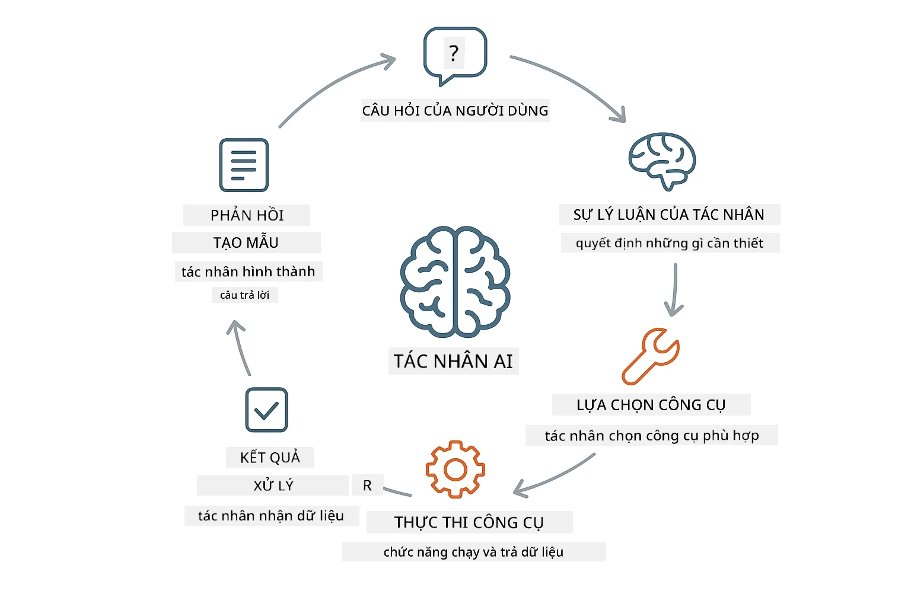
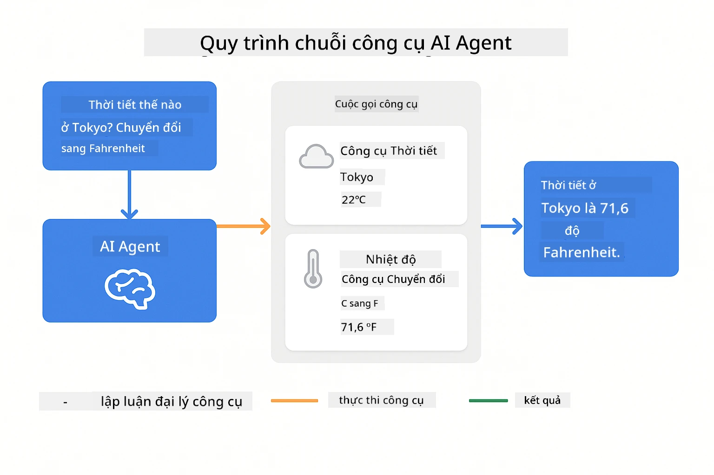
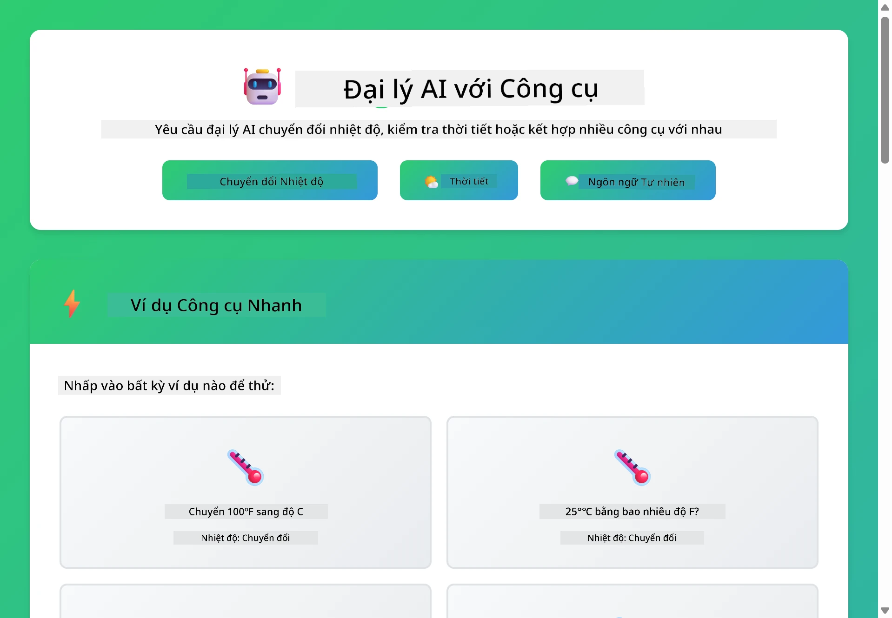

<!--
CO_OP_TRANSLATOR_METADATA:
{
  "original_hash": "844788938b26242f3cc54ce0d0951bea",
  "translation_date": "2026-01-06T00:16:53+00:00",
  "source_file": "04-tools/README.md",
  "language_code": "vi"
}
-->
# Module 04: Đại lý AI với Công cụ

## Mục lục

- [Bạn sẽ học được gì](../../../04-tools)
- [Yêu cầu trước](../../../04-tools)
- [Hiểu về Đại lý AI với Công cụ](../../../04-tools)
- [Cách gọi công cụ hoạt động](../../../04-tools)
  - [Định nghĩa công cụ](../../../04-tools)
  - [Ra quyết định](../../../04-tools)
  - [Thực thi](../../../04-tools)
  - [Tạo phản hồi](../../../04-tools)
- [Chuỗi công cụ](../../../04-tools)
- [Chạy ứng dụng](../../../04-tools)
- [Sử dụng ứng dụng](../../../04-tools)
  - [Thử sử dụng công cụ đơn giản](../../../04-tools)
  - [Kiểm tra chuỗi công cụ](../../../04-tools)
  - [Xem luồng hội thoại](../../../04-tools)
  - [Thí nghiệm với các yêu cầu khác nhau](../../../04-tools)
- [Khái niệm chính](../../../04-tools)
  - [Mẫu ReAct (Lý luận và Hành động)](../../../04-tools)
  - [Mô tả công cụ quan trọng](../../../04-tools)
  - [Quản lý phiên làm việc](../../../04-tools)
  - [Xử lý lỗi](../../../04-tools)
- [Các công cụ có sẵn](../../../04-tools)
- [Khi nào dùng đại lý dựa trên công cụ](../../../04-tools)
- [Bước tiếp theo](../../../04-tools)

## Bạn sẽ học được gì

Cho đến nay, bạn đã học cách trò chuyện với AI, cấu trúc lời nhắc hiệu quả, và dựa phản hồi trên tài liệu của bạn. Nhưng vẫn còn một hạn chế căn bản: các mô hình ngôn ngữ chỉ tạo ra văn bản. Chúng không thể kiểm tra thời tiết, thực hiện tính toán, truy vấn cơ sở dữ liệu hoặc tương tác với hệ thống bên ngoài.

Công cụ thay đổi điều này. Bằng cách cho mô hình quyền truy cập vào các hàm mà nó có thể gọi, bạn biến nó từ một trình tạo văn bản thành một đại lý có thể thực hiện hành động. Mô hình quyết định khi nào nó cần công cụ, công cụ nào để dùng, và tham số nào cần truyền. Mã của bạn thực thi hàm và trả về kết quả. Mô hình tích hợp kết quả đó vào phản hồi của nó.

## Yêu cầu trước

- Hoàn thành Module 01 (đã triển khai tài nguyên Azure OpenAI)
- Tập tin `.env` trong thư mục gốc có thông tin xác thực Azure (được tạo bởi `azd up` trong Module 01)

> **Lưu ý:** Nếu bạn chưa hoàn thành Module 01, hãy làm theo hướng dẫn triển khai ở đó trước.

## Hiểu về Đại lý AI với Công cụ

> **📝 Lưu ý:** Thuật ngữ "đại lý" trong module này chỉ trợ lý AI được tăng cường với khả năng gọi công cụ. Điều này khác với các mẫu **Agentic AI** (đại lý tự động với lập kế hoạch, bộ nhớ và lý luận đa bước) mà chúng ta sẽ đề cập trong [Module 05: MCP](../05-mcp/README.md).

Một đại lý AI với công cụ tuân theo mẫu lý luận và hành động (ReAct):

1. Người dùng hỏi một câu hỏi
2. Đại lý suy luận về những gì cần biết
3. Đại lý quyết định có cần công cụ để trả lời không
4. Nếu có, đại lý gọi công cụ phù hợp với tham số đúng
5. Công cụ thực thi và trả về dữ liệu
6. Đại lý tích hợp kết quả và cung cấp câu trả lời cuối cùng



*Mẫu ReAct - cách các đại lý AI xen kẽ giữa suy luận và hành động để giải quyết vấn đề*

Điều này diễn ra tự động. Bạn định nghĩa các công cụ và mô tả của chúng. Mô hình chịu trách nhiệm quyết định khi nào và cách sử dụng.

## Cách gọi công cụ hoạt động

### Định nghĩa công cụ

[WeatherTool.java](../../../04-tools/src/main/java/com/example/langchain4j/agents/tools/WeatherTool.java) | [TemperatureTool.java](../../../04-tools/src/main/java/com/example/langchain4j/agents/tools/TemperatureTool.java)

Bạn định nghĩa các hàm với mô tả rõ ràng và thông số cụ thể. Mô hình nhìn thấy những mô tả này trong lời nhắc hệ thống và hiểu được chức năng của mỗi công cụ.

```java
@Component
public class WeatherTool {
    
    @Tool("Get the current weather for a location")
    public String getCurrentWeather(@P("Location name") String location) {
        // Logic tra cứu thời tiết của bạn
        return "Weather in " + location + ": 22°C, cloudy";
    }
}

@AiService
public interface Assistant {
    String chat(@MemoryId String sessionId, @UserMessage String message);
}

// Trợ lý được Spring Boot tự động kết nối với:
// - Bean ChatModel
// - Tất cả các phương thức @Tool từ các lớp @Component
// - ChatMemoryProvider để quản lý phiên làm việc
```

> **🤖 Thử với [GitHub Copilot](https://github.com/features/copilot) Chat:** Mở [`WeatherTool.java`](../../../04-tools/src/main/java/com/example/langchain4j/agents/tools/WeatherTool.java) và hỏi:
> - "Làm thế nào để tôi tích hợp API thời tiết thực tế như OpenWeatherMap thay vì dữ liệu giả?"
> - "Điều gì tạo nên một mô tả công cụ hiệu quả giúp AI sử dụng đúng?"
> - "Làm sao để tôi xử lý lỗi API và giới hạn tốc độ trong các triển khai công cụ?"

### Ra quyết định

Khi người dùng hỏi "Thời tiết ở Seattle thế nào?", mô hình nhận ra nó cần công cụ thời tiết. Nó tạo ra một cuộc gọi hàm với tham số location đặt là "Seattle".

### Thực thi

[AgentService.java](../../../04-tools/src/main/java/com/example/langchain4j/agents/service/AgentService.java)

Spring Boot tự động kết nối giao diện khai báo `@AiService` với tất cả công cụ đã đăng ký, và LangChain4j thực hiện các cuộc gọi công cụ tự động.

> **🤖 Thử với [GitHub Copilot](https://github.com/features/copilot) Chat:** Mở [`AgentService.java`](../../../04-tools/src/main/java/com/example/langchain4j/agents/service/AgentService.java) và hỏi:
> - "Mẫu ReAct hoạt động như thế nào và tại sao nó hiệu quả với đại lý AI?"
> - "Làm sao đại lý quyết định dùng công cụ nào và theo thứ tự ra sao?"
> - "Nếu thực thi công cụ thất bại - tôi nên xử lý lỗi ra sao một cách bền vững?"

### Tạo phản hồi

Mô hình nhận dữ liệu thời tiết và định dạng thành câu trả lời tự nhiên cho người dùng.

### Tại sao dùng Dịch vụ AI khai báo?

Module này dùng tích hợp Spring Boot của LangChain4j với các giao diện khai báo `@AiService`:

- **Spring Boot tự động kết nối** - ChatModel và công cụ được tiêm tự động
- **Mẫu @MemoryId** - Quản lý bộ nhớ dựa trên phiên tự động
- **Một thể hiện duy nhất** - Trợ lý được tạo một lần và tái sử dụng cho hiệu suất tốt hơn
- **Thực thi an toàn kiểu** - Gọi trực tiếp các phương thức Java với chuyển đổi kiểu
- **Điều phối đa lượt** - Tự động xử lý chuỗi công cụ
- **Không boilerplate** - Không cần gọi thủ công AiServices.builder() hay map bộ nhớ

Các cách khác (thủ công với AiServices.builder()) tốn nhiều mã hơn và không có lợi ích tích hợp Spring Boot.

## Chuỗi công cụ

**Chuỗi công cụ** - AI có thể gọi nhiều công cụ nối tiếp. Hỏi "Thời tiết ở Seattle thế nào và tôi có nên mang ô không?" và hãy xem nó nối `getCurrentWeather` với suy luận về vật dụng mưa.

<a href="images/tool-chaining.png"></a>

*Các cuộc gọi công cụ theo trình tự - đầu ra của công cụ này cung cấp thông tin cho quyết định tiếp theo*

**Thất bại mềm mại** - Hỏi thời tiết ở một thành phố không có trong dữ liệu giả. Công cụ trả về thông báo lỗi, và AI giải thích nó không giúp được. Công cụ thất bại an toàn.

Điều này diễn ra trong một lượt hội thoại duy nhất. Đại lý điều phối nhiều cuộc gọi công cụ tự động.

## Chạy ứng dụng

**Xác nhận triển khai:**

Đảm bảo tập tin `.env` có trong thư mục gốc với thông tin xác thực Azure (tạo trong Module 01):
```bash
cat ../.env  # Nên hiển thị AZURE_OPENAI_ENDPOINT, API_KEY, DEPLOYMENT
```

**Khởi động ứng dụng:**

> **Lưu ý:** Nếu bạn đã khởi động tất cả ứng dụng bằng `./start-all.sh` từ Module 01, module này đã chạy trên cổng 8084. Bạn có thể bỏ qua lệnh khởi động bên dưới và truy cập trực tiếp http://localhost:8084.

**Tùy chọn 1: Dùng Spring Boot Dashboard (Khuyến nghị cho người dùng VS Code)**

Dev container có extension Spring Boot Dashboard, cung cấp giao diện trực quan quản lý tất cả ứng dụng Spring Boot. Bạn có thể tìm nó ở thanh hoạt động bên trái của VS Code (biểu tượng Spring Boot).

Từ Spring Boot Dashboard, bạn có thể:
- Xem tất cả ứng dụng Spring Boot có trong workspace
- Khởi động/dừng ứng dụng chỉ với một cú click
- Xem log ứng dụng theo thời gian thực
- Giám sát trạng thái ứng dụng

Chỉ cần bấm nút chạy cạnh "tools" để khởi động module này, hoặc khởi động tất cả modules cùng lúc.


**Tùy chọn 2: Dùng script shell**

Khởi động tất cả ứng dụng web (modules 01-04):

**Bash:**
```bash
cd ..  # Từ thư mục gốc
./start-all.sh
```

**PowerShell:**
```powershell
cd ..  # Từ thư mục gốc
.\start-all.ps1
```

Hoặc chỉ khởi động module này:

**Bash:**
```bash
cd 04-tools
./start.sh
```

**PowerShell:**
```powershell
cd 04-tools
.\start.ps1
```

Cả hai script tự động tải biến môi trường từ tập tin `.env` gốc và sẽ build các JAR nếu chưa tồn tại.

> **Lưu ý:** Nếu bạn muốn build tất cả modules thủ công trước khi khởi động:
>
> **Bash:**
> ```bash
> cd ..  # Go to root directory
> mvn clean package -DskipTests
> ```
>
> **PowerShell:**
> ```powershell
> cd ..  # Go to root directory
> mvn clean package -DskipTests
> ```

Mở http://localhost:8084 trong trình duyệt của bạn.

**Để dừng:**

**Bash:**
```bash
./stop.sh  # Chỉ mô-đun này
# Hoặc
cd .. && ./stop-all.sh  # Tất cả các mô-đun
```

**PowerShell:**
```powershell
.\stop.ps1  # Chỉ mô-đun này
# Hoặc
cd ..; .\stop-all.ps1  # Tất cả các mô-đun
```

## Sử dụng ứng dụng

Ứng dụng cung cấp giao diện web để tương tác với đại lý AI có quyền truy cập công cụ thời tiết và chuyển đổi nhiệt độ.

<a href="images/tools-homepage.png"></a>

*Giao diện Công cụ Đại lý AI - ví dụ nhanh và khung chat tương tác với công cụ*

### Thử sử dụng công cụ đơn giản

Bắt đầu với yêu cầu đơn giản: "Chuyển 100 độ Fahrenheit sang Celsius". Đại lý nhận ra cần công cụ chuyển đổi nhiệt độ, gọi nó với tham số đúng, và trả kết quả. Cảm giác rất tự nhiên - bạn không cần chỉ định công cụ hay cách gọi.

### Kiểm tra chuỗi công cụ

Thử yêu cầu phức tạp hơn: "Thời tiết ở Seattle thế nào và chuyển sang Fahrenheit?" Xem đại lý làm việc theo bước. Nó lấy thông tin thời tiết (dưới dạng Celsius), nhận ra cần chuyển đổi sang Fahrenheit, gọi công cụ chuyển đổi, và kết hợp kết quả trả về.

### Xem luồng hội thoại

Giao diện chat duy trì lịch sử hội thoại, cho phép bạn tương tác đa lượt. Bạn có thể xem tất cả truy vấn và phản hồi trước đó, giúp theo dõi hội thoại và hiểu cách đại lý xây dựng ngữ cảnh qua nhiều lượt.

<a href="images/tools-conversation-demo.png"></a>

*Hội thoại đa lượt thể hiện các chuyển đổi đơn giản, tra cứu thời tiết và chuỗi công cụ*

### Thí nghiệm với các yêu cầu khác nhau

Thử nhiều tổ hợp:
- Tra cứu thời tiết: "Thời tiết ở Tokyo thế nào?"
- Chuyển đổi nhiệt độ: "25°C bằng bao nhiêu Kelvin?"
- Truy vấn kết hợp: "Kiểm tra thời tiết ở Paris và nói tôi nếu trên 20°C"

Bạn sẽ thấy đại lý hiểu ngôn ngữ tự nhiên và ánh xạ sang các cuộc gọi công cụ phù hợp.

## Khái niệm chính

### Mẫu ReAct (Lý luận và Hành động)

Đại lý xen kẽ giữa suy luận (quyết định làm gì) và hành động (dùng công cụ). Mẫu này cho phép giải quyết vấn đề tự động thay vì chỉ phản hồi hướng dẫn.

### Mô tả công cụ quan trọng

Chất lượng mô tả công cụ ảnh hưởng trực tiếp đến cách đại lý sử dụng. Mô tả rõ ràng, cụ thể giúp mô hình hiểu khi nào và cách gọi mỗi công cụ.

### Quản lý phiên làm việc

Chú thích `@MemoryId` kích hoạt quản lý bộ nhớ dựa trên phiên tự động. Mỗi ID phiên có một thể hiện `ChatMemory` do bean `ChatMemoryProvider` quản lý, không cần theo dõi bộ nhớ thủ công.

### Xử lý lỗi

Công cụ có thể thất bại - API hết thời gian, tham số không hợp lệ, dịch vụ bên ngoài bị ngắt. Các đại lý sản xuất cần xử lý lỗi để mô hình có thể giải thích vấn đề hoặc thử phương án khác.

## Các công cụ có sẵn

**Công cụ Thời tiết** (dữ liệu giả cho demo):
- Lấy thời tiết hiện tại theo vị trí
- Lấy dự báo nhiều ngày

**Công cụ Chuyển đổi Nhiệt độ**:
- Celsius sang Fahrenheit
- Fahrenheit sang Celsius
- Celsius sang Kelvin
- Kelvin sang Celsius
- Fahrenheit sang Kelvin
- Kelvin sang Fahrenheit

Đây là ví dụ đơn giản, nhưng mô hình này có thể mở rộng cho bất kỳ hàm nào: truy vấn cơ sở dữ liệu, gọi API, tính toán, thao tác file, hoặc lệnh hệ thống.

## Khi nào dùng đại lý dựa trên công cụ

**Dùng công cụ khi:**
- Câu trả lời cần dữ liệu thời gian thực (thời tiết, giá cổ phiếu, tồn kho)
- Cần tính toán vượt quá toán học đơn giản
- Truy cập cơ sở dữ liệu hoặc API
- Thực hiện hành động (gửi email, tạo vé, cập nhật hồ sơ)
- Kết hợp nhiều nguồn dữ liệu

**Không dùng công cụ khi:**
- Câu hỏi trả lời được bằng kiến thức chung
- Phản hồi chỉ mang tính hội thoại
- Độ trễ công cụ làm trải nghiệm quá chậm

## Bước tiếp theo

**Module tiếp theo:** [05-mcp - Model Context Protocol (MCP)](../05-mcp/README.md)

---

**Điều hướng:** [← Trước: Module 03 - RAG](../03-rag/README.md) | [Quay lại Chính](../README.md) | [Tiếp: Module 05 - MCP →](../05-mcp/README.md)

---

<!-- CO-OP TRANSLATOR DISCLAIMER START -->
**Từ chối trách nhiệm**:  
Tài liệu này đã được dịch bằng dịch vụ dịch thuật AI [Co-op Translator](https://github.com/Azure/co-op-translator). Mặc dù chúng tôi cố gắng đảm bảo độ chính xác, xin lưu ý rằng các bản dịch tự động có thể chứa lỗi hoặc sự không chính xác. Tài liệu gốc bằng ngôn ngữ bản địa nên được xem là nguồn chính xác và có thẩm quyền. Đối với các thông tin quan trọng, nên sử dụng dịch vụ dịch thuật chuyên nghiệp do con người thực hiện. Chúng tôi không chịu trách nhiệm về bất kỳ sự hiểu lầm hoặc diễn giải sai nào phát sinh từ việc sử dụng bản dịch này.
<!-- CO-OP TRANSLATOR DISCLAIMER END -->