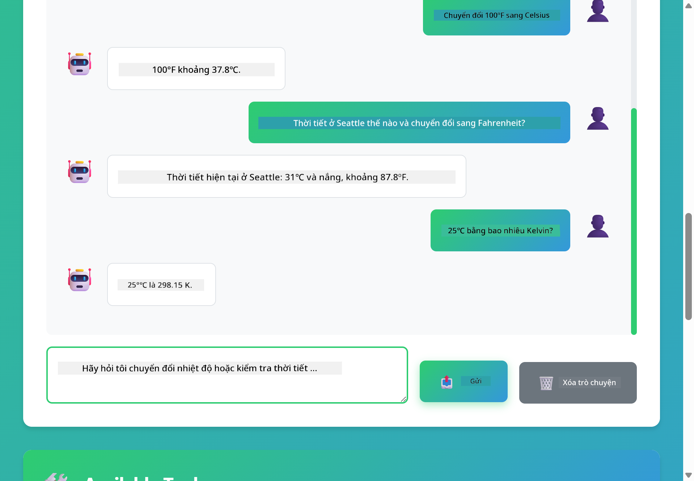

<!--
CO_OP_TRANSLATOR_METADATA:
{
  "original_hash": "13ec450c12cdd1a863baa2b778f27cd7",
  "translation_date": "2025-12-31T02:49:28+00:00",
  "source_file": "04-tools/README.md",
  "language_code": "vi"
}
-->
# Module 04: Tác nhân AI với Công cụ

## Mục lục

- [Những gì bạn sẽ học](../../../04-tools)
- [Yêu cầu trước](../../../04-tools)
- [Hiểu về Tác nhân AI với Công cụ](../../../04-tools)
- [Cách Gọi Công Cụ Hoạt Động](../../../04-tools)
  - [Định nghĩa Công cụ](../../../04-tools)
  - [Ra Quyết định](../../../04-tools)
  - [Thực thi](../../../04-tools)
  - [Tạo Phản hồi](../../../04-tools)
- [Chuỗi Công cụ](../../../04-tools)
- [Chạy Ứng dụng](../../../04-tools)
- [Sử dụng Ứng dụng](../../../04-tools)
  - [Thử sử dụng công cụ đơn giản](../../../04-tools)
  - [Kiểm tra liên kết công cụ](../../../04-tools)
  - [Xem luồng hội thoại](../../../04-tools)
  - [Quan sát suy luận](../../../04-tools)
  - [Thử nghiệm với các yêu cầu khác nhau](../../../04-tools)
- [Các khái niệm chính](../../../04-tools)
  - [Mô hình ReAct (Suy luận và Hành động)](../../../04-tools)
  - [Mô tả Công cụ quan trọng](../../../04-tools)
  - [Quản lý phiên](../../../04-tools)
  - [Xử lý lỗi](../../../04-tools)
- [Các Công cụ Có sẵn](../../../04-tools)
- [Khi nào sử dụng Tác nhân dựa trên Công cụ](../../../04-tools)
- [Bước tiếp theo](../../../04-tools)

## Những gì bạn sẽ học

Tính đến nay, bạn đã học cách trò chuyện với AI, cấu trúc prompt hiệu quả và căn cứ phản hồi trên tài liệu của mình. Nhưng vẫn còn một hạn chế cơ bản: các mô hình ngôn ngữ chỉ có thể tạo văn bản. Chúng không thể kiểm tra thời tiết, thực hiện phép tính, truy vấn cơ sở dữ liệu hoặc tương tác với hệ thống bên ngoài.

Công cụ thay đổi điều này. Bằng cách cung cấp cho mô hình quyền truy cập vào các hàm mà nó có thể gọi, bạn biến nó từ một bộ tạo văn bản thành một tác nhân có thể thực hiện hành động. Mô hình quyết định khi nào nó cần một công cụ, công cụ nào được sử dụng, và những tham số gì cần truyền. Mã của bạn thực thi hàm và trả về kết quả. Mô hình kết hợp kết quả đó vào phản hồi của nó.

## Yêu cầu trước

- Hoàn thành Module 01 (đã triển khai tài nguyên Azure OpenAI)
- Tệp `.env` trong thư mục gốc chứa thông tin xác thực Azure (được tạo bởi `azd up` trong Module 01)

> **Lưu ý:** Nếu bạn chưa hoàn thành Module 01, hãy làm theo hướng dẫn triển khai ở đó trước.

## Hiểu về Tác nhân AI với Công cụ

> **📝 Lưu ý:** Thuật ngữ "agents" trong module này đề cập đến trợ lý AI được tăng cường với khả năng gọi công cụ. Điều này khác với các mẫu **Agentic AI** (tác nhân tự chủ với lập kế hoạch, bộ nhớ và suy luận đa bước) mà chúng ta sẽ đề cập trong [Module 05: MCP](../05-mcp/README.md).

Một tác nhân AI có công cụ tuân theo mẫu suy luận và hành động (ReAct):

1. Người dùng hỏi một câu
2. Tác nhân suy nghĩ về những gì nó cần biết
3. Tác nhân quyết định xem có cần một công cụ để trả lời hay không
4. Nếu có, tác nhân gọi công cụ phù hợp với tham số chính xác
5. Công cụ thực thi và trả về dữ liệu
6. Tác nhân kết hợp kết quả và cung cấp câu trả lời cuối cùng


*Mô hình ReAct - cách các tác nhân AI luân phiên giữa suy luận và hành động để giải quyết vấn đề*

Điều này xảy ra tự động. Bạn định nghĩa các công cụ và mô tả của chúng. Mô hình xử lý việc ra quyết định về khi nào và cách sử dụng chúng.

## Cách Gọi Công Cụ Hoạt Động

**Định nghĩa Công cụ** - [WeatherTool.java](../../../04-tools/src/main/java/com/example/langchain4j/agents/tools/WeatherTool.java) | [TemperatureTool.java](../../../04-tools/src/main/java/com/example/langchain4j/agents/tools/TemperatureTool.java)

Bạn định nghĩa các hàm với mô tả rõ ràng và khai báo tham số. Mô hình nhìn thấy những mô tả này trong prompt hệ thống và hiểu mỗi công cụ thực hiện điều gì.

```java
@Component
public class WeatherTool {
    
    @Tool("Get the current weather for a location")
    public String getCurrentWeather(@P("Location name") String location) {
        // Logic tra cứu thời tiết của bạn
        return "Weather in " + location + ": 22°C, cloudy";
    }
}

@AiService
public interface Assistant {
    String chat(@MemoryId String sessionId, @UserMessage String message);
}

// Assistant được Spring Boot tự động cấu hình với:
// - bean ChatModel
// - Tất cả các phương thức @Tool từ các lớp @Component
// - ChatMemoryProvider để quản lý phiên
```

> **🤖 Thử với [GitHub Copilot](https://github.com/features/copilot) Chat:** Mở [`WeatherTool.java`](../../../04-tools/src/main/java/com/example/langchain4j/agents/tools/WeatherTool.java) và hỏi:
> - "Làm thế nào để tôi tích hợp một API thời tiết thực như OpenWeatherMap thay vì dữ liệu giả?"
> - "Điều gì tạo nên một mô tả công cụ tốt giúp AI sử dụng đúng cách?"
> - "Làm thế nào để tôi xử lý lỗi API và giới hạn tần suất trong việc triển khai công cụ?"

**Ra Quyết định**

Khi một người dùng hỏi "What's the weather in Seattle?", mô hình nhận ra nó cần công cụ thời tiết. Nó tạo một cuộc gọi hàm với tham số location được đặt là "Seattle".

**Thực thi** - [AgentService.java](../../../04-tools/src/main/java/com/example/langchain4j/agents/service/AgentService.java)

Spring Boot tự động tiêm (auto-wire) interface khai báo `@AiService` với tất cả các công cụ đã đăng ký, và LangChain4j thực hiện các cuộc gọi công cụ tự động.

> **🤖 Thử với [GitHub Copilot](https://github.com/features/copilot) Chat:** Mở [`AgentService.java`](../../../04-tools/src/main/java/com/example/langchain4j/agents/service/AgentService.java) và hỏi:
> - "Mô hình ReAct hoạt động như thế nào và tại sao nó hiệu quả cho các tác nhân AI?"
> - "Tác nhân quyết định công cụ nào sử dụng và theo thứ tự nào như thế nào?"
> - "Điều gì xảy ra nếu việc thực thi công cụ thất bại - tôi nên xử lý lỗi một cách vững chắc ra sao?"

**Tạo Phản hồi**

Mô hình nhận dữ liệu thời tiết và định dạng nó thành phản hồi ngôn ngữ tự nhiên cho người dùng.

### Tại sao sử dụng dịch vụ AI khai báo?

Module này sử dụng tích hợp Spring Boot của LangChain4j với các interface `@AiService` khai báo:

- **Spring Boot auto-wiring** - ChatModel và các công cụ được tiêm tự động
- **Mẫu `@MemoryId`** - Quản lý bộ nhớ theo phiên tự động
- **Một thể hiện duy nhất** - Trợ lý được tạo một lần và tái sử dụng để cải thiện hiệu năng
- **Thực thi an toàn theo kiểu** - Các phương thức Java được gọi trực tiếp với chuyển đổi kiểu
- **Điều phối nhiều lượt** - Xử lý chuỗi công cụ tự động
- **Không cần boilerplate** - Không cần gọi thủ công AiServices.builder() hoặc hashmap bộ nhớ

Các cách tiếp cận thay thế (thủ công `AiServices.builder()`) đòi hỏi nhiều mã hơn và không có lợi ích tích hợp của Spring Boot.

## Chuỗi Công cụ

**Chuỗi Công cụ** - AI có thể gọi nhiều công cụ theo thứ tự. Hỏi "What's the weather in Seattle and should I bring an umbrella?" và quan sát nó liên kết `getCurrentWeather` với suy luận về việc mang dù.

<a href="images/tool-chaining.png"></a>

*Gọi công cụ theo thứ tự - đầu ra của một công cụ feeds vào quyết định tiếp theo*

**Thất bại có kiểm soát** - Yêu cầu thời tiết ở một thành phố không có trong dữ liệu giả. Công cụ trả về thông báo lỗi, và AI giải thích rằng nó không thể giúp. Công cụ thất bại một cách an toàn.

Điều này xảy ra trong một lượt hội thoại duy nhất. Tác nhân điều phối nhiều cuộc gọi công cụ một cách tự chủ.

## Chạy Ứng dụng

**Xác minh triển khai:**

Đảm bảo tệp `.env` tồn tại trong thư mục gốc với thông tin xác thực Azure (được tạo trong Module 01):
```bash
cat ../.env  # Nên hiển thị AZURE_OPENAI_ENDPOINT, API_KEY, DEPLOYMENT
```

**Khởi động ứng dụng:**

> **Lưu ý:** Nếu bạn đã khởi động tất cả ứng dụng bằng `./start-all.sh` từ Module 01, module này đã chạy trên cổng 8084. Bạn có thể bỏ qua các lệnh khởi động bên dưới và vào trực tiếp http://localhost:8084.

**Tùy chọn 1: Sử dụng Spring Boot Dashboard (Khuyến nghị cho người dùng VS Code)**

Dev container bao gồm extension Spring Boot Dashboard, cung cấp giao diện trực quan để quản lý tất cả ứng dụng Spring Boot. Bạn có thể tìm thấy nó trong Activity Bar bên trái của VS Code (tìm biểu tượng Spring Boot).

Từ Spring Boot Dashboard, bạn có thể:
- Xem tất cả các ứng dụng Spring Boot có sẵn trong workspace
- Khởi động/dừng ứng dụng chỉ với một cú nhấp
- Xem nhật ký ứng dụng theo thời gian thực
- Giám sát trạng thái ứng dụng

Chỉ cần nhấp nút chạy bên cạnh "tools" để khởi động module này, hoặc khởi động tất cả các module cùng lúc.


**Tùy chọn 2: Sử dụng shell scripts**

Khởi động tất cả các ứng dụng web (module 01-04):

**Bash:**
```bash
cd ..  # Từ thư mục gốc
./start-all.sh
```

**PowerShell:**
```powershell
cd ..  # Từ thư mục gốc
.\start-all.ps1
```

Hoặc chỉ khởi động module này:

**Bash:**
```bash
cd 04-tools
./start.sh
```

**PowerShell:**
```powershell
cd 04-tools
.\start.ps1
```

Cả hai script tự động tải các biến môi trường từ tệp `.env` ở thư mục gốc và sẽ build các JAR nếu chúng chưa tồn tại.

> **Lưu ý:** Nếu bạn muốn build tất cả module thủ công trước khi khởi động:
>
> **Bash:**
> ```bash
> cd ..  # Go to root directory
> mvn clean package -DskipTests
> ```
>
> **PowerShell:**
> ```powershell
> cd ..  # Go to root directory
> mvn clean package -DskipTests
> ```

Mở http://localhost:8084 trong trình duyệt của bạn.

**Để dừng:**

**Bash:**
```bash
./stop.sh  # Chỉ mô-đun này
# Hoặc
cd .. && ./stop-all.sh  # Tất cả các mô-đun
```

**PowerShell:**
```powershell
.\stop.ps1  # Chỉ mô-đun này
# Hoặc
cd ..; .\stop-all.ps1  # Tất cả các mô-đun
```

## Sử dụng Ứng dụng

Ứng dụng cung cấp giao diện web nơi bạn có thể tương tác với một tác nhân AI có quyền truy cập vào công cụ thời tiết và chuyển đổi nhiệt độ.

<a href="images/tools-homepage.png"></a>

*Giao diện Công cụ Tác nhân AI - ví dụ nhanh và giao diện chat để tương tác với công cụ*

**Thử Sử dụng Công Cụ Đơn Giản**

Bắt đầu với một yêu cầu đơn giản: "Chuyển 100 độ Fahrenheit sang Celsius". Tác nhân nhận ra nó cần công cụ chuyển đổi nhiệt độ, gọi nó với tham số đúng và trả về kết quả. Chú ý cách điều này cảm thấy tự nhiên — bạn không cần chỉ định công cụ nào được sử dụng hay cách gọi nó.

**Kiểm tra Chuỗi Công cụ**

Bây giờ thử một yêu cầu phức tạp hơn: "What's the weather in Seattle and convert it to Fahrenheit?" Quan sát tác nhân xử lý theo các bước. Nó trước hết lấy thông tin thời tiết (trả về độ C), nhận ra cần chuyển sang Fahrenheit, gọi công cụ chuyển đổi, và kết hợp cả hai kết quả vào một phản hồi duy nhất.

**Xem Luồng Hội thoại**

Giao diện chat giữ lịch sử hội thoại, cho phép bạn thực hiện các tương tác nhiều lượt. Bạn có thể xem tất cả các truy vấn và phản hồi trước đó, giúp dễ dàng theo dõi cuộc trò chuyện và hiểu cách tác nhân xây dựng ngữ cảnh qua nhiều trao đổi.

<a href="images/tools-conversation-demo.png"></a>

*Hội thoại nhiều lượt hiển thị các chuyển đổi đơn giản, tra cứu thời tiết và chuỗi công cụ*

**Thử nghiệm với các Yêu cầu Khác nhau**

Thử các kết hợp khác nhau:
- Tra cứu thời tiết: "What's the weather in Tokyo?"
- Chuyển đổi nhiệt độ: "What is 25°C in Kelvin?"
- Truy vấn kết hợp: "Check the weather in Paris and tell me if it's above 20°C"

Chú ý cách tác nhân diễn giải ngôn ngữ tự nhiên và ánh xạ nó tới các lần gọi công cụ phù hợp.

## Các khái niệm chính

**Mô hình ReAct (Suy luận và Hành động)**

Tác nhân luân phiên giữa suy luận (quyết định cần làm gì) và hành động (sử dụng công cụ). Mẫu này cho phép giải quyết vấn đề một cách tự chủ thay vì chỉ phản hồi theo hướng dẫn.

**Mô tả Công cụ quan trọng**

Chất lượng mô tả công cụ ảnh hưởng trực tiếp đến mức độ chính xác khi tác nhân sử dụng chúng. Các mô tả rõ ràng, cụ thể giúp mô hình hiểu khi nào và cách gọi mỗi công cụ.

**Quản lý phiên**

Chú thích `@MemoryId` cho phép quản lý bộ nhớ theo phiên tự động. Mỗi session ID có một thực thể `ChatMemory` riêng do bean `ChatMemoryProvider` quản lý, loại bỏ nhu cầu theo dõi bộ nhớ thủ công.

**Xử lý lỗi**

Công cụ có thể thất bại - API có thể timeout, tham số có thể không hợp lệ, dịch vụ bên ngoài có thể ngưng hoạt động. Các tác nhân sản xuất cần xử lý lỗi để mô hình có thể giải thích vấn đề hoặc thử các phương án thay thế.

## Các Công cụ Có sẵn

**Công cụ Thời tiết** (dữ liệu giả cho mục đích minh họa):
- Lấy thời tiết hiện tại cho một vị trí
- Lấy dự báo nhiều ngày

**Công cụ Chuyển đổi Nhiệt độ**:
- Celsius sang Fahrenheit
- Fahrenheit sang Celsius
- Celsius sang Kelvin
- Kelvin sang Celsius
- Fahrenheit sang Kelvin
- Kelvin sang Fahrenheit

Đây là các ví dụ đơn giản, nhưng mẫu này mở rộng cho mọi hàm: truy vấn cơ sở dữ liệu, gọi API, tính toán, thao tác tệp hoặc lệnh hệ thống.

## Khi nào sử dụng Tác nhân dựa trên Công cụ

**Sử dụng công cụ khi:**
- Câu trả lời cần dữ liệu thời gian thực (thời tiết, giá cổ phiếu, tồn kho)
- Cần thực hiện các phép tính vượt quá toán học cơ bản
- Truy cập cơ sở dữ liệu hoặc API
- Thực hiện hành động (gửi email, tạo ticket, cập nhật bản ghi)
- Kết hợp nhiều nguồn dữ liệu

**Không sử dụng công cụ khi:**
- Câu hỏi có thể trả lời từ kiến thức chung
- Phản hồi chỉ mang tính trò chuyện
- Độ trễ công cụ sẽ làm trải nghiệm quá chậm

## Bước tiếp theo

**Module tiếp theo:** [05-mcp - Model Context Protocol (MCP)](../05-mcp/README.md)

---

**Điều hướng:** [← Trước: Module 03 - RAG](../03-rag/README.md) | [Quay lại Trang chính](../README.md) | [Tiếp: Module 05 - MCP →](../05-mcp/README.md)

---

<!-- CO-OP TRANSLATOR DISCLAIMER START -->
Miễn trừ trách nhiệm:
Tài liệu này đã được dịch bằng dịch vụ dịch thuật AI Co-op Translator (https://github.com/Azure/co-op-translator). Mặc dù chúng tôi nỗ lực đảm bảo độ chính xác, xin lưu ý rằng các bản dịch tự động có thể chứa lỗi hoặc thiếu sót. Tài liệu gốc bằng ngôn ngữ nguyên bản nên được coi là nguồn có thẩm quyền. Đối với thông tin quan trọng, nên sử dụng dịch vụ dịch thuật chuyên nghiệp do người thực hiện. Chúng tôi không chịu trách nhiệm về bất kỳ hiểu lầm hoặc diễn giải sai nào phát sinh từ việc sử dụng bản dịch này.
<!-- CO-OP TRANSLATOR DISCLAIMER END -->