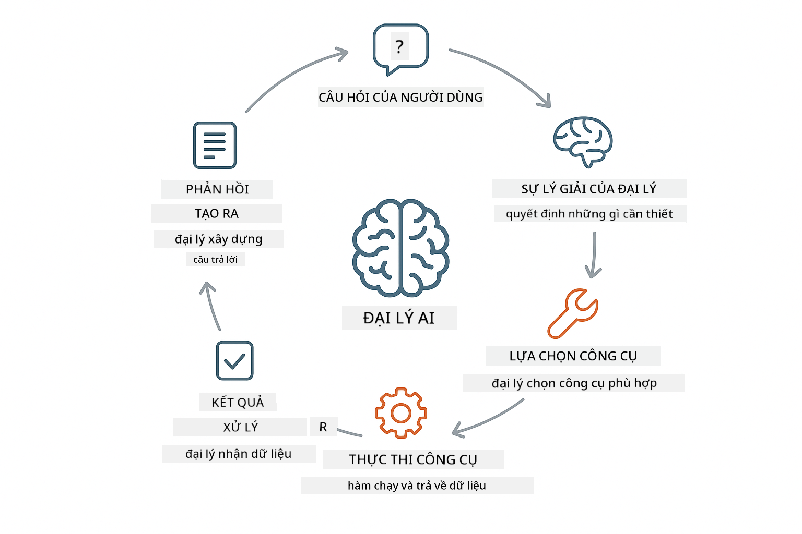
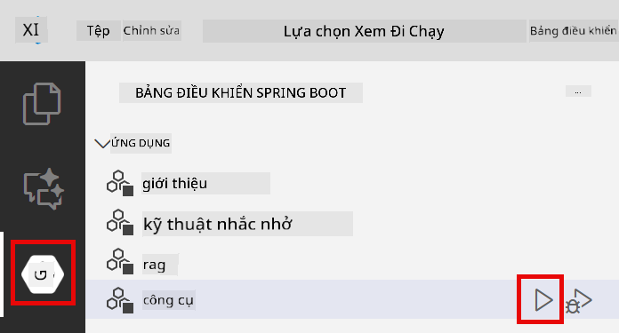
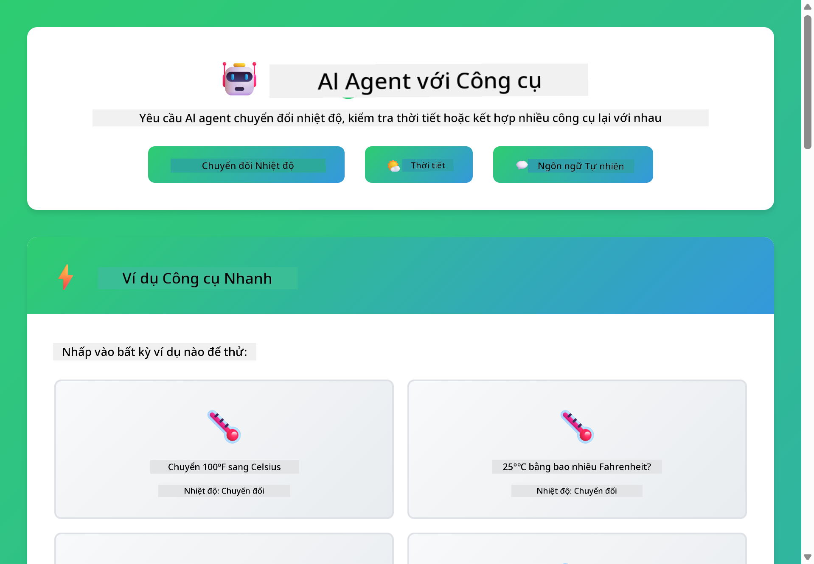

<!--
CO_OP_TRANSLATOR_METADATA:
{
  "original_hash": "aa23f106e7f53270924c9dd39c629004",
  "translation_date": "2025-12-13T19:08:32+00:00",
  "source_file": "04-tools/README.md",
  "language_code": "vi"
}
-->
# Module 04: Đại lý AI với Công cụ

## Mục lục

- [Bạn sẽ học gì](../../../04-tools)
- [Yêu cầu trước](../../../04-tools)
- [Hiểu về Đại lý AI với Công cụ](../../../04-tools)
- [Cách gọi Công cụ hoạt động](../../../04-tools)
  - [Định nghĩa Công cụ](../../../04-tools)
  - [Quyết định](../../../04-tools)
  - [Thực thi](../../../04-tools)
  - [Tạo phản hồi](../../../04-tools)
- [Chuỗi Công cụ](../../../04-tools)
- [Chạy Ứng dụng](../../../04-tools)
- [Sử dụng Ứng dụng](../../../04-tools)
  - [Thử Sử dụng Công cụ Đơn giản](../../../04-tools)
  - [Kiểm tra Chuỗi Công cụ](../../../04-tools)
  - [Xem Luồng Hội thoại](../../../04-tools)
  - [Quan sát Lý luận](../../../04-tools)
  - [Thử nghiệm với Các Yêu cầu Khác nhau](../../../04-tools)
- [Khái niệm Chính](../../../04-tools)
  - [Mẫu ReAct (Lý luận và Hành động)](../../../04-tools)
  - [Mô tả Công cụ Quan trọng](../../../04-tools)
  - [Quản lý Phiên làm việc](../../../04-tools)
  - [Xử lý Lỗi](../../../04-tools)
- [Công cụ Có sẵn](../../../04-tools)
- [Khi nào nên dùng Đại lý dựa trên Công cụ](../../../04-tools)
- [Bước tiếp theo](../../../04-tools)

## Bạn sẽ học gì

Cho đến nay, bạn đã học cách trò chuyện với AI, cấu trúc lời nhắc hiệu quả và căn cứ phản hồi vào tài liệu của bạn. Nhưng vẫn còn một hạn chế cơ bản: các mô hình ngôn ngữ chỉ có thể tạo ra văn bản. Chúng không thể kiểm tra thời tiết, thực hiện tính toán, truy vấn cơ sở dữ liệu hoặc tương tác với các hệ thống bên ngoài.

Công cụ thay đổi điều này. Bằng cách cung cấp cho mô hình quyền truy cập vào các hàm mà nó có thể gọi, bạn biến nó từ một trình tạo văn bản thành một đại lý có thể thực hiện hành động. Mô hình quyết định khi nào cần công cụ, công cụ nào để sử dụng và tham số nào cần truyền. Mã của bạn thực thi hàm và trả về kết quả. Mô hình kết hợp kết quả đó vào phản hồi của nó.

## Yêu cầu trước

- Hoàn thành Module 01 (đã triển khai tài nguyên Azure OpenAI)
- Tệp `.env` trong thư mục gốc với thông tin xác thực Azure (được tạo bởi `azd up` trong Module 01)

> **Lưu ý:** Nếu bạn chưa hoàn thành Module 01, hãy làm theo hướng dẫn triển khai ở đó trước.

## Hiểu về Đại lý AI với Công cụ

Một đại lý AI với công cụ tuân theo mẫu lý luận và hành động (ReAct):

1. Người dùng đặt câu hỏi
2. Đại lý suy nghĩ về những gì nó cần biết
3. Đại lý quyết định xem có cần công cụ để trả lời không
4. Nếu có, đại lý gọi công cụ phù hợp với các tham số đúng
5. Công cụ thực thi và trả về dữ liệu
6. Đại lý kết hợp kết quả và cung cấp câu trả lời cuối cùng



*Mẫu ReAct - cách các đại lý AI luân phiên giữa lý luận và hành động để giải quyết vấn đề*

Điều này xảy ra tự động. Bạn định nghĩa các công cụ và mô tả của chúng. Mô hình xử lý việc ra quyết định về khi nào và cách sử dụng chúng.

## Cách gọi Công cụ hoạt động

**Định nghĩa Công cụ** - [WeatherTool.java](../../../04-tools/src/main/java/com/example/langchain4j/agents/tools/WeatherTool.java) | [TemperatureTool.java](../../../04-tools/src/main/java/com/example/langchain4j/agents/tools/TemperatureTool.java)

Bạn định nghĩa các hàm với mô tả rõ ràng và thông số cụ thể. Mô hình thấy các mô tả này trong lời nhắc hệ thống và hiểu công dụng của từng công cụ.

```java
@Component
public class WeatherTool {
    
    @Tool("Get the current weather for a location")
    public String getCurrentWeather(@P("Location name") String location) {
        // Logic tra cứu thời tiết của bạn
        return "Weather in " + location + ": 22°C, cloudy";
    }
}

@AiService
public interface Assistant {
    String chat(@MemoryId String sessionId, @UserMessage String message);
}

// Trợ lý được tự động kết nối bởi Spring Boot với:
// - Bean ChatModel
// - Tất cả các phương thức @Tool từ các lớp @Component
// - ChatMemoryProvider để quản lý phiên làm việc
```

> **🤖 Thử với [GitHub Copilot](https://github.com/features/copilot) Chat:** Mở [`WeatherTool.java`](../../../04-tools/src/main/java/com/example/langchain4j/agents/tools/WeatherTool.java) và hỏi:
> - "Làm thế nào để tích hợp API thời tiết thực như OpenWeatherMap thay vì dữ liệu giả?"
> - "Điều gì tạo nên một mô tả công cụ tốt giúp AI sử dụng đúng cách?"
> - "Làm sao để xử lý lỗi API và giới hạn tần suất trong triển khai công cụ?"

**Quyết định**

Khi người dùng hỏi "Thời tiết ở Seattle thế nào?", mô hình nhận ra cần công cụ thời tiết. Nó tạo ra một cuộc gọi hàm với tham số vị trí là "Seattle".

**Thực thi** - [AgentService.java](../../../04-tools/src/main/java/com/example/langchain4j/agents/service/AgentService.java)

Spring Boot tự động kết nối giao diện khai báo `@AiService` với tất cả công cụ đã đăng ký, và LangChain4j thực thi các cuộc gọi công cụ tự động.

> **🤖 Thử với [GitHub Copilot](https://github.com/features/copilot) Chat:** Mở [`AgentService.java`](../../../04-tools/src/main/java/com/example/langchain4j/agents/service/AgentService.java) và hỏi:
> - "Mẫu ReAct hoạt động thế nào và tại sao nó hiệu quả với đại lý AI?"
> - "Đại lý quyết định công cụ nào dùng và theo thứ tự nào?"
> - "Nếu thực thi công cụ thất bại - tôi nên xử lý lỗi thế nào cho chắc chắn?"

**Tạo phản hồi**

Mô hình nhận dữ liệu thời tiết và định dạng thành phản hồi ngôn ngữ tự nhiên cho người dùng.

### Tại sao dùng dịch vụ AI khai báo?

Module này sử dụng tích hợp Spring Boot của LangChain4j với giao diện khai báo `@AiService`:

- **Spring Boot tự động kết nối** - ChatModel và công cụ được tiêm tự động
- **Mẫu @MemoryId** - Quản lý bộ nhớ theo phiên tự động
- **Một thể hiện duy nhất** - Trợ lý được tạo một lần và tái sử dụng để tăng hiệu suất
- **Thực thi an toàn kiểu** - Gọi trực tiếp phương thức Java với chuyển đổi kiểu
- **Điều phối đa lượt** - Tự động xử lý chuỗi công cụ
- **Không cần mã lặp lại** - Không gọi thủ công AiServices.builder() hay HashMap bộ nhớ

Các cách tiếp cận khác (thủ công `AiServices.builder()`) cần nhiều mã hơn và không tận dụng lợi ích tích hợp Spring Boot.

## Chuỗi Công cụ

**Chuỗi Công cụ** - AI có thể gọi nhiều công cụ theo chuỗi. Hỏi "Thời tiết ở Seattle thế nào và tôi có nên mang ô không?" và xem nó nối `getCurrentWeather` với suy luận về đồ mưa.

<a href="images/tool-chaining.png"></a>

*Các cuộc gọi công cụ tuần tự - đầu ra của công cụ này làm đầu vào cho quyết định tiếp theo*

**Thất bại nhẹ nhàng** - Hỏi thời tiết ở thành phố không có trong dữ liệu giả. Công cụ trả về thông báo lỗi, và AI giải thích nó không thể giúp. Công cụ thất bại an toàn.

Điều này xảy ra trong một lượt hội thoại duy nhất. Đại lý tự điều phối nhiều cuộc gọi công cụ.

## Chạy Ứng dụng

**Xác minh triển khai:**

Đảm bảo tệp `.env` tồn tại trong thư mục gốc với thông tin xác thực Azure (được tạo trong Module 01):
```bash
cat ../.env  # Nên hiển thị AZURE_OPENAI_ENDPOINT, API_KEY, DEPLOYMENT
```

**Khởi động ứng dụng:**

> **Lưu ý:** Nếu bạn đã khởi động tất cả ứng dụng bằng `./start-all.sh` từ Module 01, module này đã chạy trên cổng 8084. Bạn có thể bỏ qua lệnh khởi động dưới đây và truy cập trực tiếp http://localhost:8084.

**Tùy chọn 1: Dùng Spring Boot Dashboard (Khuyến nghị cho người dùng VS Code)**

Dev container bao gồm tiện ích mở rộng Spring Boot Dashboard, cung cấp giao diện trực quan để quản lý tất cả ứng dụng Spring Boot. Bạn có thể tìm thấy nó trên Thanh Hoạt động bên trái của VS Code (tìm biểu tượng Spring Boot).

Từ Spring Boot Dashboard, bạn có thể:
- Xem tất cả ứng dụng Spring Boot có trong workspace
- Khởi động/dừng ứng dụng chỉ với một cú nhấp
- Xem nhật ký ứng dụng theo thời gian thực
- Giám sát trạng thái ứng dụng

Chỉ cần nhấp nút phát bên cạnh "tools" để khởi động module này, hoặc khởi động tất cả module cùng lúc.



**Tùy chọn 2: Dùng script shell**

Khởi động tất cả ứng dụng web (module 01-04):

**Bash:**
```bash
cd ..  # Từ thư mục gốc
./start-all.sh
```

**PowerShell:**
```powershell
cd ..  # Từ thư mục gốc
.\start-all.ps1
```

Hoặc chỉ khởi động module này:

**Bash:**
```bash
cd 04-tools
./start.sh
```

**PowerShell:**
```powershell
cd 04-tools
.\start.ps1
```

Cả hai script tự động tải biến môi trường từ tệp `.env` gốc và sẽ xây dựng JAR nếu chưa có.

> **Lưu ý:** Nếu bạn muốn xây dựng tất cả module thủ công trước khi khởi động:
>
> **Bash:**
> ```bash
> cd ..  # Go to root directory
> mvn clean package -DskipTests
> ```
>
> **PowerShell:**
> ```powershell
> cd ..  # Go to root directory
> mvn clean package -DskipTests
> ```

Mở http://localhost:8084 trong trình duyệt của bạn.

**Để dừng:**

**Bash:**
```bash
./stop.sh  # Chỉ mô-đun này
# Hoặc
cd .. && ./stop-all.sh  # Tất cả các mô-đun
```

**PowerShell:**
```powershell
.\stop.ps1  # Chỉ mô-đun này
# Hoặc
cd ..; .\stop-all.ps1  # Tất cả các mô-đun
```

## Sử dụng Ứng dụng

Ứng dụng cung cấp giao diện web nơi bạn có thể tương tác với đại lý AI có quyền truy cập vào công cụ thời tiết và chuyển đổi nhiệt độ.

<a href="images/tools-homepage.png"></a>

*Giao diện Công cụ Đại lý AI - ví dụ nhanh và giao diện chat để tương tác với công cụ*

**Thử Sử dụng Công cụ Đơn giản**

Bắt đầu với yêu cầu đơn giản: "Chuyển 100 độ Fahrenheit sang Celsius". Đại lý nhận ra cần công cụ chuyển đổi nhiệt độ, gọi nó với tham số đúng và trả về kết quả. Hãy chú ý cảm giác tự nhiên - bạn không cần chỉ định công cụ nào dùng hay cách gọi.

**Kiểm tra Chuỗi Công cụ**

Bây giờ thử yêu cầu phức tạp hơn: "Thời tiết ở Seattle thế nào và chuyển sang Fahrenheit?" Xem đại lý làm việc theo các bước. Nó lấy thời tiết (trả về Celsius), nhận ra cần chuyển sang Fahrenheit, gọi công cụ chuyển đổi, và kết hợp cả hai kết quả thành một phản hồi.

**Xem Luồng Hội thoại**

Giao diện chat duy trì lịch sử hội thoại, cho phép bạn tương tác đa lượt. Bạn có thể xem tất cả truy vấn và phản hồi trước đó, giúp dễ dàng theo dõi cuộc trò chuyện và hiểu cách đại lý xây dựng ngữ cảnh qua nhiều lượt trao đổi.

<a href="images/tools-conversation-demo.png"></a>

*Hội thoại đa lượt thể hiện chuyển đổi đơn giản, tra cứu thời tiết và chuỗi công cụ*

**Thử nghiệm với Các Yêu cầu Khác nhau**

Thử các kết hợp khác nhau:
- Tra cứu thời tiết: "Thời tiết ở Tokyo thế nào?"
- Chuyển đổi nhiệt độ: "25°C bằng bao nhiêu Kelvin?"
- Truy vấn kết hợp: "Kiểm tra thời tiết ở Paris và cho tôi biết có trên 20°C không"

Chú ý cách đại lý hiểu ngôn ngữ tự nhiên và ánh xạ nó thành các cuộc gọi công cụ phù hợp.

## Khái niệm Chính

**Mẫu ReAct (Lý luận và Hành động)**

Đại lý luân phiên giữa lý luận (quyết định làm gì) và hành động (sử dụng công cụ). Mẫu này cho phép giải quyết vấn đề tự động thay vì chỉ phản hồi theo hướng dẫn.

**Mô tả Công cụ Quan trọng**

Chất lượng mô tả công cụ ảnh hưởng trực tiếp đến cách đại lý sử dụng chúng. Mô tả rõ ràng, cụ thể giúp mô hình hiểu khi nào và cách gọi từng công cụ.

**Quản lý Phiên làm việc**

Chú thích `@MemoryId` cho phép quản lý bộ nhớ theo phiên tự động. Mỗi ID phiên có một thể hiện `ChatMemory` riêng do bean `ChatMemoryProvider` quản lý, loại bỏ nhu cầu theo dõi bộ nhớ thủ công.

**Xử lý Lỗi**

Công cụ có thể thất bại - API hết thời gian chờ, tham số không hợp lệ, dịch vụ bên ngoài ngừng hoạt động. Đại lý sản xuất cần xử lý lỗi để mô hình có thể giải thích vấn đề hoặc thử phương án khác.

## Công cụ Có sẵn

**Công cụ Thời tiết** (dữ liệu giả để minh họa):
- Lấy thời tiết hiện tại cho một địa điểm
- Lấy dự báo nhiều ngày

**Công cụ Chuyển đổi Nhiệt độ**:
- Celsius sang Fahrenheit
- Fahrenheit sang Celsius
- Celsius sang Kelvin
- Kelvin sang Celsius
- Fahrenheit sang Kelvin
- Kelvin sang Fahrenheit

Đây là ví dụ đơn giản, nhưng mẫu này mở rộng cho bất kỳ hàm nào: truy vấn cơ sở dữ liệu, gọi API, tính toán, thao tác tệp hoặc lệnh hệ thống.

## Khi nào nên dùng Đại lý dựa trên Công cụ

**Dùng công cụ khi:**
- Trả lời cần dữ liệu thời gian thực (thời tiết, giá cổ phiếu, tồn kho)
- Cần thực hiện tính toán phức tạp hơn toán học đơn giản
- Truy cập cơ sở dữ liệu hoặc API
- Thực hiện hành động (gửi email, tạo phiếu, cập nhật hồ sơ)
- Kết hợp nhiều nguồn dữ liệu

**Không dùng công cụ khi:**
- Câu hỏi có thể trả lời từ kiến thức chung
- Phản hồi chỉ mang tính trò chuyện
- Độ trễ công cụ làm trải nghiệm quá chậm

## Bước tiếp theo

**Module tiếp theo:** [05-mcp - Giao thức Ngữ cảnh Mô hình (MCP)](../05-mcp/README.md)

---

**Điều hướng:** [← Trước: Module 03 - RAG](../03-rag/README.md) | [Quay lại Chính](../README.md) | [Tiếp: Module 05 - MCP →](../05-mcp/README.md)

---

<!-- CO-OP TRANSLATOR DISCLAIMER START -->
**Tuyên bố từ chối trách nhiệm**:  
Tài liệu này đã được dịch bằng dịch vụ dịch thuật AI [Co-op Translator](https://github.com/Azure/co-op-translator). Mặc dù chúng tôi cố gắng đảm bảo độ chính xác, xin lưu ý rằng bản dịch tự động có thể chứa lỗi hoặc không chính xác. Tài liệu gốc bằng ngôn ngữ gốc của nó nên được xem là nguồn chính xác và đáng tin cậy. Đối với thông tin quan trọng, nên sử dụng dịch vụ dịch thuật chuyên nghiệp do con người thực hiện. Chúng tôi không chịu trách nhiệm về bất kỳ sự hiểu lầm hoặc giải thích sai nào phát sinh từ việc sử dụng bản dịch này.
<!-- CO-OP TRANSLATOR DISCLAIMER END -->