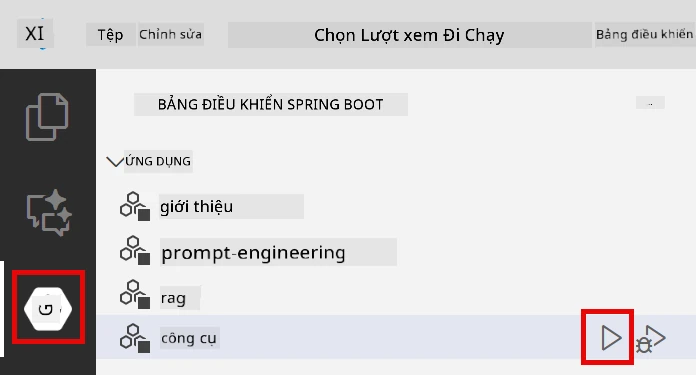
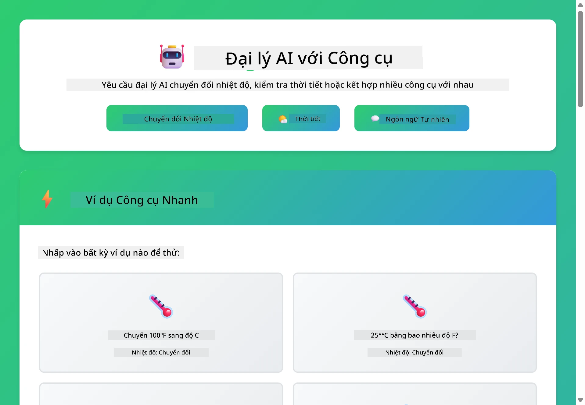
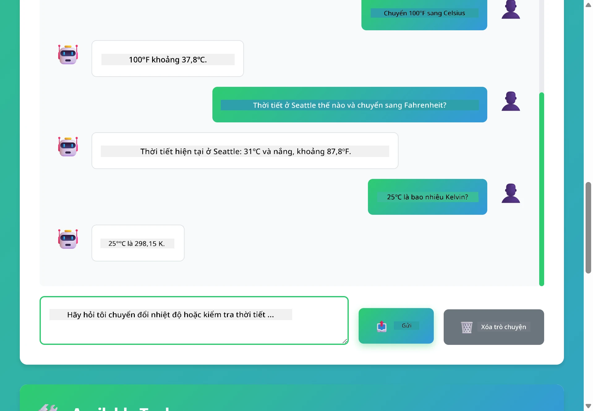

# Module 04: Đại lý AI với Công cụ

## Mục lục

- [Hướng dẫn qua video](#hướng-dẫn-qua-video)
- [Những gì bạn sẽ học](#những-gì-bạn-sẽ-học)
- [Yêu cầu trước](#yêu-cầu-trước)
- [Hiểu về Đại lý AI với Công cụ](#hiểu-về-đại-lý-ai-với-công-cụ)
- [Cách hoạt động của gọi công cụ](#cách-hoạt-động-của-gọi-công-cụ)
  - [Định nghĩa công cụ](#định-nghĩa-công-cụ)
  - [Quyết định](#quyết-định)
  - [Thực thi](#thực-thi)
  - [Tạo phản hồi](#tạo-phản-hồi)
  - [Kiến trúc: Spring Boot Tự động kết nối](#kiến-trúc-spring-boot-tự-động-kết-nối)
- [Chuỗi công cụ](#chuỗi-công-cụ)
- [Chạy ứng dụng](#chạy-ứng-dụng)
- [Sử dụng ứng dụng](#sử-dụng-ứng-dụng)
  - [Thử sử dụng công cụ đơn giản](#thử-sử-dụng-công-cụ-đơn-giản)
  - [Kiểm tra chuỗi công cụ](#thử-chuỗi-công-cụ)
  - [Xem luồng hội thoại](#xem-luồng-cuộc-trò-chuyện)
  - [Thử nghiệm với các yêu cầu khác nhau](#thử-nghiệm-với-các-yêu-cầu-khác-nhau)
- [Các khái niệm chính](#các-khái-niệm-chính)
  - [Mẫu ReAct (Suy luận và Hành động)](#mẫu-react-lý-giải-và-hành-động)
  - [Mô tả công cụ quan trọng](#mô-tả-công-cụ-quan-trọng)
  - [Quản lý phiên làm việc](#quản-lý-phiên-làm-việc)
  - [Xử lý lỗi](#xử-lý-lỗi)
- [Công cụ có sẵn](#các-công-cụ-có-sẵn)
- [Khi nào sử dụng đại lý dựa trên công cụ](#khi-nào-nên-dùng-đại-lý-dựa-trên-công-cụ)
- [Công cụ vs RAG](#công-cụ-và-rag)
- [Bước tiếp theo](#các-bước-tiếp-theo)

## Hướng dẫn qua video

Xem buổi phát trực tiếp này giải thích cách bắt đầu với module này:

<a href="https://www.youtube.com/watch?v=O_J30kZc0rw"></a>

## Những gì bạn sẽ học

Cho đến nay, bạn đã học cách trò chuyện với AI, cấu trúc prompt hiệu quả và dựa trên tài liệu để tạo câu trả lời. Nhưng vẫn còn một hạn chế cơ bản: các mô hình ngôn ngữ chỉ có thể tạo văn bản. Chúng không thể kiểm tra thời tiết, tính toán, truy vấn cơ sở dữ liệu, hoặc tương tác với các hệ thống bên ngoài.

Công cụ thay đổi điều này. Bằng cách cung cấp cho mô hình quyền truy cập các hàm mà nó có thể gọi, bạn biến nó từ một trình tạo văn bản thành một đại lý có thể thực hiện hành động. Mô hình quyết định khi nào cần dùng công cụ, công cụ nào để dùng, và truyền tham số gì. Mã của bạn thực thi hàm đó và trả về kết quả. Mô hình kết hợp kết quả đó vào câu trả lời của nó.

## Yêu cầu trước

- Đã hoàn thành [Module 01 - Giới thiệu](../01-introduction/README.md) (các tài nguyên Azure OpenAI được triển khai)
- Nên hoàn thành các module trước (module này tham chiếu các [khái niệm RAG từ Module 03](../03-rag/README.md) trong phần so sánh Công cụ vs RAG)
- Tệp `.env` trong thư mục gốc chứa thông tin đăng nhập Azure (được tạo bởi `azd up` trong Module 01)

> **Lưu ý:** Nếu bạn chưa hoàn thành Module 01, vui lòng làm theo hướng dẫn triển khai ở đó trước.

## Hiểu về Đại lý AI với Công cụ

> **📝 Lưu ý:** Thuật ngữ "đại lý" trong module này chỉ các trợ lý AI được nâng cao với khả năng gọi công cụ. Điều này khác với các mẫu **Agentic AI** (đại lý tự chủ với lập kế hoạch, ghi nhớ và suy luận đa bước) mà chúng ta sẽ đề cập trong [Module 05: MCP](../05-mcp/README.md).

Nếu không có công cụ, mô hình ngôn ngữ chỉ có thể tạo ra văn bản dựa trên dữ liệu huấn luyện. Hỏi nó về thời tiết hiện tại, nó phải đoán. Nếu có công cụ, nó có thể gọi API thời tiết, thực hiện tính toán, hoặc truy vấn cơ sở dữ liệu — rồi dệt những kết quả thực vào câu trả lời.


*Không có công cụ, mô hình chỉ đoán — có công cụ, nó có thể gọi API, tính toán, và trả dữ liệu thời gian thực.*

Một đại lý AI với công cụ tuân theo mẫu **Suy luận và Hành động (ReAct)**. Mô hình không chỉ phản hồi — nó suy nghĩ điều cần thiết, hành động bằng cách gọi công cụ, quan sát kết quả, rồi quyết định tiếp tục hành động hay đưa ra câu trả lời cuối cùng:

1. **Suy luận** — Đại lý phân tích câu hỏi người dùng và xác định thông tin cần thiết
2. **Hành động** — Đại lý chọn công cụ phù hợp, tạo tham số đúng, và gọi nó
3. **Quan sát** — Đại lý nhận kết quả từ công cụ và đánh giá
4. **Lặp lại hoặc phản hồi** — Nếu cần thêm dữ liệu, đại lý quay vòng lặp; nếu không thì tạo câu trả lời bằng ngôn ngữ tự nhiên


*Vòng lặp ReAct — đại lý suy luận việc cần làm, hành động gọi công cụ, quan sát kết quả, và lặp lại cho đến khi đưa ra câu trả lời cuối cùng.*

Điều này diễn ra tự động. Bạn định nghĩa công cụ và mô tả của chúng. Mô hình xử lý việc quyết định khi nào và cách sử dụng.

## Cách hoạt động của gọi công cụ

### Định nghĩa công cụ

[WeatherTool.java](../../../04-tools/src/main/java/com/example/langchain4j/agents/tools/WeatherTool.java) | [TemperatureTool.java](../../../04-tools/src/main/java/com/example/langchain4j/agents/tools/TemperatureTool.java)

Bạn định nghĩa hàm với mô tả rõ ràng và thông số kỹ thuật tham số. Mô hình nhìn thấy mô tả đó trong prompt hệ thống và hiểu công cụ làm gì.

```java
@Component
public class WeatherTool {
    
    @Tool("Get the current weather for a location")
    public String getCurrentWeather(@P("Location name") String location) {
        // Logic tra cứu thời tiết của bạn
        return "Weather in " + location + ": 22°C, cloudy";
    }
}

@AiService
public interface Assistant {
    String chat(@MemoryId String sessionId, @UserMessage String message);
}

// Trợ lý được Spring Boot tự động cấu hình với:
// - Bean ChatModel
// - Tất cả các phương thức @Tool từ các lớp @Component
// - ChatMemoryProvider để quản lý phiên làm việc
```

Sơ đồ dưới đây phân tích từng chú thích và cho thấy từng phần giúp AI hiểu khi nào gọi công cụ và truyền tham số nào:


*Cấu trúc định nghĩa công cụ — @Tool cho AI biết khi nào dùng, @P mô tả từng tham số, và @AiService kết nối mọi thứ lúc khởi động.*

> **🤖 Thử với [GitHub Copilot](https://github.com/features/copilot) Chat:** Mở [`WeatherTool.java`](../../../04-tools/src/main/java/com/example/langchain4j/agents/tools/WeatherTool.java) và hỏi:
> - "Làm thế nào để tích hợp API thời tiết thật như OpenWeatherMap thay vì dữ liệu giả?"
> - "Điều gì tạo nên mô tả công cụ tốt giúp AI dùng đúng cách?"
> - "Làm sao xử lý lỗi API và giới hạn tốc độ trong triển khai công cụ?"

### Quyết định

Khi người dùng hỏi "Thời tiết ở Seattle thế nào?", mô hình không chọn công cụ ngẫu nhiên. Nó so sánh ý định người dùng với từng mô tả công cụ mình có, chấm điểm mức liên quan, rồi chọn công cụ phù hợp nhất. Sau đó mô hình tạo cuộc gọi hàm có cấu trúc với tham số đúng — ví dụ thiết lập `location` là `"Seattle"`.

Nếu không có công cụ phù hợp, mô hình sẽ trả lời dựa trên kiến thức riêng. Nếu nhiều công cụ phù hợp, nó chọn công cụ cụ thể nhất.


*Mô hình đánh giá từng công cụ khả dụng so với ý định người dùng và chọn phù hợp nhất — đó là lý do vì sao việc viết mô tả công cụ rõ ràng, cụ thể quan trọng.*

### Thực thi

[AgentService.java](../../../04-tools/src/main/java/com/example/langchain4j/agents/service/AgentService.java)

Spring Boot tự động kết nối giao diện khai báo `@AiService` với tất cả các công cụ đã đăng ký, và LangChain4j tự động thực hiện các cuộc gọi công cụ. Ở hậu trường, một cuộc gọi công cụ hoàn chỉnh đi qua sáu giai đoạn — từ câu hỏi ngôn ngữ tự nhiên của người dùng đến trả lời ngôn ngữ tự nhiên:


*Quy trình đầu-cuối — người dùng hỏi, mô hình chọn công cụ, LangChain4j thực thi, mô hình kết hợp kết quả vào câu trả lời tự nhiên.*

Ở hậu trường, `AiServices` chạy vòng gọi công cụ cho bất kỳ công cụ nào — ở đây minh họa với `Calculator` đơn giản. Sơ đồ tuần tự dưới đây cho thấy chính xác điều gì xảy ra:


*Vòng lặp gọi công cụ — `AiServices` gửi tin nhắn và mô tả công cụ đến LLM, LLM trả lời với cuộc gọi hàm kiểu `add(42, 58)`, LangChain4j thực thi phương thức `Calculator` cục bộ, và trả kết quả lại để đưa ra câu trả lời cuối.*

> **🤖 Thử với [GitHub Copilot](https://github.com/features/copilot) Chat:** Mở [`AgentService.java`](../../../04-tools/src/main/java/com/example/langchain4j/agents/service/AgentService.java) và hỏi:
> - "Mẫu ReAct hoạt động thế nào và tại sao hiệu quả cho đại lý AI?"
> - "Đại lý quyết định dùng công cụ nào và theo thứ tự nào?"
> - "Nếu thực thi công cụ thất bại - tôi nên xử lý lỗi ra sao để bền vững?"

### Tạo phản hồi

Mô hình nhận dữ liệu thời tiết và định dạng thành câu trả lời ngôn ngữ tự nhiên cho người dùng.

### Kiến trúc: Spring Boot Tự động kết nối

Module này sử dụng tích hợp LangChain4j với Spring Boot qua các giao diện khai báo `@AiService`. Khi khởi động, Spring Boot phát hiện mọi `@Component` chứa phương thức `@Tool`, bean `ChatModel` của bạn, và `ChatMemoryProvider` — rồi tự động kết nối tất cả thành một giao diện `Assistant` mà không cần mã lặp lại.


*Giao diện @AiService kết nối ChatModel, các thành phần công cụ và bộ nhớ — Spring Boot xử lý kết nối tự động.*

Dưới đây là toàn bộ vòng đời yêu cầu dưới dạng sơ đồ tuần tự — từ yêu cầu HTTP qua controller, service, proxy tự động kết nối, đến thực thi công cụ và trả về:


*Vòng đời yêu cầu Spring Boot hoàn chỉnh — yêu cầu HTTP đi qua controller và service đến proxy Assistant tự động kết nối, là nơi phối hợp giữa LLM và gọi công cụ tự động.*

Lợi ích chính của cách làm này:

- **Tự động kết nối Spring Boot** — ChatModel và công cụ được tiêm tự động
- **Mẫu @MemoryId** — Quản lý bộ nhớ theo phiên làm việc tự động
- **Một thực thể duy nhất** — Tạo Assistant duy nhất dùng lại cho hiệu năng tốt hơn
- **Thực thi an toàn kiểu** — Gọi phương thức Java trực tiếp với chuyển đổi kiểu
- **Điều phối đa bước** — Tự động xử lý chuỗi gọi công cụ
- **Không mã lặp lại** — Không cần gọi thủ công AiServices.builder() hay HashMap bộ nhớ

Các cách khác (thủ công gọi AiServices.builder()) cần nhiều mã hơn và không có lợi ích tích hợp Spring Boot.

## Chuỗi công cụ

**Chuỗi công cụ** — Sức mạnh thật sự của đại lý dựa trên công cụ thể hiện khi một câu hỏi cần nhiều công cụ. Hỏi "Thời tiết ở Seattle theo Fahrenheit thế nào?" và đại lý tự động chuỗi hai công cụ: đầu tiên gọi `getCurrentWeather` để lấy nhiệt độ theo Celsius, sau đó truyền giá trị đó cho `celsiusToFahrenheit` để quy đổi — tất cả trong một lượt hội thoại.


*Chuỗi công cụ trong thực tế — đại lý gọi getCurrentWeather trước, rồi truyền kết quả Celsius vào celsiusToFahrenheit, và đưa câu trả lời tổng hợp.*

**Xử lý lỗi mềm mại** — Hỏi thời tiết ở một thành phố không có trong dữ liệu giả. Công cụ trả về thông báo lỗi, và AI giải thích không thể giúp thay vì bị lỗi. Công cụ thất bại an toàn. Sơ đồ phía dưới so sánh hai cách — với xử lý lỗi đúng, đại lý bắt lỗi và trả lời hỗ trợ, còn nếu không thì ứng dụng bị sập:


*Khi công cụ thất bại, đại lý bắt lỗi và trả lời bằng lời giải thích hữu ích thay vì ứng dụng bị sập.*

Điều này diễn ra trong một lượt hội thoại. Đại lý tự động điều phối nhiều cuộc gọi công cụ.

## Chạy ứng dụng

**Xác nhận triển khai:**

Đảm bảo tệp `.env` tồn tại trong thư mục gốc chứa thông tin đăng nhập Azure (được tạo trong Module 01). Chạy lệnh này từ thư mục module (`04-tools/`):

**Bash:**
```bash
cat ../.env  # Nên hiển thị AZURE_OPENAI_ENDPOINT, API_KEY, DEPLOYMENT
```

**PowerShell:**
```powershell
Get-Content ..\.env  # Nên hiển thị AZURE_OPENAI_ENDPOINT, API_KEY, DEPLOYMENT
```

**Khởi động ứng dụng:**

> **Lưu ý:** Nếu bạn đã khởi động tất cả ứng dụng bằng `./start-all.sh` từ thư mục gốc (như mô tả trong Module 01), module này đã chạy trên cổng 8084. Bạn có thể bỏ qua các lệnh khởi động bên dưới và truy cập trực tiếp http://localhost:8084.

**Cách 1: Sử dụng Spring Boot Dashboard (Khuyến nghị cho người dùng VS Code)**

Dev container bao gồm tiện ích mở rộng Spring Boot Dashboard, cung cấp giao diện trực quan để quản lý tất cả ứng dụng Spring Boot. Bạn có thể tìm thấy nó trong Thanh hoạt động bên trái của VS Code (tìm biểu tượng Spring Boot).

Từ Spring Boot Dashboard, bạn có thể:
- Xem tất cả ứng dụng Spring Boot có trong workspace
- Khởi động/dừng ứng dụng chỉ bằng một nhấp chuột
- Xem nhật ký ứng dụng theo thời gian thực
- Giám sát trạng thái ứng dụng

Chỉ cần bấm nút chạy bên cạnh "tools" để khởi động module này, hoặc khởi động tất cả các module cùng lúc.

Dưới đây là hình ảnh giao diện Spring Boot Dashboard trong VS Code:


*Bảng điều khiển Spring Boot trong VS Code — bắt đầu, dừng, và giám sát tất cả các module từ một nơi duy nhất*

**Lựa chọn 2: Sử dụng shell scripts**

Khởi động tất cả các ứng dụng web (module 01-04):

**Bash:**
```bash
cd ..  # Từ thư mục gốc
./start-all.sh
```

**PowerShell:**
```powershell
cd ..  # Từ thư mục gốc
.\start-all.ps1
```

Hoặc chỉ khởi động module này:

**Bash:**
```bash
cd 04-tools
./start.sh
```

**PowerShell:**
```powershell
cd 04-tools
.\start.ps1
```

Cả hai script đều tự động tải biến môi trường từ file `.env` ở thư mục gốc và sẽ xây dựng các file JAR nếu chúng chưa tồn tại.

> **Lưu ý:** Nếu bạn muốn tự xây dựng tất cả các module thủ công trước khi bắt đầu:
>
> **Bash:**
> ```bash
> cd ..  # Go to root directory
> mvn clean package -DskipTests
> ```
>
> **PowerShell:**
> ```powershell
> cd ..  # Go to root directory
> mvn clean package -DskipTests
> ```

Mở http://localhost:8084 trên trình duyệt của bạn.

**Để dừng:**

**Bash:**
```bash
./stop.sh  # Chỉ mô-đun này
# Hoặc
cd .. && ./stop-all.sh  # Tất cả các mô-đun
```

**PowerShell:**
```powershell
.\stop.ps1  # Chỉ module này
# Hoặc
cd ..; .\stop-all.ps1  # Tất cả các module
```

## Sử dụng Ứng dụng

Ứng dụng cung cấp một giao diện web nơi bạn có thể tương tác với một đại lý AI có quyền truy cập các công cụ dự báo thời tiết và chuyển đổi nhiệt độ. Đây là giao diện — nó bao gồm các ví dụ khởi động nhanh và một bảng chat để gửi yêu cầu:

<a href="images/tools-homepage.png"></a>

*Giao diện Công cụ Đại lý AI - các ví dụ nhanh và giao diện trò chuyện để tương tác với công cụ*

### Thử Sử Dụng Công Cụ Đơn Giản

Bắt đầu với một yêu cầu đơn giản: "Chuyển 100 độ Fahrenheit sang Celsius". Đại lý nhận biết cần sử dụng công cụ chuyển đổi nhiệt độ, gọi công cụ với các tham số đúng, và trả về kết quả. Hãy chú ý sự tự nhiên khi bạn không cần chỉ định công cụ nào hoặc cách gọi nó.

### Thử Chuỗi Công Cụ

Bây giờ thử cái phức tạp hơn: "Thời tiết ở Seattle thế nào và chuyển sang Fahrenheit?" Xem đại lý thực hiện các bước. Lần đầu lấy dữ liệu thời tiết (trả về độ C), nhận ra cần chuyển sang Fahrenheit, gọi công cụ chuyển đổi, và kết hợp cả hai kết quả trong một phản hồi.

### Xem Luồng Cuộc Trò Chuyện

Giao diện chat duy trì lịch sử cuộc trò chuyện, cho phép bạn thực hiện nhiều lượt tương tác. Bạn có thể xem tất cả câu hỏi và phản hồi trước đó, dễ dàng theo dõi và hiểu cách đại lý xây dựng ngữ cảnh qua nhiều lượt trao đổi.

<a href="images/tools-conversation-demo.png"></a>

*Cuộc trò chuyện nhiều lượt cho thấy các chuyển đổi đơn giản, tra cứu thời tiết và chuỗi công cụ*

### Thử Nghiệm với Các Yêu Cầu Khác Nhau

Thử các kết hợp khác nhau:
- Tra cứu thời tiết: "Thời tiết ở Tokyo thế nào?"
- Chuyển đổi nhiệt độ: "25°C bằng bao nhiêu Kelvin?"
- Yêu cầu kết hợp: "Kiểm tra thời tiết ở Paris và cho biết liệu có trên 20°C không"

Chú ý cách đại lý diễn giải ngôn ngữ tự nhiên và ánh xạ tới các gọi công cụ phù hợp.

## Các Khái Niệm Chính

### Mẫu ReAct (Lý giải và Hành động)

Đại lý luân phiên giữa lý giải (quyết định làm gì) và hành động (sử dụng công cụ). Mẫu này cho phép giải quyết vấn đề tự động thay vì chỉ phản hồi theo mệnh lệnh.

### Mô tả Công cụ Quan trọng

Chất lượng mô tả công cụ ảnh hưởng trực tiếp đến cách đại lý sử dụng chúng. Mô tả rõ ràng, cụ thể giúp mô hình hiểu khi nào và cách gọi từng công cụ.

### Quản lý Phiên làm việc

Chú thích `@MemoryId` cho phép quản lý bộ nhớ dựa trên phiên làm việc tự động. Mỗi ID phiên có một thể hiện `ChatMemory` riêng do bean `ChatMemoryProvider` quản lý, để nhiều người dùng có thể tương tác với đại lý cùng lúc mà không lẫn lộn cuộc trò chuyện. Hình dưới minh họa cách nhiều người dùng được định tuyến tới các bộ nhớ riêng biệt dựa trên ID phiên của họ:


*Mỗi ID phiên tương ứng với lịch sử trò chuyện riêng biệt — người dùng không bao giờ thấy tin nhắn của nhau.*

### Xử lý Lỗi

Công cụ có thể gặp lỗi — API hết hạn, tham số không hợp lệ, dịch vụ bên ngoài ngưng hoạt động. Đại lý trong môi trường sản xuất cần xử lý lỗi để mô hình có thể giải thích vấn đề hoặc thử lựa chọn khác thay vì làm sập toàn bộ ứng dụng. Khi công cụ ném ngoại lệ, LangChain4j bắt lỗi đó và chuyển thông báo lỗi cho mô hình, giúp mô hình giải thích vấn đề bằng ngôn ngữ tự nhiên.

## Các Công cụ Có Sẵn

Sơ đồ dưới đây trình bày hệ sinh thái rộng lớn các công cụ bạn có thể xây dựng. Module này minh họa công cụ dự báo thời tiết và chuyển đổi nhiệt độ, nhưng cùng mẫu `@Tool` áp dụng cho bất cứ phương thức Java nào — từ truy vấn cơ sở dữ liệu đến xử lý thanh toán.


*Mọi phương thức Java có chú thích @Tool trở nên sẵn dùng cho AI — mẫu này mở rộng tới cơ sở dữ liệu, API, email, thao tác file, và nhiều hơn nữa.*

## Khi Nào Nên Dùng Đại lý Dựa Trên Công Cụ

Không phải mọi yêu cầu đều cần công cụ. Quyết định dựa trên việc AI có cần tương tác với hệ thống bên ngoài hay có thể trả lời dựa trên kiến thức riêng của nó. Hướng dẫn sau tóm tắt khi nào công cụ mang lại giá trị và khi nào không cần:


*Hướng dẫn quyết định nhanh — công cụ dành cho dữ liệu thời gian thực, tính toán, và hành động; kiến thức chung và nhiệm vụ sáng tạo thì không cần.*

## Công Cụ và RAG

Module 03 và 04 đều mở rộng khả năng của AI nhưng theo những cách cơ bản khác nhau. RAG cho phép mô hình truy cập **kiến thức** bằng cách truy xuất tài liệu. Công cụ cho phép mô hình thực hiện **hành động** bằng cách gọi các hàm. Hình so sánh dưới đây đặt hai phương pháp cạnh nhau — từ cách hoạt động của từng luồng công việc đến những điểm đánh đổi giữa chúng:


*RAG truy xuất thông tin từ tài liệu tĩnh — Công cụ thực thi hành động và lấy dữ liệu động, thời gian thực. Nhiều hệ thống sản xuất kết hợp cả hai.*

Thực tế, nhiều hệ thống sản xuất kết hợp cả hai: RAG để căn cứ câu trả lời trên tài liệu, và Công cụ để lấy dữ liệu trực tiếp hoặc thực hiện tác vụ.

## Các Bước Tiếp Theo

**Module tiếp theo:** [05-mcp - Giao thức ngữ cảnh mô hình (MCP)](../05-mcp/README.md)

---

**Điều hướng:** [← Trước: Module 03 - RAG](../03-rag/README.md) | [Quay lại Chính](../README.md) | [Tiếp theo: Module 05 - MCP →](../05-mcp/README.md)

---

<!-- CO-OP TRANSLATOR DISCLAIMER START -->
**Tuyên bố miễn trừ trách nhiệm**:
Tài liệu này đã được dịch bằng dịch vụ dịch thuật AI [Co-op Translator](https://github.com/Azure/co-op-translator). Mặc dù chúng tôi cố gắng đảm bảo độ chính xác, xin lưu ý rằng bản dịch tự động có thể chứa lỗi hoặc sai sót. Tài liệu gốc bằng ngôn ngữ gốc nên được coi là nguồn tin chính thức. Đối với thông tin quan trọng, nên sử dụng dịch vụ dịch thuật chuyên nghiệp bởi con người. Chúng tôi không chịu trách nhiệm về bất kỳ hiểu lầm hoặc giải thích sai nào phát sinh từ việc sử dụng bản dịch này.
<!-- CO-OP TRANSLATOR DISCLAIMER END -->