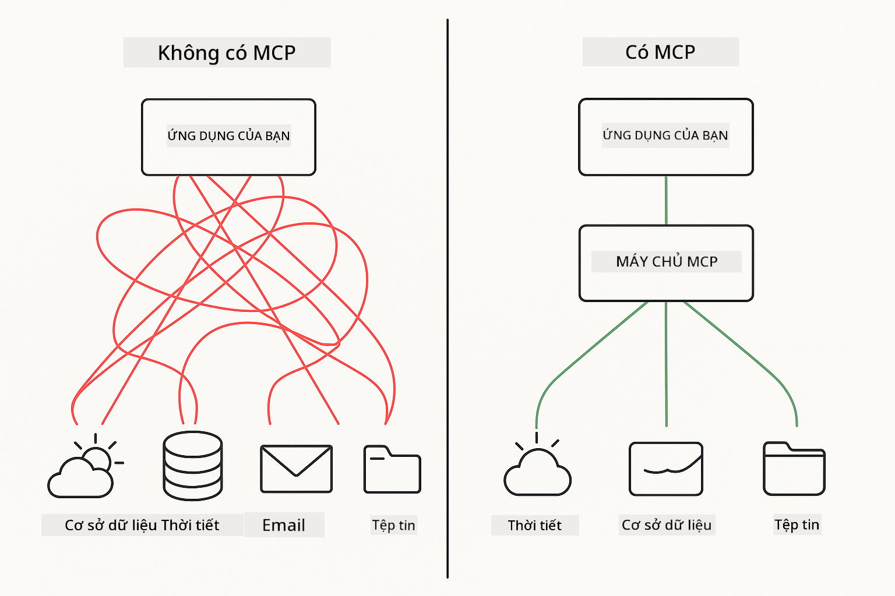
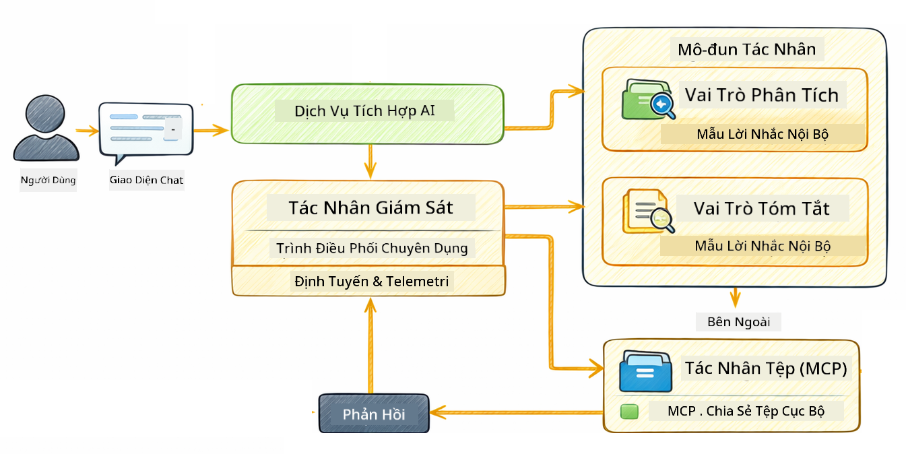

<!--
CO_OP_TRANSLATOR_METADATA:
{
  "original_hash": "f89f4c106d110e4943c055dd1a2f1dff",
  "translation_date": "2025-12-31T02:46:31+00:00",
  "source_file": "05-mcp/README.md",
  "language_code": "vi"
}
-->
# Module 05: Model Context Protocol (MCP)

## Table of Contents

- [Những gì bạn sẽ học](../../../05-mcp)
- [MCP là gì?](../../../05-mcp)
- [MCP hoạt động như thế nào](../../../05-mcp)
- [Mô-đun Agentic](../../../05-mcp)
- [Chạy các ví dụ](../../../05-mcp)
  - [Yêu cầu trước](../../../05-mcp)
- [Bắt đầu nhanh](../../../05-mcp)
  - [Thao tác tệp (Stdio)](../../../05-mcp)
  - [Supervisor Agent](../../../05-mcp)
    - [Hiểu kết quả đầu ra](../../../05-mcp)
    - [Giải thích các tính năng của mô-đun Agentic](../../../05-mcp)
- [Khái niệm chính](../../../05-mcp)
- [Chúc mừng!](../../../05-mcp)
  - [Tiếp theo là gì?](../../../05-mcp)

## What You'll Learn

Bạn đã xây dựng AI hội thoại, làm chủ prompts, gắn kết phản hồi trong tài liệu và tạo các agent với công cụ. Nhưng tất cả những công cụ đó đều được xây dựng tùy chỉnh cho ứng dụng cụ thể của bạn. Nếu bạn có thể cung cấp cho AI quyền truy cập vào một hệ sinh thái công cụ chuẩn mà bất kỳ ai cũng có thể tạo và chia sẻ thì sao? Trong module này, bạn sẽ học cách làm điều đó với Model Context Protocol (MCP) và mô-đun agentic của LangChain4j. Chúng tôi trước tiên trình bày một trình đọc tệp MCP đơn giản và sau đó cho thấy cách nó dễ dàng tích hợp vào các luồng công việc agentic nâng cao bằng mẫu Supervisor Agent.

## What is MCP?

Model Context Protocol (MCP) cung cấp chính xác điều đó - một cách chuẩn để các ứng dụng AI khám phá và sử dụng các công cụ bên ngoài. Thay vì viết tích hợp tùy chỉnh cho từng nguồn dữ liệu hoặc dịch vụ, bạn kết nối với các máy chủ MCP mà công bố khả năng của chúng theo một định dạng nhất quán. Agent AI của bạn sau đó có thể tự động khám phá và sử dụng các công cụ này.



*Trước MCP: Tích hợp phức tạp điểm-điểm. Sau MCP: Một giao thức, vô vàn khả năng.*

MCP giải quyết một vấn đề cơ bản trong phát triển AI: mọi tích hợp đều là tùy chỉnh. Muốn truy cập GitHub? Mã tùy chỉnh. Muốn đọc tệp? Mã tùy chỉnh. Muốn truy vấn cơ sở dữ liệu? Mã tùy chỉnh. Và không tích hợp nào trong số này làm việc với các ứng dụng AI khác.

MCP tiêu chuẩn hóa điều này. Một máy chủ MCP công bố các công cụ với mô tả rõ ràng và schema tham số. Bất kỳ client MCP nào cũng có thể kết nối, khám phá các công cụ có sẵn và sử dụng chúng. Xây dựng một lần, dùng khắp nơi.


*Kiến trúc Model Context Protocol - khám phá và thực thi công cụ được chuẩn hóa*

## How MCP Works

**Server-Client Architecture**

MCP sử dụng mô hình client-server. Các server cung cấp công cụ - đọc tệp, truy vấn cơ sở dữ liệu, gọi API. Các client (ứng dụng AI của bạn) kết nối tới server và sử dụng công cụ của chúng.

Để sử dụng MCP với LangChain4j, thêm dependency Maven sau:

```xml
<dependency>
    <groupId>dev.langchain4j</groupId>
    <artifactId>langchain4j-mcp</artifactId>
    <version>${langchain4j.version}</version>
</dependency>
```

**Tool Discovery**

Khi client của bạn kết nối tới một máy chủ MCP, nó hỏi "Bạn có công cụ gì?" Máy chủ trả lời với danh sách các công cụ có sẵn, mỗi công cụ có mô tả và schema tham số. Agent AI của bạn sau đó có thể quyết định các công cụ nào cần dùng dựa trên yêu cầu của người dùng.

**Transport Mechanisms**

MCP hỗ trợ các cơ chế truyền tải khác nhau. Module này minh họa transport Stdio cho các tiến trình cục bộ:


*Cơ chế truyền tải MCP: HTTP cho máy chủ từ xa, Stdio cho tiến trình cục bộ*

**Stdio** - [StdioTransportDemo.java](../../../05-mcp/src/main/java/com/example/langchain4j/mcp/StdioTransportDemo.java)

Cho các tiến trình cục bộ. Ứng dụng của bạn khởi tạo một server như một subprocess và giao tiếp qua input/output tiêu chuẩn. Hữu ích cho truy cập hệ thống tệp hoặc công cụ dòng lệnh.

```java
McpTransport stdioTransport = new StdioMcpTransport.Builder()
    .command(List.of(
        npmCmd, "exec",
        "@modelcontextprotocol/server-filesystem@2025.12.18",
        resourcesDir
    ))
    .logEvents(false)
    .build();
```

> **🤖 Try with [GitHub Copilot](https://github.com/features/copilot) Chat:** Open [`StdioTransportDemo.java`](../../../05-mcp/src/main/java/com/example/langchain4j/mcp/StdioTransportDemo.java) and ask:
> - "How does Stdio transport work and when should I use it vs HTTP?"
> - "How does LangChain4j manage the lifecycle of spawned MCP server processes?"
> - "What are the security implications of giving AI access to the file system?"

## The Agentic Module

While MCP provides standardized tools, LangChain4j's **agentic module** provides a declarative way to build agents that orchestrate those tools. The `@Agent` annotation and `AgenticServices` let you define agent behavior through interfaces rather than imperative code.

In this module, you'll explore the **Supervisor Agent** pattern — an advanced agentic AI approach where a "supervisor" agent dynamically decides which sub-agents to invoke based on user requests. We'll combine both concepts by giving one of our sub-agents MCP-powered file access capabilities.

To use the agentic module, add this Maven dependency:

```xml
<dependency>
    <groupId>dev.langchain4j</groupId>
    <artifactId>langchain4j-agentic</artifactId>
    <version>${langchain4j.mcp.version}</version>
</dependency>
```

> **⚠️ Experimental:** The `langchain4j-agentic` module is **experimental** and subject to change. The stable way to build AI assistants remains `langchain4j-core` with custom tools (Module 04).

## Running the Examples

### Prerequisites

- Java 21+, Maven 3.9+
- Node.js 16+ and npm (for MCP servers)
- Environment variables configured in `.env` file (from the root directory):
  - **For StdioTransportDemo:** `GITHUB_TOKEN` (GitHub Personal Access Token)
  - **For SupervisorAgentDemo:** `AZURE_OPENAI_ENDPOINT`, `AZURE_OPENAI_API_KEY`, `AZURE_OPENAI_DEPLOYMENT` (same as Modules 01-04)

> **Note:** If you haven't set up your environment variables yet, see [Module 00 - Quick Start](../00-quick-start/README.md) for instructions, or copy `.env.example` to `.env` in the root directory and fill in your values.

## Quick Start

**Using VS Code:** Simply right-click on any demo file in the Explorer and select **"Run Java"**, or use the launch configurations from the Run and Debug panel (make sure you've added your token to the `.env` file first).

**Using Maven:** Alternatively, you can run from the command line with the examples below.

### File Operations (Stdio)

This demonstrates local subprocess-based tools.

**✅ No prerequisites needed** - the MCP server is spawned automatically.

**Using VS Code:** Right-click on `StdioTransportDemo.java` and select **"Run Java"**.

**Using Maven:**

**Bash:**
```bash
export GITHUB_TOKEN=your_token_here
cd 05-mcp
mvn compile exec:java -Dexec.mainClass=com.example.langchain4j.mcp.StdioTransportDemo
```

**PowerShell:**
```powershell
$env:GITHUB_TOKEN=your_token_here
cd 05-mcp
mvn --% compile exec:java -Dexec.mainClass=com.example.langchain4j.mcp.StdioTransportDemo
```

The application spawns a filesystem MCP server automatically and reads a local file. Notice how the subprocess management is handled for you.

**Expected output:**
```
Assistant response: The file provides an overview of LangChain4j, an open-source Java library
for integrating Large Language Models (LLMs) into Java applications...
```

### Supervisor Agent




The **Supervisor Agent pattern** is a **flexible** form of agentic AI. Unlike deterministic workflows (sequential, loop, parallel), a Supervisor uses an LLM to autonomously decide which agents to invoke based on the user's request.

**Combining Supervisor with MCP:** In this example, we give the `FileAgent` access to MCP file system tools via `toolProvider(mcpToolProvider)`. When a user asks to "read and analyze a file," the Supervisor analyzes the request and generates an execution plan. It then routes the request to `FileAgent`, which uses MCP's `read_file` tool to retrieve the content. The Supervisor passes that content to `AnalysisAgent` for interpretation, and optionally invokes `SummaryAgent` to condense the results.

This demonstrates how MCP tools integrate seamlessly into agentic workflows — the Supervisor doesn't need to know *how* files are read, only that `FileAgent` can do it. The Supervisor adapts dynamically to different types of requests and returns either the last agent's response or a summary of all operations.

**Using the Start Scripts (Recommended):**

The start scripts automatically load environment variables from the root `.env` file:

**Bash:**
```bash
cd 05-mcp
chmod +x start.sh
./start.sh
```

**PowerShell:**
```powershell
cd 05-mcp
.\start.ps1
```

**Using VS Code:** Right-click on `SupervisorAgentDemo.java` and select **"Run Java"** (ensure your `.env` file is configured).

**How the Supervisor Works:**

```java
// Định nghĩa nhiều tác nhân với các khả năng cụ thể
FileAgent fileAgent = AgenticServices.agentBuilder(FileAgent.class)
        .chatModel(model)
        .toolProvider(mcpToolProvider)  // Có các công cụ MCP để thao tác tệp
        .build();

AnalysisAgent analysisAgent = AgenticServices.agentBuilder(AnalysisAgent.class)
        .chatModel(model)
        .build();

SummaryAgent summaryAgent = AgenticServices.agentBuilder(SummaryAgent.class)
        .chatModel(model)
        .build();

// Tạo một bộ giám sát điều phối các tác nhân này
SupervisorAgent supervisor = AgenticServices.supervisorBuilder()
        .chatModel(model)  // Mô hình "planner"
        .subAgents(fileAgent, analysisAgent, summaryAgent)
        .responseStrategy(SupervisorResponseStrategy.SUMMARY)
        .build();

// Supervisor tự động quyết định tác nhân nào sẽ được gọi
// Chỉ cần truyền một yêu cầu bằng ngôn ngữ tự nhiên - LLM sẽ lập kế hoạch thực thi
String response = supervisor.invoke("Read the file at /path/file.txt and analyze it");
```

See [SupervisorAgentDemo.java](../../../05-mcp/src/main/java/com/example/langchain4j/mcp/SupervisorAgentDemo.java) for the complete implementation.

> **🤖 Try with [GitHub Copilot](https://github.com/features/copilot) Chat:** Open [`SupervisorAgentDemo.java`](../../../05-mcp/src/main/java/com/example/langchain4j/mcp/SupervisorAgentDemo.java) and ask:
> - "How does the Supervisor decide which agents to invoke?"
> - "What's the difference between Supervisor and Sequential workflow patterns?"
> - "How can I customize the Supervisor's planning behavior?"

#### Understanding the Output

When you run the demo, you'll see a structured walkthrough of how the Supervisor orchestrates multiple agents. Here's what each section means:

```
======================================================================
  SUPERVISOR AGENT DEMO
======================================================================

This demo shows how a Supervisor Agent orchestrates multiple specialized agents.
The Supervisor uses an LLM to decide which agent to call based on the task.
```

**The header** introduces the demo and explains the core concept: the Supervisor uses an LLM (not hardcoded rules) to decide which agents to call.

```
--- AVAILABLE AGENTS -------------------------------------------------
  [FILE]     FileAgent     - Reads files using MCP filesystem tools
  [ANALYZE]  AnalysisAgent - Analyzes content for structure, tone, and themes
  [SUMMARY]  SummaryAgent  - Creates concise summaries of content
```

**Available Agents** shows the three specialized agents the Supervisor can choose from. Each agent has a specific capability:
- **FileAgent** can read files using MCP tools (external capability)
- **AnalysisAgent** analyzes content (pure LLM capability)
- **SummaryAgent** creates summaries (pure LLM capability)

```
--- USER REQUEST -----------------------------------------------------
  "Read the file at .../file.txt and analyze what it's about"
```

**User Request** shows what was asked. The Supervisor must parse this and decide which agents to invoke.

```
--- SUPERVISOR ORCHESTRATION -----------------------------------------
  The Supervisor will now decide which agents to invoke and in what order...

  +-- STEP 1: Supervisor chose -> FileAgent (reading file via MCP)
  |
  |   Input: .../file.txt
  |
  |   Result: LangChain4j is an open-source Java library designed to simplify...
  +-- [OK] FileAgent (reading file via MCP) completed

  +-- STEP 2: Supervisor chose -> AnalysisAgent (analyzing content)
  |
  |   Input: LangChain4j is an open-source Java library...
  |
  |   Result: Structure: The content is organized into clear paragraphs that int...
  +-- [OK] AnalysisAgent (analyzing content) completed
```

**Supervisor Orchestration** is where the magic happens. Watch how:
1. The Supervisor **chose FileAgent first** because the request mentioned "read the file"
2. FileAgent used MCP's `read_file` tool to retrieve the file contents
3. The Supervisor then **chose AnalysisAgent** and passed the file contents to it
4. AnalysisAgent analyzed the structure, tone, and themes

Notice the Supervisor made these decisions **autonomously** based on the user's request — no hardcoded workflow!

**Final Response** is the Supervisor's synthesized answer, combining outputs from all agents it invoked. The example dumps the agentic scope showing the summary and analysis results stored by each agent.

```
--- FINAL RESPONSE ---------------------------------------------------
I read the contents of the file and analyzed its structure, tone, and key themes.
The file introduces LangChain4j as an open-source Java library for integrating
large language models...

--- AGENTIC SCOPE (Shared Memory) ------------------------------------
  Agents store their results in a shared scope for other agents to use:
  * summary: LangChain4j is an open-source Java library...
  * analysis: Structure: The content is organized into clear paragraphs that in...
```

### Explanation of Agentic Module Features

The example demonstrates several advanced features of the agentic module. Let's have a closer look at Agentic Scope and Agent Listeners.

**Agentic Scope** shows the shared memory where agents stored their results using `@Agent(outputKey="...")`. This allows:
- Later agents to access earlier agents' outputs
- The Supervisor to synthesize a final response
- You to inspect what each agent produced

```java
ResultWithAgenticScope<String> result = supervisor.invokeWithAgenticScope(request);
AgenticScope scope = result.agenticScope();
String story = scope.readState("story");
List<AgentInvocation> history = scope.agentInvocations("analysisAgent");
```

**Agent Listeners** enable monitoring and debugging of agent execution. The step-by-step output you see in the demo comes from an AgentListener that hooks into each agent invocation:
- **beforeAgentInvocation** - Called when the Supervisor selects an agent, letting you see which agent was chosen and why
- **afterAgentInvocation** - Called when an agent completes, showing its result
- **inheritedBySubagents** - When true, the listener monitors all agents in the hierarchy

```java
AgentListener monitor = new AgentListener() {
    private int step = 0;
    
    @Override
    public void beforeAgentInvocation(AgentRequest request) {
        step++;
        System.out.println("  +-- STEP " + step + ": " + request.agentName());
    }
    
    @Override
    public void afterAgentInvocation(AgentResponse response) {
        System.out.println("  +-- [OK] " + response.agentName() + " completed");
    }
    
    @Override
    public boolean inheritedBySubagents() {
        return true; // Truyền tới tất cả các tác nhân con
    }
};
```

Beyond the Supervisor pattern, the `langchain4j-agentic` module provides several powerful workflow patterns and features:

| Mẫu | Mô tả | Trường hợp sử dụng |
|---------|-------------|----------|
| **Tuần tự (Sequential)** | Thực thi các agent theo thứ tự, đầu ra chuyển sang bước tiếp theo | Pipeline: nghiên cứu → phân tích → báo cáo |
| **Song song (Parallel)** | Chạy các agent đồng thời | Nhiệm vụ độc lập: thời tiết + tin tức + cổ phiếu |
| **Vòng lặp (Loop)** | Lặp lại cho đến khi đạt điều kiện | Đánh giá chất lượng: tinh chỉnh đến khi điểm ≥ 0.8 |
| **Có điều kiện (Conditional)** | Chuyển hướng dựa trên điều kiện | Phân loại → chuyển đến agent chuyên gia |
| **Con người can thiệp (Human-in-the-Loop)** | Thêm các điểm kiểm tra do con người thực hiện | Luồng phê duyệt, rà soát nội dung |

## Key Concepts

**MCP** phù hợp khi bạn muốn tận dụng hệ sinh thái công cụ hiện có, xây dựng công cụ mà nhiều ứng dụng có thể chia sẻ, tích hợp dịch vụ bên thứ ba với giao thức chuẩn, hoặc hoán đổi triển khai công cụ mà không thay đổi mã nguồn.

**Mô-đun Agentic** hoạt động tốt nhất khi bạn muốn định nghĩa agent theo cách khai báo với chú thích `@Agent`, cần điều phối luồng công việc (tuần tự, vòng lặp, song song), ưu tiên thiết kế agent dựa trên interface thay vì mã lệnh, hoặc khi bạn kết hợp nhiều agent chia sẻ đầu ra thông qua `outputKey`.

**Mẫu Supervisor Agent** tỏa sáng khi luồng công việc không thể dự đoán trước và bạn muốn LLM quyết định, khi bạn có nhiều agent chuyên biệt cần điều phối động, khi xây dựng hệ thống hội thoại chuyển hướng tới các khả năng khác nhau, hoặc khi bạn muốn hành vi agent linh hoạt và thích ứng nhất.

## Congratulations!

Bạn đã hoàn thành khóa LangChain4j for Beginners. Bạn đã học được:

- Cách xây dựng AI hội thoại với bộ nhớ (Module 01)
- Các mẫu prompt engineering cho các nhiệm vụ khác nhau (Module 02)
- Gắn kết phản hồi trong tài liệu của bạn bằng RAG (Module 03)
- Tạo các agent AI cơ bản (trợ lý) với công cụ tùy chỉnh (Module 04)
- Tích hợp các công cụ chuẩn hóa với các mô-đun LangChain4j MCP và Agentic (Mô-đun 05)

### Tiếp theo?

Sau khi hoàn thành các mô-đun, hãy khám phá [Hướng dẫn Kiểm thử](../docs/TESTING.md) để xem các khái niệm kiểm thử của LangChain4j trong thực tế.

**Tài nguyên chính thức:**
- [Tài liệu LangChain4j](https://docs.langchain4j.dev/) - Hướng dẫn toàn diện và tài liệu tham khảo API
- [LangChain4j trên GitHub](https://github.com/langchain4j/langchain4j) - Mã nguồn và ví dụ
- [Hướng dẫn LangChain4j](https://docs.langchain4j.dev/tutorials/) - Hướng dẫn từng bước cho các trường hợp sử dụng khác nhau

Cảm ơn bạn đã hoàn thành khóa học này!

---

**Điều hướng:** [← Trước: Mô-đun 04 - Công cụ](../04-tools/README.md) | [Quay lại Trang chính](../README.md)

---

<!-- CO-OP TRANSLATOR DISCLAIMER START -->
Miễn trừ trách nhiệm:
Tài liệu này đã được dịch bằng dịch vụ dịch thuật AI [Co-op Translator](https://github.com/Azure/co-op-translator). Mặc dù chúng tôi cố gắng đảm bảo tính chính xác, xin lưu ý rằng các bản dịch tự động có thể chứa lỗi hoặc không chính xác. Tài liệu gốc bằng ngôn ngữ nguyên bản nên được coi là nguồn chính thức. Đối với thông tin quan trọng, nên sử dụng bản dịch chuyên nghiệp do con người thực hiện. Chúng tôi không chịu trách nhiệm về bất kỳ hiểu lầm hoặc diễn giải sai nào phát sinh từ việc sử dụng bản dịch này.
<!-- CO-OP TRANSLATOR DISCLAIMER END -->