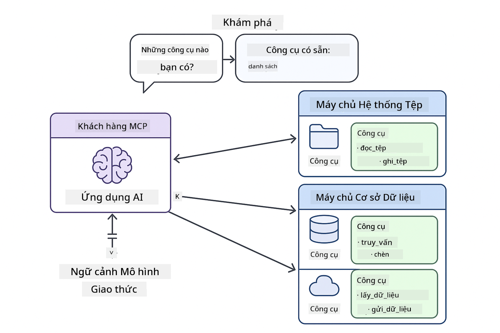

<!--
CO_OP_TRANSLATOR_METADATA:
{
  "original_hash": "c25ec1f10ef156c53e190cdf8b0711ab",
  "translation_date": "2025-12-13T17:59:01+00:00",
  "source_file": "05-mcp/README.md",
  "language_code": "vi"
}
-->
# Module 05: Giao Thức Ngữ Cảnh Mô Hình (MCP)

## Mục Lục

- [Bạn Sẽ Học Gì](../../../05-mcp)
- [Hiểu Về MCP](../../../05-mcp)
- [Cách MCP Hoạt Động](../../../05-mcp)
  - [Kiến Trúc Máy Chủ-Khách](../../../05-mcp)
  - [Khám Phá Công Cụ](../../../05-mcp)
  - [Cơ Chế Vận Chuyển](../../../05-mcp)
- [Yêu Cầu Tiền Đề](../../../05-mcp)
- [Nội Dung Module Này](../../../05-mcp)
- [Bắt Đầu Nhanh](../../../05-mcp)
  - [Ví Dụ 1: Máy Tính Từ Xa (Streamable HTTP)](../../../05-mcp)
  - [Ví Dụ 2: Thao Tác Tệp (Stdio)](../../../05-mcp)
  - [Ví Dụ 3: Phân Tích Git (Docker)](../../../05-mcp)
- [Khái Niệm Chính](../../../05-mcp)
  - [Lựa Chọn Vận Chuyển](../../../05-mcp)
  - [Khám Phá Công Cụ](../../../05-mcp)
  - [Quản Lý Phiên Làm Việc](../../../05-mcp)
  - [Cân Nhắc Đa Nền Tảng](../../../05-mcp)
- [Khi Nào Nên Dùng MCP](../../../05-mcp)
- [Hệ Sinh Thái MCP](../../../05-mcp)
- [Chúc Mừng!](../../../05-mcp)
  - [Tiếp Theo Là Gì?](../../../05-mcp)
- [Khắc Phục Sự Cố](../../../05-mcp)

## Bạn Sẽ Học Gì

Bạn đã xây dựng AI hội thoại, thành thạo các prompt, căn cứ câu trả lời dựa trên tài liệu, và tạo các agent với công cụ. Nhưng tất cả các công cụ đó đều được xây dựng riêng cho ứng dụng cụ thể của bạn. Nếu bạn có thể cho AI của mình truy cập vào một hệ sinh thái công cụ chuẩn hóa mà ai cũng có thể tạo và chia sẻ thì sao?

Giao Thức Ngữ Cảnh Mô Hình (MCP) cung cấp chính xác điều đó - một cách tiêu chuẩn để các ứng dụng AI khám phá và sử dụng các công cụ bên ngoài. Thay vì viết tích hợp tùy chỉnh cho từng nguồn dữ liệu hoặc dịch vụ, bạn kết nối với các máy chủ MCP cung cấp khả năng của họ theo định dạng nhất quán. Agent AI của bạn có thể tự động khám phá và sử dụng các công cụ này.


*Trước MCP: Tích hợp phức tạp điểm-điểm. Sau MCP: Một giao thức, vô vàn khả năng.*

## Hiểu Về MCP

MCP giải quyết một vấn đề cơ bản trong phát triển AI: mỗi tích hợp đều tùy chỉnh. Muốn truy cập GitHub? Mã tùy chỉnh. Muốn đọc tệp? Mã tùy chỉnh. Muốn truy vấn cơ sở dữ liệu? Mã tùy chỉnh. Và không tích hợp nào trong số này hoạt động với các ứng dụng AI khác.

MCP chuẩn hóa điều này. Một máy chủ MCP cung cấp các công cụ với mô tả rõ ràng và sơ đồ. Bất kỳ client MCP nào cũng có thể kết nối, khám phá công cụ có sẵn và sử dụng chúng. Xây dựng một lần, dùng mọi nơi.



*Kiến trúc Giao Thức Ngữ Cảnh Mô Hình - khám phá và thực thi công cụ chuẩn hóa*

## Cách MCP Hoạt Động

**Kiến Trúc Máy Chủ-Khách**

MCP sử dụng mô hình client-server. Máy chủ cung cấp công cụ - đọc tệp, truy vấn cơ sở dữ liệu, gọi API. Client (ứng dụng AI của bạn) kết nối với máy chủ và sử dụng công cụ của họ.

**Khám Phá Công Cụ**

Khi client của bạn kết nối với máy chủ MCP, nó hỏi "Bạn có công cụ gì?" Máy chủ trả lời với danh sách công cụ có sẵn, mỗi công cụ có mô tả và sơ đồ tham số. Agent AI của bạn có thể quyết định công cụ nào dùng dựa trên yêu cầu người dùng.

**Cơ Chế Vận Chuyển**

MCP định nghĩa hai cơ chế vận chuyển: HTTP cho máy chủ từ xa, Stdio cho tiến trình cục bộ (bao gồm container Docker):


*Cơ chế vận chuyển MCP: HTTP cho máy chủ từ xa, Stdio cho tiến trình cục bộ (bao gồm container Docker)*

**Streamable HTTP** - [StreamableHttpDemo.java](../../../05-mcp/src/main/java/com/example/langchain4j/mcp/StreamableHttpDemo.java)

Dành cho máy chủ từ xa. Ứng dụng của bạn gửi yêu cầu HTTP đến máy chủ chạy ở đâu đó trên mạng. Sử dụng Server-Sent Events cho giao tiếp thời gian thực.

```java
McpTransport httpTransport = new StreamableHttpMcpTransport.Builder()
    .url("http://localhost:3001/mcp")
    .timeout(Duration.ofSeconds(60))
    .logRequests(true)
    .logResponses(true)
    .build();
```

> **🤖 Thử với [GitHub Copilot](https://github.com/features/copilot) Chat:** Mở [`StreamableHttpDemo.java`](../../../05-mcp/src/main/java/com/example/langchain4j/mcp/StreamableHttpDemo.java) và hỏi:
> - "MCP khác gì so với tích hợp công cụ trực tiếp như trong Module 04?"
> - "Lợi ích của việc dùng MCP để chia sẻ công cụ giữa các ứng dụng là gì?"
> - "Làm sao xử lý lỗi kết nối hoặc timeout với máy chủ MCP?"

**Stdio** - [StdioTransportDemo.java](../../../05-mcp/src/main/java/com/example/langchain4j/mcp/StdioTransportDemo.java)

Dành cho tiến trình cục bộ. Ứng dụng của bạn khởi tạo máy chủ như một tiến trình con và giao tiếp qua đầu vào/đầu ra chuẩn. Hữu ích cho truy cập hệ thống tệp hoặc công cụ dòng lệnh.

```java
McpTransport stdioTransport = new StdioMcpTransport.Builder()
    .command(List.of(
        npmCmd, "exec",
        "@modelcontextprotocol/server-filesystem@0.6.2",
        resourcesDir
    ))
    .logEvents(false)
    .build();
```

> **🤖 Thử với [GitHub Copilot](https://github.com/features/copilot) Chat:** Mở [`StdioTransportDemo.java`](../../../05-mcp/src/main/java/com/example/langchain4j/mcp/StdioTransportDemo.java) và hỏi:
> - "Cơ chế vận chuyển Stdio hoạt động thế nào và khi nào nên dùng thay vì HTTP?"
> - "LangChain4j quản lý vòng đời tiến trình máy chủ MCP sinh ra thế nào?"
> - "Những rủi ro bảo mật khi cho AI truy cập hệ thống tệp là gì?"

**Docker (dùng Stdio)** - [GitRepositoryAnalyzer.java](../../../05-mcp/src/main/java/com/example/langchain4j/mcp/GitRepositoryAnalyzer.java)

Dành cho dịch vụ container hóa. Dùng vận chuyển stdio để giao tiếp với container Docker qua `docker run`. Tốt cho phụ thuộc phức tạp hoặc môi trường cô lập.

```java
McpTransport dockerTransport = new StdioMcpTransport.Builder()
    .command(List.of(
        "docker", "run",
        "-e", "GITHUB_PERSONAL_ACCESS_TOKEN=" + System.getenv("GITHUB_TOKEN"),
        "-v", volumeMapping,
        "-i", "mcp/git"
    ))
    .logEvents(true)
    .build();
```

> **🤖 Thử với [GitHub Copilot](https://github.com/features/copilot) Chat:** Mở [`GitRepositoryAnalyzer.java`](../../../05-mcp/src/main/java/com/example/langchain4j/mcp/GitRepositoryAnalyzer.java) và hỏi:
> - "Cơ chế vận chuyển Docker cô lập máy chủ MCP thế nào và lợi ích ra sao?"
> - "Làm sao cấu hình mount volume để chia sẻ dữ liệu giữa host và container MCP?"
> - "Thực hành tốt nhất để quản lý vòng đời máy chủ MCP dựa trên Docker trong sản xuất là gì?"

## Chạy Các Ví Dụ

### Yêu Cầu Tiền Đề

- Java 21+, Maven 3.9+
- Node.js 16+ và npm (cho máy chủ MCP)
- **Docker Desktop** - Phải **ĐANG CHẠY** cho Ví dụ 3 (không chỉ cài đặt)
- Token Truy Cập Cá Nhân GitHub được cấu hình trong file `.env` (từ Module 00)

> **Lưu ý:** Nếu bạn chưa thiết lập token GitHub, xem [Module 00 - Bắt Đầu Nhanh](../00-quick-start/README.md) để biết hướng dẫn.

> **⚠️ Người dùng Docker:** Trước khi chạy Ví dụ 3, kiểm tra Docker Desktop đang chạy bằng lệnh `docker ps`. Nếu gặp lỗi kết nối, khởi động Docker Desktop và chờ khoảng 30 giây để khởi tạo.

## Bắt Đầu Nhanh

**Dùng VS Code:** Nhấp chuột phải vào bất kỳ file demo nào trong Explorer và chọn **"Run Java"**, hoặc dùng cấu hình launch từ bảng Run and Debug (đảm bảo bạn đã thêm token vào file `.env` trước).

**Dùng Maven:** Ngoài ra, bạn có thể chạy từ dòng lệnh với các ví dụ dưới đây.

**⚠️ Quan trọng:** Một số ví dụ có yêu cầu tiền đề (như khởi động máy chủ MCP hoặc build image Docker). Kiểm tra yêu cầu từng ví dụ trước khi chạy.

### Ví Dụ 1: Máy Tính Từ Xa (Streamable HTTP)

Ví dụ này minh họa tích hợp công cụ qua mạng.

**⚠️ Yêu cầu:** Bạn cần khởi động máy chủ MCP trước (xem Terminal 1 bên dưới).

**Terminal 1 - Khởi động máy chủ MCP:**

**Bash:**
```bash
git clone https://github.com/modelcontextprotocol/servers.git
cd servers/src/everything
npm install
node dist/streamableHttp.js
```

**PowerShell:**
```powershell
git clone https://github.com/modelcontextprotocol/servers.git
cd servers/src/everything
npm install
node dist/streamableHttp.js
```

**Terminal 2 - Chạy ví dụ:**

**Dùng VS Code:** Nhấp chuột phải vào `StreamableHttpDemo.java` và chọn **"Run Java"**.

**Dùng Maven:**

**Bash:**
```bash
export GITHUB_TOKEN=your_token_here
cd 05-mcp
mvn compile exec:java -Dexec.mainClass=com.example.langchain4j.mcp.StreamableHttpDemo
```

**PowerShell:**
```powershell
$env:GITHUB_TOKEN=your_token_here
cd 05-mcp
mvn --% compile exec:java -Dexec.mainClass=com.example.langchain4j.mcp.StreamableHttpDemo
```

Quan sát agent khám phá công cụ có sẵn, sau đó dùng máy tính để thực hiện phép cộng.

### Ví Dụ 2: Thao Tác Tệp (Stdio)

Ví dụ này minh họa công cụ dựa trên tiến trình con cục bộ.

**✅ Không cần yêu cầu tiền đề** - máy chủ MCP được sinh tự động.

**Dùng VS Code:** Nhấp chuột phải vào `StdioTransportDemo.java` và chọn **"Run Java"**.

**Dùng Maven:**

**Bash:**
```bash
export GITHUB_TOKEN=your_token_here
cd 05-mcp
mvn compile exec:java -Dexec.mainClass=com.example.langchain4j.mcp.StdioTransportDemo
```

**PowerShell:**
```powershell
$env:GITHUB_TOKEN=your_token_here
cd 05-mcp
mvn --% compile exec:java -Dexec.mainClass=com.example.langchain4j.mcp.StdioTransportDemo
```

Ứng dụng tự động sinh máy chủ MCP hệ thống tệp và đọc một tệp cục bộ. Chú ý cách quản lý tiến trình con được xử lý cho bạn.

**Kết quả mong đợi:**
```
Assistant response: The content of the file is "Kaboom!".
```

### Ví Dụ 3: Phân Tích Git (Docker)

Ví dụ này minh họa máy chủ công cụ container hóa.

**⚠️ Yêu cầu:** 
1. **Docker Desktop phải ĐANG CHẠY** (không chỉ cài đặt)
2. **Người dùng Windows:** Khuyến nghị chế độ WSL 2 (Docker Desktop Settings → General → "Use the WSL 2 based engine"). Chế độ Hyper-V cần cấu hình chia sẻ tệp thủ công.
3. Bạn cần build image Docker trước (xem Terminal 1 bên dưới)

**Kiểm tra Docker đang chạy:**

**Bash:**
```bash
docker ps  # Nên hiển thị danh sách container, không phải lỗi
```

**PowerShell:**
```powershell
docker ps  # Nên hiển thị danh sách container, không phải lỗi
```

Nếu bạn thấy lỗi như "Cannot connect to Docker daemon" hoặc "The system cannot find the file specified", hãy khởi động Docker Desktop và chờ khởi tạo (~30 giây).

**Khắc phục sự cố:**
- Nếu AI báo kho lưu trữ trống hoặc không có tệp, mount volume (`-v`) không hoạt động.
- **Người dùng Windows Hyper-V:** Thêm thư mục dự án vào Docker Desktop Settings → Resources → File sharing, sau đó khởi động lại Docker Desktop.
- **Giải pháp khuyến nghị:** Chuyển sang chế độ WSL 2 để chia sẻ tệp tự động (Settings → General → bật "Use the WSL 2 based engine").

**Terminal 1 - Build image Docker:**

**Bash:**
```bash
cd servers/src/git
docker build -t mcp/git .
```

**PowerShell:**
```powershell
cd servers/src/git
docker build -t mcp/git .
```

**Terminal 2 - Chạy trình phân tích:**

**Dùng VS Code:** Nhấp chuột phải vào `GitRepositoryAnalyzer.java` và chọn **"Run Java"**.

**Dùng Maven:**

**Bash:**
```bash
export GITHUB_TOKEN=your_token_here
cd 05-mcp
mvn compile exec:java -Dexec.mainClass=com.example.langchain4j.mcp.GitRepositoryAnalyzer
```

**PowerShell:**
```powershell
$env:GITHUB_TOKEN=your_token_here
cd 05-mcp
mvn --% compile exec:java -Dexec.mainClass=com.example.langchain4j.mcp.GitRepositoryAnalyzer
```

Ứng dụng khởi chạy container Docker, mount kho lưu trữ của bạn, và phân tích cấu trúc cùng nội dung kho qua agent AI.

## Khái Niệm Chính

**Lựa Chọn Vận Chuyển**

Chọn dựa trên nơi công cụ của bạn tồn tại:
- Dịch vụ từ xa → Streamable HTTP
- Hệ thống tệp cục bộ → Stdio
- Phụ thuộc phức tạp → Docker

**Khám Phá Công Cụ**

Client MCP tự động khám phá công cụ có sẵn khi kết nối. Agent AI của bạn thấy mô tả công cụ và quyết định dùng công cụ nào dựa trên yêu cầu người dùng.

**Quản Lý Phiên Làm Việc**

Vận chuyển Streamable HTTP duy trì phiên làm việc, cho phép tương tác có trạng thái với máy chủ từ xa. Vận chuyển Stdio và Docker thường không trạng thái.

**Cân Nhắc Đa Nền Tảng**

Các ví dụ xử lý khác biệt nền tảng tự động (khác biệt lệnh Windows vs Unix, chuyển đổi đường dẫn cho Docker). Điều này quan trọng cho triển khai sản xuất trên nhiều môi trường.

## Khi Nào Nên Dùng MCP

**Dùng MCP khi:**
- Bạn muốn tận dụng hệ sinh thái công cụ hiện có
- Xây dựng công cụ mà nhiều ứng dụng sẽ dùng chung
- Tích hợp dịch vụ bên thứ ba với giao thức chuẩn
- Cần thay đổi triển khai công cụ mà không đổi mã

**Dùng công cụ tùy chỉnh (Module 04) khi:**
- Xây dựng chức năng riêng cho ứng dụng
- Hiệu năng là yếu tố quan trọng (MCP có thêm chi phí)
- Công cụ của bạn đơn giản và không tái sử dụng
- Cần kiểm soát hoàn toàn việc thực thi

## Hệ Sinh Thái MCP

Giao Thức Ngữ Cảnh Mô Hình là chuẩn mở với hệ sinh thái ngày càng phát triển:

- Máy chủ MCP chính thức cho các tác vụ phổ biến (hệ thống tệp, Git, cơ sở dữ liệu)
- Máy chủ do cộng đồng đóng góp cho nhiều dịch vụ khác nhau
- Mô tả công cụ và sơ đồ chuẩn hóa
- Tương thích đa framework (hoạt động với bất kỳ client MCP nào)

Sự chuẩn hóa này có nghĩa công cụ xây cho một ứng dụng AI cũng hoạt động với ứng dụng khác, tạo thành hệ sinh thái chia sẻ khả năng.

## Chúc Mừng!

Bạn đã hoàn thành khóa học LangChain4j cho Người Mới Bắt Đầu. Bạn đã học:

- Cách xây dựng AI hội thoại có bộ nhớ (Module 01)
- Mẫu kỹ thuật prompt cho các tác vụ khác nhau (Module 02)
- Căn cứ câu trả lời dựa trên tài liệu với RAG (Module 03)
- Tạo agent AI với công cụ tùy chỉnh (Module 04)
- Tích hợp công cụ chuẩn hóa qua MCP (Module 05)

Bạn đã có nền tảng để xây dựng ứng dụng AI sản xuất. Các khái niệm bạn học áp dụng bất kể framework hay mô hình cụ thể - đó là các mẫu cơ bản trong kỹ thuật AI.

### Tiếp Theo Là Gì?

Sau khi hoàn thành các module, khám phá [Hướng Dẫn Kiểm Thử](../docs/TESTING.md) để xem các khái niệm kiểm thử LangChain4j trong thực tế.

**Tài Nguyên Chính Thức:**
- [Tài liệu LangChain4j](https://docs.langchain4j.dev/) - Hướng dẫn toàn diện và tham khảo API
- [LangChain4j GitHub](https://github.com/langchain4j/langchain4j) - Mã nguồn và ví dụ
- [Hướng dẫn LangChain4j](https://docs.langchain4j.dev/tutorials/) - Hướng dẫn từng bước cho nhiều trường hợp sử dụng

Cảm ơn bạn đã hoàn thành khóa học này!

---

**Điều Hướng:** [← Trước: Module 04 - Công Cụ](../04-tools/README.md) | [Quay Lại Trang Chính](../README.md)

---

## Khắc Phục Sự Cố

### Cú Pháp Lệnh Maven PowerShell
**Vấn đề**: Các lệnh Maven thất bại với lỗi `Unknown lifecycle phase ".mainClass=..."`

**Nguyên nhân**: PowerShell hiểu `=` như toán tử gán biến, làm hỏng cú pháp thuộc tính Maven

**Giải pháp**: Sử dụng toán tử dừng phân tích cú pháp `--%` trước lệnh Maven:

**PowerShell:**
```powershell
mvn --% compile exec:java -Dexec.mainClass=com.example.langchain4j.mcp.StreamableHttpDemo
```

**Bash:**
```bash
mvn compile exec:java -Dexec.mainClass=com.example.langchain4j.mcp.StreamableHttpDemo
```

Toán tử `--%` báo cho PowerShell truyền tất cả các đối số còn lại nguyên văn cho Maven mà không giải thích.

### Vấn đề kết nối Docker

**Vấn đề**: Các lệnh Docker thất bại với thông báo "Cannot connect to Docker daemon" hoặc "The system cannot find the file specified"

**Nguyên nhân**: Docker Desktop không chạy hoặc chưa khởi tạo đầy đủ

**Giải pháp**: 
1. Khởi động Docker Desktop
2. Chờ khoảng ~30 giây để khởi tạo đầy đủ
3. Kiểm tra với `docker ps` (nên hiển thị danh sách container, không phải lỗi)
4. Sau đó chạy ví dụ của bạn

### Gắn kết Volume Docker trên Windows

**Vấn đề**: Trình phân tích kho Git báo kho trống hoặc không có file

**Nguyên nhân**: Gắn kết volume (`-v`) không hoạt động do cấu hình chia sẻ file

**Giải pháp**:
- **Khuyến nghị:** Chuyển sang chế độ WSL 2 (Docker Desktop Settings → General → "Use the WSL 2 based engine")
- **Thay thế (Hyper-V):** Thêm thư mục dự án vào Docker Desktop Settings → Resources → File sharing, sau đó khởi động lại Docker Desktop

---

<!-- CO-OP TRANSLATOR DISCLAIMER START -->
**Tuyên bố từ chối trách nhiệm**:  
Tài liệu này đã được dịch bằng dịch vụ dịch thuật AI [Co-op Translator](https://github.com/Azure/co-op-translator). Mặc dù chúng tôi cố gắng đảm bảo độ chính xác, xin lưu ý rằng bản dịch tự động có thể chứa lỗi hoặc không chính xác. Tài liệu gốc bằng ngôn ngữ gốc của nó nên được coi là nguồn chính xác và đáng tin cậy. Đối với thông tin quan trọng, nên sử dụng dịch vụ dịch thuật chuyên nghiệp do con người thực hiện. Chúng tôi không chịu trách nhiệm về bất kỳ sự hiểu lầm hoặc giải thích sai nào phát sinh từ việc sử dụng bản dịch này.
<!-- CO-OP TRANSLATOR DISCLAIMER END -->