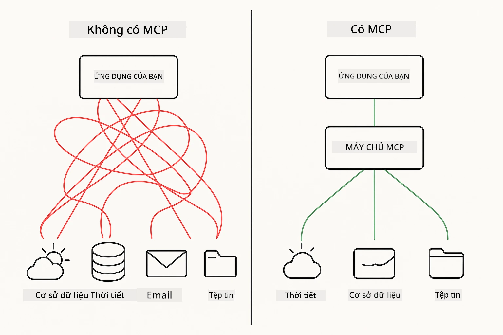
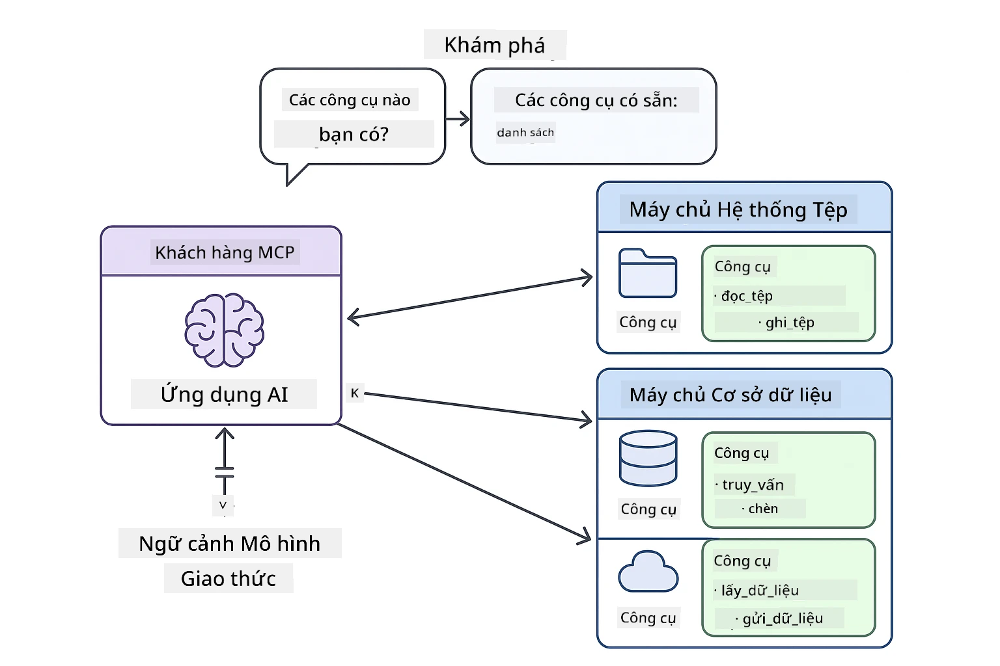
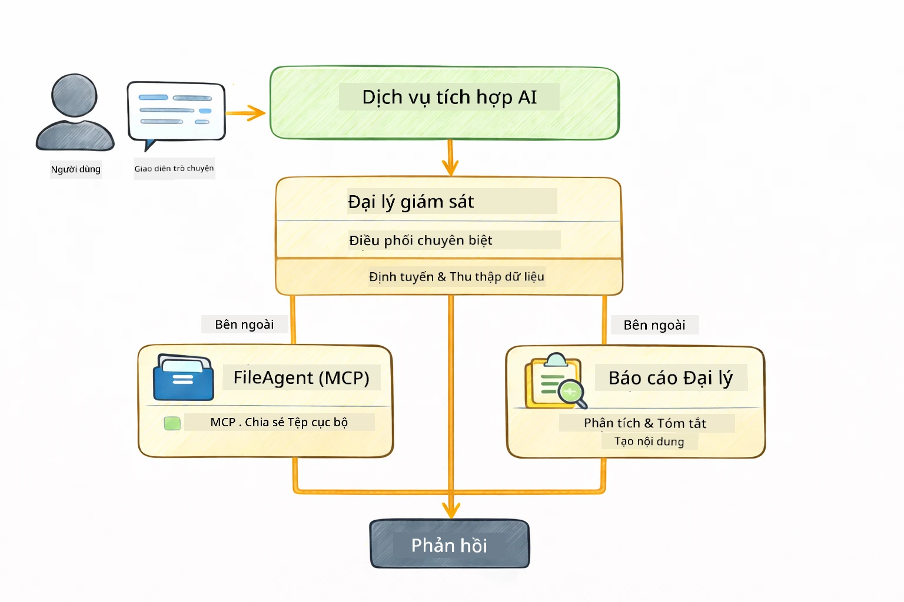

<!--
CO_OP_TRANSLATOR_METADATA:
{
  "original_hash": "6c816d130a1fa47570c11907e72d84ae",
  "translation_date": "2026-01-06T00:15:14+00:00",
  "source_file": "05-mcp/README.md",
  "language_code": "vi"
}
-->
# Module 05: Giao thức Ngữ cảnh Mô hình (MCP)

## Mục lục

- [Bạn sẽ học gì](../../../05-mcp)
- [MCP là gì?](../../../05-mcp)
- [Cách MCP hoạt động](../../../05-mcp)
- [Module Agentic](../../../05-mcp)
- [Chạy các ví dụ](../../../05-mcp)
  - [Yêu cầu trước](../../../05-mcp)
- [Bắt đầu nhanh](../../../05-mcp)
  - [Thao tác tệp (Stdio)](../../../05-mcp)
  - [Agent Giám sát](../../../05-mcp)
    - [Hiểu về kết quả đầu ra](../../../05-mcp)
    - [Chiến lược phản hồi](../../../05-mcp)
    - [Giải thích các tính năng của Module Agentic](../../../05-mcp)
- [Khái niệm chính](../../../05-mcp)
- [Chúc mừng!](../../../05-mcp)
  - [Tiếp theo là gì?](../../../05-mcp)

## Bạn sẽ học gì

Bạn đã xây dựng AI hội thoại, thành thạo các prompt, căn cứ câu trả lời dựa trên tài liệu và tạo các agent sử dụng công cụ. Nhưng tất cả các công cụ đó đều được xây dựng tùy chỉnh cho ứng dụng cụ thể của bạn. Nếu bạn có thể cho AI của mình truy cập vào một hệ sinh thái chuẩn hóa các công cụ mà ai cũng có thể tạo và chia sẻ thì sao? Trong module này, bạn sẽ học cách làm điều đó với Giao thức Ngữ cảnh Mô hình (MCP) và module agentic của LangChain4j. Chúng tôi trình bày đầu tiên một trình đọc tập tin MCP đơn giản và sau đó chỉ ra cách nó tích hợp dễ dàng vào các quy trình agentic nâng cao bằng cách sử dụng mẫu Agent Giám sát.

## MCP là gì?

Giao thức Ngữ cảnh Mô hình (MCP) cung cấp chính xác điều đó - một cách chuẩn hóa để các ứng dụng AI khám phá và sử dụng các công cụ bên ngoài. Thay vì viết tích hợp tùy chỉnh cho từng nguồn dữ liệu hoặc dịch vụ, bạn kết nối với các máy chủ MCP vốn công bố khả năng của họ theo định dạng nhất quán. Sau đó, agent AI của bạn có thể tự động phát hiện và sử dụng các công cụ này.



*Trước MCP: Tích hợp điểm-điểm phức tạp. Sau MCP: Một giao thức, vô vàn khả năng.*

MCP giải quyết vấn đề nền tảng trong phát triển AI: mỗi tích hợp đều tùy chỉnh. Muốn truy cập GitHub? Code tùy chỉnh. Muốn đọc tập tin? Code tùy chỉnh. Muốn truy vấn cơ sở dữ liệu? Code tùy chỉnh. Và chẳng tích hợp nào trong số đó hoạt động với các ứng dụng AI khác.

MCP chuẩn hóa điều này. Một máy chủ MCP công bố công cụ với mô tả rõ ràng và schema. Bất kỳ client MCP nào cũng có thể kết nối, khám phá công cụ có sẵn và sử dụng chúng. Xây dựng một lần, dùng mọi nơi.



*Kiến trúc Giao thức Ngữ cảnh Mô hình — phát hiện và thực thi công cụ chuẩn hóa*

## Cách MCP hoạt động

**Kiến trúc Server-Client**

MCP sử dụng mô hình client-server. Các máy chủ cung cấp công cụ – đọc tập tin, truy vấn cơ sở dữ liệu, gọi API. Các client (ứng dụng AI của bạn) kết nối đến máy chủ và sử dụng công cụ của họ.

Để dùng MCP với LangChain4j, thêm phụ thuộc Maven này:

```xml
<dependency>
    <groupId>dev.langchain4j</groupId>
    <artifactId>langchain4j-mcp</artifactId>
    <version>${langchain4j.version}</version>
</dependency>
```

**Khám phá Công cụ**

Khi client của bạn kết nối máy chủ MCP, nó hỏi "Bạn có công cụ gì?" Máy chủ trả lời bằng danh sách công cụ có sẵn, mỗi công cụ kèm mô tả và schema tham số. Agent AI của bạn sau đó quyết định công cụ nào cần dùng dựa trên yêu cầu người dùng.

**Cơ chế truyền tải**

MCP hỗ trợ các cơ chế truyền tải khác nhau. Module này minh họa truyền tải Stdio cho các tiến trình cục bộ:


*Cơ chế truyền tải MCP: HTTP cho máy chủ từ xa, Stdio cho tiến trình cục bộ*

**Stdio** - [StdioTransportDemo.java](../../../05-mcp/src/main/java/com/example/langchain4j/mcp/StdioTransportDemo.java)

Dùng cho tiến trình cục bộ. Ứng dụng của bạn tạo một máy chủ làm tiến trình phụ và giao tiếp qua đầu vào/ra tiêu chuẩn. Hữu ích cho truy cập hệ thống tập tin hoặc công cụ dòng lệnh.

```java
McpTransport stdioTransport = new StdioMcpTransport.Builder()
    .command(List.of(
        npmCmd, "exec",
        "@modelcontextprotocol/server-filesystem@2025.12.18",
        resourcesDir
    ))
    .logEvents(false)
    .build();
```

> **🤖 Thử với Chat [GitHub Copilot](https://github.com/features/copilot):** Mở [`StdioTransportDemo.java`](../../../05-mcp/src/main/java/com/example/langchain4j/mcp/StdioTransportDemo.java) và hỏi:
> - "Truyền tải Stdio hoạt động thế nào và khi nào tôi nên dùng nó thay vì HTTP?"
> - "LangChain4j quản lý vòng đời tiến trình máy chủ MCP được sinh ra thế nào?"
> - "Các vấn đề bảo mật khi cho AI truy cập hệ thống tập tin là gì?"

## Module Agentic

Trong khi MCP cung cấp công cụ chuẩn hóa, module **agentic** của LangChain4j cung cấp cách khai báo để xây dựng các agent điều phối công cụ đó. Chú thích `@Agent` và `AgenticServices` cho phép bạn định nghĩa hành vi agent qua giao diện thay vì code mệnh lệnh.

Trong module này, bạn sẽ khám phá mẫu **Agent Giám sát** — một cách tiếp cận agentic AI tiên tiến, trong đó agent “giám sát” tự động quyết định agent con nào được kích hoạt dựa trên yêu cầu người dùng. Chúng tôi kết hợp cả hai khái niệm bằng cách cho một agent con khả năng truy cập tập tin dựa trên MCP.

Để dùng module agentic, thêm phụ thuộc Maven này:

```xml
<dependency>
    <groupId>dev.langchain4j</groupId>
    <artifactId>langchain4j-agentic</artifactId>
    <version>${langchain4j.mcp.version}</version>
</dependency>
```

> **⚠️ Thí nghiệm:** Module `langchain4j-agentic` là **thí nghiệm** và có thể thay đổi. Cách ổn định để xây trợ lý AI vẫn là `langchain4j-core` với công cụ tùy chỉnh (Module 04).

## Chạy các ví dụ

### Yêu cầu trước

- Java 21+, Maven 3.9+
- Node.js 16+ và npm (cho máy chủ MCP)
- Biến môi trường cấu hình trong file `.env` (từ thư mục gốc):
  - `AZURE_OPENAI_ENDPOINT`, `AZURE_OPENAI_API_KEY`, `AZURE_OPENAI_DEPLOYMENT` (như Modules 01-04)

> **Lưu ý:** Nếu bạn chưa thiết lập biến môi trường, xem [Module 00 - Bắt đầu nhanh](../00-quick-start/README.md) để hướng dẫn, hoặc sao chép `.env.example` thành `.env` trong thư mục gốc và điền giá trị của bạn.

## Bắt đầu nhanh

**Dùng VS Code:** Bạn chỉ cần nhấp chuột phải vào bất kỳ file demo nào trong Explorer và chọn **"Run Java"**, hoặc dùng cấu hình khởi chạy từ bảng Run and Debug (đảm bảo bạn đã thêm token vào file `.env` trước).

**Dùng Maven:** Ngoài ra, bạn có thể chạy từ dòng lệnh với các ví dụ dưới đây.

### Thao tác tệp (Stdio)

Minh họa công cụ dựa trên tiến trình phụ cục bộ.

**✅ Không cần yêu cầu trước** - máy chủ MCP tự động được sinh.

**Dùng các script khởi động (Khuyến nghị):**

Các script tự động tải biến môi trường từ file `.env` gốc:

**Bash:**
```bash
cd 05-mcp
chmod +x start-stdio.sh
./start-stdio.sh
```

**PowerShell:**
```powershell
cd 05-mcp
.\start-stdio.ps1
```

**Dùng VS Code:** Nhấp chuột phải vào `StdioTransportDemo.java` và chọn **"Run Java"** (đảm bảo file `.env` bạn được cấu hình).

Ứng dụng tự động sinh máy chủ MCP hệ thống tập tin và đọc tập tin cục bộ. Chú ý cách quản lý tiến trình được xử lý cho bạn.

**Kết quả dự kiến:**
```
Assistant response: The file provides an overview of LangChain4j, an open-source Java library
for integrating Large Language Models (LLMs) into Java applications...
```

### Agent Giám sát

Mẫu **Agent Giám sát** là hình thức **linh hoạt** của agentic AI. Một Supervisor dùng LLM để tự động quyết định agent nào gọi dựa trên yêu cầu người dùng. Trong ví dụ tiếp theo, chúng tôi kết hợp truy cập tập tin qua MCP với agent LLM để tạo luồng đọc tập tin có giám sát → báo cáo.

Trong demo, `FileAgent` đọc tập tin dùng công cụ MCP hệ thống tập tin, và `ReportAgent` tạo báo cáo có cấu trúc với bản tóm tắt điều hành (1 câu), 3 điểm chính và khuyến nghị. Supervisor tự động điều phối luồng này:



```
┌─────────────┐      ┌──────────────┐
│  FileAgent  │ ───▶ │ ReportAgent  │
│ (MCP tools) │      │  (pure LLM)  │
└─────────────┘      └──────────────┘
   outputKey:           outputKey:
  'fileContent'         'report'
```

Mỗi agent lưu kết quả của nó trong **Agentic Scope** (bộ nhớ chia sẻ), cho phép các agent tiếp theo truy cập kết quả trước đó. Điều này minh họa cách công cụ MCP tích hợp mượt mà vào quy trình agentic — Supervisor không cần biết *cách* các tập tin được đọc, chỉ cần biết `FileAgent` làm được điều đó.

#### Chạy Demo

Các script tự động tải biến môi trường từ file `.env` gốc:

**Bash:**
```bash
cd 05-mcp
chmod +x start-supervisor.sh
./start-supervisor.sh
```

**PowerShell:**
```powershell
cd 05-mcp
.\start-supervisor.ps1
```

**Dùng VS Code:** Nhấp chuột phải vào `SupervisorAgentDemo.java` và chọn **"Run Java"** (đảm bảo file `.env` bạn được cấu hình).

#### Cách Supervisor hoạt động

```java
// Bước 1: FileAgent đọc các tệp tin sử dụng công cụ MCP
FileAgent fileAgent = AgenticServices.agentBuilder(FileAgent.class)
        .chatModel(model)
        .toolProvider(mcpToolProvider)  // Có công cụ MCP để thao tác tệp tin
        .build();

// Bước 2: ReportAgent tạo báo cáo có cấu trúc
ReportAgent reportAgent = AgenticServices.agentBuilder(ReportAgent.class)
        .chatModel(model)
        .build();

// Supervisor điều phối luồng công việc từ tệp tin → báo cáo
SupervisorAgent supervisor = AgenticServices.supervisorBuilder()
        .chatModel(model)
        .subAgents(fileAgent, reportAgent)
        .responseStrategy(SupervisorResponseStrategy.LAST)  // Trả về báo cáo cuối cùng
        .build();

// Supervisor quyết định gọi các agent nào dựa trên yêu cầu
String response = supervisor.invoke("Read the file at /path/file.txt and generate a report");
```

#### Chiến lược phản hồi

Khi bạn cấu hình một `SupervisorAgent`, bạn xác định cách nó sẽ soạn câu trả lời cuối cùng cho người dùng sau khi các agent con hoàn thành nhiệm vụ. Các chiến lược có sẵn là:

| Chiến lược | Mô tả |
|------------|--------|
| **LAST** | Supervisor trả về kết quả của agent con hoặc công cụ cuối cùng được gọi. Đây là lựa chọn hữu ích khi agent cuối cùng trong quy trình được thiết kế đặc biệt để tạo câu trả lời hoàn chỉnh cuối cùng (ví dụ agent "Tóm tắt" trong chuỗi nghiên cứu). |
| **SUMMARY** | Supervisor dùng chính mô hình ngôn ngữ nội bộ để tổng hợp bản tóm tắt toàn bộ tương tác và tất cả kết quả từ các agent con, sau đó trả bản tóm tắt đó làm phản hồi cuối cùng. Điều này cung cấp câu trả lời tổng hợp rõ ràng cho người dùng. |
| **SCORED** | Hệ thống dùng mô hình ngôn ngữ nội bộ để đánh giá cả kết quả LAST và bản tóm tắt SUMMARY của tương tác so với yêu cầu gốc của người dùng, chọn kết quả nào có điểm số cao hơn để trả về. |

Xem [SupervisorAgentDemo.java](../../../05-mcp/src/main/java/com/example/langchain4j/mcp/SupervisorAgentDemo.java) để biết triển khai đầy đủ.

> **🤖 Thử với Chat [GitHub Copilot](https://github.com/features/copilot):** Mở [`SupervisorAgentDemo.java`](../../../05-mcp/src/main/java/com/example/langchain4j/mcp/SupervisorAgentDemo.java) và hỏi:
> - "Supervisor quyết định agent nào được kích hoạt ra sao?"
> - "Sự khác biệt giữa mẫu Supervisor và quy trình Sequential là gì?"
> - "Làm sao tôi có thể tùy chỉnh hành vi lập kế hoạch của Supervisor?"

#### Hiểu về kết quả đầu ra

Khi chạy demo, bạn sẽ thấy một hướng dẫn chi tiết cách Supervisor điều phối nhiều agent. Đây là ý nghĩa từng phần:

```
======================================================================
  FILE → REPORT WORKFLOW DEMO
======================================================================

This demo shows a clear 2-step workflow: read a file, then generate a report.
The Supervisor orchestrates the agents automatically based on the request.
```

**Tiêu đề** giới thiệu khái niệm quy trình: một pipeline tập trung từ đọc tập tin đến tạo báo cáo.

```
--- WORKFLOW ---------------------------------------------------------
  ┌─────────────┐      ┌──────────────┐
  │  FileAgent  │ ───▶ │ ReportAgent  │
  │ (MCP tools) │      │  (pure LLM)  │
  └─────────────┘      └──────────────┘
   outputKey:           outputKey:
   'fileContent'        'report'

--- AVAILABLE AGENTS -------------------------------------------------
  [FILE]   FileAgent   - Reads files via MCP → stores in 'fileContent'
  [REPORT] ReportAgent - Generates structured report → stores in 'report'
```

**Sơ đồ Quy trình** cho thấy luồng dữ liệu giữa các agent. Mỗi agent có vai trò cụ thể:
- **FileAgent** đọc tập tin bằng công cụ MCP và lưu nội dung thô trong `fileContent`
- **ReportAgent** lấy nội dung đó và tạo báo cáo có cấu trúc trong `report`

```
--- USER REQUEST -----------------------------------------------------
  "Read the file at .../file.txt and generate a report on its contents"
```

**Yêu cầu Người dùng** cho thấy nhiệm vụ. Supervisor phân tích và quyết định gọi FileAgent → ReportAgent.

```
--- SUPERVISOR ORCHESTRATION -----------------------------------------
  The Supervisor decides which agents to invoke and passes data between them...

  +-- STEP 1: Supervisor chose -> FileAgent (reading file via MCP)
  |
  |   Input: .../file.txt
  |
  |   Result: LangChain4j is an open-source, provider-agnostic Java framework for building LLM...
  +-- [OK] FileAgent (reading file via MCP) completed

  +-- STEP 2: Supervisor chose -> ReportAgent (generating structured report)
  |
  |   Input: LangChain4j is an open-source, provider-agnostic Java framew...
  |
  |   Result: Executive Summary...
  +-- [OK] ReportAgent (generating structured report) completed
```

**Điều phối bởi Supervisor** biểu diễn luồng 2 bước:
1. **FileAgent** đọc tập tin qua MCP và lưu nội dung
2. **ReportAgent** nhận nội dung và tạo báo cáo có cấu trúc

Supervisor tự đưa ra quyết định **tự động** dựa trên yêu cầu người dùng.

```
--- FINAL RESPONSE ---------------------------------------------------
Executive Summary
...

Key Points
...

Recommendations
...

--- AGENTIC SCOPE (Data Flow) ----------------------------------------
  Each agent stores its output for downstream agents to consume:
  * fileContent: LangChain4j is an open-source, provider-agnostic Java framework...
  * report: Executive Summary...
```

#### Giải thích các tính năng của Module Agentic

Ví dụ minh họa một số tính năng nâng cao của module agentic. Hãy cùng xem kỹ Agentic Scope và Agent Listener.

**Agentic Scope** cho thấy bộ nhớ chia sẻ nơi các agent lưu kết quả bằng cách dùng `@Agent(outputKey="...")`. Điều này cho phép:
- Các agent sau truy cập kết quả agent trước
- Supervisor tổng hợp phản hồi cuối cùng
- Bạn xem xét sản phẩm từng agent

```java
ResultWithAgenticScope<String> result = supervisor.invokeWithAgenticScope(request);
AgenticScope scope = result.agenticScope();
String fileContent = scope.readState("fileContent");  // Dữ liệu tệp thô từ FileAgent
String report = scope.readState("report");            // Báo cáo có cấu trúc từ ReportAgent
```

**Agent Listener** cho phép giám sát và gỡ lỗi thực thi agent. Kết quả từng bước bạn thấy trong demo đến từ một AgentListener gắn vào mỗi lần gọi agent:
- **beforeAgentInvocation** - Gọi khi Supervisor chọn agent, cho thấy agent được chọn và lý do
- **afterAgentInvocation** - Gọi khi agent hoàn thành, hiển thị kết quả
- **inheritedBySubagents** - Khi đúng, listener giám sát tất cả agent trong hệ thống phân cấp

```java
AgentListener monitor = new AgentListener() {
    private int step = 0;
    
    @Override
    public void beforeAgentInvocation(AgentRequest request) {
        step++;
        System.out.println("  +-- STEP " + step + ": " + request.agentName());
    }
    
    @Override
    public void afterAgentInvocation(AgentResponse response) {
        System.out.println("  +-- [OK] " + response.agentName() + " completed");
    }
    
    @Override
    public boolean inheritedBySubagents() {
        return true; // Lan truyền đến tất cả các tác nhân phụ
    }
};
```

Bên cạnh mẫu Supervisor, module `langchain4j-agentic` cung cấp một số mẫu và tính năng quy trình mạnh mẽ:

| Mẫu | Mô tả | Tình huống sử dụng |
|------|-------|--------------------|
| **Sequential** | Thực thi agent theo thứ tự, đầu ra chuyển sang agent kế tiếp | Pipeline: nghiên cứu → phân tích → báo cáo |
| **Parallel** | Chạy đồng thời các agent | Nhiệm vụ độc lập: thời tiết + tin tức + chứng khoán |
| **Loop** | Lặp lại tới khi đạt điều kiện | Đánh giá chất lượng: cải tiến đến khi điểm ≥ 0.8 |
| **Conditional** | Điều hướng theo điều kiện | Phân loại → điều tới agent chuyên biệt |
| **Human-in-the-Loop** | Thêm điểm kiểm tra con người | Quy trình phê duyệt, xem xét nội dung |

## Khái niệm chính

Bây giờ bạn đã khám phá MCP và module agentic trong thực tế, hãy tóm tắt khi nào dùng từng cách tiếp cận.

**MCP** lý tưởng khi bạn muốn tận dụng hệ sinh thái công cụ sẵn có, xây công cụ để nhiều ứng dụng dùng chung, tích hợp dịch vụ bên thứ ba theo giao thức chuẩn, hoặc thay đổi triển khai công cụ mà không đổi code.

**Module Agentic** phù hợp khi bạn muốn định nghĩa agent khai báo qua chú thích `@Agent`, cần điều phối quy trình làm việc (tuần tự, lặp, song song), thích thiết kế agent dựa trên giao diện hơn code mệnh lệnh, hoặc kết hợp nhiều agent chia sẻ đầu ra qua `outputKey`.

**Mẫu Agent Giám sát** nổi bật khi quy trình không dự đoán trước được và bạn muốn LLM quyết định, khi có nhiều agent chuyên biệt cần điều phối động, khi xây hệ thống hội thoại định tuyến tới các năng lực khác nhau, hoặc khi bạn cần hành vi agent linh hoạt và thích nghi nhất.
## Chúc mừng!

Bạn đã hoàn thành khóa học LangChain4j cho Người mới bắt đầu. Bạn đã học được:

- Cách xây dựng AI hội thoại có bộ nhớ (Module 01)
- Các mẫu thiết kế prompt cho các tác vụ khác nhau (Module 02)
- Căn cứ câu trả lời dựa trên tài liệu của bạn với RAG (Module 03)
- Tạo các tác nhân AI cơ bản (trợ lý) với các công cụ tùy chỉnh (Module 04)
- Tích hợp các công cụ chuẩn hóa với các module MCP và Agentic của LangChain4j (Module 05)

### Tiếp theo là gì?

Sau khi hoàn thành các module, hãy khám phá [Hướng dẫn Kiểm thử](../docs/TESTING.md) để xem các khái niệm kiểm thử LangChain4j trong thực tế.

**Tài nguyên chính thức:**
- [Tài liệu LangChain4j](https://docs.langchain4j.dev/) - Hướng dẫn toàn diện và tham chiếu API
- [LangChain4j GitHub](https://github.com/langchain4j/langchain4j) - Mã nguồn và ví dụ
- [Hướng dẫn LangChain4j](https://docs.langchain4j.dev/tutorials/) - Các bài hướng dẫn từng bước cho nhiều trường hợp sử dụng

Cảm ơn bạn đã hoàn thành khóa học này!

---

**Điều hướng:** [← Trước: Module 04 - Công cụ](../04-tools/README.md) | [Quay lại Trang chính](../README.md)

---

<!-- CO-OP TRANSLATOR DISCLAIMER START -->
**Tuyên bố miễn trừ trách nhiệm**:
Tài liệu này đã được dịch bằng dịch vụ dịch thuật AI [Co-op Translator](https://github.com/Azure/co-op-translator). Mặc dù chúng tôi cố gắng đảm bảo độ chính xác, xin lưu ý rằng bản dịch tự động có thể chứa lỗi hoặc thiếu sót. Tài liệu gốc bằng ngôn ngữ gốc của nó được coi là nguồn chính thức. Đối với các thông tin quan trọng, nên sử dụng dịch vụ dịch thuật chuyên nghiệp của con người. Chúng tôi không chịu trách nhiệm về bất kỳ sự hiểu lầm hay giải thích sai nào phát sinh từ việc sử dụng bản dịch này.
<!-- CO-OP TRANSLATOR DISCLAIMER END -->