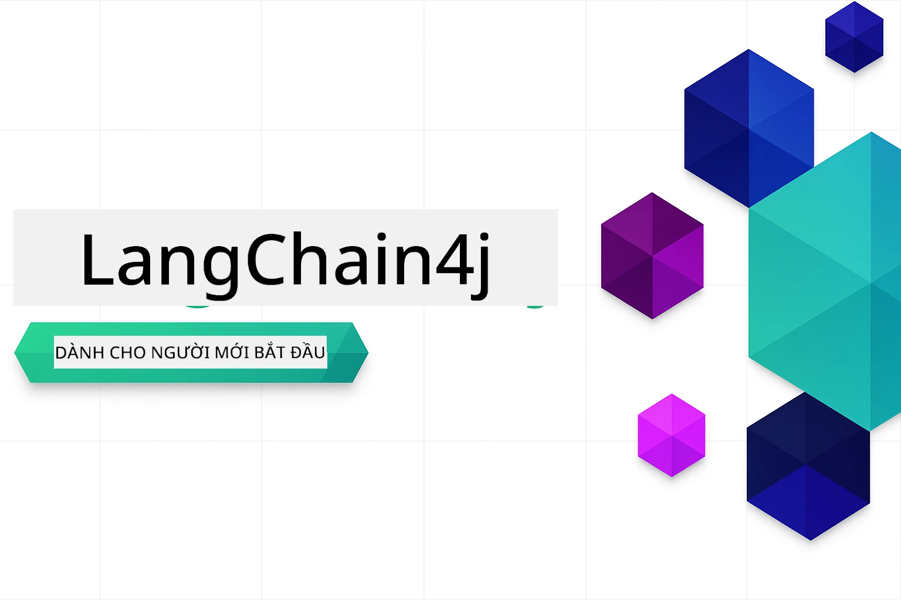

<!--
CO_OP_TRANSLATOR_METADATA:
{
  "original_hash": "7dffae166c7db7dc932a0e3d0217cbb7",
  "translation_date": "2026-01-16T10:58:08+00:00",
  "source_file": "README.md",
  "language_code": "vi"
}
-->


### 🌐 Hỗ trợ Đa Ngôn Ngữ

#### Hỗ trợ qua GitHub Action (Tự động & Luôn Cập Nhật)

<!-- CO-OP TRANSLATOR LANGUAGES TABLE START -->
[Arabic](../ar/README.md) | [Bengali](../bn/README.md) | [Bulgarian](../bg/README.md) | [Burmese (Myanmar)](../my/README.md) | [Chinese (Simplified)](../zh/README.md) | [Chinese (Traditional, Hong Kong)](../hk/README.md) | [Chinese (Traditional, Macau)](../mo/README.md) | [Chinese (Traditional, Taiwan)](../tw/README.md) | [Croatian](../hr/README.md) | [Czech](../cs/README.md) | [Danish](../da/README.md) | [Dutch](../nl/README.md) | [Estonian](../et/README.md) | [Finnish](../fi/README.md) | [French](../fr/README.md) | [German](../de/README.md) | [Greek](../el/README.md) | [Hebrew](../he/README.md) | [Hindi](../hi/README.md) | [Hungarian](../hu/README.md) | [Indonesian](../id/README.md) | [Italian](../it/README.md) | [Japanese](../ja/README.md) | [Kannada](../kn/README.md) | [Korean](../ko/README.md) | [Lithuanian](../lt/README.md) | [Malay](../ms/README.md) | [Malayalam](../ml/README.md) | [Marathi](../mr/README.md) | [Nepali](../ne/README.md) | [Nigerian Pidgin](../pcm/README.md) | [Norwegian](../no/README.md) | [Persian (Farsi)](../fa/README.md) | [Polish](../pl/README.md) | [Portuguese (Brazil)](../br/README.md) | [Portuguese (Portugal)](../pt/README.md) | [Punjabi (Gurmukhi)](../pa/README.md) | [Romanian](../ro/README.md) | [Russian](../ru/README.md) | [Serbian (Cyrillic)](../sr/README.md) | [Slovak](../sk/README.md) | [Slovenian](../sl/README.md) | [Spanish](../es/README.md) | [Swahili](../sw/README.md) | [Swedish](../sv/README.md) | [Tagalog (Filipino)](../tl/README.md) | [Tamil](../ta/README.md) | [Telugu](../te/README.md) | [Thai](../th/README.md) | [Turkish](../tr/README.md) | [Ukrainian](../uk/README.md) | [Urdu](../ur/README.md) | [Vietnamese](./README.md)

> **Thích Clone về Máy Tính Cá Nhân?**

> Kho lưu trữ này bao gồm hơn 50 bản dịch ngôn ngữ, làm tăng đáng kể kích thước tải xuống. Để clone mà không có bản dịch, hãy sử dụng sparse checkout:
> ```bash
> git clone --filter=blob:none --sparse https://github.com/microsoft/LangChain4j-for-Beginners.git
> cd LangChain4j-for-Beginners
> git sparse-checkout set --no-cone '/*' '!translations' '!translated_images'
> ```
> Điều này sẽ cung cấp tất cả những gì bạn cần để hoàn thành khóa học với tốc độ tải xuống nhanh hơn nhiều.
<!-- CO-OP TRANSLATOR LANGUAGES TABLE END -->

# LangChain4j cho Người Mới Bắt Đầu

Một khóa học xây dựng ứng dụng AI với LangChain4j và Azure OpenAI GPT-5, từ chat cơ bản đến các tác nhân AI.

**Mới với LangChain4j?** Xem [Thuật ngữ](docs/GLOSSARY.md) để định nghĩa các thuật ngữ và khái niệm chính.

## Mục Lục

1. [Bắt đầu Nhanh](00-quick-start/README.md) - Bắt đầu với LangChain4j
2. [Giới thiệu](01-introduction/README.md) - Tìm hiểu các kiến thức cơ bản về LangChain4j
3. [Kỹ thuật Prompt](02-prompt-engineering/README.md) - Thành thạo thiết kế prompt hiệu quả
4. [RAG (Tăng cường tạo nội dung)](03-rag/README.md) - Xây dựng hệ thống dựa trên kiến thức thông minh
5. [Công Cụ](04-tools/README.md) - Tích hợp công cụ bên ngoài và trợ lý đơn giản
6. [MCP (Giao thức ngữ cảnh mô hình)](05-mcp/README.md) - Làm việc với Giao thức ngữ cảnh mô hình (MCP) và các module tác nhân
---

## Lộ Trình Học

> **Bắt đầu Nhanh**

1. Fork kho lưu trữ này vào tài khoản GitHub của bạn
2. Nhấn **Code** → tab **Codespaces** → **...** → **Tạo mới với tùy chọn...**
3. Sử dụng mặc định – sẽ chọn container Phát triển được tạo cho khóa học này
4. Nhấn **Tạo codespace**
5. Chờ 5-10 phút để môi trường sẵn sàng
6. Đi thẳng tới [Bắt đầu Nhanh](./00-quick-start/README.md) để bắt đầu!

Sau khi hoàn thành các module, khám phá [Hướng dẫn Kiểm thử](docs/TESTING.md) để xem các khái niệm kiểm thử LangChain4j trong thực tế.

> **Lưu ý:** Khóa đào tạo này sử dụng cả mô hình GitHub và Azure OpenAI. Module [Bắt đầu Nhanh](00-quick-start/README.md) sử dụng mô hình GitHub (không yêu cầu đăng ký Azure), trong khi các module 1-5 sử dụng Azure OpenAI.


## Học cùng GitHub Copilot

Để bắt đầu nhanh lập trình, mở dự án này trong GitHub Codespace hoặc IDE cục bộ của bạn với devcontainer được cung cấp. Devcontainer sử dụng trong khóa học này được cấu hình sẵn với GitHub Copilot cho lập trình ghép đôi AI.

Mỗi ví dụ mã kèm theo các câu hỏi gợi ý bạn có thể hỏi GitHub Copilot để gia tăng hiểu biết. Tìm các dấu hiệu 💡/🤖 trong:

- **Đầu file Java** - Câu hỏi cụ thể cho từng ví dụ
- **README của module** - Gợi ý khám phá sau các ví dụ mã

**Cách sử dụng:** Mở bất kỳ file mã nào và hỏi Copilot các câu hỏi gợi ý. Nó có đầy đủ ngữ cảnh của codebase và có thể giải thích, mở rộng, và đề xuất các lựa chọn thay thế.

Muốn tìm hiểu thêm? Xem [Copilot cho lập trình ghép đôi AI](https://aka.ms/GitHubCopilotAI).


## Tài Nguyên Bổ Sung

<!-- CO-OP TRANSLATOR OTHER COURSES START -->
### LangChain
[](https://aka.ms/langchain4j-for-beginners)
[](https://aka.ms/langchainjs-for-beginners?WT.mc_id=m365-94501-dwahlin)

---

### Azure / Edge / MCP / Agents
[](https://github.com/microsoft/AZD-for-beginners?WT.mc_id=academic-105485-koreyst)
[](https://github.com/microsoft/edgeai-for-beginners?WT.mc_id=academic-105485-koreyst)
[](https://github.com/microsoft/mcp-for-beginners?WT.mc_id=academic-105485-koreyst)
[](https://github.com/microsoft/ai-agents-for-beginners?WT.mc_id=academic-105485-koreyst)

---
 
### Series AI Tạo Sinh
[](https://github.com/microsoft/generative-ai-for-beginners?WT.mc_id=academic-105485-koreyst)
[-9333EA?style=for-the-badge&labelColor=E5E7EB&color=9333EA)](https://github.com/microsoft/Generative-AI-for-beginners-dotnet?WT.mc_id=academic-105485-koreyst)
[-C084FC?style=for-the-badge&labelColor=E5E7EB&color=C084FC)](https://github.com/microsoft/generative-ai-for-beginners-java?WT.mc_id=academic-105485-koreyst)
[-E879F9?style=for-the-badge&labelColor=E5E7EB&color=E879F9)](https://github.com/microsoft/generative-ai-with-javascript?WT.mc_id=academic-105485-koreyst)

---
 
### Học cốt lõi
[](https://aka.ms/ml-beginners?WT.mc_id=academic-105485-koreyst)
[](https://aka.ms/datascience-beginners?WT.mc_id=academic-105485-koreyst)
[](https://aka.ms/ai-beginners?WT.mc_id=academic-105485-koreyst)
[](https://github.com/microsoft/Security-101?WT.mc_id=academic-96948-sayoung)
[](https://aka.ms/webdev-beginners?WT.mc_id=academic-105485-koreyst)
[](https://aka.ms/iot-beginners?WT.mc_id=academic-105485-koreyst)
[](https://github.com/microsoft/xr-development-for-beginners?WT.mc_id=academic-105485-koreyst)

---
 
### Series Copilot
[](https://aka.ms/GitHubCopilotAI?WT.mc_id=academic-105485-koreyst)
[](https://github.com/microsoft/mastering-github-copilot-for-dotnet-csharp-developers?WT.mc_id=academic-105485-koreyst)
[](https://github.com/microsoft/CopilotAdventures?WT.mc_id=academic-105485-koreyst)
<!-- CO-OP TRANSLATOR OTHER COURSES END -->

## Nhận Trợ Giúp

Nếu bạn bị mắc kẹt hoặc có bất kỳ câu hỏi nào về xây dựng ứng dụng AI, hãy tham gia:

[](https://aka.ms/foundry/discord)

Nếu bạn có phản hồi về sản phẩm hoặc gặp lỗi trong quá trình xây dựng, hãy truy cập:

[](https://aka.ms/foundry/forum)

## Giấy phép

Giấy phép MIT - Xem tệp [LICENSE](../../LICENSE) để biết chi tiết.

---

<!-- CO-OP TRANSLATOR DISCLAIMER START -->
**Tuyên bố từ chối trách nhiệm**:  
Tài liệu này đã được dịch bằng dịch vụ dịch thuật AI [Co-op Translator](https://github.com/Azure/co-op-translator). Mặc dù chúng tôi cố gắng đảm bảo độ chính xác, xin lưu ý rằng bản dịch tự động có thể chứa lỗi hoặc không chính xác. Tài liệu gốc bằng ngôn ngữ gốc của nó nên được coi là nguồn chính thức. Đối với thông tin quan trọng, nên sử dụng dịch vụ dịch thuật chuyên nghiệp do con người thực hiện. Chúng tôi không chịu trách nhiệm đối với bất kỳ sự hiểu nhầm hay giải thích sai nào phát sinh từ việc sử dụng bản dịch này.
<!-- CO-OP TRANSLATOR DISCLAIMER END -->