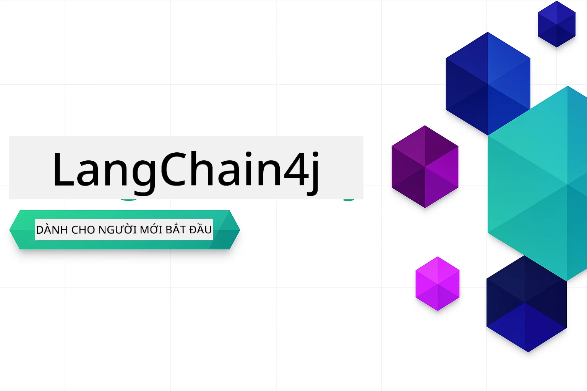

# LangChain4j cho Người mới bắt đầu

Một khóa học xây dựng ứng dụng AI với LangChain4j và Azure OpenAI GPT-5.2, từ trò chuyện cơ bản đến đại lý AI.

### 🌐 Hỗ trợ đa ngôn ngữ

#### Được hỗ trợ qua GitHub Action (Tự động & Luôn cập nhật)

<!-- CO-OP TRANSLATOR LANGUAGES TABLE START -->
[Arabic](../ar/README.md) | [Bengali](../bn/README.md) | [Bulgarian](../bg/README.md) | [Burmese (Myanmar)](../my/README.md) | [Chinese (Simplified)](../zh-CN/README.md) | [Chinese (Traditional, Hong Kong)](../zh-HK/README.md) | [Chinese (Traditional, Macau)](../zh-MO/README.md) | [Chinese (Traditional, Taiwan)](../zh-TW/README.md) | [Croatian](../hr/README.md) | [Czech](../cs/README.md) | [Danish](../da/README.md) | [Dutch](../nl/README.md) | [Estonian](../et/README.md) | [Finnish](../fi/README.md) | [French](../fr/README.md) | [German](../de/README.md) | [Greek](../el/README.md) | [Hebrew](../he/README.md) | [Hindi](../hi/README.md) | [Hungarian](../hu/README.md) | [Indonesian](../id/README.md) | [Italian](../it/README.md) | [Japanese](../ja/README.md) | [Kannada](../kn/README.md) | [Khmer](../km/README.md) | [Korean](../ko/README.md) | [Lithuanian](../lt/README.md) | [Malay](../ms/README.md) | [Malayalam](../ml/README.md) | [Marathi](../mr/README.md) | [Nepali](../ne/README.md) | [Nigerian Pidgin](../pcm/README.md) | [Norwegian](../no/README.md) | [Persian (Farsi)](../fa/README.md) | [Polish](../pl/README.md) | [Portuguese (Brazil)](../pt-BR/README.md) | [Portuguese (Portugal)](../pt-PT/README.md) | [Punjabi (Gurmukhi)](../pa/README.md) | [Romanian](../ro/README.md) | [Russian](../ru/README.md) | [Serbian (Cyrillic)](../sr/README.md) | [Slovak](../sk/README.md) | [Slovenian](../sl/README.md) | [Spanish](../es/README.md) | [Swahili](../sw/README.md) | [Swedish](../sv/README.md) | [Tagalog (Filipino)](../tl/README.md) | [Tamil](../ta/README.md) | [Telugu](../te/README.md) | [Thai](../th/README.md) | [Turkish](../tr/README.md) | [Ukrainian](../uk/README.md) | [Urdu](../ur/README.md) | [Vietnamese](./README.md)

> **Ưu tiên clone về máy?**
>
> Kho lưu trữ này bao gồm hơn 50 bản dịch ngôn ngữ làm tăng đáng kể dung lượng tải về. Để clone mà không cần bản dịch, sử dụng sparse checkout:
>
> **Bash / macOS / Linux:**
> ```bash
> git clone --filter=blob:none --sparse https://github.com/microsoft/LangChain4j-for-Beginners.git
> cd LangChain4j-for-Beginners
> git sparse-checkout set --no-cone '/*' '!translations' '!translated_images'
> ```
>
> **CMD (Windows):**
> ```cmd
> git clone --filter=blob:none --sparse https://github.com/microsoft/LangChain4j-for-Beginners.git
> cd LangChain4j-for-Beginners
> git sparse-checkout set --no-cone "/*" "!translations" "!translated_images"
> ```
>
> Điều này cung cấp mọi thứ bạn cần để hoàn thành khóa học với tốc độ tải nhanh hơn nhiều.
<!-- CO-OP TRANSLATOR LANGUAGES TABLE END -->

## Mục lục

1. [Giới thiệu](01-introduction/README.md) - Học các nguyên tắc cơ bản của LangChain4j
2. [Kỹ thuật Prompt](02-prompt-engineering/README.md) - Thành thạo thiết kế prompt hiệu quả
3. [RAG (Tăng cường truy xuất thông tin)](03-rag/README.md) - Xây dựng hệ thống dựa trên kiến thức thông minh
4. [Công cụ](04-tools/README.md) - Tích hợp các công cụ bên ngoài và trợ lý đơn giản
5. [MCP (Giao thức ngữ cảnh mô hình)](05-mcp/README.md) - Làm việc với giao thức ngữ cảnh mô hình và các mô-đun đại lý

### Video hướng dẫn

Mỗi mô-đun có một buổi học trực tiếp đi kèm nơi chúng ta trình bày các khái niệm và mã nguồn từng bước.

| Mô-đun | Video |
|--------|-------|
| 01 - Giới thiệu | [Bắt đầu với LangChain4j](https://www.youtube.com/live/nl_troDm8rQ) |
| 02 - Kỹ thuật Prompt | [Kỹ thuật Prompt với LangChain4j](https://www.youtube.com/live/PJ6aBaE6bog) |
| 03 - RAG | [RAG với LangChain4j](https://www.youtube.com/watch?v=_olq75ZH_eY) |
| 04 - Công cụ & 05 - MCP | [Đại lý AI với Công cụ và MCP](https://www.youtube.com/watch?v=O_J30kZc0rw) |

---

## Lộ trình học

**Mới với LangChain4j?** Xem [Thuật ngữ](docs/GLOSSARY.md) để định nghĩa các thuật ngữ và khái niệm chính.

> **Bắt đầu nhanh**

1. Fork kho lưu trữ này vào tài khoản GitHub của bạn
2. Nhấn **Code** → tab **Codespaces** → **...** → **New with options...**
3. Sử dụng mặc định – điều này sẽ chọn container phát triển được tạo cho khóa học này
4. Nhấn **Create codespace**
5. Đợi 5-10 phút để môi trường sẵn sàng
6. Tới ngay [Giới thiệu](./01-introduction/README.md) để bắt đầu!

Sau khi hoàn thành các mô-đun, khám phá [Hướng dẫn thử nghiệm](docs/TESTING.md) để xem các khái niệm kiểm thử LangChain4j trong thực tế.

> **Lưu ý:** Khóa đào tạo này sử dụng Azure OpenAI. Bắt đầu với [tài khoản Azure MIỄN PHÍ](https://aka.ms/azure-free-account) nếu bạn chưa có.

## Học cùng GitHub Copilot

Để bắt đầu lập trình nhanh, mở dự án này trong GitHub Codespace hoặc IDE cục bộ của bạn với devcontainer được cung cấp. Devcontainer sử dụng trong khóa học này đã được cấu hình sẵn với GitHub Copilot cho lập trình cùng AI.

Mỗi ví dụ mã đều có các câu hỏi gợi ý bạn có thể hỏi GitHub Copilot để hiểu sâu hơn. Tìm các gợi ý 💡/🤖 trong:

- **Tiêu đề file Java** - Câu hỏi đặc thù cho từng ví dụ
- **README mô-đun** - Gợi ý khám phá sau ví dụ mã

**Cách dùng:** Mở bất kỳ file mã nào và hỏi Copilot các câu hỏi gợi ý. Nó có đầy đủ ngữ cảnh của mã nguồn và có thể giải thích, mở rộng, và đề xuất các lựa chọn thay thế.

Muốn học thêm? Xem [Copilot cho lập trình cùng AI](https://aka.ms/GitHubCopilotAI).

## Tài nguyên bổ sung

<!-- CO-OP TRANSLATOR OTHER COURSES START -->
### LangChain
[](https://aka.ms/langchain4j-for-beginners)
[](https://aka.ms/langchainjs-for-beginners?WT.mc_id=m365-94501-dwahlin)
[](https://github.com/microsoft/langchain-for-beginners?WT.mc_id=m365-94501-dwahlin)
---

### Azure / Edge / MCP / Đại lý
[](https://github.com/microsoft/AZD-for-beginners?WT.mc_id=academic-105485-koreyst)
[](https://github.com/microsoft/edgeai-for-beginners?WT.mc_id=academic-105485-koreyst)
[](https://github.com/microsoft/mcp-for-beginners?WT.mc_id=academic-105485-koreyst)
[](https://github.com/microsoft/ai-agents-for-beginners?WT.mc_id=academic-105485-koreyst)

---
 
### Series AI tạo sinh
[](https://github.com/microsoft/generative-ai-for-beginners?WT.mc_id=academic-105485-koreyst)
[-9333EA?style=for-the-badge&labelColor=E5E7EB&color=9333EA)](https://github.com/microsoft/Generative-AI-for-beginners-dotnet?WT.mc_id=academic-105485-koreyst)
[-C084FC?style=for-the-badge&labelColor=E5E7EB&color=C084FC)](https://github.com/microsoft/generative-ai-for-beginners-java?WT.mc_id=academic-105485-koreyst)
[-E879F9?style=for-the-badge&labelColor=E5E7EB&color=E879F9)](https://github.com/microsoft/generative-ai-with-javascript?WT.mc_id=academic-105485-koreyst)

---
 
### Học cốt lõi
[](https://aka.ms/ml-beginners?WT.mc_id=academic-105485-koreyst)
[](https://aka.ms/datascience-beginners?WT.mc_id=academic-105485-koreyst)
[](https://aka.ms/ai-beginners?WT.mc_id=academic-105485-koreyst)
[](https://github.com/microsoft/Security-101?WT.mc_id=academic-96948-sayoung)

[](https://aka.ms/webdev-beginners?WT.mc_id=academic-105485-koreyst)
[](https://aka.ms/iot-beginners?WT.mc_id=academic-105485-koreyst)
[](https://github.com/microsoft/xr-development-for-beginners?WT.mc_id=academic-105485-koreyst)

---
 
### Chuỗi Copilot
[](https://aka.ms/GitHubCopilotAI?WT.mc_id=academic-105485-koreyst)
[](https://github.com/microsoft/mastering-github-copilot-for-dotnet-csharp-developers?WT.mc_id=academic-105485-koreyst)
[](https://github.com/microsoft/CopilotAdventures?WT.mc_id=academic-105485-koreyst)
<!-- CO-OP TRANSLATOR OTHER COURSES END -->

## Nhận trợ giúp

Nếu bạn gặp khó khăn hoặc có bất kỳ câu hỏi nào về việc xây dựng ứng dụng AI, hãy tham gia:

[](https://aka.ms/foundry/discord)

Nếu bạn có phản hồi về sản phẩm hoặc lỗi khi xây dựng, hãy truy cập:

[](https://aka.ms/foundry/forum)

## Giấy phép

Giấy phép MIT - Xem tệp [LICENSE](../../LICENSE) để biết chi tiết.

---

<!-- CO-OP TRANSLATOR DISCLAIMER START -->
**Tuyên bố miễn trừ trách nhiệm**:
Tài liệu này đã được dịch bằng dịch vụ dịch thuật AI [Co-op Translator](https://github.com/Azure/co-op-translator). Mặc dù chúng tôi cố gắng đảm bảo độ chính xác, xin lưu ý rằng bản dịch tự động có thể chứa lỗi hoặc sai sót. Tài liệu gốc bằng ngôn ngữ gốc nên được coi là nguồn tin chính thức. Đối với thông tin quan trọng, nên sử dụng dịch vụ dịch thuật chuyên nghiệp bởi con người. Chúng tôi không chịu trách nhiệm về bất kỳ hiểu lầm hoặc giải thích sai nào phát sinh từ việc sử dụng bản dịch này.
<!-- CO-OP TRANSLATOR DISCLAIMER END -->