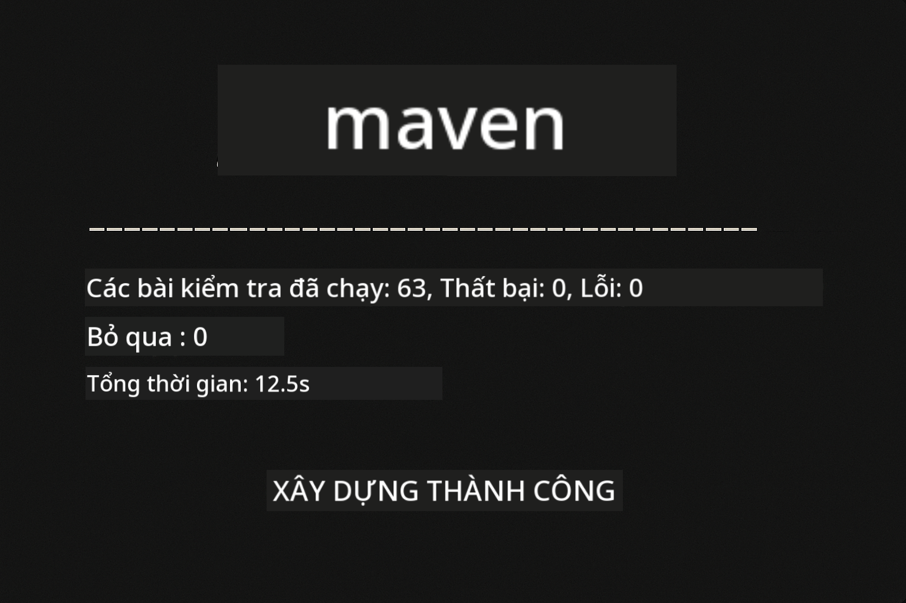
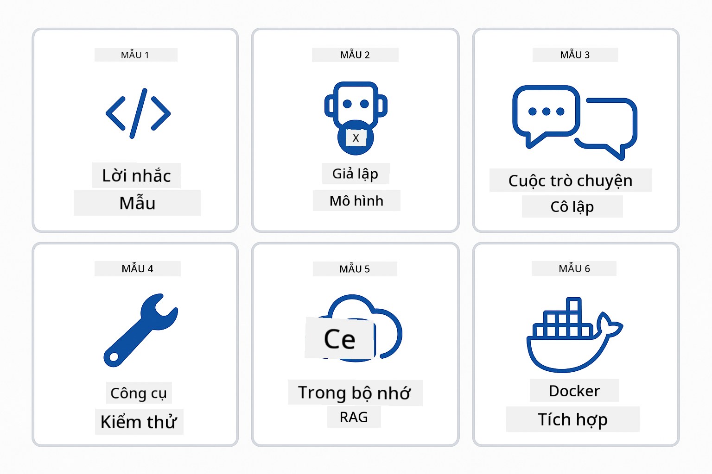
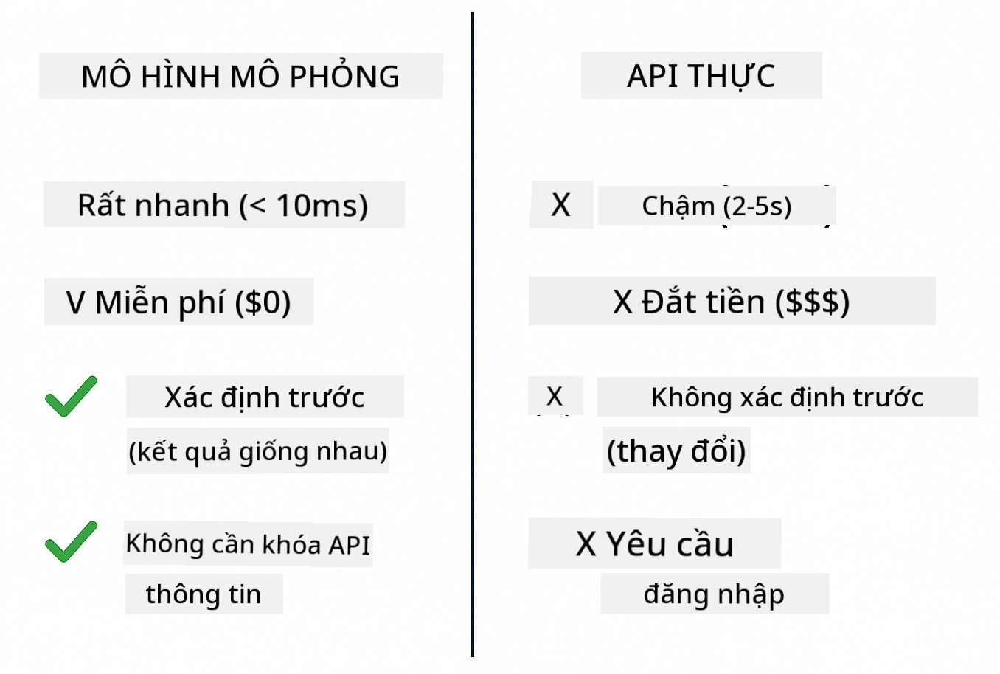
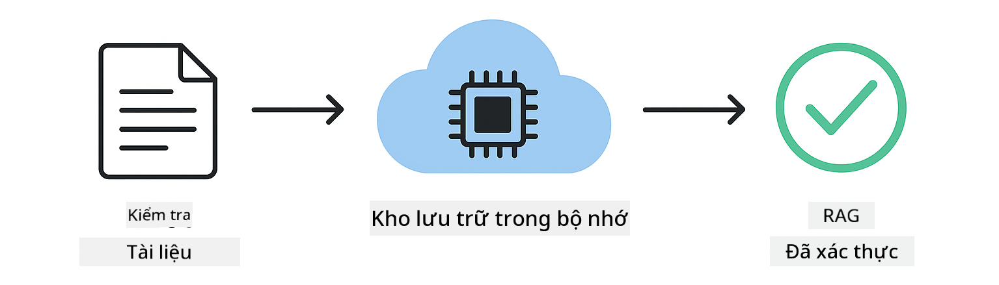
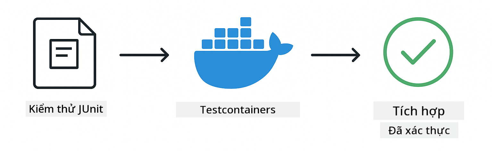

<!--
CO_OP_TRANSLATOR_METADATA:
{
  "original_hash": "b975537560c404d5f254331832811e78",
  "translation_date": "2025-12-13T21:13:04+00:00",
  "source_file": "docs/TESTING.md",
  "language_code": "vi"
}
-->
# Kiểm thử Ứng dụng LangChain4j

## Mục lục

- [Bắt đầu nhanh](../../../docs)
- [Nội dung kiểm thử](../../../docs)
- [Chạy các bài kiểm thử](../../../docs)
- [Chạy kiểm thử trong VS Code](../../../docs)
- [Mẫu kiểm thử](../../../docs)
- [Triết lý kiểm thử](../../../docs)
- [Bước tiếp theo](../../../docs)

Hướng dẫn này sẽ dẫn bạn qua các bài kiểm thử minh họa cách kiểm thử ứng dụng AI mà không cần khóa API hay dịch vụ bên ngoài.

## Bắt đầu nhanh

Chạy tất cả các bài kiểm thử với một lệnh duy nhất:

**Bash:**
```bash
mvn test
```

**PowerShell:**
```powershell
mvn --% test
```



*Thực thi kiểm thử thành công với tất cả các bài kiểm thử đều vượt qua không có lỗi*

## Nội dung kiểm thử

Khóa học này tập trung vào **kiểm thử đơn vị** chạy cục bộ. Mỗi bài kiểm thử minh họa một khái niệm LangChain4j cụ thể một cách độc lập.


*Kim tự tháp kiểm thử thể hiện sự cân bằng giữa kiểm thử đơn vị (nhanh, cô lập), kiểm thử tích hợp (các thành phần thực), và kiểm thử đầu-cuối (hệ thống đầy đủ với Docker). Khóa đào tạo này bao gồm kiểm thử đơn vị.*

| Module | Bài kiểm thử | Trọng tâm | Tệp chính |
|--------|--------------|-----------|-----------|
| **00 - Bắt đầu nhanh** | 6 | Mẫu prompt và thay thế biến | `SimpleQuickStartTest.java` |
| **01 - Giới thiệu** | 8 | Bộ nhớ hội thoại và chat trạng thái | `SimpleConversationTest.java` |
| **02 - Kỹ thuật Prompt** | 12 | Mẫu GPT-5, mức độ nhiệt tình, đầu ra có cấu trúc | `SimpleGpt5PromptTest.java` |
| **03 - RAG** | 10 | Nhập tài liệu, embeddings, tìm kiếm tương đồng | `DocumentServiceTest.java` |
| **04 - Công cụ** | 12 | Gọi hàm và chuỗi công cụ | `SimpleToolsTest.java` |
| **05 - MCP** | 15 | Model Context Protocol với Docker | `SimpleMcpTest.java`, `McpDockerTransportTest.java` |

## Chạy các bài kiểm thử

**Chạy tất cả các bài kiểm thử từ thư mục gốc:**

**Bash:**
```bash
mvn test
```

**PowerShell:**
```powershell
mvn --% test
```

**Chạy kiểm thử cho một module cụ thể:**

**Bash:**
```bash
cd 01-introduction && mvn test
# Hoặc từ root
mvn test -pl 01-introduction
```

**PowerShell:**
```powershell
cd 01-introduction; mvn --% test
# Hoặc từ root
mvn --% test -pl 01-introduction
```

**Chạy một lớp kiểm thử đơn lẻ:**

**Bash:**
```bash
mvn test -Dtest=SimpleConversationTest
```

**PowerShell:**
```powershell
mvn --% test -Dtest=SimpleConversationTest
```

**Chạy một phương thức kiểm thử cụ thể:**

**Bash:**
```bash
mvn test -Dtest=SimpleConversationTest#nên duy trì lịch sử cuộc trò chuyện
```

**PowerShell:**
```powershell
mvn --% test -Dtest=SimpleConversationTest#nênDuyTrìLịchSửCuộcTròChuyện
```

## Chạy kiểm thử trong VS Code

Nếu bạn sử dụng Visual Studio Code, Test Explorer cung cấp giao diện đồ họa để chạy và gỡ lỗi các bài kiểm thử.


*Trình khám phá kiểm thử VS Code hiển thị cây kiểm thử với tất cả các lớp kiểm thử Java và các phương thức kiểm thử riêng lẻ*

**Để chạy kiểm thử trong VS Code:**

1. Mở Test Explorer bằng cách nhấp vào biểu tượng bình thử nghiệm trên thanh Activity Bar
2. Mở rộng cây kiểm thử để xem tất cả các module và lớp kiểm thử
3. Nhấp nút chạy bên cạnh bất kỳ bài kiểm thử nào để chạy riêng lẻ
4. Nhấp "Run All Tests" để thực thi toàn bộ bộ kiểm thử
5. Nhấp chuột phải vào bất kỳ bài kiểm thử nào và chọn "Debug Test" để đặt điểm dừng và bước qua mã

Test Explorer hiển thị dấu tích màu xanh cho các bài kiểm thử thành công và cung cấp thông báo lỗi chi tiết khi kiểm thử thất bại.

## Mẫu kiểm thử



*Sáu mẫu kiểm thử cho ứng dụng LangChain4j: mẫu prompt, mô phỏng mô hình, cô lập hội thoại, kiểm thử công cụ, RAG trong bộ nhớ, và tích hợp Docker*

### Mẫu 1: Kiểm thử Mẫu Prompt

Mẫu đơn giản nhất kiểm thử các mẫu prompt mà không gọi bất kỳ mô hình AI nào. Bạn xác minh rằng việc thay thế biến hoạt động chính xác và prompt được định dạng như mong đợi.


*Kiểm thử mẫu prompt thể hiện luồng thay thế biến: mẫu với chỗ giữ chỗ → áp dụng giá trị → xác minh đầu ra đã định dạng*

```java
@Test
@DisplayName("Should format prompt template with variables")
void testPromptTemplateFormatting() {
    PromptTemplate template = PromptTemplate.from(
        "Best time to visit {{destination}} for {{activity}}?"
    );
    
    Prompt prompt = template.apply(Map.of(
        "destination", "Paris",
        "activity", "sightseeing"
    ));
    
    assertThat(prompt.text()).isEqualTo("Best time to visit Paris for sightseeing?");
}
```

Bài kiểm thử này nằm trong `00-quick-start/src/test/java/com/example/langchain4j/quickstart/SimpleQuickStartTest.java`.

**Chạy nó:**

**Bash:**
```bash
cd 00-quick-start && mvn test -Dtest=SimpleQuickStartTest#kiểm traĐịnhDạngMẫuLờiNhắc
```

**PowerShell:**
```powershell
cd 00-quick-start; mvn --% test -Dtest=SimpleQuickStartTest#kiểm traĐịnhDạngMẫuLờiNhắc
```

### Mẫu 2: Mô phỏng Mô hình Ngôn ngữ

Khi kiểm thử logic hội thoại, sử dụng Mockito để tạo mô hình giả trả về các phản hồi đã định trước. Điều này giúp các bài kiểm thử nhanh, miễn phí và có kết quả xác định.



*So sánh cho thấy tại sao mô phỏng được ưu tiên cho kiểm thử: nhanh, miễn phí, xác định và không cần khóa API*

```java
@ExtendWith(MockitoExtension.class)
class SimpleConversationTest {
    
    private ConversationService conversationService;
    
    @Mock
    private OpenAiOfficialChatModel mockChatModel;
    
    @BeforeEach
    void setUp() {
        ChatResponse mockResponse = ChatResponse.builder()
            .aiMessage(AiMessage.from("This is a test response"))
            .build();
        when(mockChatModel.chat(anyList())).thenReturn(mockResponse);
        
        conversationService = new ConversationService(mockChatModel);
    }
    
    @Test
    void shouldMaintainConversationHistory() {
        String conversationId = conversationService.startConversation();
        
        ChatResponse mockResponse1 = ChatResponse.builder()
            .aiMessage(AiMessage.from("Response 1"))
            .build();
        ChatResponse mockResponse2 = ChatResponse.builder()
            .aiMessage(AiMessage.from("Response 2"))
            .build();
        ChatResponse mockResponse3 = ChatResponse.builder()
            .aiMessage(AiMessage.from("Response 3"))
            .build();
        
        when(mockChatModel.chat(anyList()))
            .thenReturn(mockResponse1)
            .thenReturn(mockResponse2)
            .thenReturn(mockResponse3);

        conversationService.chat(conversationId, "First message");
        conversationService.chat(conversationId, "Second message");
        conversationService.chat(conversationId, "Third message");

        List<ChatMessage> history = conversationService.getHistory(conversationId);
        assertThat(history).hasSize(6); // 3 tin nhắn người dùng + 3 tin nhắn AI
    }
}
```

Mẫu này xuất hiện trong `01-introduction/src/test/java/com/example/langchain4j/service/SimpleConversationTest.java`. Mô phỏng đảm bảo hành vi nhất quán để bạn có thể xác minh quản lý bộ nhớ hoạt động chính xác.

### Mẫu 3: Kiểm thử Cô lập Hội thoại

Bộ nhớ hội thoại phải giữ cho nhiều người dùng tách biệt. Bài kiểm thử này xác minh rằng các hội thoại không trộn lẫn ngữ cảnh.


*Kiểm thử cô lập hội thoại thể hiện các bộ nhớ riêng biệt cho từng người dùng để ngăn ngừa trộn lẫn ngữ cảnh*

```java
@Test
void shouldIsolateConversationsByid() {
    String conv1 = conversationService.startConversation();
    String conv2 = conversationService.startConversation();
    
    ChatResponse mockResponse = ChatResponse.builder()
        .aiMessage(AiMessage.from("Response"))
        .build();
    when(mockChatModel.chat(anyList())).thenReturn(mockResponse);

    conversationService.chat(conv1, "Message for conversation 1");
    conversationService.chat(conv2, "Message for conversation 2");

    List<ChatMessage> history1 = conversationService.getHistory(conv1);
    List<ChatMessage> history2 = conversationService.getHistory(conv2);
    
    assertThat(history1).hasSize(2);
    assertThat(history2).hasSize(2);
}
```

Mỗi hội thoại duy trì lịch sử độc lập riêng. Trong hệ thống sản xuất, sự cô lập này rất quan trọng cho các ứng dụng đa người dùng.

### Mẫu 4: Kiểm thử Công cụ Độc lập

Công cụ là các hàm mà AI có thể gọi. Kiểm thử chúng trực tiếp để đảm bảo chúng hoạt động chính xác bất kể quyết định của AI.


*Kiểm thử công cụ độc lập thể hiện việc chạy công cụ mô phỏng mà không gọi AI để xác minh logic nghiệp vụ*

```java
@Test
void shouldConvertCelsiusToFahrenheit() {
    TemperatureTool tempTool = new TemperatureTool();
    String result = tempTool.celsiusToFahrenheit(25.0);
    assertThat(result).containsPattern("77[.,]0°F");
}

@Test
void shouldDemonstrateToolChaining() {
    WeatherTool weatherTool = new WeatherTool();
    TemperatureTool tempTool = new TemperatureTool();

    String weatherResult = weatherTool.getCurrentWeather("Seattle");
    assertThat(weatherResult).containsPattern("\\d+°C");

    String conversionResult = tempTool.celsiusToFahrenheit(22.0);
    assertThat(conversionResult).containsPattern("71[.,]6°F");
}
```

Các bài kiểm thử này từ `04-tools/src/test/java/com/example/langchain4j/agents/tools/SimpleToolsTest.java` xác nhận logic công cụ mà không có sự tham gia của AI. Ví dụ chuỗi cho thấy đầu ra của một công cụ được đưa làm đầu vào cho công cụ khác.

### Mẫu 5: Kiểm thử RAG trong Bộ nhớ

Hệ thống RAG truyền thống cần cơ sở dữ liệu vector và dịch vụ embedding. Mẫu trong bộ nhớ cho phép bạn kiểm thử toàn bộ quy trình mà không cần phụ thuộc bên ngoài.



*Quy trình kiểm thử RAG trong bộ nhớ thể hiện phân tích tài liệu, lưu trữ embedding, và tìm kiếm tương đồng mà không cần cơ sở dữ liệu*

```java
@Test
void testProcessTextDocument() {
    String content = "This is a test document.\nIt has multiple lines.";
    InputStream inputStream = new ByteArrayInputStream(content.getBytes(StandardCharsets.UTF_8));
    
    DocumentService.ProcessedDocument result = 
        documentService.processDocument(inputStream, "test.txt");

    assertNotNull(result);
    assertTrue(result.segments().size() > 0);
    assertEquals("test.txt", result.segments().get(0).metadata().getString("filename"));
}
```

Bài kiểm thử này từ `03-rag/src/test/java/com/example/langchain4j/rag/service/DocumentServiceTest.java` tạo một tài liệu trong bộ nhớ và xác minh việc chia nhỏ và xử lý metadata.

### Mẫu 6: Kiểm thử Tích hợp với Docker

Một số tính năng cần hạ tầng thực tế. Module MCP sử dụng Testcontainers để khởi tạo container Docker cho kiểm thử tích hợp. Chúng xác nhận mã của bạn hoạt động với dịch vụ thực trong khi vẫn giữ được sự cô lập kiểm thử.



*Kiểm thử tích hợp MCP với Testcontainers thể hiện vòng đời container tự động: khởi động, thực thi kiểm thử, dừng và dọn dẹp*

Các bài kiểm thử trong `05-mcp/src/test/java/com/example/langchain4j/mcp/McpDockerTransportTest.java` yêu cầu Docker đang chạy.

**Chạy chúng:**

**Bash:**
```bash
cd 05-mcp && mvn test
```

**PowerShell:**
```powershell
cd 05-mcp; mvn --% test
```

## Triết lý kiểm thử

Kiểm thử mã của bạn, không phải AI. Các bài kiểm thử nên xác nhận mã bạn viết bằng cách kiểm tra cách xây dựng prompt, cách quản lý bộ nhớ, và cách công cụ thực thi. Phản hồi AI thay đổi và không nên là phần của khẳng định kiểm thử. Hãy tự hỏi liệu mẫu prompt của bạn có thay thế biến đúng không, chứ không phải AI có trả lời đúng không.

Sử dụng mô phỏng cho mô hình ngôn ngữ. Chúng là các phụ thuộc bên ngoài chậm, tốn kém và không xác định. Mô phỏng giúp kiểm thử nhanh với mili giây thay vì giây, miễn phí không tốn chi phí API, và xác định với kết quả giống nhau mỗi lần.

Giữ các bài kiểm thử độc lập. Mỗi bài kiểm thử nên tự thiết lập dữ liệu riêng, không phụ thuộc vào bài kiểm thử khác, và dọn dẹp sau khi chạy. Các bài kiểm thử nên thành công bất kể thứ tự thực thi.

Kiểm thử các trường hợp biên ngoài đường đi thuận lợi. Thử đầu vào rỗng, đầu vào rất lớn, ký tự đặc biệt, tham số không hợp lệ, và điều kiện biên. Những trường hợp này thường phát hiện lỗi mà sử dụng bình thường không thấy.

Sử dụng tên mô tả. So sánh `shouldMaintainConversationHistoryAcrossMultipleMessages()` với `test1()`. Tên đầu tiên cho bạn biết chính xác điều gì đang được kiểm thử, giúp việc gỡ lỗi lỗi dễ dàng hơn nhiều.

## Bước tiếp theo

Bây giờ bạn đã hiểu các mẫu kiểm thử, hãy đi sâu hơn vào từng module:

- **[00 - Bắt đầu nhanh](../00-quick-start/README.md)** - Bắt đầu với các kiến thức cơ bản về mẫu prompt
- **[01 - Giới thiệu](../01-introduction/README.md)** - Tìm hiểu quản lý bộ nhớ hội thoại
- **[02 - Kỹ thuật Prompt](../02-prompt-engineering/README.md)** - Làm chủ các mẫu prompt GPT-5
- **[03 - RAG](../03-rag/README.md)** - Xây dựng hệ thống tạo nội dung tăng cường truy xuất
- **[04 - Công cụ](../04-tools/README.md)** - Triển khai gọi hàm và chuỗi công cụ
- **[05 - MCP](../05-mcp/README.md)** - Tích hợp Model Context Protocol với Docker

README của mỗi module cung cấp giải thích chi tiết về các khái niệm được kiểm thử ở đây.

---

**Điều hướng:** [← Quay lại Trang chính](../README.md)

---

<!-- CO-OP TRANSLATOR DISCLAIMER START -->
**Tuyên bố từ chối trách nhiệm**:  
Tài liệu này đã được dịch bằng dịch vụ dịch thuật AI [Co-op Translator](https://github.com/Azure/co-op-translator). Mặc dù chúng tôi cố gắng đảm bảo độ chính xác, xin lưu ý rằng bản dịch tự động có thể chứa lỗi hoặc không chính xác. Tài liệu gốc bằng ngôn ngữ gốc của nó nên được coi là nguồn chính xác và đáng tin cậy. Đối với thông tin quan trọng, nên sử dụng dịch vụ dịch thuật chuyên nghiệp do con người thực hiện. Chúng tôi không chịu trách nhiệm về bất kỳ sự hiểu lầm hoặc giải thích sai nào phát sinh từ việc sử dụng bản dịch này.
<!-- CO-OP TRANSLATOR DISCLAIMER END -->