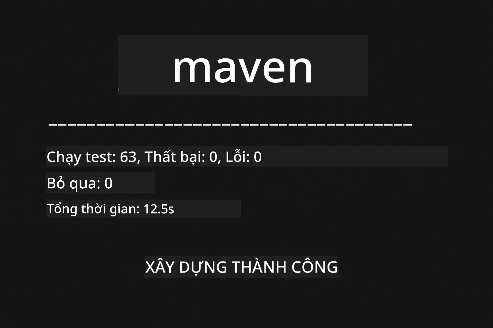
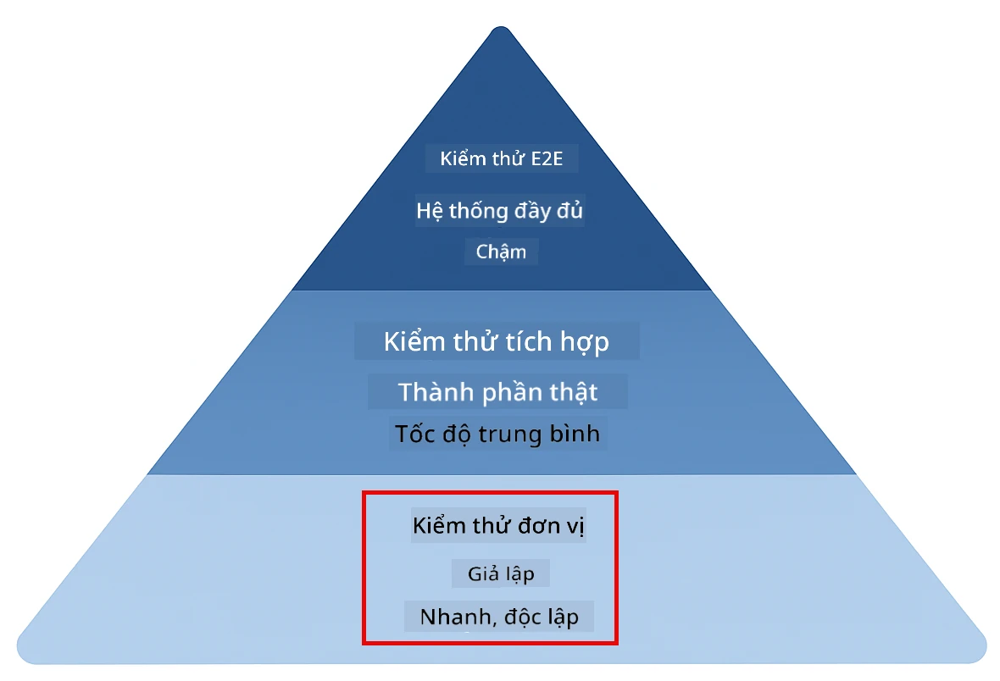
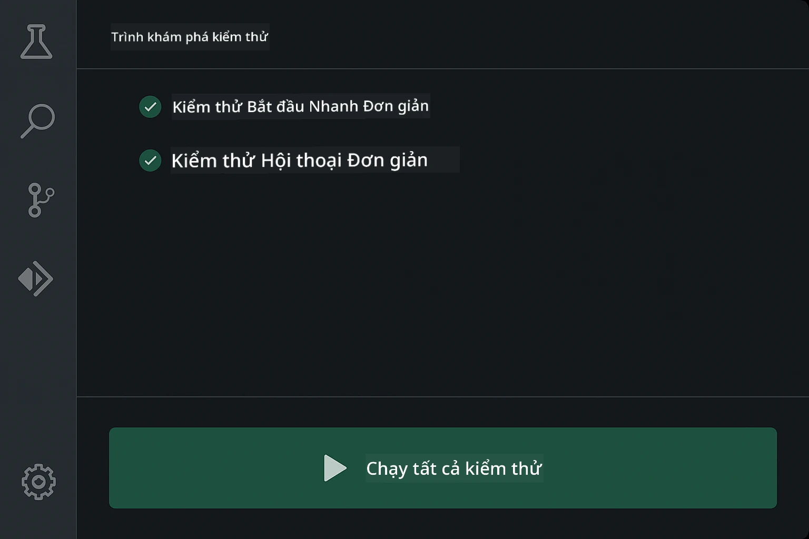
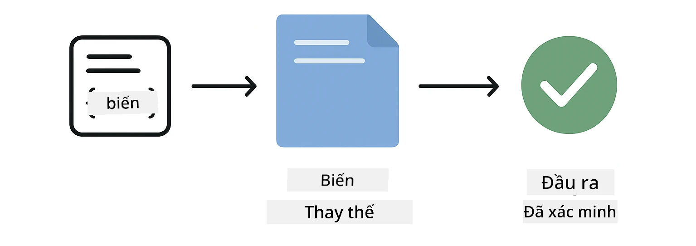
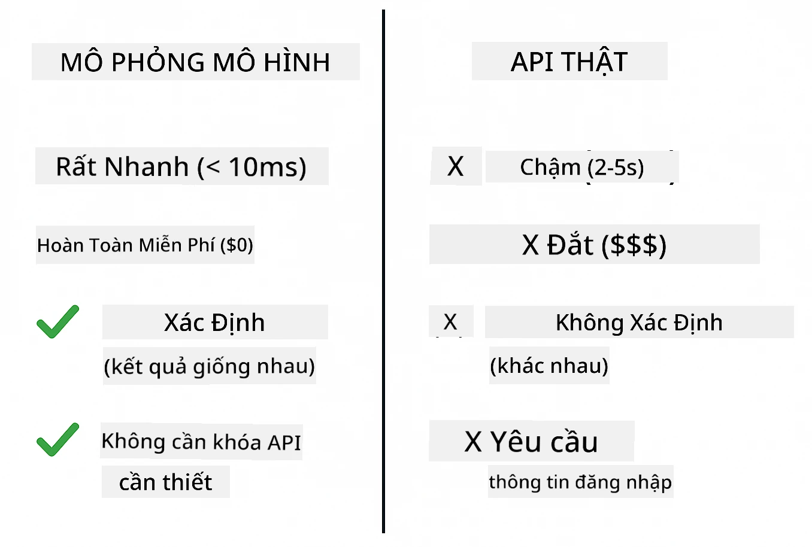
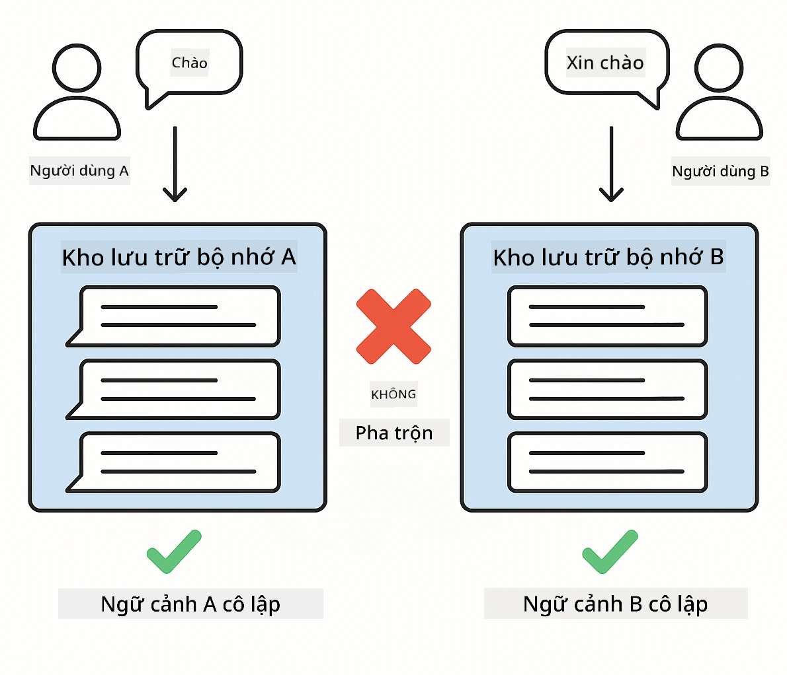
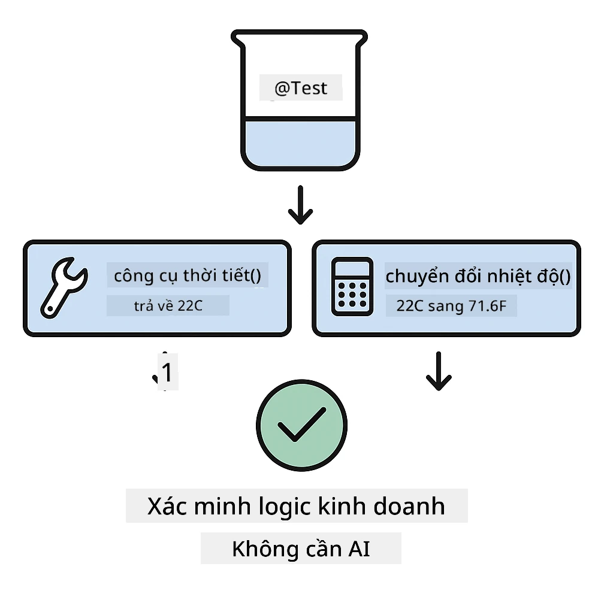
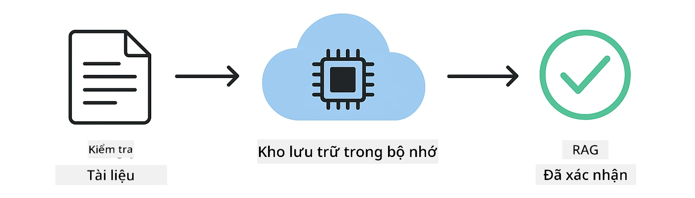

<!--
CO_OP_TRANSLATOR_METADATA:
{
  "original_hash": "ed93b3c14d58734ac10162967da958c1",
  "translation_date": "2025-12-31T02:54:13+00:00",
  "source_file": "docs/TESTING.md",
  "language_code": "vi"
}
-->
# Kiểm thử Ứng dụng LangChain4j

## Mục lục

- [Bắt đầu nhanh](../../../docs)
- [Những nội dung các bài kiểm thử bao gồm](../../../docs)
- [Chạy các bài kiểm thử](../../../docs)
- [Chạy các bài kiểm thử trong VS Code](../../../docs)
- [Mẫu kiểm thử](../../../docs)
- [Triết lý kiểm thử](../../../docs)
- [Bước tiếp theo](../../../docs)

Hướng dẫn này hướng dẫn bạn qua các bài kiểm thử minh họa cách kiểm thử ứng dụng AI mà không cần khóa API hoặc dịch vụ bên ngoài.

## Bắt đầu nhanh

Chạy tất cả các bài kiểm thử bằng một lệnh duy nhất:

**Bash:**
```bash
mvn test
```

**PowerShell:**
```powershell
mvn --% test
```



*Thực thi kiểm thử thành công cho thấy tất cả các bài kiểm thử đều vượt qua mà không có lỗi nào*

## Những nội dung các bài kiểm thử bao gồm

Khóa học này tập trung vào **kiểm thử đơn vị** chạy cục bộ. Mỗi bài kiểm thử minh họa một khái niệm cụ thể của LangChain4j một cách độc lập.



*Kim tự tháp kiểm thử cho thấy cân bằng giữa kiểm thử đơn vị (nhanh, độc lập), kiểm thử tích hợp (các thành phần thực tế), và kiểm thử đầu-cuối. Khóa đào tạo này đề cập kiểm thử đơn vị.*

| Module | Tests | Focus | Key Files |
|--------|-------|-------|-----------|
| **00 - Bắt đầu nhanh** | 6 | Mẫu prompt và thay thế biến | `SimpleQuickStartTest.java` |
| **01 - Giới thiệu** | 8 | Bộ nhớ cuộc trò chuyện và chat có trạng thái | `SimpleConversationTest.java` |
| **02 - Kỹ thuật prompt** | 12 | Mẫu GPT-5, mức độ nhiệt tình, đầu ra có cấu trúc | `SimpleGpt5PromptTest.java` |
| **03 - RAG** | 10 | Nhập tài liệu, embedding, tìm kiếm tương đồng | `DocumentServiceTest.java` |
| **04 - Công cụ** | 12 | Gọi hàm và xâu chuỗi công cụ | `SimpleToolsTest.java` |
| **05 - MCP** | 8 | Giao thức Ngữ cảnh Mô hình với truyền stdio | `SimpleMcpTest.java` |

## Chạy các bài kiểm thử

**Chạy tất cả các bài kiểm thử từ thư mục gốc:**

**Bash:**
```bash
mvn test
```

**PowerShell:**
```powershell
mvn --% test
```

**Chạy các bài kiểm thử cho một mô-đun cụ thể:**

**Bash:**
```bash
cd 01-introduction && mvn test
# Hoặc từ tài khoản root
mvn test -pl 01-introduction
```

**PowerShell:**
```powershell
cd 01-introduction; mvn --% test
# Hoặc từ root
mvn --% test -pl 01-introduction
```

**Chạy một lớp kiểm thử riêng lẻ:**

**Bash:**
```bash
mvn test -Dtest=SimpleConversationTest
```

**PowerShell:**
```powershell
mvn --% test -Dtest=SimpleConversationTest
```

**Chạy một phương thức kiểm thử cụ thể:**

**Bash:**
```bash
mvn test -Dtest=SimpleConversationTest#nên duy trì lịch sử hội thoại
```

**PowerShell:**
```powershell
mvn --% test -Dtest=SimpleConversationTest#nên duy trì lịch sử hội thoại
```

## Chạy các bài kiểm thử trong VS Code

Nếu bạn đang sử dụng Visual Studio Code, Test Explorer cung cấp giao diện đồ họa để chạy và gỡ lỗi các bài kiểm thử.



*Test Explorer của VS Code hiển thị cây kiểm thử với tất cả các lớp kiểm thử Java và các phương thức kiểm thử riêng lẻ*

**Để chạy các bài kiểm thử trong VS Code:**

1. Mở Test Explorer bằng cách nhấp vào biểu tượng bình thí nghiệm trên Thanh Hoạt động
2. Mở rộng cây kiểm thử để xem tất cả các mô-đun và lớp kiểm thử
3. Nhấp nút chạy bên cạnh bất kỳ bài kiểm thử nào để chạy riêng
4. Nhấp "Run All Tests" để thực thi toàn bộ bộ kiểm thử
5. Nhấp chuột phải vào bất kỳ bài kiểm thử nào và chọn "Debug Test" để thiết lập breakpoint và thực thi từng bước qua mã

Test Explorer hiển thị dấu tích màu xanh cho các bài kiểm thử vượt qua và cung cấp thông báo lỗi chi tiết khi bài kiểm thử thất bại.

## Mẫu kiểm thử

### Mẫu 1: Kiểm thử mẫu prompt

Mẫu đơn giản nhất kiểm thử các mẫu prompt mà không gọi bất kỳ mô hình AI nào. Bạn xác minh rằng việc thay thế biến hoạt động chính xác và các prompt được định dạng như mong đợi.



*Kiểm thử mẫu prompt thể hiện luồng thay thế biến: mẫu với các chỗ giữ chỗ → áp dụng giá trị → xác minh đầu ra đã được định dạng*

```java
@Test
@DisplayName("Should format prompt template with variables")
void testPromptTemplateFormatting() {
    PromptTemplate template = PromptTemplate.from(
        "Best time to visit {{destination}} for {{activity}}?"
    );
    
    Prompt prompt = template.apply(Map.of(
        "destination", "Paris",
        "activity", "sightseeing"
    ));
    
    assertThat(prompt.text()).isEqualTo("Best time to visit Paris for sightseeing?");
}
```

This test lives in `00-quick-start/src/test/java/com/example/langchain4j/quickstart/SimpleQuickStartTest.java`.

**Run it:**

**Bash:**
```bash
cd 00-quick-start && mvn test -Dtest=SimpleQuickStartTest#Kiểm tra định dạng mẫu lời nhắc
```

**PowerShell:**
```powershell
cd 00-quick-start; mvn --% test -Dtest=SimpleQuickStartTest#kiểm tra định dạng mẫu lời nhắc
```

### Mẫu 2: Giả lập mô hình ngôn ngữ (mocking)

Khi kiểm thử logic cuộc trò chuyện, sử dụng Mockito để tạo mô hình giả trả về các phản hồi đã định trước. Điều này khiến các bài kiểm thử nhanh, miễn phí và có tính quyết định.



*So sánh cho thấy lý do tại sao mock được ưu tiên cho kiểm thử: chúng nhanh, miễn phí, có tính quyết định và không yêu cầu khóa API*

```java
@ExtendWith(MockitoExtension.class)
class SimpleConversationTest {
    
    private ConversationService conversationService;
    
    @Mock
    private OpenAiOfficialChatModel mockChatModel;
    
    @BeforeEach
    void setUp() {
        ChatResponse mockResponse = ChatResponse.builder()
            .aiMessage(AiMessage.from("This is a test response"))
            .build();
        when(mockChatModel.chat(anyList())).thenReturn(mockResponse);
        
        conversationService = new ConversationService(mockChatModel);
    }
    
    @Test
    void shouldMaintainConversationHistory() {
        String conversationId = conversationService.startConversation();
        
        ChatResponse mockResponse1 = ChatResponse.builder()
            .aiMessage(AiMessage.from("Response 1"))
            .build();
        ChatResponse mockResponse2 = ChatResponse.builder()
            .aiMessage(AiMessage.from("Response 2"))
            .build();
        ChatResponse mockResponse3 = ChatResponse.builder()
            .aiMessage(AiMessage.from("Response 3"))
            .build();
        
        when(mockChatModel.chat(anyList()))
            .thenReturn(mockResponse1)
            .thenReturn(mockResponse2)
            .thenReturn(mockResponse3);

        conversationService.chat(conversationId, "First message");
        conversationService.chat(conversationId, "Second message");
        conversationService.chat(conversationId, "Third message");

        List<ChatMessage> history = conversationService.getHistory(conversationId);
        assertThat(history).hasSize(6); // 3 tin nhắn người dùng + 3 tin nhắn AI
    }
}
```

Mẫu này xuất hiện trong `01-introduction/src/test/java/com/example/langchain4j/service/SimpleConversationTest.java`. Mock đảm bảo hành vi nhất quán để bạn có thể xác minh việc quản lý bộ nhớ hoạt động chính xác.

### Mẫu 3: Kiểm thử cách ly cuộc trò chuyện

Bộ nhớ cuộc trò chuyện phải giữ riêng biệt nhiều người dùng. Bài kiểm thử này xác minh rằng các cuộc trò chuyện không trộn lẫn ngữ cảnh.



*Kiểm thử cách ly cuộc trò chuyện thể hiện lưu trữ bộ nhớ riêng cho các người dùng khác nhau để ngăn chặn trộn lẫn ngữ cảnh*

```java
@Test
void shouldIsolateConversationsByid() {
    String conv1 = conversationService.startConversation();
    String conv2 = conversationService.startConversation();
    
    ChatResponse mockResponse = ChatResponse.builder()
        .aiMessage(AiMessage.from("Response"))
        .build();
    when(mockChatModel.chat(anyList())).thenReturn(mockResponse);

    conversationService.chat(conv1, "Message for conversation 1");
    conversationService.chat(conv2, "Message for conversation 2");

    List<ChatMessage> history1 = conversationService.getHistory(conv1);
    List<ChatMessage> history2 = conversationService.getHistory(conv2);
    
    assertThat(history1).hasSize(2);
    assertThat(history2).hasSize(2);
}
```

Mỗi cuộc trò chuyện duy trì lịch sử riêng độc lập. Trong hệ thống sản xuất, sự cách ly này là rất quan trọng cho các ứng dụng đa người dùng.

### Mẫu 4: Kiểm thử công cụ một cách độc lập

Công cụ là các hàm mà AI có thể gọi. Kiểm thử trực tiếp chúng để đảm bảo chúng hoạt động chính xác bất kể quyết định của AI.



*Kiểm thử công cụ độc lập mô tả việc thực thi công cụ giả mà không gọi AI để xác minh logic nghiệp vụ*

```java
@Test
void shouldConvertCelsiusToFahrenheit() {
    TemperatureTool tempTool = new TemperatureTool();
    String result = tempTool.celsiusToFahrenheit(25.0);
    assertThat(result).containsPattern("77[.,]0°F");
}

@Test
void shouldDemonstrateToolChaining() {
    WeatherTool weatherTool = new WeatherTool();
    TemperatureTool tempTool = new TemperatureTool();

    String weatherResult = weatherTool.getCurrentWeather("Seattle");
    assertThat(weatherResult).containsPattern("\\d+°C");

    String conversionResult = tempTool.celsiusToFahrenheit(22.0);
    assertThat(conversionResult).containsPattern("71[.,]6°F");
}
```

These tests from `04-tools/src/test/java/com/example/langchain4j/agents/tools/SimpleToolsTest.java` validate tool logic without AI involvement. The chaining example shows how one tool's output feeds into another's input.

### Mẫu 5: Kiểm thử RAG trong bộ nhớ

Hệ thống RAG truyền thống yêu cầu cơ sở dữ liệu vector và dịch vụ embedding. Mẫu chạy trong bộ nhớ cho phép bạn kiểm thử toàn bộ quy trình mà không cần phụ thuộc bên ngoài.



*Quy trình kiểm thử RAG trong bộ nhớ cho thấy phân tích tài liệu, lưu trữ embedding, và tìm kiếm tương đồng mà không cần cơ sở dữ liệu*

```java
@Test
void testProcessTextDocument() {
    String content = "This is a test document.\nIt has multiple lines.";
    InputStream inputStream = new ByteArrayInputStream(content.getBytes(StandardCharsets.UTF_8));
    
    DocumentService.ProcessedDocument result = 
        documentService.processDocument(inputStream, "test.txt");

    assertNotNull(result);
    assertTrue(result.segments().size() > 0);
    assertEquals("test.txt", result.segments().get(0).metadata().getString("filename"));
}
```

This test from `03-rag/src/test/java/com/example/langchain4j/rag/service/DocumentServiceTest.java` creates a document in memory and verifies chunking and metadata handling.

### Mẫu 6: Kiểm thử tích hợp MCP

Module MCP kiểm thử tích hợp Model Context Protocol sử dụng truyền stdio. Các bài kiểm thử này xác minh rằng ứng dụng của bạn có thể khởi tạo và giao tiếp với các máy chủ MCP như các tiến trình con.

The tests in `05-mcp/src/test/java/com/example/langchain4j/mcp/SimpleMcpTest.java` validate MCP client behavior.

**Run them:**

**Bash:**
```bash
cd 05-mcp && mvn test
```

**PowerShell:**
```powershell
cd 05-mcp; mvn --% test
```

## Triết lý kiểm thử

Kiểm thử mã của bạn, không phải AI. Các bài kiểm thử của bạn nên xác minh mã bạn viết bằng cách kiểm tra cách xây dựng prompt, cách quản lý bộ nhớ và cách thực thi công cụ. Phản hồi của AI thay đổi và không nên là một phần của khẳng định kiểm thử. Hãy tự hỏi liệu mẫu prompt của bạn có thay thế biến đúng cách hay không, chứ không phải liệu AI có trả lời đúng hay không.

Sử dụng mock cho các mô hình ngôn ngữ. Chúng là các phụ thuộc bên ngoài chậm, tốn kém và không quyết định. Việc mock làm cho các bài kiểm thử nhanh với mili giây thay vì giây, miễn phí không tốn chi phí API, và quyết định với cùng một kết quả mỗi lần.

Giữ cho các bài kiểm thử độc lập. Mỗi bài kiểm thử nên thiết lập dữ liệu của riêng nó, không phụ thuộc vào các bài kiểm thử khác, và dọn dẹp sau khi chạy. Các bài kiểm thử nên vượt qua bất kể thứ tự thực thi.

Kiểm thử các trường hợp biên vượt ra ngoài đường vui vẻ. Thử các đầu vào rỗng, đầu vào rất lớn, ký tự đặc biệt, tham số không hợp lệ và các điều kiện biên. Những điều này thường tiết lộ lỗi mà việc sử dụng thông thường không bộc lộ.

Sử dụng tên mô tả. So sánh `shouldMaintainConversationHistoryAcrossMultipleMessages()` với `test1()`. Tên đầu tiên nói chính xác điều gì đang được kiểm thử, giúp việc gỡ lỗi khi thất bại dễ dàng hơn nhiều.

## Bước tiếp theo

Bây giờ bạn đã hiểu các mẫu kiểm thử, hãy tìm hiểu sâu hơn từng mô-đun:

- **[00 - Bắt đầu nhanh](../00-quick-start/README.md)** - Bắt đầu với những điều cơ bản về mẫu prompt
- **[01 - Giới thiệu](../01-introduction/README.md)** - Tìm hiểu quản lý bộ nhớ cuộc trò chuyện
- **[02 - Kỹ thuật prompt](../02-prompt-engineering/README.md)** - Nắm vững các mẫu prompting cho GPT-5
- **[03 - RAG](../03-rag/README.md)** - Xây dựng hệ thống RAG (retrieval-augmented generation)
- **[04 - Công cụ](../04-tools/README.md)** - Triển khai gọi hàm và chuỗi công cụ
- **[05 - MCP](../05-mcp/README.md)** - Tích hợp Giao thức Ngữ cảnh Mô hình

README của từng mô-đun cung cấp giải thích chi tiết về các khái niệm được kiểm thử ở đây.

---

**Điều hướng:** [← Quay lại Trang chính](../README.md)

---

<!-- CO-OP TRANSLATOR DISCLAIMER START -->
Tuyên bố miễn trừ trách nhiệm:
Tài liệu này đã được dịch bằng dịch vụ dịch AI [Co-op Translator](https://github.com/Azure/co-op-translator). Mặc dù chúng tôi cố gắng đảm bảo độ chính xác, xin lưu ý rằng các bản dịch tự động có thể chứa lỗi hoặc sai sót. Tài liệu gốc bằng ngôn ngữ ban đầu nên được coi là nguồn có thẩm quyền. Đối với những thông tin quan trọng, nên sử dụng dịch vụ dịch thuật chuyên nghiệp do người thực hiện. Chúng tôi không chịu trách nhiệm về bất kỳ sự hiểu lầm hoặc giải thích sai nào phát sinh từ việc sử dụng bản dịch này.
<!-- CO-OP TRANSLATOR DISCLAIMER END -->