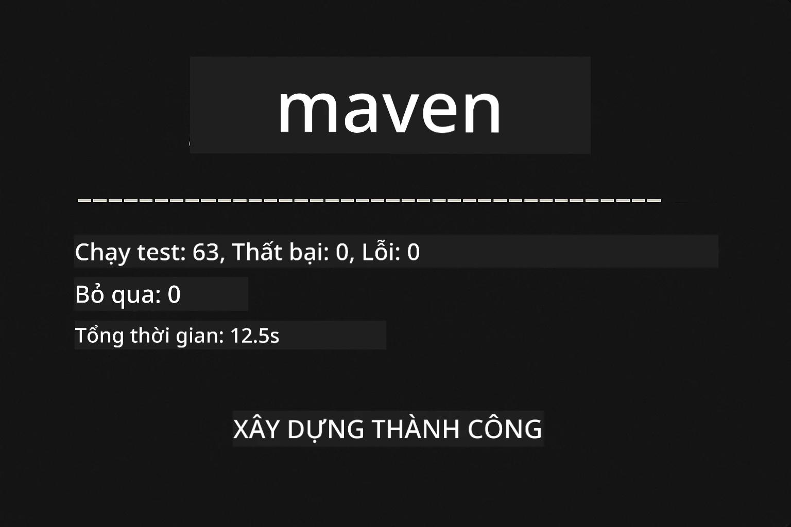
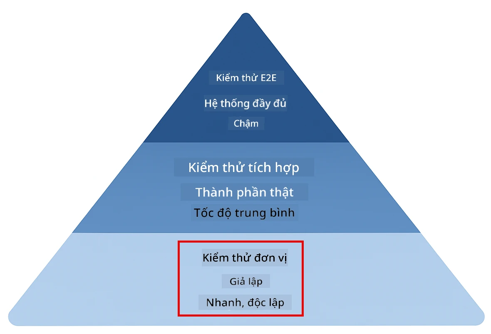
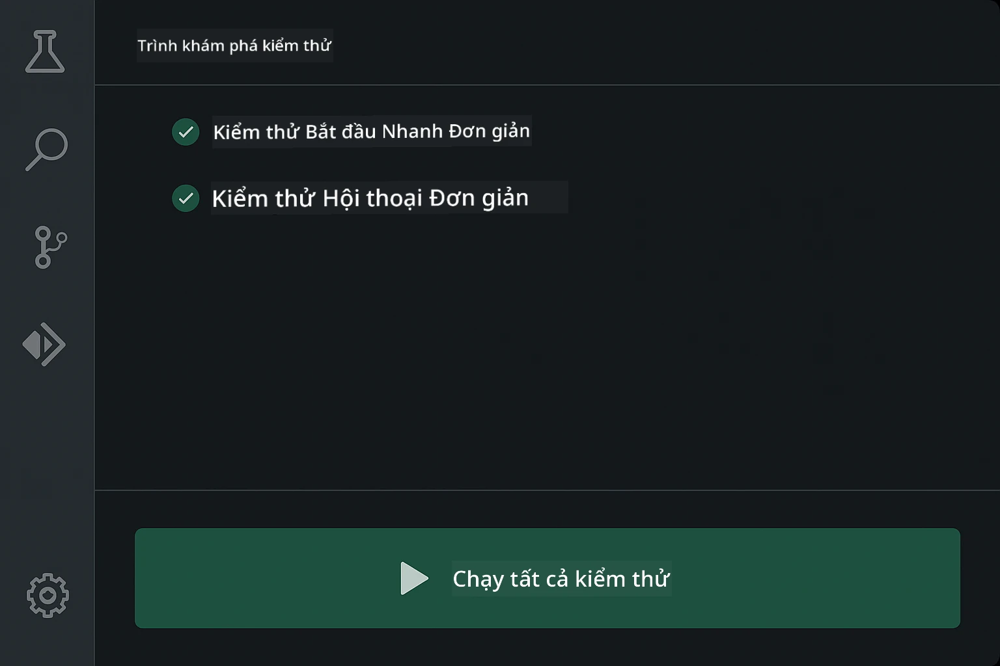
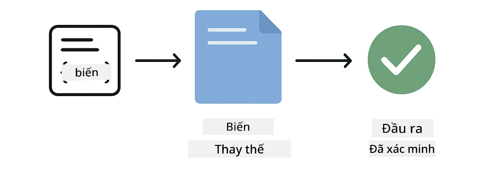
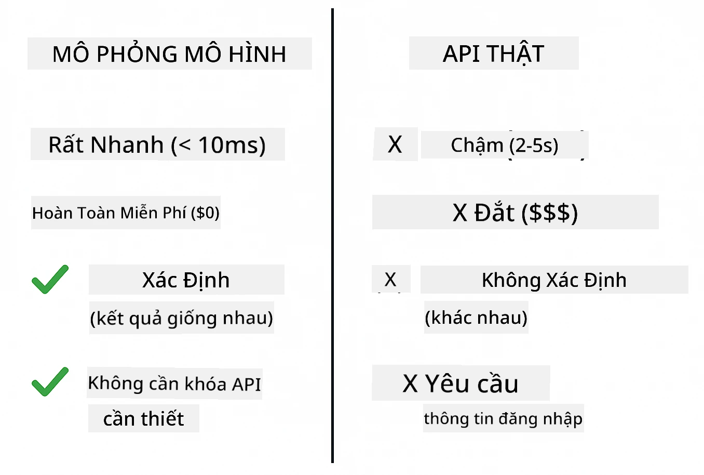
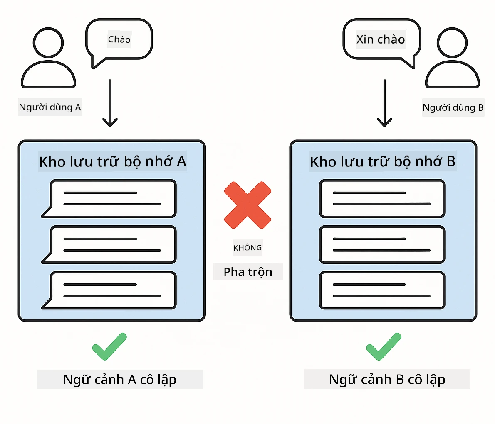
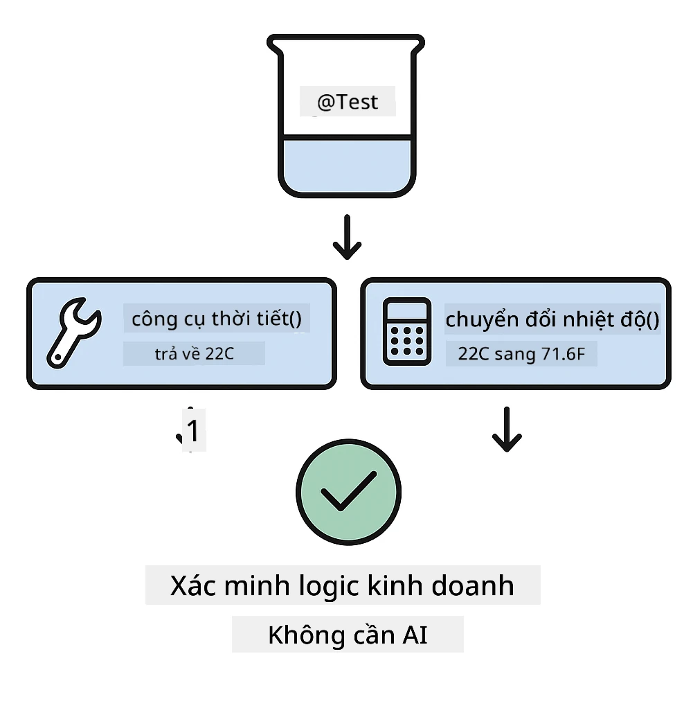
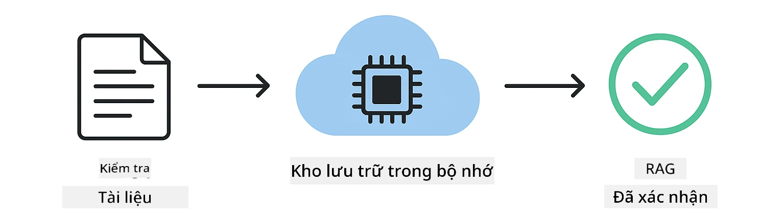

# Kiểm thử Ứng dụng LangChain4j

## Mục Lục

- [Bắt đầu nhanh](#bắt-đầu-nhanh)
- [Những gì kiểm thử bao quát](#những-gì-kiểm-thử-bao-quát)
- [Chạy các bài kiểm thử](#chạy-các-bài-kiểm-thử)
- [Chạy kiểm thử trong VS Code](#chạy-kiểm-thử-trong-vs-code)
- [Mẫu kiểm thử](#mẫu-kiểm-thử)
- [Triết lý kiểm thử](#triết-lý-kiểm-thử)
- [Bước tiếp theo](#bước-tiếp-theo)

Hướng dẫn này sẽ giúp bạn thực hiện các bài kiểm thử minh họa cách kiểm thử các ứng dụng AI mà không cần khóa API hay dịch vụ bên ngoài.

## Bắt đầu nhanh

Chạy tất cả các bài kiểm thử bằng một lệnh duy nhất:

**Bash:**
```bash
mvn test
```

**PowerShell:**
```powershell
mvn --% test
```

Khi tất cả các bài kiểm thử đều thành công, bạn sẽ thấy đầu ra như trong ảnh chụp màn hình bên dưới — các bài kiểm thử chạy không lỗi nào.



*Chạy kiểm thử thành công với tất cả các bài kiểm thử vượt qua không lỗi*

## Những gì kiểm thử bao quát

Khóa học này tập trung vào **kiểm thử đơn vị** chạy tại máy cục bộ. Mỗi bài kiểm thử minh họa một khái niệm cụ thể của LangChain4j một cách riêng biệt. Kim tự tháp kiểm thử dưới đây cho thấy vị trí của kiểm thử đơn vị — chúng tạo thành nền tảng nhanh và đáng tin cậy mà chiến lược kiểm thử tổng thể của bạn dựa vào.



*Kim tự tháp kiểm thử cho thấy sự cân bằng giữa kiểm thử đơn vị (nhanh, tách biệt), kiểm thử tích hợp (thành phần thực), và kiểm thử end-to-end. Khóa học này chỉ đề cập tới kiểm thử đơn vị.*

| Module | Kiểm thử | Trọng tâm | Tệp chính |
|--------|----------|-----------|-----------|
| **01 - Giới thiệu** | 8 | Bộ nhớ hội thoại và chat trạng thái | `SimpleConversationTest.java` |
| **02 - Thiết kế Prompt** | 12 | Mẫu GPT-5.2, các mức hăm hở, đầu ra có cấu trúc | `SimpleGpt5PromptTest.java` |
| **03 - RAG** | 10 | Tiêu thụ tài liệu, embeddings, tìm kiếm tương đồng | `DocumentServiceTest.java` |
| **04 - Công cụ** | 12 | Gọi hàm và nối chuỗi công cụ | `SimpleToolsTest.java` |
| **05 - MCP** | 8 | Model Context Protocol với giao thức Stdio | `SimpleMcpTest.java` |

## Chạy các bài kiểm thử

**Chạy tất cả các bài kiểm thử từ thư mục gốc:**

**Bash:**
```bash
mvn test
```

**PowerShell:**
```powershell
mvn --% test
```

**Chạy kiểm thử cho một module cụ thể:**

**Bash:**
```bash
cd 01-introduction && mvn test
# Hoặc từ root
mvn test -pl 01-introduction
```

**PowerShell:**
```powershell
cd 01-introduction; mvn --% test
# Hoặc từ root
mvn --% test -pl 01-introduction
```

**Chạy một lớp kiểm thử duy nhất:**

**Bash:**
```bash
mvn test -Dtest=SimpleConversationTest
```

**PowerShell:**
```powershell
mvn --% test -Dtest=SimpleConversationTest
```

**Chạy một phương thức kiểm thử cụ thể:**

**Bash:**
```bash
mvn test -Dtest=SimpleConversationTest#nênDuyTrìLịchSửCuộcTròChuyện
```

**PowerShell:**
```powershell
mvn --% test -Dtest=SimpleConversationTest#nênDuyTrìLịchSửCuộcHộiThoại
```

## Chạy Kiểm thử trong VS Code

Nếu bạn sử dụng Visual Studio Code, Test Explorer cung cấp giao diện đồ họa để chạy và gỡ lỗi các bài kiểm thử.



*VS Code Test Explorer hiển thị cây kiểm thử với tất cả các lớp kiểm thử Java và các phương thức kiểm thử riêng biệt*

**Để chạy kiểm thử trong VS Code:**

1. Mở Test Explorer bằng cách nhấn vào biểu tượng cốc thử nghiệm trên thanh Activity Bar
2. Mở rộng cây kiểm thử để xem tất cả các module và các lớp kiểm thử
3. Nhấn nút phát bên cạnh bất kỳ bài kiểm thử nào để chạy riêng bài đó
4. Nhấp "Run All Tests" để chạy toàn bộ bộ kiểm thử
5. Nhấp chuột phải vào bất kỳ bài kiểm thử nào và chọn "Debug Test" để đặt breakpoint và bước qua mã

Test Explorer hiển thị dấu tích xanh cho các bài kiểm thử thành công và cung cấp thông báo lỗi chi tiết nếu kiểm thử thất bại.

## Mẫu kiểm thử

### Mẫu 1: Kiểm thử Mẫu Prompt

Mẫu đơn giản nhất kiểm thử các mẫu prompt mà không gọi bất kỳ mô hình AI nào. Bạn sẽ kiểm tra sự thay thế biến hoạt động đúng và prompt được định dạng như mong đợi.



*Kiểm thử mẫu prompt thể hiện luồng thay thế biến: mẫu với chỗ giữ chỗ → áp dụng giá trị → kiểm tra đầu ra được định dạng*

```java
@Test
@DisplayName("Should format prompt template with variables")
void testPromptTemplateFormatting() {
    PromptTemplate template = PromptTemplate.from(
        "Best time to visit {{destination}} for {{activity}}?"
    );
    
    Prompt prompt = template.apply(Map.of(
        "destination", "Paris",
        "activity", "sightseeing"
    ));
    
    assertThat(prompt.text()).isEqualTo("Best time to visit Paris for sightseeing?");
}
```

Mẫu này xác nhận rằng thay thế biến hoạt động chính xác và prompt được định dạng theo mong muốn — không cần khóa API hay gọi mô hình.

### Mẫu 2: Giả lập Mô hình Ngôn ngữ

Khi kiểm thử logic hội thoại, dùng Mockito để tạo mô hình giả trả về phản hồi đã định trước. Điều này khiến kiểm thử nhanh, miễn phí, và xác định được kết quả.



*So sánh lý do tại sao mô phỏng được ưu tiên để kiểm thử: nhanh, miễn phí, xác định, không cần khóa API*

```java
@ExtendWith(MockitoExtension.class)
class SimpleConversationTest {
    
    private ConversationService conversationService;
    
    @Mock
    private OpenAiOfficialChatModel mockChatModel;
    
    @BeforeEach
    void setUp() {
        ChatResponse mockResponse = ChatResponse.builder()
            .aiMessage(AiMessage.from("This is a test response"))
            .build();
        when(mockChatModel.chat(anyList())).thenReturn(mockResponse);
        
        conversationService = new ConversationService(mockChatModel);
    }
    
    @Test
    void shouldMaintainConversationHistory() {
        String conversationId = conversationService.startConversation();
        
        ChatResponse mockResponse1 = ChatResponse.builder()
            .aiMessage(AiMessage.from("Response 1"))
            .build();
        ChatResponse mockResponse2 = ChatResponse.builder()
            .aiMessage(AiMessage.from("Response 2"))
            .build();
        ChatResponse mockResponse3 = ChatResponse.builder()
            .aiMessage(AiMessage.from("Response 3"))
            .build();
        
        when(mockChatModel.chat(anyList()))
            .thenReturn(mockResponse1)
            .thenReturn(mockResponse2)
            .thenReturn(mockResponse3);

        conversationService.chat(conversationId, "First message");
        conversationService.chat(conversationId, "Second message");
        conversationService.chat(conversationId, "Third message");

        List<ChatMessage> history = conversationService.getHistory(conversationId);
        assertThat(history).hasSize(6); // 3 tin nhắn người dùng + 3 tin nhắn AI
    }
}
```

Mẫu này xuất hiện trong `01-introduction/src/test/java/com/example/langchain4j/service/SimpleConversationTest.java`. Mô hình giả giúp đảm bảo hành vi nhất quán để bạn có thể xác minh việc quản lý bộ nhớ hoạt động đúng.

### Mẫu 3: Kiểm thử Tách biệt Hội thoại

Bộ nhớ hội thoại cần giữ các người dùng riêng biệt. Bài kiểm thử này xác nhận rằng các hội thoại không bị trộn lẫn bối cảnh.



*Kiểm thử tách biệt hội thoại thể hiện các bộ nhớ riêng cho từng người dùng để tránh trộn bối cảnh*

```java
@Test
void shouldIsolateConversationsByid() {
    String conv1 = conversationService.startConversation();
    String conv2 = conversationService.startConversation();
    
    ChatResponse mockResponse = ChatResponse.builder()
        .aiMessage(AiMessage.from("Response"))
        .build();
    when(mockChatModel.chat(anyList())).thenReturn(mockResponse);

    conversationService.chat(conv1, "Message for conversation 1");
    conversationService.chat(conv2, "Message for conversation 2");

    List<ChatMessage> history1 = conversationService.getHistory(conv1);
    List<ChatMessage> history2 = conversationService.getHistory(conv2);
    
    assertThat(history1).hasSize(2);
    assertThat(history2).hasSize(2);
}
```

Mỗi hội thoại duy trì lịch sử riêng biệt. Trong hệ thống sản xuất, tách biệt này rất quan trọng cho các ứng dụng đa người dùng.

### Mẫu 4: Kiểm thử Công cụ Độc lập

Công cụ là các hàm AI có thể gọi. Kiểm thử chúng trực tiếp để đảm bảo chúng hoạt động chính xác bất kể quyết định của AI.



*Kiểm thử công cụ độc lập hiển thị việc giả lập chạy công cụ mà không cần gọi AI để kiểm tra logic nghiệp vụ*

```java
@Test
void shouldConvertCelsiusToFahrenheit() {
    TemperatureTool tempTool = new TemperatureTool();
    String result = tempTool.celsiusToFahrenheit(25.0);
    assertThat(result).containsPattern("77[.,]0°F");
}

@Test
void shouldDemonstrateToolChaining() {
    WeatherTool weatherTool = new WeatherTool();
    TemperatureTool tempTool = new TemperatureTool();

    String weatherResult = weatherTool.getCurrentWeather("Seattle");
    assertThat(weatherResult).containsPattern("\\d+°C");

    String conversionResult = tempTool.celsiusToFahrenheit(22.0);
    assertThat(conversionResult).containsPattern("71[.,]6°F");
}
```

Các kiểm thử này từ `04-tools/src/test/java/com/example/langchain4j/agents/tools/SimpleToolsTest.java` xác nhận logic công cụ không phụ thuộc vào AI. Ví dụ nối chuỗi cho thấy đầu ra của công cụ này làm đầu vào cho công cụ khác.

### Mẫu 5: Kiểm thử RAG trong Bộ nhớ

Hệ thống RAG truyền thống cần cơ sở dữ liệu vector và dịch vụ embedding. Mẫu bộ nhớ cho phép kiểm thử toàn bộ quy trình mà không phụ thuộc bên ngoài.



*Quy trình kiểm thử RAG trong bộ nhớ thể hiện phân tích tài liệu, lưu trữ embedding, và tìm kiếm tương đồng mà không cần cơ sở dữ liệu*

```java
@Test
void testProcessTextDocument() {
    String content = "This is a test document.\nIt has multiple lines.";
    InputStream inputStream = new ByteArrayInputStream(content.getBytes(StandardCharsets.UTF_8));
    
    DocumentService.ProcessedDocument result = 
        documentService.processDocument(inputStream, "test.txt");

    assertNotNull(result);
    assertTrue(result.segments().size() > 0);
    assertEquals("test.txt", result.segments().get(0).metadata().getString("filename"));
}
```

Kiểm thử này từ `03-rag/src/test/java/com/example/langchain4j/rag/service/DocumentServiceTest.java` tạo một tài liệu trong bộ nhớ và xác nhận phân mảnh cũng như xử lý siêu dữ liệu.

### Mẫu 6: Kiểm thử Tích hợp MCP

Module MCP kiểm thử tích hợp Model Context Protocol sử dụng giao thức stdio. Các bài kiểm thử xác nhận ứng dụng của bạn có thể khởi tạo và giao tiếp với máy chủ MCP như tiến trình con.

Kiểm thử trong `05-mcp/src/test/java/com/example/langchain4j/mcp/SimpleMcpTest.java` xác thực hành vi của client MCP.

**Chạy chúng:**

**Bash:**
```bash
cd 05-mcp && mvn test
```

**PowerShell:**
```powershell
cd 05-mcp; mvn --% test
```

## Triết lý Kiểm thử

Hãy kiểm thử code của bạn, không phải AI. Các bài kiểm thử nên xác minh code bạn viết bằng cách kiểm tra cách prompt được xây dựng, cách quản lý bộ nhớ và cách các công cụ thực thi. Phản hồi AI biến đổi và không nên là một phần của các khẳng định kiểm thử. Hãy hỏi bản thân liệu mẫu prompt đã thay thế biến đúng chưa, chứ không phải AI trả lời đúng hay sai.

Dùng mô phỏng cho các mô hình ngôn ngữ. Chúng là các phụ thuộc bên ngoài chậm, tốn kém và không xác định. Mô phỏng giúp các bài kiểm thử nhanh với mili-giây thay vì giây, miễn phí không mất chi phí API, và xác định với kết quả giống nhau mỗi lần.

Giữ các bài kiểm thử độc lập. Mỗi bài kiểm thử nên tự thiết lập dữ liệu của nó, không phụ thuộc vào các bài kiểm thử khác, và dọn dẹp sau khi chạy. Kiểm thử nên thành công bất kể thứ tự thực hiện.

Kiểm thử các trường hợp biên ngoài đường đi thuận lợi. Thử đầu vào trống, đầu vào rất lớn, ký tự đặc biệt, tham số không hợp lệ, và các điều kiện biên. Thường thì những trường hợp này tiết lộ lỗi mà sử dụng thông thường không phát hiện.

Dùng tên mô tả. So sánh `shouldMaintainConversationHistoryAcrossMultipleMessages()` với `test1()`. Cái đầu tiên nói rõ chính xác điều gì đang được kiểm thử, giúp gỡ lỗi khi thất bại dễ dàng hơn nhiều.

## Bước tiếp theo

Bây giờ khi bạn đã hiểu các mẫu kiểm thử, hãy đi sâu hơn vào từng module:

- **[01 - Giới thiệu](../01-introduction/README.md)** - Tìm hiểu quản lý bộ nhớ hội thoại
- **[02 - Thiết kế Prompt](../02/prompt-engineering/README.md)** - Thành thạo mẫu prompt GPT-5.2
- **[03 - RAG](../03-rag/README.md)** - Xây dựng hệ thống tạo văn bản tăng cường truy xuất
- **[04 - Công cụ](../04-tools/README.md)** - Thực hiện gọi hàm và chuỗi công cụ
- **[05 - MCP](../05-mcp/README.md)** - Tích hợp Model Context Protocol

README của từng module cung cấp giải thích chi tiết về các khái niệm được kiểm thử ở đây.

---

**Điều hướng:** [← Quay lại Trang Chính](../README.md)

---

<!-- CO-OP TRANSLATOR DISCLAIMER START -->
**Tuyên bố miễn trừ trách nhiệm**:
Tài liệu này đã được dịch bằng dịch vụ dịch thuật AI [Co-op Translator](https://github.com/Azure/co-op-translator). Mặc dù chúng tôi cố gắng đảm bảo độ chính xác, xin lưu ý rằng bản dịch tự động có thể chứa lỗi hoặc sai sót. Tài liệu gốc bằng ngôn ngữ gốc nên được coi là nguồn tin chính thức. Đối với thông tin quan trọng, nên sử dụng dịch vụ dịch thuật chuyên nghiệp bởi con người. Chúng tôi không chịu trách nhiệm về bất kỳ hiểu lầm hoặc giải thích sai nào phát sinh từ việc sử dụng bản dịch này.
<!-- CO-OP TRANSLATOR DISCLAIMER END -->