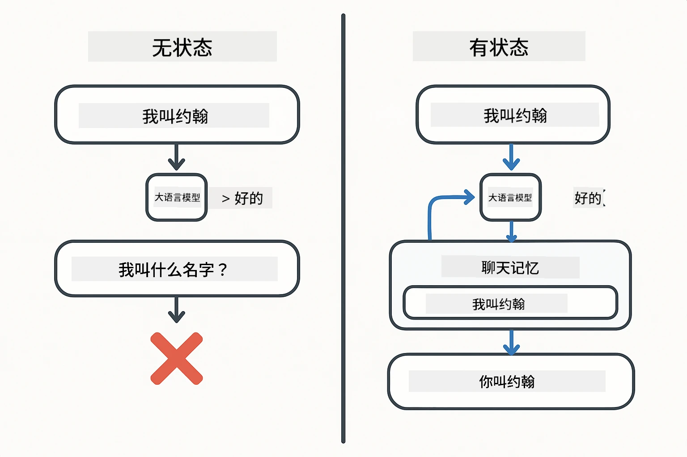
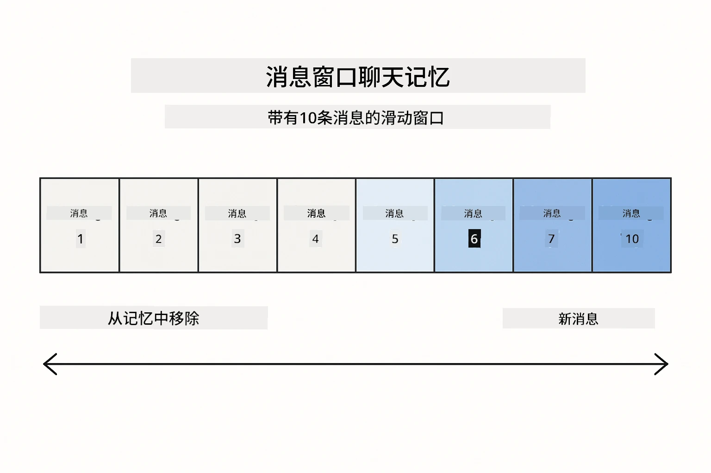
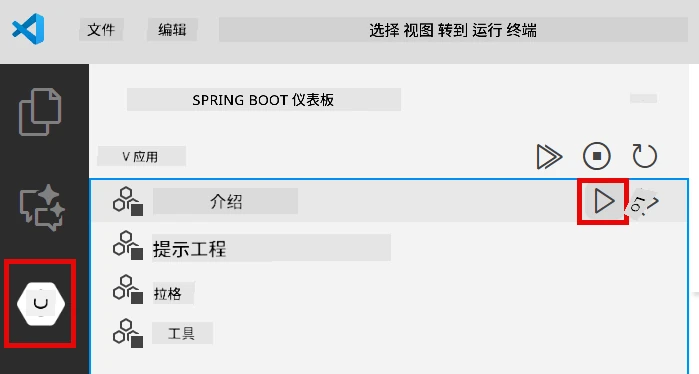
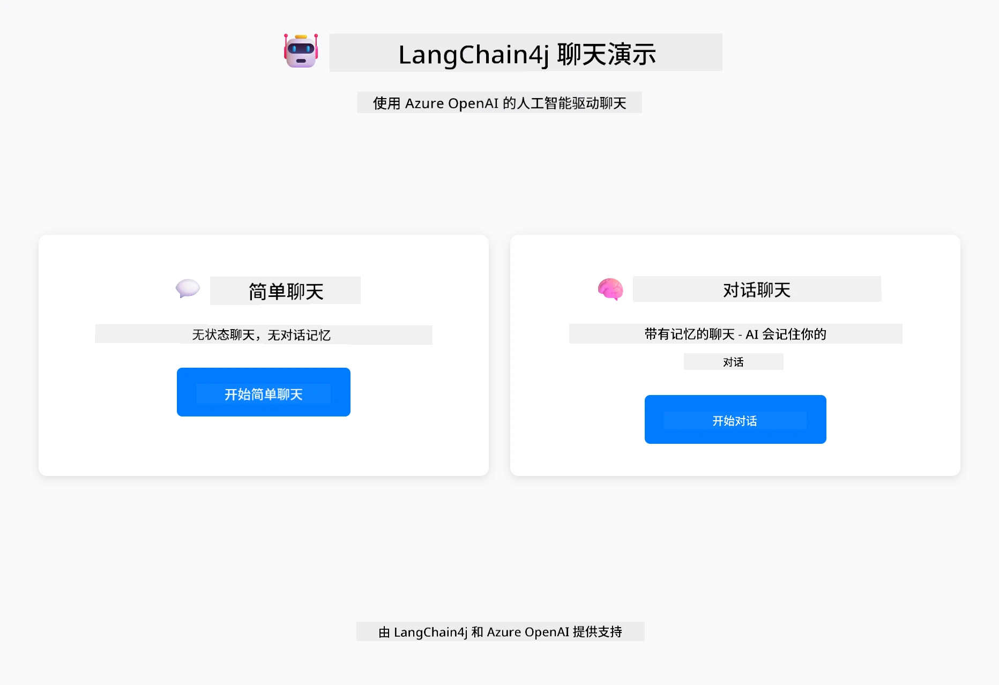
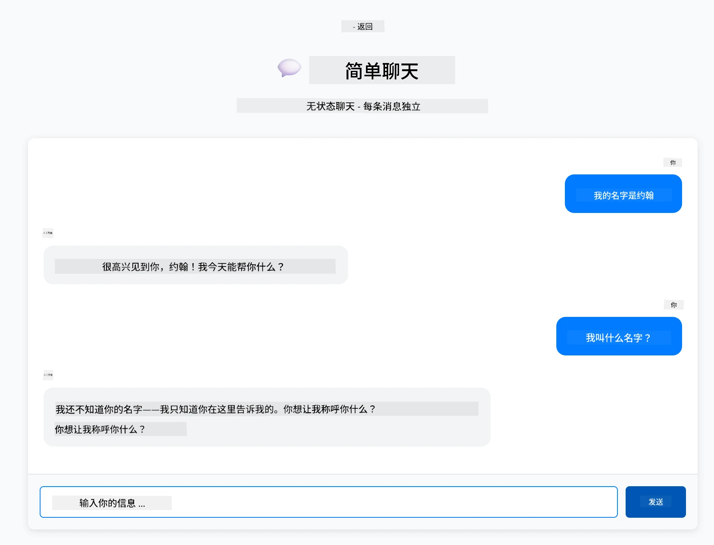
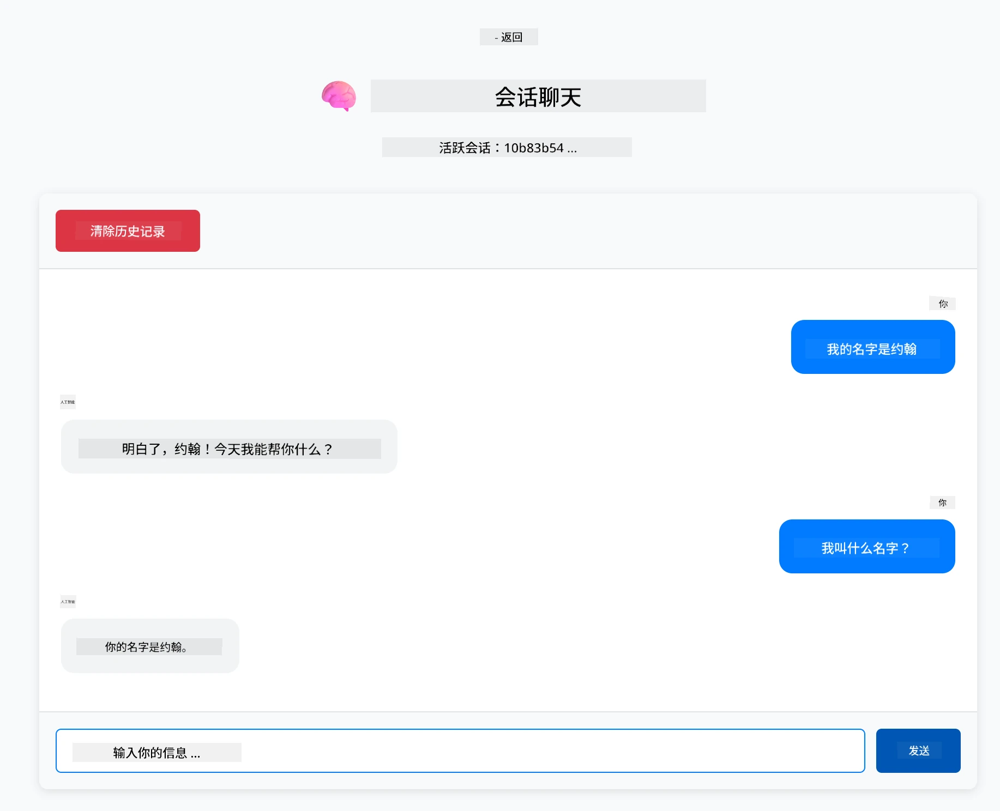

# 模块 01：开始使用 LangChain4j

## 目录

- [视频演练](#视频演练)
- [你将学到什么](#你将学到什么)
- [先决条件](#先决条件)
- [理解核心问题](#理解核心问题)
- [理解 Tokens](#理解-tokens)
- [内存是如何工作的](#内存是如何工作的)
- [本模块如何使用 LangChain4j](#本模块如何使用-langchain4j)
- [部署 Azure OpenAI 基础设施](#部署-azure-openai-基础设施)
- [本地运行应用](#本地运行应用)
- [使用应用](#使用应用)
  - [无状态聊天（左侧面板）](#无状态聊天（左侧面板）)
  - [有状态聊天（右侧面板）](#有状态聊天（右侧面板）)
- [接下来的步骤](#接下来的步骤)

## 视频演练

观看这段直播，讲解如何开始使用本模块：

<a href="https://www.youtube.com/live/nl_troDm8rQ?si=6b85S8xGjWnT2fX9"></a>

## 你将学到什么

这是你学习 LangChain4j 和 Azure OpenAI 的起点。我们从基础开始，逐步构建生产级应用。本模块专注于能够记忆上下文并保持状态的对话式 AI —— 这是后续所有模块的基础概念。

整个指南中，我们将使用 Azure OpenAI 的 GPT-5.2。它先进的推理能力使不同模式的行为更为明显。添加内存后，你将清楚地看到差别，也更容易理解各组件为你的应用带来的价值。

你将构建一个同时演示两种模式的应用：

<strong>无状态聊天</strong> — 每次请求独立。模型不记得之前的消息。这是最简单的起点。

<strong>有状态对话</strong> — 每次请求包含对话历史。模型跨多轮维持上下文状态。这是生产环境应用所必需的。

## 先决条件

- 拥有可以访问 Azure OpenAI 的 Azure 订阅
- Java 21，Maven 3.9+
- Azure CLI (https://learn.microsoft.com/en-us/cli/azure/install-azure-cli)
- Azure Developer CLI (azd) (https://learn.microsoft.com/en-us/azure/developer/azure-developer-cli/install-azd)

> **注意：** 提供的开发容器中预装了 Java、Maven、Azure CLI 和 Azure Developer CLI (azd)。

> **注意：** 本模块使用 Azure OpenAI 上的 GPT-5.2。部署通过 `azd up` 自动配置——请勿修改代码中的模型名称。

## 理解核心问题

语言模型是无状态的。每个 API 调用都是独立的。如果你先发送“我的名字是 John”，然后问“我叫什么名字？”，模型不会知道你刚刚介绍了自己。它把每次请求当作是你第一次对话。

这对于简单的问答还行，但对于实际应用毫无用处。客服机器人需要记住你告诉它的信息。个人助手需要上下文。任何多轮对话都需要内存。

下面的图展示了两种方法对比 —— 左边是无状态调用，它会忘记你的名字；右边是有状态调用，使用 ChatMemory 记住了它。



*无状态（独立调用）与有状态（上下文感知）对话的区别*

## 理解 Tokens

在深入对话前，重要的是理解 tokens —— 语言模型处理的基本文本单位：


*文本如何拆分成 tokens 的示例 —— “I love AI!” 拆成 4 个独立处理单元*

Tokens 是 AI 模型测量和处理文本的方式。单词、标点符号，甚至空格都可以是 token。你使用的模型有一次能处理的 token 限制（GPT-5.2 为 400,000 个 token，包含最多 272,000 输入和 128,000 输出）。理解 tokens 有助于你管理对话长度和费用。

## 内存是如何工作的

聊天内存通过维护对话历史解决了无状态问题。发送请求给模型前，框架会预先添加相关的历史消息。当你问“我叫什么名字？”，系统实际上发送了整个对话历史，模型就能看到你之前说了“我的名字是 John”。

LangChain4j 提供了自动处理内存的实现。你指定保留多少条消息，框架会管理上下文窗口。下图展示了 MessageWindowChatMemory 如何维护最近消息的滑动窗口。



*MessageWindowChatMemory 维护最近消息的滑动窗口，自动丢弃旧消息*

## 本模块如何使用 LangChain4j

本模块结合 Spring Boot，并添加对话内存。各部分如何协同：

<strong>依赖</strong> — 添加两个 LangChain4j 库：

```xml
<dependency>
    <groupId>dev.langchain4j</groupId>
    <artifactId>langchain4j</artifactId> <!-- Inherited from BOM in root pom.xml -->
</dependency>
<dependency>
    <groupId>dev.langchain4j</groupId>
    <artifactId>langchain4j-open-ai-official</artifactId> <!-- Inherited from BOM in root pom.xml -->
</dependency>
```

<strong>聊天模型</strong> — 配置 Azure OpenAI 作为 Spring Bean（[LangChainConfig.java](../../../01-introduction/src/main/java/com/example/langchain4j/config/LangChainConfig.java)）：

```java
@Bean
public OpenAiOfficialChatModel openAiOfficialChatModel() {
    return OpenAiOfficialChatModel.builder()
            .baseUrl(azureEndpoint)
            .apiKey(azureApiKey)
            .modelName(deploymentName)
            .timeout(Duration.ofMinutes(5))
            .maxRetries(3)
            .build();
}
```

构建器从 `azd up` 设置的环境变量读取凭证。将 `baseUrl` 设为你的 Azure 端点，使 OpenAI 客户端能与 Azure OpenAI 配合使用。

<strong>对话内存</strong> — 使用 MessageWindowChatMemory 跟踪聊天历史（[ConversationService.java](../../../01-introduction/src/main/java/com/example/langchain4j/service/ConversationService.java)）：

```java
ChatMemory memory = MessageWindowChatMemory.withMaxMessages(10);

memory.add(UserMessage.from("My name is John"));
memory.add(AiMessage.from("Nice to meet you, John!"));

memory.add(UserMessage.from("What's my name?"));
AiMessage aiMessage = chatModel.chat(memory.messages()).aiMessage();
memory.add(aiMessage);
```

用 `withMaxMessages(10)` 创建内存，保留最近 10 条消息。通过类型包装器添加用户和 AI 消息：`UserMessage.from(text)` 和 `AiMessage.from(text)`。用 `memory.messages()` 获取历史，并发送给模型。服务为每个会话 ID 存储独立内存实例，支持多个用户同时聊天。

> **🤖 试试用 [GitHub Copilot](https://github.com/features/copilot) 聊天：** 打开 [`ConversationService.java`](../../../01-introduction/src/main/java/com/example/langchain4j/service/ConversationService.java)，问：
> - “MessageWindowChatMemory 在窗口满时如何决定丢弃哪些消息？”
> - “我可以用数据库代替内存来实现自定义内存存储吗？”
> - “如何添加摘要功能以压缩旧的对话历史？”

无状态聊天端点完全跳过内存——只调用 `chatModel.chat(prompt)`，如快速开始一样。有状态端点则添加消息到内存，检索历史，用上下文随着每次请求发送。模型配置相同，模式不同。

## 部署 Azure OpenAI 基础设施

**Bash:**
```bash
cd 01-introduction
azd up  # 选择订阅和位置（推荐 eastus2）
```

**PowerShell:**
```powershell
cd 01-introduction
azd up  # 选择订阅和位置（推荐 eastus2）
```

> **注意：** 如果遇到超时错误（`RequestConflict: Cannot modify resource ... provisioning state is not terminal`），只需再次运行 `azd up`。Azure 资源可能仍在后台创建中，重试可让部署在资源达到终止状态后完成。

这会：
1. 部署包含 GPT-5.2 和 text-embedding-3-small 模型的 Azure OpenAI 资源
2. 在项目根目录自动生成带有凭证的 `.env` 文件
3. 设置所有必需的环境变量

**部署有问题？** 请查阅 [基础设施 README](infra/README.md)，包含子域名冲突、手动 Azure 门户部署步骤、模型配置指导等详细排查方法。

**验证部署是否成功：**

**Bash:**
```bash
cat ../.env  # 应该显示 AZURE_OPENAI_ENDPOINT、API_KEY 等。
```

**PowerShell:**
```powershell
Get-Content ..\.env  # 应该显示 AZURE_OPENAI_ENDPOINT、API_KEY 等。
```

> **注意：** `azd up` 命令会自动生成 `.env` 文件。如需后续更新，可以手动编辑 `.env` 文件，或通过以下命令重新生成：
>
> **Bash:**
> ```bash
> cd ..
> bash .azd-env.sh
> ```
>
> **PowerShell:**
> ```powershell
> cd ..
> .\.azd-env.ps1
> ```

## 本地运行应用

**验证部署：**

确认根目录存在带有 Azure 凭证的 `.env` 文件。从模块目录（`01-introduction/`）运行：

**Bash:**
```bash
cat ../.env  # 应显示 AZURE_OPENAI_ENDPOINT、API_KEY、DEPLOYMENT
```

**PowerShell:**
```powershell
Get-Content ..\.env  # 应显示 AZURE_OPENAI_ENDPOINT、API_KEY、DEPLOYMENT
```

**启动应用：**

**方案 1：使用 Spring Boot Dashboard（推荐 VS Code 用户）**

开发容器包含 Spring Boot Dashboard 扩展，为所有 Spring Boot 应用提供可视化管理界面。你可以在 VS Code 左侧活动栏找到这个图标（Spring Boot 图标）。

通过 Spring Boot Dashboard，你可以：
- 查看工作区中的所有 Spring Boot 应用
- 一键启动/停止应用
- 实时查看应用日志
- 监控应用状态

点击 “introduction” 旁的播放按钮启动此模块，或一次启动所有模块。



*VS Code 中的 Spring Boot Dashboard —— 从一个界面启动、停止并监控所有模块*

**方案 2：使用 shell 脚本**

启动所有 Web 应用（模块 01-04）：

**Bash:**
```bash
cd ..  # 从根目录
./start-all.sh
```

**PowerShell:**
```powershell
cd ..  # 从根目录
.\start-all.ps1
```

或仅启动本模块：

**Bash:**
```bash
cd 01-introduction
./start.sh
```

**PowerShell:**
```powershell
cd 01-introduction
.\start.ps1
```

两个脚本均自动从根目录 `.env` 文件加载环境变量，如果 JAR 文件不存在，则会构建。

> **注意：** 如果你想先手动构建所有模块再启动：
>
> **Bash:**
> ```bash
> cd ..  # Go to root directory
> mvn clean package -DskipTests
> ```
>
> **PowerShell:**
> ```powershell
> cd ..  # Go to root directory
> mvn clean package -DskipTests
> ```

打开浏览器访问 http://localhost:8080 。

**停止应用：**

**Bash:**
```bash
./stop.sh  # 仅此模块
# 或
cd .. && ./stop-all.sh  # 所有模块
```

**PowerShell:**
```powershell
.\stop.ps1  # 仅此模块
# 或
cd ..; .\stop-all.ps1  # 所有模块
```

## 使用应用

该应用提供网页界面，左右并排显示两种聊天实现。



*仪表盘显示简单聊天（无状态）和对话聊天（有状态）选项*

### 无状态聊天（左侧面板）

先试试这个。先输入“我的名字是 John”，然后立即问“我叫什么名字？”。模型不会记住，因为每条消息都是独立的。这展示了基本语言模型集成的核心问题——没有对话上下文。



*AI 不会记得你上一条消息中的名字*

### 有状态聊天（右侧面板）

然后在这里做同样操作。先说“我的名字是 John”，再问“我叫什么名字？”。这次模型会记得。差别在于 MessageWindowChatMemory —— 它维护对话历史，并在每次请求时附带上下文。这就是生产级对话 AI 的工作方式。



*AI 记得对话中早先告诉它的名字*

两个面板都使用相同的 GPT-5.2 模型。唯一区别是内存。这清楚展示了内存对你的应用带来了什么，以及为什么它对实际应用至关重要。

## 接下来的步骤

**下一个模块：** [02-prompt-engineering - 使用 GPT-5.2 的提示工程](../02-prompt-engineering/README.md)

---

**导航：** [← 返回主目录](../README.md) | [下一个：模块 02 - 提示工程 →](../02-prompt-engineering/README.md)

---

<!-- CO-OP TRANSLATOR DISCLAIMER START -->
**免责声明**：
本文件由 AI 翻译服务 [Co-op Translator](https://github.com/Azure/co-op-translator) 翻译完成。尽管我们力求准确，但请注意，自动翻译可能包含错误或不准确之处。原始语言版文件应视为权威来源。对于重要信息，建议使用专业人工翻译。我们对因使用本翻译而产生的任何误解或误释不承担责任。
<!-- CO-OP TRANSLATOR DISCLAIMER END -->