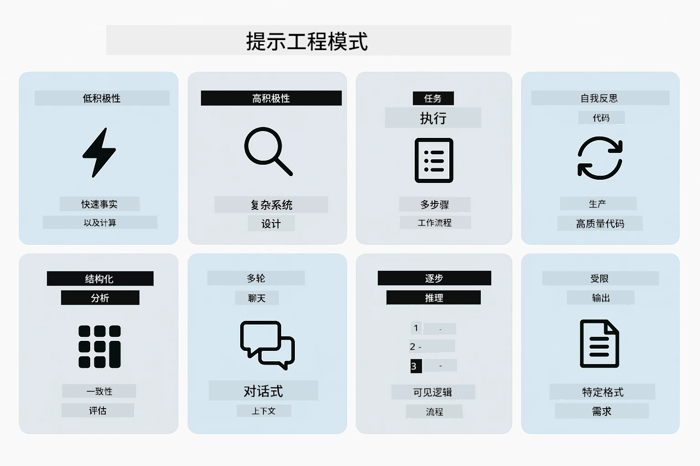
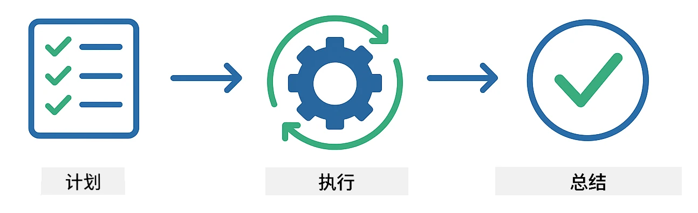
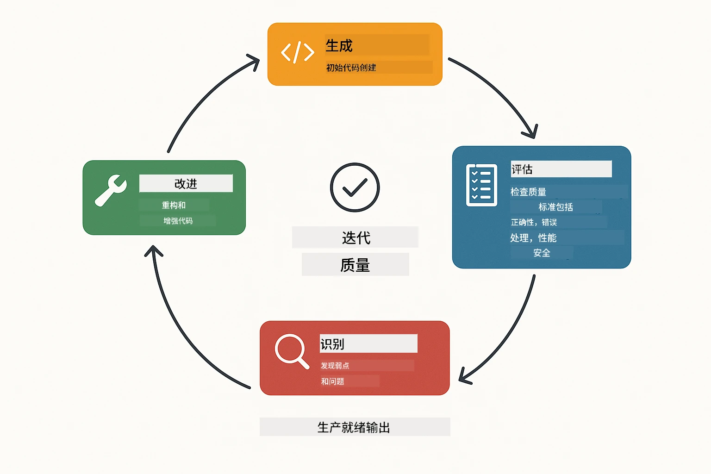
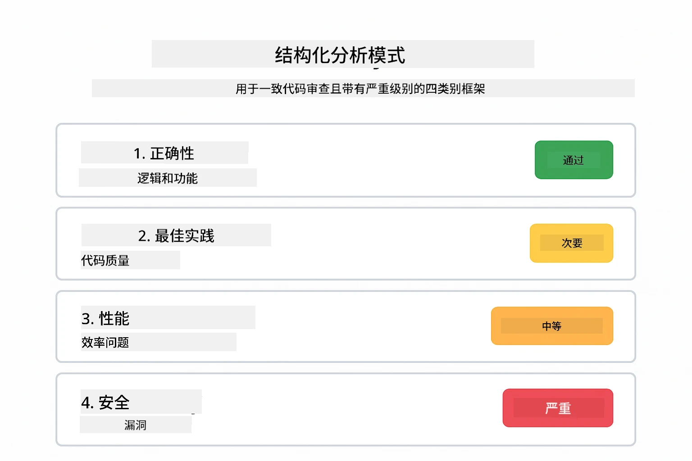
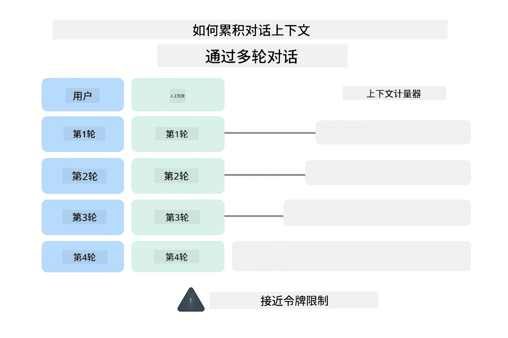
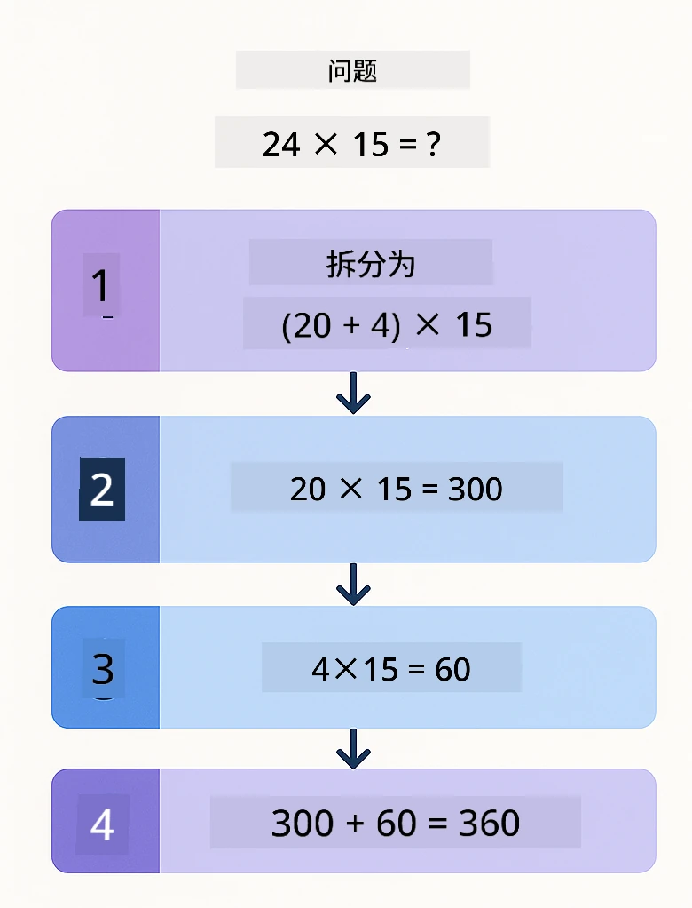
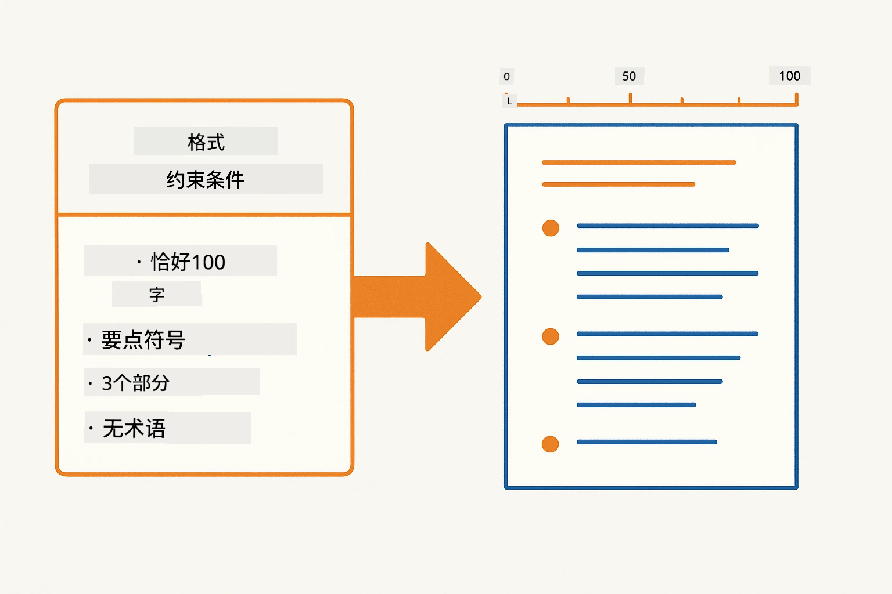
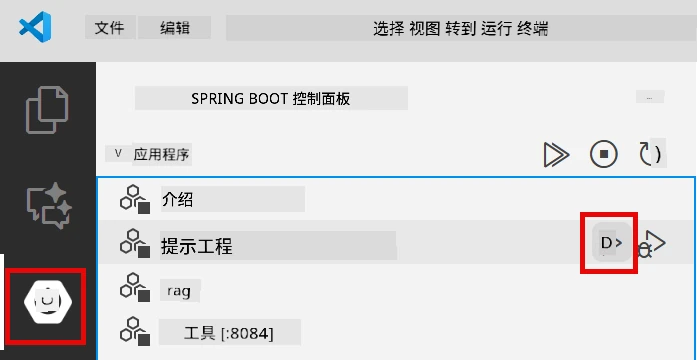
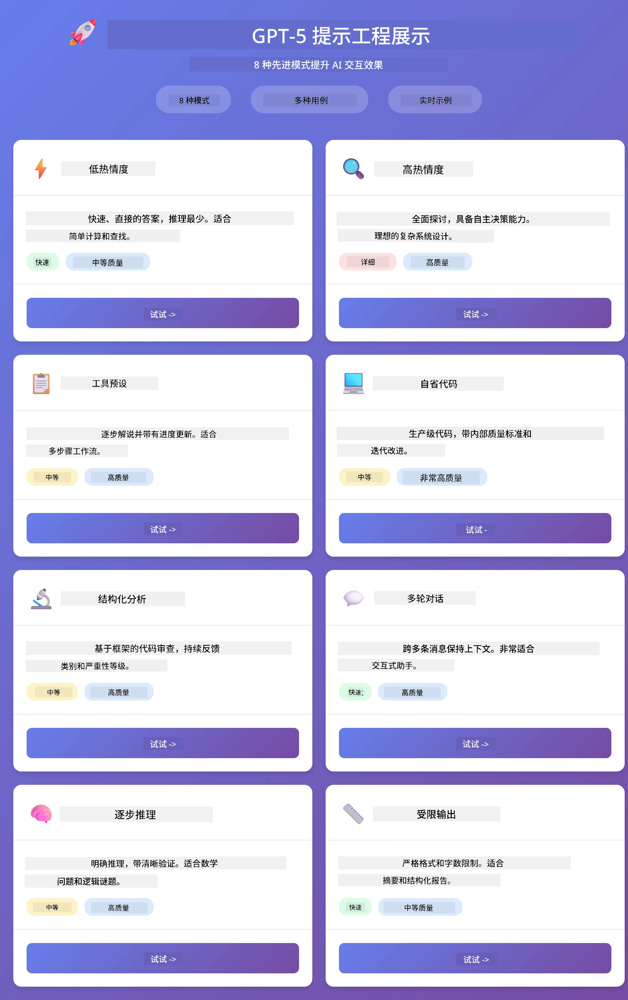
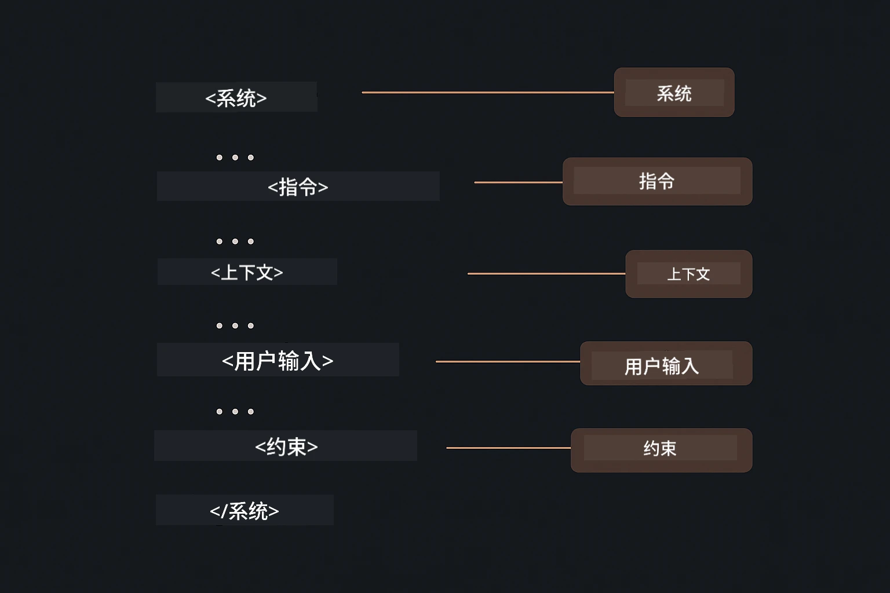

# Module 02: 使用 GPT-5.2 进行提示工程

## 目录

- [视频讲解](#视频讲解)
- [你将学到什么](#你将学到什么)
- [先决条件](#先决条件)
- [理解提示工程](#理解提示工程)
- [提示工程基础](#提示工程基础)
  - [零样本提示](#零样本提示)
  - [少样本提示](#少样本提示)
  - [思维链](#思维链)
  - [基于角色的提示](#基于角色的提示)
  - [提示模板](#提示模板)
- [高级模式](#高级模式)
- [运行应用程序](#运行应用程序)
- [应用程序截图](#应用截图)
- [探索模式](#探索模式)
  - [低渴望与高渴望](#低关注度-vs-高关注度)
  - [任务执行（工具前言）](#任务执行（工具前言）)
  - [自我反思代码](#自省代码)
  - [结构化分析](#结构化分析)
  - [多轮聊天](#多轮对话)
  - [逐步推理](#逐步推理)
  - [受限输出](#受限输出)
- [你真正学到了什么](#你真正学到了什么)
- [接下来的步骤](#下一步)

## 视频讲解

观看本直播课程，了解如何开始本模块：

<a href="https://www.youtube.com/live/PJ6aBaE6bog?si=LDshyBrTRodP-wke"></a>

## 你将学到什么

下面的图表概述了你将在本模块中学习的关键主题和技能——从提示优化技巧到你将遵循的逐步工作流程。


在上一个模块中，你了解了内存如何支持基于 Azure OpenAI 的对话式 AI。现在我们将重点放在如何提问——提示本身的设计，使用 Azure OpenAI 的 GPT-5.2。你结构化提示的方式会极大地影响你获得的回复质量。我们先回顾基本的提示技巧，然后进入八种高级模式，充分利用 GPT-5.2 的能力。

我们选择 GPT-5.2，因为它引入了推理控制——你可以告诉模型在回答前思考多少。这使得不同的提示策略更加明显，帮助你了解何时使用每种方法。

## 先决条件

- 完成模块01（已部署 Azure OpenAI 资源）
- 根目录有 `.env` 文件，包含 Azure 凭据（由模块01中的`azd up`创建）

> **注意：** 如果你尚未完成模块01，请先按照那里的部署说明操作。

## 理解提示工程

提示工程的本质是模糊指令与精确指令之间的区别，如下图所示。


提示工程就是设计输入文本，使你能持续获得所需结果。它不仅仅是提问——而是结构化请求，让模型准确理解你想要什么以及如何交付。

把它比作给同事下指令。“修复 bug”就很模糊。“通过添加空值检查，修复 UserService.java 第45行的空指针异常”则很具体。语言模型也是如此——具体性和结构非常重要。

下图展示了 LangChain4j 在这其中的角色——通过 `SystemMessage` 和 `UserMessage` 构建块，将你的提示模式连接至模型。


LangChain4j 提供基础设施——模型连接、内存和消息类型——而提示模式只是你通过这套基础设施发送的精心结构化文本。关键构建块是 `SystemMessage`（设定 AI 的行为和角色）和 `UserMessage`（承载你的具体请求）。

## 提示工程基础

以下五种核心技巧构成有效提示工程的基础。每种都针对你与语言模型沟通的不同方面。


在探讨本模块的高级模式前，我们先回顾五种基础提示技巧。这些是每个提示工程师都应掌握的基石。

### 零样本提示

最简单的方法：不给示例，直接给模型指令。模型完全依赖其训练来理解和执行任务。适用于行为明显的简单请求。


*无示例的直接指令——模型仅从指令推断任务*

```java
String prompt = "Classify this sentiment: 'I absolutely loved the movie!'";
String response = model.chat(prompt);
// 回复：“阳性”
```

**适用场景：** 简单分类、直接提问、翻译或任何无需额外指导模型可处理的任务。

### 少样本提示

给出示例，展示你希望模型遵循的模式。模型从示例中学输入输出格式，然后应用于新输入。这极大提高了格式或行为不明显任务的一致性。


*从示例中学习——识别模式并应用于新输入*

```java
String prompt = """
    Classify the sentiment as positive, negative, or neutral.
    
    Examples:
    Text: "This product exceeded my expectations!" → Positive
    Text: "It's okay, nothing special." → Neutral
    Text: "Waste of money, very disappointed." → Negative
    
    Now classify this:
    Text: "Best purchase I've made all year!"
    """;
String response = model.chat(prompt);
```

**适用场景：** 自定义分类、一致格式化、特定领域任务，或零样本结果不稳定时。

### 思维链

让模型逐步展示推理过程。不是直接给答案，而是分解问题，清晰处理每个部分。提升数学、逻辑、多步推理任务的准确度。


*逐步推理——将复杂问题拆解成明确的逻辑步骤*

```java
String prompt = """
    Problem: A store has 15 apples. They sell 8 apples and then 
    receive a shipment of 12 more apples. How many apples do they have now?
    
    Let's solve this step-by-step:
    """;
String response = model.chat(prompt);
// 模型显示：15 - 8 = 7，然后 7 + 12 = 19 个苹果
```

**适用场景：** 数学题、逻辑谜题、调试，或任何清晰展示推理过程能提升准确性和信任的任务。

### 基于角色的提示

在提问前设定 AI 的身份或角色。为回复提供上下文，影响语气、深度和焦点。“软件架构师”与“初级开发者”或“安全审计员”会给出不同的建议。


*设定上下文和角色——同一问题根据角色会有不同回复*

```java
String prompt = """
    You are an experienced software architect reviewing code.
    Provide a brief code review for this function:
    
    def calculate_total(items):
        total = 0
        for item in items:
            total = total + item['price']
        return total
    """;
String response = model.chat(prompt);
```

**适用场景：** 代码审查、辅导、领域分析，或需要针对特定专业水平或视角的回答时。

### 提示模板

创建带变量占位符的可复用提示。不必每次写新提示，只需定义一次模板，填入不同值。LangChain4j 的 `PromptTemplate` 类用 `{{variable}}` 语法轻松实现。


*带变量占位符的可复用提示——一份模板，多次使用*

```java
PromptTemplate template = PromptTemplate.from(
    "What's the best time to visit {{destination}} for {{activity}}?"
);

Prompt prompt = template.apply(Map.of(
    "destination", "Paris",
    "activity", "sightseeing"
));

String response = model.chat(prompt.text());
```

**适用场景：** 重复查询不同输入、批量处理、构建可复用 AI 流程，或提示结构固定但数据变化的场景。

---

这五个基础技巧为你大部分提示任务提供了坚实工具集。本模块其余内容基于此，介绍<strong>八种高级模式</strong>，利用 GPT-5.2 的推理控制、自我评估和结构化输出能力。

## 高级模式

掌握基础后，让我们进入本模块独具特色的八种高级模式。并非所有问题都需同一方法。有的要迅速回答，有的需深度思考。有的需展示推理，有的只要结果。下面每种模式针对不同场景优化——GPT-5.2 的推理控制让这些差异更加明显。



<em>八种提示工程模式及其用例概览</em>

GPT-5.2 为这些模式增加了新维度：<em>推理控制</em>。下面的滑块展示你如何调节模型的思考力度——从快速直接回答到深入彻底分析。


*GPT-5.2 的推理控制让你决定模型思考多少——从快速答复到深入探索*

**低渴望（快速且专注）** - 简单问题快速直达答案。模型推理最少，最多两步。适合计算、查找或简单提问。

```java
String prompt = """
    <context_gathering>
    - Search depth: very low
    - Bias strongly towards providing a correct answer as quickly as possible
    - Usually, this means an absolute maximum of 2 reasoning steps
    - If you think you need more time, state what you know and what's uncertain
    </context_gathering>
    
    Problem: What is 15% of 200?
    
    Provide your answer:
    """;

String response = chatModel.chat(prompt);
```

> 💡 **用 GitHub Copilot 探索：** 打开 [`Gpt5PromptService.java`](../../../02-prompt-engineering/src/main/java/com/example/langchain4j/prompts/service/Gpt5PromptService.java)，问：
> - “低渴望和高渴望提示模式有什么区别？”
> - “提示中的 XML 标签如何帮助结构化 AI 的回答？”
> - “什么时候使用自我反思模式，什么时候用直接指令？”

**高渴望（深度且彻底）** - 复杂问题，需全面分析。模型详细推理、充分探索。适合系统设计、架构决策或复杂研究。

```java
String prompt = """
    Analyze this problem thoroughly and provide a comprehensive solution.
    Consider multiple approaches, trade-offs, and important details.
    Show your analysis and reasoning in your response.
    
    Problem: Design a caching strategy for a high-traffic REST API.
    """;

String response = chatModel.chat(prompt);
```

**任务执行（逐步进度）** - 多步骤工作流。模型先给计划，再边做边讲，最后总结。适用于迁移、实现或任何多步骤过程。

```java
String prompt = """
    <task_execution>
    1. First, briefly restate the user's goal in a friendly way
    
    2. Create a step-by-step plan:
       - List all steps needed
       - Identify potential challenges
       - Outline success criteria
    
    3. Execute each step:
       - Narrate what you're doing
       - Show progress clearly
       - Handle any issues that arise
    
    4. Summarize:
       - What was completed
       - Any important notes
       - Next steps if applicable
    </task_execution>
    
    <tool_preambles>
    - Always begin by rephrasing the user's goal clearly
    - Outline your plan before executing
    - Narrate each step as you go
    - Finish with a distinct summary
    </tool_preambles>
    
    Task: Create a REST endpoint for user registration
    
    Begin execution:
    """;

String response = chatModel.chat(prompt);
```

思维链提示明确要求模型展示推理过程，提升复杂任务准确性。逐步拆解帮助人和 AI 理解逻辑。

> **🤖 用 [GitHub Copilot](https://github.com/features/copilot) Chat 试试：** 询问该模式：
> - “如何调整任务执行模式以支持长时间运行操作？”
> - “生产应用中如何设计工具前言的最佳实践？”
> - “如何捕获并展示 UI 中的中间进度更新？”

下图展示计划 → 执行 → 总结的工作流程。



*多步骤任务的计划 → 执行 → 总结工作流*

<strong>自我反思代码</strong> - 生成生产质量代码。模型产出符合生产标准的代码，带有适当错误处理。适合新功能或服务开发。

```java
String prompt = """
    Generate Java code with production-quality standards: Create an email validation service
    Keep it simple and include basic error handling.
    """;

String response = chatModel.chat(prompt);
```

下图描绘迭代改进循环——生成、评估、识别问题、改进，直到代码符合生产要求。



*迭代改进循环——生成、评估、发现问题、改进、重复*

<strong>结构化分析</strong> - 一致评估。模型使用固定框架（正确性、实践、性能、安全、可维护性）审查代码。适合代码审查或质量评估。

```java
String prompt = """
    <analysis_framework>
    You are an expert code reviewer. Analyze the code for:
    
    1. Correctness
       - Does it work as intended?
       - Are there logical errors?
    
    2. Best Practices
       - Follows language conventions?
       - Appropriate design patterns?
    
    3. Performance
       - Any inefficiencies?
       - Scalability concerns?
    
    4. Security
       - Potential vulnerabilities?
       - Input validation?
    
    5. Maintainability
       - Code clarity?
       - Documentation?
    
    <output_format>
    Provide your analysis in this structure:
    - Summary: One-sentence overall assessment
    - Strengths: 2-3 positive points
    - Issues: List any problems found with severity (High/Medium/Low)
    - Recommendations: Specific improvements
    </output_format>
    </analysis_framework>
    
    Code to analyze:
    ```
    public List getUsers() {
        return database.query("SELECT * FROM users");
    }
    ```
    Provide your structured analysis:
    """;

String response = chatModel.chat(prompt);
```

> **🤖 用 [GitHub Copilot](https://github.com/features/copilot) Chat 试试：** 询问结构化分析：
> - “如何为不同类型代码审查定制分析框架？”
> - “程序化解析和处理结构化输出的最佳方法？”
> - “如何保持不同审查会话中严重级别的一致性？”

下面图展示如何用结构化框架将代码审查分为不同类别，附带严重级别。



<em>带严重级别的一致代码审查框架</em>

<strong>多轮聊天</strong> - 需要上下文的对话。模型记住此前消息并基于此回复。适合交互式帮助或复杂问答。

```java
ChatMemory memory = MessageWindowChatMemory.withMaxMessages(10);

memory.add(UserMessage.from("What is Spring Boot?"));
AiMessage aiMessage1 = chatModel.chat(memory.messages()).aiMessage();
memory.add(aiMessage1);

memory.add(UserMessage.from("Show me an example"));
AiMessage aiMessage2 = chatModel.chat(memory.messages()).aiMessage();
memory.add(aiMessage2);
```

下图展示对话上下文如何随着轮次积累，以及它如何关联模型的 token 限制。



*对话上下文如何随多轮积累，直到达到 token 限制*

<strong>逐步推理</strong> - 需要展示逻辑的难题。模型展示每一步明确推理。适合数学题、逻辑谜题，或者需理解思考过程的场景。

```java
String prompt = """
    <instruction>Show your reasoning step-by-step</instruction>
    
    If a train travels 120 km in 2 hours, then stops for 30 minutes,
    then travels another 90 km in 1.5 hours, what is the average speed
    for the entire journey including the stop?
    """;

String response = chatModel.chat(prompt);
```

下图展示模型如何将问题拆解成明确编号的逻辑步骤。


<em>将问题分解为明确的逻辑步骤</em>

<strong>受限输出</strong> - 适用于有特定格式要求的回复。模型严格遵守格式和长度规则。用于摘要或需要精确输出结构的场景。

```java
String prompt = """
    <constraints>
    - Exactly 100 words
    - Bullet point format
    - Technical terms only
    </constraints>
    
    Summarize the key concepts of machine learning.
    """;

String response = chatModel.chat(prompt);
```

下图展示了约束如何引导模型生成严格符合您格式和长度要求的输出。



*强制特定格式、长度和结构要求*

## 运行应用程序

**验证部署：**

确保根目录下存在包含 Azure 凭据的 `.env` 文件（在模块01中创建）。从模块目录 (`02-prompt-engineering/`) 运行：

**Bash:**
```bash
cat ../.env  # 应该显示 AZURE_OPENAI_ENDPOINT、API_KEY、DEPLOYMENT
```

**PowerShell:**
```powershell
Get-Content ..\.env  # 应该显示 AZURE_OPENAI_ENDPOINT、API_KEY、DEPLOYMENT
```

**启动应用程序：**

> **注意：** 如果您已使用根目录下的 `./start-all.sh` 启动所有应用程序（如模块01中所述），本模块已在端口8083上运行。您可以跳过下面的启动命令，直接访问 http://localhost:8083。

**选项1：使用 Spring Boot Dashboard（推荐 VS Code 用户）**

开发容器包含 Spring Boot Dashboard 扩展，提供管理所有 Spring Boot 应用的可视界面。您可以在 VS Code 左侧的活动栏中找到它（查找 Spring Boot 图标）。

通过 Spring Boot Dashboard，您可以：
- 查看工作区内所有可用的 Spring Boot 应用
- 一键启动/停止应用
- 实时查看应用日志
- 监控应用状态

只需点击“prompt-engineering”旁的播放按钮即可启动此模块，或一次启动所有模块。



*VS Code 中的 Spring Boot Dashboard — 从一个地方启动、停止并监控所有模块*

**选项2：使用 shell 脚本**

启动所有 Web 应用（模块01-04）：

**Bash:**
```bash
cd ..  # 从根目录
./start-all.sh
```

**PowerShell:**
```powershell
cd ..  # 从根目录
.\start-all.ps1
```

或者仅启动本模块：

**Bash:**
```bash
cd 02-prompt-engineering
./start.sh
```

**PowerShell:**
```powershell
cd 02-prompt-engineering
.\start.ps1
```

两个脚本会自动从根目录 `.env` 文件加载环境变量，如果 JAR 文件不存在则会构建。

> **注意：** 如果你想手动构建所有模块后再启动：
>
> **Bash:**
> ```bash
> cd ..  # Go to root directory
> mvn clean package -DskipTests
> ```
>
> **PowerShell:**
> ```powershell
> cd ..  # Go to root directory
> mvn clean package -DskipTests
> ```

在浏览器中打开 http://localhost:8083 。

**停止应用：**

**Bash:**
```bash
./stop.sh  # 仅此模块
# 或者
cd .. && ./stop-all.sh  # 所有模块
```

**PowerShell:**
```powershell
.\stop.ps1  # 仅此模块
# 或
cd ..; .\stop-all.ps1  # 所有模块
```

## 应用截图

这是提示工程模块的主界面，您可以在此并排试验全部八种模式。



*主仪表板显示全部8个提示工程模式及其特点和应用场景*

## 探索模式

Web 界面允许您试验不同的提示策略。每种模式解决不同的问题——试试它们，看看每种方法何时发挥效用。

> **注意：流式与非流式** — 每个模式页面都提供两个按钮：**🔴 流式响应（实时）** 和 <strong>非流式</strong> 选项。流式使用服务器发送事件（SSE）实时显示模型生成的每个 token，您可即时见到进度。非流式会等待全部响应生成完毕后才显示。对于触发深度推理的提示（如高关注度、高自省代码），非流式调用可能非常耗时——有时几分钟且无明显反馈。<strong>在试验复杂提示时请使用流式</strong>，这样可看到模型工作过程，避免误判请求超时。
>
> **注意：浏览器要求** — 流式功能依赖 Fetch Streams API (`response.body.getReader()`)，需要完整版浏览器（Chrome、Edge、Firefox、Safari）。VS Code 内置的简单浏览器不支持 ReadableStream API，因此不支持流式。使用简单浏览器时，非流式按钮可以正常使用——仅流式按钮受限。请在外部浏览器打开 `http://localhost:8083` 以获得完整体验。

### 低关注度 vs 高关注度

用低关注度问个简单问题：“200 的 15% 是多少？”您会得到即时、直接的答案。再用高关注度问个复杂问题：“为高流量 API 设计缓存策略”。点击 **🔴 流式响应（实时）**，观察模型逐个 token 详细推理。这是同一模型、相似的问法——区别在于提示告诉它要思考多少。

### 任务执行（工具前言）

多步骤工作流受益于提前规划和进度讲解。模型会先概述要做什么，再逐步讲解，然后总结结果。

### 自省代码

试试“创建一个邮件验证服务”。模型不仅生成代码，而且根据质量标准自我评估，找出弱点并改进。您会看到它反复迭代直到代码达到生产标准。

### 结构化分析

代码审查需一致评估框架。模型用固定分类（正确性、实践、性能、安全）并附严重级别分析代码。

### 多轮对话

问“小春 Boot 是什么？”然后紧接着问“给我看个例子”。模型会记住第一个问题，给你一个针对 Spring Boot 的具体示例。没有记忆的话，第二个问题太笼统。

### 逐步推理

选个数学题，同时用逐步推理和低关注度尝试。低关注度只给答案——快速但不透明；逐步推理展示所有计算和决策步骤。

### 受限输出

当你需要特定格式或字数时，这种模式会强制严格遵守。试试生成正好100字的项目符号格式摘要。

## 你真正学到了什么

<strong>推理投入改变一切</strong>

GPT-5.2 允许你通过提示控制计算投入。低投入意味着快速响应，探索少；高投入则让模型花时间深入思考。你正在学习如何匹配投入与任务复杂度——简单问题不浪费时间，复杂决策不急躁。

<strong>结构引导行为</strong>

注意提示中的 XML 标签？它们不是装饰。模型比自由文本更可靠地遵循结构化指令。需要多步骤或复杂逻辑时，结构有助于模型跟踪当前状态和下一步。下图分解了一个结构良好的提示，展示 `<system>`、`<instructions>`、`<context>`、`<user-input>`、`<constraints>` 等标签如何将指令划分为清晰部分。



*结构良好提示的组成，清晰分段和 XML 风格组织*

<strong>质量来自自我评估</strong>

自省模式通过明确质量标准工作。不再依赖模型“做对”，而是告诉它“对”的定义：逻辑正确、错误处理、性能、安全。模型可以评估自身输出并改进。这样代码生成从抽奖变成一个过程。

<strong>上下文是有限的</strong>

多轮对话通过附加消息历史实现。但有上限——每个模型有最大 token 数。对话增长时，你需要策略来保持相关上下文同时不超限。本模块展示记忆如何工作；后续你将学习何时总结、何时忘记、何时检索。

## 下一步

**下一模块：** [03-rag - RAG（检索增强生成）](../03-rag/README.md)

---

**导航：** [← 上一节：模块01 - 介绍](../01-introduction/README.md) | [返回主页](../README.md) | [下一节：模块03 - RAG →](../03-rag/README.md)

---

<!-- CO-OP TRANSLATOR DISCLAIMER START -->
**免责声明**：
本文件由 AI 翻译服务 [Co-op Translator](https://github.com/Azure/co-op-translator) 翻译完成。尽管我们力求准确，但请注意，自动翻译可能包含错误或不准确之处。原始语言版文件应视为权威来源。对于重要信息，建议使用专业人工翻译。我们对因使用本翻译而产生的任何误解或误释不承担责任。
<!-- CO-OP TRANSLATOR DISCLAIMER END -->