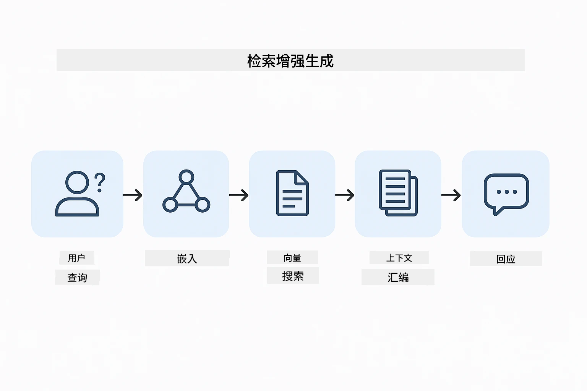
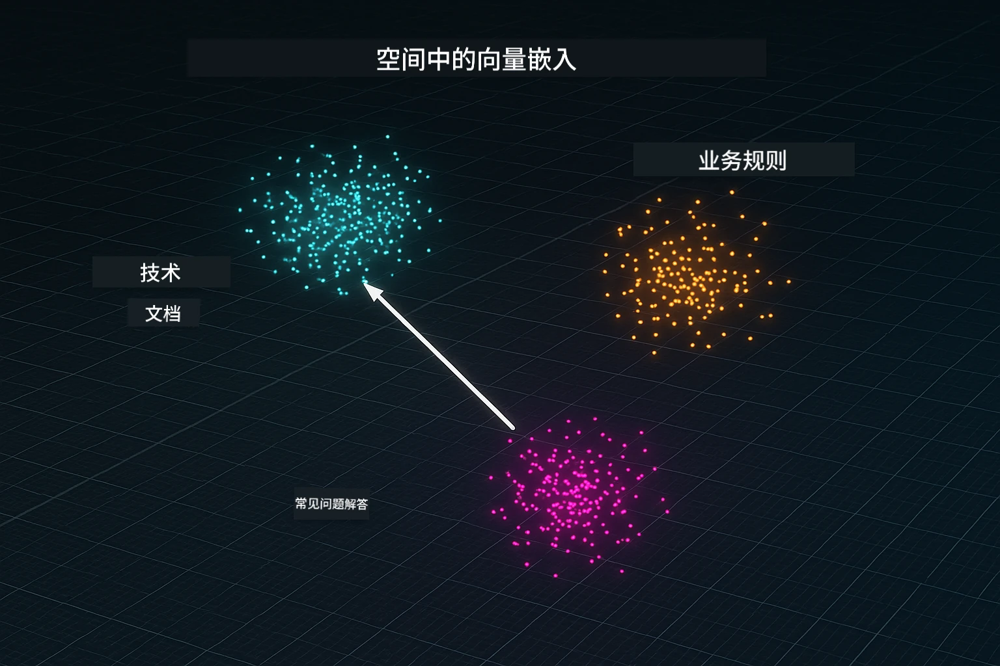
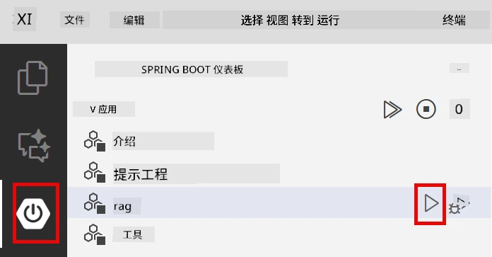
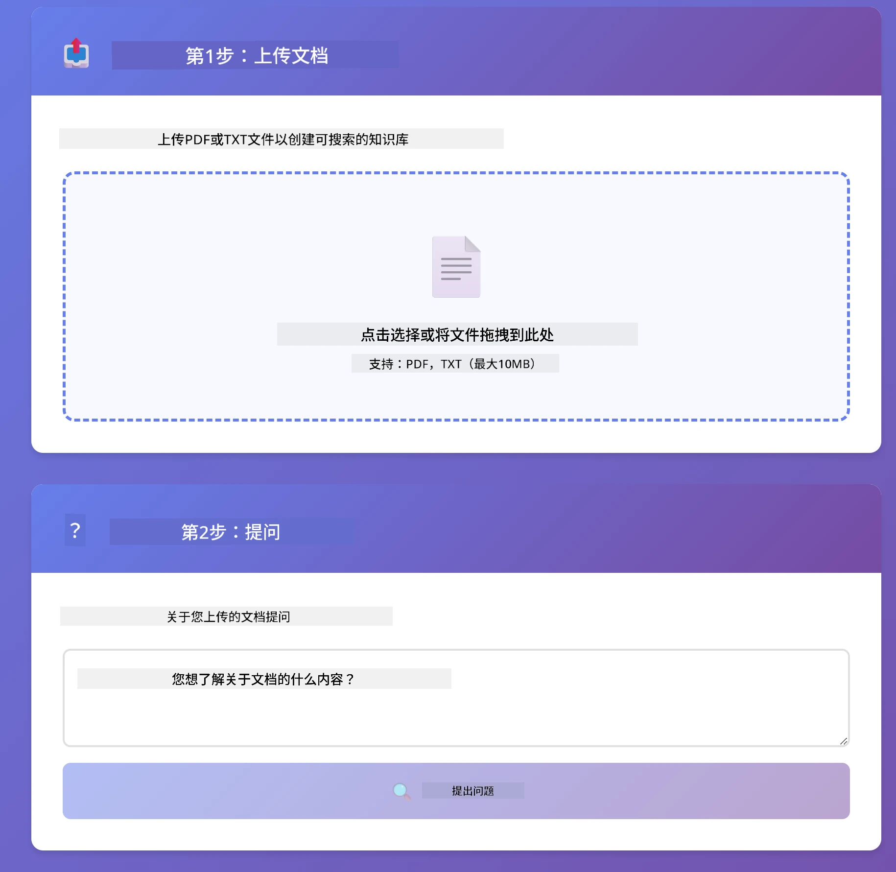
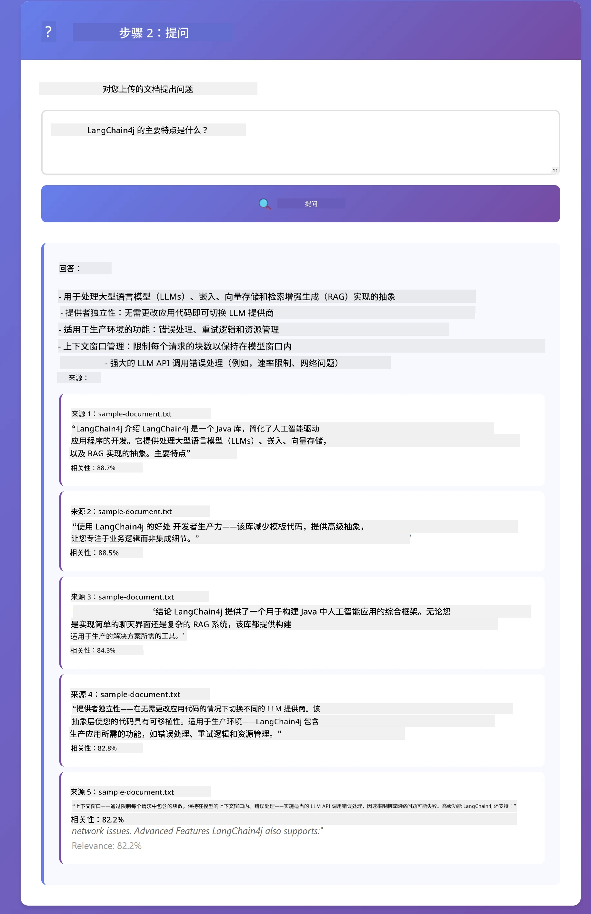

# 模块 03：RAG（检索增强生成）

## 目录

- [视频讲解](#视频讲解)
- [你将学习到的内容](#你将学习到的内容)
- [先决条件](#先决条件)
- [理解 RAG](#理解-rag)
  - [本教程使用哪种 RAG 方法？](#本教程使用哪种-rag-方法？)
- [工作原理](#工作原理)
  - [文档处理](#文档处理)
  - [创建嵌入](#创建嵌入)
  - [语义搜索](#语义搜索)
  - [答案生成](#答案生成)
- [运行应用程序](#运行应用)
- [使用应用程序](#使用应用)
  - [上传文档](#上传文档)
  - [提问](#提问)
  - [检查来源引用](#检查来源引用)
  - [试验提问](#试验不同问题)
- [关键概念](#关键概念)
  - [分块策略](#分块策略)
  - [相似度分数](#相似度分数)
  - [内存存储](#内存存储)
  - [上下文窗口管理](#上下文窗口管理)
- [何时使用 RAG](#适用场景)
- [下一步](#后续步骤)

## 视频讲解

观看此直播环节，讲解如何开始使用本模块：

<a href="https://www.youtube.com/watch?v=_olq75ZH_eY"></a>

## 你将学习到的内容

在之前的模块中，你学会了如何与 AI 进行对话及有效构建提示，但存在一个根本限制：语言模型仅知道训练时学到的内容。它们无法回答有关你公司政策、项目文档或任何未被训练过信息的问题。

RAG（检索增强生成）解决了这个问题。它不是试图教模型你的信息（这既昂贵又不实际），而是赋予它搜索你文档的能力。当有人提问时，系统会找到相关信息并将其包含在提示中，模型基于该检索到的上下文回答。

把 RAG 看作给模型提供一本参考书。当你提问时，系统：

1. <strong>用户查询</strong> – 你提出问题
2. <strong>嵌入转换</strong> – 将你的问题转为向量
3. <strong>向量搜索</strong> – 找到相似的文档块
4. <strong>上下文组装</strong> – 将相关块加入提示
5. <strong>回应</strong> – LLM 根据上下文生成答案

这样模型的回答基于你的实际数据，而非仅靠训练知识或虚构答案。

## 先决条件

- 完成 [模块 01 - 介绍](../01-introduction/README.md)（已部署 Azure OpenAI 资源，包括 `text-embedding-3-small` 嵌入模型）
- 根目录下包含含 Azure 凭证的 `.env` 文件（由模块 01 的 `azd up` 创建）

> **注意：** 如果尚未完成模块 01，请先按照那里的部署说明操作。`azd up` 命令会部署本模块所用的 GPT 聊天模型和嵌入模型。

## 理解 RAG

下图说明核心概念：RAG 不只依赖模型训练数据，而是先让模型查询你的文档参考库，才生成答案。


*此图展示普通大语言模型（从训练数据猜测）与 RAG 增强模型（先查询你的文档）的区别。*

下图展示端到端流程。用户问题经过嵌入、向量搜索、上下文组装，再到答案生成，每步基于前一步：



*此图展示端到端 RAG 流程 — 用户查询经历嵌入、向量搜索、上下文组装和答案生成。*

本模块接下来会逐步详解每个阶段，附带可运行和修改的代码。

### 本教程使用哪种 RAG 方法？

LangChain4j 提供三种实现 RAG 的方式，抽象层级不同。下图并列比较：


*此图比较 LangChain4j 的三种 RAG 方法 — Easy、Native 和 Advanced — 展示关键组件及适用场景。*

| 方法 | 功能描述 | 权衡 |
|---|---|---|
| **Easy RAG** | 通过 `AiServices` 和 `ContentRetriever` 自动完成所有流程。你只需注解接口，挂载检索器，LangChain4j 在后台处理嵌入、搜索和提示组装。 | 代码量最少，但看不到每步细节。 |
| **Native RAG** | 你自己调用嵌入模型、搜索存储、构建提示和生成答案——逐步明确地。 | 代码更多，但每个阶段透明且可修改。 |
| **Advanced RAG** | 使用 `RetrievalAugmentor` 框架，支持可插拔的查询转换器、路由器、再排序器和内容注入器，适合生产级流水线。 | 灵活度最高，但复杂度显著提升。 |

**本教程采用 Native 方式。** RAG 各阶段——查询嵌入、向量存储搜索、上下文组装和答案生成——均在 [`RagService.java`](../../../03-rag/src/main/java/com/example/langchain4j/rag/service/RagService.java) 明确实现。这是为了学习，重要的是看到并理解每个步骤，代码是否简洁次之。一旦熟悉流程，你可以转用 Easy RAG 快速原型开发，或 Advanced RAG 构建生产系统。

> **💡 想了解 Easy RAG？** LangChain4j 也支持 Easy RAG，由 `AiServices` 和 `ContentRetriever` 自动完成嵌入、搜索和提示组装。本模块走的是更明确的路径——拆开流水线，让你亲自看见并控制每个阶段。

下图展示 Easy RAG 流程。注意 `AiServices` 和 `EmbeddingStoreContentRetriever` 如何隐藏复杂性——加载文档、附加检索器，就是获取答案。本模块的 Native 实现则拆开隐蔽步骤：


*此图显示 Easy RAG 流程。对比本模块使用的 Native 方式：Easy RAG 背后由 `AiServices` 和 `ContentRetriever` 隐藏嵌入、检索和提示组装——你只需加载文档、附加检索器，得到答案。Native 方式则拆开流程，自己调用每个步骤（嵌入、搜索、组装上下文、生成答案），实现全程可视和可控。*

## 工作原理

本模块 RAG 流程分为四个阶段，用户每提问运行一次。首先，将上传的文档<strong>解析并分块</strong>为合适大小片段。然后，这些片段被转换成<strong>向量嵌入</strong>，存储后可用数学方式比较。查询进来时，系统执行<strong>语义搜索</strong>找到最相关的片段，最终将它们作为上下文传给大语言模型生成答案。以下章节将通过代码和图示逐步演示。先来看第一步。

### 文档处理

[DocumentService.java](../../../03-rag/src/main/java/com/example/langchain4j/rag/service/DocumentService.java)

上传文档后，系统解析（PDF 或纯文本），附加文件名等元数据，然后切割成小块——每块大小适合模型上下文窗口。这些片段略有重叠，保证边界处不丢失上下文。

```java
// 解析上传的文件并将其封装在LangChain4j文档中
Document document = Document.from(content, metadata);

// 分割成300个令牌的块，重叠30个令牌
DocumentSplitter splitter = DocumentSplitters
    .recursive(300, 30);

List<TextSegment> segments = splitter.split(document);
```


下图直观展示此过程。注意每个块与相邻块令牌重叠30个以保留完整上下文：


*此图显示将文档切分为300令牌块，每块重叠30令牌，保证分块边界上下文连接。*

> **🤖 可尝试 [GitHub Copilot](https://github.com/features/copilot) 聊天：** 打开 [`DocumentService.java`](../../../03-rag/src/main/java/com/example/langchain4j/rag/service/DocumentService.java) 并提问：
> - “LangChain4j 如何将文档拆分成块？为何重叠重要？”
> - “不同文档类型的最优块大小是多少？为什么？”
> - “如何处理多语言文档或带特殊格式的文档？”

### 创建嵌入

[LangChainRagConfig.java](../../../03-rag/src/main/java/com/example/langchain4j/rag/config/LangChainRagConfig.java)

每个文档块被转换成一种叫做嵌入的数值表示——实际上是将含义转为数字。嵌入模型不像聊天模型那样“智能”；它无法理解指令、推理或回答问题。它能做的是将文本映射到数学空间，类似含义的文本会被映射在邻近位置——比如“car”（车）与“automobile”（汽车）相近，“refund policy”（退款政策）与“return my money”（退钱）相近。可以把聊天模型想象成一个能对话的人，嵌入模型则是超强的归档系统。

下图可视化该原理——文本输入，数值向量输出，含义相似的文本向量接近：


*此图显示嵌入模型如何将文本转换为数值向量，类似含义如“car”和“automobile”在向量空间中相邻。*

```java
@Bean
public EmbeddingModel embeddingModel() {
    return OpenAiOfficialEmbeddingModel.builder()
        .baseUrl(azureOpenAiEndpoint)
        .apiKey(azureOpenAiKey)
        .modelName(azureEmbeddingDeploymentName)
        .build();
}

EmbeddingStore<TextSegment> embeddingStore = 
    new InMemoryEmbeddingStore<>();
```

下图展示 RAG 流程中两个独立的执行路径及 LangChain4j 的类实现。<strong>摄取流</strong>（上传时运行一次）负责分块、嵌入并通过 `.addAll()` 存储。<strong>查询流</strong>（每次提问时运行）负责嵌入问题、通过 `.search()` 搜索存储，将匹配到的上下文传递给聊天模型。两条流程通过共享的 `EmbeddingStore<TextSegment>` 接口连接：


*此图显示 RAG 流程中摄取与查询两条路径如何通过共享的 EmbeddingStore 相联结。*

嵌入存储完成后，相关内容自然而然地聚集在向量空间。以下可视化显示有关联主题的文档如何在三维向量空间聚集成簇，这就是语义搜索实现的基础：



*此图展示相关文档在 3D 向量空间聚类，如技术文档、业务规则和常见问题形成不同群组。*

用户搜索时，系统遵循四步：先嵌入文档（一次），然后每次搜索时嵌入查询，使用余弦相似度比较查询向量和所有存储向量，返回得分最高的前K个块。下图展示步骤及涉及的 LangChain4j 类：


*此图展示嵌入搜索的四步流程：嵌入文档、嵌入查询、通过余弦相似度比较向量、返回前K结果。*

### 语义搜索

[RagService.java](../../../03-rag/src/main/java/com/example/langchain4j/rag/service/RagService.java)

提问时，你的问题也会被嵌入向量。系统将你的问题向量与所有文档块的向量进行比较。它找到含义最相近的块——不仅仅是关键词匹配，而是语义层面的相似。

```java
Embedding queryEmbedding = embeddingModel.embed(question).content();

EmbeddingSearchRequest searchRequest = EmbeddingSearchRequest.builder()
    .queryEmbedding(queryEmbedding)
    .maxResults(5)
    .minScore(0.5)
    .build();

EmbeddingSearchResult<TextSegment> searchResult = embeddingStore.search(searchRequest);
List<EmbeddingMatch<TextSegment>> matches = searchResult.matches();

for (EmbeddingMatch<TextSegment> match : matches) {
    String relevantText = match.embedded().text();
    double score = match.score();
}
```


下图对比语义搜索与传统关键词搜索。关键词搜索查找“vehicle”（车辆）时，忽略了关于“cars and trucks”（汽车和卡车）的块，而语义搜索理解它们的同义含义，返回该块作为高分匹配：


*此图比较基于关键词的搜索与语义搜索，展示语义搜索如何检索含义相关内容，即使关键词不完全匹配。*

内部相似度用余弦相似度衡量——本质上是在问“两支箭头是否指向同方向？” 即使两个块使用完全不同的词，如果含义相同，它们的向量方向一致，得分接近 1.0：


*此图示意了余弦相似度作为嵌入向量之间的角度 — 越对齐的向量得分越接近1.0，表示语义相似度越高。*

> **🤖 使用 [GitHub Copilot](https://github.com/features/copilot) 聊天尝试：** 打开 [`RagService.java`](../../../03-rag/src/main/java/com/example/langchain4j/rag/service/RagService.java) 并提问：
> - “相似度搜索如何结合嵌入向量工作，得分由什么决定？”
> - “我应该使用什么相似度阈值，它如何影响结果？”
> - “如何处理找不到相关文档的情况？”

### 答案生成

[RagService.java](../../../03-rag/src/main/java/com/example/langchain4j/rag/service/RagService.java)

最相关的文本块被组装成一个结构化提示，其中包括明确指令、检索到的上下文和用户的问题。模型读取这些特定的块并基于这些信息进行回答 —— 它只能使用当前呈现的信息，从而防止幻觉生成。

```java
String context = matches.stream()
    .map(match -> match.embedded().text())
    .collect(Collectors.joining("\n\n"));

String prompt = String.format("""
    Answer the question based on the following context.
    If the answer cannot be found in the context, say so.

    Context:
    %s

    Question: %s

    Answer:""", context, request.question());

String answer = chatModel.chat(prompt);
```

下图展示了这种组装的实际效果 —— 搜索步骤中得分最高的文本块被注入到提示模板中，`OpenAiOfficialChatModel` 生成基于上下文的回答：


*此图显示了如何将得分最高的文本块组装成结构化提示，允许模型从您的数据生成有依据的回答。*

## 运行应用

**验证部署：**

确保根目录下存在 `.env` 文件并包含 Azure 凭据（在模块01中创建）。在模块目录下（`03-rag/`）运行：

**Bash:**
```bash
cat ../.env  # 应显示 AZURE_OPENAI_ENDPOINT，API_KEY，DEPLOYMENT
```

**PowerShell:**
```powershell
Get-Content ..\.env  # 应该显示 AZURE_OPENAI_ENDPOINT、API_KEY、DEPLOYMENT
```

**启动应用：**

> **注意：** 如果您已经在根目录通过 `./start-all.sh` 启动所有应用（如模块01所述），此模块已在 8081 端口运行。可跳过以下启动命令，直接访问 http://localhost:8081。

**选项1：使用 Spring Boot 仪表盘（VS Code 用户推荐）**

开发容器内含 Spring Boot 仪表盘扩展，提供可视化界面管理所有 Spring Boot 应用。您可以在 VS Code 左侧活动栏找到（查找 Spring Boot 图标）。

通过 Spring Boot 仪表盘，您可以：
- 查看工作区内所有 Spring Boot 应用
- 一键启动/停止应用
- 实时查看应用日志
- 监控应用状态

点击 “rag” 旁的播放按钮启动此模块，或一次启动所有模块。



*此截图展示了 VS Code 中的 Spring Boot 仪表盘，您可以直观地启动、停止和监控应用。*

**选项2：使用 shell 脚本**

启动所有 web 应用（模块01-04）：

**Bash:**
```bash
cd ..  # 从根目录
./start-all.sh
```

**PowerShell:**
```powershell
cd ..  # 从根目录
.\start-all.ps1
```

或者只启动此模块：

**Bash:**
```bash
cd 03-rag
./start.sh
```

**PowerShell:**
```powershell
cd 03-rag
.\start.ps1
```

这两个脚本都会自动从根目录的 `.env` 文件加载环境变量，并且如果 JAR 文件不存在则构建它们。

> **注意：** 如果您愿意先手动构建所有模块再启动：
>
> **Bash:**
> ```bash
> cd ..  # Go to root directory
> mvn clean package -DskipTests
> ```
>
> **PowerShell:**
> ```powershell
> cd ..  # Go to root directory
> mvn clean package -DskipTests
> ```

在浏览器打开 http://localhost:8081 。

**停止应用：**

**Bash:**
```bash
./stop.sh  # 仅此模块
# 或
cd .. && ./stop-all.sh  # 所有模块
```

**PowerShell:**
```powershell
.\stop.ps1  # 仅此模块
# 或者
cd ..; .\stop-all.ps1  # 所有模块
```

## 使用应用

该应用提供文档上传和提问的网页界面。

<a href="images/rag-homepage.png"></a>

*此截图展示 RAG 应用界面，您可以上传文档并提问。*

### 上传文档

首先上传文档——测试时推荐使用 TXT 文件。本目录下提供了一个 `sample-document.txt`，包含 LangChain4j 功能、RAG 实现和最佳实践等信息，适合测试系统。

系统会处理您的文档，将其拆分为多个文本块，并为每个块创建嵌入。这一过程在上传时自动完成。

### 提问

现在就可以针对文档内容提出具体问题。尝试提出文档中明确表述的事实性问题。系统会搜索相关块，将它们包含到提示中，并生成答案。

### 检查来源引用

注意每个答案都包含带有相似度分数的来源引用。这些分数（0到1）表明每个文本块与您的问题的相关度。分数越高表示匹配越好。这样您可以核对答案与原始材料的一致性。

<a href="images/rag-query-results.png"></a>

*此截图展示查询结果，包括生成的答案、来源引用及每个检索块的相关度分数。*

### 试验不同问题

尝试不同类型的问题：
- 具体事实：“主要主题是什么？”
- 比较：“X 和 Y 有何区别？”
- 总结：“请总结关于 Z 的关键点”

观察相关度分数如何随问题与文档内容匹配度的变化而变化。

## 关键概念

### 分块策略

文档被拆分为 300 令牌的文本块，且相邻块之间有30令牌的重叠。这种平衡确保每个块含有足够上下文且保持较小，方便在提示中包含多个块。

### 相似度分数

每个检索到的块都附带一个0到1之间的相似度分数，表示它与用户问题的匹配程度。下图展示分数范围及系统如何利用它们过滤结果：


*此图显示分数从0到1，设定了0.5的最低阈值过滤无关文本块。*

分数范围如下：
- 0.7-1.0：高度相关，精确匹配
- 0.5-0.7：相关，有良好上下文
- 低于0.5：被过滤，差异较大

系统仅检索高于最低阈值的块以确保质量。

嵌入表现良好时意义清晰聚类，但其也有局限。下图展示常见失败模式——块过大导致向量模糊，块过小缺乏上下文，歧义词指向多个簇，且精确匹配查找（如ID、零件号）根本不适用嵌入：


*此图展示嵌入常见失败模式：块过大、块过小、歧义词指向多个簇，以及像ID的精确匹配查找。*

### 内存存储

此模块采用内存存储以简化实现。重启应用时，上传的文档会丢失。生产环境一般使用持久化向量数据库，如 Qdrant 或 Azure AI Search。

### 上下文窗口管理

每个模型都有最大上下文窗口限制。无法包含大型文档中的所有块。系统取前 N 个最相关的块（默认5个），以控制大小同时提供充足上下文确保回答准确。

## 适用场景

RAG 并非总是最佳方案。下图决策指南帮助确定何时使用 RAG 增值，何时直接包含内容进提示或依赖模型内置知识即可：


*此图展示何时使用 RAG 增强效果，何时简单方案足够的决策指南。*

## 后续步骤

**下一个模块：** [04-tools - 带工具的 AI 代理](../04-tools/README.md)

---

**导航：** [← 前一模块：模块 02 - 提示工程](../02-prompt-engineering/README.md) | [返回主页](../README.md) | [下一模块：模块 04 - 工具 →](../04-tools/README.md)

---

<!-- CO-OP TRANSLATOR DISCLAIMER START -->
**免责声明**：
本文件由 AI 翻译服务 [Co-op Translator](https://github.com/Azure/co-op-translator) 翻译完成。尽管我们力求准确，但请注意，自动翻译可能包含错误或不准确之处。原始语言版文件应视为权威来源。对于重要信息，建议使用专业人工翻译。我们对因使用本翻译而产生的任何误解或误释不承担责任。
<!-- CO-OP TRANSLATOR DISCLAIMER END -->