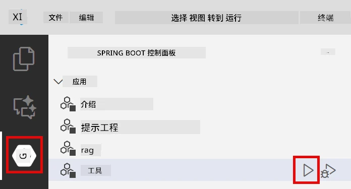
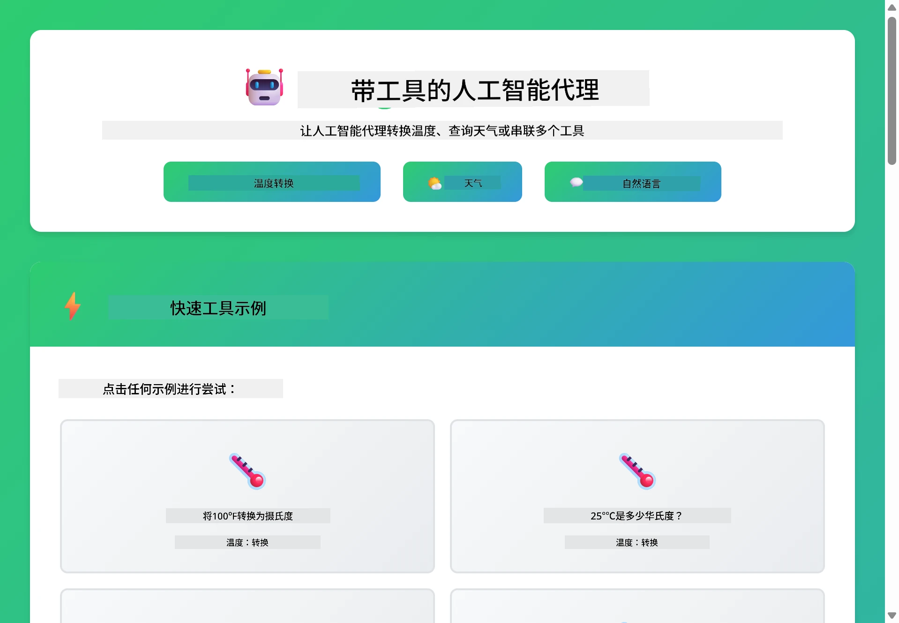
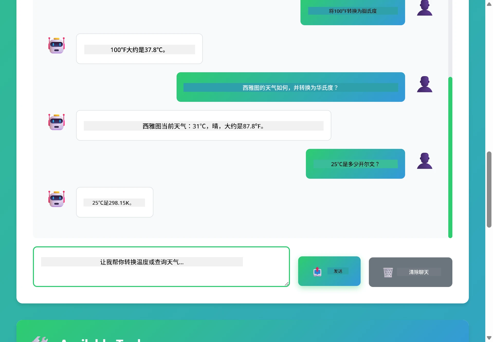

# Module 04: 带工具的 AI 代理

## 目录

- [视频讲解](#视频讲解)
- [你将学到什么](#你将学到什么)
- [前置条件](#前置条件)
- [理解带工具的 AI 代理](#理解带工具的-ai-代理)
- [工具调用是如何工作的](#工具调用是如何工作的)
  - [工具定义](#工具定义)
  - [决策过程](#决策过程)
  - [执行](#执行)
  - [响应生成](#响应生成)
  - [架构：Spring Boot 自动装配](#架构：spring-boot-自动装配)
- [工具链](#工具链)
- [运行应用](#运行应用)
- [使用应用](#使用应用)
  - [尝试简单工具使用](#试用简单工具使用)
  - [测试工具链](#测试工具链)
  - [查看对话流程](#查看对话流程)
  - [尝试不同请求](#尝试不同请求)
- [关键概念](#关键概念)
  - [ReAct 模式（推理与行动）](#react-模式（推理和行动）)
  - [工具描述的重要性](#工具描述很重要)
  - [会话管理](#会话管理)
  - [错误处理](#错误处理)
- [可用工具](#可用工具)
- [何时使用基于工具的代理](#何时使用基于工具的代理)
- [工具与 RAG 的对比](#工具与-rag)
- [下一步](#下一步)

## 视频讲解

观看本直播课程，了解如何开始本模块：

<a href="https://www.youtube.com/watch?v=O_J30kZc0rw"></a>

## 你将学到什么

到目前为止，你已经学会如何与 AI 进行对话，如何有效构造提示，以及如何将回答基于你的文档。但仍有一个根本限制：语言模型只能生成文本。它们无法查询天气、执行计算、查询数据库或与外部系统交互。

工具改变了这一点。通过给模型调用的功能，你将其从一个文本生成器转变成一个可以采取行动的代理。模型决定何时需要工具，使用哪个工具，以及传入什么参数。你的代码执行函数并返回结果，模型将该结果融入其回应中。

## 前置条件

- 已完成[模块 01 - 介绍](../01-introduction/README.md)（部署了 Azure OpenAI 资源）
- 推荐完成之前的模块（本模块在工具与 RAG 对比中引用了[模块 03 的 RAG 概念](../03-rag/README.md)）
- 在根目录有包含 Azure 凭据的 `.env` 文件（由模块 01 中的 `azd up` 创建）

> **注意：** 如果未完成模块 01，请先按部署说明完成。

## 理解带工具的 AI 代理

> **📝 注意：** 本模块所指 “代理” 是指带有工具调用能力的 AI 助手。这与我们将在[模块 05: MCP](../05-mcp/README.md)中介绍的<strong>智能代理</strong>模式（具备规划、记忆和多步推理的自主代理）不同。

没有工具时，语言模型只能基于训练数据生成文本。问它当前天气，它只能猜测。给它工具后，它可以调用天气 API，执行计算，或查询数据库——然后将这些真实结果融入回答中。


*没有工具，模型只能猜测——有了工具，它可以调用 API、运行计算并返回实时数据。*

带工具的 AI 代理遵循<strong>推理与行动（ReAct）</strong>模式。模型不只是回答——它考虑自己需要什么，调用工具采取行动，观察结果，然后决定是否继续行动或给出最终答案：

1. <strong>推理</strong> — 代理分析用户问题，确定所需信息
2. <strong>行动</strong> — 代理选择合适的工具，生成正确参数并调用它
3. <strong>观察</strong> — 代理接收工具输出并评估结果
4. <strong>重复或回答</strong> — 如果需要更多数据，循环回步骤；否则生成自然语言回答


*ReAct 循环——代理推理该做什么，通过调用工具行动，观察结果，循环直到能给出最终答案。*

这完全自动进行。你定义工具及其描述，模型处理何时如何使用。

## 工具调用是如何工作的

### 工具定义

[WeatherTool.java](../../../04-tools/src/main/java/com/example/langchain4j/agents/tools/WeatherTool.java) | [TemperatureTool.java](../../../04-tools/src/main/java/com/example/langchain4j/agents/tools/TemperatureTool.java)

你定义具有清晰描述和参数规范的函数。模型在系统提示中看到这些描述，理解每个工具的功能。

```java
@Component
public class WeatherTool {
    
    @Tool("Get the current weather for a location")
    public String getCurrentWeather(@P("Location name") String location) {
        // 你的天气查询逻辑
        return "Weather in " + location + ": 22°C, cloudy";
    }
}

@AiService
public interface Assistant {
    String chat(@MemoryId String sessionId, @UserMessage String message);
}

// Assistant 由 Spring Boot 自动连接:
// - ChatModel Bean
// - 所有来自 @Component 类的 @Tool 方法
// - 用于会话管理的 ChatMemoryProvider
```

下图详细解析每个注解，展示它们如何帮助 AI 理解何时调用工具以及传递什么参数：


*工具定义结构——@Tool 告诉 AI 何时使用，@P 描述每个参数，@AiService 启动时自动装配。*

> **🤖 试试用 [GitHub Copilot](https://github.com/features/copilot) 聊天：** 打开 [`WeatherTool.java`](../../../04-tools/src/main/java/com/example/langchain4j/agents/tools/WeatherTool.java)，询问：
> - “如何集成像 OpenWeatherMap 这类真实天气 API 而非模拟数据？”
> - “怎样的工具描述能帮助 AI 正确使用工具？”
> - “如何在工具实现中处理 API 错误和速率限制？”

### 决策过程

当用户问“西雅图的天气怎样？”，模型不会随机选工具。它将用户意图与每个工具描述对比，评估相关性，选出最匹配的。然后生成结构化函数调用和正确参数——本例中将 `location` 设置为 `"Seattle"`。

如果无工具匹配请求，模型则退回自身知识回答。若多个匹配，则选择最具体的。


*模型评估所有可用工具与用户意图的匹配度，选出最合适工具——所以写清晰具体的工具描述很重要。*

### 执行

[AgentService.java](../../../04-tools/src/main/java/com/example/langchain4j/agents/service/AgentService.java)

Spring Boot 使用声明式 `@AiService` 接口自动装配所有注册的工具，LangChain4j 自动执行工具调用。幕后，完整调用流程经过六个阶段——从用户自然语言问题，到返回自然语言回答：


*端到端流程——用户提问，模型选工具，LangChain4j 执行，模型将结果融入自然回答中。*

幕后，`AiServices` 为任何工具运行相同的调用循环——这里以简单 `Calculator` 举例。下图顺序图精确展示底层发生的事情：


*调用循环——`AiServices` 将消息和工具模式发送给 LLM，LLM 以函数调用响应如 `add(42, 58)`，LangChain4j 本地执行，结果回传最终回答。*

> **🤖 试试用 [GitHub Copilot](https://github.com/features/copilot) 聊天：** 打开 [`AgentService.java`](../../../04-tools/src/main/java/com/example/langchain4j/agents/service/AgentService.java)，询问：
> - “ReAct 模式是如何工作的？为什么它对 AI 代理有效？”
> - “代理如何决定用哪个工具，执行顺序如何？”
> - “如果工具执行失败，会发生什么？如何稳健处理错误？”

### 响应生成

模型接收天气数据，生成自然语言响应给用户。

### 架构：Spring Boot 自动装配

本模块使用 LangChain4j 的 Spring Boot 集成，通过声明式 `@AiService` 接口。启动时，Spring Boot 发现所有包含 `@Tool` 方法的 `@Component`、你的 `ChatModel` bean 和 `ChatMemoryProvider`，并将它们全部装配成单个 `Assistant` 接口，无需样板代码。


*@AiService 接口将 ChatModel、工具组件和内存提供者连接起来——Spring Boot 自动管理装配。*

下面是完整请求生命周期的顺序图——从 HTTP 请求，经控制器、服务和自动装配代理，直到工具执行与返回：


*完整 Spring Boot 请求生命周期——HTTP 请求流经控制器和服务，传到自动装配的 Assistant 代理，自动编排 LLM 与工具调用。*

此方法主要优势：

- **Spring Boot 自动装配**——ChatModel 和工具自动注入
- **@MemoryId 模式**——自动的基于会话的内存管理
- <strong>单实例</strong>——Assistant 仅创建一次，性能更佳
- <strong>类型安全执行</strong>——Java 方法直接调用并类型转换
- <strong>多轮编排</strong>——自动处理工具链调用
- <strong>零样板代码</strong>——无需手写 `AiServices.builder()` 或内存 HashMap

手动写 `AiServices.builder()` 代码量更大，且缺少 Spring Boot 集成的好处。

## 工具链

<strong>工具链</strong>——基于工具的代理真正强大之处在于当单个问题需用多个工具。问“西雅图的天气是多少华氏度？”时，代理会自动串联两个工具：先调用 `getCurrentWeather` 取摄氏温度，再将结果传给 `celsiusToFahrenheit` 转换——均在一次对话轮中完成。


*工具链实战——代理先调用 getCurrentWeather，然后将摄氏结果传给 celsiusToFahrenheit，并给出合并回答。*

<strong>优雅失败</strong>——请求模拟数据中不存在的城市天气。工具返回错误信息，AI 说明无法帮助，而不是崩溃。工具失败安全。下图对比两种处理方式——正确错误处理时，代理捕获异常并给出有用解释；否则整个应用崩溃：


*当工具失败，代理捕获错误并以帮助性解释回应，而不是崩溃。*

这一切在一次对话轮内完成。代理自主编排多个工具调用。

## 运行应用

**验证部署：**

确保根目录有包含 Azure 凭据的 `.env` 文件（模块 01 中创建）。在本模块目录（`04-tools/`）运行：

**Bash:**
```bash
cat ../.env  # 应该显示 AZURE_OPENAI_ENDPOINT、API_KEY、DEPLOYMENT
```

**PowerShell:**
```powershell
Get-Content ..\.env  # 应该显示 AZURE_OPENAI_ENDPOINT, API_KEY, DEPLOYMENT
```

**启动应用：**

> **注意：** 如果之前已从根目录运行了 `./start-all.sh`（如模块 01 所述），本模块已在 8084 端口运行。可跳过下面启动命令，直接访问 http://localhost:8084 。

**选项 1：使用 Spring Boot 仪表板（建议 VS Code 用户）**

开发容器包含 Spring Boot 仪表板扩展，提供管理所有 Spring Boot 应用的可视界面。你可在 VS Code 左侧活动栏找到它（Spring Boot 图标）。

通过 Spring Boot 仪表板，你可以：
- 查看工作区内所有可用的 Spring Boot 应用
- 一键启动/停止应用
- 实时查看日志
- 监控应用状态

只需点击 “tools” 旁的播放按钮启动本模块，或一次启动所有模块。

下面是 VS Code 中 Spring Boot 仪表板的界面示例：


*VS Code 中的 Spring Boot 仪表盘 — 从一个地方启动、停止并监控所有模块*

**选项 2：使用 shell 脚本**

启动所有 web 应用（模块 01-04）：

**Bash:**
```bash
cd ..  # 从根目录
./start-all.sh
```

**PowerShell:**
```powershell
cd ..  # 从根目录
.\start-all.ps1
```

或者仅启动此模块：

**Bash:**
```bash
cd 04-tools
./start.sh
```

**PowerShell:**
```powershell
cd 04-tools
.\start.ps1
```

这两个脚本会自动从根目录的 `.env` 文件加载环境变量，并且如果 JAR 不存在会自动构建。

> **注意：** 如果你更喜欢在启动前手动构建所有模块：
>
> **Bash:**
> ```bash
> cd ..  # Go to root directory
> mvn clean package -DskipTests
> ```
>
> **PowerShell:**
> ```powershell
> cd ..  # Go to root directory
> mvn clean package -DskipTests
> ```

在浏览器中打开 http://localhost:8084。

**停止：**

**Bash:**
```bash
./stop.sh  # 仅此模块
# 或
cd .. && ./stop-all.sh  # 所有模块
```

**PowerShell:**
```powershell
.\stop.ps1  # 仅此模块
# 或
cd ..; .\stop-all.ps1  # 所有模块
```

## 使用应用

该应用提供了一个网页界面，你可以在这里与一个拥有天气和温度转换工具访问权限的 AI 代理交互。界面如下所示 — 包括快速启动示例和用于发送请求的聊天面板：

<a href="images/tools-homepage.png"></a>

*AI 代理工具界面 - 快速示例和用于与工具互动的聊天界面*

### 试用简单工具使用

从一个简单请求开始：“将 100 华氏度转换为摄氏度”。代理会识别到需要使用温度转换工具，用正确参数调用该工具并返回结果。注意这感觉多么自然 —— 你没有明确指定用哪个工具，或如何调用它。

### 测试工具链

现在尝试更复杂的请求：“西雅图的天气如何，顺便转换为华氏度？”观察代理如何分步骤处理。它首先获取天气（返回摄氏度），然后识别需要转换为华氏度，并调用转换工具，最后将两者结果合并成一个响应。

### 查看对话流程

聊天界面会维护对话历史，使你能够进行多轮交流。你可以看到之前的所有查询和回复，方便追踪对话内容并理解代理如何在多次交互中建立上下文。

<a href="images/tools-conversation-demo.png"></a>

*多轮对话展示简单转换、天气查询和工具链调用*

### 尝试不同请求

尝试各种组合：
- 天气查询：“东京的天气怎么样？”
- 温度转换：“25°C 等于多少开尔文？”
- 组合查询：“查一下巴黎天气，告诉我是否高于 20°C”

观察代理如何理解自然语言并映射到对应的工具调用。

## 关键概念

### ReAct 模式（推理和行动）

代理在推理（决定做什么）和行动（使用工具）之间交替。这种模式使其能自主解决问题，而不仅仅是响应指令。

### 工具描述很重要

工具描述质量直接影响代理使用工具的效果。清晰、具体的描述帮助模型理解何时以及如何调用每个工具。

### 会话管理

`@MemoryId` 注解开启自动的基于会话的记忆管理。每个会话 ID 拥有自己的 `ChatMemory` 实例，由 `ChatMemoryProvider` bean 管理，从而允许多个用户同时与代理交互而不混淆各自对话。下图展示了基于会话 ID 如何路由到独立的记忆存储：


*每个会话 ID 映射到独立的对话历史 — 用户间永远看不到彼此的信息。*

### 错误处理

工具可能会失败 —— API 超时、参数无效、外部服务故障。生产环境代理需要错误处理，使模型能解释问题或尝试备选方案，而不是让整个应用崩溃。当工具抛出异常时，LangChain4j 会捕获并将错误信息反馈给模型，模型接着以自然语言解释问题。

## 可用工具

下图展示了你可以构建的广泛工具生态系统。本模块示范了天气和温度工具，但相同的 `@Tool` 模式适用于任何 Java 方法 —— 从数据库查询到支付处理。


*任何用 @Tool 注解的 Java 方法都可供 AI 调用 —— 该模式可扩展至数据库、API、邮件、文件操作等。*

## 何时使用基于工具的代理

并非所有请求都需要工具。判断依据是 AI 是否需要与外部系统交互，还是可以凭借自身知识回答。下图总结了工具有用与否的情况：


*简易决策指南 —— 工具适用于实时数据、运算和操作；常识和创造性任务不需要。*

## 工具与 RAG

模块 03 和 04 都扩展了 AI 的能力，但方式截然不同。RAG 通过检索文档为模型提供<strong>知识</strong>；工具通过调用函数赋予模型执行<strong>动作</strong>的能力。下图对比两者 —— 从工作流程到各自取舍：


*RAG 从静态文档中检索信息 —— 工具执行动作并获取动态实时数据。许多生产系统结合二者使用。*

实际上，许多生产系统都会结合这两种方法：用 RAG 让答案基于你的文档，用工具来获取实时数据或执行操作。

## 下一步

**下一个模块：** [05-mcp - 模型上下文协议（MCP）](../05-mcp/README.md)

---

**导航：** [← 上一章：模块 03 - RAG](../03-rag/README.md) | [回到首页](../README.md) | [下一章：模块 05 - MCP →](../05-mcp/README.md)

---

<!-- CO-OP TRANSLATOR DISCLAIMER START -->
**免责声明**：
本文件由 AI 翻译服务 [Co-op Translator](https://github.com/Azure/co-op-translator) 翻译完成。尽管我们力求准确，但请注意，自动翻译可能包含错误或不准确之处。原始语言版文件应视为权威来源。对于重要信息，建议使用专业人工翻译。我们对因使用本翻译而产生的任何误解或误释不承担责任。
<!-- CO-OP TRANSLATOR DISCLAIMER END -->