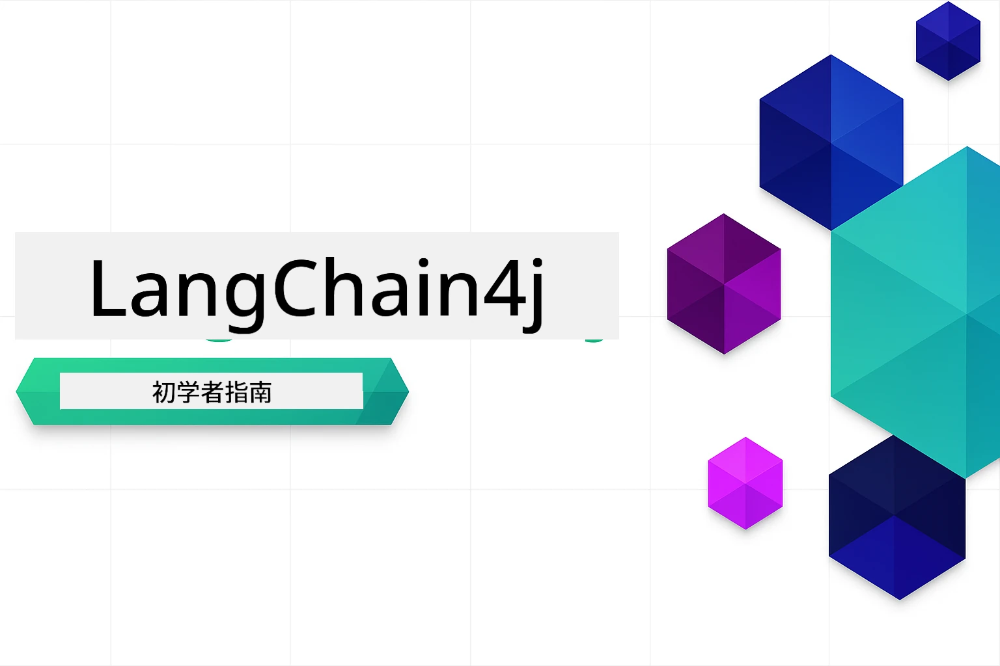

# LangChain4j 初学者课程

使用 LangChain4j 和 Azure OpenAI GPT-5.2 构建 AI 应用的课程，从基础聊天到 AI 代理。

### 🌐 多语言支持

#### 通过 GitHub Action 支持（自动且始终保持最新）

<!-- CO-OP TRANSLATOR LANGUAGES TABLE START -->
[阿拉伯语](../ar/README.md) | [孟加拉语](../bn/README.md) | [保加利亚语](../bg/README.md) | [缅甸语 (Myanmar)](../my/README.md) | [中文（简体）](./README.md) | [中文（繁体，香港）](../zh-HK/README.md) | [中文（繁体，澳门）](../zh-MO/README.md) | [中文（繁体，台湾）](../zh-TW/README.md) | [克罗地亚语](../hr/README.md) | [捷克语](../cs/README.md) | [丹麦语](../da/README.md) | [荷兰语](../nl/README.md) | [爱沙尼亚语](../et/README.md) | [芬兰语](../fi/README.md) | [法语](../fr/README.md) | [德语](../de/README.md) | [希腊语](../el/README.md) | [希伯来语](../he/README.md) | [印地语](../hi/README.md) | [匈牙利语](../hu/README.md) | [印尼语](../id/README.md) | [意大利语](../it/README.md) | [日语](../ja/README.md) | [卡纳达语](../kn/README.md) | [高棉语](../km/README.md) | [韩语](../ko/README.md) | [立陶宛语](../lt/README.md) | [马来语](../ms/README.md) | [马拉雅拉姆语](../ml/README.md) | [马拉地语](../mr/README.md) | [尼泊尔语](../ne/README.md) | [尼日利亚皮钦语](../pcm/README.md) | [挪威语](../no/README.md) | [波斯语 (法尔西)](../fa/README.md) | [波兰语](../pl/README.md) | [葡萄牙语（巴西）](../pt-BR/README.md) | [葡萄牙语（葡萄牙）](../pt-PT/README.md) | [旁遮普语 (古鲁穆奇)](../pa/README.md) | [罗马尼亚语](../ro/README.md) | [俄语](../ru/README.md) | [塞尔维亚语（西里尔字母）](../sr/README.md) | [斯洛伐克语](../sk/README.md) | [斯洛文尼亚语](../sl/README.md) | [西班牙语](../es/README.md) | [斯瓦希里语](../sw/README.md) | [瑞典语](../sv/README.md) | [他加禄语（菲律宾语）](../tl/README.md) | [泰米尔语](../ta/README.md) | [泰卢固语](../te/README.md) | [泰语](../th/README.md) | [土耳其语](../tr/README.md) | [乌克兰语](../uk/README.md) | [乌尔都语](../ur/README.md) | [越南语](../vi/README.md)

> **想本地克隆？**
>
> 本仓库包含 50 多种语言的翻译，这显著增加了下载大小。若要不带翻译地克隆，请使用稀疏检出：
>
> **Bash / macOS / Linux:**
> ```bash
> git clone --filter=blob:none --sparse https://github.com/microsoft/LangChain4j-for-Beginners.git
> cd LangChain4j-for-Beginners
> git sparse-checkout set --no-cone '/*' '!translations' '!translated_images'
> ```
>
> **CMD （Windows）:**
> ```cmd
> git clone --filter=blob:none --sparse https://github.com/microsoft/LangChain4j-for-Beginners.git
> cd LangChain4j-for-Beginners
> git sparse-checkout set --no-cone "/*" "!translations" "!translated_images"
> ```
>
> 这样你可以更快地下载到完成课程所需的所有内容。
<!-- CO-OP TRANSLATOR LANGUAGES TABLE END -->

## 目录

1. [介绍](01-introduction/README.md) - 学习 LangChain4j 的基础知识  
2. [Prompt 工程](02-prompt-engineering/README.md) - 掌握高效的提示设计  
3. [RAG（检索增强生成）](03-rag/README.md) - 构建智能的知识库系统  
4. [工具](04-tools/README.md) - 集成外部工具和简单助手  
5. [MCP（模型上下文协议）](05-mcp/README.md) - 使用模型上下文协议 (MCP) 和 Agentic 模块

### 视频演示

每个模块都有配套的直播课程，逐步讲解概念和代码。

| 模块 | 视频 |
|--------|-------|
| 01 - 介绍 | [使用 LangChain4j 入门](https://www.youtube.com/live/nl_troDm8rQ) |
| 02 - Prompt 工程 | [使用 LangChain4j 进行提示工程](https://www.youtube.com/live/PJ6aBaE6bog) |
| 03 - RAG | [使用 LangChain4j 的 RAG](https://www.youtube.com/watch?v=_olq75ZH_eY) |
| 04 - 工具 & 05 - MCP | [带工具与 MCP 的 AI 代理](https://www.youtube.com/watch?v=O_J30kZc0rw) |

---

## 学习路径

**刚接触 LangChain4j？** 查阅[术语表](docs/GLOSSARY.md)了解关键术语和概念的定义。

> <strong>快速开始</strong>

1. 将此仓库 Fork 到你的 GitHub 账户  
2. 点击 **Code** → **Codespaces** 标签 → **...** → **New with options...**  
3. 使用默认设置 – 这将选择为本课程创建的开发容器  
4. 点击 **Create codespace**  
5. 等待 5-10 分钟直至环境准备就绪  
6. 直接跳转到 [介绍](./01-introduction/README.md) 开始学习！

完成所有模块后，探索[测试指南](docs/TESTING.md)，了解 LangChain4j 的测试概念实操。

> **注意：** 本培训使用 Azure OpenAI。如果你还没有账户，请使用 [免费 Azure 账户](https://aka.ms/azure-free-account) 开始。

## 使用 GitHub Copilot 学习

要快速开始编写代码，可在 GitHub Codespace 或本地 IDE 中使用提供的 devcontainer 打开本项目。本课程使用的 devcontainer 预配置了 GitHub Copilot，便于 AI 配对编程。

每个代码示例中都包含你可以问 GitHub Copilot 的建议问题，帮助你加深理解。留意以下位置的 💡/🤖 提示：

- **Java 文件头部** - 针对每个示例的特定问题  
- **模块 README** - 代码示例后探索问题

**使用方法：** 打开任意代码文件并向 Copilot 提问建议问题。它拥有完整的代码库上下文，能解释、扩展或建议替代方案。

想了解更多？浏览 [AI 配对编程的 Copilot](https://aka.ms/GitHubCopilotAI)。

## 其他资源

<!-- CO-OP TRANSLATOR OTHER COURSES START -->
### LangChain
[](https://aka.ms/langchain4j-for-beginners)
[](https://aka.ms/langchainjs-for-beginners?WT.mc_id=m365-94501-dwahlin)
[](https://github.com/microsoft/langchain-for-beginners?WT.mc_id=m365-94501-dwahlin)
---

### Azure / Edge / MCP / 代理
[](https://github.com/microsoft/AZD-for-beginners?WT.mc_id=academic-105485-koreyst)
[](https://github.com/microsoft/edgeai-for-beginners?WT.mc_id=academic-105485-koreyst)
[](https://github.com/microsoft/mcp-for-beginners?WT.mc_id=academic-105485-koreyst)
[](https://github.com/microsoft/ai-agents-for-beginners?WT.mc_id=academic-105485-koreyst)

---
 
### 生成式 AI 系列
[](https://github.com/microsoft/generative-ai-for-beginners?WT.mc_id=academic-105485-koreyst)
[-9333EA?style=for-the-badge&labelColor=E5E7EB&color=9333EA)](https://github.com/microsoft/Generative-AI-for-beginners-dotnet?WT.mc_id=academic-105485-koreyst)
[-C084FC?style=for-the-badge&labelColor=E5E7EB&color=C084FC)](https://github.com/microsoft/generative-ai-for-beginners-java?WT.mc_id=academic-105485-koreyst)
[-E879F9?style=for-the-badge&labelColor=E5E7EB&color=E879F9)](https://github.com/microsoft/generative-ai-with-javascript?WT.mc_id=academic-105485-koreyst)

---
 
### 核心学习
[](https://aka.ms/ml-beginners?WT.mc_id=academic-105485-koreyst)
[](https://aka.ms/datascience-beginners?WT.mc_id=academic-105485-koreyst)
[](https://aka.ms/ai-beginners?WT.mc_id=academic-105485-koreyst)
[](https://github.com/microsoft/Security-101?WT.mc_id=academic-96948-sayoung)

[](https://aka.ms/webdev-beginners?WT.mc_id=academic-105485-koreyst)
[](https://aka.ms/iot-beginners?WT.mc_id=academic-105485-koreyst)
[](https://github.com/microsoft/xr-development-for-beginners?WT.mc_id=academic-105485-koreyst)

---

### Copilot 系列
[](https://aka.ms/GitHubCopilotAI?WT.mc_id=academic-105485-koreyst)
[](https://github.com/microsoft/mastering-github-copilot-for-dotnet-csharp-developers?WT.mc_id=academic-105485-koreyst)
[](https://github.com/microsoft/CopilotAdventures?WT.mc_id=academic-105485-koreyst)
<!-- CO-OP TRANSLATOR OTHER COURSES END -->

## 获取帮助

如果您遇到困难或对构建 AI 应用有任何疑问，请加入：

[](https://aka.ms/foundry/discord)

如果您在构建过程中有产品反馈或遇到错误，请访问：

[](https://aka.ms/foundry/forum)

## 许可证

MIT 许可证 - 详情请参阅 [LICENSE](../../LICENSE) 文件。

---

<!-- CO-OP TRANSLATOR DISCLAIMER START -->
**免责声明**：
本文件由 AI 翻译服务 [Co-op Translator](https://github.com/Azure/co-op-translator) 翻译完成。尽管我们力求准确，但请注意，自动翻译可能包含错误或不准确之处。原始语言版文件应视为权威来源。对于重要信息，建议使用专业人工翻译。我们对因使用本翻译而产生的任何误解或误释不承担责任。
<!-- CO-OP TRANSLATOR DISCLAIMER END -->