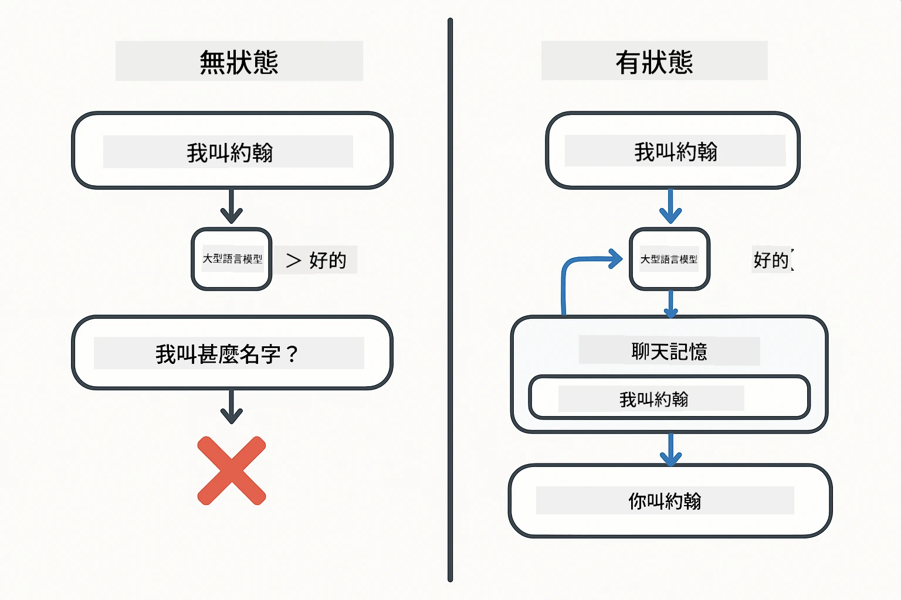
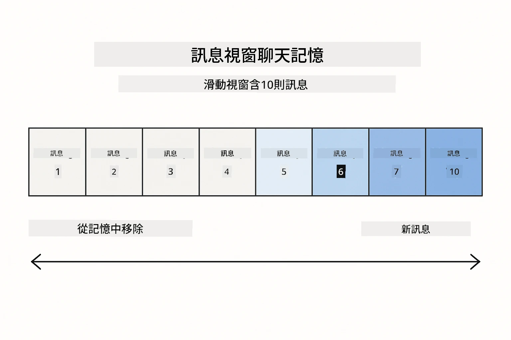
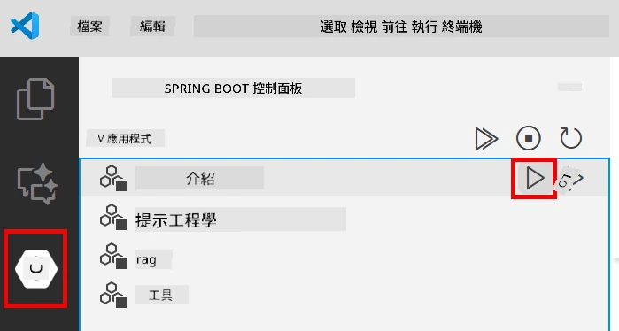
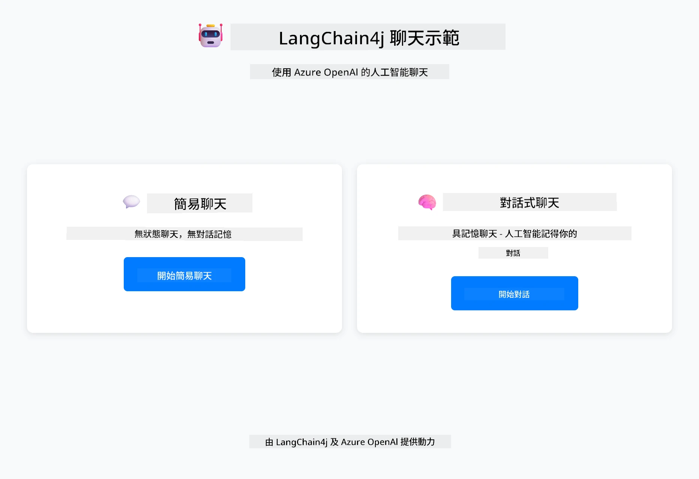
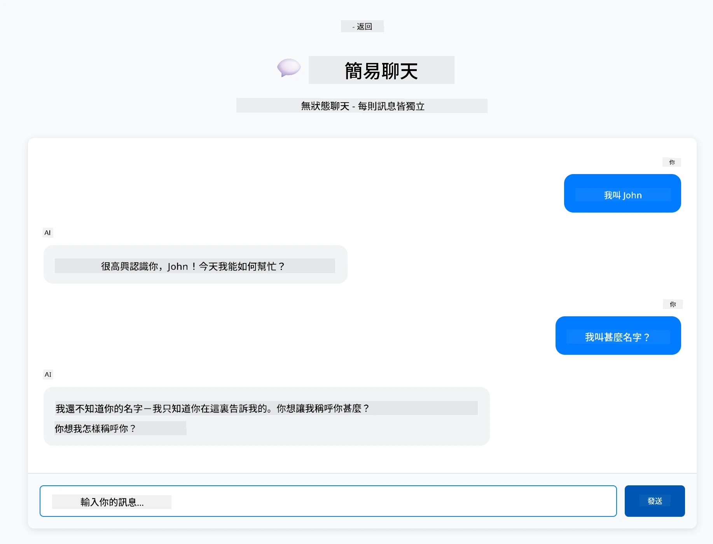
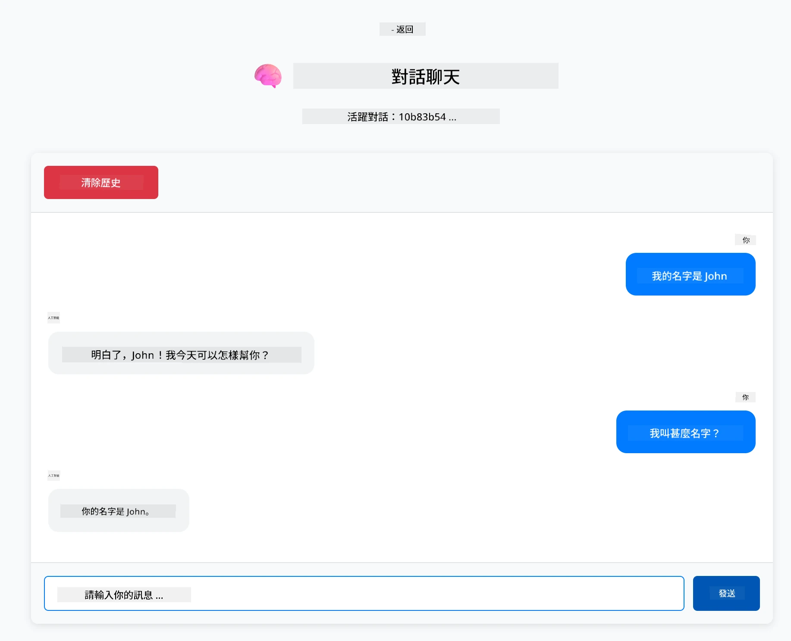

# Module 01: LangChain4j 入門指南

## 目錄

- [影片導覽](#影片導覽)
- [您將學到的內容](#您將學到的內容)
- [前置需求](#前置需求)
- [理解核心問題](#理解核心問題)
- [理解 Tokens](#理解-tokens)
- [記憶如何運作](#記憶如何運作)
- [本示例如何使用 LangChain4j](#本示例如何使用-langchain4j)
- [部署 Azure OpenAI 基礎設施](#部署-azure-openai-基礎設施)
- [在本地運行應用](#在本地運行應用)
- [使用應用程式](#使用應用程式)
  - [無狀態聊天（左側面板）](#無狀態聊天（左側面板）)
  - [有狀態聊天（右側面板）](#有狀態聊天（右側面板）)
- [下一步](#下一步)

## 影片導覽

觀看此現場教學，說明如何開始使用這個模組：

<a href="https://www.youtube.com/live/nl_troDm8rQ?si=6b85S8xGjWnT2fX9"></a>

## 您將學到的內容

這是您使用 LangChain4j 和 Azure OpenAI 的起點。我們從基礎開始，並逐步構建生產級別的應用程式。本模組聚焦於能夠記憶上下文並維持狀態的對話式 AI — 這是後續每個模組所依據的基礎概念。

本指南將使用 Azure OpenAI 的 GPT-5.2 ，因其高級推理能力讓不同模式的行為更明顯。當您加入記憶功能時，差異會非常清楚，這有助於理解每個組件對應用帶來的效果。

您將建立一個示範兩種模式的應用程式：

<strong>無狀態聊天</strong> - 每個請求獨立，模型不會記得前一條消息。這是最簡單的起點。

<strong>有狀態對話</strong> - 每個請求包含對話歷史，模型在多輪對話中維持上下文。這是生產應用所需的模式。

## 前置需求

- 擁有 Azure 訂閱及 Azure OpenAI 存取權限
- Java 21、Maven 3.9+
- Azure CLI (https://learn.microsoft.com/en-us/cli/azure/install-azure-cli)
- Azure Developer CLI (azd) (https://learn.microsoft.com/en-us/azure/developer/azure-developer-cli/install-azd)

> **注意：** Java、Maven、Azure CLI 及 Azure Developer CLI (azd) 已於提供的開發容器中預先安裝。

> **注意：** 本模組使用 Azure OpenAI 的 GPT-5.2，部署會自動透過 `azd up` 完成，不要修改程式碼中模型名稱。

## 理解核心問題

語言模型是無狀態的。每次 API 呼叫皆獨立。如果您先發送「我叫 John」，然後問「我叫什麼名字？」，模型不會知道您剛自我介紹。它視每個請求為您第一次對話。

這對於簡單問答還好，但對實際應用毫無幫助。客服機器人需要記住您說過的話。個人助理需要上下文。任何多輪對話都需要記憶。

下圖比較兩種方法 — 左邊是忘記您名字的無狀態呼叫；右邊是由 ChatMemory 支持、有記憶的有狀態呼叫。



*無狀態（獨立呼叫）與有狀態（具上下文感知）對話之差異*

## 理解 Tokens

在探索對話之前，了解 tokens 很重要 — 它們是語言模型處理的文本基本單位：


*文本拆解成 tokens 的示例 —「I love AI!」變成 4 個獨立處理單元*

tokens 是 AI 模型如何度量與處理文字的方式。詞彙、標點甚至空格都能是 token。模型可一次處理的最大 token 數有限制（GPT-5.2 為 400,000，其中最多 272,000 為輸入 tokens，128,000 為輸出 tokens）。理解 tokens 有助於管理對話長度與成本。

## 記憶如何運作

聊天記憶解決無狀態的問題，透過維持對話歷史。在傳送請求前，框架會預先附加相關的前置訊息。當你問「我叫什麼名字？」時，系統其實會傳送整段對話歷史，讓模型能知道你之前說了「我叫 John」。

LangChain4j 提供的記憶實作會自動處理這件事。您可設定保留多少條訊息，框架會管理上下文視窗。下圖顯示 MessageWindowChatMemory 如何維持一個滑動的近期訊息視窗。



*MessageWindowChatMemory 維持一個滑動視窗，自動丟棄舊訊息*

## 本示例如何使用 LangChain4j

本模組結合 Spring Boot 並增加對話記憶。元件組合如下：

<strong>依賴庫</strong> — 新增兩個 LangChain4j 函式庫：

```xml
<dependency>
    <groupId>dev.langchain4j</groupId>
    <artifactId>langchain4j</artifactId> <!-- Inherited from BOM in root pom.xml -->
</dependency>
<dependency>
    <groupId>dev.langchain4j</groupId>
    <artifactId>langchain4j-open-ai-official</artifactId> <!-- Inherited from BOM in root pom.xml -->
</dependency>
```

<strong>聊天模型</strong> — 以 Spring Bean 配置 Azure OpenAI ([LangChainConfig.java](../../../01-introduction/src/main/java/com/example/langchain4j/config/LangChainConfig.java))：

```java
@Bean
public OpenAiOfficialChatModel openAiOfficialChatModel() {
    return OpenAiOfficialChatModel.builder()
            .baseUrl(azureEndpoint)
            .apiKey(azureApiKey)
            .modelName(deploymentName)
            .timeout(Duration.ofMinutes(5))
            .maxRetries(3)
            .build();
}
```

建構器從由 `azd up` 設定的環境變數讀取認證。設置 `baseUrl` 指向您的 Azure 端點，使 OpenAI 用戶端可在 Azure OpenAI 上運作。

<strong>對話記憶</strong> — 使用 MessageWindowChatMemory 追蹤聊天歷史 ([ConversationService.java](../../../01-introduction/src/main/java/com/example/langchain4j/service/ConversationService.java))：

```java
ChatMemory memory = MessageWindowChatMemory.withMaxMessages(10);

memory.add(UserMessage.from("My name is John"));
memory.add(AiMessage.from("Nice to meet you, John!"));

memory.add(UserMessage.from("What's my name?"));
AiMessage aiMessage = chatModel.chat(memory.messages()).aiMessage();
memory.add(aiMessage);
```

建立記憶時用 `withMaxMessages(10)` 限制保留最後 10 條訊息。用強類型包裝類別新增使用者與 AI 訊息：`UserMessage.from(text)` 和 `AiMessage.from(text)`。用 `memory.messages()` 取得歷史，並傳給模型。此服務會依會話 ID 儲存各自的記憶實例，允許多個用戶同時聊天。

> **🤖 透過 [GitHub Copilot](https://github.com/features/copilot) 聊天試試：** 打開 [`ConversationService.java`](../../../01-introduction/src/main/java/com/example/langchain4j/service/ConversationService.java) 並詢問：
> - 「當視窗滿了時，MessageWindowChatMemory 如何決定丟棄哪些訊息？」
> - 「我可以實作用資料庫來儲存記憶，取代記憶體儲存嗎？」
> - 「要如何新增摘要功能來壓縮舊的對話歷史？」

無狀態聊天端點完全跳過記憶，僅使用 `chatModel.chat(prompt)`，與快速入門相同。有狀態端點則是新增訊息至記憶，取得歷史並包含此上下文，每次請求都帶上。模型配置相同，模式不同。

## 部署 Azure OpenAI 基礎設施

**Bash:**
```bash
cd 01-introduction
azd up  # 選擇訂閱和位置（建議使用 eastus2）
```

**PowerShell:**
```powershell
cd 01-introduction
azd up  # 選擇訂閱和地區（建議使用 eastus2）
```

> **注意：** 遇到逾時錯誤（`RequestConflict: Cannot modify resource ... provisioning state is not terminal`）時，只需再次執行 `azd up`。Azure 資源可能尚在背景配置中，重試後待資源進入終態即可完成部署。

這將會：
1. 部署帶有 GPT-5.2 和 text-embedding-3-small 模型的 Azure OpenAI 資源
2. 自動在專案根目錄生成 `.env` 檔案，內含認證
3. 設置所有必要的環境變數

**部署有困難？** 請參閱 [基礎設施說明文件](infra/README.md) ，包括子域名衝突排除手冊、手動 Azure 入口網站部署步驟及模型配置說明。

**驗證部署是否成功：**

**Bash:**
```bash
cat ../.env  # 應該顯示 AZURE_OPENAI_ENDPOINT、API_KEY 等。
```

**PowerShell:**
```powershell
Get-Content ..\.env  # 應該顯示 AZURE_OPENAI_ENDPOINT、API_KEY 等。
```

> **注意：** `azd up` 指令會自動生成 `.env` 檔案。若需後續更新，可手動編輯 `.env` 檔案或重新生成：
>
> **Bash:**
> ```bash
> cd ..
> bash .azd-env.sh
> ```
>
> **PowerShell:**
> ```powershell
> cd ..
> .\.azd-env.ps1
> ```

## 在本地運行應用

**驗證部署：**

確認 `.env` 檔案存在根目錄並包含 Azure 認證。在模組目錄 (`01-introduction/`) 執行：

**Bash:**
```bash
cat ../.env  # 應該顯示 AZURE_OPENAI_ENDPOINT、API_KEY、DEPLOYMENT
```

**PowerShell:**
```powershell
Get-Content ..\.env  # 應顯示 AZURE_OPENAI_ENDPOINT、API_KEY、DEPLOYMENT
```

**啟動應用程式：**

**選項 1：使用 Spring Boot 儀表板（推薦 VS Code 用戶）**

開發容器包含 Spring Boot 儀表板擴充，提供視覺化介面管理所有 Spring Boot 應用程式。可於 VS Code 左側活動欄找到（尋找 Spring Boot 圖示）。

從 Spring Boot 儀表板您可以：
- 查看工作區中所有可用的 Spring Boot 應用程式
- 單擊啟動/停止應用程式
- 即時查看應用程式日誌
- 監控應用狀態

只要點擊「introduction」旁的播放按鈕即可啟動此模組，或同時啟動全部模組。



*VS Code 中的 Spring Boot 儀表板 — 從一處啟動、停止並監控所有模組*

**選項 2：使用 shell 腳本**

啟動所有網頁應用（模組 01-04）：

**Bash:**
```bash
cd ..  # 從根目錄
./start-all.sh
```

**PowerShell:**
```powershell
cd ..  # 由根目錄開始
.\start-all.ps1
```

或僅啟動本模組：

**Bash:**
```bash
cd 01-introduction
./start.sh
```

**PowerShell:**
```powershell
cd 01-introduction
.\start.ps1
```

兩者腳本都會自動從根目錄 `.env` 載入環境變數，並在不存在 JAR 時進行建置。

> **注意：** 若您想先手動建置所有模組，再啟動：
>
> **Bash:**
> ```bash
> cd ..  # Go to root directory
> mvn clean package -DskipTests
> ```
>
> **PowerShell:**
> ```powershell
> cd ..  # Go to root directory
> mvn clean package -DskipTests
> ```

開啟 http://localhost:8080 在瀏覽器。

**停止應用：**

**Bash:**
```bash
./stop.sh  # 僅此模組
# 或
cd .. && ./stop-all.sh  # 所有模組
```

**PowerShell:**
```powershell
.\stop.ps1  # 只有這個模組
# 或者
cd ..; .\stop-all.ps1  # 所有模組
```

## 使用應用程式

應用提供網頁介面，左、右側並排展示兩種聊天實作。



*儀表板展示簡易聊天（無狀態）及對話式聊天（有狀態）選項*

### 無狀態聊天（左側面板）

先試這個。問「我叫 John」，接著立即問「我叫什麼名字？」模型不會記得，因為每條訊息皆獨立。這突顯基礎語言模型整合的核心問題 — 無對話上下文。



*AI 不會記得您先前的名字*

### 有狀態聊天（右側面板）

現在在這裡試同樣序列。問「我叫 John」，接著「我叫什麼名字？」這次模型會記得。差異在於 MessageWindowChatMemory — 它維持對話歷史，並隨每次請求附上上下文。這即是生產對話式 AI 的運作方式。



*AI 記得您在對話中較早時說過的名字*

左右面板都使用相同 GPT-5.2 模型。唯一差別是是否有記憶。這清楚顯示記憶對應用的重要性及必要性。

## 下一步

**下一模組：** [02-prompt-engineering - GPT-5.2 的提示工程](../02-prompt-engineering/README.md)

---

**導覽：** [← 回到首頁](../README.md) | [下一步：模組 02 - 提示工程 →](../02-prompt-engineering/README.md)

---

<!-- CO-OP TRANSLATOR DISCLAIMER START -->
**免責聲明**：
本文件由 AI 翻譯服務 [Co-op Translator](https://github.com/Azure/co-op-translator) 翻譯而成。雖然我們致力於確保準確性，但請注意，機器自動翻譯可能包含錯誤或不準確之處。原始文件的母語版本應被視為權威來源。對於重要資訊，建議進行專業人工翻譯。我們不對因使用本翻譯而產生的任何誤解或誤釋承擔責任。
<!-- CO-OP TRANSLATOR DISCLAIMER END -->