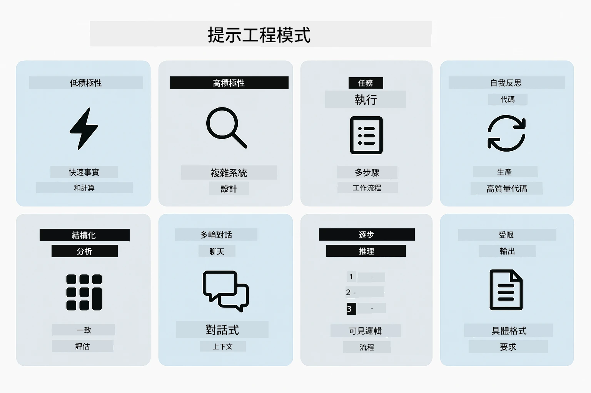
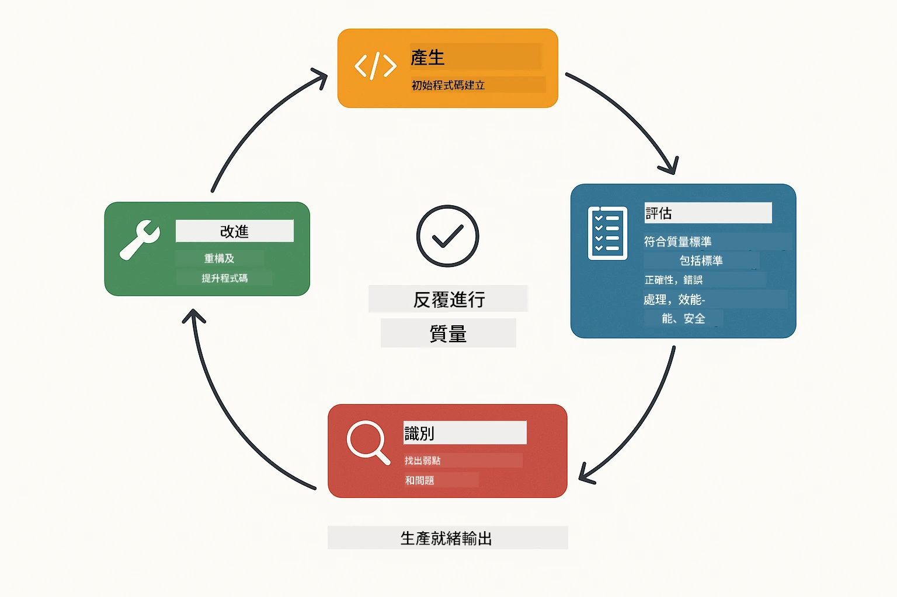
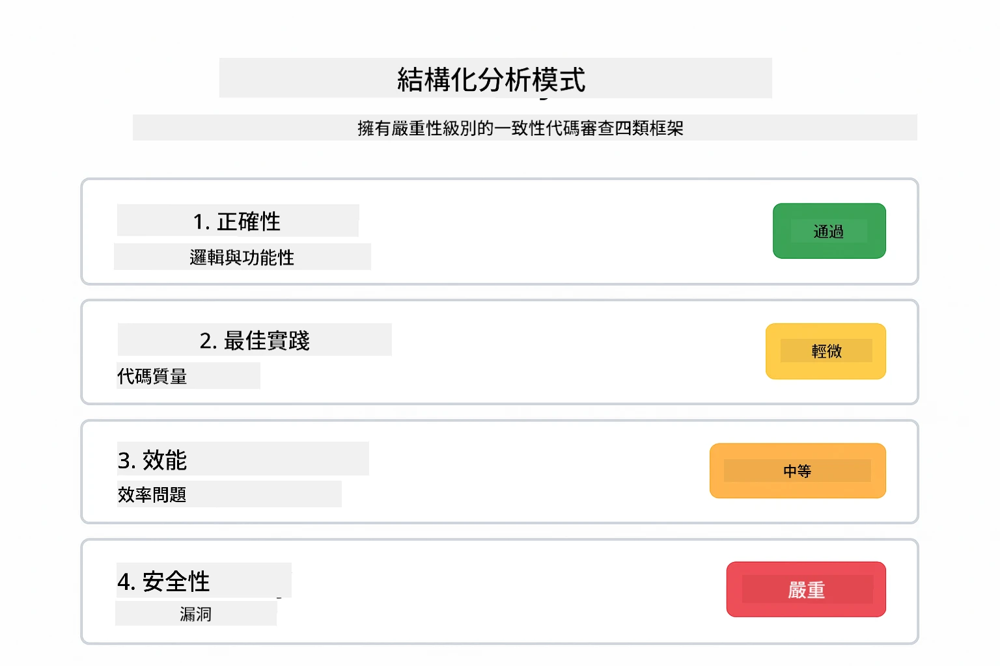
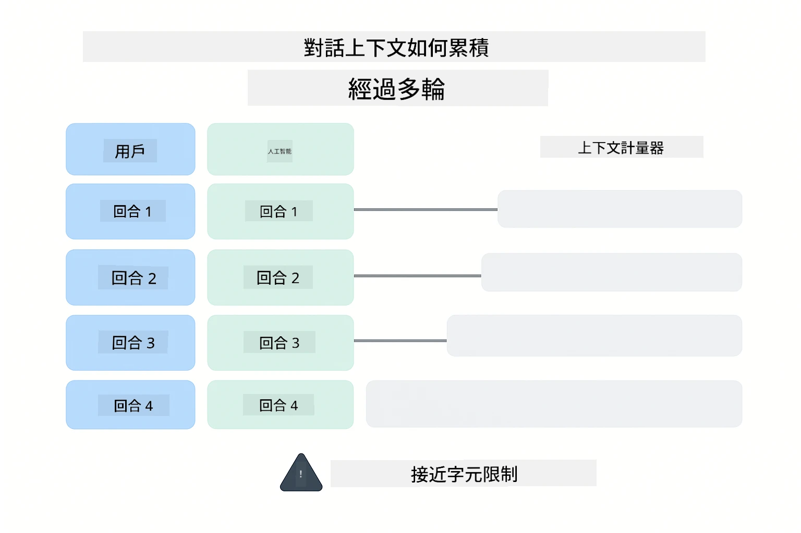
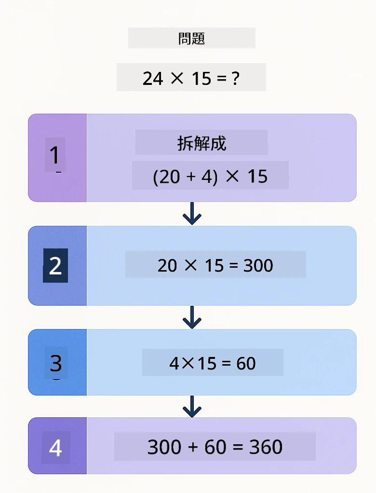
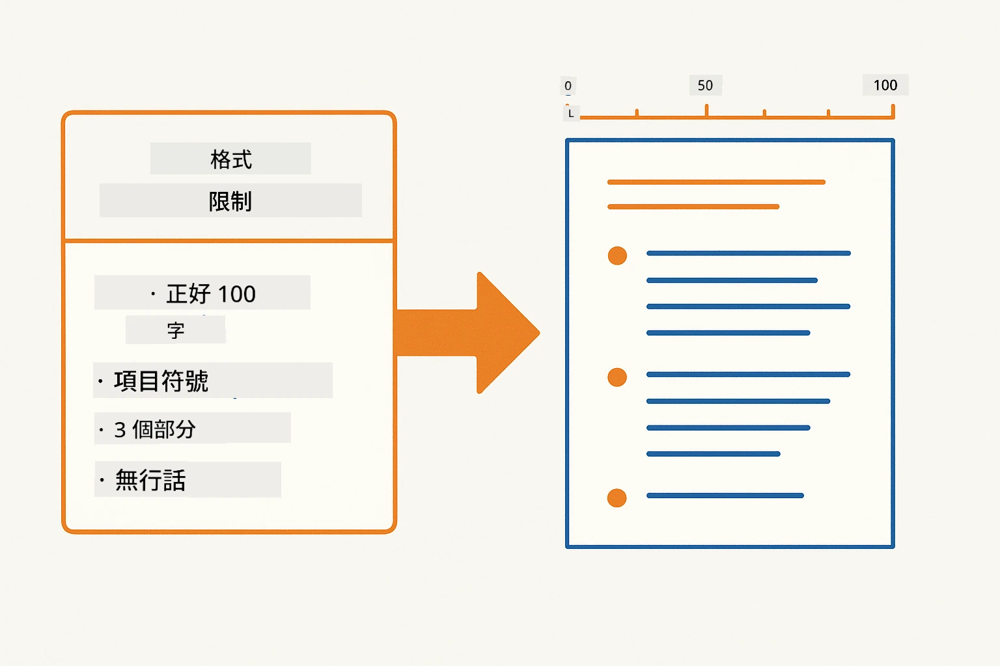
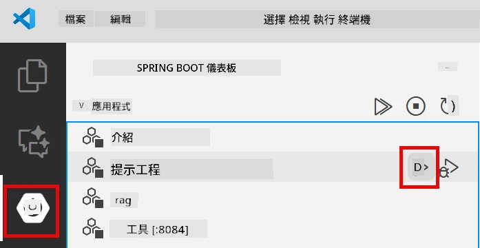
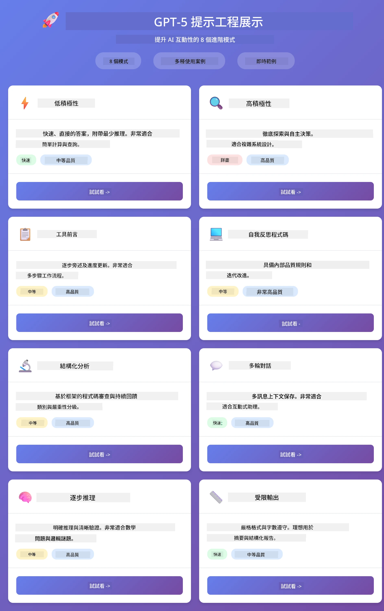

# Module 02: 使用 GPT-5.2 進行提示工程

## 目錄

- [影片示範](#影片示範)
- [你將學到什麼](#你將學到什麼)
- [前置條件](#前置條件)
- [了解提示工程](#了解提示工程)
- [提示工程基礎](#提示工程基礎)
  - [零範例提示](#零範例提示)
  - [少範例提示](#少範例提示)
  - [思維鏈](#思維鏈)
  - [角色式提示](#角色式提示)
  - [提示模板](#提示模板)
- [進階範式](#進階範式)
- [執行應用程式](#執行應用程式)
- [應用程式截圖](#應用程式截圖)
- [探索範式](#探索各種模式)
  - [低 vs 高積極性](#低積極性-vs-高積極性)
  - [任務執行（工具前言）](#任務執行（工具前言）)
  - [自我反思程式碼](#自我反思程式碼)
  - [結構化分析](#結構化分析)
  - [多輪聊天](#多輪對話)
  - [逐步推理](#逐步推理)
  - [受限輸出](#受限輸出)
- [你真正學到的是什麼](#您真正學到的是什麼)
- [後續步驟](#下一步)

## 影片示範

觀看本直播說明如何開始本模組：

<a href="https://www.youtube.com/live/PJ6aBaE6bog?si=LDshyBrTRodP-wke"></a>

## 你將學到什麼

下圖提供本模組關鍵主題與技能的概觀 — 從提示精煉技術到你將遵循的逐步工作流程。


在上一模組中，你了解記憶如何啟用 Azure OpenAI 的對話 AI。現在我們聚焦於如何問問題 — 即提示本身 — 使用 Azure OpenAI 的 GPT-5.2。你組織提示的方式會大幅影響回應品質。我們先回顧基本提示技術，然後進入八種進階範式，充分利用 GPT-5.2 的能力。

我們選用 GPT-5.2 是因為它引入了推理控制 — 你可以指示模型回答前應該思考多少。這使不同提示策略更易區分，也幫助你理解何時使用各種方法。

## 前置條件

- 完成 Module 01（已部署 Azure OpenAI 資源）
- 根目錄有含 Azure 認證的 `.env` 檔案（由 Module 01 執行 `azd up` 建立）

> **注意：** 如果未完成 Module 01，請先依該模組中的部署指示操作。

## 了解提示工程

從根本上說，提示工程是模糊指令與精確指令的差異，下面圖示說明了這點。


提示工程是設計輸入文字，讓你穩定得到所需結果的技術。它不僅是提問——而是組織請求，使模型精準理解你想要什麼及如何交付。

把它想成你給同事指示。“修復錯誤”很模糊。“在 UserService.java 第 45 行因加入空值檢查修復 NullPointerException”就很具體。語言模型也是同理——具體與結構都很重要。

下圖展示 LangChain4j 在這個過程中的角色 — 將你的提示範式透過 SystemMessage 與 UserMessage 模組連結到模型。


LangChain4j 提供基礎架構 — 模型連結、記憶與訊息類型 — 提示範式則是你透過該架構傳送的精心結構化文字。主要建構區塊是 `SystemMessage`（設定 AI 行為與角色）與 `UserMessage`（攜帶你實際請求）。

## 提示工程基礎

下列五種核心技術構成有效提示工程的基石。它們各自解決如何與語言模型溝通的不同面向。


在本模組深入進階範式前，我們先回顧五種基礎提示技巧。這是每個提示工程師應知的基礎建構。

### 零範例提示

最簡單的方法：直接給模型指令，無需範例。模型完全依訓練理解與執行任務。這適用於預期行為明確的簡單請求。


*無範例的直接指令 — 模型僅從指令推斷任務*

```java
String prompt = "Classify this sentiment: 'I absolutely loved the movie!'";
String response = model.chat(prompt);
// 回覆：「正面」
```

**適用時機：** 簡單分類、直接提問、翻譯或任何模型能無需額外指引執行的任務。

### 少範例提示

提供示例展示你希望模型採用的模式。模型從示例學習預期的輸入輸出格式，並套用於新輸入。這大幅提升對格式或行為不明顯任務的一致性。


*從範例學習 — 模型辨識模式並應用於新輸入*

```java
String prompt = """
    Classify the sentiment as positive, negative, or neutral.
    
    Examples:
    Text: "This product exceeded my expectations!" → Positive
    Text: "It's okay, nothing special." → Neutral
    Text: "Waste of money, very disappointed." → Negative
    
    Now classify this:
    Text: "Best purchase I've made all year!"
    """;
String response = model.chat(prompt);
```

**適用時機：** 自訂分類、一致格式、特定領域任務，或零範例結果不一致時。

### 思維鏈

要求模型逐步顯示推理過程。模型不直接給答案，而是拆解問題並明確處理各部分，有助提升數學、邏輯與多步推理任務的準確度。


*逐步推理 — 將複雜問題拆成清楚的邏輯步驟*

```java
String prompt = """
    Problem: A store has 15 apples. They sell 8 apples and then 
    receive a shipment of 12 more apples. How many apples do they have now?
    
    Let's solve this step-by-step:
    """;
String response = model.chat(prompt);
// 模型顯示：15 - 8 = 7，然後 7 + 12 = 19 個蘋果
```

**適用時機：** 數學問題、邏輯謎題、除錯或任何展示推理過程能提升精確度與信任的情境。

### 角色式提示

在提問前設定 AI 的身份或角色。這提供上下文，影響回應的語氣、深度與焦點。軟體架構師、初級開發者或安全審計員給出的建議會不同。


*設定上下文與角色 — 相同問題因角色不同而獲不同回答*

```java
String prompt = """
    You are an experienced software architect reviewing code.
    Provide a brief code review for this function:
    
    def calculate_total(items):
        total = 0
        for item in items:
            total = total + item['price']
        return total
    """;
String response = model.chat(prompt);
```

**適用時機：** 程式碼審查、教學、特定領域分析，或需要依專業層級或角度客製答案時。

### 提示模板

建立可重複使用的提示，內含變數佔位符。不必每次撰寫新提示，只要定義模板並填入不同值。LangChain4j 的 `PromptTemplate` 類提供簡易的 `{{variable}}` 語法。


*變數佔位符的可重用提示 — 一個模板，多種用途*

```java
PromptTemplate template = PromptTemplate.from(
    "What's the best time to visit {{destination}} for {{activity}}?"
);

Prompt prompt = template.apply(Map.of(
    "destination", "Paris",
    "activity", "sightseeing"
));

String response = model.chat(prompt.text());
```

**適用時機：** 多次請求不同輸入、批次處理、建立可重用 AI 工作流程，或任何提示結構固定、資料不同的場景。

---

這五項基礎技術提供大多數提示任務的穩固工具組。本模組接下來將以 <strong>八種進階範式</strong> 補充，善用 GPT-5.2 的推理控制、自我評估與結構化輸出功能。

## 進階範式

基礎技巧穩固後，讓我們探討讓本模組獨特的八種進階範式。並非所有問題都需相同做法，有些問題需要快速回答，有些需深度思考。有些需顯式推理，有些只要結果。下列每種範式針對不同場景優化，而 GPT-5.2 的推理控制更凸顯出差異。



<em>八種提示工程範式及其使用案例概覽</em>

GPT-5.2 為這些範式帶來另一層面向：<em>推理控制</em>。下方滑桿示範如何調整模型的思考深度 — 從快速直接回答至深度細緻分析。


*GPT-5.2 的推理控制可指定模型思考量 — 從快速直接回答到深度探索*

**低積極性（快速與聚焦）** — 適用簡單問題需快速直接答案。模型推理步驟極少，不超過 2 步。用於運算、查詢或直白問題。

```java
String prompt = """
    <context_gathering>
    - Search depth: very low
    - Bias strongly towards providing a correct answer as quickly as possible
    - Usually, this means an absolute maximum of 2 reasoning steps
    - If you think you need more time, state what you know and what's uncertain
    </context_gathering>
    
    Problem: What is 15% of 200?
    
    Provide your answer:
    """;

String response = chatModel.chat(prompt);
```

> 💡 **使用 GitHub Copilot 探索：** 開啟 [`Gpt5PromptService.java`](../../../02-prompt-engineering/src/main/java/com/example/langchain4j/prompts/service/Gpt5PromptService.java) 並提問：
> - 「低積極性與高積極性提示範式有何差異？」
> - 「提示中的 XML 標籤如何協助組織 AI 回應？」
> - 「何時應使用自我反思範式而非直接指令？」

**高積極性（深入與全面）** — 適用複雜問題需全面分析。模型徹底探索並展示詳細推理。運用於系統設計、架構決策或複雜研究。

```java
String prompt = """
    Analyze this problem thoroughly and provide a comprehensive solution.
    Consider multiple approaches, trade-offs, and important details.
    Show your analysis and reasoning in your response.
    
    Problem: Design a caching strategy for a high-traffic REST API.
    """;

String response = chatModel.chat(prompt);
```

**任務執行（逐步進展）** — 適用多步流程。模型提出明確計劃，工作時逐步解說，最後給出總結。用於遷移、實作或任何多步操作。

```java
String prompt = """
    <task_execution>
    1. First, briefly restate the user's goal in a friendly way
    
    2. Create a step-by-step plan:
       - List all steps needed
       - Identify potential challenges
       - Outline success criteria
    
    3. Execute each step:
       - Narrate what you're doing
       - Show progress clearly
       - Handle any issues that arise
    
    4. Summarize:
       - What was completed
       - Any important notes
       - Next steps if applicable
    </task_execution>
    
    <tool_preambles>
    - Always begin by rephrasing the user's goal clearly
    - Outline your plan before executing
    - Narrate each step as you go
    - Finish with a distinct summary
    </tool_preambles>
    
    Task: Create a REST endpoint for user registration
    
    Begin execution:
    """;

String response = chatModel.chat(prompt);
```

思維鏈提示明確要求模型展示推理過程，增進複雜任務精確度。逐步拆解助人與 AI 理解邏輯。

> **🤖 嘗試使用 [GitHub Copilot](https://github.com/features/copilot) 聊天：** 詢問此範式：
> - 「如何調整任務執行範式以應對長時間運行操作？」
> - 「如何在生產應用中結構化工具前言的最佳實踐？」
> - 「如何在 UI 中捕捉與顯示中間進度更新？」

下圖展示此計劃 → 執行 → 總結工作流程。


*多步任務的 計劃 → 執行 → 總結 流程*

<strong>自我反思程式碼</strong> — 產出符合生產標準的程式碼。模型生成遵守生產標準且具適當錯誤處理的程式碼。用於建立新功能或服務。

```java
String prompt = """
    Generate Java code with production-quality standards: Create an email validation service
    Keep it simple and include basic error handling.
    """;

String response = chatModel.chat(prompt);
```

下圖呈現此反覆改進迴圈 — 生成、評估、找出問題、改進，直到程式碼符合生產標準。



*反覆改進迴圈 — 生成、評估、找出問題、改進、重複*

<strong>結構化分析</strong> — 用於一致評估。模型使用固定框架（正確性、慣例、效能、安全性、可維護性）審查程式碼。適用程式碼審查或品質評估。

```java
String prompt = """
    <analysis_framework>
    You are an expert code reviewer. Analyze the code for:
    
    1. Correctness
       - Does it work as intended?
       - Are there logical errors?
    
    2. Best Practices
       - Follows language conventions?
       - Appropriate design patterns?
    
    3. Performance
       - Any inefficiencies?
       - Scalability concerns?
    
    4. Security
       - Potential vulnerabilities?
       - Input validation?
    
    5. Maintainability
       - Code clarity?
       - Documentation?
    
    <output_format>
    Provide your analysis in this structure:
    - Summary: One-sentence overall assessment
    - Strengths: 2-3 positive points
    - Issues: List any problems found with severity (High/Medium/Low)
    - Recommendations: Specific improvements
    </output_format>
    </analysis_framework>
    
    Code to analyze:
    ```
    public List getUsers() {
        return database.query("SELECT * FROM users");
    }
    ```
    Provide your structured analysis:
    """;

String response = chatModel.chat(prompt);
```

> **🤖 使用 [GitHub Copilot](https://github.com/features/copilot) 聊天：** 詢問結構化分析：
> - 「如何為不同程式碼審查類型客製分析框架？」
> - 「如何以程式化方式解析並運用結構化輸出？」
> - 「如何確保不同審查會話中嚴重性評級的一致性？」

下圖展示此結構化框架如何將程式碼審查組織成一致類別並配以嚴重性等級。



<em>帶有嚴重性等級的一致程式碼審查框架</em>

<strong>多輪聊天</strong> — 用於需上下文的對話。模型記住前訊息並累積回應。用於互動式輔助或複雜問答。

```java
ChatMemory memory = MessageWindowChatMemory.withMaxMessages(10);

memory.add(UserMessage.from("What is Spring Boot?"));
AiMessage aiMessage1 = chatModel.chat(memory.messages()).aiMessage();
memory.add(aiMessage1);

memory.add(UserMessage.from("Show me an example"));
AiMessage aiMessage2 = chatModel.chat(memory.messages()).aiMessage();
memory.add(aiMessage2);
```

下圖視覺化對話上下文如何隨多輪累積，以及它如何影響模型令牌限制。



<em>多輪對話中上下文如何累積直至達到令牌限制</em>

<strong>逐步推理</strong> — 適用需可見邏輯的問題。模型逐步展示明確推理。用於數學問題、邏輯謎題或你希望理解思考過程的場景。

```java
String prompt = """
    <instruction>Show your reasoning step-by-step</instruction>
    
    If a train travels 120 km in 2 hours, then stops for 30 minutes,
    then travels another 90 km in 1.5 hours, what is the average speed
    for the entire journey including the stop?
    """;

String response = chatModel.chat(prompt);
```

下圖示模型如何將問題拆解成明確、編號的邏輯步驟。


<em>將問題拆解為明確的邏輯步驟</em>

<strong>受限輸出</strong> - 用於具有特定格式要求的回應。模型嚴格遵守格式及長度規則。適用於摘要或需要精確輸出結構的情境。

```java
String prompt = """
    <constraints>
    - Exactly 100 words
    - Bullet point format
    - Technical terms only
    </constraints>
    
    Summarize the key concepts of machine learning.
    """;

String response = chatModel.chat(prompt);
```

以下圖表顯示約束如何引導模型產生嚴格符合您格式及長度要求的輸出。



*強制特定格式、長度及結構要求*

## 執行應用程式

**驗證部署:**

確保根目錄存在帶有 Azure 憑證的`.env`檔案（在 Module 01 中建立）。從模組目錄(`02-prompt-engineering/`)執行該指令：

**Bash:**
```bash
cat ../.env  # 應顯示 AZURE_OPENAI_ENDPOINT、API_KEY、DEPLOYMENT
```

**PowerShell:**
```powershell
Get-Content ..\.env  # 應該顯示 AZURE_OPENAI_ENDPOINT、API_KEY、DEPLOYMENT
```

**啟動應用程式:**

> **注意:** 若您已使用根目錄的`./start-all.sh`啟動所有應用程式（如 Module 01 所述），此模組已在 8083 埠執行。您可跳過以下啟動指令，直接前往 http://localhost:8083。

**選項 1：使用 Spring Boot Dashboard（建議 VS Code 使用者）**

開發容器已包含 Spring Boot Dashboard 擴充，可視覺化管理所有 Spring Boot 應用程式。可在 VS Code 左側活動列找到（尋找 Spring Boot 圖示）。

從 Spring Boot Dashboard，您可以：
- 查看工作區內所有可用的 Spring Boot 應用程式
- 一鍵啟動/停止應用程式
- 即時查看應用程式日誌
- 監控應用程式狀態

只需點擊「prompt-engineering」旁的播放按鈕啟動此模組，或一次啟動所有模組。



*VS Code 的 Spring Boot 儀表板 — 從一處啟動、停止及監控所有模組*

**選項 2：使用 shell 腳本**

啟動所有網頁應用程式（模組 01-04）：

**Bash:**
```bash
cd ..  # 從根目錄開始
./start-all.sh
```

**PowerShell:**
```powershell
cd ..  # 從根目錄開始
.\start-all.ps1
```

或只啟動本模組：

**Bash:**
```bash
cd 02-prompt-engineering
./start.sh
```

**PowerShell:**
```powershell
cd 02-prompt-engineering
.\start.ps1
```

兩個脚本均會自動從根目錄`.env`載入環境變數，且若尚未建置 JAR 檔案會自動建置。

> **注意:** 若您想要先手動建置所有模組，再執行啟動：
>
> **Bash:**
> ```bash
> cd ..  # Go to root directory
> mvn clean package -DskipTests
> ```
>
> **PowerShell:**
> ```powershell
> cd ..  # Go to root directory
> mvn clean package -DskipTests
> ```

在瀏覽器開啟 http://localhost:8083 。

**停止應用:**

**Bash:**
```bash
./stop.sh  # 只有這個模組
# 或者
cd .. && ./stop-all.sh  # 所有模組
```

**PowerShell:**
```powershell
.\stop.ps1  # 只有這個模組
# 或
cd ..; .\stop-all.ps1  # 所有模組
```

## 應用程式截圖

以下是提示工程模組的主介面，您可以並排試驗所有八種模式。



*主要儀表板展示所有 8 種提示工程模式及其特性和使用案例*

## 探索各種模式

網頁介面允許您嘗試不同的提示策略。每個模式解決不同問題 — 試試看，看看哪種方式最合適。

> **注意: 直播 vs 非直播** — 每個模式頁面提供兩個按鈕：**🔴 直播回應（實時）** 和 <strong>非直播</strong> 選項。直播採用伺服器發送事件（SSE）以即時顯示模型生成的詞元，您可立即看到進度。非直播則等待整段回應生成完畢後才顯示。對於觸發深度推理的提示（如高積極性、自我反思程式碼），非直播呼叫可能需要很長時間（有時甚至數分鐘），且無任何可見回饋。**進行複雜提示實驗時請使用直播，這樣您能看到模型運作，避免以為請求已超時。**
>
> **注意: 瀏覽器需求** — 直播功能使用 Fetch Streams API（`response.body.getReader()`），需要完整瀏覽器（Chrome、Edge、Firefox、Safari）。VS Code 內建的 Simple Browser 不支援 ReadableStream API，因此無法直播。若使用 Simple Browser，非直播按鈕仍可正常運作，只有直播按鈕無效。請於外部瀏覽器開啟 `http://localhost:8083` 以獲得完整體驗。

### 低積極性 vs 高積極性

用低積極性問個簡單問題：「200 的 15% 是多少？」您會立即得到直接答案。再用高積極性問復雜問題：「設計一個高流量 API 的快取策略。」點擊 **🔴 直播回應（實時）**，觀看模型逐詞展現詳細推理。相同模型，相同問題結構 — 但提示告訴它要思考多少。

### 任務執行（工具前言）

多步工作流程需要事前規劃和進度描述。模型會先概要要做的事，邊做邊說明每一步，最後總結結果。

### 自我反思程式碼

試試「建立一個電子郵件驗證服務」。模型不只生成程式碼然後停止，而是生成後依品質標準評估、找出缺陷並改進。您會看到它反覆迭代，直到程式碼符合生產標準。

### 結構化分析

程式碼審查需要一致評估架構。模型使用固定類別（正確性、慣例、效能、安全性）並帶有嚴重性等級來分析程式碼。

### 多輪對話

問「什麼是 Spring Boot？」然後緊接著問「給我一個範例」。模型記得您第一個問題，並特別給出 Spring Boot 範例。若無記憶，第二個問題會太模糊。

### 逐步推理

挑選一道數學題，用逐步推理及低積極性各試一次。低積極性只給答案 — 快但不透明。逐步推理會呈現每步計算和決策。

### 受限輸出

當您需要特定格式或字數時，此模式嚴格執行規則。試試產生一則用 100 個字精確的點列摘要。

## 您真正學到的是什麼

<strong>推理努力決定一切</strong>

GPT-5.2 讓您可透過提示調控計算努力。低努力就是快速回應但探索少。高努力則花時間深度思考。您正在學習依任務複雜度匹配努力 — 簡單問題別浪費時間，複雜決策也別草率。

<strong>結構引導行為</strong>

注意提示中的 XML 標籤？它們不是裝飾。模型比起自由文本，更可靠地遵循有結構指令。當需要多步驟流程或複雜邏輯時，結構幫助模型追蹤位置及下一步。下圖拆解一個良好結構的提示，展示 `<system>`、`<instructions>`、`<context>`、`<user-input>`、`<constraints>` 等標籤如何將指令組織成明確區段。


*精心結構化提示的解剖 — 明確區段，XML 風格組織*

<strong>透過自我評估提升品質</strong>

自我反思模式會明確列出品質標準。您不必希望模型「做對」，而是告訴它什麼是「對的」：邏輯正確、錯誤處理、效能、安全。模型能自我評估輸出並改進。這將程式碼生成從彩票變成有章可循的過程。

<strong>上下文是有限的</strong>

多輪對話依賴每次請求都帶上訊息歷史。但有限制 — 每個模型都有最大詞元數上限。對話越長，需想策略保留重要上下文而不超標。此模組教您記憶如何運作；往後您將學何時摘要、忘記、取回。

## 下一步

**下一模組：** [03-rag - RAG（檢索增強生成）](../03-rag/README.md)

---

**導航：** [← 上一章節：Module 01 - 介紹](../01-introduction/README.md) | [回主頁](../README.md) | [下一章節：Module 03 - RAG →](../03-rag/README.md)

---

<!-- CO-OP TRANSLATOR DISCLAIMER START -->
**免責聲明**：
本文件由 AI 翻譯服務 [Co-op Translator](https://github.com/Azure/co-op-translator) 翻譯而成。雖然我們致力於確保準確性，但請注意，機器自動翻譯可能包含錯誤或不準確之處。原始文件的母語版本應被視為權威來源。對於重要資訊，建議進行專業人工翻譯。我們不對因使用本翻譯而產生的任何誤解或誤釋承擔責任。
<!-- CO-OP TRANSLATOR DISCLAIMER END -->