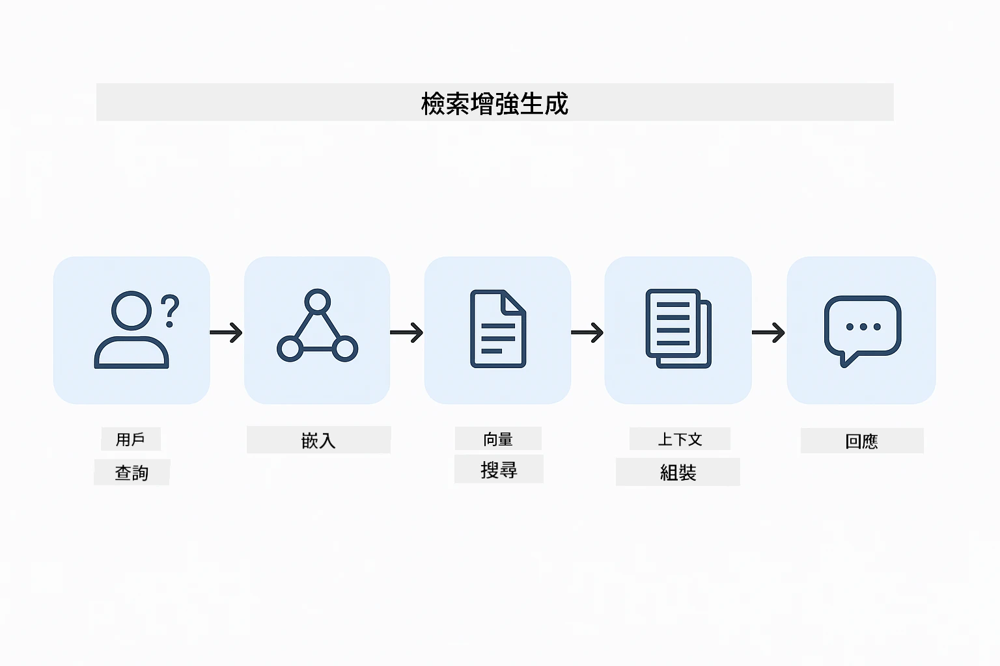
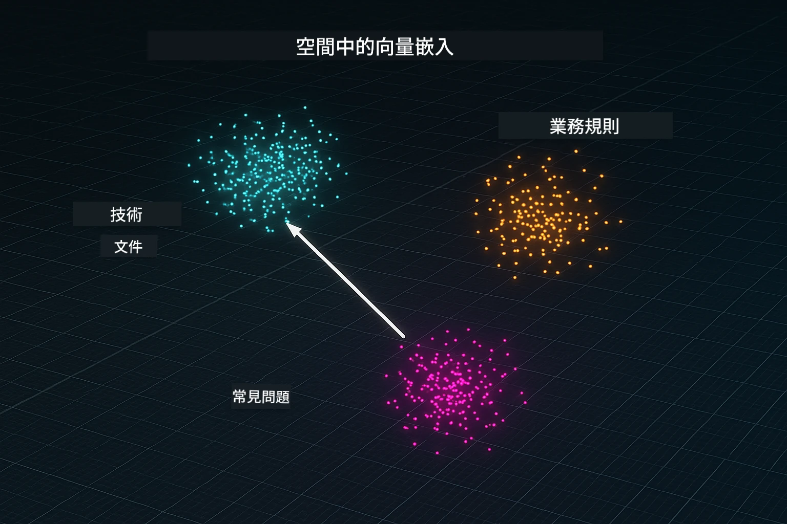
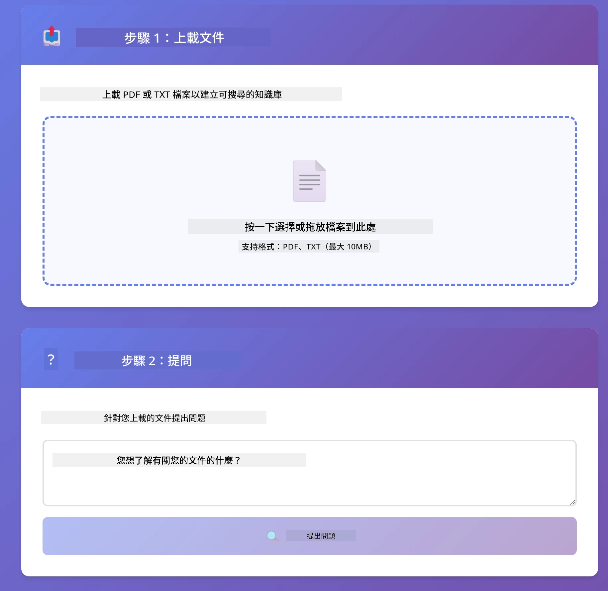
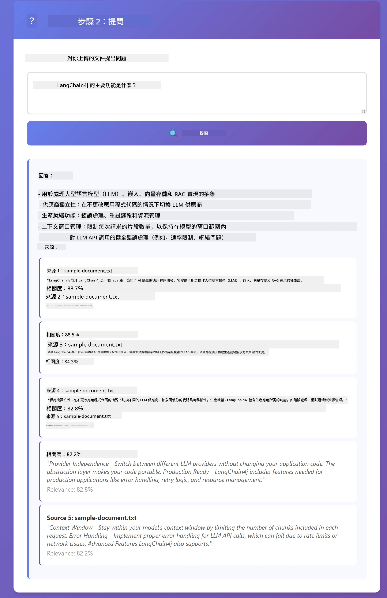

# Module 03: RAG (檢索增強生成)

## 目錄

- [影片導覽](#影片導覽)
- [你將學習到的內容](#你將學習到的內容)
- [先決條件](#先決條件)
- [理解 RAG](#理解-rag)
  - [本教學使用哪種 RAG 方法？](#本教學使用哪種-rag-方法？)
- [運作原理](#運作原理)
  - [文件處理](#文件處理)
  - [建立嵌入](#建立嵌入)
  - [語意搜尋](#語意搜尋)
  - [答案生成](#回答生成)
- [執行應用程式](#運行應用程式)
- [使用應用程式](#使用應用程式)
  - [上傳文件](#上傳文件)
  - [提問](#提問)
  - [檢查來源參考](#檢查來源參考)
  - [試驗提問](#試驗不同問題)
- [關鍵概念](#關鍵概念)
  - [分塊策略](#片段策略)
  - [相似度分數](#相似度分數)
  - [記憶體存儲](#記憶體存儲)
  - [上下文視窗管理](#上下文視窗管理)
- [何時需要 RAG](#何時使用-rag)
- [下一步](#下一步)

## 影片導覽

觀看這場說明如何開始本模組的直播：

<a href="https://www.youtube.com/watch?v=_olq75ZH_eY"></a>

## 你將學習到的內容

在之前的模組中，你學會了如何與 AI 進行對話以及有效地結構化提示。但有個根本限制：語言模型只能知道它在訓練期間學到的知識。它們無法回答有關你公司政策、專案文件或未曾訓練過的資訊的問題。

RAG（檢索增強生成）解決了這個問題。它不是嘗試教模型你的資訊（這樣費時又不切實際），而是賦予模型搜尋你文件的能力。當有人提問時，系統會找出相關資訊並把它包含進提示中。模型則根據這些檢索到的上下文來回答。

把 RAG 想像成給模型一個參考圖書館。當你提問時，系統會：

1. <strong>使用者查詢</strong> - 你提出問題
2. <strong>嵌入</strong> - 將問題轉成向量
3. <strong>向量搜尋</strong> - 找出相似的文件區塊
4. <strong>上下文組裝</strong> - 將相關區塊加入提示中
5. <strong>回應</strong> - LLM 根據上下文生成答案

這讓模型的回應基於你的實際資料，而不是依賴訓練知識或憑空編造答案。

## 先決條件

- 完成 [Module 01 - 介紹](../01-introduction/README.md)（已部署 Azure OpenAI 資源，包括 `text-embedding-3-small` 嵌入模型）
- 根目錄有 `.env` 檔案包含 Azure 憑證（由 Module 01 的 `azd up` 指令建立）

> **注意：** 如果尚未完成 Module 01，請先依該模組的部署說明操作。`azd up` 指令會部署 GPT 聊天模型與本模組所用的嵌入模型。

## 理解 RAG

下圖說明了核心概念：RAG 不僅依賴模型的訓練資料，而是給模型一個你的文件參考庫，讓它在生成答案之前先查閱。


*此圖展示標準 LLM（從訓練數據猜測）與 RAG 增強型 LLM（先檢索你的文件）的差異。*

下面是端到端的流程。使用者問題經過四個階段 —— 嵌入、向量搜尋、上下文組裝、答案生成 —— 每階段基於前一階段：



*此圖展示完整的 RAG 流程——使用者查詢依序經過嵌入、向量搜尋、上下文組裝與答案生成。*

本模組其餘部分會一一說明每個階段，並附上可執行及可修改的程式碼。

### 本教學使用哪種 RAG 方法？

LangChain4j 提供三種實現 RAG 的方法，抽象程度不同。下圖比較三者：


*此圖比較 LangChain4j 三種 RAG 方法——Easy、Native 和 Advanced，說明其主要元件及適用時機。*

| 方法 | 功能說明 | 取捨 |
|---|---|---|
| **Easy RAG** | 透過 `AiServices` 和 `ContentRetriever` 自動串接所有流程。你只需註解介面，附加檢索器，LangChain4j 背後負責嵌入、搜尋和提示組裝。 | 程式碼極簡，但無法看見每個步驟細節。 |
| **Native RAG** | 你自己呼叫嵌入模型、搜尋庫、組裝提示、生成答案，各步驟明確分開。 | 程式碼較多，可視化且可修改每個階段。 |
| **Advanced RAG** | 使用可組件化的 `RetrievalAugmentor` 框架，含查詢轉換、路由、重排序和內容注入，適用生產級流程。 | 靈活度最高，但複雜度顯著提升。 |

**本教學採用 Native 方法。** RAG 流程中每一步 —— 查詢嵌入、向量庫搜尋、上下文組裝及答案生成 —— 都在 [`RagService.java`](../../../03-rag/src/main/java/com/example/langchain4j/rag/service/RagService.java) 中清楚呈現。這是刻意為之：作為學習資源，比起程式碼極簡，更重視讓你看到並理解每個階段的運作。熟悉後，可以選擇 Easy RAG 快速原型，或 Advanced RAG 用於生產系統。

> **💡 想了解 Easy RAG？** LangChain4j 另有一種 *Easy RAG* 方法，由 `AiServices` 和 `ContentRetriever` 自動處理嵌入、搜尋與提示組裝。本模組則走較明確的路線——拆解流程讓你能看見並控制每一階段。

下圖展示 Easy RAG 流程。注意 `AiServices` 與 `EmbeddingStoreContentRetriever` 隱藏所有複雜性——載入文件、附加檢索器，再取得答案。本模組的 Native 方法則拆開這些隱藏步驟：


*此圖顯示 Easy RAG 流程。與本模組的 Native 方法比較：Easy RAG 把嵌入、檢索和提示組裝藏在 `AiServices` 和 `ContentRetriever` 後面，你只需載入文件、附檢索器，直接取得答案。Native 方法拆解該流程，每階段（嵌入、搜尋、組裝上下文、生成）都由你呼叫，給你完全可見與控制權。*

## 運作原理

本模組的 RAG 流程分成四個階段，當使用者提問時依序執行。首先，已上傳的文件會被 <strong>解析與分塊</strong> 成易於處理的小片段。接著這些區塊會被轉成 <strong>向量嵌入</strong> 並存儲，方便數學上比較相似度。當收到查詢時，系統會進行 <strong>語意搜尋</strong>，挑出最相關的區塊，最後將這些內容作為上下文，交由 LLM 進行 <strong>答案生成</strong>。以下章節將逐步說明每個階段，附程式碼與示意圖。先來看看第一步。

### 文件處理

[DocumentService.java](../../../03-rag/src/main/java/com/example/langchain4j/rag/service/DocumentService.java)

當你上傳文件時，系統會解析它（PDF 或純文字格式），附加如檔名等元資料，然後拆成分塊——也就是適合模型上下文視窗大小的小片段。這些分塊彼此有少量重疊，以免在邊界處遺失上下文。

```java
// 解析上載的文件並包裝成 LangChain4j 文件
Document document = Document.from(content, metadata);

// 分割成每塊 300 個標記，重疊部分為 30 個標記
DocumentSplitter splitter = DocumentSplitters
    .recursive(300, 30);

List<TextSegment> segments = splitter.split(document);
```

下圖示意這個過程。注意每個分塊和鄰近分塊有約 30 個 token 重疊——確保重要上下文不會遺漏：


*此圖展示文件被分割成 300 token 的分塊，且每個分塊有 30 token 交疊，維持分塊邊界的上下文內容。*

> **🤖 用 [GitHub Copilot](https://github.com/features/copilot) 聊天試試看：** 開啟 [`DocumentService.java`](../../../03-rag/src/main/java/com/example/langchain4j/rag/service/DocumentService.java) 並問：
> - 「LangChain4j 如何將文件拆成分塊？為什麼重疊很重要？」
> - 「不同文件類型的最佳分塊大小是多少？為什麼？」
> - 「該如何處理多語言或特殊格式的文件？」

### 建立嵌入

[LangChainRagConfig.java](../../../03-rag/src/main/java/com/example/langchain4j/rag/config/LangChainRagConfig.java)

每個分塊都會轉成一種數字化的表示法，稱為嵌入（embedding）——本質上是意義到數字的轉換。嵌入模型不像聊天模型「智能」；它無法執行指令、推理或回答問題。它能做的是把文本映射到一個數學空間，讓意義相近的內容落在彼此附近——像是「車」和「汽車」、「退款政策」和「退錢」。把聊天模型想像成能交談的人，嵌入模型則像極好用的歸檔系統。

下圖視覺化這個概念——文本進入，數值向量輸出，意義相近的詞會被映射到相鄰向量空間：


*此圖展示嵌入模型如何將文本轉成數值向量，並將意義相近的詞彙（如「車」和「汽車」）放置在向量空間中的鄰近位置。*

```java
@Bean
public EmbeddingModel embeddingModel() {
    return OpenAiOfficialEmbeddingModel.builder()
        .baseUrl(azureOpenAiEndpoint)
        .apiKey(azureOpenAiKey)
        .modelName(azureEmbeddingDeploymentName)
        .build();
}

EmbeddingStore<TextSegment> embeddingStore = 
    new InMemoryEmbeddingStore<>();
```

下方類別圖顯示 RAG 流程的兩條分支及對應的 LangChain4j 類別。<strong>攝取流程</strong>（上傳時執行一次）負責切分文件、嵌入分塊並透過 `.addAll()` 儲存。<strong>查詢流程</strong>（每次用戶提問時執行）負責將問題嵌入，透過 `.search()` 搜尋庫，並將匹配的上下文傳給聊天模型。兩者以共用的 `EmbeddingStore<TextSegment>` 介面連接：


*此圖展示 RAG 流程的兩條分支——攝取與查詢，以及它們如何透過共用的 EmbeddingStore 接口連接。*

嵌入儲存後，類似的內容自然會在向量空間中群聚。以下視覺化展示與相關主題相似的文件如何形成鄰近點，這是實現語意搜尋的基礎：



*此圖展示相關文件在 3D 向量空間中群聚，像是技術文檔、商業規則及常見問答形成明顯的群組。*

當使用者搜尋時，系統執行四步：先嵌入文檔（一次），然後每次搜尋嵌入查詢，接著用餘弦相似度比較查詢向量與所有已存向量，最後回傳前 K 名最高分分塊。下圖逐步示範該流程與相應的 LangChain4j 類別：


*此圖展示四步嵌入搜尋流程：嵌入文件、嵌入查詢、用餘弦相似度比對向量，最後返回最高分的前 K 筆結果。*

### 語意搜尋

[RagService.java](../../../03-rag/src/main/java/com/example/langchain4j/rag/service/RagService.java)

當你提出問題時，問題本身也會被轉成嵌入。系統將你的問題嵌入與所有文件分塊的嵌入比對。它找出意義最相近的區塊——不只是字詞匹配，而是真正的語意相似。

```java
Embedding queryEmbedding = embeddingModel.embed(question).content();

EmbeddingSearchRequest searchRequest = EmbeddingSearchRequest.builder()
    .queryEmbedding(queryEmbedding)
    .maxResults(5)
    .minScore(0.5)
    .build();

EmbeddingSearchResult<TextSegment> searchResult = embeddingStore.search(searchRequest);
List<EmbeddingMatch<TextSegment>> matches = searchResult.matches();

for (EmbeddingMatch<TextSegment> match : matches) {
    String relevantText = match.embedded().text();
    double score = match.score();
}
```

下圖對比語意搜尋與傳統關鍵字搜尋。對 “vehicle” (車輛) 的關鍵字搜尋不會找到「cars and trucks」的區塊，而語意搜尋理解它們是相同概念，會回傳高分匹配結果：


*此圖比較關鍵字搜尋與語意搜尋，說明語意搜尋如何在關鍵字不同時仍能抓取概念上相關的內容。*

在底層，相似度是用餘弦相似度衡量——本質上在問「這兩支箭頭是否指向相同方向？」兩個用詞完全不同的區塊，但若意義相近，其向量指向會相同，得分會接近 1.0：


*此圖示說明餘弦相似度作為嵌入向量間的角度—越貼近對齊的向量分數越接近 1.0，表示語義相似度越高。*

> **🤖 試試看用 [GitHub Copilot](https://github.com/features/copilot) 聊天：** 打開 [`RagService.java`](../../../03-rag/src/main/java/com/example/langchain4j/rag/service/RagService.java) 並問：
> - 「嵌入和相似度搜尋的工作原理是什麼？分數是如何決定的？」
> - 「我應該使用什麼相似度閾值？它如何影響結果？」
> - 「當找不到相關文件時，我該如何處理？」

### 回答生成

[RagService.java](../../../03-rag/src/main/java/com/example/langchain4j/rag/service/RagService.java)

最相關的片段會被組合成結構化提示，包括明確指示、檢索到的上下文，以及用戶問題。模型會讀取這些特定片段並根據該資訊回答——它只能使用眼前呈現的內容，以避免幻想。

```java
String context = matches.stream()
    .map(match -> match.embedded().text())
    .collect(Collectors.joining("\n\n"));

String prompt = String.format("""
    Answer the question based on the following context.
    If the answer cannot be found in the context, say so.

    Context:
    %s

    Question: %s

    Answer:""", context, request.question());

String answer = chatModel.chat(prompt);
```
  
下方圖示說明這種組合的運作——搜尋步驟中得分最高的片段會被注入提示模板，`OpenAiOfficialChatModel` 生成有根據的回答：


*此圖說明如何將得分最高的片段組合成結構化提示，讓模型根據你的資料生成有根據的答案。*

## 運行應用程式

**驗證部署：**

確保根目錄存在 `.env` 檔案且包含 Azure 憑證（已於模組01建立）。從模組目錄（`03-rag/`）執行：

**Bash:**
```bash
cat ../.env  # 應該顯示 AZURE_OPENAI_ENDPOINT、API_KEY、DEPLOYMENT
```
  
**PowerShell:**
```powershell
Get-Content ..\.env  # 應該顯示 AZURE_OPENAI_ENDPOINT、API_KEY、DEPLOYMENT
```
  
**啟動應用程式：**

> **注意：** 如果你已經從根目錄使用 `./start-all.sh` 啟動所有應用（如模組01所述），此模組已在 8081 埠執行。你可以跳過以下啟動指令，直接訪問 http://localhost:8081。

**選項一：使用 Spring Boot Dashboard（推薦 VS Code 使用者）**

開發容器已包含 Spring Boot Dashboard 擴充功能，提供管理所有 Spring Boot 應用的視覺介面。可在 VS Code 左側活動欄找到（尋找 Spring Boot 圖示）。

透過 Spring Boot Dashboard，你可以：
- 查看工作區中所有可用 Spring Boot 應用
- 一鍵啟動/停止應用
- 即時查看應用日誌
- 監控應用狀態

點擊 "rag" 旁的播放按鈕即可啟動此模組，或一次啟動所有模組。


*此截圖展示 VS Code 中的 Spring Boot Dashboard，你可以視覺化方式啟動、停止及監控應用。*

**選項二：使用 shell 腳本**

啟動所有網頁應用（模組 01-04）：

**Bash:**
```bash
cd ..  # 從根目錄
./start-all.sh
```
  
**PowerShell:**
```powershell
cd ..  # 從根目錄出發
.\start-all.ps1
```
  
或只啟動此模組：

**Bash:**
```bash
cd 03-rag
./start.sh
```
  
**PowerShell:**
```powershell
cd 03-rag
.\start.ps1
```
  
這兩個腳本會自動載入根目錄 `.env` 的環境變數，並會在 JAR 檔不存在時建置。

> **注意：** 若你想在啟動前手動建置所有模組：
>
> **Bash:**
> ```bash
> cd ..  # Go to root directory
> mvn clean package -DskipTests
> ```
  
> **PowerShell:**
> ```powershell
> cd ..  # Go to root directory
> mvn clean package -DskipTests
> ```
  
在瀏覽器開啟 http://localhost:8081。

**停止方法：**

**Bash:**
```bash
./stop.sh  # 僅此模組
# 或者
cd .. && ./stop-all.sh  # 所有模組
```
  
**PowerShell:**
```powershell
.\stop.ps1  # 僅此模組
# 或
cd ..; .\stop-all.ps1  # 所有模組
```
  

## 使用應用程式

此應用程式提供文件上傳與提問的網頁介面。

<a href="images/rag-homepage.png"></a>

*此截圖展示 RAG 應用介面，你可上傳文件並提問。*

### 上傳文件

首先上傳文件—TXT 檔最佳以用於測試。此目錄中提供的 `sample-document.txt` 含有 LangChain4j 特色、RAG 實作及最佳實踐資訊，非常適合測試系統。

系統會處理你的文件，將其拆成片段，並為每個片段建立嵌入。這會在你上傳時自動完成。

### 提問

現在可對文件內容提出具體問題。試著問些文件中明確陳述的事實。系統會搜尋相關片段，將它們包含於提示中，並生成回答。

### 檢查來源參考

每個回答都包含帶有相似度分數的來源參考。這些分數（0 到 1）顯示每個片段與你的問題的相關程度。分數越高代表匹配越好。這讓你能對照來源資料驗證回答。

<a href="images/rag-query-results.png"></a>

*此截圖展示查詢結果，包括生成答案、來源參考與每個檢索片段的相關分數。*

### 試驗不同問題

試試不同類型的問題：
- 具體事實：「主要主題是什麼？」
- 比較問題：「X 和 Y 有什麼差異？」
- 摘要問題：「請總結 Z 的重點」

觀察相關分數如何隨著你的問題與文件內容匹配度變化。

## 關鍵概念

### 片段策略

文件被拆成每個 300 個 token 的片段，片段間有 30 token 的重疊。這樣的平衡確保每個片段有足夠的上下文意義，且小到可以在提示中加入多個片段。

### 相似度分數

每個檢索到的片段都帶有 0 到 1 之間的相似度分數，表示其與使用者問題的匹配緊密度。下圖視覺化分數範圍以及系統如何利用這些範圍來過濾結果：


*此圖示展示分數範圍從 0 到 1，並設定 0.5 最低閾值過濾不相關片段。*

分數範圍：
- 0.7-1.0：高度相關，精確匹配
- 0.5-0.7：相關，提供良好上下文
- 低於 0.5：過濾掉，過於不相似

系統只會檢索超過最低閾值的片段以確保品質。

嵌入表徵在語義分群明確時表現良好，但也有盲點。下圖顯示常見失效模式——片段太大導致向量混淆，片段太小缺乏上下文，曖昧詞彙指向多個語群，以及純精確匹配（ID、部件編號）完全不適用嵌入：


*此圖說明常見的嵌入失效模式：片段過大、片段過小、曖昧詞彙指向多重語群、以及像 ID 這類精確匹配查詢。*

### 記憶體存儲

此模組為簡化用例使用記憶體存儲。當你重啟應用時，上傳的文件會遺失。生產環境通常採用持久向量資料庫，如 Qdrant 或 Azure AI Search。

### 上下文視窗管理

每個模型有最大上下文視窗限制。無法包含大型文件的每個片段。系統僅檢索排名前 N 的相關片段（預設5），在限制內提供足夠上下文以生成精準回答。

## 何時使用 RAG

RAG 並非隨時適用。以下決策指南協助你判斷何時 RAG 有意義，何時可直接在提示中包含內容或使用模型內建知識即可：


*此圖示展示判斷何時採用 RAG 有價值，何時簡易方法已足夠的決策指南。*

## 下一步

**下一模組：** [04-tools - 具備工具的 AI 代理](../04-tools/README.md)

---

**導覽：** [← 上一個：模組 02 - 提示工程](../02-prompt-engineering/README.md) | [返回主頁](../README.md) | [下一個：模組 04 - 工具 →](../04-tools/README.md)

---

<!-- CO-OP TRANSLATOR DISCLAIMER START -->
**免責聲明**：
本文件由 AI 翻譯服務 [Co-op Translator](https://github.com/Azure/co-op-translator) 翻譯而成。雖然我們致力於確保準確性，但請注意，機器自動翻譯可能包含錯誤或不準確之處。原始文件的母語版本應被視為權威來源。對於重要資訊，建議進行專業人工翻譯。我們不對因使用本翻譯而產生的任何誤解或誤釋承擔責任。
<!-- CO-OP TRANSLATOR DISCLAIMER END -->