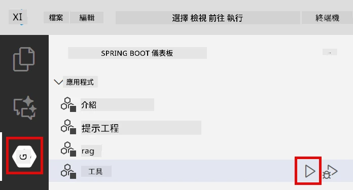
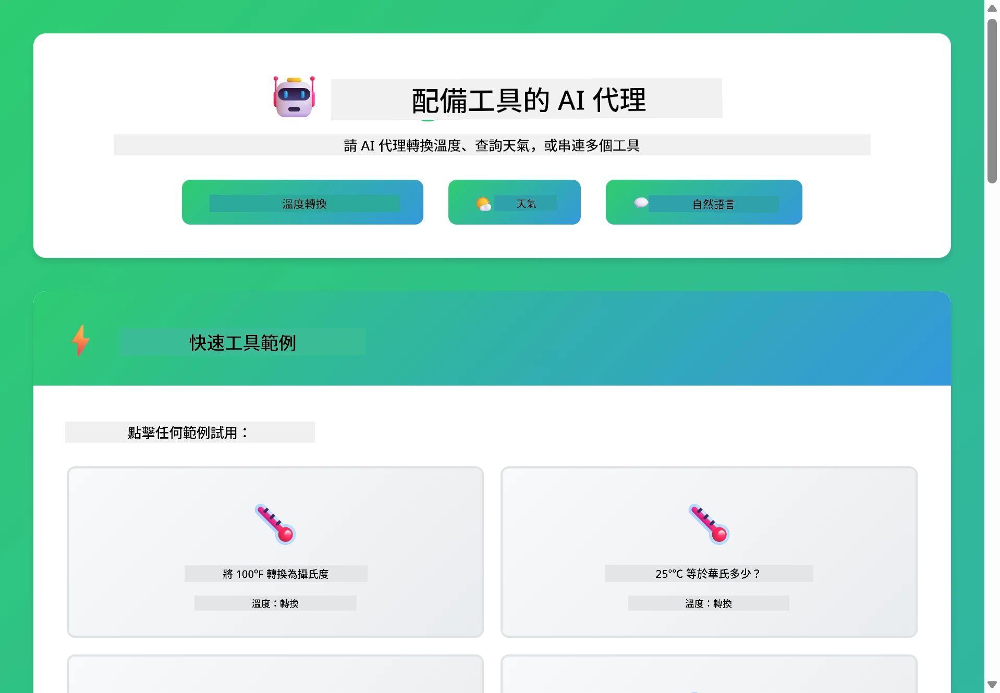
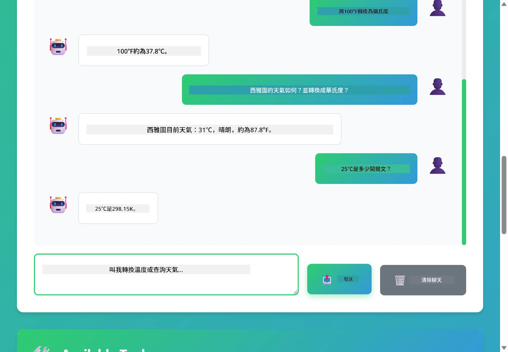

# Module 04: AI Agents with Tools

## Table of Contents

- [Video Walkthrough](#video-walkthrough)
- [What You'll Learn](#what-youll-learn)
- [Prerequisites](#prerequisites)
- [Understanding AI Agents with Tools](#understanding-ai-agents-with-tools)
- [How Tool Calling Works](#how-tool-calling-works)
  - [Tool Definitions](#tool-definitions)
  - [Decision Making](#decision-making)
  - [Execution](#execution)
  - [Response Generation](#response-generation)
  - [Architecture: Spring Boot Auto-Wiring](#architecture-spring-boot-auto-wiring)
- [Tool Chaining](#tool-chaining)
- [Run the Application](#run-the-application)
- [Using the Application](#使用此應用程式)
  - [Try Simple Tool Usage](#嘗試簡單工具使用)
  - [Test Tool Chaining](#測試工具串接)
  - [See Conversation Flow](#觀看對話流程)
  - [Experiment with Different Requests](#嘗試不同請求)
- [Key Concepts](#主要概念)
  - [ReAct Pattern (Reasoning and Acting)](#react-模式（推理與行動）)
  - [Tool Descriptions Matter](#工具描述很重要)
  - [Session Management](#會話管理)
  - [Error Handling](#錯誤處理)
- [Available Tools](#可用工具)
- [When to Use Tool-Based Agents](#何時使用基於工具的代理)
- [Tools vs RAG](#工具與-rag)
- [Next Steps](#下一步)

## Video Walkthrough

Watch this live session that explains how to get started with this module:

<a href="https://www.youtube.com/watch?v=O_J30kZc0rw"></a>

## What You'll Learn

So far, you've learned how to have conversations with AI, structure prompts effectively, and ground responses in your documents. But there's still a fundamental limitation: language models can only generate text. They can't check the weather, perform calculations, query databases, or interact with external systems.

Tools change this. By giving the model access to functions it can call, you transform it from a text generator into an agent that can take actions. The model decides when it needs a tool, which tool to use, and what parameters to pass. Your code executes the function and returns the result. The model incorporates that result into its response.

## Prerequisites

- Completed [Module 01 - Introduction](../01-introduction/README.md) (Azure OpenAI resources deployed)
- Completed previous modules recommended (this module references [RAG concepts from Module 03](../03-rag/README.md) in the Tools vs RAG comparison)
- `.env` file in root directory with Azure credentials (created by `azd up` in Module 01)

> **Note:** If you haven't completed Module 01, follow the deployment instructions there first.

## Understanding AI Agents with Tools

> **📝 Note:** The term "agents" in this module refers to AI assistants enhanced with tool-calling capabilities. This is different from the **Agentic AI** patterns (autonomous agents with planning, memory, and multi-step reasoning) that we'll cover in [Module 05: MCP](../05-mcp/README.md).

Without tools, a language model can only generate text from its training data. Ask it for the current weather, and it has to guess. Give it tools, and it can call a weather API, perform calculations, or query a database — then weave those real results into its response.


*Without tools the model can only guess — with tools it can call APIs, run calculations, and return real-time data.*

An AI agent with tools follows a **Reasoning and Acting (ReAct)** pattern. The model doesn't just respond — it thinks about what it needs, acts by calling a tool, observes the result, and then decides whether to act again or deliver the final answer:

1. **Reason** — The agent analyzes the user's question and determines what information it needs
2. **Act** — The agent selects the right tool, generates the correct parameters, and calls it
3. **Observe** — The agent receives the tool's output and evaluates the result
4. **Repeat or Respond** — If more data is needed, the agent loops back; otherwise, it composes a natural language answer


*The ReAct cycle — the agent reasons about what to do, acts by calling a tool, observes the result, and loops until it can deliver the final answer.*

This happens automatically. You define the tools and their descriptions. The model handles the decision-making about when and how to use them.

## How Tool Calling Works

### Tool Definitions

[WeatherTool.java](../../../04-tools/src/main/java/com/example/langchain4j/agents/tools/WeatherTool.java) | [TemperatureTool.java](../../../04-tools/src/main/java/com/example/langchain4j/agents/tools/TemperatureTool.java)

You define functions with clear descriptions and parameter specifications. The model sees these descriptions in its system prompt and understands what each tool does.

```java
@Component
public class WeatherTool {
    
    @Tool("Get the current weather for a location")
    public String getCurrentWeather(@P("Location name") String location) {
        // 你的天氣查詢邏輯
        return "Weather in " + location + ": 22°C, cloudy";
    }
}

@AiService
public interface Assistant {
    String chat(@MemoryId String sessionId, @UserMessage String message);
}

// 助手由 Spring Boot 自動連接包括：
// - ChatModel 組件
// - 所有來自 @Component 類別的 @Tool 方法
// - 用於會話管理的 ChatMemoryProvider
```

The diagram below breaks down every annotation and shows how each piece helps the AI understand when to call the tool and what arguments to pass:


*Anatomy of a tool definition — @Tool tells the AI when to use it, @P describes each parameter, and @AiService wires everything together at startup.*

> **🤖 Try with [GitHub Copilot](https://github.com/features/copilot) Chat:** Open [`WeatherTool.java`](../../../04-tools/src/main/java/com/example/langchain4j/agents/tools/WeatherTool.java) and ask:
> - "How would I integrate a real weather API like OpenWeatherMap instead of mock data?"
> - "What makes a good tool description that helps the AI use it correctly?"
> - "How do I handle API errors and rate limits in tool implementations?"

### Decision Making

When a user asks "What's the weather in Seattle?", the model doesn't randomly pick a tool. It compares the user's intent against every tool description it has access to, scores each one for relevance, and selects the best match. It then generates a structured function call with the right parameters — in this case, setting `location` to `"Seattle"`.

If no tool matches the user's request, the model falls back to answering from its own knowledge. If multiple tools match, it picks the most specific one.


*The model evaluates every available tool against the user's intent and selects the best match — this is why writing clear, specific tool descriptions matters.*

### Execution

[AgentService.java](../../../04-tools/src/main/java/com/example/langchain4j/agents/service/AgentService.java)

Spring Boot auto-wires the declarative `@AiService` interface with all registered tools, and LangChain4j executes tool calls automatically. Behind the scenes, a complete tool call flows through six stages — from the user's natural language question all the way back to a natural language answer:


*The end-to-end flow — the user asks a question, the model selects a tool, LangChain4j executes it, and the model weaves the result into a natural response.*

Behind the scenes, `AiServices` runs the same tool-calling loop for any tool — here illustrated with a simple `Calculator`. The sequence diagram below shows exactly what happens under the hood:


*The tool-calling loop — `AiServices` sends your message and tool schemas to the LLM, the LLM replies with a function call like `add(42, 58)`, LangChain4j executes the `Calculator` method locally, and feeds the result back for the final answer.*

> **🤖 Try with [GitHub Copilot](https://github.com/features/copilot) Chat:** Open [`AgentService.java`](../../../04-tools/src/main/java/com/example/langchain4j/agents/service/AgentService.java) and ask:
> - "How does the ReAct pattern work and why is it effective for AI agents?"
> - "How does the agent decide which tool to use and in what order?"
> - "What happens if a tool execution fails - how should I handle errors robustly?"

### Response Generation

The model receives the weather data and formats it into a natural language response for the user.

### Architecture: Spring Boot Auto-Wiring

This module uses LangChain4j's Spring Boot integration with declarative `@AiService` interfaces. At startup Spring Boot discovers every `@Component` that contains `@Tool` methods, your `ChatModel` bean, and the `ChatMemoryProvider` — then wires them all into a single `Assistant` interface with zero boilerplate.


*The @AiService interface ties together the ChatModel, tool components, and memory provider — Spring Boot handles all the wiring automatically.*

Here's the full request lifecycle as a sequence diagram — from the HTTP request through the controller, service, and auto-wired proxy, all the way to the tool execution and back:


*The complete Spring Boot request lifecycle — HTTP request flows through the controller and service to the auto-wired Assistant proxy, which orchestrates the LLM and tool calls automatically.*

Key benefits of this approach:

- **Spring Boot auto-wiring** — ChatModel and tools automatically injected
- **@MemoryId pattern** — Automatic session-based memory management
- **Single instance** — Assistant created once and reused for better performance
- **Type-safe execution** — Java methods called directly with type conversion
- **Multi-turn orchestration** — Handles tool chaining automatically
- **Zero boilerplate** — No manual `AiServices.builder()` calls or memory HashMap

Alternative approaches (manual `AiServices.builder()`) require more code and miss Spring Boot integration benefits.

## Tool Chaining

**Tool Chaining** — The real power of tool-based agents shows when a single question requires multiple tools. Ask "What's the weather in Seattle in Fahrenheit?" and the agent automatically chains two tools: first it calls `getCurrentWeather` to get the temperature in Celsius, then it passes that value to `celsiusToFahrenheit` for conversion — all in a single conversation turn.


*Tool chaining in action — the agent calls getCurrentWeather first, then pipes the Celsius result into celsiusToFahrenheit, and delivers a combined answer.*

**Graceful Failures** — Ask for weather in a city that's not in the mock data. The tool returns an error message, and the AI explains it can't help rather than crashing. Tools fail safely. The diagram below contrasts the two approaches — with proper error handling, the agent catches the exception and responds helpfully, while without it the entire application crashes:


*When a tool fails, the agent catches the error and responds with a helpful explanation instead of crashing.*

This happens in a single conversation turn. The agent orchestrates multiple tool calls autonomously.

## Run the Application

**Verify deployment:**

Ensure the `.env` file exists in the root directory with Azure credentials (created during Module 01). Run this from the module directory (`04-tools/`):

**Bash:**
```bash
cat ../.env  # 應該顯示 AZURE_OPENAI_ENDPOINT、API_KEY、DEPLOYMENT
```

**PowerShell:**
```powershell
Get-Content ..\.env  # 應顯示 AZURE_OPENAI_ENDPOINT、API_KEY、DEPLOYMENT
```

**Start the application:**

> **Note:** If you already started all applications using `./start-all.sh` from the root directory (as described in Module 01), this module is already running on port 8084. You can skip the start commands below and go directly to http://localhost:8084.

**Option 1: Using Spring Boot Dashboard (Recommended for VS Code users)**

The dev container includes the Spring Boot Dashboard extension, which provides a visual interface to manage all Spring Boot applications. You can find it in the Activity Bar on the left side of VS Code (look for the Spring Boot icon).

From the Spring Boot Dashboard, you can:
- See all available Spring Boot applications in the workspace
- Start/stop applications with a single click
- View application logs in real-time
- Monitor application status

Simply click the play button next to "tools" to start this module, or start all modules at once.

Here's what the Spring Boot Dashboard looks like in VS Code:


*VS Code 的 Spring Boot 偵測器 — 從一處啟動、停止及監控所有模組*

**選項 2：使用 shell 腳本**

啟動所有網頁應用程式（模組 01-04）：

**Bash:**
```bash
cd ..  # 從根目錄
./start-all.sh
```

**PowerShell:**
```powershell
cd ..  # 從根目錄出發
.\start-all.ps1
```

或只啟動這個模組：

**Bash:**
```bash
cd 04-tools
./start.sh
```

**PowerShell:**
```powershell
cd 04-tools
.\start.ps1
```

兩個腳本會自動從根目錄的 `.env` 檔載入環境變數，且在 JAR 不存在時會自動編譯。

> **注意：** 若你偏好在啟動前手動編譯所有模組：
>
> **Bash:**
> ```bash
> cd ..  # Go to root directory
> mvn clean package -DskipTests
> ```
>
> **PowerShell:**
> ```powershell
> cd ..  # Go to root directory
> mvn clean package -DskipTests
> ```

在瀏覽器開啟 http://localhost:8084 。

**停止方法：**

**Bash:**
```bash
./stop.sh  # 只有此模組
# 或者
cd .. && ./stop-all.sh  # 所有模組
```

**PowerShell:**
```powershell
.\stop.ps1  # 僅此模組
# 或
cd ..; .\stop-all.ps1  # 所有模組
```

## 使用此應用程式

此應用程式提供一個網頁介面，讓你與能使用天氣及溫度轉換工具的 AI 代理互動。介面如下所示 — 包含快速示範範例以及可發送請求的聊天面板：

<a href="images/tools-homepage.png"></a>

*AI 代理工具介面 — 快速範例與聊天介面用於與工具互動*

### 嘗試簡單工具使用

從簡單請求開始：「將 100 華氏度轉為攝氏度」。代理會辨識需要使用溫度轉換工具，帶入正確參數呼叫，並回傳結果。注意這感覺多自然 — 你不需要明確指定用哪個工具或如何呼叫它。

### 測試工具串接

現在試點複雜一點的：「西雅圖的天氣如何，並且將其轉換成華氏度？」觀察代理分步驟處理。它先取得天氣（回傳攝氏度），判斷需轉換成華氏度，呼叫轉換工具，並合併兩項結果成一個回應。

### 觀看對話流程

聊天介面會保留對話歷史，讓你能進行多輪互動。你可以看到所有先前查詢與回應，方便追蹤對話內容，理解代理如何在多輪交換中建立上下文。

<a href="images/tools-conversation-demo.png"></a>

*多輪對話展示簡單轉換、天氣查詢與工具串接*

### 嘗試不同請求

試試多種組合：
- 天氣查詢：「東京的天氣如何？」
- 溫度轉換：「25°C 等於多少開爾文？」
- 複合查詢：「查巴黎天氣並告訴我是否高於 20°C」

注意代理如何理解自然語言，並對應合適工具呼叫。

## 主要概念

### ReAct 模式（推理與行動）

代理在推理（決定要做什麼）及行動（使用工具）間交替。此模式讓它能自主解決問題，而非僅是照指令回應。

### 工具描述很重要

工具描述的品質會直接影響代理使用的效果。清晰且具體的描述幫助模型判斷何時及如何呼叫各工具。

### 會話管理

`@MemoryId` 註解啟用自動會話記憶管理。每個會話 ID 都有自己的 `ChatMemory` 實例，由 `ChatMemoryProvider` bean 管理，讓多位用戶可同時與代理互動且不會互相干擾。下圖示意多位用戶如何基於會話 ID 分流至獨立記憶庫：


*每個會話 ID 對應獨立對話歷史 — 用戶看不到彼此訊息。*

### 錯誤處理

工具可能失敗 — API 超時、參數無效、外部服務異常。生產環境的代理需要錯誤處理，使模型能解釋問題或嘗試替代方案，而不是整個應用崩潰。當工具丟出例外時，LangChain4j 會捕捉並將錯誤訊息回饋給模型，模型便可用自然語言說明問題。

## 可用工具

下圖展示你能建立的各類工具生態系。本模組示範了天氣和溫度工具，但同樣的 `@Tool` 模式適用於任何 Java 方法 — 從資料庫查詢到付款處理均可。


*任何加註 @Tool 的 Java 方法都可供 AI 使用 — 此模式亦適用於資料庫、API、電子郵件、檔案操作等。*

## 何時使用基於工具的代理

非所有請求都需要工具。判斷依據是 AI 是否需與外部系統互動，或能直接從自身知識庫回答。下圖簡述何時工具能發揮作用，何時則非必需：


*快速決策指南 — 工具用於即時資料、計算和操作；一般知識與創作任務通常不需工具。*

## 工具與 RAG

模組 03 和 04 均擴充了 AI 功能，但方式截然不同。RAG 讓模型透過擷取文件取得<strong>知識</strong>，工具讓模型透過呼叫函式執行<strong>行動</strong>。下圖比較兩者作業流程及取捨：


*RAG 從靜態文件擷取資訊 — 工具執行動作並取得動態即時資料。許多生產系統會結合兩者使用。*

實務上，許多生產系統會同時用兩種方法：RAG 用於根據文件作答，工具用於獲取即時資料或執行操作。

## 下一步

**下一個模組：** [05-mcp - 模型上下文協定 (MCP)](../05-mcp/README.md)

---

**導覽：** [← 上一個：模組 03 - RAG](../03-rag/README.md) | [返回主頁](../README.md) | [下一個：模組 05 - MCP →](../05-mcp/README.md)

---

<!-- CO-OP TRANSLATOR DISCLAIMER START -->
**免責聲明**：
本文件由 AI 翻譯服務 [Co-op Translator](https://github.com/Azure/co-op-translator) 翻譯而成。雖然我們致力於確保準確性，但請注意，機器自動翻譯可能包含錯誤或不準確之處。原始文件的母語版本應被視為權威來源。對於重要資訊，建議進行專業人工翻譯。我們不對因使用本翻譯而產生的任何誤解或誤釋承擔責任。
<!-- CO-OP TRANSLATOR DISCLAIMER END -->