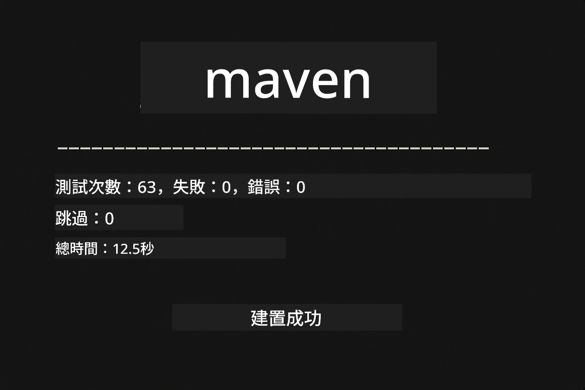
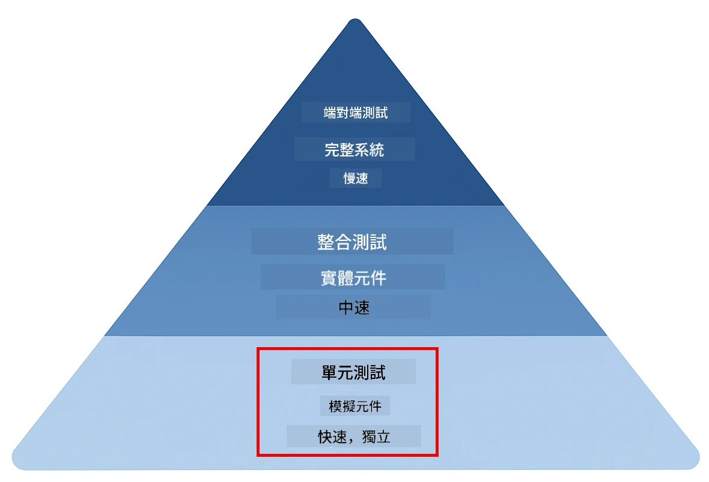
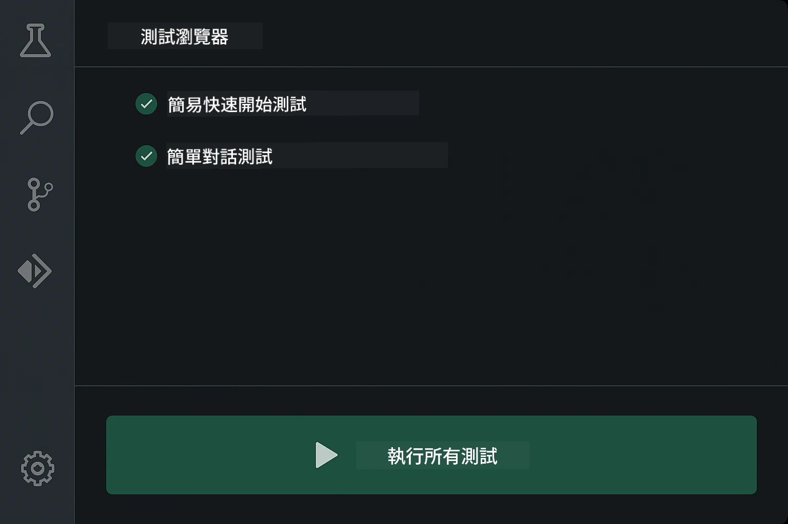
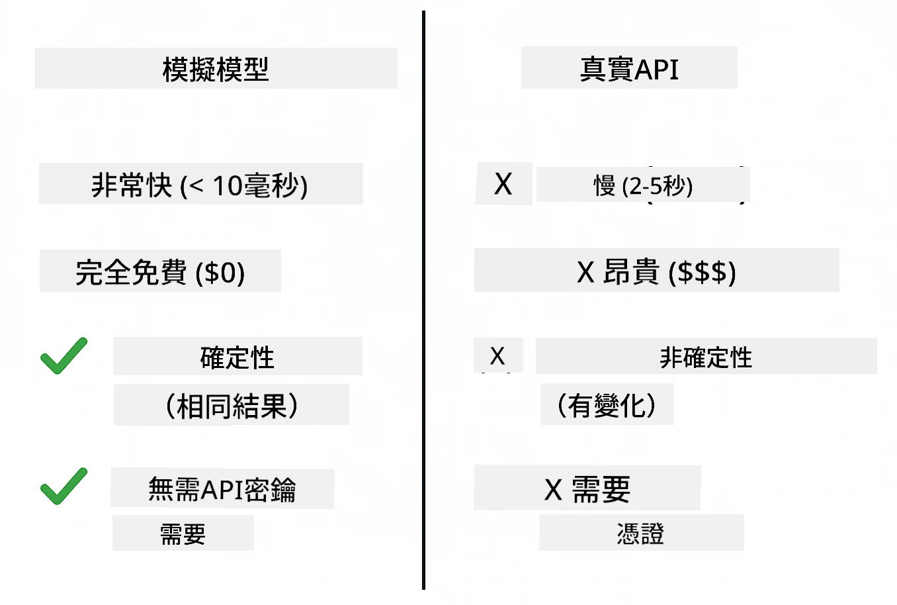
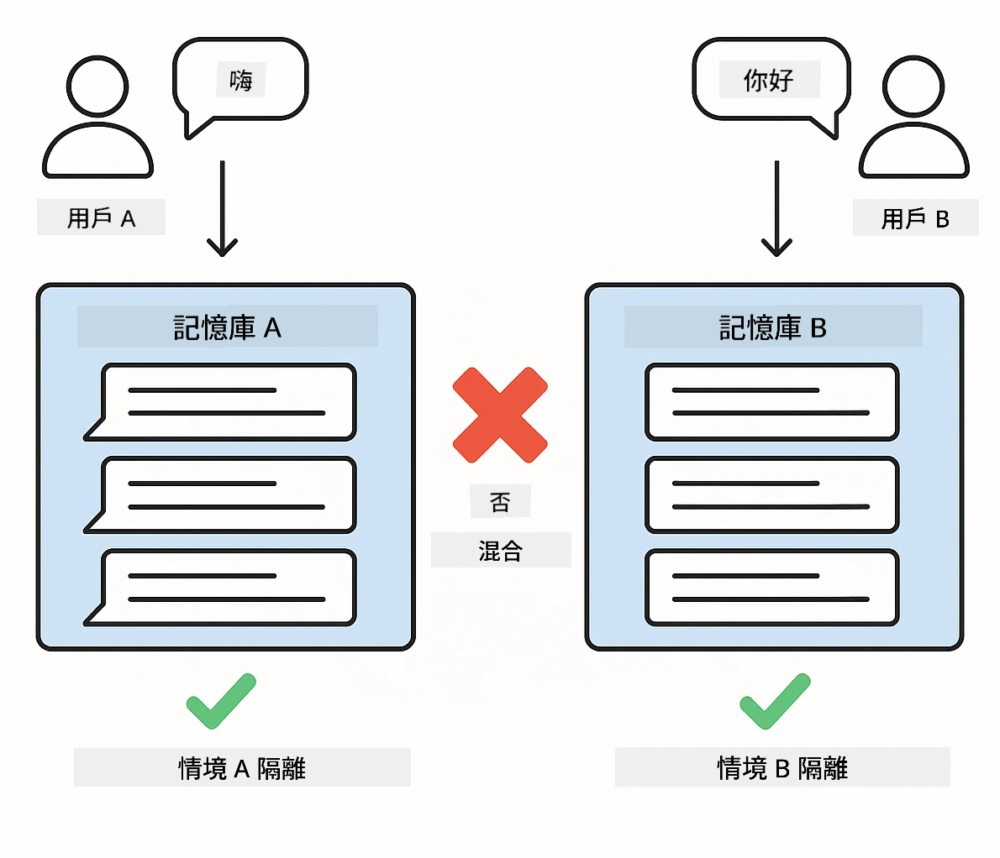
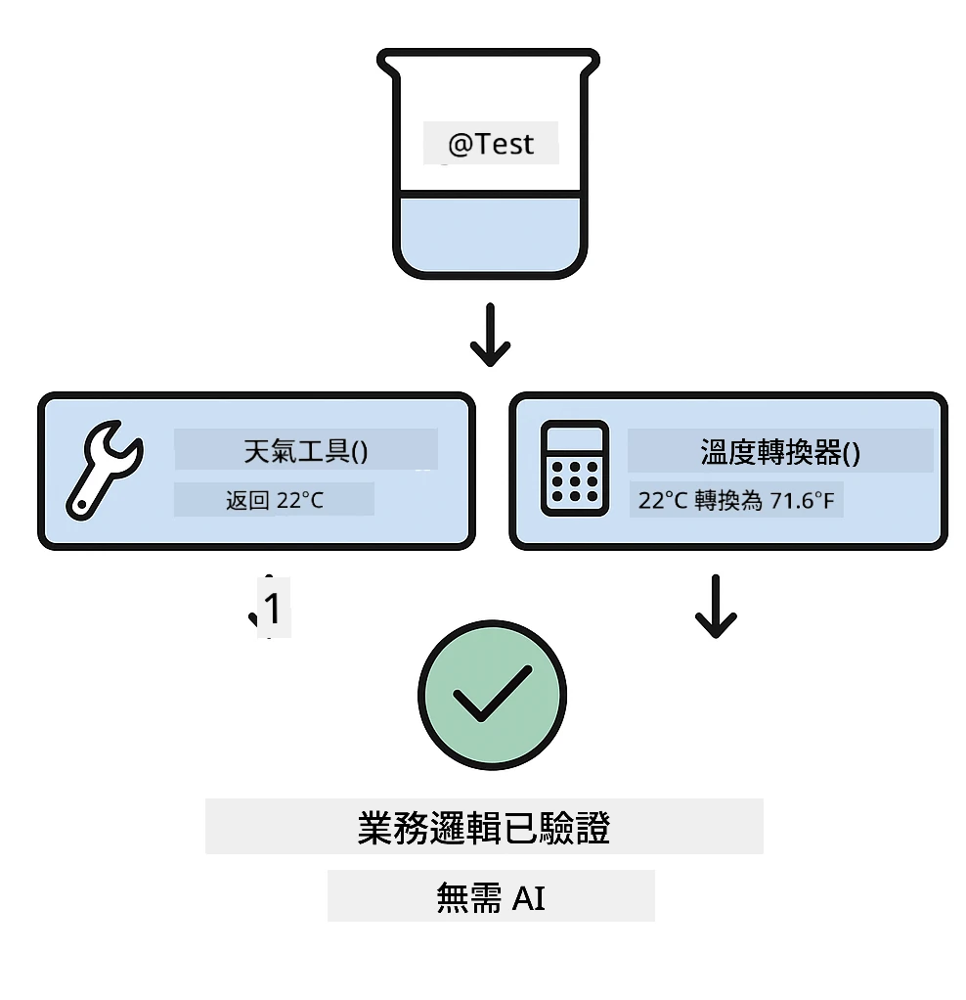
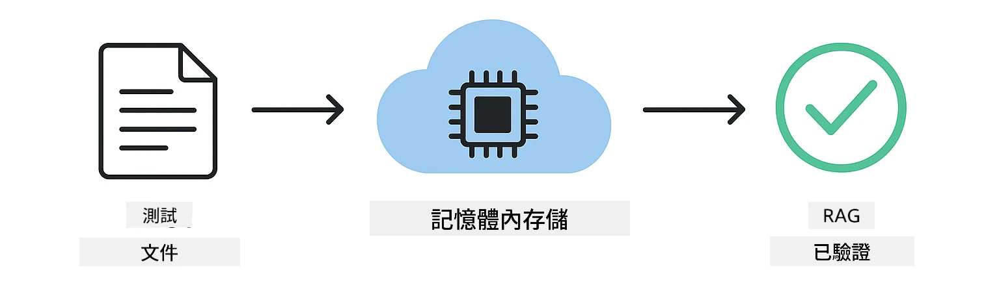

# 測試 LangChain4j 應用程式

## 目錄

- [快速開始](#快速開始)
- [測試涵蓋的範圍](#測試涵蓋的範圍)
- [執行測試](#執行測試)
- [在 VS Code 中執行測試](#在-vs-code-中執行測試)
- [測試範式](#測試範式)
- [測試理念](#測試理念)
- [後續步驟](#後續步驟)

本指南帶你了解示範如何測試 AI 應用程式的測試案例，無需 API 金鑰或外部服務。

## 快速開始

使用單一指令運行所有測試：

**Bash:**
```bash
mvn test
```

**PowerShell:**
```powershell
mvn --% test
```

當所有測試通過時，您會看到類似以下截圖的輸出 — 測試以零失敗運行。



<em>成功執行測試顯示所有測試均通過且無失敗</em>

## 測試涵蓋的範圍

本課程專注於於本地執行的 <strong>單元測試</strong>。每個測試獨立展示 LangChain4j 的特定概念。下圖測試金字塔顯示單元測試的位置 — 它們構成快速且可靠的基礎，其他測試策略均建立在此之上。



*測試金字塔展現單元測試（快速、獨立）、整合測試（實體元件）和端到端測試的平衡。本訓練涵蓋單元測試。*

| 模組 | 測試數量 | 聚焦點 | 主要檔案 |
|--------|-------|-------|-----------|
| **01 - 介紹** | 8 | 會話記憶與有狀態聊天 | `SimpleConversationTest.java` |
| **02 - 提示工程** | 12 | GPT-5.2 範式、急切級別、結構化輸出 | `SimpleGpt5PromptTest.java` |
| **03 - RAG** | 10 | 文件攝取、向量嵌入、相似度搜尋 | `DocumentServiceTest.java` |
| **04 - 工具** | 12 | 函數呼叫及工具串接 | `SimpleToolsTest.java` |
| **05 - MCP** | 8 | 模型上下文協議與標準輸入輸出傳輸 | `SimpleMcpTest.java` |

## 執行測試

**從根目錄運行所有測試：**

**Bash:**
```bash
mvn test
```

**PowerShell:**
```powershell
mvn --% test
```

**運行特定模組的測試：**

**Bash:**
```bash
cd 01-introduction && mvn test
# 或從根目錄開始
mvn test -pl 01-introduction
```

**PowerShell:**
```powershell
cd 01-introduction; mvn --% test
# 或從根目錄
mvn --% test -pl 01-introduction
```

**運行單一測試類別：**

**Bash:**
```bash
mvn test -Dtest=SimpleConversationTest
```

**PowerShell:**
```powershell
mvn --% test -Dtest=SimpleConversationTest
```

**運行特定測試方法：**

**Bash:**
```bash
mvn test -Dtest=SimpleConversationTest#是否應該保持對話歷史
```

**PowerShell:**
```powershell
mvn --% test -Dtest=SimpleConversationTest#應該保持對話歷史
```

## 在 VS Code 中執行測試

如果您使用 Visual Studio Code，測試總管提供圖形介面來執行和除錯測試。



*VS Code 測試總管顯示所有 Java 測試類別及個別測試方法的測試樹*

**在 VS Code 中執行測試：**

1. 點擊活動列中的燒杯圖示開啟測試總管
2. 展開測試樹以查看所有模組和測試類別
3. 點擊任何測試旁的播放按鈕以單獨執行該測試
4. 點擊「執行所有測試」執行整個測試套件
5. 右鍵點擊任一測試並選擇「除錯測試」以設置斷點及逐步執行程式碼

測試總管以綠色勾號顯示通過的測試，且在測試失敗時提供詳細的失敗訊息。

## 測試範式

### 範式 1：測試提示模板

最簡單的範式是測試提示模板，而不呼叫任何 AI 模型。您驗證變數替換正確，且提示格式如預期。


*測試提示模板顯示變數替換流程：模板含佔位符 → 應用值 → 驗證格式化輸出*

```java
@Test
@DisplayName("Should format prompt template with variables")
void testPromptTemplateFormatting() {
    PromptTemplate template = PromptTemplate.from(
        "Best time to visit {{destination}} for {{activity}}?"
    );
    
    Prompt prompt = template.apply(Map.of(
        "destination", "Paris",
        "activity", "sightseeing"
    ));
    
    assertThat(prompt.text()).isEqualTo("Best time to visit Paris for sightseeing?");
}
```

此範式驗證變數替換正確無誤且提示格式符合預期 — 無需 API 金鑰或模型呼叫。

### 範式 2：模擬語言模型

測試會話邏輯時，使用 Mockito 創建假模型回傳預設回應，使測試快速、免費且可預測。



*比較顯示為何偏好使用模擬進行測試：快速、免費、可預測且無需 API 金鑰*

```java
@ExtendWith(MockitoExtension.class)
class SimpleConversationTest {
    
    private ConversationService conversationService;
    
    @Mock
    private OpenAiOfficialChatModel mockChatModel;
    
    @BeforeEach
    void setUp() {
        ChatResponse mockResponse = ChatResponse.builder()
            .aiMessage(AiMessage.from("This is a test response"))
            .build();
        when(mockChatModel.chat(anyList())).thenReturn(mockResponse);
        
        conversationService = new ConversationService(mockChatModel);
    }
    
    @Test
    void shouldMaintainConversationHistory() {
        String conversationId = conversationService.startConversation();
        
        ChatResponse mockResponse1 = ChatResponse.builder()
            .aiMessage(AiMessage.from("Response 1"))
            .build();
        ChatResponse mockResponse2 = ChatResponse.builder()
            .aiMessage(AiMessage.from("Response 2"))
            .build();
        ChatResponse mockResponse3 = ChatResponse.builder()
            .aiMessage(AiMessage.from("Response 3"))
            .build();
        
        when(mockChatModel.chat(anyList()))
            .thenReturn(mockResponse1)
            .thenReturn(mockResponse2)
            .thenReturn(mockResponse3);

        conversationService.chat(conversationId, "First message");
        conversationService.chat(conversationId, "Second message");
        conversationService.chat(conversationId, "Third message");

        List<ChatMessage> history = conversationService.getHistory(conversationId);
        assertThat(history).hasSize(6); // 3 個用戶 + 3 個 AI 訊息
    }
}
```

此範式出現在 `01-introduction/src/test/java/com/example/langchain4j/service/SimpleConversationTest.java`。模擬確保行為一致，從而驗證記憶管理正確運作。

### 範式 3：測試會話隔離

會話記憶須保持多用戶分離。此測試驗證對話不會混淆上下文。



<em>測試會話隔離示意不同用戶使用獨立記憶存儲以避免上下文混合</em>

```java
@Test
void shouldIsolateConversationsByid() {
    String conv1 = conversationService.startConversation();
    String conv2 = conversationService.startConversation();
    
    ChatResponse mockResponse = ChatResponse.builder()
        .aiMessage(AiMessage.from("Response"))
        .build();
    when(mockChatModel.chat(anyList())).thenReturn(mockResponse);

    conversationService.chat(conv1, "Message for conversation 1");
    conversationService.chat(conv2, "Message for conversation 2");

    List<ChatMessage> history1 = conversationService.getHistory(conv1);
    List<ChatMessage> history2 = conversationService.getHistory(conv2);
    
    assertThat(history1).hasSize(2);
    assertThat(history2).hasSize(2);
}
```

每個會話維護自己的獨立歷史記錄。在生產系統中，這種隔離對多用戶應用至關重要。

### 範式 4：獨立測試工具

工具是 AI 可呼叫的函數。直接測試它們以確保功能正確，無論 AI 決策如何。



*獨立測試工具示例，模擬工具執行無需 AI 呼叫，以驗證業務邏輯*

```java
@Test
void shouldConvertCelsiusToFahrenheit() {
    TemperatureTool tempTool = new TemperatureTool();
    String result = tempTool.celsiusToFahrenheit(25.0);
    assertThat(result).containsPattern("77[.,]0°F");
}

@Test
void shouldDemonstrateToolChaining() {
    WeatherTool weatherTool = new WeatherTool();
    TemperatureTool tempTool = new TemperatureTool();

    String weatherResult = weatherTool.getCurrentWeather("Seattle");
    assertThat(weatherResult).containsPattern("\\d+°C");

    String conversionResult = tempTool.celsiusToFahrenheit(22.0);
    assertThat(conversionResult).containsPattern("71[.,]6°F");
}
```

這些測試位於 `04-tools/src/test/java/com/example/langchain4j/agents/tools/SimpleToolsTest.java`，驗證工具邏輯與 AI 無關。串接示例展示一個工具的輸出如何作為另一工具的輸入。

### 範式 5：記憶內 RAG 測試

RAG 系統傳統上依賴向量資料庫及嵌入服務。記憶內範式允許您測試整個流程而無外部依賴。



*記憶內 RAG 測試流程示意文件解析、嵌入存儲及相似度搜尋，無需資料庫*

```java
@Test
void testProcessTextDocument() {
    String content = "This is a test document.\nIt has multiple lines.";
    InputStream inputStream = new ByteArrayInputStream(content.getBytes(StandardCharsets.UTF_8));
    
    DocumentService.ProcessedDocument result = 
        documentService.processDocument(inputStream, "test.txt");

    assertNotNull(result);
    assertTrue(result.segments().size() > 0);
    assertEquals("test.txt", result.segments().get(0).metadata().getString("filename"));
}
```

此測試來自 `03-rag/src/test/java/com/example/langchain4j/rag/service/DocumentServiceTest.java`，在記憶體中建立文件並驗證分塊與元資料處理。

### 範式 6：MCP 整合測試

MCP 模組測試使用 stdio 傳輸的模型上下文協議整合。這些測試驗證應用是否能作為子程序啟動並與 MCP 伺服器通訊。

`05-mcp/src/test/java/com/example/langchain4j/mcp/SimpleMcpTest.java` 中的測試驗證 MCP 用戶端行為。

**執行方式：**

**Bash:**
```bash
cd 05-mcp && mvn test
```

**PowerShell:**
```powershell
cd 05-mcp; mvn --% test
```

## 測試理念

測試您的程式碼，而非 AI。您的測試應驗證程式碼的構建方式，例如提示如何構造、記憶如何管理及工具如何執行。AI 回應多變，不應成為測試斷言的一環。您應檢查提示模板是否正確替換變數，而非 AI 是否給出正確答案。

對於語言模型使用模擬。它們是外部依賴，速度慢、成本高且不可預測。模擬使測試快速（毫秒級而非秒級）、免費（無需 API 成本）且可預測（每次結果相同）。

保持測試獨立。每個測試應自行建立數據，不依賴其他測試，並執行清理。測試結果不應受執行順序影響。

測試邊界條件，超越成功路徑。嘗試空輸入、極大輸入、特殊字符、無效參數及邊緣情況。這些常揭示正常用例下不易發現的錯誤。

使用具描述性的名稱。對比 `shouldMaintainConversationHistoryAcrossMultipleMessages()` 與 `test1()`。前者明確告訴您正在測試什麼，使除錯失敗更輕鬆。

## 後續步驟

既然您已了解測試範式，請深入探索每個模組：

- **[01 - 介紹](../01-introduction/README.md)** - 學習會話記憶管理
- **[02 - 提示工程](../02-prompt-engineering/README.md)** - 精通 GPT-5.2 提示範式
- **[03 - RAG](../03-rag/README.md)** - 建立檢索增強生成系統
- **[04 - 工具](../04-tools/README.md)** - 實作函數呼叫與工具串接
- **[05 - MCP](../05-mcp/README.md)** - 整合模型上下文協議

每個模組的 README 提供本指南中測試概念的詳盡說明。

---

**導覽：** [← 返回主頁](../README.md)

---

<!-- CO-OP TRANSLATOR DISCLAIMER START -->
**免責聲明**：
本文件由 AI 翻譯服務 [Co-op Translator](https://github.com/Azure/co-op-translator) 翻譯而成。雖然我們致力於確保準確性，但請注意，機器自動翻譯可能包含錯誤或不準確之處。原始文件的母語版本應被視為權威來源。對於重要資訊，建議進行專業人工翻譯。我們不對因使用本翻譯而產生的任何誤解或誤釋承擔責任。
<!-- CO-OP TRANSLATOR DISCLAIMER END -->