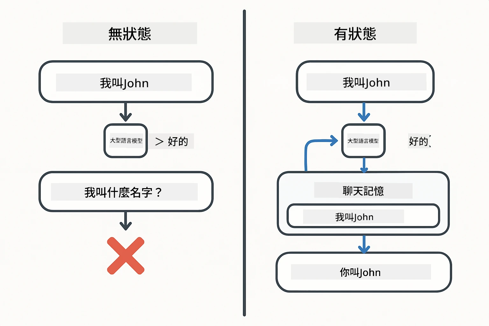
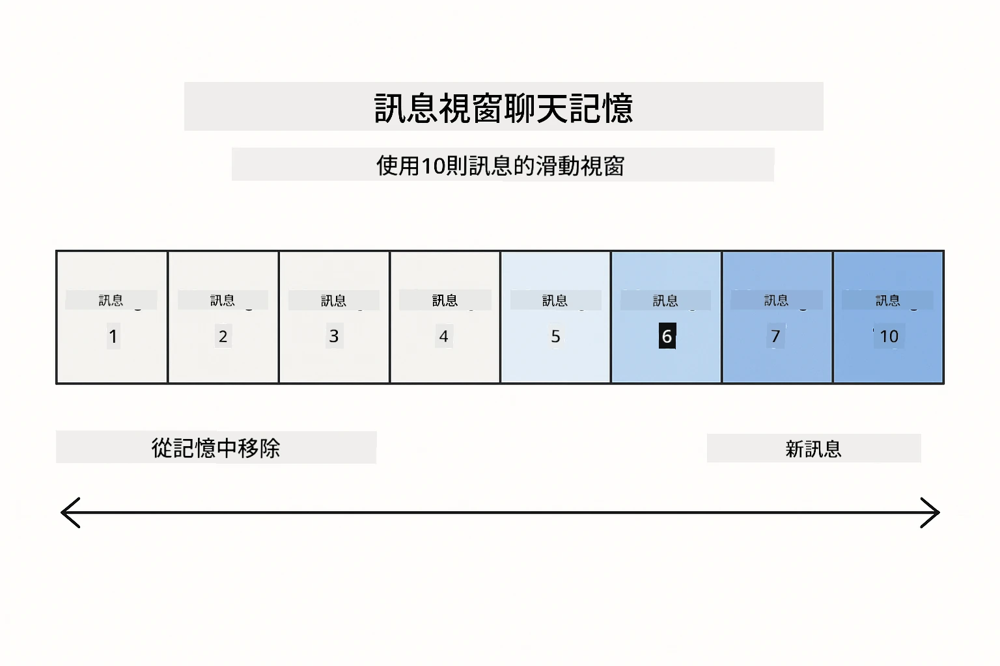
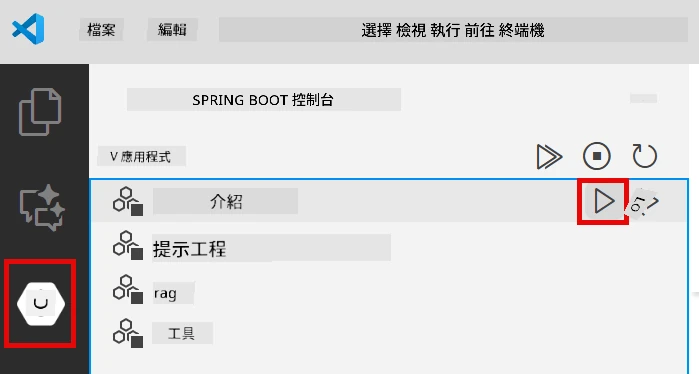
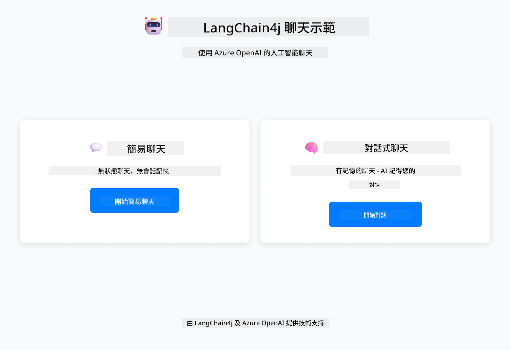
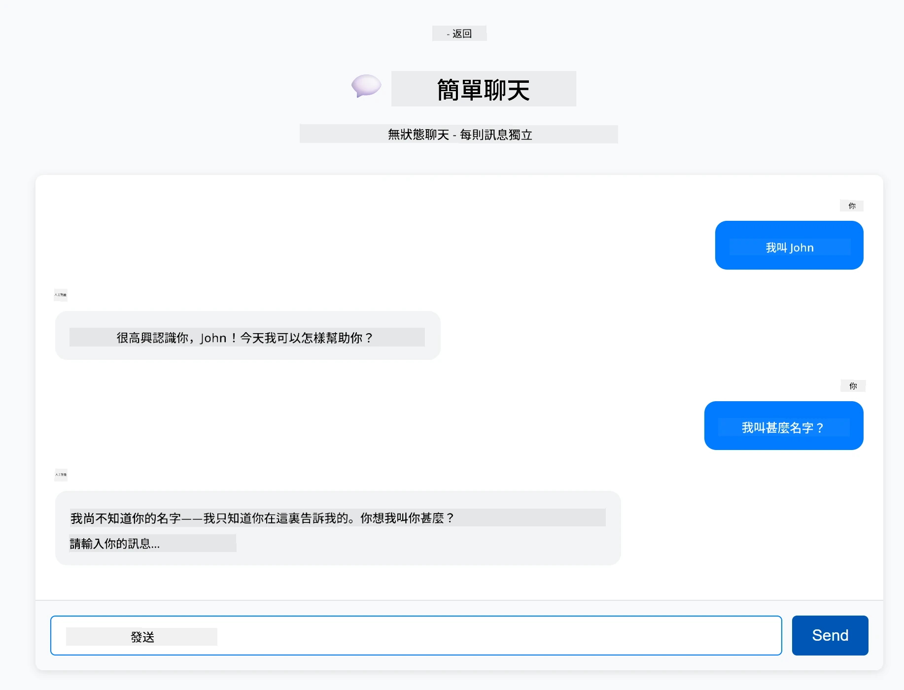
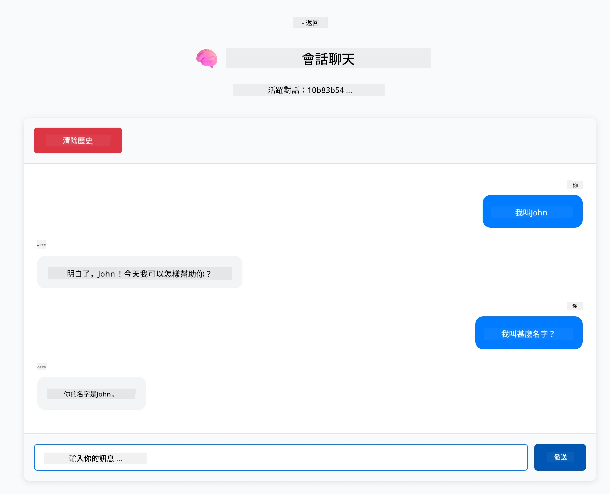

# Module 01: 使用 LangChain4j 入門

## 目錄

- [影片導覽](#影片導覽)
- [您將學習到什麼](#您將學習到什麼)
- [先決條件](#先決條件)
- [了解核心問題](#了解核心問題)
- [了解 Tokens](#了解-tokens)
- [記憶是如何運作的](#記憶是如何運作的)
- [這模組如何使用 LangChain4j](#這模組如何使用-langchain4j)
- [部署 Azure OpenAI 基礎架構](#部署-azure-openai-基礎架構)
- [在本機執行應用程式](#在本機執行應用程式)
- [使用應用程式](#使用應用程式)
  - [無狀態聊天（左側面板）](#無狀態聊天（左側面板）)
  - [有狀態聊天（右側面板）](#有狀態聊天（右側面板）)
- [後續步驟](#後續步驟)

## 影片導覽

觀看這個說明如何開始本模組的現場教學影片：

<a href="https://www.youtube.com/live/nl_troDm8rQ?si=6b85S8xGjWnT2fX9"></a>

## 您將學習到什麼

這是您使用 LangChain4j 和 Azure OpenAI 的起點。我們將從基礎開始，並開始構建具生產風格的應用程式。本模組著重於會記得上下文並維持狀態的對話式 AI——這是後續所有模組的基礎概念。

在整個指南中，我們會使用 Azure OpenAI 的 GPT-5.2，因為其先進的推理能力能讓不同模式的行為更加明顯。當您加入記憶功能時，您會清楚看出差異。這讓您更容易理解每個元件為應用程式帶來的價值。

您將建立一個展示兩種模式的應用程式：

<strong>無狀態聊天</strong> - 每次請求獨立。模型不會記得之前的訊息。這是最簡單的起點。

<strong>有狀態對話</strong> - 每次請求都包含對話歷史。模型能跨多輪保持上下文。這是生產應用程式的必要條件。

## 先決條件

- 具備 Azure 訂閱且可使用 Azure OpenAI
- Java 21、Maven 3.9+
- Azure CLI (https://learn.microsoft.com/en-us/cli/azure/install-azure-cli)
- Azure Developer CLI (azd) (https://learn.microsoft.com/en-us/azure/developer/azure-developer-cli/install-azd)

> **注意：** Java、Maven、Azure CLI 及 Azure Developer CLI (azd) 已預先安裝於提供的 devcontainer 中。

> **注意：** 本模組使用 Azure OpenAI 上的 GPT-5.2。部署會透過 `azd up` 自動設定 — 請勿修改程式碼中模型名稱。

## 了解核心問題

語言模型是無狀態的。每一個 API 呼叫都獨立。如果您先說「我叫 John」然後問「我的名字是什麼？」模型根本不知道您剛剛自我介紹過。它將每個請求視為您第一次對話。

這對簡單問答尚可，但對真實應用毫無用處。客服機器人需要記得您說了什麼。個人助理需要上下文。任何多輪對話都需要記憶。

下圖對比兩種方法 — 左邊是忘記您名字的無狀態呼叫；右邊是以 ChatMemory 支持的有狀態呼叫，它會記得。



*無狀態（獨立呼叫）與有狀態（具上下文感知）對話的差異*

## 了解 Tokens

在深入對話前，理解 tokens 很重要——它是語言模型處理的文字基本單位：


*文字如何被拆成 tokens 的範例——"I love AI!" 變成四個獨立處理單位*

tokens 是 AI 模型衡量和處理文字的單位。詞語、標點，甚至空格都可能是 token。您的模型有最大 token 數限制（GPT-5.2 為 400,000，最多輸入 272,000 個，輸出 128,000 個）。理解 tokens 有助於您管理對話長度及成本。

## 記憶是如何運作的

聊天記憶解決了無狀態問題，它會維護對話歷史。在送出請求到模型之前，框架會先加上相關的前面訊息。當您問「我的名字是什麼？」時，系統其實會送整段對話歷史，讓模型看到您之前說過「我叫 John」。

LangChain4j 提供了自動處理的記憶實作。您只需設定保留幾條訊息，框架會管理上下文視窗。下圖示範 MessageWindowChatMemory 如何維持一個最近訊息的滑動視窗。



*MessageWindowChatMemory 維護最近訊息的滑動視窗，並自動丟棄舊訊息*

## 這模組如何使用 LangChain4j

本模組整合 Spring Boot 並加入對話記憶。這些元件如何配合：

<strong>依賴項</strong> - 新增兩個 LangChain4j 程式庫：

```xml
<dependency>
    <groupId>dev.langchain4j</groupId>
    <artifactId>langchain4j</artifactId> <!-- Inherited from BOM in root pom.xml -->
</dependency>
<dependency>
    <groupId>dev.langchain4j</groupId>
    <artifactId>langchain4j-open-ai-official</artifactId> <!-- Inherited from BOM in root pom.xml -->
</dependency>
```

<strong>聊天模型</strong> - 將 Azure OpenAI 配置為 Spring bean（[LangChainConfig.java](../../../01-introduction/src/main/java/com/example/langchain4j/config/LangChainConfig.java)）：

```java
@Bean
public OpenAiOfficialChatModel openAiOfficialChatModel() {
    return OpenAiOfficialChatModel.builder()
            .baseUrl(azureEndpoint)
            .apiKey(azureApiKey)
            .modelName(deploymentName)
            .timeout(Duration.ofMinutes(5))
            .maxRetries(3)
            .build();
}
```

建構器從 `azd up` 設定的環境變數讀取認證。設定 `baseUrl` 為您的 Azure 端點可讓 OpenAI 用戶端搭配 Azure OpenAI 運作。

<strong>對話記憶</strong> - 使用 MessageWindowChatMemory 追蹤聊天歷史（[ConversationService.java](../../../01-introduction/src/main/java/com/example/langchain4j/service/ConversationService.java)）：

```java
ChatMemory memory = MessageWindowChatMemory.withMaxMessages(10);

memory.add(UserMessage.from("My name is John"));
memory.add(AiMessage.from("Nice to meet you, John!"));

memory.add(UserMessage.from("What's my name?"));
AiMessage aiMessage = chatModel.chat(memory.messages()).aiMessage();
memory.add(aiMessage);
```

用 `withMaxMessages(10)` 建立一個最多保留 10 條訊息的記憶。用類型包裝加入使用者與 AI 訊息：`UserMessage.from(text)` 和 `AiMessage.from(text)`。用 `memory.messages()` 取得歷史並送給模型。該服務會針對每個對話 ID 儲存不同的記憶實例，支援多個使用者同時聊天。

> **🤖 嘗試使用 [GitHub Copilot](https://github.com/features/copilot) 聊天功能：** 開啟 [`ConversationService.java`](../../../01-introduction/src/main/java/com/example/langchain4j/service/ConversationService.java) 並詢問：
> - 「當滑動視窗滿了，MessageWindowChatMemory 如何決定要丟棄哪條訊息？」
> - 「我可以用資料庫實作自訂記憶儲存，取代記憶體嗎？」
> - 「我要如何加入摘要功能來壓縮舊的對話歷史？」

無狀態的聊天端點完全不使用記憶 — 就像快速開始一樣用 `chatModel.chat(prompt)`。有狀態端點則先加入訊息，取出歷史，並將上下文包含在每次請求中。相同模型設定，不同使用模式。

## 部署 Azure OpenAI 基礎架構

**Bash:**
```bash
cd 01-introduction
azd up  # 選擇訂閱和位置（建議使用 eastus2）
```

**PowerShell:**
```powershell
cd 01-introduction
azd up  # 選擇訂閱和地點（建議使用 eastus2）
```

> **注意：** 若遇到逾時錯誤（`RequestConflict: Cannot modify resource ... provisioning state is not terminal`），請重新執行 `azd up`。背景中的 Azure 資源可能仍在佈署中，多嘗試幾次可讓佈署完成。

此操作會：
1. 部署 Azure OpenAI 資源及 GPT-5.2 和 text-embedding-3-small 模型
2. 自動在專案根目錄產生帶有認證的 `.env` 檔案
3. 設定所有所需的環境變數

**部署遇到問題？** 請參考 [Infrastructure README](infra/README.md) 獲取詳盡疑難排解，包括子網域名稱衝突、手動 Azure Portal 部署步驟，以及模型配置說明。

**確認部署成功：**

**Bash:**
```bash
cat ../.env  # 應該顯示 AZURE_OPENAI_ENDPOINT、API_KEY 等。
```

**PowerShell:**
```powershell
Get-Content ..\.env  # 應該顯示 AZURE_OPENAI_ENDPOINT、API_KEY 等。
```

> **注意：** `azd up` 指令會自動產生 `.env` 檔。若日後需更新，可以手動編輯 `.env` 或重新產生：
>
> **Bash:**
> ```bash
> cd ..
> bash .azd-env.sh
> ```
>
> **PowerShell:**
> ```powershell
> cd ..
> .\.azd-env.ps1
> ```

## 在本機執行應用程式

**確認部署：**

確保根目錄存在帶 Azure 認證的 `.env` 檔。於模組目錄 (`01-introduction/`) 執行：

**Bash:**
```bash
cat ../.env  # 應該顯示 AZURE_OPENAI_ENDPOINT、API_KEY、DEPLOYMENT
```

**PowerShell:**
```powershell
Get-Content ..\.env  # 應該顯示 AZURE_OPENAI_ENDPOINT、API_KEY、DEPLOYMENT
```

**啟動應用程式：**

**選項 1：使用 Spring Boot Dashboard（VS Code 使用者推薦）**

dev container 包含 Spring Boot Dashboard 擴充套件，提供視覺化介面來管理所有 Spring Boot 應用。您可在 VS Code 左側活動欄找到（尋找 Spring Boot 圖示）。

從 Spring Boot Dashboard 可以：
- 查看工作區中所有可用 Spring Boot 應用
- 一鍵啟動/停止應用
- 即時檢視應用日誌
- 監控應用狀態

只需點擊「introduction」旁的播放按鈕即可啟動本模組，或一次啟動所有模組。



*VS Code 中的 Spring Boot Dashboard — 從一處啟動、停止與監控所有模組*

**選項 2：使用 shell 腳本**

啟動所有 Web 應用（模組 01-04）：

**Bash:**
```bash
cd ..  # 從根目錄
./start-all.sh
```

**PowerShell:**
```powershell
cd ..  # 從根目錄
.\start-all.ps1
```

或只啟動本模組：

**Bash:**
```bash
cd 01-introduction
./start.sh
```

**PowerShell:**
```powershell
cd 01-introduction
.\start.ps1
```

兩個腳本會自動從根目錄 `.env` 檔載入環境變數，且若 JAR 不存在會自行編譯。

> **注意：** 若您偏好先手動建置所有模組後再啟動：
>
> **Bash:**
> ```bash
> cd ..  # Go to root directory
> mvn clean package -DskipTests
> ```
>
> **PowerShell:**
> ```powershell
> cd ..  # Go to root directory
> mvn clean package -DskipTests
> ```

於瀏覽器開啟 http://localhost:8080。

**停止應用：**

**Bash:**
```bash
./stop.sh  # 只限於此模組
# 或
cd .. && ./stop-all.sh  # 所有模組
```

**PowerShell:**
```powershell
.\stop.ps1  # 只有此模塊
# 或者
cd ..; .\stop-all.ps1  # 所有模塊
```

## 使用應用程式

應用提供一個包含兩種聊天實作的網頁介面，並排顯示。



*儀表板顯示簡單聊天（無狀態）及對話式聊天（有狀態）選項*

### 無狀態聊天（左側面板）

先嘗試這個。先說「我叫 John」，然後立即問「我的名字是什麼？」模型不會記得，因為每條訊息皆獨立。這示範了基本語言模型整合的核心問題 — 沒有對話上下文。



*AI 不會記得您前一條訊息說的名字*

### 有狀態聊天（右側面板）

現在在這邊嘗試同樣的順序。先說「我叫 John」，再問「我的名字是什麼？」這次會記得。差異在 MessageWindowChatMemory—它維持對話歷史並且將其包含在每次請求中。這正是生產對話式 AI 的運作方式。



*AI 會記得早前對話中您說的名字*

兩個面板均使用相同 GPT-5.2 模型。唯一差別是記憶。這明確顯示記憶為您的應用帶來什麼，及為何它對真實案例不可或缺。

## 後續步驟

**下一模組：** [02-prompt-engineering - 使用 GPT-5.2 的 Prompt 工程](../02-prompt-engineering/README.md)

---

**導覽：** [← 回主頁](../README.md) | [下一步：Module 02 - Prompt Engineering →](../02-prompt-engineering/README.md)

---

<!-- CO-OP TRANSLATOR DISCLAIMER START -->
**免責聲明**：
本文件使用 AI 翻譯服務 [Co-op Translator](https://github.com/Azure/co-op-translator) 進行翻譯。雖然我們力求準確，但請注意，自動翻譯可能包含錯誤或不準確之處。原始文件的母語版本應被視為權威來源。對於重要資訊，建議尋求專業人工翻譯。我們不對因使用本翻譯而引起的任何誤解或曲解承擔責任。
<!-- CO-OP TRANSLATOR DISCLAIMER END -->