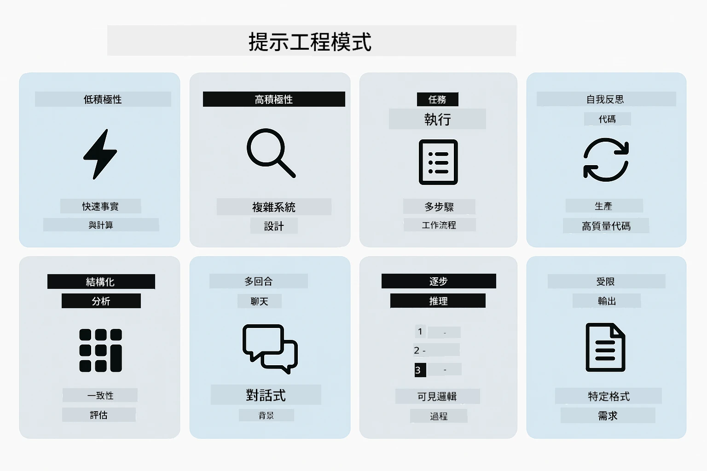
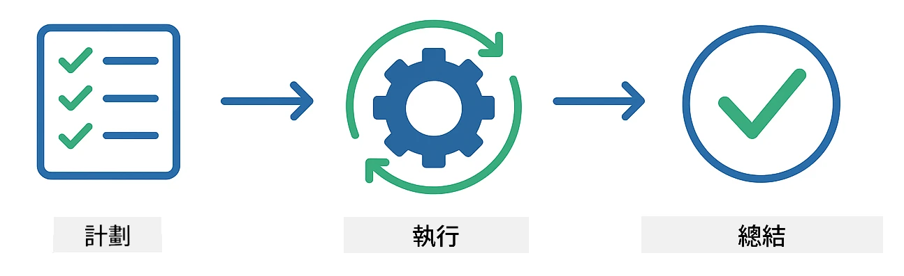
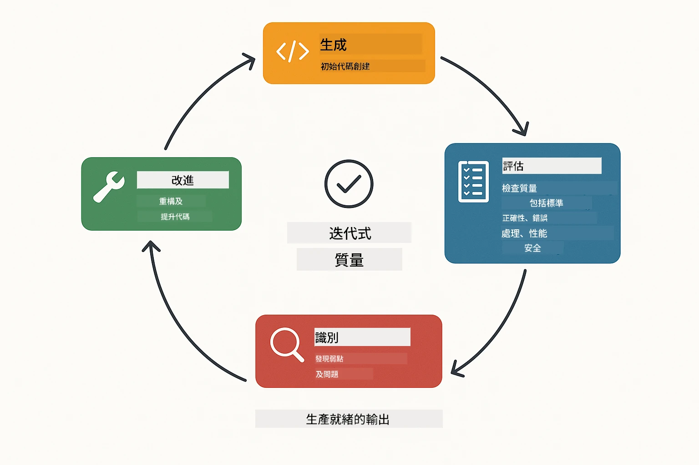
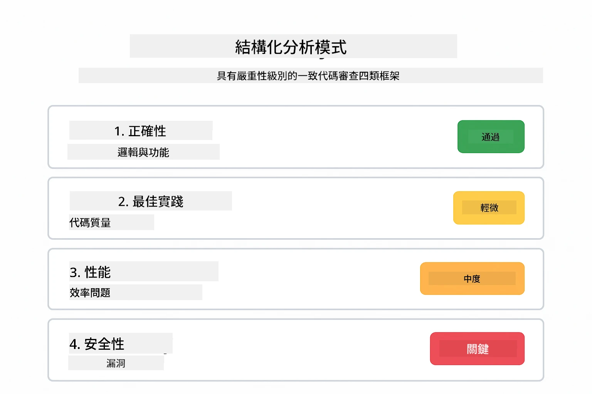
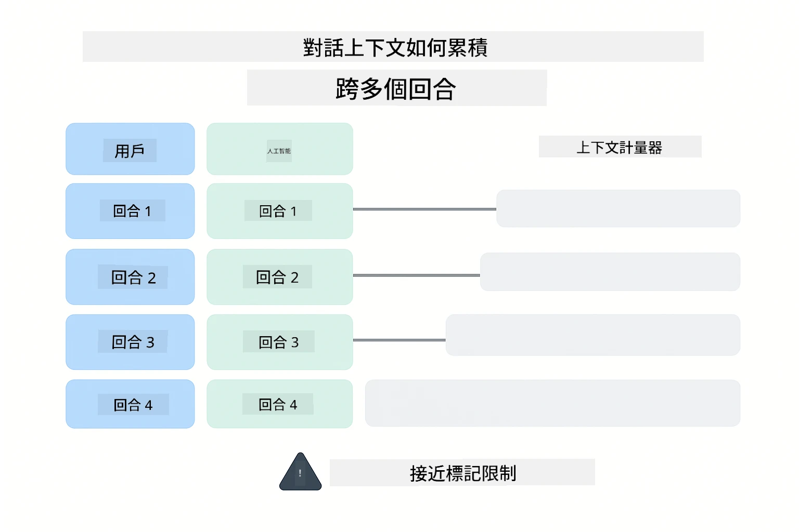
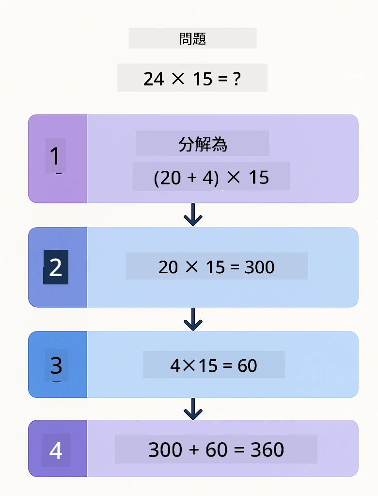
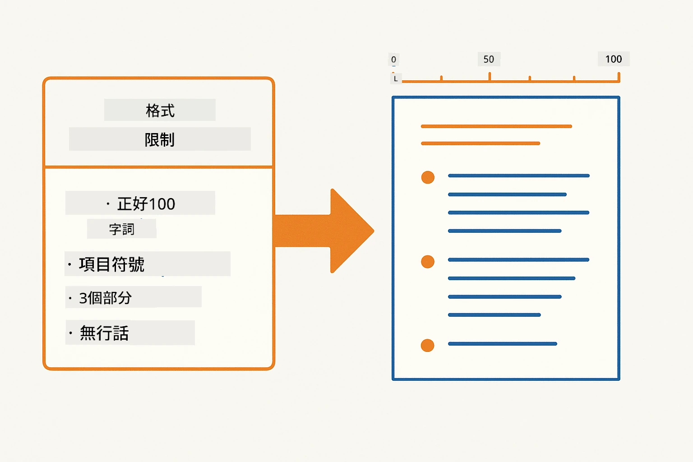
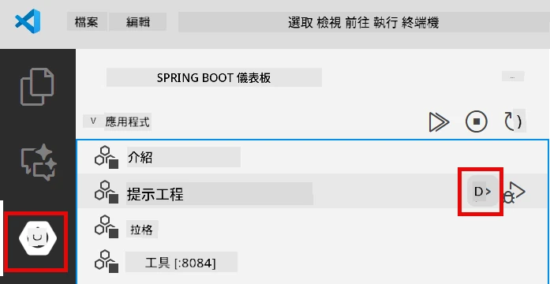
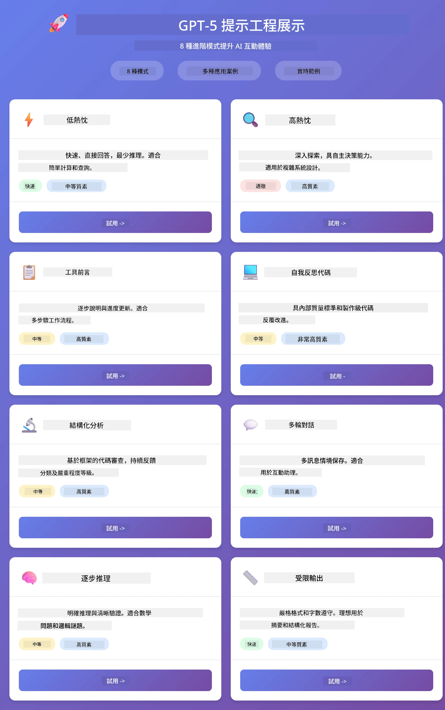
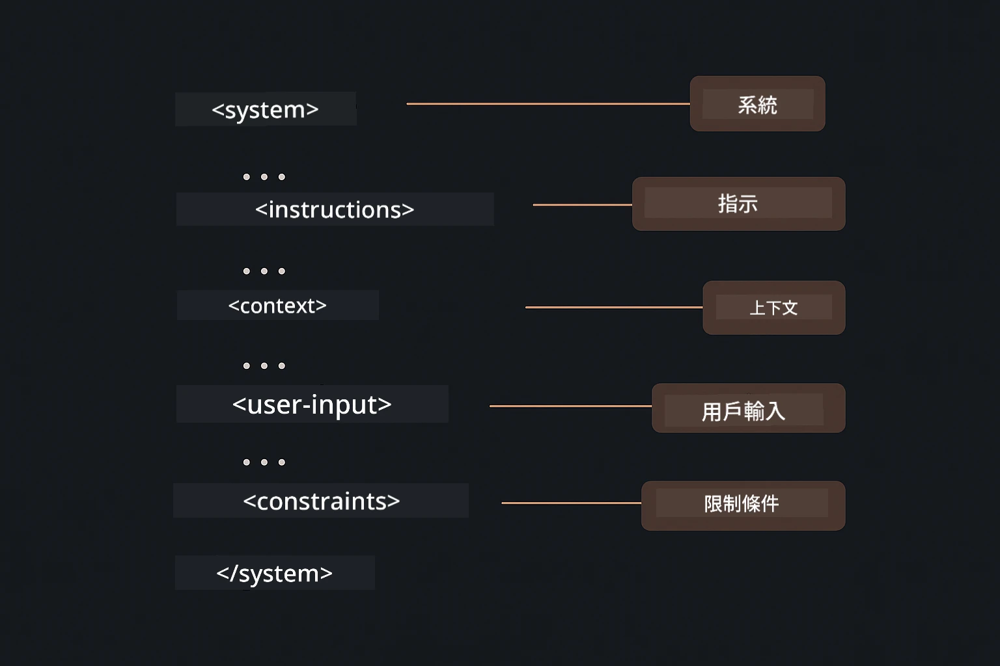

# Module 02: 使用 GPT-5.2 的提示工程

## 目錄

- [影片導覽](#影片導覽)
- [你將學習什麼](#你將學習什麼)
- [先決條件](#先決條件)
- [了解提示工程](#了解提示工程)
- [提示工程基礎](#提示工程基礎)
  - [零次提示](#零次提示)
  - [少次提示](#少次提示)
  - [思路鏈](#思路鏈)
  - [基於角色的提示](#基於角色的提示)
  - [提示模板](#提示模板)
- [進階模式](#進階模式)
- [執行應用程式](#運行應用程式)
- [應用程式截圖](#應用程式截圖)
- [探索模式](#探索模式)
  - [低慾望與高慾望](#低-vs-高積極性)
  - [任務執行（工具前置語）](#任務執行（工具前言）)
  - [自我反思程式碼](#自我反思代碼)
  - [結構化分析](#結構化分析)
  - [多輪對話](#多輪聊天)
  - [逐步推理](#逐步推理)
  - [受限輸出](#受限輸出)
- [你真正學到的是什麼](#你真正學到的是)
- [下一步](#後續步驟)

## 影片導覽

觀看本次直播說明，了解如何開始本模組：

<a href="https://www.youtube.com/live/PJ6aBaE6bog?si=LDshyBrTRodP-wke"></a>

## 你將學習什麼

下圖提供本模組中你將學到的關鍵主題與技能概覽——從提示優化技巧到你將遵循的逐步工作流程。


在上一模組中，你了解了記憶如何透過 Azure OpenAI 啟動會話式 AI。現在，我們將專注於如何提出問題——也就是提示本身——使用 Azure OpenAI 的 GPT-5.2。你組織提示的方式會大幅影響你收到回應的品質。我們先回顧基本的提示技術，然後進入八種充分發揮 GPT-5.2 功能的進階模式。

我們會使用 GPT-5.2，因為它引入了推理控制功能——你可以告訴模型回答前要思考多少。這讓不同的提示策略更為明顯，也幫助你理解何時該使用哪種方式。

## 先決條件

- 完成模組 01（部署了 Azure OpenAI 資源）
- 根目錄中有包含 Azure 憑證的 `.env` 文件（由模組 01 中的 `azd up` 建立）

> **注意：** 如果你尚未完成模組 01，請先遵循那裡的部署說明。

## 了解提示工程

提示工程的核心是在於介於模糊指令與精確指令之間的差異，如下圖所示。


提示工程是設計輸入文字，使你能穩定獲得所需結果。它不只是問問題——而是結構化請求，使模型完全理解你想要什麼以及如何交付。

想像你在給同事指示。「修正錯誤」是模糊的。「在 UserService.java 第 45 行透過新增空指標檢查修正空指標異常」則具體明確。語言模型也是一樣——具體和結構化很重要。

下圖展示 LangChain4j 在此的角色——透過 SystemMessage 和 UserMessage 建立積木將你的提示模式連接到模型。


LangChain4j 提供基礎設施——模型連接、記憶與訊息類型——而提示模式只不過是經過精心結構的文字，透過該基礎設施傳送。重要積木是 `SystemMessage`（設定 AI 行為與角色）與 `UserMessage`（承載你的實際請求）。

## 提示工程基礎

下方展示的五種核心技巧構成有效提示工程的基礎。每種技巧皆針對你與語言模型溝通的不同面向。


在探討本模組的進階模式之前，先回顧五種基礎提示技術。這是每個提示工程師應具備的基本技能。

### 零次提示

最簡單的方式：給模型直接指示，不帶範例。模型完全依賴訓練去理解並執行任務。適合明確的直接需求。


*無範例直接指示——模型根據指示推斷任務*

```java
String prompt = "Classify this sentiment: 'I absolutely loved the movie!'";
String response = model.chat(prompt);
// 回應:「正面」
```

**適用時機：** 簡單分類、直接問題、翻譯，或任何不需額外指導的任務。

### 少次提示

提供範例示範你希望模型遵循的模式。模型從範例學習預期輸入輸出格式，並應用於新輸入。大幅提升格式或行為不明顯任務的一致性。


*從範例學習——模型識別模式並應用於新輸入*

```java
String prompt = """
    Classify the sentiment as positive, negative, or neutral.
    
    Examples:
    Text: "This product exceeded my expectations!" → Positive
    Text: "It's okay, nothing special." → Neutral
    Text: "Waste of money, very disappointed." → Negative
    
    Now classify this:
    Text: "Best purchase I've made all year!"
    """;
String response = model.chat(prompt);
```

**適用時機：** 自訂分類、一致性格式、專業領域任務，或零次提示結果不穩定時。

### 思路鏈

要求模型逐步展開推理。模型不急著給答案，而是分解問題逐步說明。提升數學、邏輯及多步推理任務的準確度。


*逐步推理——將複雜問題拆解為明確邏輯步驟*

```java
String prompt = """
    Problem: A store has 15 apples. They sell 8 apples and then 
    receive a shipment of 12 more apples. How many apples do they have now?
    
    Let's solve this step-by-step:
    """;
String response = model.chat(prompt);
// 模型顯示：15 - 8 = 7，然後 7 + 12 = 19 個蘋果
```

**適用時機：** 數學題、邏輯謎題、除錯，或任何需要展現推理過程以提升準確度與信賴度的任務。

### 基於角色的提示

在提問前設定 AI 的身份或角色。提供上下文以影響回答的語氣、深度與焦點。「軟件架構師」給出建議與「初級開發者」或「安全審核員」不同。


*設定上下文與角色——同一問題依指定角色將獲得不同回答*

```java
String prompt = """
    You are an experienced software architect reviewing code.
    Provide a brief code review for this function:
    
    def calculate_total(items):
        total = 0
        for item in items:
            total = total + item['price']
        return total
    """;
String response = model.chat(prompt);
```

**適用時機：** 程式碼審查、教學、專業分析，或需要根據專業程度或角度調整回應。

### 提示模板

創建可重用的提示，使用變數佔位符。不必每次手寫提示，定義一次模板，填入不同值。LangChain4j 的 `PromptTemplate` 類別用 `{{variable}}` 語法讓此事變簡單。


*含變數佔位符的可重複使用提示——一套模板，多重用途*

```java
PromptTemplate template = PromptTemplate.from(
    "What's the best time to visit {{destination}} for {{activity}}?"
);

Prompt prompt = template.apply(Map.of(
    "destination", "Paris",
    "activity", "sightseeing"
));

String response = model.chat(prompt.text());
```

**適用時機：** 多次查詢不同輸入、批次處理、建構可重用 AI 工作流程，或任何提示結構相同但資料不同的情況。

---

這五種基礎技巧為你提供大多數提示任務的扎實工具組。接著本模組將結合 GPT-5.2 的推理控制、自我評估與結構化輸出能力，介紹<strong>八種進階模式</strong>。

## 進階模式

在基礎建立後，我們來看看本模組獨特的八種進階模式。不是所有問題都需要相同方法。有些問題需要快速回應，有些則需深入思考。有些需顯示推理，有些只要結果。以下各模式針對不同場景優化——GPT-5.2 的推理控制讓差異更鮮明。



<em>八種提示工程模式及其應用場景概覽</em>

GPT-5.2 對這些模式還增添一個維度：<em>推理控制</em>。下方滑桿展示如何調整模型的思考努力——從快速直接回答到深度徹底分析。


*GPT-5.2 的推理控制讓你指定模型應思考多少——從快速直接到深入探索*

**低慾望（快速且專注）** - 用於簡單問題，想要快速直接回應。模型推理極少——最多兩步。適用計算、查詢或直白問題。

```java
String prompt = """
    <context_gathering>
    - Search depth: very low
    - Bias strongly towards providing a correct answer as quickly as possible
    - Usually, this means an absolute maximum of 2 reasoning steps
    - If you think you need more time, state what you know and what's uncertain
    </context_gathering>
    
    Problem: What is 15% of 200?
    
    Provide your answer:
    """;

String response = chatModel.chat(prompt);
```

> 💡 **使用 GitHub Copilot 探索：** 開啟 [`Gpt5PromptService.java`](../../../02-prompt-engineering/src/main/java/com/example/langchain4j/prompts/service/Gpt5PromptService.java)，詢問：
> - 「低慾望和高慾望提示模式有何異同？」
> - 「提示中的 XML 標籤如何幫助結構化 AI 回答？」
> - 「何時該使用自我反思模式或直接指令？」

**高慾望（深入且徹底）** - 用於複雜問題，需全面分析。模型全面探索，展示詳盡推理。適用系統設計、架構決策或複雜研究。

```java
String prompt = """
    Analyze this problem thoroughly and provide a comprehensive solution.
    Consider multiple approaches, trade-offs, and important details.
    Show your analysis and reasoning in your response.
    
    Problem: Design a caching strategy for a high-traffic REST API.
    """;

String response = chatModel.chat(prompt);
```

**任務執行（逐步進展）** - 用於多步工作流程。模型預先規劃，執行時逐步敘述，最後總結。適合遷移、執行、或任何多步流程。

```java
String prompt = """
    <task_execution>
    1. First, briefly restate the user's goal in a friendly way
    
    2. Create a step-by-step plan:
       - List all steps needed
       - Identify potential challenges
       - Outline success criteria
    
    3. Execute each step:
       - Narrate what you're doing
       - Show progress clearly
       - Handle any issues that arise
    
    4. Summarize:
       - What was completed
       - Any important notes
       - Next steps if applicable
    </task_execution>
    
    <tool_preambles>
    - Always begin by rephrasing the user's goal clearly
    - Outline your plan before executing
    - Narrate each step as you go
    - Finish with a distinct summary
    </tool_preambles>
    
    Task: Create a REST endpoint for user registration
    
    Begin execution:
    """;

String response = chatModel.chat(prompt);
```

思路鏈提示明確要求模型展示推理過程，提升複雜任務準確率。逐步拆解幫助人類與 AI 理解邏輯。

> **🤖 用 [GitHub Copilot](https://github.com/features/copilot) 聊天嘗試：** 詢問此模式：
> - 「如何調整任務執行模式以處理長時間運行操作？」
> - 「生產應用中，結構化工具前置語的最佳實踐是什麼？」
> - 「如何在 UI 中捕捉並顯示中間進度更新？」

下圖說明此計劃 → 執行 → 總結流程。



*計劃 → 執行 → 總結的多步任務工作流程*

<strong>自我反思程式碼</strong> - 生成符合生產標準的程式碼。模型產出有錯誤處理的優質代碼。適合建構新功能或服務時使用。

```java
String prompt = """
    Generate Java code with production-quality standards: Create an email validation service
    Keep it simple and include basic error handling.
    """;

String response = chatModel.chat(prompt);
```

下圖展示此迭代改進循環——生成、評估、找出弱點，再改進，直到符合生產標準。



*迭代改進循環 - 產生、評估、找問題、改進、重複*

<strong>結構化分析</strong> - 用於一致性評價。模型使用固定架構檢視程式碼（正確性、實踐、效能、安全性、可維護性）。適合程式碼審查或品質評估。

```java
String prompt = """
    <analysis_framework>
    You are an expert code reviewer. Analyze the code for:
    
    1. Correctness
       - Does it work as intended?
       - Are there logical errors?
    
    2. Best Practices
       - Follows language conventions?
       - Appropriate design patterns?
    
    3. Performance
       - Any inefficiencies?
       - Scalability concerns?
    
    4. Security
       - Potential vulnerabilities?
       - Input validation?
    
    5. Maintainability
       - Code clarity?
       - Documentation?
    
    <output_format>
    Provide your analysis in this structure:
    - Summary: One-sentence overall assessment
    - Strengths: 2-3 positive points
    - Issues: List any problems found with severity (High/Medium/Low)
    - Recommendations: Specific improvements
    </output_format>
    </analysis_framework>
    
    Code to analyze:
    ```
    public List getUsers() {
        return database.query("SELECT * FROM users");
    }
    ```
    Provide your structured analysis:
    """;

String response = chatModel.chat(prompt);
```

> **🤖 用 [GitHub Copilot](https://github.com/features/copilot) 聊天嘗試：** 詢問結構化分析：
> - 「如何為不同程式碼審查自訂分析架構？」
> - 「如何最有效程式化解析並採用結構化輸出？」
> - 「如何確保不同審查會話中嚴重性級別一致？」

下圖展示此結構化架構如何組織程式碼審查為一致分類及嚴重度等級。



<em>用於一致程式碼審查的帶嚴重度等級的框架</em>

<strong>多輪對話</strong> - 用於需要上下文的對話。模型記住先前訊息並基於它們回應。適合互動式協助會話或複雜 QA。

```java
ChatMemory memory = MessageWindowChatMemory.withMaxMessages(10);

memory.add(UserMessage.from("What is Spring Boot?"));
AiMessage aiMessage1 = chatModel.chat(memory.messages()).aiMessage();
memory.add(aiMessage1);

memory.add(UserMessage.from("Show me an example"));
AiMessage aiMessage2 = chatModel.chat(memory.messages()).aiMessage();
memory.add(aiMessage2);
```

下圖視覺化對話上下文如何隨多輪累積，以及其與模型 token 限制的關係。



*多輪對話中對話上下文如何累積直到到達 token 限制*

<strong>逐步推理</strong> - 適用需顯示具體邏輯的問題。模型對每一步驟顯示明確推理。用於數學題、邏輯謎題，或需要理解思考過程時。

```java
String prompt = """
    <instruction>Show your reasoning step-by-step</instruction>
    
    If a train travels 120 km in 2 hours, then stops for 30 minutes,
    then travels another 90 km in 1.5 hours, what is the average speed
    for the entire journey including the stop?
    """;

String response = chatModel.chat(prompt);
```

下圖說明模型如何將問題拆解為明確編號的邏輯步驟。



<em>將問題拆解為明確的邏輯步驟</em>

<strong>受限輸出</strong> - 用於需要特定格式要求的回應。模型嚴格遵守格式和長度規則。用於摘要或需要精確輸出結構時。

```java
String prompt = """
    <constraints>
    - Exactly 100 words
    - Bullet point format
    - Technical terms only
    </constraints>
    
    Summarize the key concepts of machine learning.
    """;

String response = chatModel.chat(prompt);
```

下圖顯示約束如何引導模型產生嚴格遵守您格式和長度要求的輸出。



*強制執行特定格式、長度和結構要求*

## 運行應用程式

**驗證部署：**

確保根目錄存在 `.env` 文件，裡面有 Azure 資料（在模塊 01 中建立）。從模塊目錄 (`02-prompt-engineering/`) 運行：

**Bash:**
```bash
cat ../.env  # 應該顯示 AZURE_OPENAI_ENDPOINT、API_KEY、DEPLOYMENT
```

**PowerShell:**
```powershell
Get-Content ..\.env  # 應該顯示 AZURE_OPENAI_ENDPOINT、API_KEY、DEPLOYMENT
```

**啟動應用程式：**

> **注意：** 如果您已經使用根目錄的 `./start-all.sh` 啟動所有應用程式（如模塊 01 所述），本模塊已在 8083 埠運行。您可以跳過下面的啟動指令，直接訪問 http://localhost:8083。

**選項 1：使用 Spring Boot 控制面板（建議 VS Code 用戶）**

開發容器包含 Spring Boot 控制面板擴展，可視覺化管理所有 Spring Boot 應用程式。您可以在 VS Code 左側的活動欄找到（尋找 Spring Boot 圖示）。

透過 Spring Boot 控制面板，您可以：
- 查看工作區中所有可用的 Spring Boot 應用程式
- 一鍵啟動/停止應用程式
- 即時檢視應用程式日誌
- 監控應用程式狀態

只需點擊 "prompt-engineering" 旁的播放按鈕就能啟動本模塊，或一次啟動所有模塊。



*VS Code 中的 Spring Boot 控制面板 — 從一處啟動、停止並監控所有模塊*

**選項 2：使用 Shell 腳本**

啟動所有 Web 應用程式（模塊 01-04）：

**Bash:**
```bash
cd ..  # 從根目錄
./start-all.sh
```

**PowerShell:**
```powershell
cd ..  # 從根目錄
.\start-all.ps1
```

或只啟動本模塊：

**Bash:**
```bash
cd 02-prompt-engineering
./start.sh
```

**PowerShell:**
```powershell
cd 02-prompt-engineering
.\start.ps1
```

兩個腳本會自動從根目錄 `.env` 文件載入環境變數，並在 JAR 不存在時編譯。

> **注意：** 若您希望在啟動前手動編譯所有模塊：
>
> **Bash:**
> ```bash
> cd ..  # Go to root directory
> mvn clean package -DskipTests
> ```
>
> **PowerShell:**
> ```powershell
> cd ..  # Go to root directory
> mvn clean package -DskipTests
> ```

在瀏覽器中開啟 http://localhost:8083。

**停止應用程式：**

**Bash:**
```bash
./stop.sh  # 僅此模組
# 或者
cd .. && ./stop-all.sh  # 所有模組
```

**PowerShell:**
```powershell
.\stop.ps1  # 只有此模組
# 或者
cd ..; .\stop-all.ps1  # 所有模組
```

## 應用程式截圖

這是提示工程模塊的主界面，您可以在此同時試驗所有八種模式。



*主控制面板顯示所有 8 種提示工程模式及其特性和使用場景*

## 探索模式

Web 介面讓您試驗不同的提示策略。每種模式解決不同問題，嘗試看看每種方法在何時特別有效。

> **注意：串流與非串流** — 每個模式頁面提供兩個按鈕：**🔴 串流回應（實時）** 和 <strong>非串流</strong> 選項。串流使用伺服器發送事件 (SSE)，在模型生成令牌時即時顯示，您可即時看到進展。非串流選項則會等整個回應完成後才顯示。對於需要深度推理的提示（如高積極性、自我反思代碼），非串流可能等很久，有時需數分鐘且無任何可見回饋。**在試驗複雜提示時請使用串流，這樣您可看到模型運作，避免誤以為請求逾時。**
>
> **注意：瀏覽器需求** — 串流功能使用 Fetch Streams API（`response.body.getReader()`），需要完整瀏覽器（Chrome、Edge、Firefox、Safari）。VS Code 內建簡易瀏覽器不支援 ReadableStream API，因此不適用。若使用簡易瀏覽器，非串流按鈕仍正常工作，僅串流按鈕受影響。請使用外部瀏覽器開啟 `http://localhost:8083` 以獲得完整體驗。

### 低 vs 高積極性

使用低積極性提問「200 的 15% 是多少？」會立即得到直接答案。改用高積極性提問「設計高流量 API 的快取策略」。點擊 **🔴 串流回應（實時）**，觀看模型逐字推理展開。相同模型、同樣問題結構，但提示決定模型思考深度。

### 任務執行（工具前言）

多步驟工作流程受益於事前規劃和過程講述。模型會先概述將做什麼，逐步說明，再總結結果。

### 自我反思代碼

嘗試「建立 email 驗證服務」。模型不只是生成代碼並停止，而是生成後依品質標準評估，找出弱點並改進。您將看到它反覆迭代直到代碼符合生產標準。

### 結構化分析

代碼審查需要一致的評估框架。模型依固定分類（正確性、慣例、性能、安全）並搭配嚴重程度進行分析。

### 多輪聊天

問「什麼是 Spring Boot？」接著立刻追問「給我一個範例」。模型記住你的第一個問題，並給出具體的 Spring Boot 範例。無記憶，第二個問題會太模糊。

### 逐步推理

挑選數學問題，分別用逐步推理和低積極性嘗試。低積極性只給答案 — 快而難理解。逐步推理展示所有計算和判斷過程。

### 受限輸出

當您需要特定格式或字數時，這種模式嚴格執行。試著生成正好 100 字的重點摘要。

## 你真正學到的是

<strong>推理努力改變一切</strong>

GPT-5.2 讓您透過提示控制計算努力程度。低努力代表快速回應、探索少。高努力意指模型投注時間深度思考。您正在學習根據任務複雜度調整努力 — 簡單問題不用浪費時間，複雜決策也別急促。

<strong>結構引導行為</strong>

注意提示中的 XML 標籤？它們非裝飾。模型比起自由文本，更可靠遵守有結構的指令。需要多步或複雜邏輯時，結構協助模型追蹤進度和接續動作。下圖拆解一個結構良好的提示，展示 `<system>`, `<instructions>`, `<context>`, `<user-input>`, `<constraints>` 等標籤如何將指令劃分成清晰區塊。



*一個結構良好提示的結構剖析，清晰區塊與 XML 式組織*

<strong>自我評估提升品質</strong>

自我反思模式透過明確品質標準運作。不再寄望模型「做對」，而是指明「對」意指何物：正確邏輯、錯誤處理、性能、安全。模型能自我評估輸出並改進。將代碼生成從抽獎變成穩定流程。

<strong>上下文是有限的</strong>

多輪對話靠附帶訊息歷史實現。但有上限——每個模型的最大令牌數有限。對話愈長，您需用策略保持相關上下文同時不超限。本模塊展示記憶如何運作；之後您將學習何時摘要、遺忘及召回。

## 後續步驟

**下一模塊：** [03-rag - RAG (檢索增強生成)](../03-rag/README.md)

---

**導覽：** [← 上一節：模塊 01 - 簡介](../01-introduction/README.md) | [返回主頁](../README.md) | [下一節：模塊 03 - RAG →](../03-rag/README.md)

---

<!-- CO-OP TRANSLATOR DISCLAIMER START -->
**免責聲明**：
本文件使用 AI 翻譯服務 [Co-op Translator](https://github.com/Azure/co-op-translator) 進行翻譯。雖然我們力求準確，但請注意，自動翻譯可能包含錯誤或不準確之處。原始文件的母語版本應被視為權威來源。對於重要資訊，建議尋求專業人工翻譯。我們不對因使用本翻譯而引起的任何誤解或曲解承擔責任。
<!-- CO-OP TRANSLATOR DISCLAIMER END -->