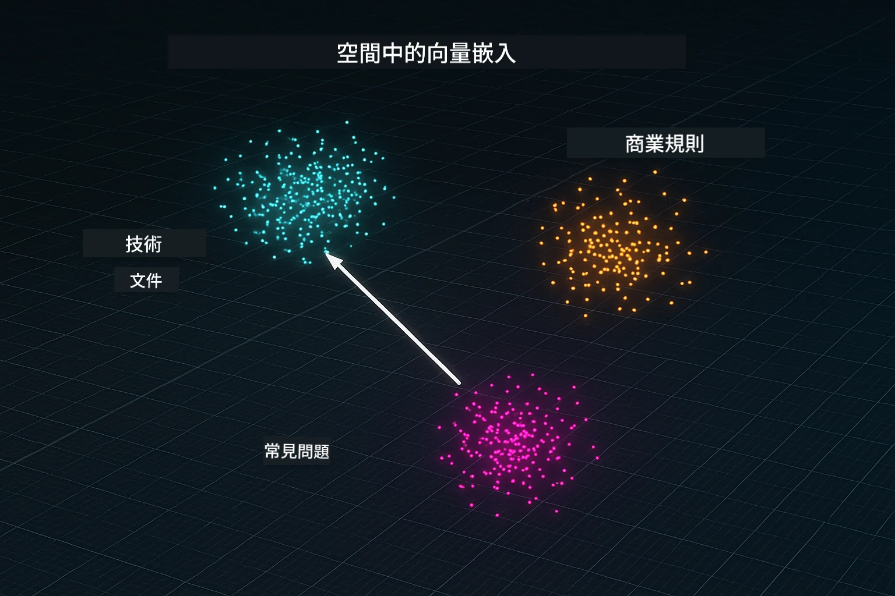
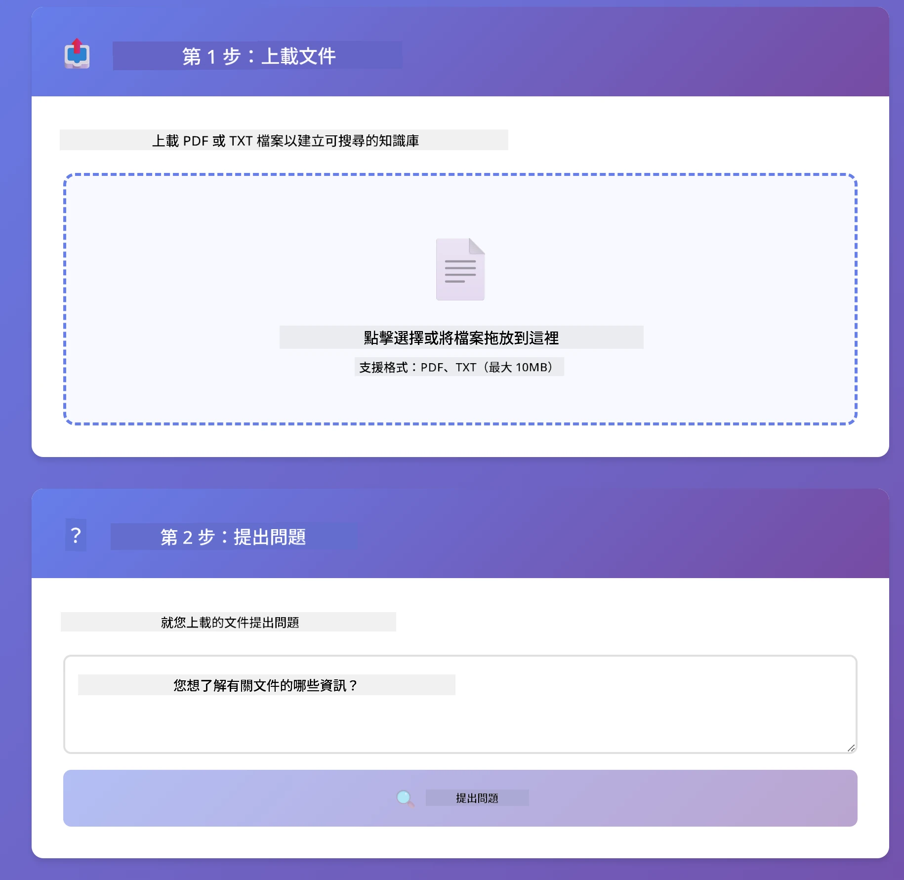
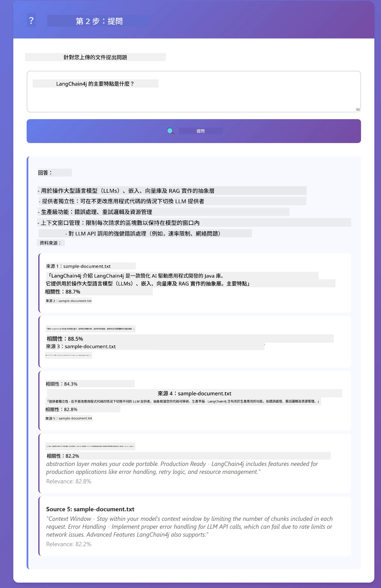

# Module 03: RAG（檢索增強生成）

## 目錄

- [影片導覽](#影片導覽)
- [您將學到的內容](#您將學到的內容)
- [先決條件](#先決條件)
- [理解 RAG](#理解-rag)
  - [本教程使用哪種 RAG 方法？](#本教程使用哪種-rag-方法？)
- [運作原理](#運作原理)
  - [文件處理](#文件處理)
  - [建立嵌入向量](#建立嵌入向量)
  - [語義搜尋](#語義搜尋)
  - [生成回答](#答案生成)
- [執行應用程式](#運行應用程式)
- [使用應用程式](#使用應用程式)
  - [上傳文件](#上載文件)
  - [提問](#提問)
  - [查看來源參考](#檢查來源參考)
  - [試驗提問](#試驗提問)
- [關鍵概念](#主要概念)
  - [切塊策略](#分片策略)
  - [相似度分數](#相似度分數)
  - [記憶體儲存](#記憶體存儲)
  - [上下文視窗管理](#上下文視窗管理)
- [何時 RAG 才重要](#何時使用-rag)
- [後續步驟](#後續步驟)

## 影片導覽

觀看這個現場說明會，了解如何開始本模組：

<a href="https://www.youtube.com/watch?v=_olq75ZH_eY"></a>

## 您將學到的內容

在之前的模組中，您學習了如何與 AI 對話以及有效結構化提示。但這有一個根本限制：語言模型只知道它們在訓練期間學到的知識。它們無法回答關於您公司政策、項目文件或任何未受訓練資訊的問題。

RAG（檢索增強生成）解決了這個問題。它不是試圖教模型您的資訊（這既昂貴又不切實際），而是賦予模型能夠在您的文件中搜尋的能力。當有人提問時，系統找到相關資訊並將其包含在提示中。模型接著根據檢索到的上下文回答。

將 RAG 想像成給模型提供一個參考資料庫。當您提問時，系統：

1. <strong>使用者查詢</strong> — 您提出問題
2. <strong>嵌入向量</strong> — 將您的問題轉換為向量
3. <strong>向量搜尋</strong> — 找出類似的文件切塊
4. <strong>上下文組合</strong> — 將相關切塊加入提示
5. <strong>回應</strong> — 大型語言模型根據上下文產生答案

這使模型的回答立足於您的真實資料，而不是依賴訓練知識或捏造答案。

## 先決條件

- 完成 [Module 01 - Introduction](../01-introduction/README.md)（部署完 Azure OpenAI 資源，包括 `text-embedding-3-small` 嵌入模型）
- 根目錄有 `.env` 檔案，包含 Azure 憑證（由 Module 01 的 `azd up` 指令產生）

> **注意：** 如果尚未完成 Module 01，請先依該模組的部署指示操作。`azd up` 指令會部署 GPT 聊天模型和本模組所使用的嵌入模型。

## 理解 RAG

下面的圖示說明了核心概念：RAG 不只依賴模型的訓練數據，而是讓模型有一個您的文件參考資料庫，在生成每個回答前先查閱。


*此圖顯示了標準大型語言模型（從訓練數據猜測）與加強了 RAG 的大型語言模型（先查閱您的文件）的差異。*

以下是整體流程的端到端連結。使用者的提問經過四個階段—嵌入、向量搜尋、上下文組合、回答生成—每步接續上一步：


*此圖展示完整 RAG 管線—使用者查詢經過嵌入、向量搜尋、上下文組合及回答生成。*

本模組的其餘部分將逐步詳細講解每個階段，並附上可執行及可修改的程式碼。

### 本教程使用哪種 RAG 方法？

LangChain4j 提供三種實現 RAG 的方式，各有不同抽象層級。以下圖比較它們：


*此圖比較 LangChain4j 的三種 RAG 方法—Easy、Native 與 Advanced—展示其主要元件及適用時機。*

| 方法 | 功能說明 | 權衡取捨 |
|---|---|---|
| **Easy RAG** | 透過 `AiServices` 與 `ContentRetriever` 自動連接所有流程。您註解介面，附加取回器，LangChain4j 自動負責嵌入、搜尋與提示組合。 | 代碼最少，但無法看到每個階段的細節。 |
| **Native RAG** | 您自行呼叫嵌入模型、搜尋儲存、建立提示及生成答案—每一步都明確操作。 | 代碼較多，但每個階段皆明確且可調整。 |
| **Advanced RAG** | 使用 `RetrievalAugmentor` 框架，具備可插拔的查詢轉換器、路由器、重排序器與內容注入器，適用生產級管線。 | 柔韌性最高，但複雜度也最高。 |

**本教程使用 Native 方法。** 每個 RAG 階段—查詢的向量嵌入、在向量庫搜尋、上下文組合及答案生成—都在 [`RagService.java`](../../../03-rag/src/main/java/com/example/langchain4j/rag/service/RagService.java) 明確撰寫。這是故意的：作為學習資源，讓您看見並理解每個階段比簡化代碼更重要。熟悉後，您可轉向 Easy RAG 進行快速原型，或者 Advanced RAG 構建生產系統。

> **💡想了解 Easy RAG？** LangChain4j 也提供 *Easy RAG* 方法，由 `AiServices` 和 `ContentRetriever` 自動處理嵌入、搜尋與提示組合。本模組採用較顯式的路徑—拆解管線，讓您自主控制每個階段。

以下圖展示 Easy RAG 管線。注意 `AiServices` 及 `EmbeddingStoreContentRetriever` 將所有複雜流程隱藏—您只需載入文件，附加取回器，即能獲取答案。本模組的 Native 方法拆開了這些隱藏步驟：


*此圖展示 Easy RAG 管線。與本模組的 Native 方法比較：Easy RAG 將嵌入、搜尋和提示組合隱藏於 `AiServices` 與 `ContentRetriever` 後。您載入文件、附加取回器，即可獲答案。Native 方法將管線打開，您自行呼叫每個階段（嵌入、搜尋、組合上下文、生成），擁有完整可視性與控制權。*

## 運作原理

本模組的 RAG 管線分為四個階段，當使用者提問時連續執行。首先，上傳的文件被<strong>解析及切塊</strong>成可管理的小段。這些切塊再轉成<strong>向量嵌入</strong>並存儲，以便進行數學比對。查詢來時，系統執行<strong>語義搜尋</strong>找出最相關切塊，最後將它們作為上下文傳給大型語言模型，進行<strong>答案生成</strong>。以下章節將透過程式碼與圖示逐步說明每個階段。先從第一步開始。

### 文件處理

[DocumentService.java](../../../03-rag/src/main/java/com/example/langchain4j/rag/service/DocumentService.java)

當您上傳文件時，系統會解析文件（PDF 或純文字），附加檔名等元資料，然後將其切成切塊—較小的片段，方便放入模型的上下文視窗。這些切塊間有些微重疊，以避免在邊界丟失上下文。

```java
// 解析上傳的檔案並包裝成 LangChain4j 文件
Document document = Document.from(content, metadata);

// 分割成300字元區塊，重疊30字元
DocumentSplitter splitter = DocumentSplitters
    .recursive(300, 30);

List<TextSegment> segments = splitter.split(document);
```

下圖直觀展示此過程。注意每個切塊與鄰近切塊共享部分標記—30標記的重疊確保重要上下文不會落入空白：


*此圖展示文件切成 300 標記切塊，彼此重疊 30 標記，保存了切塊邊界處的上下文。*

> **🤖 用 [GitHub Copilot](https://github.com/features/copilot) 聊天試試看：** 開啟 [`DocumentService.java`](../../../03-rag/src/main/java/com/example/langchain4j/rag/service/DocumentService.java)，並問：
> - 「LangChain4j 如何將文件拆分為切塊？為何重疊很重要？」
> - 「不同文件類型最佳切塊大小為何？為什麼？」
> - 「如何處理多語言文件或有特殊格式的文件？」

### 建立嵌入向量

[LangChainRagConfig.java](../../../03-rag/src/main/java/com/example/langchain4j/rag/config/LangChainRagConfig.java)

每個切塊會轉換為一組數字表示，稱為嵌入向量—本質上就是將意義轉成數字。嵌入模型不像聊天模型具備「智能」；它無法執行指令、推理或回答問題。嵌入模型能做的是將文字映射到數學空間，讓相似意義靠得更近—例如「汽車」靠近「汽車（automobile）」、「退貨政策」靠近「退款條款」。可把聊天模型想成您可以對話的人，嵌入模型則像超棒的檔案整理系統。

下圖可視化此概念—文字輸入，數字向量輸出，意味相近的向量彼此鄰近：


*此圖示意嵌入模型如何將文字轉為數字向量，並在向量空間中讓相似意義（如「車」與「汽車」）鄰近排列。*

```java
@Bean
public EmbeddingModel embeddingModel() {
    return OpenAiOfficialEmbeddingModel.builder()
        .baseUrl(azureOpenAiEndpoint)
        .apiKey(azureOpenAiKey)
        .modelName(azureEmbeddingDeploymentName)
        .build();
}

EmbeddingStore<TextSegment> embeddingStore = 
    new InMemoryEmbeddingStore<>();
```

下圖顯示 RAG 管線的兩個不同流程與 LangChain4j 的類別實現。<strong>匯入流程</strong>在上傳時運行一次，拆分文件、嵌入切塊、並透過 `.addAll()` 儲存。<strong>查詢流程</strong>每次使用者提問時執行，先嵌入問題，透過 `.search()` 搜尋儲存庫，將匹配的上下文傳給聊天模型。兩者共享介面 `EmbeddingStore<TextSegment>` 連接：


*此圖展示 RAG 管線的兩個流程—匯入與查詢—以及它們如何透過共用的 EmbeddingStore 互聯。*

嵌入儲存後，相似内容在向量空間自然聚集。下圖說明相關主題的文件如何聚集為鄰近點，使語義搜尋成真：



*此視覺化展示相關文件如何在三維向量空間中聚集，技術文件、商業規則與常見問答形成不同群組。*

當使用者搜尋時，系統採四步驟：文件嵌入一次，查詢每次嵌入，利用餘弦相似度比較查詢向量與所有儲存向量，並回傳前 K 個得分最高的切塊。以下圖解說每步及對應 LangChain4j 類別：


*此圖展示四步嵌入搜尋流程：嵌入文件，嵌入查詢，利用餘弦相似度比較向量，回傳排名前 K 的結果。*

### 語義搜尋

[RagService.java](../../../03-rag/src/main/java/com/example/langchain4j/rag/service/RagService.java)

當您提出問題時，該問題也會被轉成嵌入向量。系統比較您的問題嵌入向量與所有文件切塊的嵌入向量，找出意義最相近的切塊—不只是關鍵字匹配，而是真正的語義相似。

```java
Embedding queryEmbedding = embeddingModel.embed(question).content();

EmbeddingSearchRequest searchRequest = EmbeddingSearchRequest.builder()
    .queryEmbedding(queryEmbedding)
    .maxResults(5)
    .minScore(0.5)
    .build();

EmbeddingSearchResult<TextSegment> searchResult = embeddingStore.search(searchRequest);
List<EmbeddingMatch<TextSegment>> matches = searchResult.matches();

for (EmbeddingMatch<TextSegment> match : matches) {
    String relevantText = match.embedded().text();
    double score = match.score();
}
```

下圖對比語義搜尋與傳統關鍵字搜尋。關鍵字搜尋「vehicle」會漏掉提及「汽車與卡車」的切塊，而語義搜尋因理解它們意義相同，將此切塊作為高分匹配返回：


*此圖比較基於關鍵字的搜尋與語義搜尋，顯示語義搜尋即使關鍵字不同，依然能找到概念相關的內容。*

底層相似度以餘弦相似度衡量—本質問的是「這兩支箭頭指向同方向嗎？」兩個切塊可能用完全不同詞彙，但若意義相同，其向量方向相近，分數接近 1.0：


*此圖說明餘弦相似度作為嵌入向量之間的角度——向量越對齊，得分越接近1.0，表示語義相似度越高。*

> **🤖 試試用 [GitHub Copilot](https://github.com/features/copilot) Chat：** 打開 [`RagService.java`](../../../03-rag/src/main/java/com/example/langchain4j/rag/service/RagService.java) 並問：
> -「相似性搜索是如何利用嵌入運作的？得分是如何決定的？」
> -「我應該使用什麼相似度閾值？它如何影響結果？」
> -「當找不到相關文檔時，該如何處理？」

### 答案生成

[RagService.java](../../../03-rag/src/main/java/com/example/langchain4j/rag/service/RagService.java)

最相關的片段會組裝成結構化提示，其中包含明確指令、檢索到的上下文和用戶問題。模型僅閱讀這些特定片段並根據這些資訊回答——只能使用眼前的內容，避免幻覺。

```java
String context = matches.stream()
    .map(match -> match.embedded().text())
    .collect(Collectors.joining("\n\n"));

String prompt = String.format("""
    Answer the question based on the following context.
    If the answer cannot be found in the context, say so.

    Context:
    %s

    Question: %s

    Answer:""", context, request.question());

String answer = chatModel.chat(prompt);
```

以下圖示展示此組裝過程——來自搜尋步驟的最高得分片段被注入提示模板，`OpenAiOfficialChatModel` 產生有根據的答案：


*此圖示如何將最高得分的片段組合成結構化提示，使模型能從您的數據中產生有根據的答案。*

## 運行應用程式

**確認部署：**

確保 `.env` 檔案存在於根目錄，包含 Azure 資訊（在模組 01 中建立）。從模組目錄 (`03-rag/`) 執行：

**Bash:**
```bash
cat ../.env  # 應顯示 AZURE_OPENAI_ENDPOINT、API_KEY、DEPLOYMENT
```

**PowerShell:**
```powershell
Get-Content ..\.env  # 應該顯示 AZURE_OPENAI_ENDPOINT、API_KEY、DEPLOYMENT
```

**啟動應用程式：**

> **注意：** 若您已從根目錄使用 `./start-all.sh` 啟動所有應用程式（如模組 01 描述），則此模組已在 8081 端口運行。您可跳過以下啟動命令，直接訪問 http://localhost:8081。

**選項 1：使用 Spring Boot Dashboard（推薦 VS Code 用戶）**

開發容器含有 Spring Boot Dashboard 擴展，提供視覺介面管理所有 Spring Boot 應用程式。在 VS Code 左側活動欄可找到（尋找 Spring Boot 圖示）。

在 Spring Boot Dashboard，您可：
- 查看工作區內所有可用 Spring Boot 應用程式
- 一鍵啟動/停止應用程式
- 即時查看應用程式日誌
- 監控應用程式狀態

點擊「rag」旁的播放按鈕以啟動此模組，或同時啟動所有模組。


*此截圖顯示 VS Code 中的 Spring Boot Dashboard，可視化地啟動、停止及監控應用程式。*

**選項 2：使用 shell 腳本**

啟動全部網頁應用程式（模組 01-04）：

**Bash:**
```bash
cd ..  # 從根目錄
./start-all.sh
```

**PowerShell:**
```powershell
cd ..  # 從根目錄
.\start-all.ps1
```

或只啟動本模組：

**Bash:**
```bash
cd 03-rag
./start.sh
```

**PowerShell:**
```powershell
cd 03-rag
.\start.ps1
```

這些腳本會自動從根目錄 `.env` 檔加載環境變數，若 JAR 不存在會自動編譯。

> **注意：** 若您想手動編譯所有模組再啟動：
>
> **Bash:**
> ```bash
> cd ..  # Go to root directory
> mvn clean package -DskipTests
> ```

> **PowerShell:**
> ```powershell
> cd ..  # Go to root directory
> mvn clean package -DskipTests
> ```

請在瀏覽器開啟 http://localhost:8081。

**停止應用程式：**

**Bash:**
```bash
./stop.sh  # 只有本模組
# 或者
cd .. && ./stop-all.sh  # 所有模組
```

**PowerShell:**
```powershell
.\stop.ps1  # 只有此模組
# 或者
cd ..; .\stop-all.ps1  # 所有模組
```

## 使用應用程式

應用程式提供上載文件及提問的網頁介面。

<a href="images/rag-homepage.png"></a>

*此截圖展示 RAG 應用介面，可上載文件並提出問題。*

### 上載文件

首先上載文件——TXT 格式最適合測試。此資料夾中附有 `sample-document.txt`，內含 LangChain4j 功能、RAG 實作與最佳實踐資訊，非常適合測試系統。

系統會處理您的文件，拆分成多個片段並為每個片段創建嵌入，這在您上載時自動完成。

### 提問

接著詢問關於文件內容的具體問題。試問些文件中明確陳述的事實性問題。系統搜尋相關片段，將其納入提示並生成答案。

### 檢查來源參考

每個答案包含來源片段及相似度分數。這些分數（0 到 1）表示每個片段與您的問題相關程度。分數越高表示匹配越好，讓您可以核對答案與來源材料。

<a href="images/rag-query-results.png"></a>

*此截圖顯示查詢結果，包括生成答案、來源參考及每個檢索片段的相關性分數。*

### 試驗提問

嘗試不同類型的問題：
- 具體事實：「主要主題是什麼？」
- 比較：「X 與 Y 有何不同？」
- 摘要：「請總結關於 Z 的重點」

觀察相關性分數如何隨問題與文件內容匹配度改變。

## 主要概念

### 分片策略

文件被拆分成含 300 個 token 的片段，重疊 30 個 token。此設計確保每個片段有足夠上下文且仍足夠小，方便多片段同時納入提示。

### 相似度分數

每個檢索到的片段附帶與用戶問題相符程度的相似度分數（0 到 1）。下圖顯示分數範圍及系統如何用它們過濾結果：


*此圖展示分數範圍從0到1，最低閾值為0.5，用以過濾不相關片段。*

分數範圍說明：
- 0.7-1.0：高度相關，精確匹配
- 0.5-0.7：相關，具良好上下文
- 低於0.5：被過濾，差異過大

系統只檢索超過最低閾值的片段以確保質量。

嵌入效果極佳於清晰聚類語義，但會有盲點。下圖示常見失敗模式——片段太大導致向量混淆，片段太小缺乏上下文，歧義詞指向多個群集，且ID或零件號等精確匹配無法用嵌入處理：


*此圖展示常見嵌入失敗模式：片段過大、片段過小、指向多個群集的模糊詞彙，以及像ID之類的精確匹配。*

### 記憶體存儲

本模組為簡便起見使用記憶體存儲。重啟應用程式後，上載的文件會遺失。生產系統採用像 Qdrant 或 Azure AI Search 等持久化向量資料庫。

### 上下文視窗管理

每個模型有最大上下文視窗。無法納入大型文件的所有片段。系統檢索最相關的前 N 個片段（預設5個），在限制內提供足夠上下文確保回答準確。

## 何時使用 RAG

RAG 並非總是適用。下圖決策指南可協助判斷何時 RAG 有價值，何時使用更簡單方法如將內容直接放進提示或倚賴模型內建知識即可：


*此圖為決策指南，指示何時使用 RAG 會帶來價值，何時簡單方式足夠。*

## 後續步驟

**下一模組：** [04-tools - AI Agents with Tools](../04-tools/README.md)

---

**導覽：** [← 上一節：模組 02 - 提示工程](../02-prompt-engineering/README.md) | [返回主頁](../README.md) | [下一節：模組 04 - 工具 →](../04-tools/README.md)

---

<!-- CO-OP TRANSLATOR DISCLAIMER START -->
**免責聲明**：
本文件使用 AI 翻譯服務 [Co-op Translator](https://github.com/Azure/co-op-translator) 進行翻譯。雖然我們力求準確，但請注意，自動翻譯可能包含錯誤或不準確之處。原始文件的母語版本應被視為權威來源。對於重要資訊，建議尋求專業人工翻譯。我們不對因使用本翻譯而引起的任何誤解或曲解承擔責任。
<!-- CO-OP TRANSLATOR DISCLAIMER END -->