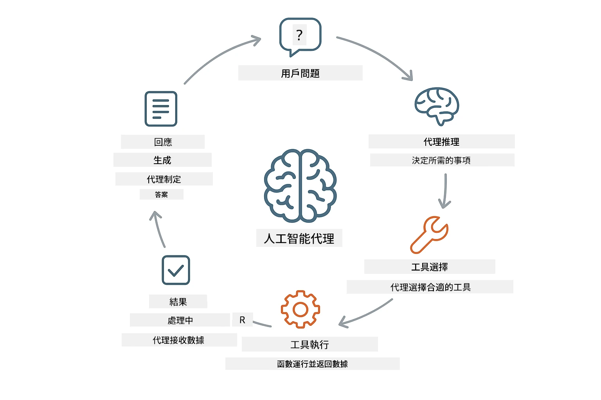
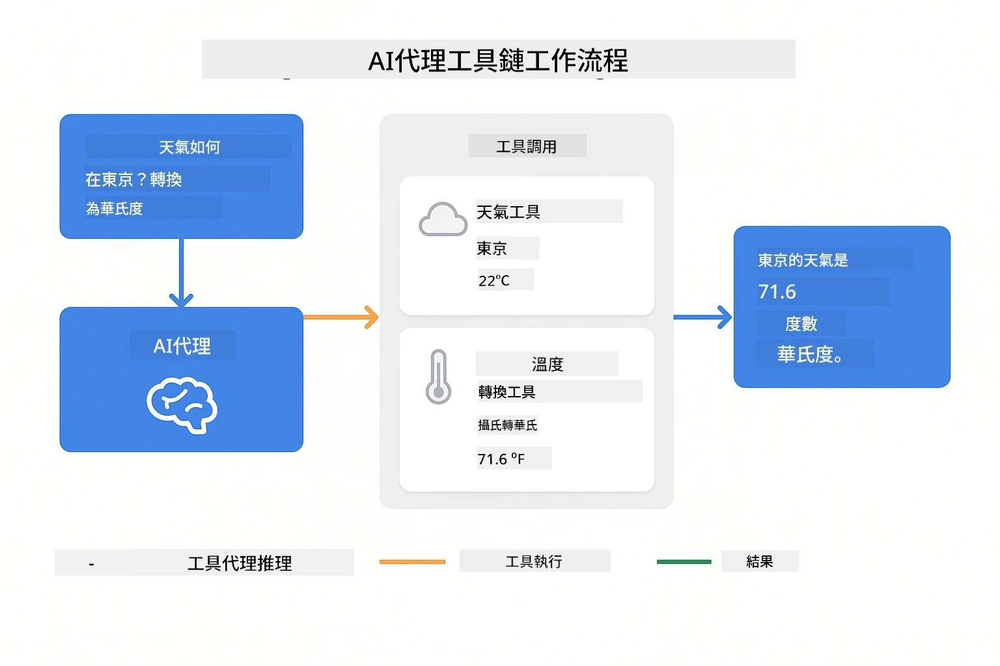

# Module 04: 使用工具的 AI 代理

## 目錄

- [你將會學習什麼](../../../04-tools)
- [先決條件](../../../04-tools)
- [理解具有工具的 AI 代理](../../../04-tools)
- [工具呼叫的運作方式](../../../04-tools)
  - [工具定義](../../../04-tools)
  - [決策制定](../../../04-tools)
  - [執行](../../../04-tools)
  - [回應產生](../../../04-tools)
- [工具串接](../../../04-tools)
- [執行應用程式](../../../04-tools)
- [使用應用程式](../../../04-tools)
  - [嘗試簡單的工具使用](../../../04-tools)
  - [測試工具串接](../../../04-tools)
  - [查看對話流程](../../../04-tools)
  - [嘗試不同的請求](../../../04-tools)
- [關鍵概念](../../../04-tools)
  - [ReAct 模式（推理與行動）](../../../04-tools)
  - [工具描述的重要性](../../../04-tools)
  - [會話管理](../../../04-tools)
  - [錯誤處理](../../../04-tools)
- [可用工具](../../../04-tools)
- [何時使用基於工具的代理](../../../04-tools)
- [下一步](../../../04-tools)

## 你將會學習什麼

到目前為止，你已經學會如何與 AI 對話，有效構建提示詞，並根據你的文件對回答進行基礎定位。但仍有一個根本限制：語言模型只能生成文字。它們無法查詢天氣、執行計算、查詢資料庫或與外部系統互動。

工具改變了這一點。透過提供模型可呼叫的函式，你將它從文字生成器轉變為能夠行動的代理。模型決定何時需要工具、使用哪個工具以及傳入哪些參數。你的程式碼執行該函式並返回結果。模型將結果融入回應中。

## 先決條件

- 完成 Module 01（部署 Azure OpenAI 資源）
- 根目錄下有包含 Azure 憑證的 `.env` 檔案（由 Module 01 中 `azd up` 建立）

> **注意：** 如果你未完成 Module 01，請先跟隨那裡的部署指示。

## 理解具有工具的 AI 代理

> **📝 注意：** 本模組中「代理」一詞指的是具備呼叫工具能力的 AI 助理，這與我們在[Module 05: MCP](../05-mcp/README.md) 中將介紹的 **Agentic AI** 模式（具備規劃、記憶及多步推理的自治代理）不同。

一個具備工具的 AI 代理運作於推理與行動（ReAct）模式：

1. 使用者提出問題
2. 代理推理需知道的資訊
3. 代理決定是否需要工具解答
4. 若需要，代理使用正確參數呼叫適當的工具
5. 工具執行並回傳資料
6. 代理整合結果並提供最終回答



*ReAct 模式 — AI 代理如何在推理與行動間交替以解決問題*

此過程自動進行。你定義工具及其描述，模型負責何時以及如何使用工具的決策。

## 工具呼叫的運作方式

### 工具定義

[WeatherTool.java](../../../04-tools/src/main/java/com/example/langchain4j/agents/tools/WeatherTool.java) | [TemperatureTool.java](../../../04-tools/src/main/java/com/example/langchain4j/agents/tools/TemperatureTool.java)

你定義具備明確描述與參數規範的函式。模型在系統提示裡看到這些描述並明白每項工具的功能。

```java
@Component
public class WeatherTool {
    
    @Tool("Get the current weather for a location")
    public String getCurrentWeather(@P("Location name") String location) {
        // 你嘅天氣查詢邏輯
        return "Weather in " + location + ": 22°C, cloudy";
    }
}

@AiService
public interface Assistant {
    String chat(@MemoryId String sessionId, @UserMessage String message);
}

// 助手係由 Spring Boot 自動連接嘅：
// - ChatModel bean
// - 來自 @Component 類別嘅所有 @Tool 方法
// - 用於會話管理嘅 ChatMemoryProvider
```

> **🤖 嘗試使用 [GitHub Copilot](https://github.com/features/copilot) 聊天：** 打開 [`WeatherTool.java`](../../../04-tools/src/main/java/com/example/langchain4j/agents/tools/WeatherTool.java)，並詢問：
> - 「我要如何整合像 OpenWeatherMap 這樣的真實天氣 API，而不是使用模擬資料？」
> - 「什麼樣的工具描述能協助 AI 正確使用工具？」
> - 「如何在工具實作中處理 API 錯誤及速率限制？」

### 決策制定

當使用者問「西雅圖的天氣如何？」時，模型辨識需要天氣工具，產生帶有 location 參數為「Seattle」的函式呼叫。

### 執行

[AgentService.java](../../../04-tools/src/main/java/com/example/langchain4j/agents/service/AgentService.java)

Spring Boot 自動注入所有註冊的宣告式 `@AiService` 介面，LangChain4j 會自動執行工具呼叫。

> **🤖 嘗試使用 [GitHub Copilot](https://github.com/features/copilot) 聊天：** 打開 [`AgentService.java`](../../../04-tools/src/main/java/com/example/langchain4j/agents/service/AgentService.java)，並詢問：
> - 「ReAct 模式如何運作，為什麼對 AI 代理有效？」
> - 「代理如何決定使用哪個工具以及順序？」
> - 「若工具執行失敗，應如何健全地處理錯誤？」

### 回應產生

模型接收到天氣資料，並將其格式化為自然語言回覆給使用者。

### 為什麼使用宣告式 AI 服務？

本模組使用 LangChain4j 的 Spring Boot 整合與宣告式 `@AiService` 介面：

- **Spring Boot 自動注入** — ChatModel 與工具自動注入
- **@MemoryId 模式** — 自動化基於會話的記憶管理
- **單一實例** — 助理只建立一次，重複使用提升效能
- **型別安全執行** — Java 方法直接調用並型態轉換
- **多回合協調** — 自動處理工具串接
- **零樣板程式碼** — 無需手動 AiServices.builder() 或記憶的 HashMap

手動使用 `AiServices.builder()` 的替代方案需要更多程式碼且不具備 Spring Boot 整合優勢。

## 工具串接

**工具串接** — AI 可能連續呼叫多個工具。問「西雅圖天氣如何？我該帶雨傘嗎？」時，可看到它將 `getCurrentWeather` 呼叫與關於雨具的推理串接起來。

<a href="images/tool-chaining.png"></a>

*順序工具呼叫 — 一個工具的輸出如何餵入下一個決策*

**優雅失敗** — 查詢模擬資料中沒有的城市天氣，工具回傳錯誤訊息，AI 解釋無法提供幫助。工具安全失敗。

這在單一對話回合中完成。代理自主協調多個工具呼叫。

## 執行應用程式

**驗證部署狀況：**

確認根目錄有 `.env` 檔案且包含 Azure 憑證（由 Module 01 創建）：
```bash
cat ../.env  # 應該顯示 AZURE_OPENAI_ENDPOINT、API_KEY、DEPLOYMENT
```

**啟動應用程式：**

> **注意：** 如果你已使用 Module 01 的 `./start-all.sh` 啟動所有應用，這個模組已在 8084 埠運行。你可以跳過以下啟動指令，直接造訪 http://localhost:8084 。

**選項 1：使用 Spring Boot 儀表板（推薦 VS Code 使用者）**

開發容器已包含 Spring Boot 儀表板擴充，提供視覺介面管理所有 Spring Boot 應用程式。可在 VS Code 左側活動列找到（尋找 Spring Boot 圖示）。

從 Spring Boot 儀表板，可：
- 查看工作區內所有 Spring Boot 應用
- 點擊啟動 / 停止應用
- 即時檢視應用日誌
- 監視應用狀態

點擊「tools」旁的播放鈕啟動本模組，或一次啟動全部模組。


**選項 2：使用 shell 腳本**

啟動所有 Web 應用（模組 01-04）：

**Bash:**
```bash
cd ..  # 從根目錄開始
./start-all.sh
```

**PowerShell:**
```powershell
cd ..  # 從根目錄
.\start-all.ps1
```

或只啟動本模組：

**Bash:**
```bash
cd 04-tools
./start.sh
```

**PowerShell:**
```powershell
cd 04-tools
.\start.ps1
```

這些腳本會自動從根目錄 `.env` 讀取環境變數，且若不存在 JAR 檔案會進行建置。

> **注意：** 若你想手動建置所有模組後再啟動：
>
> **Bash:**
> ```bash
> cd ..  # Go to root directory
> mvn clean package -DskipTests
> ```

> **PowerShell:**
> ```powershell
> cd ..  # Go to root directory
> mvn clean package -DskipTests
> ```

於瀏覽器開啟 http://localhost:8084 。

**停止應用：**

**Bash:**
```bash
./stop.sh  # 只有此模組
# 或者
cd .. && ./stop-all.sh  # 所有模組
```

**PowerShell:**
```powershell
.\stop.ps1  # 僅此模組
# 或
cd ..; .\stop-all.ps1  # 所有模組
```

## 使用應用程式

本應用提供網頁介面，可與擁有天氣與溫度轉換工具的 AI 代理互動。

<a href="images/tools-homepage.png"></a>

*AI 代理工具介面 — 快速範例與聊天介面，用於與工具互動*

### 嘗試簡單的工具使用

從簡單請求開始：「將 100 華氏度轉換為攝氏」。代理識別需要溫度轉換工具，以正確參數呼叫，並返回結果。注意整個流程自然，你不需指明使用哪個工具或如何呼叫。

### 測試工具串接

嘗試更複雜的：「西雅圖今天天氣如何？並將溫度轉換成華氏？」觀看代理分步執行。它先取得天氣（回傳攝氏），辨識需要轉換為華氏，呼叫轉換工具，並將兩者結果合併成一個回答。

### 查看對話流程

聊天介面會保存對話歷史，使你可多回合互動。你能看到先前所有查詢與回答，方便追蹤對話並了解代理如何在多次交流中建立上下文。

<a href="images/tools-conversation-demo.png"></a>

*多回合對話展示簡單轉換、天氣查詢與工具串接*

### 嘗試不同的請求

試試各種組合：
- 天氣查詢：「東京的天氣如何？」
- 溫度轉換：「25°C 是多少 Kelvin？」
- 複合查詢：「查詢巴黎天氣，並告訴我是否超過 20°C」

注意代理如何解讀自然語言並對應適當的工具呼叫。

## 關鍵概念

### ReAct 模式（推理與行動）

代理在推理（決定要做什麼）與行動（使用工具）間交替。此模式使其具備自主解決問題能力，而非僅根據指令回應。

### 工具描述的重要性

工具描述品質直接影響代理使用工具的成效。清晰、具體的描述有助模型了解何時及如何呼叫工具。

### 會話管理

`@MemoryId` 註解啟用自動基於會話的記憶管理。每個會話 ID 配有由 `ChatMemoryProvider` 管理的獨立 `ChatMemory` 實體，無需手動追蹤記憶。

### 錯誤處理

工具可能失敗 — API 超時、參數錯誤、外部服務中斷。生產環境代理需具備錯誤處理，讓模型能解釋問題或嘗試替代方案。

## 可用工具

**天氣工具**（示範用模擬資料）：
- 取得指定地點當前天氣
- 取得多日天氣預報

**溫度轉換工具**：
- 攝氏轉華氏
- 華氏轉攝氏
- 攝氏轉開氏
- 開氏轉攝氏
- 華氏轉開氏
- 開氏轉華氏

這些為簡單範例，但此模式可擴展至任何函式：資料庫查詢、API 呼叫、計算、檔案操作、系統指令等。

## 何時使用基於工具的代理

**應在以下情況使用工具：**
- 回答需即時數據（天氣、股價、庫存）
- 需執行超越簡單數學的運算
- 存取資料庫或 API
- 執行操作（寄送電子郵件、建立票務、更新紀錄）
- 整合多重資料來源

**不適合使用工具的情況：**
- 問題可以從一般知識回答
- 回覆純屬對話性質
- 工具延遲會影響使用體驗

## 下一步

**下一模組：** [05-mcp - 模型上下文協定（MCP）](../05-mcp/README.md)

---

**導航：** [← 前一章：Module 03 - RAG](../03-rag/README.md) | [回到主頁](../README.md) | [下一章：Module 05 - MCP →](../05-mcp/README.md)

---

<!-- CO-OP TRANSLATOR DISCLAIMER START -->
**免責聲明**：
本文件係使用人工智能翻譯服務 [Co-op Translator](https://github.com/Azure/co-op-translator) 進行翻譯。雖然我哋致力於提供準確內容，但請注意，自動翻譯可能包含錯誤或不準確之處。文件之原始語言版本應視為具權威性嘅資料來源。對於重要資訊，建議採用專業嘅人工翻譯。我哋不會對因使用本翻譯而產生嘅任何誤解或誤釋負責。
<!-- CO-OP TRANSLATOR DISCLAIMER END -->