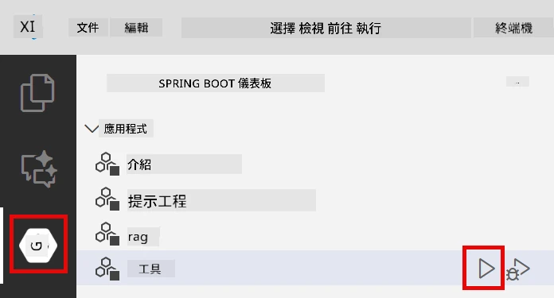
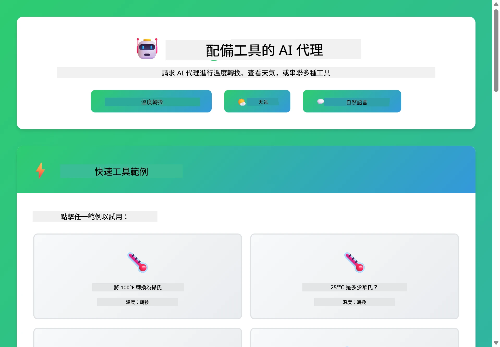
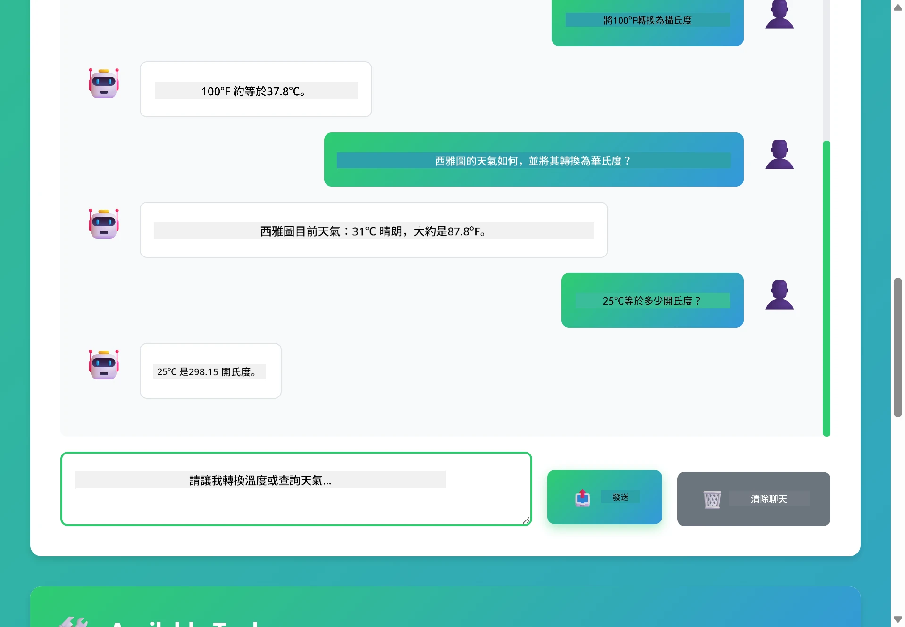

# Module 04: 具備工具的 AI 代理

## 目錄

- [影片導覽](#影片導覽)
- [你將學到什麼](#你將學到什麼)
- [先決條件](#先決條件)
- [理解具備工具的 AI 代理](#理解具備工具的-ai-代理)
- [工具呼叫如何運作](#工具呼叫如何運作)
  - [工具定義](#工具定義)
  - [決策制定](#決策制定)
  - [執行](#執行)
  - [回應生成](#回應生成)
  - [架構：Spring Boot 自動注入](#架構：spring-boot-自動注入)
- [工具串接](#工具串接)
- [執行應用程式](#執行應用程式)
- [使用應用程式](#使用應用程式)
  - [嘗試簡單工具使用](#嘗試簡單工具使用)
  - [測試工具串接](#測試工具鏈結)
  - [查看對話流程](#查看對話流程)
  - [嘗試不同請求](#嘗試不同請求)
- [核心概念](#關鍵概念)
  - [ReAct 範式（推理與行動）](#react-模式（推理與行動）)
  - [工具描述的重要性](#工具描述很重要)
  - [會話管理](#會話管理)
  - [錯誤處理](#錯誤處理)
- [可用工具](#可用工具)
- [何時使用基於工具的代理](#何時使用工具驅動代理)
- [工具與 RAG 的比較](#工具與-rag)
- [下一步](#下一步)

## 影片導覽

觀看本直播，說明如何開始本模組：

<a href="https://www.youtube.com/watch?v=O_J30kZc0rw"></a>

## 你將學到什麼

到目前為止，你已學會如何與 AI 對話、有效組織提示語，並以文件作為回應依據。但仍有根本限制：語言模型只能生成文字。它們不能查看天氣、執行計算、查詢資料庫或跟外部系統互動。

工具改變了這一點。透過給模型存取可呼叫的函式，你將它從文字生成器轉變成能夠採取行動的代理。模型決定何時需要工具、使用哪一個工具，以及傳遞什麼參數。你的程式碼執行該函式並回傳結果。模型將該結果整合進回應中。

## 先決條件

- 完成 [Module 01 - 介紹](../01-introduction/README.md) （部署 Azure OpenAI 資源）
- 建議完成先前模組（本模組在工具與 RAG 比較中引用了 [Module 03 的 RAG 概念](../03-rag/README.md)）
- 專案根目錄中有包含 Azure 認證的 `.env` 檔案（由 Module 01 的 `azd up` 建立）

> **注意：** 若尚未完成 Module 01，請先依照該模組的部署指示進行。

## 理解具備工具的 AI 代理

> **📝 注意：** 本模組中「代理」一詞指強化了工具呼叫能力的 AI 助理。這與在 [Module 05: MCP](../05-mcp/README.md) 將介紹的 **Agentic AI** 模式（具備規劃、記憶及多步推理的自主代理）不同。

沒有工具時，語言模型只能根據訓練資料生成文字。問它當前天氣，它只能猜測。給它工具，它就能呼叫天氣 API、執行計算，或查詢資料庫 — 然後將那些真實結果編織入回應。


*沒有工具時模型只能猜 — 有工具時可呼叫 API、執行計算並回傳即時資料。*

具備工具的 AI 代理遵循 **推理與行動 (ReAct)** 範式。模型不只回應 — 它會思考所需、以呼叫工具行動、觀察結果，然後決定是否再行動或給出最終答案：

1. <strong>推理</strong> — 代理分析使用者問題，判斷需要什麼資訊
2. <strong>行動</strong> — 代理選擇合適工具，生成正確參數並呼叫該工具
3. <strong>觀察</strong> — 代理接收工具輸出並評估結果
4. <strong>重複或回應</strong> — 需要更多資料時迴圈回推理；否則組成自然語言答案


*ReAct 循環 — 代理推理要做什麼，以呼叫工具行動，觀察結果，迴圈直到能交付最終答案。*

這一切都自動發生。你定義工具及描述，模型處理何時和如何使用它們的決策。

## 工具呼叫如何運作

### 工具定義

[WeatherTool.java](../../../04-tools/src/main/java/com/example/langchain4j/agents/tools/WeatherTool.java) | [TemperatureTool.java](../../../04-tools/src/main/java/com/example/langchain4j/agents/tools/TemperatureTool.java)

你定義函式並附上清晰描述和參數規範。模型在系統提示中看到這些描述並了解每個工具的用途。

```java
@Component
public class WeatherTool {
    
    @Tool("Get the current weather for a location")
    public String getCurrentWeather(@P("Location name") String location) {
        // 你的天氣查詢邏輯
        return "Weather in " + location + ": 22°C, cloudy";
    }
}

@AiService
public interface Assistant {
    String chat(@MemoryId String sessionId, @UserMessage String message);
}

// 助手由 Spring Boot 自動配置：
// - ChatModel bean
// - 所有來自 @Component 類別的 @Tool 方法
// - 用於會話管理的 ChatMemoryProvider
```

下圖拆解各註釋說明每個部分如何幫助 AI 理解何時呼叫工具和帶入哪些參數：


*工具定義構造 — @Tool 告訴 AI 何時使用，@P 描述每個參數，@AiService 在啟動時串接所有元件。*

> **🤖 試試用 [GitHub Copilot](https://github.com/features/copilot) Chat：** 打開 [`WeatherTool.java`](../../../04-tools/src/main/java/com/example/langchain4j/agents/tools/WeatherTool.java) 並提問：
> - 「我如何整合像 OpenWeatherMap 這樣的真實天氣 API，而非模擬資料？」
> - 「什麼樣的工具描述最能幫助 AI 正確使用？」
> - 「在工具實作中如何處理 API 錯誤和流量限制？」

### 決策制定

當使用者問「西雅圖的天氣如何？」時，模型不會隨機挑工具。它會將使用者意圖與所有工具描述比對，依關聯度評分，挑出最佳匹配。然後生成結構化函式呼叫並帶上正確參數 — 這裡是將 `location` 設為 `"Seattle"`。

若無工具匹配使用者請求，模型會退回以自身知識回答。若多工具匹配，則選最具體的。


*模型評估每個可用工具與使用者意圖的關聯，選出最佳匹配 — 因此清楚且具體的工具描述非常重要。*

### 執行

[AgentService.java](../../../04-tools/src/main/java/com/example/langchain4j/agents/service/AgentService.java)

Spring Boot 自動串接具聲明式 `@AiService` 介面的所有已註冊工具，LangChain4j 自動執行工具呼叫。幕後，完整工具呼叫流程經六個階段 — 從使用者自然語言問題，一直到自然語言答案：


*端到端流程 — 使用者提問，模型選擇工具，LangChain4j 執行，模型將結果編織成自然回應。*

幕後，`AiServices` 對任何工具都執行相同的工具呼叫迴圈 — 這裡以簡單 `Calculator` 示範。以下時序圖清楚說明底層發生的流程：


*工具呼叫迴圈 — `AiServices` 傳送訊息和工具結構至大模型，模型回覆類似 `add(42, 58)` 的函式呼叫，LangChain4j 在本地執行 `Calculator` 方法，並回傳結果作為最終答案。*

> **🤖 試試用 [GitHub Copilot](https://github.com/features/copilot) Chat：** 打開 [`AgentService.java`](../../../04-tools/src/main/java/com/example/langchain4j/agents/service/AgentService.java) 並提問：
> - 「ReAct 範式如何運作，為何有效於 AI 代理？」
> - 「代理如何決定使用哪個工具及使用順序？」
> - 「如果工具執行失敗怎麼辦 — 如何健壯地處理錯誤？」

### 回應生成

模型接收天氣資料並格式化為自然語言回應給使用者。

### 架構：Spring Boot 自動注入

本模組使用 LangChain4j 的 Spring Boot 整合搭配聲明式 `@AiService` 介面。啟動時，Spring Boot 掃描所有含有 `@Tool` 方法的 `@Component`、你的 `ChatModel` bean 與 `ChatMemoryProvider` — 並統一串接成單一 `Assistant` 介面，不需任何樣板碼。


*@AiService 介面將 ChatModel、工具元件與記憶體提供者串接起來 — Spring Boot 全自動接線。*

以下為完整請求生命週期的時序圖 — 從 HTTP 請求經控制器、服務及自動注入的代理到工具執行，再返回的流程：


*完整 Spring Boot 請求生命週期 — HTTP 請求流經控制器與服務到自動注入的 Assistant 代理，後者自動協調大模型與工具呼叫。*

此方法主要優點：

- **Spring Boot 自動注入** — ChatModel 與工具自動注入
- **@MemoryId 模式** — 自動化基於會話的記憶管理
- <strong>單一實例</strong> — Assistant 實例只建立一次，提升效能
- <strong>型別安全執行</strong> — Java 方法可直接呼叫，具型別轉換
- <strong>多輪協調</strong> — 自動處理工具串接流程
- <strong>零樣板碼</strong> — 無須手動撰寫 `AiServices.builder()` 或管理記憶 HashMap

替代作法（手動 `AiServices.builder()`）需較多程式碼且缺乏 Spring Boot 整合優勢。

## 工具串接

<strong>工具串接</strong> — 基於工具的代理真正威力展現於單一問題需多工具合作時。問「西雅圖的天氣用華氏計算是多少？」時，代理會自動串接兩個工具：先呼叫 `getCurrentWeather` 取得攝氏溫度，再將該數值傳給 `celsiusToFahrenheit` 轉換 — 均在一次對話回合完成。


*工具串接實例 — 代理先呼叫 getCurrentWeather，然後將攝氏結果轉給 celsiusToFahrenheit，並給出整合答案。*

<strong>優雅失敗</strong> — 請求不存在於模擬資料的城市天氣時，工具傳回錯誤訊息，AI 解釋無法協助而非程式崩潰。工具安全失敗。下圖對比兩種做法 — 適當錯誤處理下，代理捕捉例外並給予有用回應；未處理則整個應用程式掛掉：


*工具失敗時，代理捕獲錯誤並用有幫助的解釋回應，而非程式崩潰。*

此流程於單次對話回合完成，代理自主協調多重工具呼叫。

## 執行應用程式

**確認部署狀態：**

確保專案根目錄中已有包含 Azure 認證的 `.env` 檔案（在 Module 01 部署時建立）。於本模組目錄（`04-tools/`）執行：

**Bash：**
```bash
cat ../.env  # 應該顯示 AZURE_OPENAI_ENDPOINT、API_KEY、DEPLOYMENT
```

**PowerShell：**
```powershell
Get-Content ..\.env  # 應該顯示 AZURE_OPENAI_ENDPOINT、API_KEY、DEPLOYMENT
```

**啟動應用程式：**

> **注意：** 若已於根目錄使用 `./start-all.sh` 啟動所有應用（如 Module 01 所示），本模組已在 8084 埠運行。你可略過以下啟動指令，直接訪問 http://localhost:8084 。

**方案一：使用 Spring Boot 控制面板（推薦 VS Code 使用者）**

開發容器包含 Spring Boot 控制面板擴充，提供視覺介面管理所有 Spring Boot 應用程式。可於 VS Code 左側活動欄找到（尋找 Spring Boot 圖示）。

在 Spring Boot 控制面板中，你可以：
- 查看工作區中所有可用的 Spring Boot 應用
- 一鍵啟動/停止應用程式
- 實時查看應用日誌
- 監控應用狀態

只要點擊「tools」旁的播放鈕啟動本模組，或一次啟動所有模組。

以下為 VS Code 中 Spring Boot 控制面板的樣貌：


*VS Code 裡的 Spring Boot 儀錶板 — 從一處啟動、停止及監視所有模組*

**選項 2：使用 shell 腳本**

啟動所有網頁應用程式（模組 01-04）：

**Bash:**
```bash
cd ..  # 從根目錄
./start-all.sh
```

**PowerShell:**
```powershell
cd ..  # 從根目錄
.\start-all.ps1
```

或者只啟動此模組：

**Bash:**
```bash
cd 04-tools
./start.sh
```

**PowerShell:**
```powershell
cd 04-tools
.\start.ps1
```

兩個腳本會自動從根目錄的 `.env` 檔案載入環境變數，且如果 JAR 檔不存在則會自動建構。

> **注意：** 如果你想手動建置所有模組再啟動：
>
> **Bash:**
> ```bash
> cd ..  # Go to root directory
> mvn clean package -DskipTests
> ```
>
> **PowerShell:**
> ```powershell
> cd ..  # Go to root directory
> mvn clean package -DskipTests
> ```

在瀏覽器開啟 http://localhost:8084 。

**停止方法：**

**Bash:**
```bash
./stop.sh  # 僅限此模組
# 或
cd .. && ./stop-all.sh  # 所有模組
```

**PowerShell:**
```powershell
.\stop.ps1  # 僅此模組
# 或
cd ..; .\stop-all.ps1  # 全部模組
```

## 使用應用程式

本應用程式提供一個網頁介面，讓你可以與擁有存取天氣和溫度轉換工具權限的 AI 代理互動。介面長這樣 — 包含快速入門範例和對話面板，可用來發送請求：

<a href="images/tools-homepage.png"></a>

*AI 代理工具介面 - 快速範例和與工具互動的對話介面*

### 嘗試簡單工具使用

從簡單的請求開始：「將 100 華氏度轉換為攝氏度」。代理會識別需要調用溫度轉換工具，以正確參數呼叫並回傳結果。注意這感覺多自然 — 你沒指定使用哪個工具或怎麼呼叫。

### 測試工具鏈結

現在試試更複雜的說法：「西雅圖的天氣如何，並轉換成華氏？」觀看代理如何分步執行。它先取得天氣（回傳攝氏），再識別需要轉換成華氏，呼叫轉換工具，最後將結果合併回應。

### 查看對話流程

對話介面會保存對話歷史，支持多輪互動。你可以看到所有先前的查詢和回答，方便追蹤對話並理解代理如何在多次交換中建構上下文。

<a href="images/tools-conversation-demo.png"></a>

*多輪對話範例，展示簡單轉換、天氣查詢與工具鏈結*

### 嘗試不同請求

試試各種組合：
- 天氣查詢：「東京的天氣如何？」
- 溫度轉換：「25°C 是多少開爾文？」
- 結合查詢：「查詢巴黎天氣並告訴我是不是超過 20°C」

注意代理如何解讀自然語言並映射到適當的工具呼叫。

## 關鍵概念

### ReAct 模式（推理與行動）

代理在推理（決定做什麼）和行動（使用工具）間交替。此模式賦能自動化解決問題，而非僅回應指令。

### 工具描述很重要

工具描述的品質直接影響代理如何使用它們。清楚具體的描述幫助模型了解何時及如何呼叫工具。

### 會話管理

`@MemoryId` 註解啟用自動的基於會話的記憶體管理。每個會話 ID 會有自己的 `ChatMemory` 實例，由 `ChatMemoryProvider` 管理，讓多個用戶能同時與代理互動且不會互相干擾。下圖展示多用戶如何根據會話 ID 導向各自獨立記憶庫：


*每個會話 ID 對應獨立的對話歷史 — 用戶永遠看不到彼此訊息。*

### 錯誤處理

工具可能失敗 — API 請求逾時、參數無效、外部服務中斷。生產環境代理需要錯誤處理，讓模型能解釋問題或嘗試其他方案，而非整個應用崩潰。當工具拋出例外時，LangChain4j 會捕捉並回傳錯誤訊息給模型，模型便能用自然語言解釋問題所在。

## 可用工具

下圖展示你可以建構的工具生態系統。本模組示範天氣和溫度工具，但相同的 `@Tool` 模式適用於任何 Java 方法 — 從資料庫查詢到支付處理。


*任何加註 @Tool 的 Java 方法都會可供 AI 使用 — 此模式可擴展至資料庫、API、電郵、檔案操作等等。*

## 何時使用工具驅動代理

並非每個請求都需要工具。抉擇關鍵在於 AI 是否需要跟外部系統互動，或是靠自身知識回答。下方指南總結何時工具能加值，何時不必使用：


*簡易決策指南 — 工具用於即時資料、計算與操作；一般知識和創作任務則不必。*

## 工具與 RAG

模組 03 和 04 都擴展 AI 的能力，但方式根本不同。RAG 透過檢索文件給模型存取<strong>知識</strong>。工具則賦予模型實現<strong>行動</strong>的能力，透過呼叫函數。下圖並列比較兩者 — 從各自工作流程到各種權衡：


*RAG 從靜態文件檢索資訊 — 工具執行動作並擷取動態即時資料。許多生產系統結合兩者。*

實務中，很多生產系統同時使用 RAG（以文件為依據）和工具（抓取即時數據或執行操作）。

## 下一步

**下一模組：** [05-mcp - 模型上下文協定 (MCP)](../05-mcp/README.md)

---

**導覽：** [← 上一章：模組 03 - RAG](../03-rag/README.md) | [回主頁](../README.md) | [下一章：模組 05 - MCP →](../05-mcp/README.md)

---

<!-- CO-OP TRANSLATOR DISCLAIMER START -->
**免責聲明**：
本文件使用 AI 翻譯服務 [Co-op Translator](https://github.com/Azure/co-op-translator) 進行翻譯。雖然我們力求準確，但請注意，自動翻譯可能包含錯誤或不準確之處。原始文件的母語版本應被視為權威來源。對於重要資訊，建議尋求專業人工翻譯。我們不對因使用本翻譯而引起的任何誤解或曲解承擔責任。
<!-- CO-OP TRANSLATOR DISCLAIMER END -->