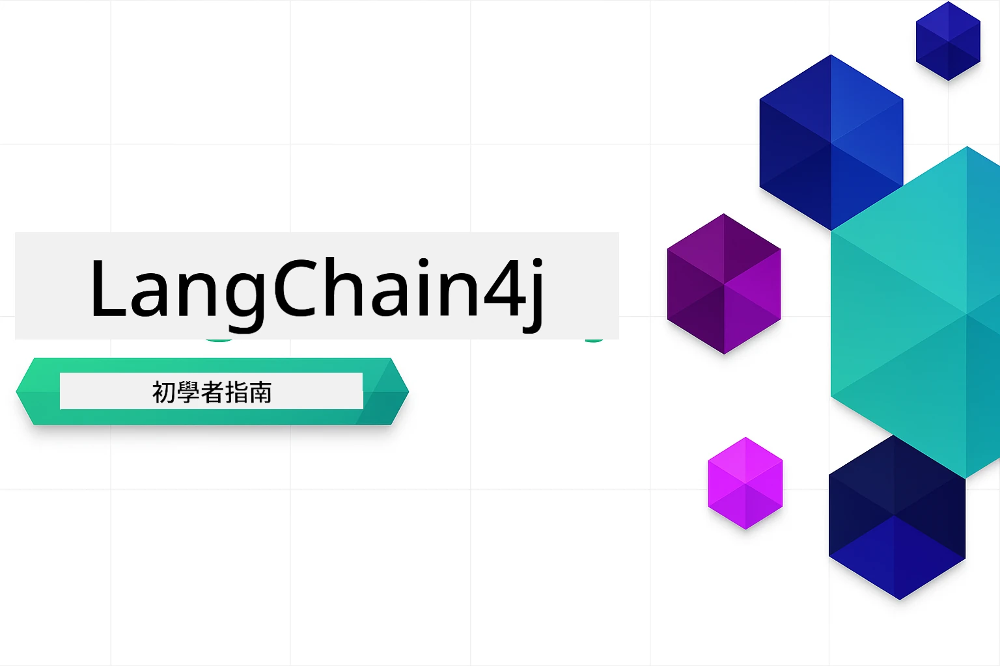

### 🌐 多語言支援

#### 透過 GitHub Action 支援（自動化且隨時更新）

<!-- CO-OP TRANSLATOR LANGUAGES TABLE START -->
[Arabic](../ar/README.md) | [Bengali](../bn/README.md) | [Bulgarian](../bg/README.md) | [Burmese (Myanmar)](../my/README.md) | [Chinese (Simplified)](../zh-CN/README.md) | [Chinese (Traditional, Hong Kong)](../zh-HK/README.md) | [Chinese (Traditional, Macau)](./README.md) | [Chinese (Traditional, Taiwan)](../zh-TW/README.md) | [Croatian](../hr/README.md) | [Czech](../cs/README.md) | [Danish](../da/README.md) | [Dutch](../nl/README.md) | [Estonian](../et/README.md) | [Finnish](../fi/README.md) | [French](../fr/README.md) | [German](../de/README.md) | [Greek](../el/README.md) | [Hebrew](../he/README.md) | [Hindi](../hi/README.md) | [Hungarian](../hu/README.md) | [Indonesian](../id/README.md) | [Italian](../it/README.md) | [Japanese](../ja/README.md) | [Kannada](../kn/README.md) | [Korean](../ko/README.md) | [Lithuanian](../lt/README.md) | [Malay](../ms/README.md) | [Malayalam](../ml/README.md) | [Marathi](../mr/README.md) | [Nepali](../ne/README.md) | [Nigerian Pidgin](../pcm/README.md) | [Norwegian](../no/README.md) | [Persian (Farsi)](../fa/README.md) | [Polish](../pl/README.md) | [Portuguese (Brazil)](../pt-BR/README.md) | [Portuguese (Portugal)](../pt-PT/README.md) | [Punjabi (Gurmukhi)](../pa/README.md) | [Romanian](../ro/README.md) | [Russian](../ru/README.md) | [Serbian (Cyrillic)](../sr/README.md) | [Slovak](../sk/README.md) | [Slovenian](../sl/README.md) | [Spanish](../es/README.md) | [Swahili](../sw/README.md) | [Swedish](../sv/README.md) | [Tagalog (Filipino)](../tl/README.md) | [Tamil](../ta/README.md) | [Telugu](../te/README.md) | [Thai](../th/README.md) | [Turkish](../tr/README.md) | [Ukrainian](../uk/README.md) | [Urdu](../ur/README.md) | [Vietnamese](../vi/README.md)

> **想本地複製？**

> 此存儲庫包含50+種語言翻譯，會大幅增加下載大小。若想不包含翻譯而複製，請使用稀疏檢出：
> ```bash
> git clone --filter=blob:none --sparse https://github.com/microsoft/LangChain4j-for-Beginners.git
> cd LangChain4j-for-Beginners
> git sparse-checkout set --no-cone '/*' '!translations' '!translated_images'
> ```
> 這能讓你以更快的速度下載，且擁有完成課程所需的一切。
<!-- CO-OP TRANSLATOR LANGUAGES TABLE END -->

# LangChain4j 新手入門

一門利用 LangChain4j 和 Azure OpenAI GPT-5 建立 AI 應用的課程，涵蓋從基本聊天到 AI 代理。

**剛接觸 LangChain4j？** 請參閱 [詞彙表](docs/GLOSSARY.md) 瞭解關鍵術語和概念。

## 目錄

1. [快速入門](00-quick-start/README.md) - 開始使用 LangChain4j
2. [介紹](01-introduction/README.md) - 學習 LangChain4j 的基本原理
3. [提示工程](02-prompt-engineering/README.md) - 掌握有效的提示設計
4. [RAG（檢索增強生成）](03-rag/README.md) - 建立智能知識系統
5. [工具](04-tools/README.md) - 整合外部工具及簡易助手
6. [MCP（模型上下文協議）](05-mcp/README.md) - 使用模型上下文協議 (MCP) 及代理模組
---

## 學習路徑

> **快速入門**

1. 將本存儲庫分叉到你的 GitHub 帳號
2. 點選 **Code** → **Codespaces** 標籤 → **...** → **New with options...**
3. 保持預設設定－這將選擇本課程所建立的開發容器
4. 點擊 **Create codespace**
5. 等待 5-10 分鐘環境準備完成
6. 直接跳至 [快速入門](./00-quick-start/README.md) 開始吧！

完成課程模組後，探索 [測試指南](docs/TESTING.md) 了解 LangChain4j 測試概念的實際應用。

> **注意：** 本訓練同時使用 GitHub Models 與 Azure OpenAI。[快速入門](00-quick-start/README.md) 模組使用 GitHub Models（無需 Azure 訂閱），而1至5章使用 Azure OpenAI。

## 使用 GitHub Copilot 學習

想快速開始編碼，請在 GitHub Codespace 或本地 IDE 中開啟專案，並使用本課程提供的 devcontainer。課程使用的 devcontainer 預先配置了 GitHub Copilot，方便 AI 配對編程。

每個程式碼範例都包含可供向 GitHub Copilot 詢問的建議問題，幫助你加深理解。請在以下位置尋找 💡/🤖 提示：

- **Java 檔案標頭** - 對應每個範例的專屬問題
- **模組 README** - 程式碼範例後的探索提示

**如何使用：** 打開任何程式碼檔案，向 Copilot 提問建議問題。它對整個程式碼庫瞭若指掌，可解釋、擴充並提出替代方案。

想了解更多？請參考 [AI 配對編程的 Copilot](https://aka.ms/GitHubCopilotAI)。

## 其他資源

<!-- CO-OP TRANSLATOR OTHER COURSES START -->
### LangChain
[](https://aka.ms/langchain4j-for-beginners)
[](https://aka.ms/langchainjs-for-beginners?WT.mc_id=m365-94501-dwahlin)

---

### Azure / Edge / MCP / Agents
[](https://github.com/microsoft/AZD-for-beginners?WT.mc_id=academic-105485-koreyst)
[](https://github.com/microsoft/edgeai-for-beginners?WT.mc_id=academic-105485-koreyst)
[](https://github.com/microsoft/mcp-for-beginners?WT.mc_id=academic-105485-koreyst)
[](https://github.com/microsoft/ai-agents-for-beginners?WT.mc_id=academic-105485-koreyst)

---
 
### 生成式 AI 系列
[](https://github.com/microsoft/generative-ai-for-beginners?WT.mc_id=academic-105485-koreyst)
[-9333EA?style=for-the-badge&labelColor=E5E7EB&color=9333EA)](https://github.com/microsoft/Generative-AI-for-beginners-dotnet?WT.mc_id=academic-105485-koreyst)
[-C084FC?style=for-the-badge&labelColor=E5E7EB&color=C084FC)](https://github.com/microsoft/generative-ai-for-beginners-java?WT.mc_id=academic-105485-koreyst)
[-E879F9?style=for-the-badge&labelColor=E5E7EB&color=E879F9)](https://github.com/microsoft/generative-ai-with-javascript?WT.mc_id=academic-105485-koreyst)

---
 
### 核心學習
[](https://aka.ms/ml-beginners?WT.mc_id=academic-105485-koreyst)
[](https://aka.ms/datascience-beginners?WT.mc_id=academic-105485-koreyst)
[](https://aka.ms/ai-beginners?WT.mc_id=academic-105485-koreyst)
[](https://github.com/microsoft/Security-101?WT.mc_id=academic-96948-sayoung)
[](https://aka.ms/webdev-beginners?WT.mc_id=academic-105485-koreyst)
[](https://aka.ms/iot-beginners?WT.mc_id=academic-105485-koreyst)
[](https://github.com/microsoft/xr-development-for-beginners?WT.mc_id=academic-105485-koreyst)

---
 
### Copilot 系列

[](https://aka.ms/GitHubCopilotAI?WT.mc_id=academic-105485-koreyst)
[](https://github.com/microsoft/mastering-github-copilot-for-dotnet-csharp-developers?WT.mc_id=academic-105485-koreyst)
[](https://github.com/microsoft/CopilotAdventures?WT.mc_id=academic-105485-koreyst)
<!-- CO-OP TRANSLATOR OTHER COURSES END -->

## 尋求幫助

如果你遇到困難或對建立 AI 應用程式有任何疑問，請加入：

[](https://aka.ms/foundry/discord)

如果你在開發中有產品反饋或錯誤，請訪問：

[](https://aka.ms/foundry/forum)

## 授權條款

MIT 授權條款 - 詳情請參閱 [LICENSE](../../LICENSE) 檔案。

---

<!-- CO-OP TRANSLATOR DISCLAIMER START -->
**免責聲明**：
本文件使用 AI 翻譯服務 [Co-op Translator](https://github.com/Azure/co-op-translator) 進行翻譯。雖然我們努力追求準確性，但請注意，自動翻譯可能包含錯誤或不準確之處。原始文件的母語版本應被視為權威來源。對於重要資訊，建議採用專業人工翻譯。我們不對因使用此翻譯而產生的任何誤解或誤釋承擔責任。
<!-- CO-OP TRANSLATOR DISCLAIMER END -->