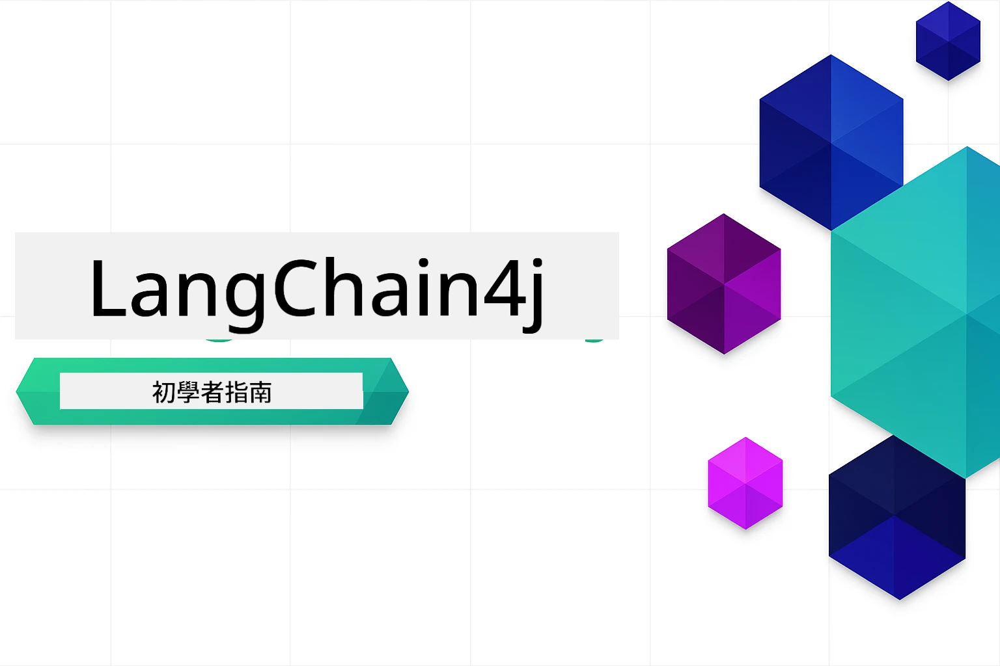

# LangChain4j 初學者課程

一門使用 LangChain4j 與 Azure OpenAI GPT-5.2 建構 AI 應用程式的課程，涵蓋從基礎對話到 AI 代理人。

### 🌐 多語言支援

#### 透過 GitHub 行動支援（自動且隨時更新）

<!-- CO-OP TRANSLATOR LANGUAGES TABLE START -->
[Arabic](../ar/README.md) | [Bengali](../bn/README.md) | [Bulgarian](../bg/README.md) | [Burmese (Myanmar)](../my/README.md) | [Chinese (Simplified)](../zh-CN/README.md) | [Chinese (Traditional, Hong Kong)](../zh-HK/README.md) | [Chinese (Traditional, Macau)](./README.md) | [Chinese (Traditional, Taiwan)](../zh-TW/README.md) | [Croatian](../hr/README.md) | [Czech](../cs/README.md) | [Danish](../da/README.md) | [Dutch](../nl/README.md) | [Estonian](../et/README.md) | [Finnish](../fi/README.md) | [French](../fr/README.md) | [German](../de/README.md) | [Greek](../el/README.md) | [Hebrew](../he/README.md) | [Hindi](../hi/README.md) | [Hungarian](../hu/README.md) | [Indonesian](../id/README.md) | [Italian](../it/README.md) | [Japanese](../ja/README.md) | [Kannada](../kn/README.md) | [Khmer](../km/README.md) | [Korean](../ko/README.md) | [Lithuanian](../lt/README.md) | [Malay](../ms/README.md) | [Malayalam](../ml/README.md) | [Marathi](../mr/README.md) | [Nepali](../ne/README.md) | [Nigerian Pidgin](../pcm/README.md) | [Norwegian](../no/README.md) | [Persian (Farsi)](../fa/README.md) | [Polish](../pl/README.md) | [Portuguese (Brazil)](../pt-BR/README.md) | [Portuguese (Portugal)](../pt-PT/README.md) | [Punjabi (Gurmukhi)](../pa/README.md) | [Romanian](../ro/README.md) | [Russian](../ru/README.md) | [Serbian (Cyrillic)](../sr/README.md) | [Slovak](../sk/README.md) | [Slovenian](../sl/README.md) | [Spanish](../es/README.md) | [Swahili](../sw/README.md) | [Swedish](../sv/README.md) | [Tagalog (Filipino)](../tl/README.md) | [Tamil](../ta/README.md) | [Telugu](../te/README.md) | [Thai](../th/README.md) | [Turkish](../tr/README.md) | [Ukrainian](../uk/README.md) | [Urdu](../ur/README.md) | [Vietnamese](../vi/README.md)

> **想本地克隆？**
>
> 此儲存庫包含 50 多種語言翻譯，會顯著增加下載大小。若想不含翻譯地克隆，請使用稀疏檢出：
>
> **Bash / macOS / Linux：**
> ```bash
> git clone --filter=blob:none --sparse https://github.com/microsoft/LangChain4j-for-Beginners.git
> cd LangChain4j-for-Beginners
> git sparse-checkout set --no-cone '/*' '!translations' '!translated_images'
> ```
>
> **CMD (Windows)：**
> ```cmd
> git clone --filter=blob:none --sparse https://github.com/microsoft/LangChain4j-for-Beginners.git
> cd LangChain4j-for-Beginners
> git sparse-checkout set --no-cone "/*" "!translations" "!translated_images"
> ```
>
> 這樣你將獲得完成本課程所需的所有資料，且下載速度更快。
<!-- CO-OP TRANSLATOR LANGUAGES TABLE END -->

## 目錄

1. [介紹](01-introduction/README.md) - 學習 LangChain4j 的基本原理
2. [提示工程](02-prompt-engineering/README.md) - 精通有效的提示設計
3. [RAG（檢索增強生成）](03-rag/README.md) - 建構智能知識基礎系統
4. [工具](04-tools/README.md) - 整合外部工具及簡易助理
5. [MCP（模型上下文協議）](05-mcp/README.md) - 使用模型上下文協議（MCP）與代理模組

### 影片導覽

每個模組附有線上直播課程，逐步帶你理解概念與程式碼。

| 模組 | 影片 |
|--------|-------|
| 01 - 介紹 | [LangChain4j 入門教學](https://www.youtube.com/live/nl_troDm8rQ) |
| 02 - 提示工程 | [LangChain4j 的提示工程](https://www.youtube.com/live/PJ6aBaE6bog) |
| 03 - RAG | [LangChain4j 的 RAG](https://www.youtube.com/watch?v=_olq75ZH_eY) |
| 04 - 工具 & 05 - MCP | [具工具和 MCP 的 AI 代理人](https://www.youtube.com/watch?v=O_J30kZc0rw) |

---

## 學習路徑

**LangChain4j 新手？** 查看 [術語表](docs/GLOSSARY.md) 以瞭解重要術語和概念。

> <strong>快速開始</strong>

1. 將此儲存庫 fork 到你的 GitHub 帳號
2. 點選 **Code** → **Codespaces** 標籤 → **...** → **從選項新建...**
3. 使用預設設定 — 此設定將選擇為本課程建立的開發容器
4. 點擊 **Create codespace**
5. 等待 5-10 分鐘，直到環境準備就緒
6. 直接跳至 [介紹](./01-introduction/README.md) 開始學習！

完成模組後，探索 [測試指南](docs/TESTING.md)，了解 LangChain4j 的測試實務。

> **注意：** 本訓練使用 Azure OpenAI。如尚無帳號，請使用 [免費 Azure 帳號](https://aka.ms/azure-free-account) 開始。


## 使用 GitHub Copilot 學習

想快速開始撰寫程式？可在 GitHub Codespace 或本機 IDE 中開啟此專案，搭配提供的 devcontainer。該 devcontainer 已預先配置 GitHub Copilot，支援 AI 配對編程。

每個程式碼範例都包含建議問題，可提問 GitHub Copilot 以加深理解。請留意以下位置的 💡/🤖 提示：

- **Java 檔案標頭** — 針對個別範例的問題
- **模組 README** — 程式碼範例後的探索提示

**使用方式：** 開啟任一程式碼檔案，向 Copilot 詢問建議問題。它擁有完整程式碼庫上下文，能說明、延伸、並提出替代方案。

想瞭解更多？請參考 [AI 配對編程的 Copilot](https://aka.ms/GitHubCopilotAI)。


## 額外資源

<!-- CO-OP TRANSLATOR OTHER COURSES START -->
### LangChain
[](https://aka.ms/langchain4j-for-beginners)
[](https://aka.ms/langchainjs-for-beginners?WT.mc_id=m365-94501-dwahlin)
[](https://github.com/microsoft/langchain-for-beginners?WT.mc_id=m365-94501-dwahlin)
---

### Azure / Edge / MCP / Agents
[](https://github.com/microsoft/AZD-for-beginners?WT.mc_id=academic-105485-koreyst)
[](https://github.com/microsoft/edgeai-for-beginners?WT.mc_id=academic-105485-koreyst)
[](https://github.com/microsoft/mcp-for-beginners?WT.mc_id=academic-105485-koreyst)
[](https://github.com/microsoft/ai-agents-for-beginners?WT.mc_id=academic-105485-koreyst)

---
 
### 生成式 AI 系列
[](https://github.com/microsoft/generative-ai-for-beginners?WT.mc_id=academic-105485-koreyst)
[-9333EA?style=for-the-badge&labelColor=E5E7EB&color=9333EA)](https://github.com/microsoft/Generative-AI-for-beginners-dotnet?WT.mc_id=academic-105485-koreyst)
[-C084FC?style=for-the-badge&labelColor=E5E7EB&color=C084FC)](https://github.com/microsoft/generative-ai-for-beginners-java?WT.mc_id=academic-105485-koreyst)
[-E879F9?style=for-the-badge&labelColor=E5E7EB&color=E879F9)](https://github.com/microsoft/generative-ai-with-javascript?WT.mc_id=academic-105485-koreyst)

---
 
### 核心學習
[](https://aka.ms/ml-beginners?WT.mc_id=academic-105485-koreyst)
[](https://aka.ms/datascience-beginners?WT.mc_id=academic-105485-koreyst)
[](https://aka.ms/ai-beginners?WT.mc_id=academic-105485-koreyst)
[](https://github.com/microsoft/Security-101?WT.mc_id=academic-96948-sayoung)
[](https://aka.ms/webdev-beginners?WT.mc_id=academic-105485-koreyst)
[](https://aka.ms/iot-beginners?WT.mc_id=academic-105485-koreyst)
[](https://github.com/microsoft/xr-development-for-beginners?WT.mc_id=academic-105485-koreyst)

---
 
### Copilot 系列
[](https://aka.ms/GitHubCopilotAI?WT.mc_id=academic-105485-koreyst)
[](https://github.com/microsoft/mastering-github-copilot-for-dotnet-csharp-developers?WT.mc_id=academic-105485-koreyst)
[](https://github.com/microsoft/CopilotAdventures?WT.mc_id=academic-105485-koreyst)
<!-- CO-OP TRANSLATOR OTHER COURSES END -->

## 獲取幫助

如果你遇到困難或對構建 AI 應用有任何疑問，請加入：

[](https://aka.ms/foundry/discord)

如果你在構建過程中有產品反饋或錯誤，請訪問：

[](https://aka.ms/foundry/forum)

## 授權

MIT 授權 - 詳情請見 [LICENSE](../../LICENSE) 檔案。

---

<!-- CO-OP TRANSLATOR DISCLAIMER START -->
**免責聲明**：
本文件使用 AI 翻譯服務 [Co-op Translator](https://github.com/Azure/co-op-translator) 進行翻譯。雖然我們力求準確，但請注意，自動翻譯可能包含錯誤或不準確之處。原始文件的母語版本應被視為權威來源。對於重要資訊，建議尋求專業人工翻譯。我們不對因使用本翻譯而引起的任何誤解或曲解承擔責任。
<!-- CO-OP TRANSLATOR DISCLAIMER END -->