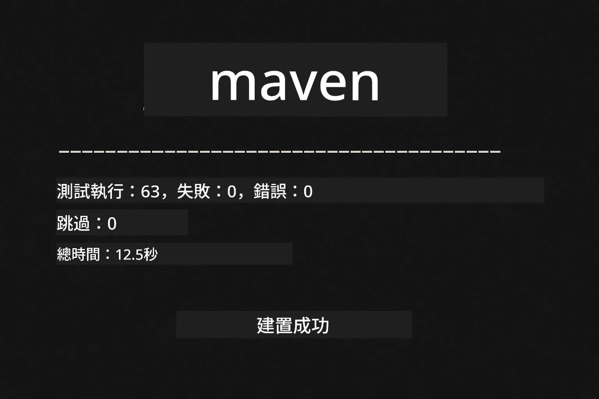
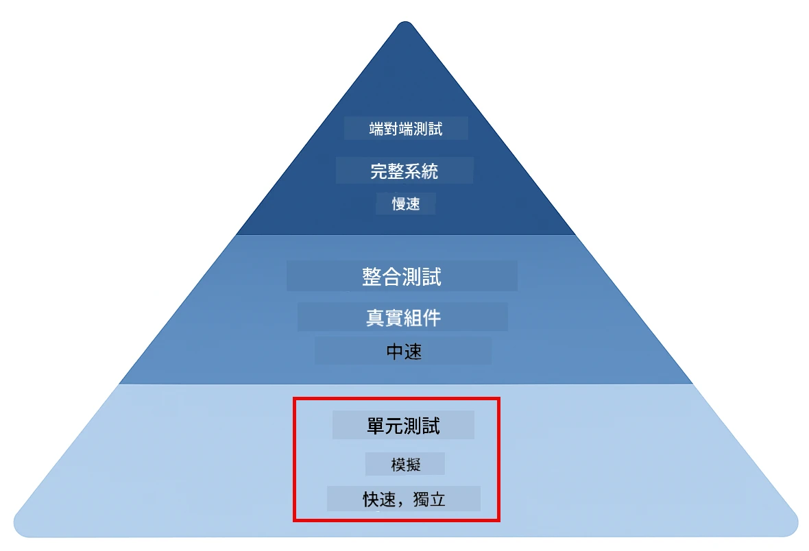
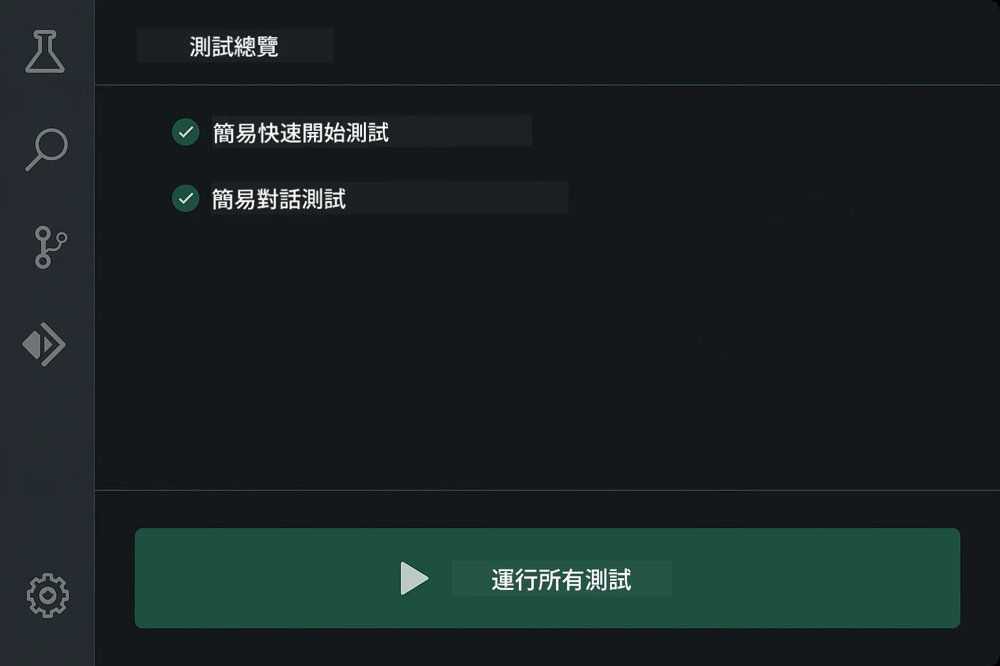
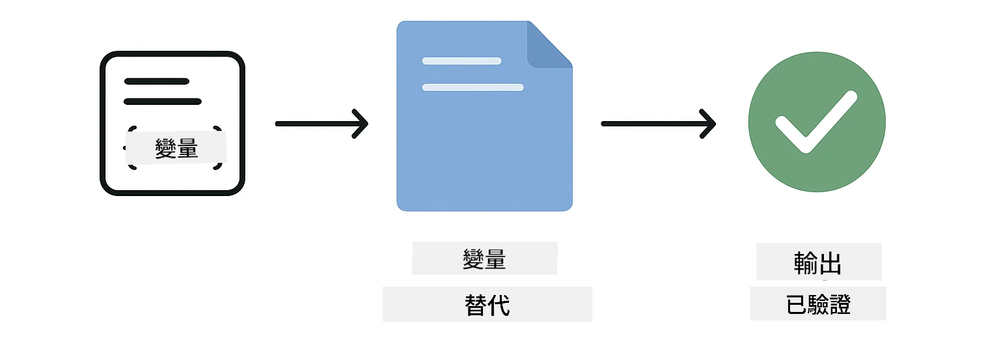
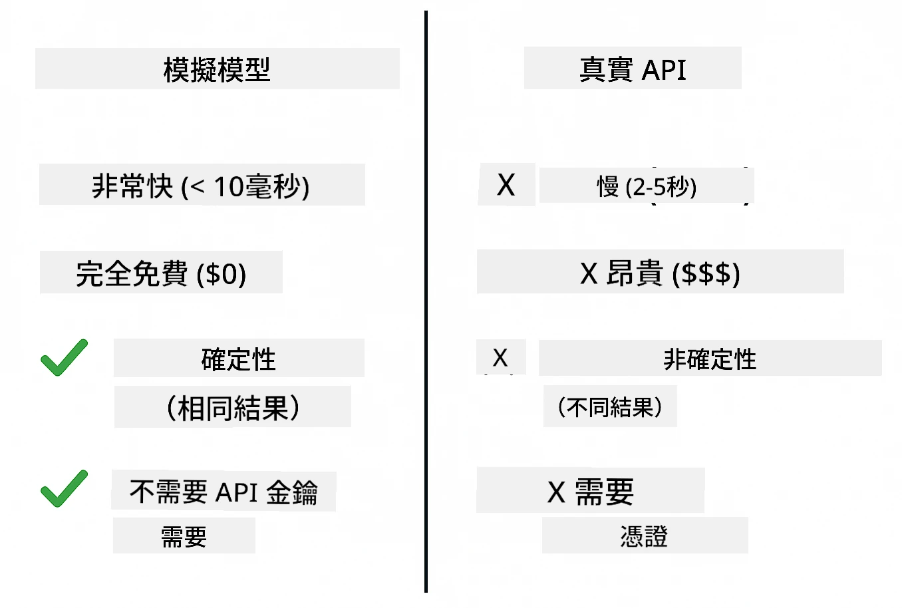
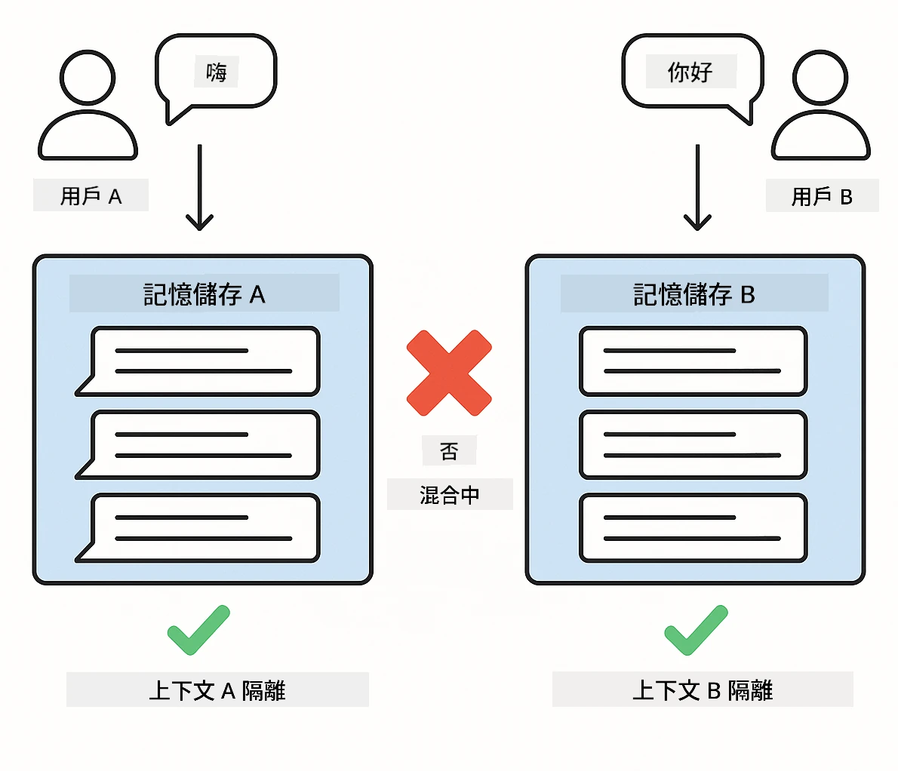
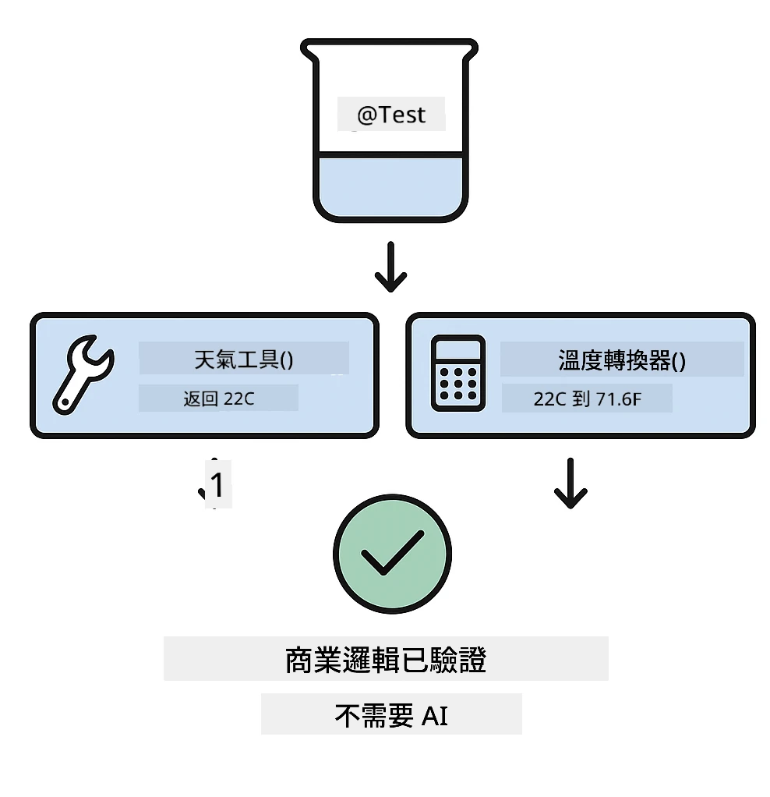
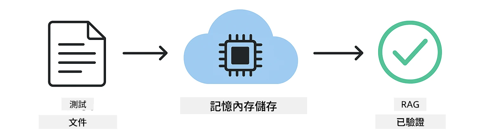

# 測試 LangChain4j 應用程式

## 目錄

- [快速入門](#快速入門)
- [測試涵蓋範圍](#測試涵蓋範圍)
- [執行測試](#執行測試)
- [在 VS Code 中執行測試](#在-vs-code-中執行測試)
- [測試範式](#測試範式)
- [測試哲學](#測試哲學)
- [下一步](#下一步)

本指南將帶領你了解如何在不需使用 API 金鑰或外部服務的情況下，測試 AI 應用程式的內容。

## 快速入門

使用單一指令執行所有測試：

**Bash:**
```bash
mvn test
```

**PowerShell:**
```powershell
mvn --% test
```

全部測試通過後，你應該會看到如下截圖所示的輸出 — 沒有失敗的測試。



*成功執行測試，顯示所有測試均通過，無失敗*

## 測試涵蓋範圍

本課程主要關注於本地執行的<strong>單元測試</strong>。每個測試演示一個獨立的 LangChain4j 概念。下方的測試金字塔展示單元測試的位置 — 它們構成快速且可靠的基礎，支撐你其餘的測試策略。



*測試金字塔展示單元測試（快速、獨立）、整合測試（實體組件）與端對端測試的平衡。本訓練涵蓋單元測試。*

| 模塊 | 測試數 | 焦點 | 主要檔案 |
|--------|-------|-------|-----------|
| **01 - 介紹** | 8 | 會話記憶與有狀態聊天 | `SimpleConversationTest.java` |
| **02 - 提示工程** | 12 | GPT-5.2 範式、急切程度、結構化輸出 | `SimpleGpt5PromptTest.java` |
| **03 - RAG** | 10 | 文件攝取、嵌入、相似度搜索 | `DocumentServiceTest.java` |
| **04 - 工具** | 12 | 函數呼叫與工具鏈接 | `SimpleToolsTest.java` |
| **05 - MCP** | 8 | 透過 Stdio 傳輸的模型上下文協議 | `SimpleMcpTest.java` |

## 執行測試

**從根目錄執行所有測試：**

**Bash:**
```bash
mvn test
```

**PowerShell:**
```powershell
mvn --% test
```

**執行特定模塊的測試：**

**Bash:**
```bash
cd 01-introduction && mvn test
# 或從根目錄開始
mvn test -pl 01-introduction
```

**PowerShell:**
```powershell
cd 01-introduction; mvn --% test
# 或者從根目錄開始
mvn --% test -pl 01-introduction
```

**執行單一測試類別：**

**Bash:**
```bash
mvn test -Dtest=SimpleConversationTest
```

**PowerShell:**
```powershell
mvn --% test -Dtest=SimpleConversationTest
```

**執行特定測試方法：**

**Bash:**
```bash
mvn test -Dtest=SimpleConversationTest#應該維持對話歷史
```

**PowerShell:**
```powershell
mvn --% test -Dtest=SimpleConversationTest#應該保持對話歷史
```

## 在 VS Code 中執行測試

若使用 Visual Studio Code，測試瀏覽器提供圖形介面以執行與除錯測試。



*VS Code 測試瀏覽器顯示具有所有 Java 測試類與各個測試方法的樹狀結構*

**在 VS Code 中執行測試步驟：**

1. 點擊活動欄中的試管圖示以開啟測試瀏覽器
2. 展開測試樹以查看所有模組和測試類
3. 點擊任一測試旁的播放按鈕以單獨執行該測試
4. 點擊「執行所有測試」以執行整個測試套件
5. 右鍵點擊任一測試並選擇「除錯測試」以設定斷點並逐步執行程式碼

通過的測試會顯示綠色勾號，失敗時則會提供詳細的錯誤訊息。

## 測試範式

### 範式 1：測試提示範本

最簡單的範式是測試提示範本而不呼叫任何 AI 模型。你將驗證變數替換是否正確，以及提示是否按預期格式化。



*測試提示範本展示變數替換流程：帶有佔位符的範本 → 應用變數值 → 驗證格式化輸出*

```java
@Test
@DisplayName("Should format prompt template with variables")
void testPromptTemplateFormatting() {
    PromptTemplate template = PromptTemplate.from(
        "Best time to visit {{destination}} for {{activity}}?"
    );
    
    Prompt prompt = template.apply(Map.of(
        "destination", "Paris",
        "activity", "sightseeing"
    ));
    
    assertThat(prompt.text()).isEqualTo("Best time to visit Paris for sightseeing?");
}
```

此範式驗證變數替換功能是否正確，並確保提示格式符合預期 — 無需 API 金鑰或模型呼叫。

### 範式 2：模擬語言模型

在測試會話邏輯時，使用 Mockito 建立假模型，讓其返回預設回應。這使測試快速、免費且具決定性。



*比較展示為何測試偏好使用模擬：模擬快速、免費、決定性且不需 API 金鑰*

```java
@ExtendWith(MockitoExtension.class)
class SimpleConversationTest {
    
    private ConversationService conversationService;
    
    @Mock
    private OpenAiOfficialChatModel mockChatModel;
    
    @BeforeEach
    void setUp() {
        ChatResponse mockResponse = ChatResponse.builder()
            .aiMessage(AiMessage.from("This is a test response"))
            .build();
        when(mockChatModel.chat(anyList())).thenReturn(mockResponse);
        
        conversationService = new ConversationService(mockChatModel);
    }
    
    @Test
    void shouldMaintainConversationHistory() {
        String conversationId = conversationService.startConversation();
        
        ChatResponse mockResponse1 = ChatResponse.builder()
            .aiMessage(AiMessage.from("Response 1"))
            .build();
        ChatResponse mockResponse2 = ChatResponse.builder()
            .aiMessage(AiMessage.from("Response 2"))
            .build();
        ChatResponse mockResponse3 = ChatResponse.builder()
            .aiMessage(AiMessage.from("Response 3"))
            .build();
        
        when(mockChatModel.chat(anyList()))
            .thenReturn(mockResponse1)
            .thenReturn(mockResponse2)
            .thenReturn(mockResponse3);

        conversationService.chat(conversationId, "First message");
        conversationService.chat(conversationId, "Second message");
        conversationService.chat(conversationId, "Third message");

        List<ChatMessage> history = conversationService.getHistory(conversationId);
        assertThat(history).hasSize(6); // 3 個用戶 + 3 個 AI 訊息
    }
}
```

此範式出現在 `01-introduction/src/test/java/com/example/langchain4j/service/SimpleConversationTest.java`。模擬確保一致行為，因此你可以驗證記憶管理的正確性。

### 範式 3：測試會話隔離

會話記憶必須區分多位使用者。本測試確認會話不會混淆使用者上下文。



*測試會話隔離，顯示不同用戶的獨立記憶存儲以防混淆上下文*

```java
@Test
void shouldIsolateConversationsByid() {
    String conv1 = conversationService.startConversation();
    String conv2 = conversationService.startConversation();
    
    ChatResponse mockResponse = ChatResponse.builder()
        .aiMessage(AiMessage.from("Response"))
        .build();
    when(mockChatModel.chat(anyList())).thenReturn(mockResponse);

    conversationService.chat(conv1, "Message for conversation 1");
    conversationService.chat(conv2, "Message for conversation 2");

    List<ChatMessage> history1 = conversationService.getHistory(conv1);
    List<ChatMessage> history2 = conversationService.getHistory(conv2);
    
    assertThat(history1).hasSize(2);
    assertThat(history2).hasSize(2);
}
```

每個會話維持自己的獨立歷史。在生產系統中，這種隔離對於多用戶應用程式至關重要。

### 範式 4：獨立測試工具

工具是 AI 可呼叫的函數。直接測試工具以確保其功能正確，無需依賴 AI 決策。



*獨立測試工具，顯示模擬工具執行而不含 AI 呼叫以驗證業務邏輯*

```java
@Test
void shouldConvertCelsiusToFahrenheit() {
    TemperatureTool tempTool = new TemperatureTool();
    String result = tempTool.celsiusToFahrenheit(25.0);
    assertThat(result).containsPattern("77[.,]0°F");
}

@Test
void shouldDemonstrateToolChaining() {
    WeatherTool weatherTool = new WeatherTool();
    TemperatureTool tempTool = new TemperatureTool();

    String weatherResult = weatherTool.getCurrentWeather("Seattle");
    assertThat(weatherResult).containsPattern("\\d+°C");

    String conversionResult = tempTool.celsiusToFahrenheit(22.0);
    assertThat(conversionResult).containsPattern("71[.,]6°F");
}
```

這些測試來自 `04-tools/src/test/java/com/example/langchain4j/agents/tools/SimpleToolsTest.java`，用來驗證工具邏輯無需 AI 參與。鏈接範例展示一個工具的輸出如何作為另一個工具的輸入。

### 範式 5：記憶中 RAG 測試

RAG 系統一般需向量資料庫與嵌入服務。記憶中範式讓你不依賴外部套件，測試整個流程。



*記憶中 RAG 測試流程，展示文件解析、嵌入存儲及相似度搜索，無需資料庫*

```java
@Test
void testProcessTextDocument() {
    String content = "This is a test document.\nIt has multiple lines.";
    InputStream inputStream = new ByteArrayInputStream(content.getBytes(StandardCharsets.UTF_8));
    
    DocumentService.ProcessedDocument result = 
        documentService.processDocument(inputStream, "test.txt");

    assertNotNull(result);
    assertTrue(result.segments().size() > 0);
    assertEquals("test.txt", result.segments().get(0).metadata().getString("filename"));
}
```

此測試出自 `03-rag/src/test/java/com/example/langchain4j/rag/service/DocumentServiceTest.java`，在記憶中創建文件，並驗證分段與元資料處理。

### 範式 6：MCP 整合測試

MCP 模組測試透過 stdio 傳輸的模型上下文協議整合。這些測試確認你的應用能啟動並與 MCP 伺服器子程序通訊。

`05-mcp/src/test/java/com/example/langchain4j/mcp/SimpleMcpTest.java` 中包含相關驗證 MCP 用戶端行為的測試。

**執行命令：**

**Bash:**
```bash
cd 05-mcp && mvn test
```

**PowerShell:**
```powershell
cd 05-mcp; mvn --% test
```

## 測試哲學

測試你的程式碼，而不是 AI。本測試應該驗證你撰寫的程式碼，例如提示如何建構、記憶如何管理、工具如何執行。AI 回應會變化，不應成為測試斷言的一部分。你應該確認提示範本是否正確替換變數，而非 AI 是否給出正確答案。

對語言模型使用模擬。它們是外部依賴，執行緩慢、昂貴且非決定性。模擬讓測試快速（毫秒級而非秒）、免費且結果一致。

保持測試獨立。每個測試應自行建立資料，不依賴其他測試，且執行後會清理環境。不論測試順序如何，皆應通過。

測試邊界情況，而非只有理想情況。嘗試空輸入、極大輸入、特殊字元、無效參數與邊界條件。這些通常能揭露日常使用未暴露的錯誤。

使用具描述性的名稱。對比 `shouldMaintainConversationHistoryAcrossMultipleMessages()` 和 `test1()`。前者明確說明測試內容，令除錯失敗更容易。

## 下一步

了解測試範式後，深入探索每個模組：

- **[01 - 介紹](../01-introduction/README.md)** - 學習會話記憶管理
- **[02 - 提示工程](../02/prompt-engineering/README.md)** - 精通 GPT-5.2 提示範式
- **[03 - RAG](../03-rag/README.md)** - 建立檢索增強生成系統
- **[04 - 工具](../04-tools/README.md)** - 實作函數呼叫與工具鏈
- **[05 - MCP](../05-mcp/README.md)** - 整合模型上下文協議

各模組 README 對此處所測試的概念提供詳細介紹。

---

**導覽：** [← 返回主頁](../README.md)

---

<!-- CO-OP TRANSLATOR DISCLAIMER START -->
**免責聲明**：
本文件使用 AI 翻譯服務 [Co-op Translator](https://github.com/Azure/co-op-translator) 進行翻譯。雖然我們力求準確，但請注意，自動翻譯可能包含錯誤或不準確之處。原始文件的母語版本應被視為權威來源。對於重要資訊，建議尋求專業人工翻譯。我們不對因使用本翻譯而引起的任何誤解或曲解承擔責任。
<!-- CO-OP TRANSLATOR DISCLAIMER END -->