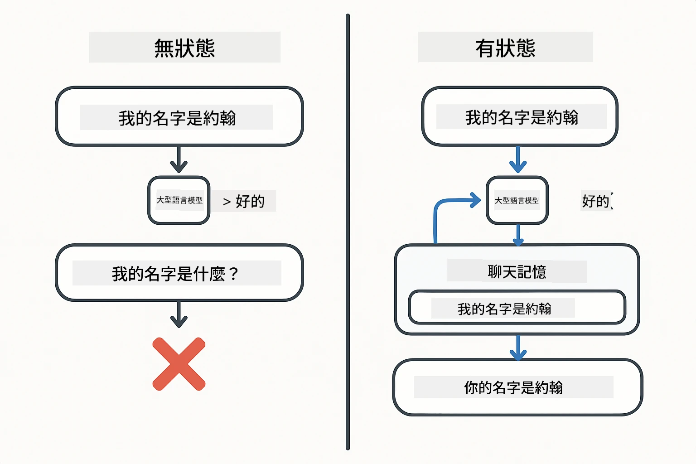
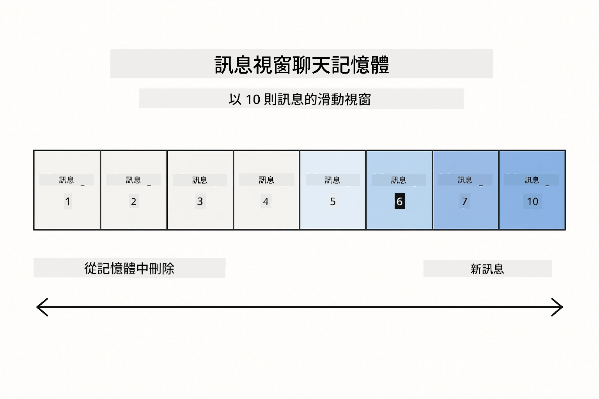
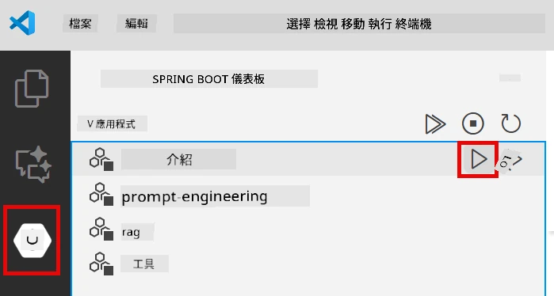
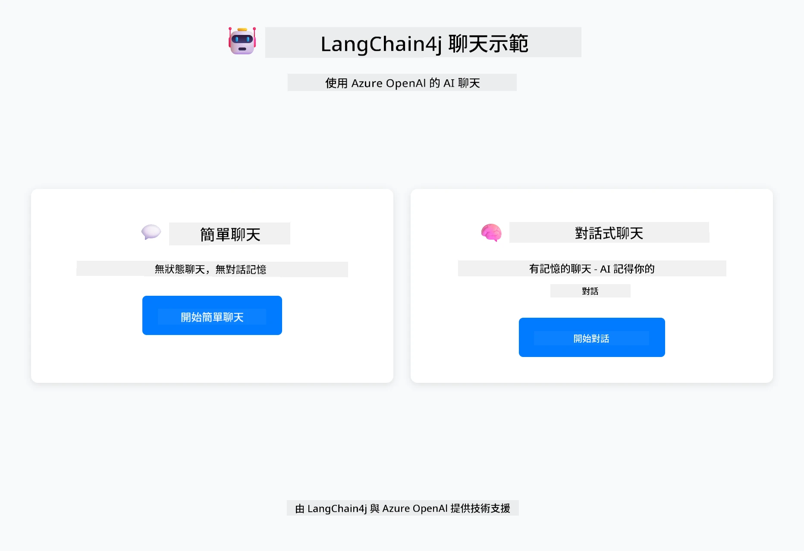
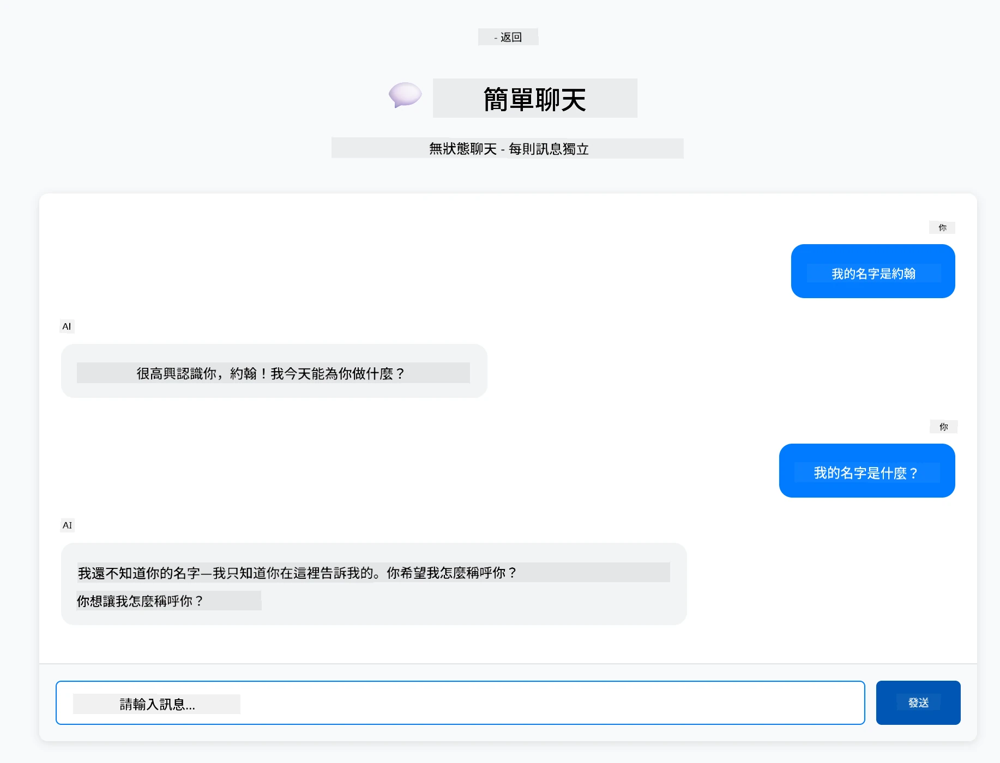
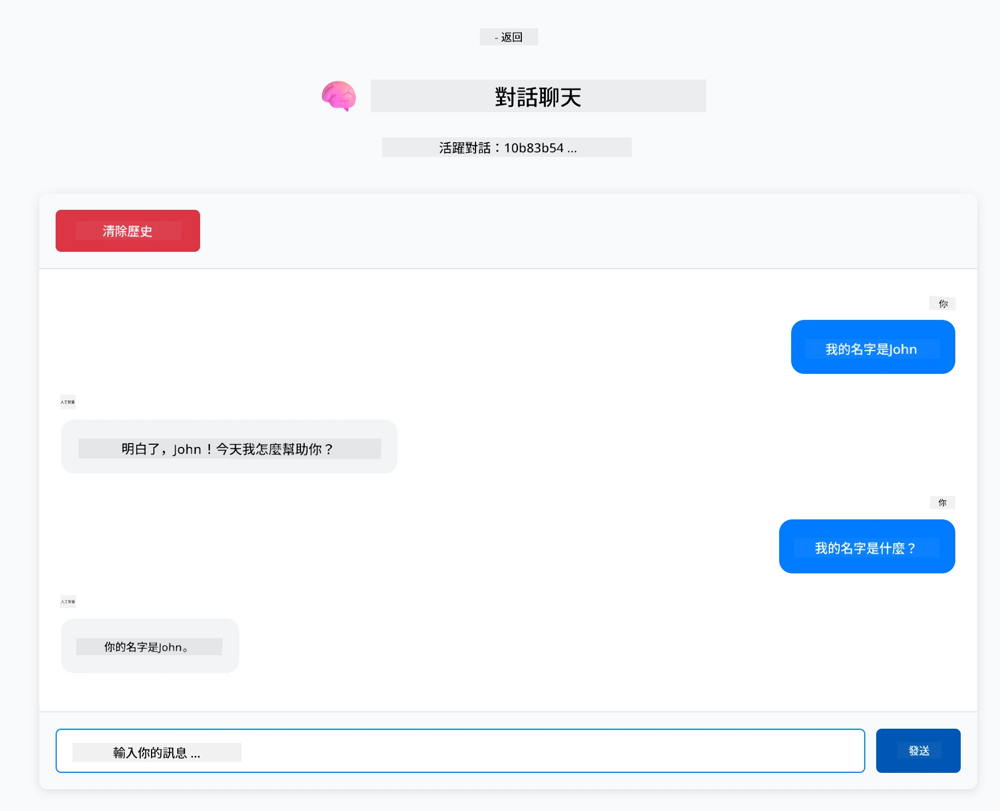

# Module 01: 使用 LangChain4j 入門

## 目錄

- [影片導覽](#影片導覽)
- [您將學到什麼](#您將學到什麼)
- [先決條件](#先決條件)
- [理解核心問題](#理解核心問題)
- [理解 Tokens](#理解-tokens)
- [記憶如何運作](#記憶如何運作)
- [本模組如何使用 LangChain4j](#本模組如何使用-langchain4j)
- [部署 Azure OpenAI 基礎架構](#部署-azure-openai-基礎架構)
- [在本機執行應用程式](#在本機執行應用程式)
- [使用應用程式](#使用應用程式)
  - [無狀態聊天（左側面板）](#無狀態聊天（左側面板）)
  - [有狀態聊天（右側面板）](#有狀態聊天（右側面板）)
- [後續步驟](#後續步驟)

## 影片導覽

觀看此直播課程，說明如何開始使用本模組：

<a href="https://www.youtube.com/live/nl_troDm8rQ?si=6b85S8xGjWnT2fX9"></a>

## 您將學到什麼

這是您使用 LangChain4j 和 Azure OpenAI 的起點。我們從基礎開始，逐步構建生產級應用程式。本模組專注於會記憶上下文且維持狀態的對話式 AI——這是後續所有模組的基礎概念。

整個指南中，我們將使用 Azure OpenAI 的 GPT-5.2，因為其強大的推理能力能讓不同模式的行為差異更為明顯。當您加入記憶功能時，即可明確看出差異。這讓您更容易理解每個組件如何強化您的應用程式。

您將建立一個示範兩種模式的應用：

<strong>無狀態聊天</strong> - 每個請求彼此獨立。模型不會記憶先前訊息。這是最簡單的起點。

<strong>有狀態對話</strong> - 每次請求包含對話歷史。模型跨多輪保持上下文。這是生產應用所需。

## 先決條件

- 具有 Azure OpenAI 權限的 Azure 訂閱
- Java 21, Maven 3.9+
- Azure CLI (https://learn.microsoft.com/en-us/cli/azure/install-azure-cli)
- Azure Developer CLI (azd) (https://learn.microsoft.com/en-us/azure/developer/azure-developer-cli/install-azd)

> **注意：** 提供的開發容器中已預先安裝 Java、Maven、Azure CLI 和 Azure Developer CLI (azd)。

> **注意：** 本模組使用 Azure OpenAI 上的 GPT-5.2。部署會透過 `azd up` 自動設定，請勿在程式碼中修改模型名稱。

## 理解核心問題

語言模型是無狀態的。每個 API 呼叫都是獨立的。如果您說「我的名字是 John」，接著問「我叫什麼名字？」，模型其實不知道您剛剛自我介紹。它會把每個請求視為您人生中第一次對話。

這對簡單問答問題沒問題，但對實際應用卻毫無用處。客服聊天機器人需要記憶您告訴他的資訊。個人助理需要上下文。任何多輪對話都需要記憶。

下面圖示對比兩種做法——左邊是無狀態呼叫，會忘記您的名字；右邊是有 ChatMemory 支援的有狀態呼叫，記得您的名字。



*無狀態（獨立呼叫）與有狀態（上下文感知）對話的差異*

## 理解 Tokens

在探討對話前，先了解 tokens －語言模型處理文本的基本單位，非常重要：


*文本如何拆解成 tokens 的範例 — 「I love AI!」變成 4 個獨立處理單位*

tokens 是 AI 模型衡量與處理文本的方式。字詞、標點符號甚至空格都能成為 tokens。您的模型一次可處理的 token 數有限（GPT-5.2 為 40 萬，輸入最高 272,000，輸出最高 128,000）。了解 tokens 有助於管理對話長度與花費。

## 記憶如何運作

聊天記憶解決了無狀態問題，維持對話歷史。在您送出請求給模型前，框架會先放入相關的先前訊息。當您問「我叫什麼名字？」時，系統會把整個對話歷史送出，讓模型知道您之前說過「我的名字是 John」。

LangChain4j 提供的記憶實作會自動處理這些問題。您可以設定保留的訊息數量，框架會管理上下文視窗。下圖顯示 MessageWindowChatMemory 如何維持近期訊息的滑動視窗。



*MessageWindowChatMemory 維持近期訊息的滑動視窗，自動丟棄舊訊息*

## 本模組如何使用 LangChain4j

本模組整合了 Spring Boot 並加入對話記憶。整體架構如下：

<strong>相依套件</strong> - 新增兩個 LangChain4j 函式庫：

```xml
<dependency>
    <groupId>dev.langchain4j</groupId>
    <artifactId>langchain4j</artifactId> <!-- Inherited from BOM in root pom.xml -->
</dependency>
<dependency>
    <groupId>dev.langchain4j</groupId>
    <artifactId>langchain4j-open-ai-official</artifactId> <!-- Inherited from BOM in root pom.xml -->
</dependency>
```

<strong>聊天模型</strong> - 配置 Azure OpenAI 為 Spring bean ([LangChainConfig.java](../../../01-introduction/src/main/java/com/example/langchain4j/config/LangChainConfig.java))：

```java
@Bean
public OpenAiOfficialChatModel openAiOfficialChatModel() {
    return OpenAiOfficialChatModel.builder()
            .baseUrl(azureEndpoint)
            .apiKey(azureApiKey)
            .modelName(deploymentName)
            .timeout(Duration.ofMinutes(5))
            .maxRetries(3)
            .build();
}
```

建構器會從 `azd up` 設定的環境變數讀取憑證。設定 `baseUrl` 為您的 Azure 端點可讓 OpenAI 用戶端正確使用 Azure OpenAI。

<strong>對話記憶</strong> - 使用 MessageWindowChatMemory 跟蹤聊天歷史 ([ConversationService.java](../../../01-introduction/src/main/java/com/example/langchain4j/service/ConversationService.java))：

```java
ChatMemory memory = MessageWindowChatMemory.withMaxMessages(10);

memory.add(UserMessage.from("My name is John"));
memory.add(AiMessage.from("Nice to meet you, John!"));

memory.add(UserMessage.from("What's my name?"));
AiMessage aiMessage = chatModel.chat(memory.messages()).aiMessage();
memory.add(aiMessage);
```

建立時調用 `withMaxMessages(10)` 保留最近 10 則訊息。使用帶型別包裝的方式新增使用者和 AI 訊息：`UserMessage.from(text)` 和 `AiMessage.from(text)`。透過 `memory.messages()` 取得歷史訊息，再送至模型。服務會依對話 ID 儲存不同記憶實體，允許多用戶同時聊天。

> **🤖 嘗試用 [GitHub Copilot](https://github.com/features/copilot) 聊天：** 打開 [`ConversationService.java`](../../../01-introduction/src/main/java/com/example/langchain4j/service/ConversationService.java)，問：
> - 「MessageWindowChatMemory 滑動視窗滿時如何決定丟棄哪些訊息？」
> - 「我可以用資料庫實作自訂記憶存儲取代記憶體中儲存嗎？」
> - 「要如何加入摘要功能以壓縮舊的對話歷史？」

無狀態聊天端點完全跳過記憶，像快篩一樣直接呼叫 `chatModel.chat(prompt)`。有狀態端點會將訊息加入記憶，抓取歷史並在每次請求中包含上下文。模型設定同樣，模式不同。

## 部署 Azure OpenAI 基礎架構

**Bash 指令：**
```bash
cd 01-introduction
azd up  # 選擇訂閱和位置（建議使用 eastus2）
```

**PowerShell 指令：**
```powershell
cd 01-introduction
azd up  # 選擇訂閱和位置（建議使用 eastus2）
```

> **注意：** 若遇到逾時錯誤（`RequestConflict: Cannot modify resource ... provisioning state is not terminal`），只需再執行一次 `azd up`。Azure 資源可能還在背景佈建，重試即可等資源進入最終狀態完成佈署。

此步驟會：
1. 部署 Azure OpenAI 資源，包含 GPT-5.2 和 text-embedding-3-small 模型
2. 自動生成根目錄的 `.env` 憑證檔案
3. 設定所有必要的環境變數

**部署有問題？** 請參考 [Infrastructure README](infra/README.md) 詳盡故障排除說明，包括子網域名稱衝突、手動 Azure 入口網站部署步驟及模型設定指導。

**驗證部署成功：**

**Bash 指令：**
```bash
cat ../.env  # 應該顯示 AZURE_OPENAI_ENDPOINT、API_KEY 等。
```

**PowerShell 指令：**
```powershell
Get-Content ..\.env  # 應該顯示 AZURE_OPENAI_ENDPOINT、API_KEY 等等。
```

> **注意：** `azd up` 會自動生成 `.env` 檔。若日後需更新，您可手動編輯 `.env` 或重新生成：
>
> **Bash 指令：**
> ```bash
> cd ..
> bash .azd-env.sh
> ```
>
> **PowerShell 指令：**
> ```powershell
> cd ..
> .\.azd-env.ps1
> ```

## 在本機執行應用程式

**驗證部署：**

確保根目錄存在含 Azure 憑證的 `.env` 檔。於模組目錄（`01-introduction/`）執行：

**Bash 指令：**
```bash
cat ../.env  # 應該顯示 AZURE_OPENAI_ENDPOINT、API_KEY、DEPLOYMENT
```

**PowerShell 指令：**
```powershell
Get-Content ..\.env  # 應該顯示 AZURE_OPENAI_ENDPOINT、API_KEY、DEPLOYMENT
```

**啟動應用程式：**

**選項 1：使用 Spring Boot Dashboard（建議 VS Code 使用者）**

開發容器內含 Spring Boot Dashboard 擴充套件，提供視覺化介面管理所有 Spring Boot 應用程式。可在 VS Code 左側活動列找到（尋找 Spring Boot 圖示）。

透過 Spring Boot Dashboard，您可以：
- 查看工作區內所有可用的 Spring Boot 應用程式
- 一鍵啟動/停止應用程式
- 實時查看應用程式日誌
- 監控應用程式狀態

只要點擊「introduction」旁的播放按鈕即可啟動本模組，或同時啟動所有模組。



*VS Code 中的 Spring Boot Dashboard — 從同一介面啟動、停止與監控所有模組*

**選項 2：使用 shell 指令腳本**

啟動所有 Web 應用（模組 01-04）：

**Bash 指令：**
```bash
cd ..  # 從根目錄開始
./start-all.sh
```

**PowerShell 指令：**
```powershell
cd ..  # 從根目錄開始
.\start-all.ps1
```

或僅啟動本模組：

**Bash 指令：**
```bash
cd 01-introduction
./start.sh
```

**PowerShell 指令：**
```powershell
cd 01-introduction
.\start.ps1
```

兩個腳本會自動從根目錄 `.env` 讀取環境變數，且若 JAR 檔不存在會進行編譯。

> **注意：** 若您想在啟動前手動建置所有模組：
>
> **Bash 指令：**
> ```bash
> cd ..  # Go to root directory
> mvn clean package -DskipTests
> ```
>
> **PowerShell 指令：**
> ```powershell
> cd ..  # Go to root directory
> mvn clean package -DskipTests
> ```

開啟瀏覽器並造訪 http://localhost:8080 。

**停止應用：**

**Bash 指令：**
```bash
./stop.sh  # 僅限此模組
# 或
cd .. && ./stop-all.sh  # 所有模組
```

**PowerShell 指令：**
```powershell
.\stop.ps1  # 僅此模組
# 或
cd ..; .\stop-all.ps1  # 所有模組
```

## 使用應用程式

應用程式提供 Web 介面，並排展示兩種聊天實作。



*儀錶板呈現「簡單聊天（無狀態）」和「對話式聊天（有狀態）」選項*

### 無狀態聊天（左側面板）

先試試這個。輸入「我的名字是 John」，接著立刻問「我叫什麼名字？」模型不會記住，因每則訊息獨立。這說明基本語言模型整合的核心問題 — 無上下文。



*AI 不會記得您剛剛告訴它的名字*

### 有狀態聊天（右側面板）

現在在這裡試同樣的流程。輸入「我的名字是 John」，再問「我叫什麼名字？」這次它會記住。關鍵是 MessageWindowChatMemory — 它維持會話歷史並包含在每次請求中。這是生產級對話 AI 的運作方式。



*AI 會記得您先前對話中的名字*

兩個面板皆使用相同 GPT-5.2 模型。唯一不同是記憶。這清楚呈現記憶為應用程式帶來的功能及為何真實應用必須。

## 後續步驟

**下一模組：** [02-prompt-engineering - 使用 GPT-5.2 的提示工程學](../02-prompt-engineering/README.md)

---

**導覽：** [← 返回主頁](../README.md) | [下一步：模組 02 - 提示工程 →](../02-prompt-engineering/README.md)

---

<!-- CO-OP TRANSLATOR DISCLAIMER START -->
**免責聲明**：
此文件已使用 AI 翻譯服務 [Co-op Translator](https://github.com/Azure/co-op-translator) 進行翻譯。雖然我們努力追求準確性，但請注意自動翻譯可能包含錯誤或不準確之處。原始文件的母語版本應視為權威來源。對於關鍵資訊，建議採用專業人工翻譯。我們不對因使用此翻譯所產生的任何誤解或誤譯承擔責任。
<!-- CO-OP TRANSLATOR DISCLAIMER END -->