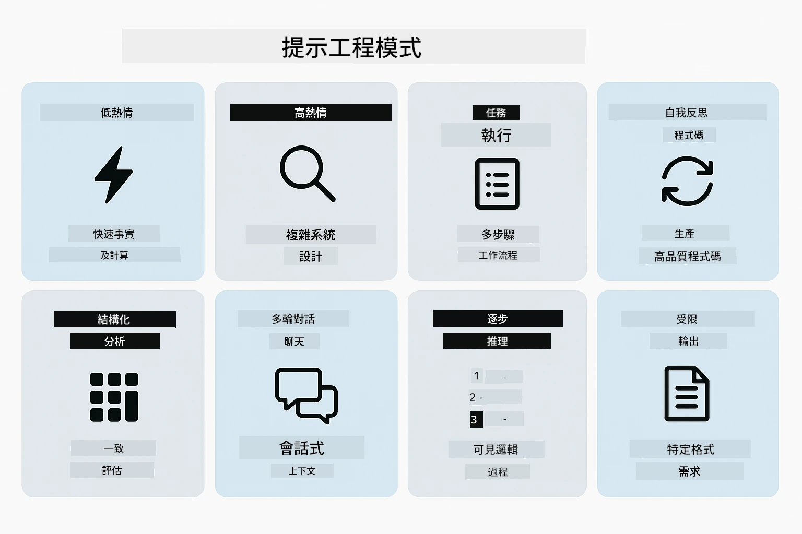
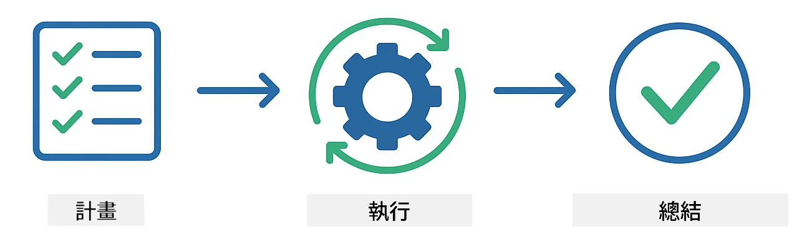
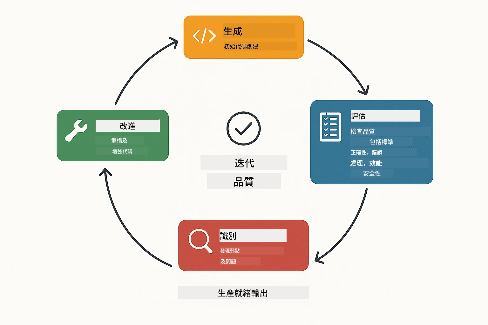
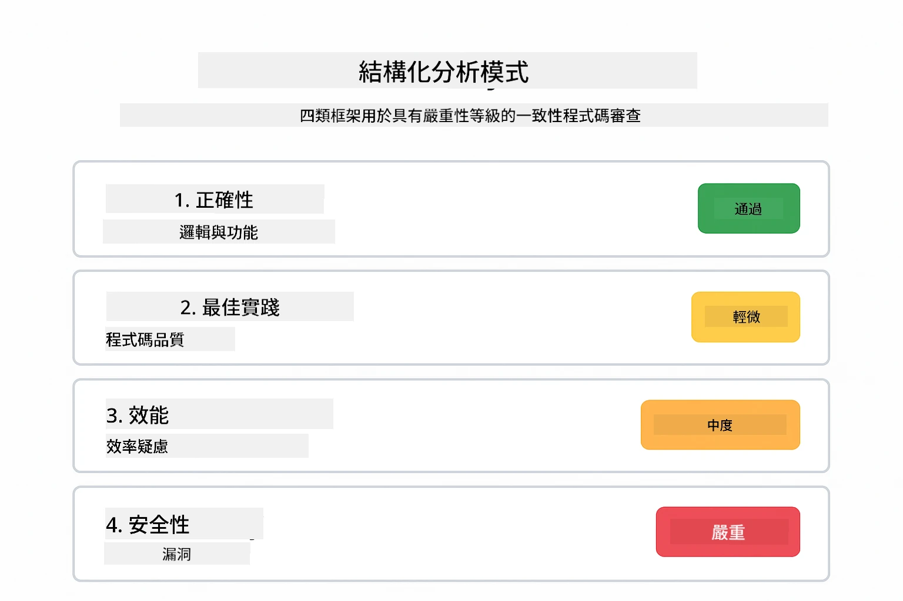
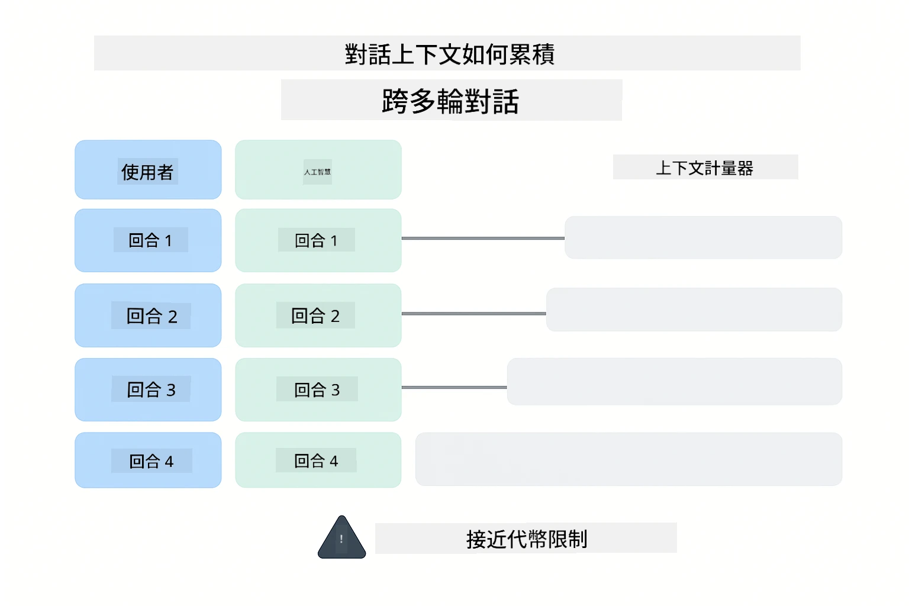
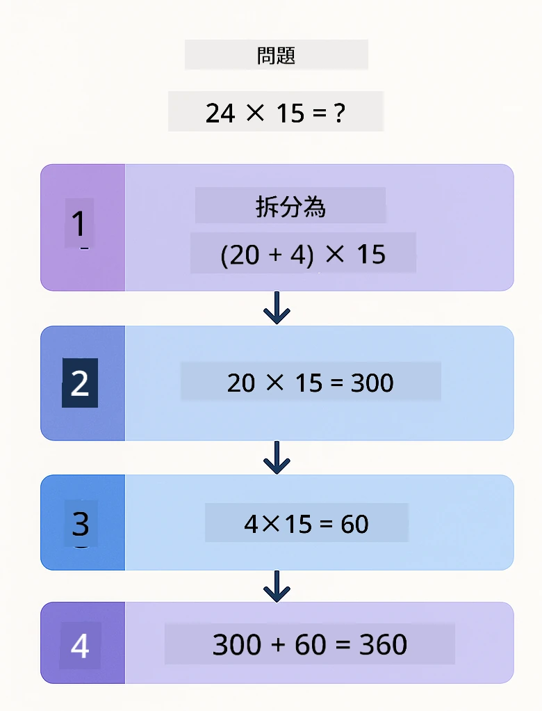
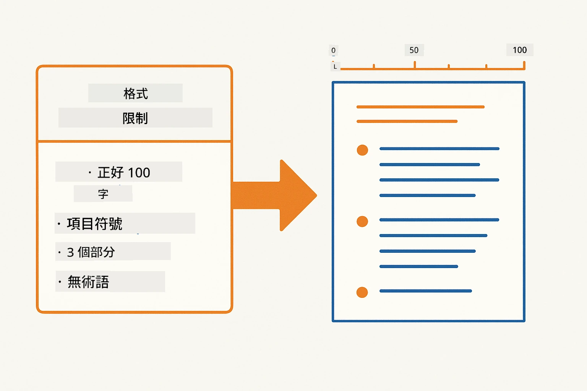
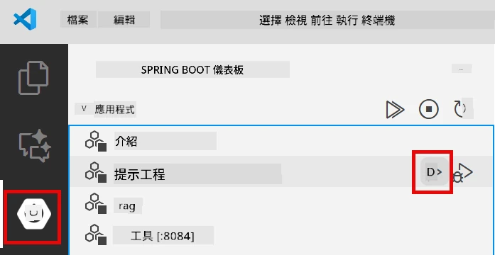
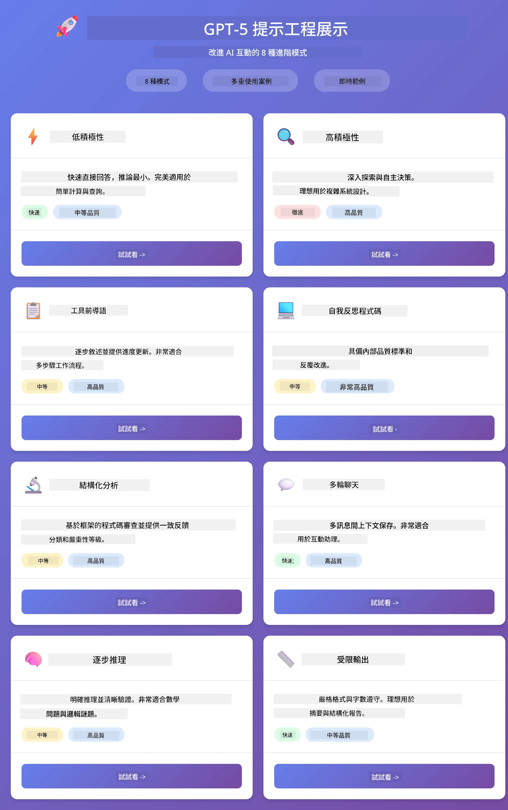
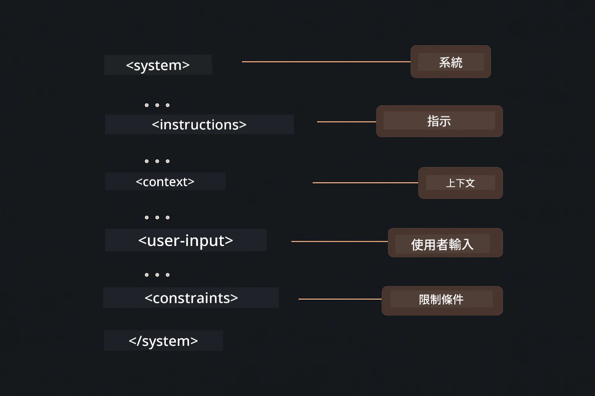

# 模組 02：使用 GPT-5.2 的提示工程

## 目錄

- [影片導覽](#影片導覽)
- [你將學到的內容](#你將學到的內容)
- [先決條件](#先決條件)
- [理解提示工程](#理解提示工程)
- [提示工程基礎](#提示工程基礎)
  - [零次提示 (Zero-Shot Prompting)](#零次提示-zero-shot-prompting)
  - [少量示例提示 (Few-Shot Prompting)](#少量示例提示-few-shot-prompting)
  - [思維鏈 (Chain of Thought)](#思維鏈-chain-of-thought)
  - [角色基礎提示 (Role-Based Prompting)](#角色基礎提示-role-based-prompting)
  - [提示範本 (Prompt Templates)](#提示範本-prompt-templates)
- [進階模式](#進階模式)
- [執行應用程式](#執行應用程式)
- [應用程式螢幕截圖](#應用程式截圖)
- [探索提示模式](#探索各種模式)
  - [低 vs 高積極度](#低與高積極度)
  - [任務執行（工具前導語）](#任務執行（工具前置詞）)
  - [自我反省程式碼](#自省式程式碼)
  - [結構化分析](#結構化分析)
  - [多輪聊天](#多輪對話)
  - [逐步推理](#逐步推理)
  - [受限輸出](#受限輸出)
- [你真正學到的是什麼](#您真正學到的是什麼)
- [下一步](#下一步)

## 影片導覽

觀看此現場會議，說明如何開始本模組：

<a href="https://www.youtube.com/live/PJ6aBaE6bog?si=LDshyBrTRodP-wke"></a>

## 你將學到的內容

下圖概述了本模組中你將發展的關鍵主題和技能——從提示優化技術到你將遵循的逐步工作流程。


在前一個模組中，你已瞭解記憶如何透過 Azure OpenAI 促成對話式 AI。現在，我們將專注於你如何提出問題——也就是提示本身——使用 Azure OpenAI 的 GPT-5.2。你結構提示的方式將大幅影響你獲得的回應品質。我們先回顧基本提示技術，接著進入八種利用 GPT-5.2 功能的進階模式。

我們使用 GPT-5.2 是因為它引入了推理控制——你可以告訴模型在回答前應該思考多少。這使不同提示策略變得更加明顯，也幫助你理解何時使用每種方法。

## 先決條件

- 已完成模組 01（部署好 Azure OpenAI 資源）
- 專案根目錄下的 `.env` 檔案包含 Azure 認證（在模組 01 透過 `azd up` 建立）

> **注意：** 如果你尚未完成模組 01，請先遵循那裡的部署指示。

## 理解提示工程

提示工程的核心，是模糊指示與精確指示的差異，正如下方比較所示。


提示工程就是設計輸入文字，使你能穩定得到所需結果。它不只是問問題——而是結構化請求，讓模型確切理解你的需求與如何交付。

可以想像成給同事指示。「修復錯誤」很模糊；「在 UserService.java 第 45 行加上 null 檢查修復空指標異常」就是具體。語言模型也是如此——精確與結構非常重要。

下圖說明 LangChain4j 適合如何使用——透過 SystemMessage 與 UserMessage 建構塊將提示模式連上模型。


LangChain4j 提供基礎架構——模型連接、記憶體與訊息類型——而提示模式是你透過該架構傳遞的精心結構化文字。關鍵建構塊是 `SystemMessage`（設定 AI 行為與角色）與 `UserMessage`（攜帶你實際的請求）。

## 提示工程基礎

以下五種核心技術構成有效提示工程的基礎。每種技術處理你與語言模型溝通的不同面向。


在深入本模組的進階模式前，先回顧五個基礎提示技術。這些是每位提示工程師應了解的建構塊。

### 零次提示 (Zero-Shot Prompting)

最簡單的方法：給模型直接指示，無需範例。模型完全依靠訓練來理解和執行任務。適用於預期行為清楚的直接請求。


*不附範例之直接指示——模型僅用指示推斷任務*

```java
String prompt = "Classify this sentiment: 'I absolutely loved the movie!'";
String response = model.chat(prompt);
// 回應："正面"
```

**使用時機：** 簡單分類、直接提問、翻譯，或模型能在無其他引導下執行的任何任務。

### 少量示例提示 (Few-Shot Prompting)

提供示例以展示你希望模型遵守的模式。模型從示例中學習期望輸入輸出格式，並套用到新輸入。大幅提升格式或行為模糊任務的一致性。


*從示例學習——模型辨識模式並套用於新輸入*

```java
String prompt = """
    Classify the sentiment as positive, negative, or neutral.
    
    Examples:
    Text: "This product exceeded my expectations!" → Positive
    Text: "It's okay, nothing special." → Neutral
    Text: "Waste of money, very disappointed." → Negative
    
    Now classify this:
    Text: "Best purchase I've made all year!"
    """;
String response = model.chat(prompt);
```

**使用時機：** 自訂分類、一致格式、領域專屬任務，或零次提示結果不穩定時。

### 思維鏈 (Chain of Thought)

請模型逐步展示推理。模型不直接跳到答案，而是拆解問題並逐部分明確處理。提升數學、邏輯和多步推理任務的準確度。


*逐步推理——將複雜問題拆成明確邏輯步驟*

```java
String prompt = """
    Problem: A store has 15 apples. They sell 8 apples and then 
    receive a shipment of 12 more apples. How many apples do they have now?
    
    Let's solve this step-by-step:
    """;
String response = model.chat(prompt);
// 模型顯示：15 - 8 = 7，接著 7 + 12 = 19 顆蘋果
```

**使用時機：** 數學問題、邏輯謎題、除錯，或任何顯示推理過程可提升準確性與信任的任務。

### 角色基礎提示 (Role-Based Prompting)

在提問前設定 AI 的角色或身份。這提供上下文，塑造回應的語氣、深度與焦點。「軟體架構師」給的建議與「初級開發者」或「安全稽核員」不同。


*設定上下文與角色——相同問題根據指定角色得到不同回應*

```java
String prompt = """
    You are an experienced software architect reviewing code.
    Provide a brief code review for this function:
    
    def calculate_total(items):
        total = 0
        for item in items:
            total = total + item['price']
        return total
    """;
String response = model.chat(prompt);
```

**使用時機：** 程式碼審查、教學、領域專業分析，或需要針對特定專業層級或視角量身調整回應時。

### 提示範本 (Prompt Templates)

建立可重用的提示，內含變數佔位符。不是每次都寫新提示，定義範本後填入不同值即可。LangChain4j 的 `PromptTemplate` 類別用 `{{variable}}` 語法輕鬆完成。


*帶變數佔位符的可重複使用提示——一個範本，多種用途*

```java
PromptTemplate template = PromptTemplate.from(
    "What's the best time to visit {{destination}} for {{activity}}?"
);

Prompt prompt = template.apply(Map.of(
    "destination", "Paris",
    "activity", "sightseeing"
));

String response = model.chat(prompt.text());
```

**使用時機：** 多次查詢不同輸入、批次處理、建立可重複使用的 AI 工作流程，或任何提示結構固定但資料變動的情況。

---

這五項基礎提供你大部分提示任務的強大工具組。本模組其餘內容建立在此基礎上，介紹利用 GPT-5.2 的推理控制、自我評估與結構化輸出的 <strong>八種進階模式</strong>。

## 進階模式

基礎說明後，接著介紹本模組獨特的八種進階模式。不同問題不需相同方法。有些問題需求快速回答，有些需要深度思考。有些需要顯示推理，有些只要結果。以下每種模式都為不同情境優化——GPT-5.2 的推理控制令差異更為顯著。



<em>八種提示工程模式及其使用情境總覽</em>

GPT-5.2 在這些模式中加入了另一維度：<em>推理控制</em>。下方滑桿展示你可如何調整模型的思考深度——從快速直接答案到深度徹底分析。


*GPT-5.2 推理控制讓你指定模型思考量——從快速直接答覆到深入探索*

**低積極度 (快速且聚焦)** — 適合想要快速直接回答的簡單問題。模型進行最少推理，最多兩步。用於計算、查詢或簡單問題。

```java
String prompt = """
    <context_gathering>
    - Search depth: very low
    - Bias strongly towards providing a correct answer as quickly as possible
    - Usually, this means an absolute maximum of 2 reasoning steps
    - If you think you need more time, state what you know and what's uncertain
    </context_gathering>
    
    Problem: What is 15% of 200?
    
    Provide your answer:
    """;

String response = chatModel.chat(prompt);
```

> 💡 **用 GitHub Copilot 探索：** 打開 [`Gpt5PromptService.java`](../../../02-prompt-engineering/src/main/java/com/example/langchain4j/prompts/service/Gpt5PromptService.java) 並詢問：
> - 「低積極度和高積極度提示模式差別是什麼？」
> - 「提示中的 XML 標籤如何幫助構建 AI 回應？」
> - 「什麼時候該用自我反思模式或直接指示？」

**高積極度 (深度且徹底)** — 適合需要全面分析的複雜問題。模型徹底探索並展示詳細推理。用於系統設計、架構決策或複雜研究。

```java
String prompt = """
    Analyze this problem thoroughly and provide a comprehensive solution.
    Consider multiple approaches, trade-offs, and important details.
    Show your analysis and reasoning in your response.
    
    Problem: Design a caching strategy for a high-traffic REST API.
    """;

String response = chatModel.chat(prompt);
```

**任務執行（逐步進行）** — 用於多步工作流程。模型提供先前計畫，一邊執行一邊敘述每步，最後總結。用於遷移、實作或任何多步程序。

```java
String prompt = """
    <task_execution>
    1. First, briefly restate the user's goal in a friendly way
    
    2. Create a step-by-step plan:
       - List all steps needed
       - Identify potential challenges
       - Outline success criteria
    
    3. Execute each step:
       - Narrate what you're doing
       - Show progress clearly
       - Handle any issues that arise
    
    4. Summarize:
       - What was completed
       - Any important notes
       - Next steps if applicable
    </task_execution>
    
    <tool_preambles>
    - Always begin by rephrasing the user's goal clearly
    - Outline your plan before executing
    - Narrate each step as you go
    - Finish with a distinct summary
    </tool_preambles>
    
    Task: Create a REST endpoint for user registration
    
    Begin execution:
    """;

String response = chatModel.chat(prompt);
```

思維鏈提示明確要求模型展示推理過程，提升複雜任務的準確度。逐步拆解幫助人類與 AI 理解邏輯。

> **🤖 使用 [GitHub Copilot](https://github.com/features/copilot) Chat 試試：** 詢問此模式：
> - 「如何調整任務執行模式處理長時間操作？」
> - 「生產環境應用中，工具前導語結構最佳實踐是什麼？」
> - 「如何捕捉並在 UI 顯示中間進度更新？」

下圖說明此「規劃 → 執行 → 總結」流程。



*多步任務的 計劃 → 執行 → 總結 工作流程*

<strong>自我反省程式碼</strong> — 用來產生生產品質程式。模型產出符合生產標準且含完善錯誤處理的程式碼。用於開發新功能或服務。

```java
String prompt = """
    Generate Java code with production-quality standards: Create an email validation service
    Keep it simple and include basic error handling.
    """;

String response = chatModel.chat(prompt);
```

下圖展示此反覆改進循環——產生、評估、找出弱點，修正直到程式碼符合法規。



*反覆改進循環——產生、評估、找問題、改進、重複*

<strong>結構化分析</strong> — 用於一致性評估。模型依固定框架（正確性、實務、效能、安全性、可維護性）審查程式碼。用於程式碼審查或品質檢核。

```java
String prompt = """
    <analysis_framework>
    You are an expert code reviewer. Analyze the code for:
    
    1. Correctness
       - Does it work as intended?
       - Are there logical errors?
    
    2. Best Practices
       - Follows language conventions?
       - Appropriate design patterns?
    
    3. Performance
       - Any inefficiencies?
       - Scalability concerns?
    
    4. Security
       - Potential vulnerabilities?
       - Input validation?
    
    5. Maintainability
       - Code clarity?
       - Documentation?
    
    <output_format>
    Provide your analysis in this structure:
    - Summary: One-sentence overall assessment
    - Strengths: 2-3 positive points
    - Issues: List any problems found with severity (High/Medium/Low)
    - Recommendations: Specific improvements
    </output_format>
    </analysis_framework>
    
    Code to analyze:
    ```
    public List getUsers() {
        return database.query("SELECT * FROM users");
    }
    ```
    Provide your structured analysis:
    """;

String response = chatModel.chat(prompt);
```

> **🤖 使用 [GitHub Copilot](https://github.com/features/copilot) Chat 試試：** 詢問結構化分析：
> - 「如何為不同類型程式碼審查自訂分析框架？」
> - 「以程式方式解析並採取結構化輸出最佳方法是？」
> - 「如何確保不同審查會話中嚴重程度一致？」

下圖展示此結構化框架將程式碼評論組織成一致類別並標示嚴重性等級。



<em>有嚴重性等級的程式碼審查一致性框架</em>

<strong>多輪聊天</strong> — 用於需要上下文的對話。模型記住前面的訊息並以之為基礎展開。用於互動式支援或複雜問答。

```java
ChatMemory memory = MessageWindowChatMemory.withMaxMessages(10);

memory.add(UserMessage.from("What is Spring Boot?"));
AiMessage aiMessage1 = chatModel.chat(memory.messages()).aiMessage();
memory.add(aiMessage1);

memory.add(UserMessage.from("Show me an example"));
AiMessage aiMessage2 = chatModel.chat(memory.messages()).aiMessage();
memory.add(aiMessage2);
```

下圖可視化每輪如何累積對話上下文，以及如何影響模型的 token 限制。



*多輪累積對話上下文直到接近 token 限制*

<strong>逐步推理</strong> — 適用需可視邏輯的問題。模型展示每步具體推理。用於數學問題、邏輯謎題或你要理解思考過程時。

```java
String prompt = """
    <instruction>Show your reasoning step-by-step</instruction>
    
    If a train travels 120 km in 2 hours, then stops for 30 minutes,
    then travels another 90 km in 1.5 hours, what is the average speed
    for the entire journey including the stop?
    """;

String response = chatModel.chat(prompt);
```

下圖說明模型如何將問題拆成清楚編號的邏輯步驟。


<em>將問題拆解為明確的邏輯步驟</em>

<strong>受限輸出</strong> - 用於具有特定格式需求的回應。模型嚴格遵守格式和長度規則。適用於摘要或需要精確輸出結構的情況。

```java
String prompt = """
    <constraints>
    - Exactly 100 words
    - Bullet point format
    - Technical terms only
    </constraints>
    
    Summarize the key concepts of machine learning.
    """;

String response = chatModel.chat(prompt);
```

下圖顯示限制條件如何引導模型產出嚴格符合您格式和長度需求的輸出。



*強制特定格式、長度及結構要求*

## 執行應用程式

**驗證部署：**

確保根目錄存在 `.env` 檔案，內含 Azure 憑證（在模組 01 中建立）。請從模組目錄 (`02-prompt-engineering/`) 執行：

**Bash:**
```bash
cat ../.env  # 應該顯示 AZURE_OPENAI_ENDPOINT、API_KEY、DEPLOYMENT
```

**PowerShell:**
```powershell
Get-Content ..\.env  # 應該顯示 AZURE_OPENAI_ENDPOINT、API_KEY、DEPLOYMENT
```

**啟動應用程式：**

> **注意：** 若您已經在根目錄使用 `./start-all.sh` 啟動所有應用程式（如模組 01 所述），則此模組已在 8083 埠上運行。您可以跳過以下啟動指令，直接開啟 http://localhost:8083。

**選項 1：使用 Spring Boot 控制台（建議 VS Code 使用者）**

開發容器中包含 Spring Boot 控制台擴充套件，提供管理所有 Spring Boot 應用程式的視覺介面。它位於 VS Code 左側活動列（尋找 Spring Boot 圖示）。

透過 Spring Boot 控制台，您可以：
- 查看工作區內所有可用的 Spring Boot 應用程式
- 一鍵啟動/停止應用程式
- 實時檢視應用日誌
- 監控應用程式狀態

只要點擊「prompt-engineering」旁的播放鈕即可啟動此模組，或一併啟動所有模組。



*VS Code 中的 Spring Boot 控制台 — 從一處啟動、停止並監控所有模組*

**選項 2：使用 shell 腳本**

啟動所有網頁應用程式（模組 01-04）：

**Bash:**
```bash
cd ..  # 從根目錄開始
./start-all.sh
```

**PowerShell:**
```powershell
cd ..  # 從根目錄
.\start-all.ps1
```

或者只啟動此模組：

**Bash:**
```bash
cd 02-prompt-engineering
./start.sh
```

**PowerShell:**
```powershell
cd 02-prompt-engineering
.\start.ps1
```

兩個腳本均會自動從根目錄的 `.env` 檔案載入環境變數，且若 JAR 檔不存在會自動建立。

> **注意：** 若您想先手動編譯所有模組再啟動：
>
> **Bash:**
> ```bash
> cd ..  # Go to root directory
> mvn clean package -DskipTests
> ```

> **PowerShell:**
> ```powershell
> cd ..  # Go to root directory
> mvn clean package -DskipTests
> ```

在瀏覽器開啟 http://localhost:8083 。

**停止應用程式：**

**Bash:**
```bash
./stop.sh  # 僅此模組
# 或
cd .. && ./stop-all.sh  # 所有模組
```

**PowerShell:**
```powershell
.\stop.ps1  # 僅此模組
# 或
cd ..; .\stop-all.ps1  # 所有模組
```

## 應用程式截圖

這是 prompt engineering 模組的主介面，您可以並排測試所有八種範例。



*主控台展示所有 8 種提示工程模式及其特性和使用案例*

## 探索各種模式

網頁介面讓您嘗試不同提示策略。各模式解決不同問題 — 嘗試看看何時哪種方法最適用。

> **注意：串流與非串流** — 每個模式頁面都提供兩個按鈕：**🔴 串流回應（即時）** 和 <strong>非串流</strong> 選項。串流使用 Server-Sent Events (SSE)，將模型生成的 token 及時呈現，讓您立即看到進度。非串流則是等待整個回應完成才顯示。對於引發深度推理的提示（例如高積極度、高自省程式碼等），非串流呼叫可能非常漫長 — 甚至數分鐘，且無明顯回饋。**嘗試複雜提示時建議使用串流，能即時看到模型運作，避免誤以為請求逾時。**
>
> **注意：瀏覽器需求** — 串流功能使用 Fetch Streams API（`response.body.getReader()`），需要完整瀏覽器（Chrome、Edge、Firefox、Safari）。VS Code 內建的簡易瀏覽器不支援 ReadableStream API，故無法使用串流功能。若使用簡易瀏覽器，非串流按鈕仍可正常使用，僅串流按鈕受限。請於外部瀏覽器開啟 `http://localhost:8083` 以獲得完整體驗。

### 低與高積極度

以低積極度詢問簡單問題，例如「200 的 15% 是多少？」會立即得到直接答案。換成用高積極度詢問「設計高流量 API 的快取策略」，點擊 **🔴 串流回應（即時）**，您將看到模型詳細的逐字推理。相同模型、相同問題結構，提示決定模型要思考多少。

### 任務執行（工具前置詞）

多步工作流程受益於預先規劃及進度說明。模型會概述要執行的內容，逐步說明，再總結結果。

### 自省式程式碼

試著輸入「建立電子郵件驗證服務」。模型不會只生成程式碼就停，而是生成、根據品質標準評估、找出弱點並改進。您會看到其重複迭代直到程式碼達到生產標準。

### 結構化分析

程式碼檢視需要一致的評估架構。模型使用固定分類（正確性、實務、效能、安全）與嚴重度等級來分析程式碼。

### 多輪對話

先問「什麼是 Spring Boot？」，緊接著問「給我一個範例」。模型會記得前一問，給您專屬的 Spring Boot 範例。沒記憶功能的話，第二個問題會過於模糊。

### 逐步推理

挑一個數學題，分別用逐步推理和低積極度嘗試。低積極度直接給解答 — 快速但不透明。逐步推理則展示每個計算和決策過程。

### 受限輸出

需要特定格式或字數時，此模式強制嚴格遵守。試試產生剛好 100 字的條列式摘要。

## 您真正學到的是什麼

<strong>推理努力決定一切</strong>

GPT-5.2 讓您透過提示控制計算努力。低努力意即快速回應且探索少。高努力令模型花時間深度思考。您學會依任務複雜度調節努力 — 不浪費時間回答簡單問題，也不急於做複雜決策。

<strong>結構引導行為</strong>

注意提示中的 XML 標籤？它們非裝飾。模型較能可靠遵循結構化指令，而非自由文本。當需要多步程序或複雜邏輯時，結構有助模型追蹤進度和下一步。下圖拆解良好結構化提示，展示 `<system>`, `<instructions>`, `<context>`, `<user-input>`, `<constraints>` 等標籤如何組織您的指令為清晰區塊。



*良好結構化提示的組成，具清楚區塊與 XML 風格組織*

<strong>自我評估帶來品質</strong>

自省模式透過明確化品質標準運作。您不再期望模型「做對」，而是告訴它「對」的意義為何：邏輯正確、錯誤處理、效能、安全。模型能自行評估輸出並改進。此法將程式碼生成從碰運氣變成流程。

<strong>上下文有限</strong>

多輪對話通過隨請求攜帶訊息歷史達成。但有上限—每個模型有最大 Token 數。隨會話膨脹，您將學會策略保留相關上下文，避免超標。本模組示範記憶如何運作；後續您會學習何時摘要、何時遺忘，何時檢索。

## 下一步

**下一模組：** [03-rag - RAG (檢索強化生成)](../03-rag/README.md)

---

**導覽：** [← 上一頁：模組 01 - 介紹](../01-introduction/README.md) | [回主頁](../README.md) | [下一頁：模組 03 - RAG →](../03-rag/README.md)

---

<!-- CO-OP TRANSLATOR DISCLAIMER START -->
**免責聲明**：
此文件已使用 AI 翻譯服務 [Co-op Translator](https://github.com/Azure/co-op-translator) 進行翻譯。雖然我們努力追求準確性，但請注意自動翻譯可能包含錯誤或不準確之處。原始文件的母語版本應視為權威來源。對於關鍵資訊，建議採用專業人工翻譯。我們不對因使用此翻譯所產生的任何誤解或誤譯承擔責任。
<!-- CO-OP TRANSLATOR DISCLAIMER END -->