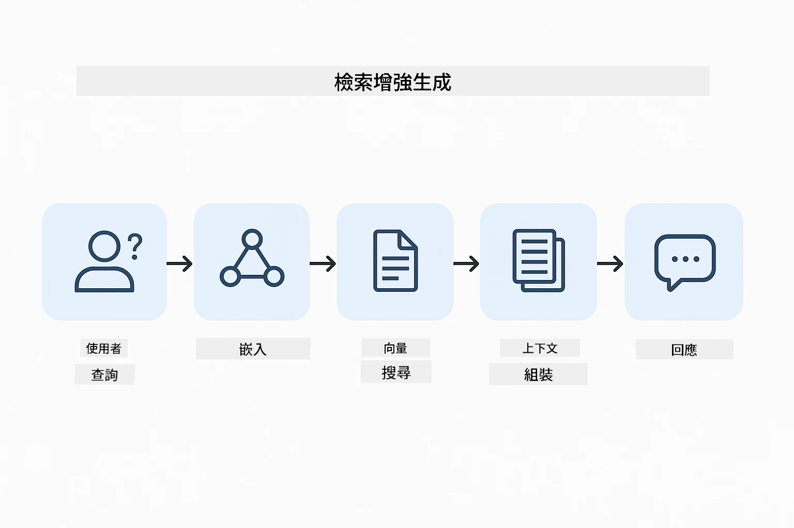
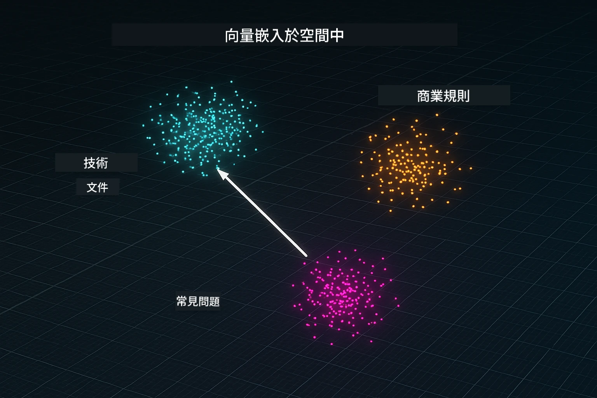
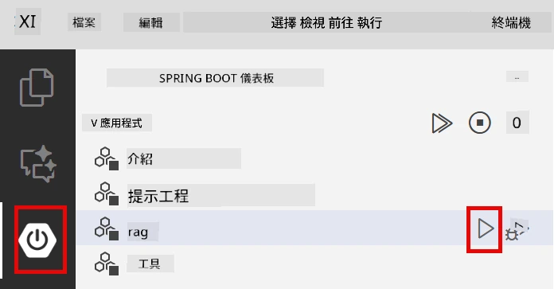
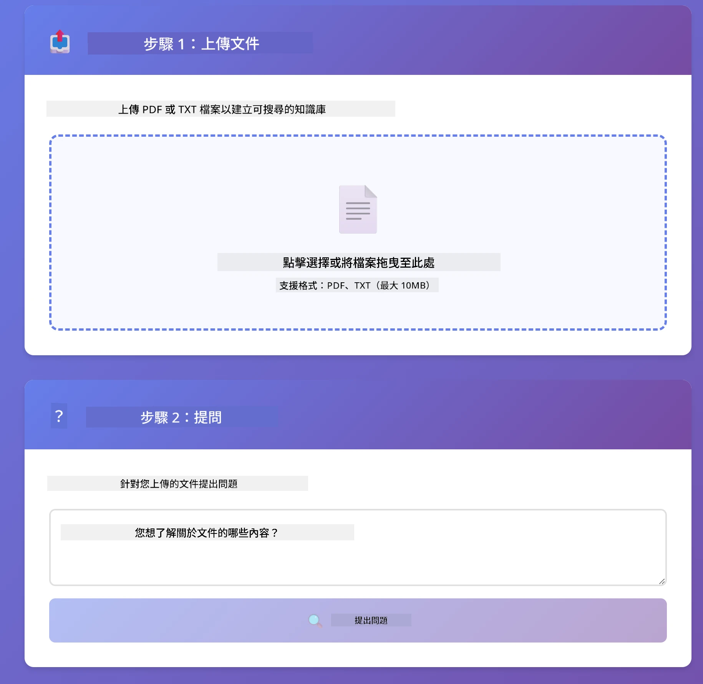
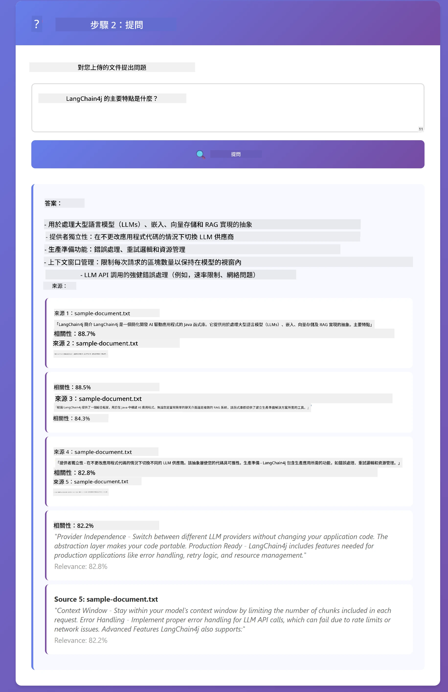

# Module 03: RAG（檢索增強生成）

## 目錄

- [影片導覽](#影片導覽)
- [您將學到什麼](#您將學到什麼)
- [先決條件](#先決條件)
- [理解 RAG](#理解-rag)
  - [本教學使用哪種 RAG 方法？](#本教學使用哪種-rag-方法？)
- [運作原理](#運作原理)
  - [文件處理](#文件處理)
  - [建立向量表示](#建立向量表示)
  - [語意搜尋](#語意搜尋)
  - [答案生成](#答案生成)
- [執行應用程式](#執行應用程式)
- [使用應用程式](#使用應用程式)
  - [上傳文件](#上傳文件)
  - [提問](#提問)
  - [檢查來源參考](#檢查來源引用)
  - [嘗試不同問題](#試驗不同問題)
- [關鍵概念](#關鍵概念)
  - [切塊策略](#拆分策略)
  - [相似度分數](#相似度分數)
  - [記憶體內存儲](#記憶體儲存)
  - [上下文視窗管理](#上下文視窗管理)
- [何時 RAG 才重要](#何時選用-rag)
- [下一步](#後續步驟)

## 影片導覽

觀看此現場說明，了解如何開始本模組：

<a href="https://www.youtube.com/watch?v=_olq75ZH_eY"></a>

## 您將學到什麼

在前面的模組中，您學會了如何與 AI 對話並有效結構提示。但有一個根本限制：語言模型只能知道訓練期間學到的知識。它們無法回答關於您公司政策、專案文件或未受訓練的任何資訊的問題。

RAG（檢索增強生成）解決了這個問題。與其嘗試教模型您的資訊（既昂貴又不切實際），您給它能力去搜尋您的文件。當有人提問時，系統找到相關資訊並把它包含在提示中。模型然後根據檢索到的上下文回答。

將 RAG 想像成給模型一本參考圖書館。當您提問時，系統會：

1. <strong>使用者查詢</strong> — 您提出問題  
2. <strong>嵌入向量</strong> — 將問題轉換為向量  
3. <strong>向量搜尋</strong> — 找到相似的文件切塊  
4. <strong>上下文組合</strong> — 將相關切塊加入提示中  
5. <strong>回應</strong> — LLM 根據上下文生成答案  

這使模型的回應根植於您的實際數據，而非僅依賴訓練知識或杜撰答案。

## 先決條件

- 完成 [Module 01 - 介紹](../01-introduction/README.md)（已部署 Azure OpenAI 資源，包括 `text-embedding-3-small` 嵌入模型）  
- 根目錄下有 `.env` 檔案並包含 Azure 憑證（由 Module 01 的 `azd up` 指令建立）

> **注意：** 若尚未完成 Module 01，請先依指示完成部署。`azd up` 指令同時部署本模組使用的 GPT 聊天模型與嵌入模型。

## 理解 RAG

下圖說明核心概念：RAG 不僅依賴模型訓練資料，而是給它一本您文件的參考圖書館，可在生成答案前先查閱。


*此圖展示標準 LLM（依訓練資料猜測）與 RAG 增強 LLM（先查閱您的文件）的差異。*

以下是從頭到尾的流程圖。使用者的問題通過四個階段——嵌入、向量搜尋、上下文組合、答案生成——每個階段都建立在前一階段基礎上：



*此圖顯示完整 RAG 流程——使用者查詢依序通過嵌入、向量搜尋、上下文組合和答案生成。*

本模組餘下部分將詳細介紹每個階段，附上可運行與修改的程式碼。

### 本教學使用哪種 RAG 方法？

LangChain4j 提供三種實作 RAG 的方式，抽象層級各異。下圖比較三者：


*此圖比較 LangChain4j 的三種 RAG 方法——Easy、Native 與 Advanced，展示主要組件及適用時機。*

| 方法 | 功能說明 | 取捨 |
|---|---|---|
| **Easy RAG** | 利用 `AiServices` 與 `ContentRetriever` 自動串接。您只需註解一個介面並接上擷取器，LangChain4j 在背後處理嵌入、搜尋和提示組合。 | 程式碼量少，但無法看見每步驟細節。 |
| **Native RAG** | 您自己呼叫嵌入模型、搜尋資料庫、建立提示並生成答案——每步驟皆明確。 | 程式碼較多，但每個階段透明且可修改。 |
| **Advanced RAG** | 使用 `RetrievalAugmentor` 框架，包含可插拔的查詢轉換器、路由器、重新排序器和內容注入器，適合專業量產管線。 | 彈性最大，但複雜度也最高。 |

**本教學使用 Native 方式。** RAG 管線的每一步——查詢嵌入、向量庫搜尋、上下文組合、答案生成——皆在 [`RagService.java`](../../../03-rag/src/main/java/com/example/langchain4j/rag/service/RagService.java) 明確撰寫。這是有意為之：為了學習，看到且理解每個階段比精簡程式碼更重要。熟悉流程後，您可以轉向 Easy RAG 進行快速原型開發，或用 Advanced RAG 實現生產系統。

> **💡 想了解 Easy RAG？** LangChain4j 也提供一種 *Easy RAG* 方式，`AiServices` 與 `ContentRetriever` 自動處理嵌入、搜尋和提示組合。此模組採用更明確的路徑——拆解管線，讓您自行掌控每個階段。

下圖展示 Easy RAG 管線。看到 `AiServices` 和 `EmbeddingStoreContentRetriever` 隱藏了所有複雜流程——您只需載入文件、接上擷取器並獲得答案。本文模組採 Native 方式，將這些隱藏的步驟拆開：


*此圖展示 Easy RAG 管線，與本模組用的 Native 方式作對比：Easy RAG 隱藏嵌入、檢索與提示組合在 `AiServices` 和 `ContentRetriever` 之中——您載入文件、接擷取器、取得答案。Native 方式打開這些流程，您自己呼叫每個階段（嵌入、搜尋、組合上下文、生成），完全掌控且了解每步。*

## 運作原理

本模組中的 RAG 管線分四個階段，每當使用者提出問題時依序執行。首先，上傳文件被<strong>解析並切成小塊</strong>。這些切塊再轉成<strong>向量嵌入表示</strong>並儲存起來，方便數學計算對比。當有查詢時，系統執行<strong>語意搜尋</strong>找出最相關的切塊，最後將它們作為上下文傳給 LLM <strong>生成答案</strong>。下文詳解每階段並附程式碼與示意圖。先從第一步開始。

### 文件處理

[DocumentService.java](../../../03-rag/src/main/java/com/example/langchain4j/rag/service/DocumentService.java)

當您上傳文件時，系統會解析它（PDF 或純文字），附加檔名等元資料，然後切成切塊——即大小適中、可容納進模型上下文視窗的較小區段。這些切塊有些重疊，避免切割處訊息中斷。

```java
// 解析上傳的檔案並封裝成 LangChain4j 文件
Document document = Document.from(content, metadata);

// 分割成每塊 300 代幣，重疊 30 代幣
DocumentSplitter splitter = DocumentSplitters
    .recursive(300, 30);

List<TextSegment> segments = splitter.split(document);
```
  
以下示意圖說明此流程。注意每個切塊與相鄰切塊有 30 個 token 的重疊 —— 確保不漏掉重要上下文：


*此圖示文件被拆成 300 token 大小的切塊，並且有 30 token 重疊，保留切塊接口上下文。*

> **🤖 試試看用 [GitHub Copilot](https://github.com/features/copilot) Chat：** 開啟 [`DocumentService.java`](../../../03-rag/src/main/java/com/example/langchain4j/rag/service/DocumentService.java) 並問：  
> - 「LangChain4j 如何將文件拆成切塊？為何重疊重要？」  
> - 「不同文件類型的最佳切塊大小為何？」  
> - 「怎麼處理多語言或特殊格式的文件？」

### 建立向量表示

[LangChainRagConfig.java](../../../03-rag/src/main/java/com/example/langchain4j/rag/config/LangChainRagConfig.java)

每個切塊會被轉換成稱為嵌入（embedding）的數字表示——實質上是將語意轉成數字的轉換器。嵌入模型不像聊天模型那般「智能」；它不會執行指令、推理或回答問題。它能做的是將文字映射到一個數學空間，使相似語意的向量彼此靠近——例如「car」和「automobile」相近，「refund policy」和「return my money」相近。把聊天模型想像成會說話的人，嵌入模型則是非常棒的檔案管理系統。

以下圖說明這概念——文字進去，數字向量出來，相似語意會產生彼此接近的向量：


*此圖展示嵌入模型如何將文字轉為數字向量，讓相似語意「car」與「automobile」在向量空間中靠近。*

```java
@Bean
public EmbeddingModel embeddingModel() {
    return OpenAiOfficialEmbeddingModel.builder()
        .baseUrl(azureOpenAiEndpoint)
        .apiKey(azureOpenAiKey)
        .modelName(azureEmbeddingDeploymentName)
        .build();
}

EmbeddingStore<TextSegment> embeddingStore = 
    new InMemoryEmbeddingStore<>();
```
  
下方類別圖展示 RAG 管線中兩條獨立流程與 LangChain4j 實作類別。<strong>匯入流程</strong>（上傳時執行一次）分割文件、建立切塊嵌入、並透過 `.addAll()` 儲存。<strong>查詢流程</strong>（使用者每次提問執行）嵌入問題、用 `.search()` 搜尋資料庫，並將符合上下文傳給聊天模型。兩流程共用 `EmbeddingStore<TextSegment>` 介面：


*此圖顯示 RAG 管線中兩條流程——匯入與查詢——如何透過共用的 EmbeddingStore 介面連接。*

嵌入儲存後，內容在向量空間自然形成群聚。以下視覺化圖示說明關聯主題的文件如何成為鄰近點，這是語意搜尋的關鍵：



*本視覺化說明相關文件在三維向量空間中群聚，例如技術文檔、商業規則與常見問題形成獨立群組。*

使用者查詢時，系統執行四步驟：文件嵌入建好、每次搜尋時問題轉嵌入、計算問題向量與所有儲存向量的餘弦相似度、回傳最高分的前 K 個切塊。下圖展示每步及 LangChain4j 用到的類別：


*此圖說明嵌入搜尋的四步驟流程：建文件嵌入、建問題嵌入、用餘弦相似度比對向量、回傳前 K 名結果。*

### 語意搜尋

[RagService.java](../../../03-rag/src/main/java/com/example/langchain4j/rag/service/RagService.java)

當您提問時，系統會先將問題轉成嵌入向量，並與所有文件切塊的嵌入向量比對。系統找出語意最相近的切塊——不只是字詞匹配，而是真正語意層面接近。

```java
Embedding queryEmbedding = embeddingModel.embed(question).content();

EmbeddingSearchRequest searchRequest = EmbeddingSearchRequest.builder()
    .queryEmbedding(queryEmbedding)
    .maxResults(5)
    .minScore(0.5)
    .build();

EmbeddingSearchResult<TextSegment> searchResult = embeddingStore.search(searchRequest);
List<EmbeddingMatch<TextSegment>> matches = searchResult.matches();

for (EmbeddingMatch<TextSegment> match : matches) {
    String relevantText = match.embedded().text();
    double score = match.score();
}
```
  
下圖將語意搜尋與傳統關鍵字搜尋做對比。關鍵字搜尋「vehicle」無法找到「cars and trucks」相關切塊，但語意搜尋理解它們同義並回傳高分匹配：


*此圖比較基於關鍵字與語意的搜尋，展示語意搜尋能在關鍵字不同時檢索出相關概念內容。*

底層使用餘弦相似度衡量相似度——可以理解為「兩箭頭方向是否一致？」兩段文字可用完全不同詞彙，但若意義相同，向量會指向相同方向，分數接近 1.0：


*此圖示說明餘弦相似度作為嵌入向量之間的角度 — 向量越對齊，分數越接近 1.0，表示語意相似度越高。*

> **🤖 嘗試使用 [GitHub Copilot](https://github.com/features/copilot) 聊天：** 開啟 [`RagService.java`](../../../03-rag/src/main/java/com/example/langchain4j/rag/service/RagService.java) 並詢問：
> - 「相似度搜尋是如何用嵌入向量工作的？分數由什麼決定？」
> - 「應該使用什麼相似度閾值？它如何影響結果？」
> - 「遇到找不到相關文件時，該如何處理？」

### 答案生成

[RagService.java](../../../03-rag/src/main/java/com/example/langchain4j/rag/service/RagService.java)

最相關的區塊會被組裝成結構化提示，包含明確指示、檢索到的上下文及使用者問題。模型會閱讀這些特定區塊並根據這些資訊回答 — 它只能使用面前的資訊，防止幻覺產生。

```java
String context = matches.stream()
    .map(match -> match.embedded().text())
    .collect(Collectors.joining("\n\n"));

String prompt = String.format("""
    Answer the question based on the following context.
    If the answer cannot be found in the context, say so.

    Context:
    %s

    Question: %s

    Answer:""", context, request.question());

String answer = chatModel.chat(prompt);
```

下圖展示這個組裝過程 — 搜尋步驟中得分最高的區塊被注入提示範本，`OpenAiOfficialChatModel` 產生根據事實的答案：


*此圖示展示如何將得分最高的區塊組裝成結構化提示，使模型能根據您的資料產生根據事實的答案。*

## 執行應用程式

**確認部署：**

確保根目錄有 `.env` 檔案，內含 Azure 憑證（於模組 01 建立）。從模組目錄（`03-rag/`）執行：

**Bash:**
```bash
cat ../.env  # 應該顯示 AZURE_OPENAI_ENDPOINT、API_KEY、DEPLOYMENT
```

**PowerShell:**
```powershell
Get-Content ..\.env  # 應該顯示 AZURE_OPENAI_ENDPOINT、API_KEY、DEPLOYMENT
```

**啟動應用程式：**

> **注意：** 如果您已從根目錄使用 `./start-all.sh` 開啟所有應用程式（如模組 01 所述），此模組已運行在埠號 8081。您可以跳過下列啟動指令，直接開啟 http://localhost:8081。

**選項 1：使用 Spring Boot Dashboard（建議 VS Code 使用者）**

開發容器內含 Spring Boot Dashboard 擴充，可視化管理所有 Spring Boot 應用。可在 VS Code 左側活動列找到（尋找 Spring Boot 圖示）。

透過 Spring Boot Dashboard，您可以：
- 查看工作區中所有可用的 Spring Boot 應用
- 一鍵啟動/停止應用程式
- 即時檢視應用程式日誌
- 監控應用狀態

只需點擊 "rag" 旁的播放按鈕即可啟動此模組，或一次啟動所有模組。



*此截圖顯示 VS Code 中的 Spring Boot Dashboard，您可以視覺化啟動、停止及監控應用程式。*

**選項 2：使用 shell 腳本**

啟動所有網頁應用（模組 01-04）：

**Bash:**
```bash
cd ..  # 從根目錄
./start-all.sh
```

**PowerShell:**
```powershell
cd ..  # 從根目錄
.\start-all.ps1
```

或只啟動此模組：

**Bash:**
```bash
cd 03-rag
./start.sh
```

**PowerShell:**
```powershell
cd 03-rag
.\start.ps1
```

這兩個腳本會自動從根目錄的 `.env` 檔載入環境變數，且若尚未編譯 JAR 檔，會自動執行編譯。

> **注意：** 若您想手動先編譯所有模組再啟動：
>
> **Bash:**
> ```bash
> cd ..  # Go to root directory
> mvn clean package -DskipTests
> ```

> **PowerShell:**
> ```powershell
> cd ..  # Go to root directory
> mvn clean package -DskipTests
> ```

於瀏覽器開啟 http://localhost:8081 。

**停止應用程式：**

**Bash:**
```bash
./stop.sh  # 僅此模組
# 或者
cd .. && ./stop-all.sh  # 所有模組
```

**PowerShell:**
```powershell
.\stop.ps1  # 僅此模組
# 或
cd ..; .\stop-all.ps1  # 所有模組
```

## 使用應用程式

該應用程式提供文件上傳及提問的網頁介面。

<a href="images/rag-homepage.png"></a>

*此截圖顯示 RAG 應用介面，您可以上傳文件並提出問題。*

### 上傳文件

先上傳文件 — TXT 檔案適合測試。此目錄下提供 `sample-document.txt`，內含 LangChain4j 功能、RAG 實作及最佳實務說明 — 非常適合測試系統。

系統會處理您的文件，將其拆分成區塊並為每個區塊建立嵌入向量。上傳時自動執行這些程序。

### 提問

現在，可以針對文件內容提出具體問題。嘗試問文件中明確敘述的事實。系統會尋找相關區塊，將它們納入提示並生成答案。

### 檢查來源引用

每個答案都包含帶有相似度分數的來源引用。這些分數（介於 0 至 1）表示每個區塊與問題的相關程度。分數越高，匹配越好。這讓您能根據來源資料驗證答案。

<a href="images/rag-query-results.png"></a>

*此截圖展示查詢結果，包括產生的答案、來源引用與每個檢索區塊的相關度分數。*

### 試驗不同問題

嘗試不同類型問題：
- 具體事實：「主要主題是什麼？」
- 比較：「X 與 Y 有何不同？」
- 摘要：「請總結 Z 的重點」

觀察相關度分數隨您的問題與文件內容匹配程度的變化。

## 關鍵概念

### 拆分策略

文件拆成 300 個 token 的區塊，區塊間重疊 30 個 token。此平衡可確保每個區塊有足夠上下文有意義，同時讓多個區塊能同時放入提示內。

### 相似度分數

每個檢索到的區塊都附帶介於 0 到 1 的相似度分數，表示與使用者問題的匹配程度。下圖視覺化分數區間以及系統如何利用它們過濾結果：


*此圖示展示相似度分數區間為 0 至 1，並有 0.5 的最低門檻用來過濾不相關的區塊。*

分數區間說明：
- 0.7-1.0：高度相關，精確匹配
- 0.5-0.7：相關，具良好上下文
- 低於 0.5：過濾掉，差異太大

系統只會擷取高於最低門檻的區塊，以確保品質。

嵌入適合意義聚集明確時，但存在盲點。下圖顯示常見失敗模式 — 區塊太大造成向量模糊，區塊太小缺乏上下文，含糊詞彙指向多個群集，以及精確匹配（識別碼、零件號）根本不適用嵌入：


*此圖示顯示嵌入的常見失敗模式：區塊太大、區塊太小、含糊詞指向多個群集、以及識別碼等精確匹配查詢。*

### 記憶體儲存

此模組為簡便起見使用記憶體儲存，應用程式重啟時已上傳文件會遺失。生產系統採用持久化向量資料庫，如 Qdrant 或 Azure AI Search。

### 上下文視窗管理

每個模型有最大上下文視窗限制。無法包含大型文件的所有區塊。系統會檢索前 N 個最相關區塊（預設 5 個），保持在限制內同時提供足夠上下文以獲得準確答案。

## 何時選用 RAG

RAG 並非總是最佳方案。下列決策導引幫助您判斷何時 RAG 有價值，何時簡單方式即可 — 如直接包含內容於提示或依賴模型內建知識：


*此圖示為決策導引，說明何時 RAG 增加價值，何時簡單方法已足夠。*

## 後續步驟

**下一模組：** [04-tools - AI Agents with Tools](../04-tools/README.md)

---

**導覽：** [← 上一章：模組 02 - Prompt Engineering](../02-prompt-engineering/README.md) | [回主頁](../README.md) | [下一章：模組 04 - Tools →](../04-tools/README.md)

---

<!-- CO-OP TRANSLATOR DISCLAIMER START -->
**免責聲明**：
此文件已使用 AI 翻譯服務 [Co-op Translator](https://github.com/Azure/co-op-translator) 進行翻譯。雖然我們努力追求準確性，但請注意自動翻譯可能包含錯誤或不準確之處。原始文件的母語版本應視為權威來源。對於關鍵資訊，建議採用專業人工翻譯。我們不對因使用此翻譯所產生的任何誤解或誤譯承擔責任。
<!-- CO-OP TRANSLATOR DISCLAIMER END -->