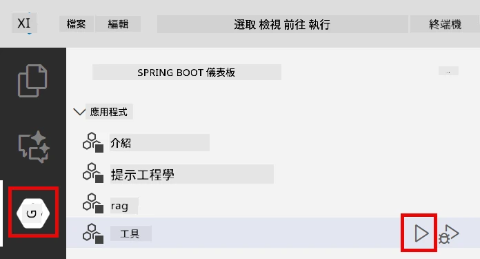
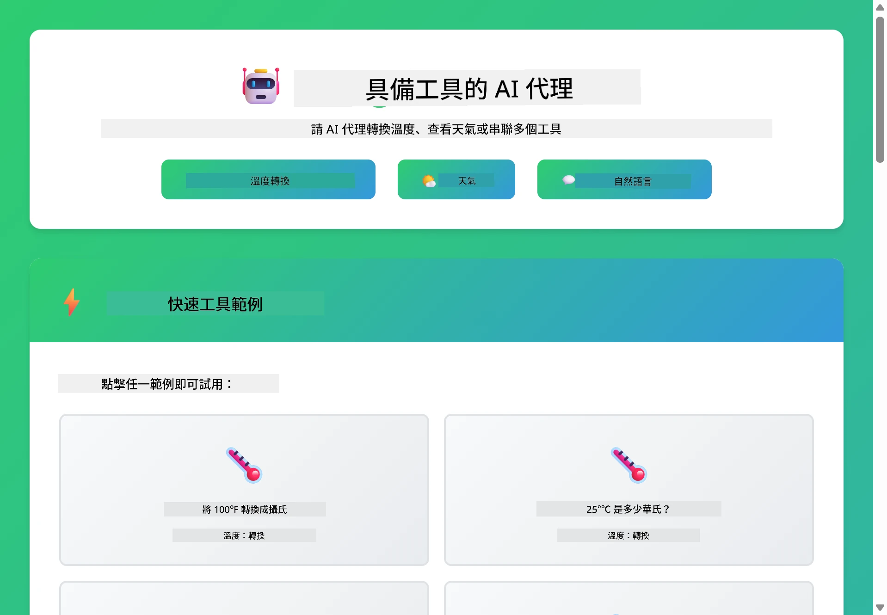
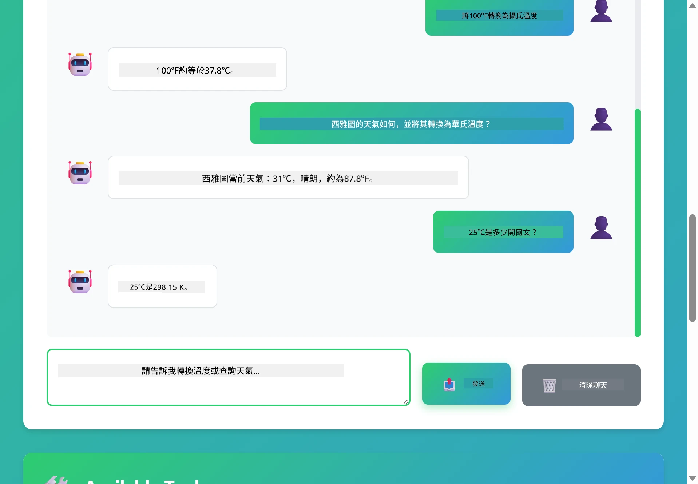

# Module 04: 使用工具的 AI 代理

## 目錄

- [影片導覽](#影片導覽)
- [你將學到的內容](#你將學到的內容)
- [先決條件](#先決條件)
- [理解帶有工具的 AI 代理](#理解帶有工具的-ai-代理)
- [工具呼叫如何運作](#工具呼叫如何運作)
  - [工具定義](#工具定義)
  - [決策制定](#決策制定)
  - [執行](#執行)
  - [回應生成](#回應生成)
  - [架構：Spring Boot 自動配線](#架構：spring-boot-自動配線)
- [工具串連](#工具串連)
- [執行應用程式](#執行應用程式)
- [使用應用程式](#使用應用程式)
  - [嘗試簡單工具用法](#嘗試簡單工具使用)
  - [測試工具串連](#測試工具串接)
  - [查看對話流程](#觀看對話流程)
  - [嘗試不同請求](#嘗試不同請求組合)
- [核心概念](#主要概念)
  - [ReAct 模式（推理與行動）](#react-模式（推理與行動）)
  - [工具描述的重要性](#工具描述很重要)
  - [會話管理](#會話管理)
  - [錯誤處理](#錯誤處理)
- [可用工具](#可用工具)
- [何時使用基於工具的代理](#何時使用基於工具的代理)
- [工具與 RAG 的比較](#工具-vs-rag)
- [下一步](#下一步)

## 影片導覽

觀看這個現場教學，了解如何開始使用本模組：

<a href="https://www.youtube.com/watch?v=O_J30kZc0rw"></a>

## 你將學到的內容

到目前為止，你已經學會如何與 AI 進行對話、有效結構化提示語，並以文件為基礎生成回應。但仍有一個根本限制：語言模型只能生成文本。它不能查詢天氣、執行計算、查詢資料庫或與外部系統互動。

工具改變了這一點。通過給模型調用函數的能力，你將它從純文字生成器轉變為能執行動作的代理。模型決定什麼時候需要工具、使用哪個工具，以及傳遞什麼參數。你的程式碼執行該函數並返回結果，模型將結果整合到回應中。

## 先決條件

- 完成 [Module 01 - 介紹](../01-introduction/README.md)（部署了 Azure OpenAI 資源）
- 建議完成之前的模組（本模組在 Tools vs RAG 比較中參考了[Module 03 中的 RAG 概念](../03-rag/README.md)）
- 在根目錄擁有包含 Azure 憑證的 `.env` 檔案（由 Module 01 中的 `azd up` 指令創建）

> **注意：** 若尚未完成 Module 01，請先按照那裡的部署說明操作。

## 理解帶有工具的 AI 代理

> **📝 注意：** 本模組中「代理」一詞指的是具備工具呼叫能力的 AI 助理。這與我們將在 [Module 05: MCP](../05-mcp/README.md) 裡涵蓋的<strong>Agentic AI</strong> 模式（具備規劃、記憶及多步推理的自主代理）不同。

沒有工具時，語言模型只能從訓練資料生成文字。問當前天氣，它只能猜測。給它工具，它就能呼叫天氣 API、執行計算或查詢資料庫，然後將這些真實結果融入回應。


*沒有工具時模型只能猜測；有了工具，它可以呼叫 API、跑計算並返回即時資料。*

搭載工具的 AI 代理遵循一種 **推理與行動（ReAct）** 模式。模型不只是回應——它思考需求、透過呼叫工具行動、觀察結果，接著決定是否再行動或給出最終答案：

1. <strong>推理</strong> — 代理分析用戶問題，判斷需要什麼資訊
2. <strong>行動</strong> — 選擇合適工具、生成正確參數並呼叫
3. <strong>觀察</strong> — 接收工具輸出並評估結果
4. <strong>重複或回應</strong> — 若需更多資料，回到第一步；否則撰寫自然語言答案


*ReAct 循環 — 代理推理需做什麼，呼叫工具行動，觀察結果，反覆迴圈直到能給出答案。*

這是自動發生的。你定義工具及其描述，模型負責判斷何時、如何使用它們。

## 工具呼叫如何運作

### 工具定義

[WeatherTool.java](../../../04-tools/src/main/java/com/example/langchain4j/agents/tools/WeatherTool.java) | [TemperatureTool.java](../../../04-tools/src/main/java/com/example/langchain4j/agents/tools/TemperatureTool.java)

你定義具清晰描述和參數規格的函數。模型會在系統提示中看到這些描述，明白每個工具的功能。

```java
@Component
public class WeatherTool {
    
    @Tool("Get the current weather for a location")
    public String getCurrentWeather(@P("Location name") String location) {
        // 您的天氣查詢邏輯
        return "Weather in " + location + ": 22°C, cloudy";
    }
}

@AiService
public interface Assistant {
    String chat(@MemoryId String sessionId, @UserMessage String message);
}

// 助理由 Spring Boot 自動連接:
// - ChatModel Bean
// - 所有來自 @Component 類別的 @Tool 方法
// - 用於會話管理的 ChatMemoryProvider
```

下圖解構每個註解，展示每部分如何幫助 AI 理解何時呼叫工具及傳遞哪些參數：


*工具定義結構 — @Tool 告訴 AI 何時使用它，@P 描述每個參數，@AiService 在啟動時自動連接所有部分。*

> **🤖 嘗試使用 [GitHub Copilot](https://github.com/features/copilot) 聊天：** 打開 [`WeatherTool.java`](../../../04-tools/src/main/java/com/example/langchain4j/agents/tools/WeatherTool.java) 並詢問：
> - 「我該如何整合像 OpenWeatherMap 這樣的真實天氣 API，而不是使用模擬資料？」
> - 「什麼樣的工具描述能幫助 AI 正確使用工具？」
> - 「如何在工具實作中處理 API 錯誤和速率限制？」

### 決策制定

當用戶問「西雅圖今天天氣如何？」時，模型不會隨機選工具。它將用戶意圖與所有工具描述比對，針對相關性打分並選擇最適合的工具。接著生成結構化函數調用，這裡是設置 `location` 為 `"Seattle"`。

若沒有工具匹配用戶請求，模型則從自身知識庫回答。若多個工具匹配，則選擇最具體的。


*模型評估所有可用工具與用戶意圖比對並挑選最佳匹配——這就是為何撰寫清晰、具體的工具描述很重要。*

### 執行

[AgentService.java](../../../04-tools/src/main/java/com/example/langchain4j/agents/service/AgentService.java)

Spring Boot 自動配線所有用 `@AiService` 宣告的工具介面，LangChain4j 會自動執行工具呼叫。幕後，一個完整的工具呼叫流程涵蓋六個階段——從用戶的自然語言提問一直到回覆自然語言的答案：


*端到端流程——用戶問問題，模型選擇工具，LangChain4j 執行工具，模型將結果融入自然回應中。*

幕後，`AiServices` 對任一工具運行相同的工具呼叫循環——此處以簡單的 `Calculator` 展示。下方時序圖精確呈現幕後發生的流程：


*工具呼叫循環——`AiServices` 傳送你的訊息與工具結構給 LLM，LLM 回覆如 `add(42, 58)` 的函數調用，LangChain4j 在本機執行 `Calculator` 方法，並將結果回饋用於最終答案。*

> **🤖 嘗試使用 [GitHub Copilot](https://github.com/features/copilot) 聊天：** 開啟 [`AgentService.java`](../../../04-tools/src/main/java/com/example/langchain4j/agents/service/AgentService.java) 並詢問：
> - 「ReAct 模式如何運作，為什麼對 AI 代理有效？」
> - 「代理如何決定使用哪個工具以及順序？」
> - 「如果工具執行失敗，怎麼穩健處理錯誤？」

### 回應生成

模型接收天氣資料，並將其格式化為自然語言回應給用戶。

### 架構：Spring Boot 自動配線

本模組使用 LangChain4j 與 Spring Boot 的整合，搭配宣告式 `@AiService` 介面。Spring Boot 啟動時會發現所有包含 `@Tool` 的 `@Component`，你的 `ChatModel` bean，以及 `ChatMemoryProvider`，然後全部自動配線成單一的 `Assistant` 介面，免去手動撰寫樣板程式。


*@AiService 介面將 ChatModel、工具組件與記憶提供者串接在一起——Spring Boot 自動負責所有配線。*

完整請求生命週期如下時序圖示——從 HTTP 請求經過控制器、服務、及自動配線代理，一路到工具執行及回應：


*完整 Spring Boot 請求生命週期——HTTP 請求流經控制器與服務到自動配線的 Assistant 代理，再自動協作 LLM 與工具呼叫。*

此方法的主要優勢：

- **Spring Boot 自動配線** — ChatModel 與工具自動注入
- **@MemoryId 模式** — 自動處理基於會話的記憶管理
- <strong>單一實例</strong> — Assistant 實例只建立一次，提高效能
- <strong>型別安全執行</strong> — 直接用 Java 方法呼叫並轉換型別
- <strong>多輪協調</strong> — 自動處理工具串連
- <strong>零樣板程式</strong> — 無需手寫 `AiServices.builder()` 或管理記憶 HashMap

手動方式（自行使用 `AiServices.builder()`）需更多程式碼，且失去 Spring Boot 整合的優勢。

## 工具串連

<strong>工具串連</strong> — 基於工具的代理真正威力在於一個問題需要多個工具時展現。問「西雅圖的天氣是幾華氏度？」代理會自動串連兩個工具：先呼叫 `getCurrentWeather` 取得攝氏溫度，再將該值傳入 `celsiusToFahrenheit` 轉換——整個流程在同一回合對話中完成。


*工具串連實例——代理先呼叫 getCurrentWeather，然後將攝氏結果傳給 celsiusToFahrenheit，最後給出合成答案。*

<strong>優雅失敗</strong> — 詢問模擬資料內沒有的城市天氣，工具會回傳錯誤訊息，AI 會說明無法提供幫助而非崩潰。工具故障安全。下圖對比兩種方式——有適當錯誤處理時，代理捕捉例外並以協助回應；無則整個應用崩潰：


*當工具失敗時，代理會捕捉錯誤並以有用說明回應，而非崩潰。*

這發生在單一次對話回合內。代理可以自主協調多次工具呼叫。

## 執行應用程式

**確認部署：**

確保根目錄存在包含 Azure 憑證的 `.env` 檔案（在 Module 01 部署期間建立）。從本模組目錄 (`04-tools/`) 執行：

**Bash:**
```bash
cat ../.env  # 應該顯示 AZURE_OPENAI_ENDPOINT、API_KEY、DEPLOYMENT
```

**PowerShell:**
```powershell
Get-Content ..\.env  # 應該顯示 AZURE_OPENAI_ENDPOINT、API_KEY、DEPLOYMENT
```

**啟動應用程式：**

> **注意：** 若你已從根目錄用 `./start-all.sh` 啟動所有應用程式（如 Module 01 所述），本模組已在 8084 埠運行，可跳過下列啟動指令，直接前往 http://localhost:8084。

**選項 1：使用 Spring Boot Dashboard（推薦 VS Code 使用者）**

開發容器已包含 Spring Boot Dashboard 擴充套件，提供視覺化介面管理所有 Spring Boot 應用程式。在 VS Code 左側活動列可看到（尋找 Spring Boot 圖示）。

透過 Spring Boot Dashboard，你可以：
- 查看工作區內所有 Spring Boot 應用程式
- 一鍵啟動/停止應用程式
- 即時檢視應用程式日誌
- 監控應用程式狀態

只要點擊「tools」旁的播放按鈕即可啟動本模組，或者一次啟動所有模組。

以下是 VS Code 中 Spring Boot Dashboard 的介面：


*VS Code 中的 Spring Boot 儀表板 — 從一個地方啟動、停止並監控所有模組*

**選項 2：使用 shell 腳本**

啟動所有 Web 應用程式（模組 01-04）：

**Bash:**
```bash
cd ..  # 從根目錄
./start-all.sh
```

**PowerShell:**
```powershell
cd ..  # 從根目錄開始
.\start-all.ps1
```

或僅啟動此模組：

**Bash:**
```bash
cd 04-tools
./start.sh
```

**PowerShell:**
```powershell
cd 04-tools
.\start.ps1
```

這兩個腳本會自動從根目錄的 `.env` 檔案載入環境變數，若 JAR 檔案不存在會自動建置。

> **注意：** 如果你偏好在啟動前手動建置所有模組：
>
> **Bash:**
> ```bash
> cd ..  # Go to root directory
> mvn clean package -DskipTests
> ```
>
> **PowerShell:**
> ```powershell
> cd ..  # Go to root directory
> mvn clean package -DskipTests
> ```

在瀏覽器開啟 http://localhost:8084 。

**停止命令：**

**Bash:**
```bash
./stop.sh  # 僅此模組
# 或
cd .. && ./stop-all.sh  # 所有模組
```

**PowerShell:**
```powershell
.\stop.ps1  # 僅此模組
# 或
cd ..; .\stop-all.ps1  # 所有模組
```

## 使用應用程式

應用程式提供一個網頁界面，可以與一個能存取天氣和溫度轉換工具的 AI 代理互動。介面長這樣 — 包含快速示範範例以及用於發送請求的聊天面板：

<a href="images/tools-homepage.png"></a>

*AI 代理工具介面 — 快速範例與用於互動的聊天介面*

### 嘗試簡單工具使用

從一個簡單請求開始：「將 100 華氏度轉換為攝氏度」。代理能辨識到需要使用溫度轉換工具，並以正確參數呼叫，返回結果。你會發現非常自然 — 你沒指定要用哪個工具、該如何呼叫。

### 測試工具串接

接著嘗試更複雜的請求：「西雅圖的天氣如何，並將其轉換為華氏度？」觀察代理如何步驟式處理。它先取得天氣（回傳攝氏度），辨識後續需轉成華氏度，再呼叫轉換工具，最後將兩者結果合併回應。

### 觀看對話流程

聊天介面會保留對話歷史，讓你能多輪互動。你能看到所有先前查詢與回答，方便追蹤對話並理解代理如何在多次交換中建立上下文。

<a href="images/tools-conversation-demo.png"></a>

*多輪對話示範，包含簡單轉換、天氣查詢與工具串接*

### 嘗試不同請求組合

嘗試以下各種情境：
- 天氣查詢：「東京今天天氣如何？」
- 溫度轉換：「25°C 是幾開爾文？」
- 結合查詢：「查巴黎天氣，並告訴我是否超過 20°C」

注意代理是如何將自然語言解讀成適合的工具呼叫。

## 主要概念

### ReAct 模式（推理與行動）

代理在推理（決定要做什麼）與行動（使用工具）之間交替。這種模式使其能自主解決問題，而非僅是回覆指令。

### 工具描述很重要

工具的描述品質直接影響代理使用工具的效能。清楚、具體的描述能幫助模型了解何時以及如何呼叫各工具。

### 會話管理

`@MemoryId` 標註啟用自動的會話記憶管理。每個會話 ID 都會有屬於自己的 `ChatMemory` 實例，由 `ChatMemoryProvider` bean 管理，因此多個使用者能同時和代理互動，彼此對話不會互相干擾。下圖展示如何根據會話 ID 將多個使用者導向隔離的記憶存儲：


*每個會話 ID 對應獨立的對話歷史 — 使用者永遠不會看到彼此訊息。*

### 錯誤處理

工具可能會失敗——API 超時、參數不合法、外部服務故障。正式環境中的代理需要錯誤處理，讓模型能解釋問題或嘗試替代方案，而不是讓整個應用崩潰。工具拋出例外時，LangChain4j 會捕捉並將錯誤訊息回饋給模型，模型接著用自然語言解釋問題。

## 可用工具

下圖展示你可以建立的廣泛工具生態系統。此模組示範天氣和溫度工具，但同樣的 `@Tool` 模式適用於任何 Java 方法——從資料庫查詢到支付處理皆可。


*任何用 @Tool 標註的 Java 方法都能讓 AI 使用——此模式擴及資料庫、API、電子郵件、檔案操作等。*

## 何時使用基於工具的代理

並非每個請求都需要工具。決策基準是 AI 是否需要和外部系統互動，或能從自身知識庫回答。下圖總結何時工具能增加價值，何時則無需：


*快速決策參考——工具適用於即時資料、計算與操作；一般知識與創意工作不需要。*

## 工具 vs RAG

模組 03 與 04 都擴展 AI 功能，但方式本質不同。RAG 透過文件檢索給模型提供<strong>知識</strong>，工具讓模型能呼叫函數執行<strong>動作</strong>。下圖並列比較兩種方法工作流程及權衡：


*RAG 從靜態文件檢索資訊——工具則執行操作並取得即時動態資料。許多正式系統同時結合兩者。*

實務上，許多正式系統會結合兩種方法：用 RAG 讓答案有文件依據，用工具抓取即時資料或執行操作。

## 下一步

**下一模組：** [05-mcp - 模型上下文協定 (MCP)](../05-mcp/README.md)

---

**導覽：** [← 上一章：模組 03 - RAG](../03-rag/README.md) | [回主頁](../README.md) | [下一章：模組 05 - MCP →](../05-mcp/README.md)

---

<!-- CO-OP TRANSLATOR DISCLAIMER START -->
**免責聲明**：
此文件已使用 AI 翻譯服務 [Co-op Translator](https://github.com/Azure/co-op-translator) 進行翻譯。雖然我們努力追求準確性，但請注意自動翻譯可能包含錯誤或不準確之處。原始文件的母語版本應視為權威來源。對於關鍵資訊，建議採用專業人工翻譯。我們不對因使用此翻譯所產生的任何誤解或誤譯承擔責任。
<!-- CO-OP TRANSLATOR DISCLAIMER END -->