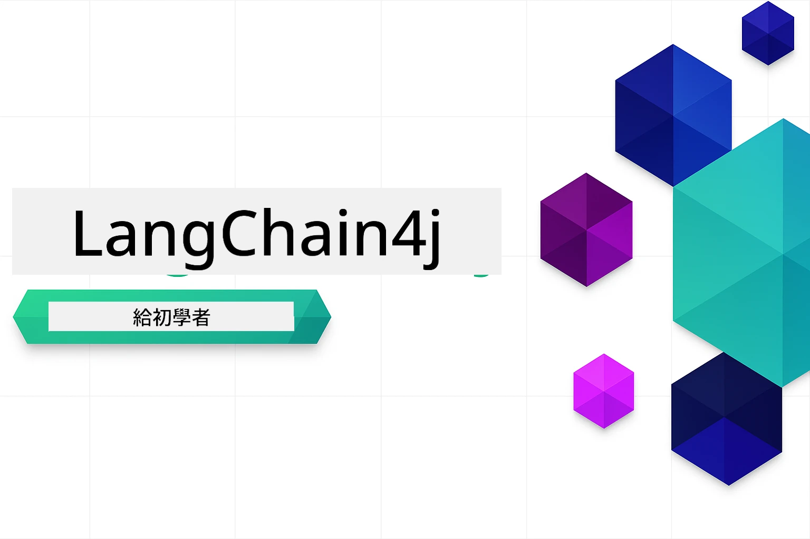

# LangChain4j 新手入門

一門使用 LangChain4j 和 Azure OpenAI GPT-5.2 構建 AI 應用的課程，從基礎聊天到 AI 代理。

### 🌐 多語言支援

#### 透過 GitHub Action 支援（自動且保持最新）

<!-- CO-OP TRANSLATOR LANGUAGES TABLE START -->
[阿拉伯文](../ar/README.md) | [孟加拉文](../bn/README.md) | [保加利亞文](../bg/README.md) | [緬甸文](../my/README.md) | [中文（簡體）](../zh-CN/README.md) | [中文（繁體，香港）](../zh-HK/README.md) | [中文（繁體，澳門）](../zh-MO/README.md) | [中文（繁體，台灣）](./README.md) | [克羅地亞文](../hr/README.md) | [捷克文](../cs/README.md) | [丹麥文](../da/README.md) | [荷蘭文](../nl/README.md) | [愛沙尼亞文](../et/README.md) | [芬蘭文](../fi/README.md) | [法文](../fr/README.md) | [德文](../de/README.md) | [希臘文](../el/README.md) | [希伯來文](../he/README.md) | [印地文](../hi/README.md) | [匈牙利文](../hu/README.md) | [印尼文](../id/README.md) | [義大利文](../it/README.md) | [日文](../ja/README.md) | [卡納達文](../kn/README.md) | [高棉文](../km/README.md) | [韓文](../ko/README.md) | [立陶宛文](../lt/README.md) | [馬來文](../ms/README.md) | [馬拉雅拉姆文](../ml/README.md) | [馬拉地文](../mr/README.md) | [尼泊爾文](../ne/README.md) | [奈及利亞皮欽語](../pcm/README.md) | [挪威文](../no/README.md) | [波斯文 (法爾西語)](../fa/README.md) | [波蘭文](../pl/README.md) | [葡萄牙文（巴西）](../pt-BR/README.md) | [葡萄牙文（葡萄牙）](../pt-PT/README.md) | [旁遮普文（古魯穆奇文）](../pa/README.md) | [羅馬尼亞文](../ro/README.md) | [俄文](../ru/README.md) | [塞爾維亞文（西里爾字母）](../sr/README.md) | [斯洛伐克文](../sk/README.md) | [斯洛維尼亞文](../sl/README.md) | [西班牙文](../es/README.md) | [斯瓦希里文](../sw/README.md) | [瑞典文](../sv/README.md) | [他加祿文（菲律賓語）](../tl/README.md) | [泰米爾文](../ta/README.md) | [泰盧固文](../te/README.md) | [泰文](../th/README.md) | [土耳其文](../tr/README.md) | [烏克蘭文](../uk/README.md) | [烏爾都文](../ur/README.md) | [越南文](../vi/README.md)

> **想要本機克隆嗎？**
>
> 此存儲庫包括 50 多種語言的翻譯，會大幅增加下載大小。若要在不包含翻譯的情況下克隆，請使用稀疏檢出：
>
> **Bash / macOS / Linux：**
> ```bash
> git clone --filter=blob:none --sparse https://github.com/microsoft/LangChain4j-for-Beginners.git
> cd LangChain4j-for-Beginners
> git sparse-checkout set --no-cone '/*' '!translations' '!translated_images'
> ```
>
> **CMD（Windows）：**
> ```cmd
> git clone --filter=blob:none --sparse https://github.com/microsoft/LangChain4j-for-Beginners.git
> cd LangChain4j-for-Beginners
> git sparse-checkout set --no-cone "/*" "!translations" "!translated_images"
> ```
>
> 這提供了完成課程所需的一切，且下載速度更快。

<!-- CO-OP TRANSLATOR LANGUAGES TABLE END -->

## 目錄

1. [導論](01-introduction/README.md) - 學習 LangChain4j 的基礎知識
2. [提示工程](02-prompt-engineering/README.md) - 精通有效的提示設計
3. [RAG（檢索增強生成）](03-rag/README.md) - 建構智能知識基礎系統
4. [工具](04-tools/README.md) - 整合外部工具與簡易助理
5. [MCP（模型上下文協定）](05-mcp/README.md) - 使用模型上下文協定（MCP）與代理模組

### 影片導覽

每個模組都有伴隨的直播課程，逐步講解概念與程式碼。

| 模組 | 影片 |
|--------|-------|
| 01 - 導論 | [LangChain4j 入門指南](https://www.youtube.com/live/nl_troDm8rQ) |
| 02 - 提示工程 | [LangChain4j 提示工程](https://www.youtube.com/live/PJ6aBaE6bog) |
| 03 - RAG | [LangChain4j RAG](https://www.youtube.com/watch?v=_olq75ZH_eY) |
| 04 - 工具 ＆ 05 - MCP | [搭配工具與 MCP 的 AI 代理](https://www.youtube.com/watch?v=O_J30kZc0rw) |

---

## 學習路徑

**初次接觸 LangChain4j？** 請參閱 [術語表](docs/GLOSSARY.md) 以了解關鍵詞與概念定義。

> <strong>快速開始</strong>

1. 將本存儲庫分支到你的 GitHub 帳號
2. 點選 **Code** → **Codespaces** 標籤 → **...** → **New with options...**
3. 使用預設值—這將選擇本課程創建的開發容器
4. 點選 **Create codespace**
5. 等待 5-10 分鐘，環境就緒
6. 直接跳到 [導論](./01-introduction/README.md) 開始學習！

完成模組後，探索 [測試指南](docs/TESTING.md)，親自體驗 LangChain4j 測試概念。

> **注意：** 本訓練使用 Azure OpenAI。若尚未擁有帳號，請先申請 [免費 Azure 帳戶](https://aka.ms/azure-free-account)。

## 使用 GitHub Copilot 進行學習

要快速開始寫程式，請在 GitHub Codespace 或帶有提供的 devcontainer 的本地 IDE 中打開此專案。本課程中的 devcontainer 預先配置了 GitHub Copilot，支援 AI 配對程式設計。

每個程式碼範例都包含你可以問 GitHub Copilot 的建議問題，幫助你深化理解。請留意以下中的 💡/🤖 提示：

- **Java 檔案標頭** - 專屬於每個範例的問題
- **模組 README** - 程式碼範例後的深度探索提示

**使用方式：** 打開任一程式碼檔案，並提出建議中的問題。Copilot 擁有完整程式碼庫上下文，可為你解說、擴展及建議替代方案。

想了解更多？請參考 [GitHub Copilot 的 AI 配對程式設計](https://aka.ms/GitHubCopilotAI)。

## 其他資源

<!-- CO-OP TRANSLATOR OTHER COURSES START -->
### LangChain
[](https://aka.ms/langchain4j-for-beginners)
[](https://aka.ms/langchainjs-for-beginners?WT.mc_id=m365-94501-dwahlin)
[](https://github.com/microsoft/langchain-for-beginners?WT.mc_id=m365-94501-dwahlin)
---

### Azure / Edge / MCP / 代理
[](https://github.com/microsoft/AZD-for-beginners?WT.mc_id=academic-105485-koreyst)
[](https://github.com/microsoft/edgeai-for-beginners?WT.mc_id=academic-105485-koreyst)
[](https://github.com/microsoft/mcp-for-beginners?WT.mc_id=academic-105485-koreyst)
[](https://github.com/microsoft/ai-agents-for-beginners?WT.mc_id=academic-105485-koreyst)

---
 
### 生成式 AI 系列
[](https://github.com/microsoft/generative-ai-for-beginners?WT.mc_id=academic-105485-koreyst)
[-9333EA?style=for-the-badge&labelColor=E5E7EB&color=9333EA)](https://github.com/microsoft/Generative-AI-for-beginners-dotnet?WT.mc_id=academic-105485-koreyst)
[-C084FC?style=for-the-badge&labelColor=E5E7EB&color=C084FC)](https://github.com/microsoft/generative-ai-for-beginners-java?WT.mc_id=academic-105485-koreyst)
[-E879F9?style=for-the-badge&labelColor=E5E7EB&color=E879F9)](https://github.com/microsoft/generative-ai-with-javascript?WT.mc_id=academic-105485-koreyst)

---
 
### 核心學習
[](https://aka.ms/ml-beginners?WT.mc_id=academic-105485-koreyst)
[](https://aka.ms/datascience-beginners?WT.mc_id=academic-105485-koreyst)
[](https://aka.ms/ai-beginners?WT.mc_id=academic-105485-koreyst)
[](https://github.com/microsoft/Security-101?WT.mc_id=academic-96948-sayoung)

[](https://aka.ms/webdev-beginners?WT.mc_id=academic-105485-koreyst)
[](https://aka.ms/iot-beginners?WT.mc_id=academic-105485-koreyst)
[](https://github.com/microsoft/xr-development-for-beginners?WT.mc_id=academic-105485-koreyst)

---
 
### Copilot 系列
[](https://aka.ms/GitHubCopilotAI?WT.mc_id=academic-105485-koreyst)
[](https://github.com/microsoft/mastering-github-copilot-for-dotnet-csharp-developers?WT.mc_id=academic-105485-koreyst)
[](https://github.com/microsoft/CopilotAdventures?WT.mc_id=academic-105485-koreyst)
<!-- CO-OP TRANSLATOR OTHER COURSES END -->

## 獲取幫助

如果遇到困難或對建立 AI 應用有任何問題，請加入：

[](https://aka.ms/foundry/discord)

如果您在開發過程中有產品反饋或錯誤，請訪問：

[](https://aka.ms/foundry/forum)

## 授權

MIT 授權 - 請參閱 [LICENSE](../../LICENSE) 文件了解詳情。

---

<!-- CO-OP TRANSLATOR DISCLAIMER START -->
**免責聲明**：
此文件已使用 AI 翻譯服務 [Co-op Translator](https://github.com/Azure/co-op-translator) 進行翻譯。雖然我們努力追求準確性，但請注意自動翻譯可能包含錯誤或不準確之處。原始文件的母語版本應視為權威來源。對於關鍵資訊，建議採用專業人工翻譯。我們不對因使用此翻譯所產生的任何誤解或誤譯承擔責任。
<!-- CO-OP TRANSLATOR DISCLAIMER END -->